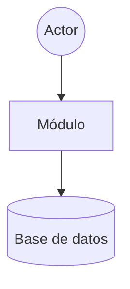

# mermaid-diagrams — Diagramas Mermaid

Crea y exporta diagramas Mermaid para la licitación TFEP-01/2026. La fuente es
texto en un bloque ```mermaid dentro de los `.md` de la propuesta (versionable).

## Tipos recomendados por AGENTS.md

- Flujo, arquitectura, secuencia, ER, C4 → **Mermaid** (por defecto).
- Rubería: GitHub renderiza nativo; exportar vía `mmdc`.

## Exportación

```
mmdc -i archivo.mmd -o archivo.svg
mmdc -i archivo.mmd -o archivo.png
mmdc -i archivo.mmd -o archivo.pdf
```

Guardar el exportado en `Diagramas/`.

## Estructura base



## Cómo debe verse la arquitectura de Puelche en Mermaid

- Boot: capas ordenadas Cliente → Presentación → Negocio → Cache/Offline →
  Datos (híbrida) → Servicios externos.
- Mostrar el carácter híbrido (on-prem por CD + nube analítica/DR) y offline-first.
- Evitar diagramas genéricos: cada caja debe ser propia de la solución.

## Verificación

- Validar sintaxis Mermaid antes de exportar.
- Confirmar que el `.md` es la fuente y que `Diagramas/` contiene el exportado.