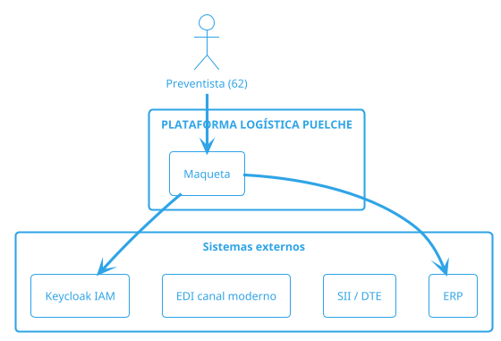

# plantuml-diagrams — Diagramas PlantUML/UML-C4

Crea diagramas PlantUML (.puml) y los renderiza a imagen. Se reserva para UML/C4
formal (p. ej. diagramas de contexto y de contenedores C4). Para flujos/ERse
prefiere Mermaid (ver `mermaid-diagrams` y `AGENTS.md`).

## Exportación vía Kroki

```
curl https://kroki.io/plantuml/svg -d 'delimiter=@d && enc poner la @startuml'
curl https://kroki.io/plantuml/png -d_..._'
```

Regla práctica: enviar el código PlantUML y guardar la imagen en `Diagramas/`.

## Patrón C4 de contexto (referencia Puelche)



## Convenciones

- Codificación UTF-8; tildes conservadas.
- Diagramas de la arquitectura lógica adoptada: 6 capas y 12 módulos M1–M12.
- Registrar el diagrama en `Diagramas/` y su fuente en el `.md`.

## Verificación

- Exportar siempre los `.puml` a imagen (no dejar solo el texto).
- Validar que el C4 de contenedores respete el carácter híbrido y offline.