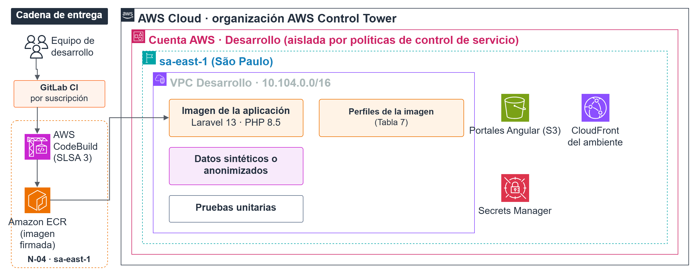
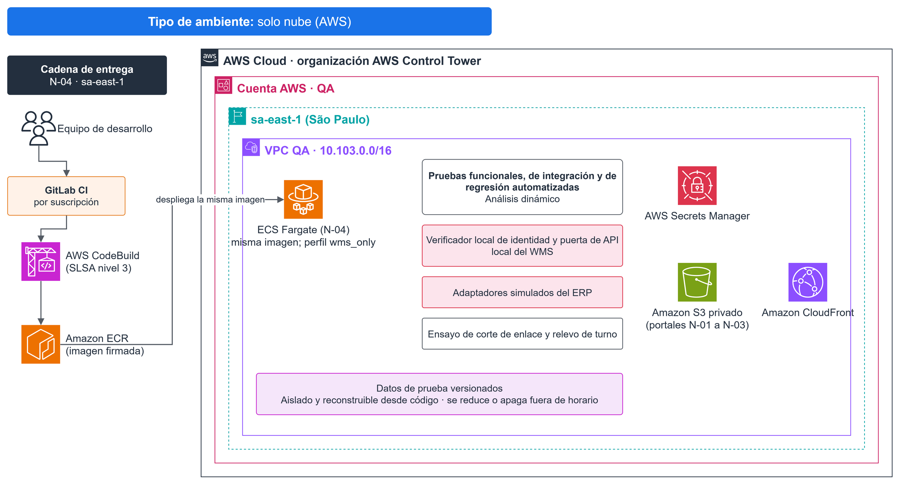
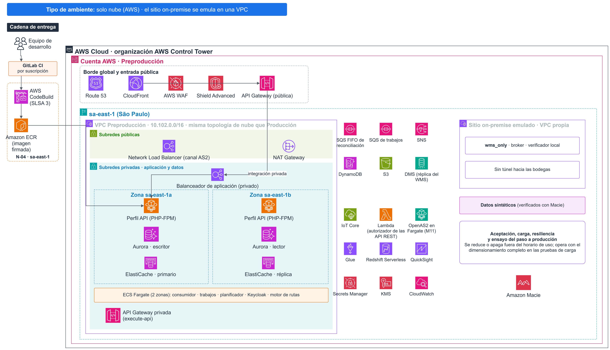
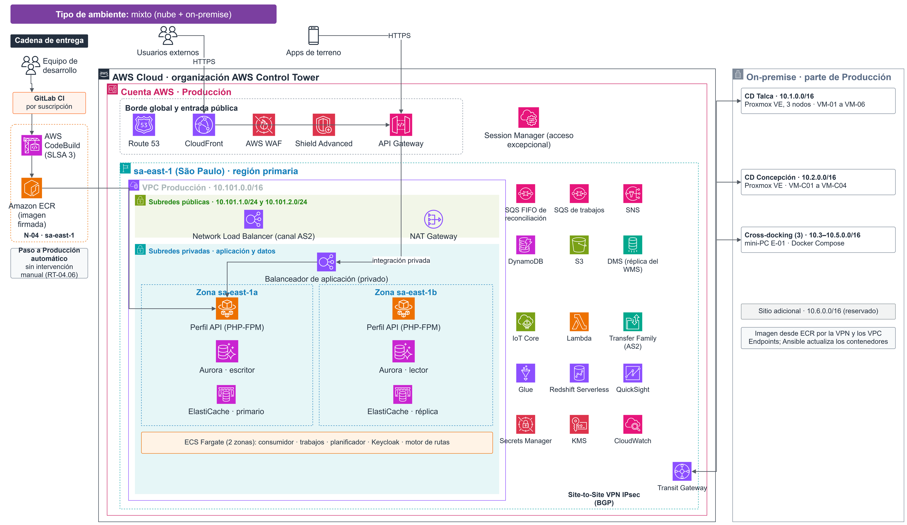
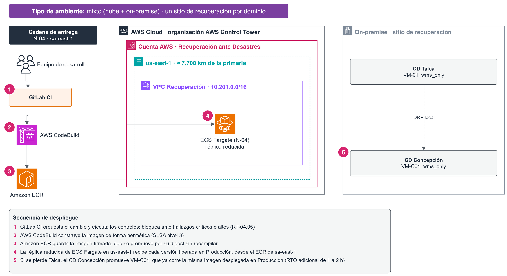

# Capítulo 4 · Arquitectura Física y de Despliegue de la Solución (Parte 4.2) {-}

*Parte 4.2 del subdocumento 4. La arquitectura lógica es la parte 4.1 y se entrega por separado; ambas comparten el registro de decisiones y la volumetría, y se leen juntas.*

## Visión general de la arquitectura física

La arquitectura física materializa el despliegue híbrido obligatorio del Artículo 16° de las Bases Administrativas. La carga principal corre en nube pública AWS, con la región primaria en sa-east-1 (São Paulo, Brasil) y la recuperación ante desastres en us-east-1 (Norte de Virginia, EE. UU.). Los componentes on-premise garantizan la continuidad de la operación de bodega, plataformas y terreno durante cortes del enlace.

La red de instalaciones de la solución son 5 instalaciones en cuatro regiones. La proyección del caso a tres años incorpora una sexta instalación, sin requerir cambios en desarrollo o en crecimiento de servidores en CD Talca.

Los principios que gobiernan el diseño son los siguientes:

- **Carga principal en nube:** El núcleo transaccional de preventa, reparto y canal moderno, la analítica, la integración y el almacenamiento consolidado se ejecutan en AWS sa-east-1, con escalado elástico para el peak de septiembre.
- **Autonomía total de la operación de bodega:** El picking, despacho, recepción y conteo corren siempre contra los servidores del centro de distribución, no contra la nube. La conexión a internet no interviene en la operación de bodega.

## Modelo de emplazamiento híbrido

La solución se despliega en dos dominios, la nube pública y el on-premise, conectados por túneles VPN cifrados. Cada dominio puede operar de forma independiente cuando el enlace no está disponible.

### Dominio nube (AWS sa-east-1)

La nube concentra la carga principal de la solución. Todos los servicios se despliegan en al menos dos zonas de disponibilidad dentro de la región sa-east-1, de modo que la caída de un centro de datos de AWS no interrumpe la operación. La aplicación Laravel 13 sobre PHP 8.5 corre en contenedores ECS Fargate, en perfiles separados de API, consumo de reconciliación, trabajos y planificación, y atiende los procesos de preventa, reparto, canal moderno y el portal de clientes. Aurora PostgreSQL almacena la base de datos transaccional maestra: recibe por DMS una réplica de lectura del WMS de cada bodega, para continuidad y consulta, y actualiza el estado central con los eventos de reconciliación que publican los sitios.

Todo el tráfico externo ingresa por API Gateway, donde WAF v2 valida las solicitudes y Shield protege contra ataques de denegación de servicio, antes de que el tráfico alcance la aplicación. Cuando las bodegas reconectan tras un corte de enlace, el shipper de cada sitio publica los eventos pendientes como sobres JSON versionados en la cola SQS FIFO de reconciliación, que los entrega en orden dentro de cada grupo y sin duplicados a un consumidor PHP dedicado. Cuando la aplicación registra un hecho relevante ---una entrega confirmada, una excursión térmica o un pedido del canal moderno---, despacha trabajos de Laravel en colas SQS separadas: enviar la notificación al cliente, actualizar los tableros analíticos, pedir al ERP, a través del trabajador erp-sync y la capa anticorrupción, la emisión del documento tributario y, en la etapa de cadenas de supermercados, transmitir el acuse por EDI.

La telemetría de cadena de frío llega desde los gateways Greengrass en las bodegas hasta IoT Core en la nube. La capa analítica se apoya en Redshift Serverless para consultas históricas de hasta 5 años, y QuickSight publica los tableros de gestión del CLIENTE. La observabilidad se consolida en CloudWatch, que recibe logs, métricas y trazas tanto de los servicios en nube como de los colectores on-premise cuando estos disponen de enlace, y expone los tableros de operación sin infraestructura adicional que mantener. La identidad la gobierna Keycloak, que corre como servicio maestro en Fargate y distribuye las credenciales hacia las cachés locales de cada sitio. Una réplica pasiva de la infraestructura crítica en us-east-1 sostiene la recuperación ante desastres.

### Dominio on-premise

Cada centro de distribución mantiene su propia pila local: la misma aplicación Laravel corre en el perfil wms_only contra una base PostgreSQL 16 local, un broker RabbitMQ que encola los eventos y una caché de Keycloak con el verificador local de relevo de turno. En CD Talca, un clúster Proxmox VE de 3 nodos con almacenamiento Ceph aloja las VMs (VM-01 a VM-06); en CD Concepción, un servidor de borde replica la misma pila en formato reducido (VM-C01 a VM-C04). Los tres cross-docking (Curicó, Chillán y Los Ángeles) operan con un mini-PC industrial que corre el WMS en Docker Compose. La capa anticorrupción del ERP (VM-04, Talca) es la única puerta hacia el sistema legado. Los gateways IoT Greengrass procesan la cadena de frío en el borde, con detección de excursión térmica y bloqueo de despacho 100 % local. Un NAS cifrado (D-05) guarda la pierna local de respaldo 3-2-1-1-0.

### Conexión entre dominios

Los dos dominios se conectan mediante túneles VPN IPsec Site-to-Site cifrados, terminados en firewalls de borde en el lado on-premise y en AWS VPN Gateway en el lado nube, con enrutamiento dinámico BGP que conmuta automáticamente entre enlaces en menos de 30 segundos. Los centros de distribución disponen de fibra óptica como enlace principal y LTE empresarial como respaldo; los cross-docking, que operan en naves industriales sin cobertura de fibra, usan Starlink como enlace principal y LTE como respaldo.

#### Flujos entre nube y on-premise

Por diseño Zero Trust, las conexiones entre los dos dominios fijos, la nube y el on-premise, se inician siempre desde el on-premise hacia la nube. Existen dos excepciones declaradas a esta regla. La primera es DMS, que lee el registro de escritura anticipada de PostgreSQL para replicar los cambios hacia Aurora. La segunda es el trabajador Laravel erp-sync, que consulta la capa anticorrupción del ERP. Ambas conexiones viajan por el mismo túnel IPsec autenticado y quedan auditadas. Los datos, en cambio, fluyen en ambos sentidos según lo requiere cada flujo:

- **Datos transaccionales:** la base PostgreSQL local replica continuamente sus cambios hacia Aurora en la nube a través de DMS CDC, con un objetivo de pérdida de datos de 15 minutos o menos.
- **Eventos de bodega:** las transacciones del WMS se encolan en RabbitMQ local y, al disponer de enlace, se vuelcan en orden cronológico a SQS FIFO en la nube para su reconciliación.
- **Telemetría de cadena de frío en bodega:** los sensores Ebyte ME31 instalados en las cámaras de frío del CD alimentan al gateway Greengrass en el borde, que procesa las alertas localmente y reenvía los registros a IoT Core en la nube por MQTTS.
- **Observabilidad:** los colectores ADOT locales almacenan métricas y trazas en disco durante un máximo de 24 horas y las envían a CloudWatch en la nube cuando el enlace está disponible.
- **Identidad:** Keycloak maestro en la nube exporta las credenciales de forma cifrada a través de S3, y las cachés locales de cada sitio las importan para sostener las sesiones de los operarios sin depender del enlace.

#### Flujos desde el terreno

El terreno agrupa los flujos que se originan físicamente fuera del centro de distribución y fuera de la nube. Son tres:

- **Preventa en calle:** los preventistas usan terminales Zebra EC55, equipos industriales con SIM 4G/LTE empresarial y lector GS1 integrado. Se comunican directamente con API Gateway en la nube a través de la red celular del operador, sin atravesar la red del centro de distribución. Cuando no hay señal, operan contra su almacén local de turno y sincronizan al reconectar de forma idempotente.
- **Reparto en calle:** los conductores usan terminales Zebra TC58e, también con SIM 4G/LTE empresarial. Se comunican directamente con API Gateway por la red celular durante los turnos de reparto y, cuando pierden señal en zonas rurales, operan contra su almacén local y sincronizan al reconectar.
- **Termógrafos de camión:** los termógrafos Onset InTemp CX450, calibrados contra patrón NIST, registran la temperatura del compartimento refrigerado de forma independiente y sin conexión a red durante toda la ruta. Al regresar el camión al centro de distribución, los datos se descargan por Bluetooth al gateway local del sitio y desde ahí se envían a IoT Core en la nube.

Cuando el enlace WAN cae, cada dominio sigue operando con su pila local: la bodega contra PostgreSQL y RabbitMQ locales, el terreno de calle contra su almacén local, y el cross-docking contra su WMS local. Al reconectar, la sincronización es determinista y no genera duplicados. El detalle de la autonomía por ámbito se desarrolla en la sección de operación desconectada de este mismo capítulo.

### Emplazamiento componente por componente

Las tablas 21a, 21b y 21c justifican la decisión de emplazamiento de cada componente conforme a los seis criterios del Art. 16.2: latencia tolerada, criticidad operacional, volumen de datos, restricciones regulatorias, disponibilidad de conectividad y costo total de propiedad. La columna Criterio indica cuál de ellos determina el emplazamiento, y la justificación explica qué hace el componente y por qué vive donde vive. Estas tablas responden a la pregunta *dónde* vive cada componente y *por qué*; el equipamiento físico ofertado (marca, modelo y cantidad) se detalla en el capítulo de implementos, y la infraestructura de sala del CD Talca (energía, clima, seguridad física y cableado) en el capítulo del sitio principal.

**Tabla 21a** — Emplazamiento: componentes de nube pura en AWS sa-east-1

| ID | Componente | Criterio | Justificación |
|---|---|---|---|
| N-01 | ECS Fargate | Costo | Ejecuta los perfiles de la aplicación Laravel en contenedores; cada perfil escala por su propia señal (la API de 2 a 4 tareas en el peak de septiembre, con techo de 8), sin mantener servidores permanentes ni equipamiento propio. |
| N-02 | Aurora PostgreSQL | Criticidad | Es la base transaccional maestra: opera en varias zonas de disponibilidad, se replica a us-east-1 con RTO ≤ 4 h y RPO ≤ 15 min, y amplía su almacenamiento sin intervención. |
| N-03 | Amazon S3 | Volumen y regulación | Guarda las evidencias de entrega, los DTE, la trazabilidad y la copia inmutable del respaldo, que crecen sin límite; Object Lock asegura la retención legal. |
| N-04 | SQS FIFO | Costo | Recibe la reconciliación de las bodegas en orden por sitio y sin duplicados, sin un broker propio que operar. |
| N-05 | AWS DMS | Volumen | Replica en forma continua los cambios de la base on-premise hacia Aurora sin desarrollo propio y sostiene un RPO de 15 min o menos. |
| N-06 | API Gateway | Regulación | Es la única entrada a las API y cumple lo que exige el Art. 21.2: validación de esquema, autenticación, cuotas y control de tasa, sin desarrollo propio. |
| N-07 | WAF v2 y Shield | Regulación y costo | Aplica las reglas gestionadas contra ataques OWASP y de denegación de servicio que exige el Art. 21.2, sin equipo dedicado que administrar. |
| N-08 | IoT Core | Volumen | Recibe los 13.200 mensajes diarios de cadena de frío por MQTTS y escala en forma automática. |
| N-09 | Secrets Manager y Parameter Store | Regulación | Cumple RT-04.09: guarda los secretos con rotación automática y sin credenciales embebidas, y los nodos on-premise los consumen en forma saliente por VPC Endpoint. |
| N-10 | CloudWatch | Costo | Recibe los logs, métricas y trazas de la nube y de los colectores on-premise, y los correlaciona con los servicios AWS sin operar un clúster de monitoreo. |
| N-11 | Security Lake y Macie | Regulación | Centraliza la correlación de eventos de seguridad y detecta en forma automática los datos personales y de pago para la auditoría. |
| N-12 | Redshift Serverless y QuickSight | Volumen y costo | Mantiene 5 años de datos analíticos separados de la base transaccional y publica los tableros del CLIENTE sin licencias de BI. |
| N-13 | Android Enterprise y Zebra DNA | Conectividad y costo | Gestiona en forma remota más de 462 dispositivos de terreno sin infraestructura propia, y lo opera el equipo de TI de 4 personas. |

**Tabla 21b** — Emplazamiento: componentes on-premise

| ID | Componente | Criterio | Justificación |
|---|---|---|---|
| L-01 | Proxmox VE | Criticidad | Virtualiza los 3 nodos del clúster de Talca. El hipervisor de la bodega no depende de la nube y el clúster N+1 opera 24 h sin enlace. |
| L-02 | Ceph | Criticidad | Almacena las VMs y los datos del WMS en 12 OSD con réplica 2, de modo que la falla de un disco no detiene la bodega. |
| L-03 | PostgreSQL 16 | Latencia y criticidad | Es la base de la bodega en VM-02 de Talca y VM-C02 de Concepción. El picking en cámara a −22 °C exige respuesta local y la bodega opera 24 h sin enlace; los cambios se replican a Aurora por DMS. |
| L-04 | RabbitMQ | Conectividad | Es el broker local en VM-03, VM-C04 y E-01: guarda hasta 24 h de transacciones durante un corte y las entrega en orden y sin duplicados al reconectar. |
| L-05 | Capa anticorrupción del ERP | Criticidad | Corre en VM-04 junto al ERP de 2017, fuente única de la información contable y tributaria, que reside en la red local sin exposición externa; la capa es su única puerta de entrada. |
| L-06 | NAS de respaldo | Conectividad | El equipo D-05 guarda la copia local cifrada de la regla 3-2-1-1-0 y permite restaurar el WMS en ≤ 4 h sin depender del enlace. |
| L-07 | Docker Compose | Conectividad | Ejecuta el WMS en el nodo E-01 de cada cross-docking, que no tiene fibra: la ventana de 3 h opera 100 % local y la instalación y el parcheo no dependen de la red. |
| L-08 | Greengrass v2 | Latencia | Corre en el gateway B-02, detecta la excursión térmica y bloquea el despacho en menos de 5 s, 100 % en el borde, con un buffer de 14 h. |
| L-09 | Colector ADOT | Conectividad | Corre en VM-06 y VM-C04, guarda la telemetría hasta 24 h en disco y la envía a la nube al reconectar. |
| L-10 | Firewall UTM | Criticidad | Los equipos D-01 y C13 terminan la VPN, segmentan la red y conmutan entre enlaces; en Talca operan en alta disponibilidad activo/pasivo. |
| L-11 | WLAN Wi-Fi 6E industrial | Latencia | Da cobertura en bodega y cámara de frío a 150 terminales RF simultáneos con respuesta ≤ 1 s en picking, sin depender del enlace WAN. |

**Tabla 21c** — Emplazamiento: componentes híbridos, con presencia en nube y on-premise

| ID | Componente | Nube | On-premise | Criterio | Justificación |
|---|---|---|---|---|---|
| H-01 | Aplicación Laravel | ECS Fargate: perfiles de API, consumo de reconciliación, trabajos y planificador para preventa, reparto, portal y canal moderno | VM-01, VM-C01 y E-01: WMS de bodega en el perfil wms_only; shipper en VM-03, VM-C04 y E-01 | Criticidad | La bodega opera contra su base local; el resto de los procesos escala en la nube, cada perfil por su propia señal. |
| H-02 | Keycloak | Maestro en Fargate con OIDC, MFA y SSO | Cachés de solo lectura de 24 h y verificador local de relevo en VM-05, VM-C03 y E-01 | Conectividad | La operación sobrevive a un corte de 24 h: la credencial de turno dura hasta 8 h en bodega y 14 h en terreno, y cada relevo sin enlace lo habilita el verificador con el manifiesto firmado y el PIN personal. |
| H-03 | Colas y trabajos | Fargate: consumidor PHP de la cola SQS FIFO de reconciliación y trabajos de Laravel (notificaciones, erp-sync y EDI) en colas SQS separadas | VM-03, VM-C04 y E-01: RabbitMQ y shipper PHP con php-amqplib | Criticidad | Las tareas de bodega no dependen de la nube; solo la reconciliación la requiere, y el formato externo nunca llega al deserializador de trabajos. |
| H-04 | OpenTelemetry | CloudWatch | Colectores ADOT con buffer de 24 h | Conectividad | La telemetría se difiere sin pérdida y se consolida en CloudWatch al reconectar. |
| H-05 | EDR | Consola de gestión y correlación | Agentes en cada VM y estación | Regulación | Cumple RT-11.16: detecta amenazas en las cargas de nube y on-premise con una respuesta centralizada. |
| H-06 | VPN IPsec Site-to-Site | AWS VPN Gateway con 2 túneles por CD | Firewall de borde como Customer Gateway | Conectividad | Cifra el enlace entre dominios, enruta con BGP y conmuta en forma automática entre enlaces. |
| H-07 | Ansible y Terraform | Terraform/CDK: infraestructura AWS | Ansible: configuración, parches y CIS en los 5 sitios | Costo | La infraestructura queda declarada como código, sin licencia de una plataforma de gestión. |

Figura 15. Diagrama de arquitectura física de la solución.

### Instalaciones de la red on-premise

La red on-premise se compone de seis instalaciones (Tabla 14.1 y RT-21.16):

- **CD Talca (sala técnica principal, sala blanca de 32 m²):** clúster WMS de 3 nodos, base transaccional on-premise (PostgreSQL 16, VM-02), broker local RabbitMQ (VM-03), capa anticorrupción del ERP (VM-04), caché de identidad (VM-05), telemetría (VM-06), respaldo NAS (D-05) y componentes de sala (UPS N+1, generador 12 kVA con estanque 24 h, clima N+1, seguridad física).
- **CD Concepción (9.000 m², gabinete de borde):** servidor de borde con el WMS (VM-C01), base local (VM-C02), caché de identidad (VM-C03), broker + telemetría (VM-C04) y Gateway IoT Greengrass (B-02); opera 24 h de forma autónoma e independiente de Talca.
- **Cross-docking de Curicó, Chillán y Los Ángeles:** nodo de cómputo industrial (E-01) con WMS y broker locales, enlace principal Starlink (D-06) y respaldo LTE dual (2 proveedores).
- **Casa matriz y oficinas centrales (Talca):** sin nodo de cómputo propio; acceso a la nube para administración, planificación y portal de clientes (RT-03.22).

La proyección a 3 años (RT-02.12) incorpora una séptima instalación; el gabinete de crecimiento de la sala (R04) absorbe esa expansión sin obras adicionales en el sitio principal.

### Operación desconectada

El modelo híbrido garantiza que ningún proceso operacional se detenga por pérdida del enlace WAN. Cada ámbito mantiene autonomía local con su propia base de datos, broker de mensajería y caché de identidad; al reconectar, la sincronización es idempotente y determinista, sin pérdida ni duplicación de transacciones. La Tabla 29 resume la autonomía por ámbito:

**Tabla 29** — Operación desconectada

| Ámbito | Autonomía | Cobertura funcional |
|---|---|---|
| Centro de distribución (CD Talca y Concepción) | ≥ 24 h | Recepción, preparación, despacho, conteo cíclico y trazabilidad contra la BD local; reconciliación determinista al reconectar (RT-03.12). |
| Terreno (preventa y reparto) | 14 h (turno completo) | Toma de pedido, entrega, POD, devoluciones y cobros contra caché local y buffer idempotente (RNF-06.02, RT-03.10); sesión sostenida por la credencial de turno (hasta 8 h en bodega y 14 h en reparto y preventa); en bodega, la caché de identidad A-05 (24 h) y el verificador local habilitan los relevos sin enlace. |
| Cross-docking | 3 h 100 % local | Recepción, desconsolidación, validación de frío y re-despacho (RT-03.10/03.11). |
| Sincronización al reconectar | Flota ≤ 10 min; CDs ≤ 2 h | Vuelco en orden estricto, deduplicación idempotente y reconciliación determinista (RT-03.12, RT-03.13, RNF-07.01). |

## Tecnologías de software ofertadas

Las tecnologías se eligen bajo los criterios de neutralidad tecnológica, soporte vigente por los 56 meses contractuales y preferencia por servicios administrados y componentes de código abierto con estándares abiertos, de modo que el CLIENTE conserve la reversibilidad de la solución:

- **B1 — Aplicación.** Monolito modular Laravel 13 sobre PHP 8.5, con dependencias fijadas por composer.lock, en ECS Fargate con perfiles separados de API (PHP-FPM, 2 a 4 tareas y techo de 8), consumo de reconciliación, trabajos y planificador. La misma imagen se ejecuta en el perfil wms_only dentro del ambiente on-premise. El motor de optimización de rutas de M4 corre en un contenedor propio y el transporte AS2 lo presta AWS Transfer Family, ambos tras un contrato versionado.
- **B2 — BD transaccional nube (maestro).** Amazon Aurora PostgreSQL en sa-east-1 (Multi-AZ), con réplica pasiva promueble en us-east-1 para recuperación ante desastres (RTO ≤ 4 h / RPO ≤ 15 min).
- **B3 — BD transaccional on-premise.** PostgreSQL 16 (VM-02 Talca / VM-C02 Concepción): sistema de verdad de la bodega durante cortes de enlace, con flujo continuo hacia la réplica en nube por AWS DMS CDC sobre el WAL lógico (registro de escritura anticipada que permite replicar cambios en tiempo real) (RPO ≤ 15 min).
- **B4 — Broker de mensajería.** RabbitMQ local (colas offline por sitio, mensajes persistentes y confirmación de publicación) + SQS FIFO en nube (reconciliación con sobres JSON versionados): cada sitio absorbe hasta 24 h de operación sin enlace con vuelco en orden por grupo e idempotencia (D-AL-03). Las tareas derivadas de cada evento son trabajos de Laravel en colas SQS separadas de la de reconciliación.
- **B5 — Identidad (IdP maestro).** Keycloak en ECS/Fargate (OIDC/OAuth 2.1, MFA, SSO), autoridad única en sa-east-1 con cachés locales de solo lectura (ADR-06); el modelo completo se describe en la sección de seguridad.
- **B6 — Telemetría IoT.** AWS IoT Core + Greengrass v2 + sensores Ebyte ME31 (B-01/B-02): registro continuo de cadena de frío con decisión de bloqueo por excursión térmica 100 % en el borde.
- **B7 — Observabilidad.** Plataforma única: instrumentación OpenTelemetry con colectores ADOT on-premise (VM-06, VM-C04, cross-dock; buffer en disco 24 h) que emiten a CloudWatch (logs, métricas y trazas) en sa-east-1 (ADR-14); sin herramientas duplicadas por ambiente ni infraestructura de monitoreo que operar.
- **B8 — Virtualización on-premise.** Proxmox VE/KVM + Ceph (12 OSD, réplica 2, 3 monitores): tolera la pérdida de cualquier nodo con quórum real; respaldo único 3-2-1-1-0 con NAS D-05 y pierna inmutable en nube.
- **B9 — Orquestación de contenedores de borde.** Docker/Docker Compose + WMS en los 3 cross-docking (E-01) y en el borde de Concepción: instalación y parcheo sin dependencia de la red, con paridad de versiones.
- **B10 — Gestión y configuración.** Ansible (F-02, parches/CIS) + Terraform/CDK IaC (multi-zona): configuración declarada como código versionado en el repositorio del CLIENTE.
- **B11 — Gestión de dispositivos de terreno (MDM).** N-13 — Android Enterprise / Zebra DNA (servicio gestionado): enrolamiento por IMEI contra el usuario, política (cifrado local, PIN, modo quiosco), actualización Over-The-Air de la aplicación y de la caché de turno, inventario del parque y borrado remoto selectivo; sin infraestructura on-premise (equipo de TI de 4 personas).
- **B12 — Gestión de secretos.** AWS Secrets Manager + SSM Parameter Store (N-12): rotación automática, sin credenciales embebidas; consumo saliente por VPC Endpoint desde los nodos on-premise (ADR-15); credencial de emergencia en sobre sellado en el recinto de custodia.
- **B13 — Seguridad lógica.** WAF v2 + Shield + API Gateway + SIEM/Security Lake + EDR (F-03) + Macie: superficie expuesta mínima y detección concentrada en un solo registro, bajo política Zero Trust.
- **B14 — Analítica / BI.** Redshift Serverless (OLAP, 5 años) + QuickSight: separación OLTP/OLAP con latencia máxima de 4 h para los tableros del CLIENTE.
- **B15 — Licenciamiento.** Servicios AWS por servicio + OSS sin licencia (Keycloak, PostgreSQL, Proxmox VE, RabbitMQ): reversibilidad y ausencia de dependencia propietaria.

### Integración con el ERP y documentos tributarios

El ERP de 2017 no se reemplaza ni se modifica (Cap. 10 del caso): permanece como única fuente de verdad tributaria. La solución entrega los datos de operación a través de la capa anticorrupción (ACL, VM-04) y el ERP emite los documentos tributarios (guía de despacho electrónica, factura, boleta y nota de crédito con folios SII), con acuse de recibo con efectos legales —una sola verdad, un solo emisor. El acceso desde la nube a este ERP ocurre únicamente vía la ACL (erp-sync → ACL, con clave idempotente por operación y nunca escritura directa).

## Implementos a proveer: hardware y software

El inventario ofertado se agrupa en infraestructura de cómputo y almacenamiento, red y seguridad, dispositivos de terreno y operación. Son especificaciones de equipamiento físico (marca, modelo y cantidad) que el CLIENTE adquiere y el adjudicatario instala, integra y mantiene (Art. 14.2). Las cantidades y justificaciones de cada fila se referencian al Formulario T-11. La decisión de emplazamiento de cada componente (dónde vive y por qué, según Art. 16.2) se declara en el capítulo de emplazamiento; los componentes de infraestructura de sala del CD Talca (UPS, generador, climatización, seguridad física y gabinetes) se declaran en el capítulo del sitio principal.

### Infraestructura de cómputo y almacenamiento

La infraestructura de cómputo y almacenamiento ofertada se detalla en la Tabla 23:

**Tabla 23** — Infraestructura de cómputo y almacenamiento

| Componente | Producto ofertado | Ubicación | Cant. | Justificación |
|---|---|---|---|---|
| C1 — Servidor hipervisor (clúster) | Dell PowerEdge R6615 / HPE DL325 Gen11 — EPYC 9124 16c, 128 GB DDR5 ECC, RAID 1 SO + RAID 10 (4 × NVMe 1,92 TB + Hot-Spare), 2 × 10GbE, dual PSU 1+1 | CD Talca (Rack R01) | 3 | Cada nodo entrega el mismo cómputo y almacenamiento: N+1 según RT-08.03 y Ceph con discos NVMe en RAID 10 supera los IOPS del peak de septiembre. |
| C2 — NAS respaldo local | NAS/WORM local cifrado (LUKS/SED) — copia rápida 3-2-1-1-0 | CD Talca (Rack R01) | 1 | Copia local de recuperación rápida: restauración del WMS en ≤ 4 h sin depender del enlace (RNF-20.06). Complementa la pierna inmutable en nube, pero no la reemplaza. |
| C3 — Servidor de borde Concepción | Dell R250 / HPE DL20 Gen11 — Xeon E-2300 6c, 32 GB, RAID 10 (4 × NVMe 960 GB + Hot-Spare) | CD Concepción (gabinete) | 1 | Sostiene el WMS con 24 h de operación autónoma (12 vCPU y 24 GB dimensionados para el volumen de Concepción), con doble fuente. |
| C4 — Nodo de cómputo de cross-docking | Mini-PC industrial Advantech ARK-2250 / NUC Pro 12 — i5/i7 12ª gen, 16 GB, NVMe 512 GB, 4G Cat-12 LTE dual SIM | Curicó, Chillán, Los Ángeles | 3 | Opera en naves sin climatización certificada (supuesto conservador de hasta 50 °C en verano bajo techumbre de zinc) y sin fibra (RT-03.17); enlace principal Starlink por ethernet con respaldo LTE dual de dos proveedores y conmutación automática en menos de 30 s. |

### Red y seguridad

Los componentes de red y seguridad ofertados se detallan en la Tabla 24:

**Tabla 24** — Red y seguridad

| Componente | Producto ofertado | Ubicación | Cant. | Justificación |
|---|---|---|---|---|
| C5 — Firewall UTM / Customer Gateway | Clúster HA Activo/Pasivo — firewall UTM de grado empresarial o equivalente, con sincronización de sesiones (D-01) | CD Talca (Rack R02) | 2 | Sin equipos únicos de perímetro (RT-08.03): la pasiva asume direcciones y túneles en menos de 30 s, en circuitos eléctricos distintos (RT-08.04). Punto de terminación de la Site-to-Site VPN y del Direct Connect activable. |
| C6 — Switch core L3 | Stack/MLAG — Cisco Catalyst 9300-48P o equivalente (D-02), plano de distribución único | CD Talca (Rack R02) | 2 | Un único plano de distribución: la falla de un miembro no interrumpe el tráfico (RT-08.03). |
| C7 — Switch de gestión | 1 × L2 (VLAN MGT) + consola KVM | CD Talca (Rack R02) | 1 | Puertos de administración (IPMI/iDRAC) aislados en VLAN dedicada con MFA; operación y recuperación incluso con la red de producción caída. |
| C8 — Red de distribución horizontal (HDA) | Patch panels fibra OM4 + Cat6A certificado | CD Talca (Rack R03) | 1 | Cableado certificado enlace por enlace (RT-06.04) con dos ductos de ingreso independientes a la sala (RT-06.32). |
| C9 — WLAN industrial | AP Wi-Fi 6E industriales VLAN-Operaciones + estudio de cobertura en bodega y cámara | CD Talca + Concepción (bodegas) | 2 redes (6+3 AP) | 120 (Talca) y 30 (Concepción) terminales rugosos simultáneos; segmentación por tipo de dispositivo (RT-03.23) y verificación de cobertura dentro de las cámaras donde opera el picking (RT-03.24→RT-03.23). |
| C10 — Enlace primario | Fibra óptica simétrica — Talca 20→50 Mbps · Concepción 10→20 Mbps | CD Talca · CD Concepción | 2 | Dimensionado (RT-03.20) sobre evidencia, DTE y telemetría (≈ 1–2 Mbps; peak sept. ≈ 312 MB/h ≈ 0,7 Mbps), sincronización de flota en la ventana de retorno (≈ 2 GB/día; ≈ 4–5 Mbps a 3× de RT-09.03) y respaldo semanal a la nube (≈ 40 → 120 GB, ≈ 40 Mbps en ventana nocturna); valores escalados al crecimiento 3× sin rediseño que exige RT-09.03. Respaldo escalonado sin obra adicional. El camino satelital Starlink (D-06) actúa como respaldo preferente. |
| C11 — Enlace respaldo | LTE empresarial (SIM dedicada) — Talca 5→10 Mbps · Concepción 3→5 Mbps · Cross-docks 2→5 Mbps (dual, 2 proveedores) | CD Talca · CD Concepción · Curicó, Chillán, Los Ángeles | 5 | Continuidad sin un solo camino ni proveedor (RT-03.17) con conmutación automática en menos de 30 s; en los CDs queda como camino terciario tras fibra y Starlink; en los cross-docks es el respaldo automático del satelital. |
| C12 — VPN | AWS Site-to-Site VPN IPsec IKEv2 cifrado + BGP | Talca y Concepción → sa-east-1 | 2 túneles/CD | Túneles IPsec con cifrado de grado comercial y enrutamiento dinámico para replicar base, sincronizar broker y transmitir telemetría sin degradar la operación (RT-03.21); MTU de túnel 1.436 bytes. |
| C13 — Firewall de borde (CD Concepción) | Firewall de borde o equivalente — Customer Gateway + conmutación automática | CD Concepción (gabinete) | 1 | Customer Gateway del túnel hacia AWS y failover entre fibra y LTE en menos de 30 s (RT-08.03, RT-03.17). |
| C14 — Switch core de borde (CD Concepción) | Cisco Catalyst 9300 o equivalente — capa de distribución | CD Concepción (gabinete) | 1 | Sostiene localmente la red de bodega del sitio secundario durante 24 h de autonomía sin depender del sitio principal (RT-08.03). |
| C15 — Switch compacto cross-docking | Netgear GS308E o equivalente — 8 puertos Gigabit gestionable | Curicó, Chillán, Los Ángeles | 3 | Equipo compacto y pasivo para nave industrial sin sala técnica: interconecta mini-PC, router Starlink, escáneres DS2208 y terminales (RT-03.17). |

### Dispositivos de terreno y operación

Los dispositivos de terreno y operación ofertados se detallan en la Tabla 25:

**Tabla 25** — Dispositivos de terreno y operación

| Componente | Producto ofertado | Ubicación | Cant. | Justificación |
|---|---|---|---|---|
| C16 — Terminal preventa | Zebra EC55 (Android, IP67, guantes, lector 2D SE4100) | Preventistas (5 regiones) | 62 + 20 % reserva | Opera sin señal, resiste la jornada con una carga, funciona con guantes y su luminosidad es legible a pleno sol (RT-08.11). |
| C17 — Terminal reparto | Zebra TC58e (5G, SE55, batería 7.000 mAh, GPS L1/L5, IP65/68, −30 °C) | Conductores propios (42) + externos (≈ 160) | ≈ 200 + reserva | Un solo modelo para propios y externos: mismo repuesto, capacitación e integración (sección de Emplazamiento de este documento). |
| C18 — Impresora cabina | Zebra ZQ620 Plus (3", ZPL, IP54, Link-OS) | Portátil — 1 por conductor repartidor | ≈ 200 | Evidencia de entrega y comprobantes impresos en cabina, no en bodega; diseñada para vehículo con batería de reemplazo. |
| C19 — POS móvil | PAX A920 Pro (Android 14, PCI PTS 7.x, EMV L1/L2) | Portátil — 1 por conductor repartidor | ≈ 200 | Cobranza con tarjeta en el domicilio del cliente: acreditado PCI PTS y certificado EMV, integrado vía Bluetooth con la aplicación de reparto. |
| C20 — Terminal RF congelado | Zebra MC9400 Cold Storage Freezer (−30 °C, SE58 100 pies, batería freezer 5.000 mAh, Wi-Fi 6E) | Talca 144 (120+20 %) · Concepción 30 | 174 | Picking de la cámara a −22 °C con guantes gruesos: certificado para cámara frigorífica, lectura a distancia y batería con recambio en caliente (RT-08.11, RT-08.12 y RT-13.08). |
| C21 — Impresora térmica andén | Zebra ZT411 (203 dpi, 14 ips, Ethernet, ZPL) | Talca (4: 2 recepción + 2 despacho) · Concepción (2) | 6 | Etiquetas SSCC GS1-128 impresas en el andén al armar la unidad logística (RF-01.07), con resolución garantizada a lo largo de la cadena (RT-05.23). |
| C22 — Balanza recepción | Dibal BEV (plataforma ME + DMI-610 Inox, doble RS-232/Ethernet) | Talca (2) · Concepción (1) | 3 | Captura en línea del peso de recepción hacia el WMS (RF-01.01), sin digitación manual, con grado industrial y calibración certificada. |
| C23 — Escáner GS1 cross-dock | Zebra DS2208 (1D/2D + GS1 DataBar, garantía 60 meses) | Curicó, Chillán, Los Ángeles | 6 (2 × plataforma) | Lectura de códigos GS1 de última generación en desconsolidación y re-despacho; dos unidades por plataforma cubren dos muelles simultáneos. |
| C24 — Sensor IoT temperatura | Módulo Ebyte ME31-XDXX0400 (4 canales PT100, Modbus RTU/TCP, −40…+85 °C) + sondas 3 hilos — 28 puntos | Talca, Concepción, cámaras, camiones | 7 módulos | 28 puntos de medición alimentan el registro continuo de cadena de frío; exactitud ±1,1 °C a −22 °C (valor calculado a partir del rango del sensor) distingue excursión térmica real de fluctuación del instrumento. |
| C25 — Termógrafo de camión | Onset InTemp CX450 (BLE, −30…+70 °C ±0,5 °C, NIST 2 ptos) | Camiones con frío | 18 | Registrador independiente calibrado contra patrón NIST en dos puntos; el dato aterriza en el sistema por Bluetooth al volver al centro. |
| C26 — Estaciones de trabajo | PC i5/i7, 16 GB, SSD NVMe 512 cifrado + 2 × 24" (NCh 2527) | Talca (5) · Concepción (3) | 8 | Puestos de despacho, administración, planificación, calidad y TI (RNF-23.04): disco cifrado gestionado desde el EDR y doble monitor (RT-08.08). |
| C27 — Kit Starlink fijo (enlace satelital D-06) | Starlink Enterprise fijo (antena en techumbre + router) — 1 TB (CDs) / 500 GB (cross-docks), 56 meses | Curicó, Chillán, Los Ángeles (principal) | 3 | Enlace principal en los cross-docks, que operan en naves industriales sin cobertura de fibra; el respaldo es LTE empresarial con conmutación automática (RT-03.17, RT-08.13); reposición de hardware estimada en 15 % en 56 meses (supuesto conservador basado en la vida útil declarada por el fabricante). |

Gateway IoT + Greengrass (B-02): 2 unidades (Talca y Concepción), ADAM-6000, con runtime AWS IoT Greengrass Core embebido para detección de excursión y buffer local de 14 h.

### Resumen del inventario ofertado

El inventario ofertado se resume en la Tabla 26:

**Tabla 26** — Resumen del inventario ofertado

| Familia | Cantidad |
|---|---|
| Servidores hipervisor clúster (Talca) | 3 |
| NAS respaldo local (D-05) | 1 |
| Servidor de borde Concepción | 1 |
| Mini-PC industrial cross-docking | 3 |
| Kit Starlink fijo WAN satelital (D-06) | 3 |
| Estaciones de trabajo | 8 |
| Terminales preventa Zebra EC55 | 62 + 20 % |
| Terminales reparto Zebra TC58e | ≈ 200 + reserva |
| Impresoras cabina ZQ620 Plus | ≈ 200 |
| POS PAX A920 Pro | ≈ 200 |
| Terminales RF Zebra MC9400 Cold Storage | 174 |
| Impresoras térmicas andén ZT411 | 6 |
| Balanzas Dibal BEV | 3 |
| Escáneres GS1 DS2208 | 6 |
| Sensores IoT Ebyte ME31 | 28 puntos (≈ 7 módulos) |
| Termógrafos Onset CX450 | 18 |
| Firewalls UTM | 2 HA + 1 borde |
| Switch core L3 stack/MLAG | 2 + 1 core |
| AP Wi-Fi 6E industrial | 6 + 3 |
| Switch compacto cross-docking | 3 |
| Gateway IoT + Greengrass (B-02) | 2 |
| UPS 6 kVA N+1 | 1 |
| Generador 12 kVA estanque 24 h | 1 |
| CRAC de precisión N+1 | 2 |
| Cámaras IP ≥ 30 días | 7 |
| Racks 42U | 4 |
| Nube AWS (Aurora, ECS, S3, WAF, IoT, BI) | 1 solución, 2 regiones |

## Especificaciones del sitio principal on-premise (CD Talca)

**Tipología declarada (numeral 6.1 de las Transversales): sala técnica principal.** El CD Talca aloja el núcleo del componente on-premise, es decir cómputo, almacenamiento y procesamiento sustantivos en instalaciones del CLIENTE. Concentra el motor WMS, la base transaccional del maestro de bodega, el broker de colas, la capa anticorrupción del ERP, la caché de identidad, la telemetría y el respaldo local. Por eso se le aplican íntegramente los requisitos RT-06.01 a RT-06.34, y no el régimen proporcional de una sala de sitio.

**Disponibilidad de infraestructura comprometida: 99,95 % mensual**, conforme al numeral 6.1 y a la tabla del numeral 7.2 de las Transversales, medida por componente: energía del recinto, climatización, red y comunicaciones, servidores y cómputo, y motor de base de datos. El compromiso se sostiene con redundancia N+1 en energía y climatización, doble acometida con transferencia automática, generación autónoma propia y monitoreo continuo con alertamiento; no se invoca ninguna clasificación de instalación de tercero, porque las Bases no exigen certificación de nivel sino el cumplimiento verificable de cada requisito técnico individual. Este valor es el nivel de la infraestructura del recinto y es distinto del compromiso contractual penalizable del Artículo 78°, que recae sobre la transacción de negocio de extremo a extremo (≥ 99,9 % mensual, RT-10.01).

El programa arquitectónico propuesto considera ≈ 173 m² y 14 recintos: sala blanca de 32 m², NOC de 14 m², sala de sistemas de alimentación ininterrumpida y baterías, sala de climatización, sala de extinción, distribuidor principal y acometidas, recinto de custodia de medios de 10 m², patio de generador y recintos de apoyo. La disposición interna, la separación de zonas y la elevación de gabinetes constan en los planos del recinto que acompañan a esta parte.

Figura 16. Plano de distribución interna del recinto técnico, con la separación de las zonas de generador, baterías, climatización, servidores, comunicaciones y custodia de medios.

Energía: UPS doble conversión on-line 6 kVA con configuración N+1 y banco VRLA con autonomía ≥ 30 min a plena carga; grupo electrógeno de 12 kVA con estanque para 24 h y contrato de reabastecimiento; transferencia automática red↔generador con prueba mensual con carga real; PDU verticales A/B por gabinete con medidor; factor de potencia ≥ 0,95.

Figura 17. Cadena eléctrica del recinto: acometida, transferencia automática, generación autónoma, alimentación ininterrumpida y distribución A/B por gabinete.

Climatización: 2 CRAC de precisión ≈ 12.000 BTU/h en N+1, con free cooling, pasillo frío confinado y rango ASHRAE TC 9.9 de 18–27 °C y 40–60 % HR medido a la toma de aire del equipo; PUE objetivo de diseño 1,7 (valor conservador para sala de servidores pequeña con climatización de precisión N+1) con medición continua en 2 puntos y reporte trimestral.

Incendios: detección temprana por aspiración AnaLASER; extinción con agente limpio FM-200 conforme NFPA 75/2001 con botón de aborto; extintores ABC y CO₂ por recinto.

Seguridad física: 4 capas de acceso con biometría facial y resguardo AFIS, esclusa antipassback y bitácora electrónica, una persona a la vez y acompañada; 12 puertas controladas y 7 cámaras IP con retención ≥ 30 días integradas al control de acceso; NOC de 14 m² contiguo a la sala con ventana interior («ver sin entrar»); sensores ambientales DCIM/BMS.

Custodia de medios: recinto de 10 m² en la segunda línea, sin luz UV (≤ 300 lux), 40–60 % HR, ventilación forzada y 18–27 °C; medio cifrado transportable rotado semanalmente a bóveda externa bajo custodia acreditada con cadena de custodia y bitácora; la pierna inmutable S3 es complementaria, no la reemplaza.

Cableado y comunicaciones: cableado estructurado Cat6A F/UTP + fibra OM4 certificado enlace por enlace sobre piso técnico de 40 cm, jerarquía ANSI/TIA-942 ENI→MDA→HDA→ZDA→EDA, con dos ductos de ingreso independientes; 4 racks 42U en gabinete de servidores y comunicaciones separados, con el cuarto (R04) reservado al crecimiento a 3 años.

Figura 18. Elevación de los cuatro gabinetes, con la ocupación proyectada de cada uno y el margen de crecimiento reservado en R04.

Los componentes de infraestructura de sala del CD Talca (UPS, generador, transferencia automática, climatización, seguridad física, extinción, cableado y gabinetes) se detallan en la Tabla 27. El equipamiento de cómputo, red y comunicaciones que se aloja en estos gabinetes (servidores, switches, firewalls, WLAN, terminales) se declara en el capítulo de implementos:

**Tabla 27** — Componentes de sala del sitio principal (CD Talca)

| Componente | Producto ofertado | Ubicación | Cant. | Justificación |
|---|---|---|---|---|
| D1 — UPS | Doble conversión on-line 6 kVA, N+1, banco VRLA ≥ 30 min | Sala de UPS/baterías (2ª línea) | 1 | Sin parpadeo entre la caída de red y la partida del generador; autonomía ≥ 30 min a plena carga (RT-06.07). |
| D2 — Generador | Grupo electrógeno 12 kVA, estanque 24 h + contratos de reabastecimiento | Patio generador (exterior) | 1 | Asume TI y clima en 8–15 s; el estanque garantiza 24 h (RT-06.08). |
| D3 — ATS/TTA + tablero | Transferencia automática red↔generador + protecciones selectivas | Acometida (accesible desde fuera) | 1 | Transferencia automática con prueba mensual con carga real y termografía periódica (RT-06.10). |
| D4 — Climatización | 2 CRAC de precisión ≈ 12.000 BTU/h, N+1, free cooling, 18–27 °C / 40–60 % HR | Sala de climatización | 2 | Rango ASHRAE en toma de aire del equipo (RT-06.13 y RT-06.14); redundancia N+1 y pasillo frío confinado. |
| D5 — PDU racks | 2 PDU verticales A/B por gabinete, con medidor | 4 racks sala | 4 × 2 | Dos caminos eléctricos independientes por gabinete (RT-08.04); el medidor es el denominador del PUE. |
| D6 — Detección de incendios | Detección por aspiración AnaLASER o equivalente | Sala blanca | 1 | Detección temprana antes de llama visible (RT-06.16). |
| D7 — Extinción | FM-200 o equivalente, NFPA 75/2001, botón de aborto | Sala blanca | 1 | Agente limpio sobre equipos energizados (RT-06.17) y extintores ABC/CO₂ por recinto (RT-06.18). |
| D8 — Seguridad física | Biometría facial + resguardo AFIS, esclusa, bitácora electrónica | Acceso a la sala (4 capas) | 1 | Doble factor con re-verificación biométrica y antipassback (RT-06.20, RT-06.21 y RT-06.23). |
| D9 — Videovigilancia | 7 cámaras IP, retención ≥ 30 días + respaldo auditable | Sala + perímetro | 7 | Cobertura de cada puerta controlada; «la puerta marca el video» (RT-06.24). |
| D10 — Recinto de custodia | Sala de custodia 10 m²: LED sin UV ≤ 300 lux, 40–60 % HR, ventilación forzada, 18–27 °C | Sala — 2ª línea | 1 | Medios de respaldo en condiciones que no degradan el soporte (RT-06.27), accesible sin cruzar la sala blanca (RT-06.26). |
| D11 — Gabinetes | 4 racks 42U (R01 servidores, R02 red, R03 HDA/respaldo, R04 crecimiento) | Sala blanca | 4 | Servidores y comunicaciones separados (RT-06.05); el rack R04 absorbe el crecimiento a 3 años sin obras. |
| D12 — Cableado estructurado | Cat 6A + fibra OM4 certificado por enlace; piso técnico 40 cm | Sala | 1 | Normativa por enlace (RT-06.04) y recorridos máximos/mínimos verificados para enlaces de 10 GbE. |

## Especificaciones del sitio secundario

**Cómo se satisface el numeral 7.1.** Las Transversales exigen un sitio secundario en dependencias distintas del principal, en modalidad activo-activo o activo-pasivo, con replicación en línea del ambiente de producción y características tecnológicas equivalentes a las del sitio principal en lo que respecta a los servicios críticos. La solución lo satisface con dos sitios secundarios, uno por cada dominio del despliegue híbrido, porque la carga crítica vive en ambos:

- **Para el componente on-premise, el CD Concepción:** es una dependencia física distinta, a 340 km del extremo opuesto de la red y sin amenazas comunes con Talca, y opera el motor de almacenes con su propia base local y autonomía de 24 horas. No es un sitio en espera: opera de forma autónoma todos los días y asume la carga de bodega de Talca mediante promoción controlada.
- **Para la carga principal en nube, la región AWS us-east-1:** aloja la réplica pasiva promovible del núcleo transaccional, a ≈ 7.700 km de la región primaria y ≈ 8.500 km de Talca, sin amenazas comunes.

El mecanismo de recuperación ante desastres (modalidad activo-pasiva, RTO ≤ 4 h, RPO ≤ 15 min), el procedimiento de conmutación y retorno, las pruebas semestrales, la tabla de componentes de la réplica y el esquema de respaldos 3-2-1-1-0 se declaran en el capítulo de arquitectura de despliegue.

El gabinete de borde con que se habilitan el sitio secundario on-premise y las tres plataformas de cross-docking es el siguiente:

Figura 19. Gabinete de borde industrializado del CD Concepción y de las tres plataformas de cross-docking: alimentación protegida, control de acceso y monitoreo remoto dimensionados al sitio (numeral 6.1, tipología de borde operacional).

## Arquitectura de integración

Vista física de las integraciones: emplazamiento de las superficies, mensajería y costuras con la arquitectura lógica. El catálogo de integraciones, los principios, los contratos, los eventos canónicos, la capa anticorrupción y el versionado se declaran en la arquitectura lógica (Subdocumento 4.1). El volumen de mensajes por integración se declara en el capítulo de dimensionamiento (Tabla 33).

### Vista de integración

La vista de integración se organiza en cuatro dominios físicos:

- **Terreno (offline-first):** C-01 App Preventa (62 preventistas), C-02 App Reparto (≈200 conductores) y C-03 HHT bodega (120 concurrentes).
- **On-premise (5 sitios con cómputo):** A-01 Motor WMS (M1, M2 y M5 en modo wms_only), A-03 RabbitMQ (buffer 24 h), A-04 capa anticorrupción (frontera única del ERP), B-02 Greengrass (buffer 14 h) y E-01 WMS del cross-dock (ventana de 3 h).
- **Nube AWS sa-east-1:** Amazon API Gateway (Capa 3), Capa 4 con M1–M12 en Laravel con perfiles de API, consumo y trabajos, N-09 SQS FIFO de reconciliación y colas de trabajos, M11 Hub EDI GS1 (EANCOM, GS1 XML y EPCIS) con transporte AS2 en AWS Transfer Family y N-08 IoT Core.
- **Terceros:** ERP 2017 (sin documentación de interfaces), SII (DTE y guía electrónica), cadenas de supermercados (hito enero 2029), Transbank Webpay/POS, GIS/mapas y notificaciones.

Flujo del tráfico entre estos dominios: el terreno de calle llama directo a la puerta de enlace (API Gateway) por la red celular, sin pasar por el on-premise; los HHT de bodega se comunican por WLAN local con el WMS del sitio; el WMS publica al broker local (A-03) que reenvía a SQS FIFO en la nube; el cross-dock (E-01) publica sus eventos críticos directo a SQS FIFO y solo el detalle del WMS del cross-dock viaja a Talca, de modo que lo crítico no depende de Talca (D-AL-04); Greengrass envía por IoT Core; y la Capa 4 consume las colas y alcanza el ERP únicamente a través de la capa anticorrupción (A-04), con una sola puerta hacia el legado.

### Mensajería (ADR-05)

Los planos de mensajería y su emplazamiento físico se describen en la Tabla 35:

**Tabla 35** — Mensajería: planos y emplazamiento físico

| Plano | Tecnología | Emplazamiento | Rol |
|---|---|---|---|
| Buffer local de sitio | RabbitMQ (A-03) | VM-03 Talca (≈ 3 M mensajes) · VM-C04 Concepción · broker en E-01 | Sostiene la autonomía de 24 h del centro de distribución. Es lo que permite que la bodega reciba, prepare y despache con el enlace caído. |
| Reconciliación | SQS FIFO (N-09) | Nube | Sobres JSON versionados; orden garantizado por grupo (sitio y agregado de negocio) y deduplicación por el identificador del evento; los lee el consumidor PHP de reconciliación, que confirma solo tras persistir. |
| Tareas derivadas de eventos | Trabajos de Laravel en colas SQS separadas (Fargate) | Nube | Cada evento de negocio despacha trabajos asíncronos: notificaciones, actualización analítica, solicitud de DTE al ERP por erp-sync y transmisión EDI. |
| Transporte hacia la nube | Shipper PHP en VM-03, VM-C04 y E-01 | On-premise → nube | Lee RabbitMQ con php-amqplib y publica en SQS por HTTPS 443 sobre VPC Endpoint/PrivateLink (D-AL-03); retira el mensaje local solo cuando SQS confirma. AMQPS 5671 queda reservado a broker con broker on-premise. |

### Costuras híbridas: amarre con la arquitectura física

La vista de integración y la vista física describen los mismos puntos de contacto. La Tabla 36 amarra ambas: cada costura física se cruza con la integración lógica que la usa, su contrato y sus extremos.

**Tabla 36** — Costuras híbridas: amarre con la arquitectura física

| Costura física | Integración lógica | Contrato | Extremos |
|---|---|---|---|
| C1 — VPN corporativa | portadora de INT-06 e INT-12 | IPsec/IKEv2, BGP, MTU 1436 | D-01 ↔ VGW |
| C2 — Réplica WMS → Aurora | INT-12 | WAL lógico / DMS CDC | VM-02 ↔ Aurora |
| C4 — Broker → SQS FIFO | INT-03 | AsyncAPI 2.6 | VM-03 ↔ N-09 |
| C5 — ERP por la ACL | INT-06 | OpenAPI 3.1 de Puelche | VM-04 ↔ erp-sync (trabajador Laravel), con clave idempotente por operación |
| C6 — Identidad | INT-13 | Realm cifrado por S3 | Keycloak maestro ↔ A-05 / VM-C03 |
| C7 — IoT Greengrass | INT-05 | MQTTS 8883, X.509 | B-02 ↔ N-08 |
| C8 — Observabilidad | INT-14 | OTLP | F-01 ↔ CloudWatch |
| C10 — Apps de terreno | INT-01 / INT-02 | OpenAPI 3.1 | C-01 / C-02 ↔ Capa 3 |
| C13 — Cross-dock | INT-04 | AsyncAPI 2.6 / AMQPS | E-01 ↔ VM-03 y ↔ N-09 |
| C14 — Notificaciones y EDI | INT-08 / INT-11 | GS1 / API de notificaciones; AS2 por AWS Transfer Family | Trabajos de Laravel ↔ terceros |
| C15 — Portales de la DMZ | INT-01 (lectura de stock, crédito y cobranza) | OpenAPI 3.1 | N-01/N-02/N-03 ↔ Capa 3 |
| C16 — Pago Transbank | INT-09 | API de la pasarela | Módulo integraciones ↔ Webpay |

### Carga y descarga masiva de datos

- **Carga inicial de maestros e históricos (ERP y WMS):** proceso ETL por lotes con inserción idempotente por UUID, en ventana sin operación. Control: conteo previo y posterior por lote, conciliación de totales y bitácora de carga (quién, cuándo, lote, resultado); los rechazados van a cuarentena con reproceso.
- **Descarga regulatoria (traza de lote, temperaturas, DTE, geolocalización):** exportación asíncrona a CSV o Parquet, firmada y con suma de verificación. Control: registro de la extracción (solicitante, filtro, resultado) y control de acceso a datos sensibles (RT-16.09).
- **Sincronización masiva de turno (terreno):** sincronizadores con partición y reanudación más deduplicación; los medios van a S3 por objeto. Control: turno completo ≤ 10 min; métricas de sincronización en la Capa 8.
- **Interfaces periódicas con terceros:** colas con batch_id y confirmación por lote. Control: monitoreo de DLQ y acuse por lote en la bandeja de excepciones.

Regla: ninguna carga masiva se ejecuta dentro de la ventana crítica 05:30–07:00, y toda carga queda registrada y es auditable.

## Arquitectura de seguridad

Esta solución de seguridad se estructura sobre: Zero Trust, capa expuesta, identidad y accesos, cifrado y controles, esto debido a que el perímetro de esta solución no es un edificio corporativo sino un entorno distribuido con alta rotación de personal externo y dispositivos compartidos en terreno.

### Principios rectores

1. **Zero Trust conforme a NIST SP 800-207**. Verificación explícita de cada solicitud, privilegio mínimo y presunción de compromiso. La red interna no confiere confianza.
2. **Seguridad desde el diseño y por defecto**. Modelado de amenazas STRIDE documentado por cada componente y por cada integración externa, antes de implementar.
3. **La identidad es el perímetro**. Autoridad única de identidad mediante Keycloak y toda decisión de acceso se toma sobre el token, no sobre la dirección de red de origen.
4. **Sin conexiones entrantes al on-premise**. Todo tráfico desde on-premise hacia la nube es saliente. Las dos únicas excepciones son las conexiones entrantes de DMS hacia PostgreSQL y de erp-sync hacia ACL, declaradas, acotadas al túnel IPsec autenticado y auditadas.
5. **Cifrado en tránsito y en reposo sin excepciones**. TLS 1.3 mínimo para el transito, cifrado en reposo del 100 % de los datos con claves gestionadas en KMS/HSM y separación de funciones en su custodia.
6. **La seguridad no puede detener la ventana crítica**. Ningún control de seguridad puede introducir una dependencia en línea dentro de 05:30 hasta las 07:00 ni en las 14 h de terreno sin señal. La autenticación de terreno se resuelve sin red por diseño.
7. **Operable por cuatro personas**. El CLIENTE tiene 4 personas de TI, por lo que se privilegian servicios administrados y un SOC contratado 24/7 por sobre plataformas que exijan operación local especializada.
8. **Evidencia inalterable**. Todo evento de seguridad y toda acción de negocio quedan en un registro inalterable y con retención declarada; ni un administrador puede modificarlo.

### Modelo Zero Trust aplicado

#### Zonas y flujos

En el texto las zonas y su flujo son la zona pública como los clientes del canal moderno, transportistas para los 160 conductores y 180 proveedores que ingresan únicamente por la DMZ en nube en CloudFront más AWS WAF v2 más Shield Advanced hacia el Amazon API Gateway con OIDC, cuotas, esquema y validación de carga útil, para la zona de aplicación se usa ECS Fargate más workers y Keycloak IdP maestro como autoridad única que sirve a las zonas de datos como Aurora PostgreSQL, DynamoDB y S3 con Object Lock, en subredes privadas sin salida, para la zona on-premise se usa VLAN 10 MGT, 20 SRV, 30 OPS, 40 WKS, 50 IOT, firewall D-01 UTM en HA como Customer Gateway y caché Keycloak de solo lectura de 24 h con verificador local de relevo, que se conecta con la nube por VPN/IPsec saliente, por último para la zona de terreno se usa apps Kotlin offline-first más MDM; HHT compartidos en cámara a −22 °C que no tiene perímetro.

Reglas de zona declaradas:

- La única exposición pública es la DMZ en nube ya sea CloudFront hacia el WAF y hacia el API Gateway. Las consolas internas no pasan por ahí, por lo que entran por intranet o VPN.
- La zona de datos no tiene salida a internet y se consume por VPC Endpoints o PrivateLink.
- Desde la zona on-premise no se acepta ninguna conexión entrante salvo las dos excepciones D-AL-05.
- La zona de terreno no tiene perímetro, por lo que se protege con identidad, cifrado local, MDM y borrado remoto.

### Capa expuesta

- **Publicación exclusiva por capa de borde**. CloudFront como único origen público ya que los orígenes están restringidos y no se alcanzan directamente.
- **WAF con reglas gestionadas y personalizadas**. se usará AWS WAF v2 que es un conjunto gestionado OWASP que contiene Top 10 más reglas propias por API.
- **Protección DDoS en capas 3, 4 y 7**. AWS Shield Advanced con respuesta gestionada.
- **Gestión automatizada de certificados**. Inventario centralizado, renovación automática y alerta anticipada a 30 días del vencimiento.
- **Puerta de enlace con controles completos**. API Gateway con autenticación OIDC, autorización por rol, cuotas y límites de tasa por cliente, validación de esquema e inspección de carga útil.
- **Protección contra bots y abuso automatizado**. Reto progresivo en los puntos de entrada públicos sin degradar la accesibilidad.
- **Superficie de exposición declarada**. Inventario completo de servicios, protocolos, puertos por sitio y por zona.

### Desarrollo seguro y cadena de suministro

- **Matriz de controles.** Matriz trazable con control, implementación concreta y evidencia.
- **Firma y procedencia.** Artefactos firmados y verificados.
- **Entornos de prueba.** Prohibido el uso de datos productivos reales sin anonimización.
- **Dependencias de terceros.** Proceso de aprobación con criterios de licencia, mantenimiento activo y ausencia de vulnerabilidades conocidas.

#### Superficie de exposición completa

**Tabla 45** — Superficie de exposición completa (RT-11.13)

| Zona / sitio | Servicios expuestos | Protocolos y puertos | ¿Alcanzable desde internet? |
|---|---|---|---|
| DMZ pública en nube | Portales N-01, N-02 y N-03 sobre Puelche | HTTPS (TLS 1.3) | Sí, por CloudFront con WAF y Shield |
| Zona de aplicación en nube | ECS Fargate y Keycloak maestro | Solo desde el ALB y la puerta de enlace | No |
| Zona de datos en nube | Aurora, DynamoDB y S3 | Solo por VPC Endpoint y PrivateLink | No |
| Talca (red interna) | Portal WMS, API WMS, PostgreSQL, broker AMQP y gestión SSM | HTTPS (TCL 1.3), TCP | No, solo por VPN Zero Trust |
| Talca (borde) | Clúster de firewall en HA | IPsec 500/4500 UDP | Solo terminación IPsec |
| Concepción (borde) | Greengrass hacia IoT Core (MQTT saliente) | MQTTS 8883 (X.509) | No; sin puertos entrantes |
| Concepción y cross-docking | Gabinete de borde (mini-PC) | IPsec 500/4500 UDP | Solo por VPN IPsec |
| Estaciones de trabajo | NA | MQTTS 8883 (X.509) por proxy | No |

Regla declarada: ningún nodo on-premise abre puertos entrantes. Toda gestión remota entra por el agente SSM sobre MQTTS 8883 (X.509) o por la VPN, nunca por un puerto publicado.

### Identidad, acceso y sesiones

#### Modelo de identidad

Como autoridad única en nube y cachés locales de solo lectura el Keycloak IdP maestro vive en ECS Fargate ubicado en sa-east-1 respaldado en Aurora y concentra todas las escrituras ya sean altas, bajas, cambios de rol, políticas y revocaciones. Para el VM-05 de Talca y el VM-C03 de Concepción y en cada E-01 operan cachés locales de solo lectura con TTL de 24 h, que conservan los datos de identidad y de turno pero no emiten sesiones; el verificador local del mismo nodo habilita cada relevo sin enlace con el manifiesto firmado y el PIN personal. El backend Laravel valida los JWT OIDC (firma, emisor, audiencia, vencimiento y alcance) y no incorpora un segundo emisor de identidades. No existe un maestro on-premise ni promoción local a escritura.

- **Keycloak IdP maestro en la nube (autoridad única)** Integración mediante SCIM con el directorio corporativo del CLIENTE por VPN saliente.
- **Caché local para Talca y Concepción (solo lectura por 8 horas)** Validación local de firma y emisión de sesiones sin conexión.

#### Federación, SSO y factores

- **SSO con cierre propagado.** Inicio de sesión único para todos los módulos con cierre de sesión propagado a todos en tiempo real.
- **Factores.** MFA obligatoria para administradores, privilegios y todo acceso externo.
- **RBAC + ABAC.** Control por roles complementado con atributos donde el proceso lo exija.
- **Credenciales firmadas y de vida breve.** Sin identificadores de sesión en la URL.
- **Ciclo de vida auditado.** Creación, modificación, elevación, bloqueo y baja de cuentas.
- **Aprovisionamiento automatizado.** Alta/baja ligadas al ciclo laboral.
- **Perfil operacional.** Autenticación adecuada al caso: guantes térmicos, uso a una mano, dispositivos compartidos y sin correo electrónico.

#### Política de sesión

- **Duración.** La credencial de acceso dura 30 minutos y la credencial de identidad dura 1 hora.
- **Renovación.** Credencial de refresco rotatoria por 30 días.
- **Inactividad.** Caducidad por inactividad según perfil.
- **Revocación y concurrencia.** Revocación inmediata ante baja, compromiso o suspensión.
- **Operación desconectada.** Token de turno de 8 horas en bodega o 14 horas en terreno que qpreventa y reparto).

#### Autenticación en terreno

Las condiciones estipuladas son los guantes térmicos a −22 °C, operación a una mano durante la descarga, uso de pie y a la intemperie en la puerta del local, dispositivos compartidos entre turnos en bodega y 38 % de rotación anual en preparación.

- El operador autentica con conexión al inicio de turno ya sea con un PIN de 6 dígitos y descarga un token cifrado de vida acotada al turno.
- Durante el turno el PIN desbloquea el token local que no se autentica contra el IdP por transacción.
- El dispositivo es un factor de posesión enrolado por MDM y el PIN es el segundo factor.
- Los datos locales están cifrados y admiten borrado remoto selectivo por lo que se borra la aplicación y su caché.

### Cifrado y gestión de claves

#### En tránsito

El cifrado en tránsito se declara por trayecto:

- **TLS 1.3 mínimo y obligatorio.** Prohibición expresa de TLS 1.0 y 1.1, conjuntos de cifrado modernos y HSTS con precarga en las superficies web.
- **Tráfico interno cifrado.** Capa de aplicación hacia la base de datos, broker y caché, mediante mTLS o cifrado nativo del protocolo.
- **On-premise desde o hacia la nube.** IPsec/IKEv2 cifrado, BGP y MTU 1436.
- **Respaldos y replicación.** TLS 1.3 en tránsito, incluida la replicación hacia us-east-1.
- **Gestión de certificados.** Inventario centralizado, renovación automática y alerta anticipada a 30 días del vencimiento.

#### En reposo

**Tabla 51** — Cifrado en reposo por componente

| Elemento | Cifrado | Gestión de claves |
|---|---|---|
| Almacenamiento del clúster | LUKS con NVMe con autocifrado | CMK dedicada on-premise |
| NAS de respaldo | LUKS | CMK independiente de la de producción |
| PostgreSQL on-premise | Cifrado del sistema de archivos subyacente | CMK dedicada |
| Aurora, DynamoDB y S3 | KMS | AWS KMS con CMK |
| Estaciones de trabajo | LUKS | Servidor de claves corporativo |
| Terminales de terreno | Cifrado del dispositivo | MDM |

Las claves de datos se rotan anualmente y las claves maestras siguen el calendario del proveedor de KMS/HSM. La rotación es en línea y no degrada el servicio, y los respaldos conservan la versión de clave necesaria para permitir una restauración auditable.

#### Cifrado a nivel de campo

El cifrado a nivel de campo se declara por conjunto de datos:

- **Comportamiento de pago y antecedentes comerciales del cliente.** Cifrado a nivel de campo con clave en KMS.
- **Datos de geolocalización de personas.** Cifrado a nivel de campo, retención de 12 meses y registro de consultas.
- **RUT de clientes en bases y registros.** Pseudonimización mediante cifrado a nivel de campo.

### Clasificación de la información y controles por nivel

**Tabla 53** — Clasificación de la información y controles por nivel (RT-11.03)

| Nivel | Ejemplos en Puelche | Controles mínimos |
|---|---|---|
| Restringido | Claves KMS/HSM, credenciales de servicio y firma privada de DTE | Cifrado a nivel de campo, KMS/HSM, MFA, acceso nominativo con aprobación y registro de consultas |
| Confidencial | Base del WMS | Cifrado en reposo y a nivel de campo, RBAC/ABAC, registro de consultas, retención declarada |
| Interno | Registros de operación, métricas y configuraciones | Acceso por rol y segregación de funciones |
| Público | Catálogo público de productos sin precios | Sin controles de confidencialidad, integridad vía CI/CD |

### Detección, respuesta y evidencia

- **Registro centralizado e inalterable.** Todos los eventos de seguridad se centralizan con ingesta continua.
- **Retención de eventos de seguridad.** 12 meses en línea + 24 meses en archivo recuperable que corresponden a 36 meses en total.
- **Auditoría de negocio.** 7 años en CloudWatch Logs con exportación periódica a S3 Glacier.
- **SIEM con casos de uso del negocio.** Security Lake con 6 casos de uso propios de la operación logística que corresponde a la alerta nocturna fuera de patrón, acceso remoto anómalo, MFA en TI en la sombra, exfiltración de datos de stock, escalada de privilegios y respuesta a incidente reglamentario.
- **EDR en nube y on-premise.** Agentes en todos los nodos on-premise, estaciones y cargas en nube.
- **SOC 24/7.** Cobertura contractual de ambos dominios con dotación mínima declarada.
- **Gestión de vulnerabilidades.** Plazos contractuales con crítica de 7 días, alta de 15 días, media de 30 días.
- **Respuesta a incidentes.** Plan con clasificación, cadena de escalamiento, plazos y responsables.
- **Simulación de incidentes.** Ejercicios al menos una vez al año con participación del CLIENTE.
- **Pruebas de intrusión.** Anuales por un tercero independiente del adjudicatario y previas a cada paso a producción.

### Datos personales, residencia y transferencia internacional

- **Residencia primaria.** Toda la operación productiva reside en AWS sa-east-1. El dominio on-premise reside en las instalaciones del CLIENTE en Chile.
- **Región secundaria.** us-east-1 es exclusivamente como ambiente de recuperación ante desastres.
- **Transferencia internacional.** La replicación hacia us-east-1 constituye una transferencia internacional de datos personales en el sentido de la Ley 21.719.
- **Resguardos declarados.** Se cuenta con un cifrado en reposo con CMK gestionada por el CLIENTE y en tránsito extremo a extremo, luego un acuerdo de tratamiento de datos con el proveedor de nube con cláusulas de transferencia, luego la minimización que la región secundaria no se usa para explotación analítica ni para consultas de negocio, solo para continuidad, luego los datos de geolocalización de personas quedan excluidos de la replicación transfronteriza y se conservan solo en sa-east-1 con retención de 12 meses y por último el registro de la transferencia en el inventario de tratamientos.
- **Aprobación del CLIENTE.** Si el CLIENTE no aprueba la transferencia a us-east-1, la alternativa declarada es la continuidad intrarregional en sa-east-1 entendida como no salir de la región AWS sa-east-1.
- **Eliminación segura.** Procedimiento verificable de eliminación al vencimiento, con registro inalterable.
- **Exportabilidad.** Capacidad de exportar la totalidad de la información del CLIENTE en formatos abiertos y documentados, en cualquier momento del contrato y sin costo adicional.
- **Derechos de los titulares.** Acceso, rectificación, cancelación, oposición, portabilidad y bloqueo temporal.

Dos de los resguardos de esta tabla son decisiones de diseño y no solo cláusulas contractuales, y se propagan a la sección de arquitectura de despliegue de este capítulo y a la arquitectura lógica, por la que la región secundaria sostiene continuidad y no se explota analíticamente, y la exclusión de los datos de geolocalización de personas de la replicación transfronteriza.

#### Derechos de los titulares, política de privacidad y EIPD

**EIPD.** Evaluación de impacto obligatoria por tratamiento masivo con 14.200 clientes y con monitoreo sistemático. **Vigencia.** La Ley 21.719 rige desde el 01 de diciembre de 2026 y un proyecto de ley del Boletín 18.623-07 postergaría la vigencia al 01 de diciembre de 2027.

#### Base de licitud por tratamiento

**Tabla 58** — Base de licitud por tratamiento (Ley 21.719, Art. 12 y 13)

| Tratamiento | Base de licitud | Garantías clave |
|---|---|---|
| Geolocalización de trabajadores | Ejecución contrato más interés legítimo | finalidad operativa, sin control de jornada y cifrado de campo |
| Comportamiento de pago / crédito | Ejecución contrato más interés legítimo | Cifrado de campo con acceso restringido |
| Datos laborales | Obligación legal más ejecución contrato | acceso restringido a RRHH |
| Clientes como preventa, DTE y portal | Ejecución contrato más obligación legal | Sin marketing sin consentimiento |
| firma y foto | Ejecución contrato | Retención 6 años |
| Conductores externos | Consentimiento del titular | Datos mínimos más OTP |

## Arquitectura de despliegue

La arquitectura física describe qué componentes existen, dónde viven y cómo se conectan. Esta sección describe cómo esa solución se pone en marcha y se mantiene en operación durante los 56 meses del contrato: por qué ambientes pasa un cambio antes de llegar a las bodegas y a la calle, sobre qué red se despliega, cómo sigue operando cuando algo falla y cómo se recupera cuando se pierde un sitio completo o se daña un dato. Los puntos de falla de cada conexión y de cada equipo, con su resolución inmediata, se declaran en la sección de conexiones y contingencia (tablas de fallas de los sitios y de la nube, en la sección de conexiones); aquí se describen los mecanismos que sostienen esa continuidad y cómo se verifican.

Esos mecanismos son tres y no se sustituyen entre sí. La alta disponibilidad responde a la falla de un componente sin que la operación lo note. La recuperación ante desastres responde a la pérdida de un sitio o de una región completa. El respaldo responde al daño del dato, sea un borrado accidental, una corrupción o un cifrado malicioso, frente a los cuales las réplicas no protegen, porque replican el daño con la misma fidelidad que una escritura legítima.

### Ambientes y ciclo de entrega

Un cambio recorre tres ambientes antes de llegar a Producción: Desarrollo, QA y Preproducción. Se construye y se prueba de forma unitaria en Desarrollo, se valida en QA con pruebas funcionales, de integración y de regresión automatizadas, y se ensaya en Preproducción, donde ocurren las pruebas de aceptación, de carga y de resiliencia y el ensayo del paso a producción. Solo entonces se promueve a Producción, sin recompilar, de modo que el artefacto que llega a producción es el mismo que se probó. La marcha blanca de cada etapa ocurre ya en Producción, porque es operación supervisada con datos y usuarios reales en paralelo con la operación vigente. Un quinto ambiente, de Recuperación ante Desastres, sostiene la continuidad: reside en la región us-east-1 para el dominio de nube, mientras que la recuperación del dominio on-premise la asume el CD Concepción, que forma parte de Producción, como se describe en la recuperación ante desastres de esta sección. La Tabla 62 muestra cada ambiente con su bloque de direccionamiento, su región y su función.

**Tabla 62** — Ambientes de despliegue

| Ambiente | VPC | Región | Función |
|---|---|---|---|
| Desarrollo | 10.104.0.0/16 | sa-east-1 | Construcción y pruebas unitarias |
| QA | 10.103.0.0/16 | sa-east-1 | Pruebas funcionales, de integración y de regresión; análisis dinámico |
| Preproducción | 10.102.0.0/16 | sa-east-1 | Aceptación, carga, resiliencia y ensayo del paso a producción |
| Producción | 10.101.0.0/16 | sa-east-1 | Operación en varias zonas, con los sitios on-premise; marcha blanca |
| Recuperación ante Desastres | 10.201.0.0/16 | us-east-1 | Réplica en caliente del dominio de nube; el dominio on-premise se recupera en el CD Concepción |

Cada ambiente reside en una cuenta AWS propia, bajo una organización de AWS Control Tower cuyas políticas de control de servicio impiden que un error o un acceso indebido en un ambiente alcance a otro; la organización incorpora además sus cuentas de gestión, de archivo de registros y de auditoría. Los bloques de direccionamiento no se solapan entre sí ni con los de los sitios on-premise, y solo el ambiente de recuperación reside fuera de la región primaria. Los cinco ambientes quedan habilitados y operativos en el hito H3 del Formulario E-25, en el mes 6 del contrato, antes de la primera marcha blanca (RT-04.01).

En la nube, en los cinco ambientes, la imagen de la aplicación corre en ECS Fargate, que es el cómputo de la plataforma de aplicación N-04 (tabla de servicios de nube); cada ambiente despliega la imagen en su propia cuenta, desde el mismo Elastic Container Registry de sa-east-1. Los ambientes se diferencian en su escala y en su conectividad, no en el servicio donde corre el código: Producción opera en dos zonas; Preproducción replica esa topología; Desarrollo, QA y Preproducción se reducen o apagan fuera del horario de uso; y Recuperación ante Desastres mantiene la réplica reducida de us-east-1.

Desarrollo y QA son aislados y se reconstruyen desde código. Desarrollo trabaja con datos sintéticos o anonimizados, y QA con un juego de datos de prueba controlado y versionado que se restituye a un estado conocido antes de cada ciclo de pruebas. Ningún ambiente no productivo recibe datos productivos sin anonimización o seudonimización verificable. Desarrollo, QA y Preproducción se reducen o apagan fuera del horario de uso, con el ahorro reflejado en la estructura de costos (RT-04.13).

Las bodegas no tienen ambientes propios de prueba, y no los necesitan. El on-premise es producción: la imagen wms_only que corre en los centros de distribución y en los cross-docking es la misma que recorrió Desarrollo, QA y Preproducción en la nube, y la infraestructura de cada sitio se declara como código versionado. Lo que se ensayó en la nube es, por lo tanto, lo que se instala en Talca, en Concepción y en cada cross-docking, sitio por sitio. QA y Preproducción ensayan esa imagen con el verificador local de identidad y la puerta de API local del WMS, con adaptadores simulados del ERP, y reproducen el corte de enlace y el relevo de turno antes de cada paso a producción.

Preproducción es equivalente a Producción en versiones, configuración, dimensionamiento y topología de nube (RT-04.02). Subsisten tres diferencias justificadas:

1. Preproducción se reduce o apaga fuera del horario de uso, por costo.
2. Preproducción trabaja con datos sintéticos generados desde la volumetría del caso, cuya anonimización se verifica con Amazon Macie, porque no se admiten datos productivos reales fuera de Producción sin anonimización verificable.
3. Preproducción emula el sitio on-premise dentro de su propia VPC, con la misma imagen wms_only, el mismo broker y el mismo verificador local, pero sin túnel hacia las bodegas, para que un ensayo no pueda alcanzar la operación real.

La emulación reproduce la topología del sitio y no su hardware; por eso la primera instalación de cada versión en los centros de distribución y los cross-docking avanza sitio por sitio, como se describe en la liberación. Durante las pruebas de carga y estrés de la Tabla 86 opera con el dimensionamiento completo de Producción.

Las figuras siguientes muestran cada uno de los cinco ambientes. Desarrollo, QA y Preproducción residen solo en la nube. Producción y Recuperación ante Desastres son mixtos: Producción abarca la nube y los sitios on-premise, y Recuperación ante Desastres cubre la indisponibilidad de la región o del sitio primario (numeral 4.1 de las Transversales) con un sitio por dominio, la región us-east-1 para la nube y el CD Concepción para el on-premise; Concepción es, a la vez, un sitio de Producción que opera todos los días. No existe un ambiente solo on-premise.

**Desarrollo**

La Figura 20 muestra la secuencia de despliegue de Desarrollo: la imagen que produce la cadena de entrega se despliega en ECS Fargate con la configuración y los secretos del ambiente, y los portales se publican en S3 privado, servidos por CloudFront.

Figura 20. Ambiente de Desarrollo.

**QA**

QA sigue la misma secuencia en su propia cuenta y su propia VPC, con la misma imagen que recorrió Desarrollo (Figura 21).

Figura 21. Ambiente de QA.

**Preproducción**

En Preproducción la secuencia se ensaya sobre la topología de Producción y el sitio on-premise emulado: las migraciones en Aurora y el despliegue azul-verde con canario se demuestran aquí antes de cada paso a producción (RT-04.07; Figura 22).

Figura 22. Ambiente de Preproducción.

**Producción**

En Producción la misma secuencia se ejecuta de forma automática y llega además a los sitios on-premise por el Transit Gateway y la Site-to-Site VPN de la VPC Hub, sitio por sitio (Figura 23).

Figura 23. Ambiente de Producción.

**Recuperación ante Desastres**

Recuperación ante Desastres tiene dos sitios, uno por dominio: en la región us-east-1, la réplica reducida recibe cada versión liberada en Producción; en el on-premise, el CD Concepción promueve su WMS con la misma imagen si se pierde Talca (Figura 24).

Figura 24. Ambiente de Recuperación ante Desastres.

El paso de un ambiente a otro lo controla el pipeline de integración continua: GitLab CI lo orquesta y AWS CodeBuild construye cada imagen de forma hermética, con procedencia SLSA nivel 3. Cada cambio instala las dependencias exactamente como las fija `composer.lock` y pasa por estos controles (RT-04.05):

- Auditoría de dependencias con `composer audit` y pruebas PHPUnit.
- Análisis estático con PHPStan y Larastan, y formato con Laravel Pint.
- Pruebas de contrato contra OpenAPI 3.1 y AsyncAPI 2.6.
- Escaneo de secretos y de imágenes de contenedor, y medición de cobertura.

El pipeline bloquea el despliegue ante un hallazgo crítico o alto, ante un contrato público roto sin versión nueva o ante una cobertura de la lógica de negocio inferior al 70 % (RT-04.11). Primero, la imagen aprobada se firma, se publica en Elastic Container Registry y se promueve por su digest, de modo que ningún ambiente recompila; el paso a Producción es automático una vez que la versión supera los controles del pipeline y el ensayo en Preproducción, dentro de las ventanas de la Tabla 64 (RT-04.06). Segundo, la configuración no sensible se externaliza por ambiente en SSM Parameter Store y los secretos se gestionan en AWS Secrets Manager con rotación automática (ADR-15); la imagen no contiene secretos ni el archivo de entorno (RT-04.08 y RT-04.09). Tercero, las migraciones de base de datos son migraciones Laravel basales y aditivas, que siguen la estrategia de expandir y contraer: se ejecutan como un paso único del despliegue antes de cambiar el tráfico, cada versión solo agrega estructuras, de modo que la versión anterior y la nueva de la aplicación funcionan sobre el mismo esquema durante el despliegue, y las estructuras obsoletas se eliminan en una versión posterior. Cada migración declara además su reversión, de modo que el esquema puede volver a la versión anterior (RT-04.10). Luego, el código reside en un repositorio con ramas protegidas, revisión obligatoria por pares y sin escritura directa sobre la rama principal (RT-04.03); su gobierno y la trazabilidad se desarrollan en el plan de calidad (Subdocumento 9).

A Producción no se llega de otra forma: su acceso es restringido y auditado, y los desarrolladores no tienen acceso interactivo directo a ese ambiente (numeral 4.1 de las Transversales). El acceso privilegiado excepcional reúne estos controles:

- IAM Identity Center federado con Keycloak por SAML 2.0 y SCIM, y MFA.
- Conjuntos de permisos temporales con aprobación previa y sesiones ECS Exec o Session Manager con registro de comandos y salida.
- SSH y el reenvío de puertos bloqueados.

La cuenta de último recurso (ADR-15) se usa solo ante la indisponibilidad del IdP, con doble custodia, alerta inmediata, rotación de credenciales tras su uso y revisión posterior registrada.

Los portales de clientes, transportistas y proveedores siguen el mismo ciclo: su aplicación Angular se publica por ambiente en S3 privado y CloudFront, con la imagen de aplicación del mismo ambiente como backend. Las consolas Angular, en cambio, corren como contenedor en ECS Fargate tras el balanceador de aplicación privado (N-04).

#### Artefacto y perfiles de ejecución

La aplicación se construye una sola vez por versión como una imagen PHP 8.5 con Laravel 13 que contiene el código, el `vendor` resuelto desde `composer.lock`, PHP-FPM, el intérprete de línea de comandos y las extensiones que la solución usa: `pdo_pgsql`, `mbstring`, `intl`, `openssl`, `opcache`, `curl` para el SDK de AWS, `sockets` para el adaptador AMQP `php-amqplib`, la extensión de OpenTelemetry y `pcntl`, que solo usan los procesos de línea de comandos para terminar de forma ordenada al recibir la señal de detención. Un servidor web liviano acompaña a PHP-FPM en los perfiles HTTP. La misma imagen corre en todos los ambientes y en todos los sitios; lo que cambia es el perfil con que arranca, como muestra la Tabla 63.

**Tabla 63** — Perfiles de ejecución del artefacto Laravel

| Perfil | Proceso y función | Dónde corre | Escala por |
|---|---|---|---|
| API | Servidor web y PHP-FPM; APIs de M1–M12 para portales, preventa y reparto | N-04, ECS Fargate en 2 zonas | Procesos PHP-FPM ocupados sobre 70 %; 2 a 4 tareas, techo de 8 |
| `wms_only` | Servidor web y PHP-FPM; M1, M2, M5 y la recepción del retorno de M8, con la puerta de API local | VM-01, VM-C01 y E-01 | Fijo, dimensionado al sitio |
| Shipper | PHP CLI; lee RabbitMQ con `php-amqplib` y publica sobres JSON en SQS FIFO | VM-03, VM-C04 y E-01 | Uno por sitio |
| Consumidor de reconciliación | PHP CLI con el SDK de AWS; aplica los sobres al estado central | N-04, ECS Fargate | Edad del mensaje más antiguo; 2 a 4 tareas |
| Trabajos | PHP CLI con el trabajador de colas de Laravel; notificaciones, `erp-sync` y EDI en colas separadas | N-04, ECS Fargate | Profundidad de cada cola; 2 a 4 tareas, con `erp-sync` fijo en 2 procesos |
| Planificador | PHP CLI; tareas periódicas del ambiente | N-04, una sola tarea por ambiente | No escala |

Los perfiles comparten la revisión de código y la versión de esquema, pero cada uno tiene su propio rol de IAM o credencial local, con solo los permisos que su función necesita: el perfil de API no puede leer la cola de reconciliación, el consumidor no puede escribir en las colas de trabajos y el shipper solo puede enviar a su cola FIFO. El planificador corre como una sola tarea por ambiente, con despliegue que detiene la tarea anterior antes de iniciar la nueva, y cada tarea periódica toma además un bloqueo en la base de datos para impedir ejecuciones superpuestas; los sitios no ejecutan planificador, porque sus procesos permanentes son el servidor del WMS y el shipper. En los centros de distribución, el perfil `wms_only`, que es el Motor WMS A-01, corre como contenedor en VM-01 y VM-C01, y el shipper corre junto al broker de colas A-03, RabbitMQ, en VM-03 y VM-C04, todos sobre las máquinas virtuales de Proxmox. En cada cross-docking, el perfil `wms_only` y el shipper se orquestan con Docker Compose en E-01, junto a PostgreSQL, RabbitMQ y la caché de identidad. Los sitios descargan la imagen desde Elastic Container Registry por la VPN, a través de la VPC Hub, y los endpoints de interfaz de la VPC de Producción, en conexiones salientes y sin tráfico por Internet; Ansible (F-02), con el que se declara como código la configuración de los cinco sitios, actualiza sus contenedores sitio por sitio. La réplica reducida de us-east-1 recibe cada versión liberada en Producción desde el mismo Elastic Container Registry de sa-east-1, de modo que la plataforma que se promueve en una conmutación corre la misma versión que la región primaria. Fuera de la imagen Laravel quedan el frontend Angular de las consolas, el motor de rutas M4 y el transporte AS2 M11, los tres en contenedores propios sobre ECS Fargate (N-04) y construidos por el mismo pipeline; M4 y M11 operan además tras contratos versionados (ADR-11).

Cada perfil cumple este ciclo de vida:

1. Arranque y compatibilidad de esquema: el contenedor verifica la versión esperada y no acepta tráfico ni mensajes si no coincide.
2. Comprobación de salud: los perfiles HTTP exponen una ruta de salud de proceso, que usa el balanceador, y otra de disponibilidad que comprueba la base y la cola; los procesos de línea de comandos informan su salud por un latido que vigila el orquestador.
3. Detención y drenaje: el balanceador deja de enviar solicitudes nuevas y espera 30 segundos a que terminen las vigentes; los trabajadores reciben la señal de detención, terminan el mensaje en curso sin tomar otro y salen antes de 120 segundos, plazo mayor que el tiempo máximo de un trabajo; el mensaje no confirmado vuelve a la cola al vencer su visibilidad.

Así, ningún reinicio, escalado o despliegue deja un trabajo a medias.

#### Liberación y reversión

Cada versión se libera con estrategia azul-verde: la versión nueva se despliega junto a la vigente y recibe tráfico de forma gradual, en etapas de canario, después de haberse demostrado el mismo procedimiento en Preproducción (RT-04.07). La puesta en producción avanza por proceso, por sitio o por zona comercial, nunca como un evento único que afecte a la vez a la bodega, la preventa, el reparto y la facturación. En la sustitución del WMS de 2013 por olas, cada capacidad se activa además por sitio mediante indicadores de funcionalidad (*feature flags*), de modo que revertir una ola es apagar su indicador, sin volver a desplegar.

Mientras dura el canario, la versión anterior permanece desplegada, por lo que revertir es devolverle el tráfico, sin recompilar ni volver a desplegar. La reversión es automática y se dispara cuando el percentil 95 de una transacción supera su umbral comprometido (Tabla 84) o cuando la versión nueva registra más errores que la estable en la misma ventana de observación. No se pierde ninguna transacción confirmada: las operaciones en curso quedan en los buffers locales, 24 horas por sitio en el broker y la caché de turno en los dispositivos, y se reprocesan de forma idempotente contra la versión restituida. El esquema no necesita revertirse durante el canario, porque la migración de la versión solo agregó estructuras; si hiciera falta, la reversión declarada de la migración lo devuelve a la versión anterior. Lo que se pierde es la versión, no la operación. El tiempo efectivo de reversión se mide en cada ensayo en Preproducción y no supera el tiempo de restauración de 4 horas del Artículo 78.3.

Si la falla de un despliegue se manifestara durante la ventana de despacho, la bodega y el reparto continuarían con su operación local (Tabla 29) mientras se revierte, sin detener la salida de los camiones.

Cada promoción ensaya además la compatibilidad de los mensajes pendientes. Un sitio puede volver de un corte de 24 horas con sobres publicados por la versión anterior, de modo que el consumidor de reconciliación acepta la versión vigente y la inmediatamente anterior del sobre JSON, y rechaza hacia la cola de mensajes fallidos cualquier versión que no reconozca, sin aplicarla. Preproducción reproduce ese caso —sitio emulado desconectado, promoción de la versión nueva y reconexión— antes de cada paso a producción.

#### Transición al backend Laravel

La arquitectura lógica fija la implantación progresiva del backend (apartado 4.1). Su secuencia física es la siguiente:

1. Se registran los contratos OpenAPI y AsyncAPI, el sobre JSON y el esquema PostgreSQL de partida, que es la línea base de las migraciones Laravel.
2. Se construye el backend y se prueban las colas y la capa anticorrupción con fallas inducidas: corte de enlace, ERP caído, mensajes duplicados y fuera de orden.
3. Se habilita un sitio piloto, dimensionado por su capacidad real, con el WMS de 2013 disponible para la reversión; el tráfico se migra por olas con un único escritor autorizado para cada operación. Nunca escriben a la vez el sistema anterior y el nuevo sobre el stock, los cobros o los documentos tributarios.
4. Antes de cada corte se drenan los mensajes que el sistema nuevo no puede leer. Si algún ambiente conservara mensajes serializados por un framework anterior, se drenan o se transforman al sobre JSON antes del corte, porque Laravel no puede consumirlos.
5. Cada ola cierra verificando saldos de stock, cobros y folios contra el origen, y se revierte por sitio si falla un umbral acordado con el CLIENTE.
6. La reversión devuelve el tráfico al escritor anterior solo después de detener el nuevo, conciliar los pendientes y comprobar que el esquema sigue legible por la versión previa.

#### Calendario y cadencia

El calendario de Puelche limita cuándo se puede intervenir la plataforma. El caso prohíbe intervenir los sistemas entre el 1 y el 25 de septiembre, en diciembre y durante el cierre contable de cada mes, prohíbe el paso a producción en todo septiembre y en diciembre, y exige indisponibilidad cero en la ventana de despacho (Caso, Cap. 10, restricción 8, y Cap. 13.3; RT-10.05 y RT-10.06). La Tabla 64 cruza cada período con lo que admite.

**Tabla 64** — Ventanas de despliegue

| Período | Despliegue | Indisponibilidad programada |
|---|---|---|
| Todo septiembre; sin intervención alguna del 1 al 25 | No | No |
| Todo diciembre | No | No |
| Tres primeros días hábiles del mes | No | No |
| 05:30–07:00, lunes a sábado | No | No |
| 22:00–06:00, preparación de pedidos | Sí, sin interrupción | No |
| 08:00–18:00, recepción de proveedores | Sí, sin interrupción | No |
| Resto del calendario | Sí, sin interrupción | Excepcional, con aviso de 10 días hábiles |

El despliegue sin interrupción es, por lo tanto, la regla y no una capacidad opcional: solo fuera de las ventanas protegidas se admite una indisponibilidad programada, y únicamente por excepción. En la ventana nocturna, además, toda intervención en bodega considera el turno de preparación. Descontados los congelamientos, quedan unos diez meses desplegables al año, de los que se excluyen los tres primeros días hábiles de cada mes. Sobre ese margen se fija una cadencia quincenal de despliegue y un tiempo de hasta cinco días hábiles desde que se confirma un cambio de código hasta que llega a producción, compatible con el plazo de siete días corridos para remediar una vulnerabilidad crítica (Artículo 21.1 de las Bases Administrativas; RT-11.04). La tasa de cambios fallidos no supera el 5 % de los despliegues del mes y el tiempo de restauración no supera 4 horas, conforme al Artículo 78.3; estas cuatro métricas se miden durante la Operación (RT-04.12). Las correcciones de incidentes críticos usan el mismo pipeline, con prioridad y fuera de la cadencia quincenal, dentro del plazo de resolución de 4 horas. Cada servicio crítico tiene como presupuesto de error el complemento de su disponibilidad comprometida de 99,9 % mensual, unos 43 minutos al mes; si un servicio lo consume, se suspenden en él los despliegues que no sean correctivos hasta el mes siguiente (RT-10.09).

### Red de despliegue

La sección de conexiones describe los caminos entre los sitios, el terreno y la nube, y su conmutación (figura y tabla de conexiones de esa sección). El despliegue agrega tres definiciones sobre esa red: dónde llegan los túneles, cómo se reparte el direccionamiento y cómo se dirige el tráfico entre regiones.

Los túneles de AWS Site-to-Site VPN de los cinco sitios llegan a la VPC Hub de sa-east-1, donde el Transit Gateway los enruta entre ellos y los une solo a la VPC de Producción; us-east-1 dispone de su propio Transit Gateway y de su VPN para reconectar los sitios durante una conmutación. La de Producción es la única VPC con enlace hacia los sitios, coherente con que el on-premise es producción: Desarrollo, QA y Preproducción no tienen conectividad con las bodegas, de modo que un error en un ambiente de prueba no puede alcanzarlas. El direccionamiento se asigna sin solapamiento, según la Tabla 65.

**Tabla 65** — Direccionamiento y segmentación

| Dominio | Bloque | Segmentación |
|---|---|---|
| Talca | 10.1.0.0/16 | VLAN de gestión, servidores, operación, estaciones e IoT |
| Concepción | 10.2.0.0/16 | Mismas VLAN que Talca |
| Cross-docking | 10.3.0.0/16 a 10.5.0.0/16 | VLAN de gestión y de operación tras el firewall del sitio, por la VPN |
| Sitio adicional previsto | 10.6.0.0/16 | Reservado |
| VPC Producción, zona pública | 10.101.1.0/24 y 10.101.2.0/24 | NAT y Network Load Balancer del canal AS2 |
| VPC Producción, zona privada | Resto de 10.101.0.0/16 | ALB de aplicación y consolas, aplicación y datos; enlazada a los sitios por el Transit Gateway de la VPC Hub |

Cada sitio con cómputo dispone de un bloque propio, y el centro de distribución que Puelche evalúa abrir hacia 2030 en la Región de Los Lagos ya tiene el suyo reservado, de modo que su incorporación es una parametrización de la infraestructura como código (RT-02.12). En la nube, los ALB de aplicación y consolas son privados; la subred pública solo aloja NAT y el Network Load Balancer del canal AS2. Los portales residen en S3 privado, servido únicamente por CloudFront. La VPC de Producción usa endpoints de interfaz execute-api, IoT Core, SQS, SSM y Elastic Container Registry, y endpoints de puerta de enlace para DynamoDB y S3. Como los de puerta de enlace no son alcanzables desde los sitios por la VPN, los sitios descargan la imagen por el endpoint de interfaz de Elastic Container Registry y por un endpoint de interfaz de S3, donde se almacenan las capas de las imágenes, sin salir a Internet.

El tráfico externo sigue las entradas de la superficie de exposición de la arquitectura de seguridad. Route 53 conmuta el enrutamiento regional ante falla, pero la identidad, las API pública y privada y el acceso a las consolas por Verified Access deben restituirse antes de reabrir transacciones; la VPN hacia us-east-1 se activa durante la reconexión del broker (Tabla 4.3-6).

La red también debe devolver a la normalidad a un sitio que operó desconectado. El compromiso es resincronizar la flota en hasta 10 minutos y un centro de distribución en hasta 2 horas después de un corte de 24 horas (Tabla 29). Un corte de 24 horas acumula los cambios de la base con su registro de escritura anticipada, el vaciado del broker, la telemetría, la observabilidad y el incremental de respaldo: unos 1,43 GB en Talca, 0,59 GB en Concepción y 0,27 GB en cada cross-docking, que se drenan en 2 horas con 1,59, 0,66 y 0,30 Mbps, respectivamente (Tabla 81; Anexo 4.B). La evidencia de entrega no se suma, porque el terreno la envía por la red celular sin pasar por el centro de distribución. En el peor caso, que suma además la oficina y el retorno de la flota, la fibra de Talca queda al 26,51 % de su capacidad; y si el drenaje debe hacerse por el enlace de respaldo, ocupa el 31,88 % del LTE de Talca, el 21,96 % del de Concepción y el 14,92 % del de cada cross-docking, dentro del compromiso de 2 horas en todos los casos. Al reconectar, la calidad de servicio prioriza el broker y el registro de escritura anticipada sobre la telemetría.

### Alta disponibilidad

No todos los servicios necesitan el mismo nivel de continuidad. El Artículo 78 fija cuatro niveles de servicio, y la solución asigna cada servicio a uno según el efecto de su indisponibilidad sobre la operación (RT-10.02), como muestra la Tabla 66.

**Tabla 66** — Clasificación de servicios por nivel de servicio

| Nivel | Disponibilidad | Resolución | Servicios |
|---|---|---|---|
| Crítico | 99,9 % | 4 h | Preparación y despacho en la ventana de 05:30 a 07:00, con el bloqueo por excursión térmica y la identidad de bodega que lo habilitan |
| Alto | 99,5 % | 8 h | Toma de pedido de preventa y consulta de stock y crédito, entrega y evidencia de entrega, planificación de rutas, documentos tributarios, integración con el ERP, cobranza y rendición, y registro de temperatura |
| Medio | 99,0 % | 24 h | Canal moderno (EDI), notificaciones, analítica y tableros, portales, consultas de geolocalización y registros de auditoría y seguridad |
| Bajo | 98,0 % | 48 h | Reportería e informes a pedido |

Las clases de servicio se distinguen por su alternativa operativa:

- Crítico: detiene un proceso sin alternativa; la ventana de despacho de 05:30 a 07:00 no admite ejecución manual, y el bloqueo por excursión térmica y la identidad de bodega condicionan la salida de la carga.
- Alto: tiene una alternativa costosa; la toma de pedido, la entrega y la consulta de stock y crédito siguen siendo transacciones críticas en desempeño (Tabla 84), pero el dispositivo las captura sin conexión durante un turno completo y las sincroniza al reconectar; la ruta puede planificarse a mano en 3,5 horas y las transacciones hacia el ERP se retienen en cola hasta 24 horas.
- Medio: dispone de una alternativa operativa.
- Bajo: no impide operar.

El compromiso penalizable del 99,9 % recae sobre la preparación y el despacho, que se ejecutan contra la base local del centro de distribución sin atravesar la WAN, y sobre la identidad, cuya autoridad reside en la nube y se sostiene con el despliegue en varias zonas de disponibilidad (apartado 4.3.1.2).

Esa es la razón por la que el 99,9 % de extremo a extremo no depende de multiplicar las disponibilidades de la infraestructura. El numeral 7.2 de las Transversales fija un mínimo de 99,95 % mensual para la energía, la climatización, la red, el cómputo, la base de datos y los portales, pero esos valores son pisos por subsistema y su producto en serie quedaría por debajo del 99,9 %. El compromiso se sostiene en la redundancia interna de cada subsistema y en la ruta que sigue cada transacción. La confirmación de preparación, la más estricta, se ejecuta contra la base local del centro de distribución y no atraviesa la WAN ni la nube; descansa sobre energía y climatización en N+1, un par de firewall en alta disponibilidad, dos switches en stack, un clúster de tres nodos N+1 y almacenamiento Ceph sobre RAID 10, con un solo elemento en serie, la instancia de escritura VM-02, que se reinicia en otro nodo del clúster (tabla de fallas de los sitios, en la sección de conexiones). La identidad, por su parte, se sostiene en la nube con Keycloak (A-05) en dos zonas y, en cada sitio, con la caché de solo lectura y el verificador local de relevo de turno.

En la nube, todos los servicios con requisito de alta disponibilidad operan en al menos dos zonas (RT-03.02). Aurora PostgreSQL (N-05) escribe en sa-east-1a y mantiene un lector promovible en sa-east-1b, al que conmuta en menos de 30 segundos; ElastiCache mantiene primario y réplica entre esas zonas y conmuta en menos de 60 segundos; las tareas de ECS Fargate se distribuyen en ambas zonas y se reprograman solas ante la pérdida de una; y DynamoDB, el balanceador y los NAT Gateway son multizona por diseño. Estos tiempos corresponden a los que AWS declara como habituales para cada servicio y se tratan como objetivos que se miden en las pruebas de verificación de la continuidad de esta sección. Ante el peak de septiembre, el escalamiento automático y la degradación controlada del apartado de dimensionamiento sostienen los umbrales de desempeño sin intervención.

### Recuperación ante desastres

La recuperación ante desastres es activo-pasiva en caliente: la región us-east-1 mantiene una réplica reducida pero funcional de la plataforma, escalable a carga completa en menos de 30 minutos, que se promueve solo cuando se pierde la región primaria. Los objetivos son un RTO de hasta 4 horas y un RPO de hasta 15 minutos para los servicios críticos (RT-07.04). Cada dominio de datos alcanza ese RPO con su propio mecanismo de replicación (Tabla 4.3-4): Aurora Global Database mantiene en us-east-1 la réplica promovible de la base en nube, DynamoDB Global Tables la telemetría, y la replicación de S3 entre regiones lleva la evidencia, los documentos y las copias de AWS Backup (N-11).

Si Talca pierde sus dos caminos, la base local sigue siendo autoritativa y el slot de replicación lógica que lee AWS DMS retiene en VM-02 el registro de escritura anticipada hasta reconectar, de modo que los cambios se entregan sin pérdida al restablecer el enlace. Mientras dure el corte, en cambio, la réplica en nube queda desactualizada, hasta un máximo de 24 horas: el RPO remoto de 15 minutos rige solo con enlace y no se promete durante un corte que lo impide. El registro retenido se acota con un tope de 5 GB por slot, frente a los unos 0,123 GB diarios de registro de escritura anticipada que estima el dimensionamiento para Talca: cubre con amplio margen un corte de 24 horas y ocupa como máximo la cuarta parte de los 20 GB de disco de VM-02, sin arriesgarlo (Anexo 4.B). El retraso de replicación y el tamaño del registro retenido se miden de forma continua y generan alarma a los 5 y a los 15 minutos de retraso.

La réplica por DMS y la reconciliación por eventos cumplen funciones distintas y no se mezclan. DMS copia las tablas del WMS de Talca (VM-02) a un esquema de réplica de solo lectura en Aurora, que sirve a la continuidad y a las consultas. Concepción y los cross-docking no replican sus bases por DMS: publican sus eventos mediante los brokers y SQS FIFO. El consumidor de reconciliación aplica esos sobres JSON a las tablas de dominio del estado central —stock consolidado, trazabilidad de lotes, pedidos, entregas y cobros—, y en la misma transacción registra la clave de origen del evento, formada por el sitio y el identificador único que el evento trae desde su captura. Una restricción de unicidad sobre esa clave impide aplicar dos veces el mismo evento, aunque SQS lo entregue de nuevo o llegue después de la ventana de deduplicación de la cola. Ninguna tabla de dominio se alimenta de la réplica DMS, y ningún evento escribe en el esquema de réplica.

#### Conmutación y retorno

La conmutación de región y el retorno siguen el procedimiento de conmutación del sitio secundario (apartado 4.3) (Tabla 4.3-6): el enrutamiento hacia us-east-1 conmuta de forma automática y su retorno se ejecuta de forma coordinada tras la reconciliación, mientras la promoción de la base exige la autorización del CLIENTE. Si la contingencia afecta solo a la bodega de Talca, el WMS de Concepción (VM-C01) asume su carga con un RTO adicional de 1 a 2 horas. Los sitios de recuperación y sus amenazas comunes se analizan en la Tabla 4.3-3.

#### Operación durante una contingencia regional

Mientras la región primaria no está disponible, la bodega y el terreno siguen operando contra sus bases locales y sus dispositivos, y los servicios en nube vuelven con la promoción de la réplica. La analítica y las consultas de geolocalización de personas, excluidas de us-east-1 por diseño (especificaciones del sitio secundario, apartado 4.3), esperan el retorno; ninguna es un servicio crítico.

### Respaldos

El respaldo protege contra lo que las réplicas replican: un dato borrado por error, corrompido o cifrado de forma maliciosa. La solución aplica un esquema 3-2-1-1-0 único para la nube y el on-premise, que cumple y supera el 3-2-1-0 exigido al tener a la vez una copia inmutable y una fuera de línea (RT-07.09). Mantiene tres copias —los datos activos, las instantáneas de Aurora junto con la copia local D-05, y el respaldo exportado a S3— en dos medios, base de datos y almacenamiento de objetos. Una copia está fuera del sitio, replicada a us-east-1 por AWS Backup (N-11) y la replicación de S3, y otra es inmutable, en S3 Object Lock en modo Compliance con AWS Backup Vault Lock. El cero corresponde a los errores de verificación de restauración: cada mes se restaura una muestra rotativa que recorre todos los dominios de la Tabla 67, se mide el tiempo efectivo de restauración y todo error se corrige antes de la verificación siguiente (RT-07.12).

La copia inmutable es el control frente a un ataque con credenciales administrativas comprometidas: en modo Compliance, ni un administrador ni la cuenta raíz pueden borrarla ni modificarla durante su retención, y el bloqueo de la bóveda, con 3 días de enfriamiento y un año de retención mínima, impide eliminar los respaldos una vez activado (RT-07.11). La copia local D-05 cumple otra función: es la copia de recuperación rápida, cifrada con una clave independiente de la de producción, que permite restaurar el WMS en hasta 4 horas sin depender del enlace, y por eso no se cuenta como la copia inmutable. Un medio físico cifrado se rota además cada semana a una bóveda externa, y se conserva en el recinto de custodia declarado en el Formulario T-11 hasta su traslado.

La Tabla 67 muestra, para cada dominio de datos, con qué frecuencia se respalda, cuánto tiempo se retiene y en cuánto tiempo se restaura por completo (RT-07.13).

**Tabla 67** — Respaldo y restauración por dominio de datos

| Dominio | Frecuencia | Retención | Restauración |
|---|---|---|---|
| Transaccional de bodega | Continua; copia local D-05 en Talca; en Concepción y los cross-docking, reconstrucción desde el estado central | 35 días | ≤ 4 h |
| Transaccional en nube | Diaria y recuperación continua | 35 días | ≤ 4 h |
| Identidad | Diaria y recuperación continua | 35 días | ≤ 4 h |
| Trazabilidad sanitaria | Continua | Vida útil + 6 meses, mínimo 5 años | < 2 h |
| Registros de temperatura | Diaria y continua | 5 años | ≤ 8 h |
| Evidencia de entrega | Continua con versionado | 6 años | ≤ 8 h |
| Respaldo de documentos tributarios | Continua con versionado | 6 años | ≤ 8 h |
| Geolocalización de personas | Continua | 12 meses | ≤ 24 h |
| Registros de seguridad y auditoría | Continua | 7 años | ≤ 24 h |

Cada tiempo de restauración corresponde al plazo de resolución que el Artículo 78.2 asigna al servicio más crítico que usa el dato: la base transaccional en nube se restaura en 4 horas porque sostiene también la identidad, que es crítica, porque Keycloak guarda en Aurora sus datos (ADR-06). La trazabilidad sanitaria es la única excepción más exigente: se restaura en menos de 2 horas, porque ese es el plazo en que Puelche debe responder un retiro sanitario (Caso, Cap. 9.5). Las retenciones cumplen o superan las del caso. La restauración, además, puede ser parcial: la recuperación de Aurora a un instante específico, sobre una instancia temporal, permite restituir un registro, una tabla, un módulo o el sistema completo sin intervenir el ambiente productivo (RT-07.14).

AWS Backup aplica a Aurora y DynamoDB los respaldos y la recuperación a un instante específico, mientras S3 aporta versionado, Object Lock y réplica entre regiones para los documentos legales; Object Lock protege también los registros de seguridad y auditoría. Los plazos y las retenciones por dominio constan en la Tabla 67.

### Verificación de la continuidad

Los mecanismos anteriores se verifican con pruebas periódicas. Antes de cada paso a producción, y al menos una vez por semestre durante la Operación, se inyectan la caída de una instancia, de una zona o de una dependencia externa, la latencia elevada y la saturación de disco (RT-10.07), y se comprueban las resoluciones de las tablas de fallas de los sitios y de la nube de la sección de conexiones. La conmutación regional se ensaya dos veces al año con escrituras de pedidos y sincronización en us-east-1, y el RTO y el RPO medidos deben cumplirse en el 100 % de los ensayos (Artículo 78.3); con la misma frecuencia se ensaya la pérdida completa del sitio de Talca, distinta del corte de enlace, mediante la promoción del WMS de Concepción; los respaldos se restauran mensualmente. Las pruebas se programan fuera de la ventana de despacho y producen un informe de resultados con el plan de corrección de las brechas detectadas (RT-07.07). El plan de continuidad del negocio se elabora conforme a ISO 22301, y la continuidad TIC se estructura conforme a ISO/IEC 27031, articulada con el plan de recuperación ante desastres de esta sección (RT-10.03 y RT-10.04).

La aplicación se instrumenta con OpenTelemetry para PHP y Laravel. Además de las métricas de infraestructura, cada perfil publica señales agrupadas por ámbito:

- Aplicación: procesos PHP-FPM ocupados, solicitudes en espera y reinicios de contenedor.
- Colas: profundidad y edad del mensaje más antiguo por cola y por grupo, y mensajes en las colas de fallidos.
- Integraciones: latencia de la capa anticorrupción y del ERP.
- Base de datos: latencia de escritura de VM-02.

El `transaction_id` viaja en las cabeceras HTTP, en las propiedades de los mensajes de RabbitMQ, en los atributos de los mensajes de SQS y en las llamadas a la capa anticorrupción, de modo que una misma traza une la entrega, su evidencia, la guía de despacho y el acuse del ERP. Estas señales disparan el escalado y las alarmas declaradas en el dimensionamiento.

La disponibilidad efectiva de cada servicio, las métricas del proceso de despliegue y el resultado de estas pruebas se miden sobre la plataforma de observabilidad y se entregan en el informe mensual de nivel de servicio (Art. 79). Es ahí donde el CLIENTE puede comprobar que lo que declara esta sección se cumple.

## Dimensionamiento y plan de capacidad

Volúmenes, concurrencia, crecimiento y umbrales de desempeño. Cierra las dieciséis dimensiones del numeral 14.2 del caso con su valor, su método y su supuesto.

### Criterios y método de dimensionamiento

El dimensionamiento se deriva de la volumetría real del Caso (Tabla 14.1 / Cap. 14 y 15), no de promedios genéricos, dado el perfil de carga no plano:

- **Preventa:** 09:00–18:00 (62 preventistas con EC55).
- **Preparación (pick duro):** 22:00–06:00 (120 terminales RF, −22 °C).
- **Despacho:** 05:30–07:00 (\~96 camiones; 42 propios + 54 transportistas).
- **Sincronización de flota:** 17:00–20:00 (\~270 dispositivos remotos).
- **Peak de septiembre:** ≈ 2× el volumen regular durante tres semanas.

Reglas que gobiernan el dimensionamiento:

- **Carga de diseño.** peak de septiembre (2.600 entregas/día) × 1,5 = 3.900 entregas/día toleradas sin degradación.
- **TPS de diseño.** burst ×3 → \~105 TPS (ver la subsección de concurrencia y TPS de diseño).
- **Crecimiento obligatorio.** la solución soporta 3× la volumetría inicial en 3 años sin rediseño (misma topología). El margen físico resultante es exigencia normativa, no capacidad ociosa financiada.
- **Umbrales.** percentil p95 en toda medición (Tabla 15), con umbrales por operación.
- **Sin capacidad ociosa financiada.** el cómputo elástico en nube escala automática (ADR-12); el on-premise se dimensiona al margen útil sin sobrecompra.
- **Coherencia interna.** los totales de esta parte concuerdan con la Tabla 14.1 (volumetría), el dimensionamiento de esta sección y los ADR (ADR-01, 04, 10, 12).

### Volumetría de referencia (Tabla 14.1 Caso 02)

#### Valores base de dimensionamiento

Los valores base de dimensionamiento se consolidan en la Tabla 73:

**Tabla 73** — Valores base de dimensionamiento

| Magnitud | Valor base |
|---|---|
| Clientes activos / puntos de entrega | 14.200 |
| Pedidos | 31.000 / mes |
| Líneas de pedido | 260.000 / mes |
| Unidades despachadas | 2.400.000 / mes |
| SKU activos | 8.400 |
| Posiciones de almacén (Talca) | 11.400 (87 % ocupación) |
| Entregas / día (régimen normal) | 1.400 |
| Entregas / día (peak septiembre) | 2.600 |
| Kilometraje | ≈ 420.000 km / mes |
| Documentos tributarios | ≈ 34.000 / mes |
| Camiones con cadena de frío | 18 |
| Puntos de medición de temperatura | 28 (≈ 7 módulos Ebyte de 4 canales) |
| Sitios on-premise con cómputo | 5 (Talca, Concepción, Curicó, Chillán, Los Ángeles) — de las 6 instalaciones que declaran la Tabla 14.1 y RT-21.16; la 6.ª es la casa matriz de Talca, sin nodo propio |

Nota de coherencia (instalaciones): la Tabla 14.1 y RT-21.16 reportan 6 instalaciones (7 a tres años); el despliegue físico ubica cómputo en los 5 sitios on-premise listados + borde en terreno (calle y 14.200 puntos). La divergencia 5/6 (Tabla 14.1 frente a lo declarado en el caso) está declarada en las consultas al mandante (Art. 43.3) y no altera el dimensionamiento: el cómputo se emplaza en los 5 sitios, la 6.ª instalación es de red/almacenamiento sin nodo de cómputo propio.

#### Proyección a 3 años (Caso 02)

La proyección a 3 años por magnitud se presenta en la Tabla 74:

**Tabla 74** — Proyección a 3 años (Caso 02)

| Magnitud | Base (año 0) | Año 3 | Variación |
|---|---|---|---|
| Clientes | 14.200 | 15.500 | +9 % |
| Pedidos / mes | 31.000 | 36.000 | +16 % |
| Líneas / mes | 260.000 | 305.000 | +17 % |
| Entregas / día (normal) | 1.400 | 1.650 | +18 % |
| Entregas / día (peak) | 2.600 | 3.100 | +19 % |
| Kilometraje / mes | 420.000 km | 480.000 km | +14 % |
| DTE / mes | ≈ 34.000 | ≈ 40.000 | +18 % |
| Instalaciones | 6 (5 con cómputo) | 7 | — |

Los recursos se dimensionan, además, para 3× la volumetría inicial sin rediseño (RT-09.03): la proyección real del Caso a 3 años (+16–19 %) queda muy por debajo del límite de diseño, dejando margen ante crecimiento mayor al modelado (ADR-12).

#### Volumetría de sistema del numeral 14.2 — las dieciséis dimensiones

El numeral 14.2 del caso entrega dieciséis dimensiones a estimar y advierte que un dimensionamiento basado en el promedio diario estará equivocado. Las dieciséis se declaran en la Tabla 72 con su valor, su método y el supuesto que las sostiene. Ninguna queda sin valor.

**Tabla 72** — Volumetría de sistema del numeral 14.2: las dieciséis dimensiones con su método y su supuesto

| Dimensión del numeral 14.2 | Valor declarado | Método y supuesto |
|---|---|---|
| Transacciones por segundo en régimen normal | ≈ 35 TPS | Suma de flujos concurrentes de la peor ventana: 20 TPS de confirmación de preparación, 8 TPS de preventa y 7 TPS de movimientos y sincronización (subsección de TPS estimados) |
| Transacciones por segundo en el peak de la ventana de despacho 05:30–07:00 | ≈ 1,7 TPS en ráfaga | 1.400 confirmaciones de carga, 1.400 timbrados de guía, 96 vinculaciones conductor–camión y 96 cierres de ruta, concentrados en los primeros 20 minutos de la ventana. La ventana es crítica por indisponibilidad cero, no por volumen: el cuello de botella está en la preparación nocturna |
| Transacciones por segundo en el peak de septiembre | ≈ 105 TPS | 35 TPS × burst 3, que cubre el doble de volumen estacional más la ráfaga de sincronización de flota de 17:00 a 20:00 |
| Personas usuarias registradas, internas y externas | ≈ 620 internas · ≈ 14.400 externas | Internas: 62 preventistas, 42 conductores propios, ≈ 160 conductores de terceros, 310 personas de centro de distribución, ≈ 40 de administración y gerencia, 4 de TI. Externas al cierre de la Etapa 2: 14.200 clientes con autoatención, 180 proveedores y 10 transportistas |
| Personas usuarias concurrentes en peak | ≈ 510 | 62 preventistas + ≈ 200 conductores + 120 terminales de preparación + 110 estaciones de centro de distribución + ≈ 20 de supervisión y mesa, según la ventana de solapamiento (subsección de usuarios y terminales concurrentes) |
| Dispositivos de terreno en operación simultánea | ≈ 270, hasta ≈ 300 en peak | Parque de terminales de preventa, reparto y cámara con 20 % de reserva (subsección de usuarios y terminales concurrentes) |
| Volumen anual de almacenamiento transaccional | ≈ 375 GB/año | Crecimiento del maestro de bodega y del transaccional de nube desde los 1.890 GB asignados hacia los 5,7 TB proyectados a 5 años (subsección de almacenamiento) |
| Volumen anual de almacenamiento de evidencia de entrega, firmas y fotografías | ≈ 100 GB/año | 420.000 entregas al año × ≈ 230 KB por entrega (una firma de ≈ 30 KB más una a dos fotografías comprimidas de ≈ 200 KB), más la evidencia de las ≈ 900 devoluciones mensuales. Con retención de 6 años y almacenamiento por niveles, ≈ 600 GB al término del contrato |
| Volumen anual de almacenamiento de series de temperatura y de posicionamiento | ≈ 3,3 GB/año en crudo · ≈ 0,8 GB/año consolidado | Temperatura: 46 fuentes × 1 muestra cada 5 min × 365 días. Posicionamiento: 42 camiones × 1 posición cada 30 s × 12 h × 300 días. El crudo vive 30 días con expiración automática y la serie consolidada se conserva en formato columnar comprimido: 5 años para temperatura y 12 meses para geolocalización de personas |
| Volumen total de datos históricos a migrar | ≈ 30 GB de datos estructurados | Maestros completos (14.200 clientes, 8.400 productos, 180 proveedores), ventas y pedidos de 3 años (≈ 9,4 millones de líneas × ≈ 1 KB), movimientos de inventario de 2 años (≈ 3,4 millones × ≈ 0,5 KB), trazabilidad sanitaria de 5 años y cuentas por cobrar vivas más 2 años. El histórico documental permanece en el sistema de gestión, que sigue siendo la fuente tributaria |
| Número de integraciones y volumen de mensajes por integración | 15 integraciones · ≈ 150.000 mensajes/día | Desglose por integración en la Tabla 33 de esta parte, derivado de la volumetría del caso sobre 25 días hábiles |
| Ancho de banda requerido por sitio, en régimen y en peak | Talca 20→50 Mbps · Concepción 10→20 Mbps · cross-docking por enlace satelital | Dimensionado sobre la sincronización de flota en la ventana de retorno y el respaldo semanal a la nube, escalado al 3× de RT-09.03, con conmutación automática en menos de 30 s (subsección de ancho de banda WAN por sitio) |
| Volumen de datos generado por un dispositivo de reparto en un turno completo sin señal | ≈ 8–12 MB por turno | Ruta del día, maestro acotado de productos y precios, evidencia de entrega comprimida de ≈ 30 entregas y cola de escrituras pendientes |
| Tiempo de sincronización de la flota al regresar al centro de distribución | 100 % dentro de la ventana de retorno 17:00–20:00, por lotes de ≤ 10 min | ≈ 200 dispositivos × 10 MB (≈ 2 GB/día; ≈ 6 GB y ≈ 8 Mbps de punta en el 3× de RT-09.03), con sincronización particionada y reanudable por lotes |
| Contactos mensuales a la mesa de ayuda | ≈ 620/mes en régimen · ≈ 1.500/mes en marcha blanca | 620 personas usuarias internas × 1,0 contacto/mes en operación estabilizada, con factor 2,5 durante las oleadas de puesta en producción y +40 % en el peak de septiembre. Los clientes del canal tradicional no entran por esta mesa: se atienden por autoatención |
| Dotación de la mesa de ayuda y del equipo de operación | Mesa: 7 personas · Operación: NOC y confiabilidad como servicio gestionado | Erlang C sobre la hora punta (supuesto de diseño; los parámetros se calibrarán con datos de operación en el hito H5): ≈ 5 contactos/h con tiempo medio de operación de 8 min dan una intensidad de 0,67 Erlang, y 2 agentes cumplen el objetivo de 80 % atendido en 20 s. A eso se suman la cobertura de la ventana 05:30–07:00 y del turno nocturno de bodega, el segundo nivel y la supervisión: 3 agentes diurnos, 1 nocturno, 1 supervisor y 2 especialistas de segundo nivel |

Dos lecturas se desprenden de la tabla y gobiernan el diseño. La primera: el volumen de mensajes está dominado por las dos series de tiempo, la trazabilidad y la telemetría, que suman ≈ 112.000 de los ≈ 150.000 mensajes diarios y que por diseño no atraviesan la base transaccional. La segunda: la ventana crítica de despacho no es la de mayor carga, sino la de menor tolerancia a la indisponibilidad; el dimensionamiento del cómputo se rige por la preparación nocturna y el peak de septiembre, y el de la resiliencia por la ventana de despacho.

#### Volumen de mensajes por integración

El desglose por integración, derivado de la volumetría del caso sobre 25 días hábiles al mes con el peak de septiembre al doble, se presenta en la Tabla 33. Esta tabla sustenta el dimensionamiento de red, colas y almacenamiento de series de tiempo, y es referenciada por la vista de integración de este mismo subdocumento.

**Tabla 33** — Volumen de mensajes por integración, derivado de la volumetría del caso

| Integración | Volumen en régimen | Peak septiembre | Derivación |
|---|---|---|---|
| Capa anticorrupción del ERP (asíncrona) | ≈ 4.700 mensajes/día | ≈ 9.400 | 1.240 pedidos + 46 recepciones + 1.400 preparaciones + 1.400 evidencias de entrega + ≈ 600 recaudaciones |
| Documentos tributarios y acuse (SII, síncrona) | ≈ 2.700 mensajes/día | ≈ 5.400 | 34.000 documentos/mes más su acuse, sobre 25 días |
| Eventos de trazabilidad GS1 EPCIS | ≈ 52.000 eventos/día | ≈ 104.000 | 260.000 líneas/mes × 5 eventos de ciclo, sobre 25 días |
| Telemetría de cadena de frío (IoT Core) | ≈ 13.200 mensajes/día | sin variación | 46 fuentes (28 puntos de cámara + 18 termógrafos) × 1 muestra cada 5 min |
| Telemetría de flota | ≈ 60.500 mensajes/día | ≈ 72.000 | 42 camiones propios × 1 posición cada 30 s durante 12 h de ruta |
| Sincronización de terreno (colas de dispositivo) | ≈ 13.000 escrituras/día | ≈ 26.000 | 1.240 pedidos + 1.400 evidencias + 10.400 confirmaciones de preparación |
| Intercambio electrónico con el canal moderno (Etapa 2) | ≈ 550 mensajes/día | ≈ 1.100 | 136 pedidos/día × 4 mensajes (pedido, confirmación, aviso de despacho, acuse) |
| Notificaciones multicanal | ≈ 2.800 mensajes/día | ≈ 5.600 | hora estimada de llegada y acuse por entrega |
| Autorización de pago (POS móvil) | ≈ 500 mensajes/día | ≈ 1.000 | fracción del canal tradicional que migra de efectivo a pago electrónico |
| Servicio de mapas y geocodificación | ≈ 200 llamadas/día | ≈ 400 | una corrida de ruteo por zona más recálculos por incidencia |

El total en régimen es de ≈ 150.000 mensajes al día. Las cinco integraciones restantes del catálogo son de configuración y administración, con volumen despreciable frente a estas cifras.

### Concurrencia y TPS de diseño

#### Usuarios y terminales concurrentes

La concurrencia por rol y dispositivo se detalla en la Tabla 75:

**Tabla 75** — Usuarios y terminales concurrentes

| Rol | Concurrencia | Dispositivo |
|---|---|---|
| Preventistas | 62 simultáneos | Zebra EC55 (parque 62 + reserva 20 %) |
| Conductores (reparto) | \~200 simultáneos | Zebra TC58e (parque único 42 propios + \~160 externos + reserva) |
| Personal de centro de distribución | 310 (turno) | Estaciones y terminales fijas |
| Operarios de picking simultáneos (turno nocturno) | 120 | Zebra MC9400 Cold Storage (pool Talca 144 = 120 + 20 %; Concepción 30) |
| Terminales RF concurrentes | 120 (base de diseño) | Ídem |
| Call center / supervisión | \~20 | Estaciones |
| Dispositivos móviles registrados (MQTT/IoT Core) | \~270 (hasta \~300+ en peak) | EC55 + TC58e + terminales de cámara |

#### TPS estimados (peor ventana)

Los TPS estimados en la peor ventana se derivan en la Tabla 76:

**Tabla 76** — TPS estimados (peor ventana)

| Flujo | Cálculo | TPS |
|---|---|---|
| Confirmaciones de picking | 120 terminales × 1 confirmación / 6 s | \~20 TPS |
| Pedidos de preventa (09:00–13:00) | 62 preventistas × 1 línea / 8 s | \~8 TPS |
| Movimientos de inventario + sincronización | Suma de flujos (broker, WMS, IoT) | \~35 TPS |
| TPS de diseño (burst ×3) | 35 × 3 en peak de septiembre | \~105 TPS |

El burst ×3 absorbe el peak de septiembre y las ráfagas de la ventana de sincronización 17:00–20:00. Los ≈ 105 TPS son el valor único de diseño de esta parte, citado por ADR-01 y ADR-12, y sustenta el dimensionamiento de IOPS de VM-02 (subsección de almacenamiento) y del escalado ECS (ADR-12).

### Dimensionamiento on-premise (ADR-10)

#### Cómputo — CD Talca (clúster N+1, 3 nodos Proxmox/Ceph)

El cómputo del clúster y su utilización N+1 se resumen en la Tabla 77:

**Tabla 77** — Cómputo — CD Talca (clúster N+1, 3 nodos Proxmox/Ceph)

| Recurso | Asignado | Físico (clúster) | Utilización N+1 |
|---|---|---|---|
| vCPU | 30 | 96 threads (3 nodos × 32) | 30 / 64 = 47 % (2 supervivientes) |
| RAM | 68 GB | 384 GB (3 × 128) | 68 / 256 = 27 % |
| Almacenamiento (pool Ceph, réplica 2) | 1.890 GB | 5,76 TB útiles (12 OSDs, RAID 10 NVMe) | 32 % |

Las VMs del clúster Talca (familias declaradas en la subsección de dimensionamiento on-premise de esta sección) se especifican en la Tabla 78:

**Tabla 78** — VMs del clúster CD Talca (N+1, 3 nodos Proxmox/Ceph)

| VM | Rol | vCPU | RAM | Disco datos |
|---|---|---|---|---|
| VM-01 | WMS Core (picking FEFO, misiones RF, despacho, SSCC GS1) | 8 | 16 GB | 100 GB |
| VM-02 | PostgreSQL — BD transaccional del maestro de bodega | 8 (→12) | 32 GB (→64) | 1.500 GB |
| VM-03 | RabbitMQ — broker de colas offline (buffer 24 h) | 4 | 8 GB | 200 GB |
| VM-04 | ACL ERP — frontera única de integración | 4 | 4 GB | 20 GB |
| VM-05 | Keycloak Local Auth Cache / Offline Proxy (A-05, Modelo B) | 4 | 4 GB | 20 GB |
| VM-06 | OpenTelemetry Collector + SSM Agent (buffer 24 h) | 2 | 4 GB | 50 GB |

#### Cómputo — Concepción (edge) y cross-docking

- **CD Concepción (C3):** 12 vCPU / 24 GB / RAID 10 (4×NVMe 960 GB + hot-spare). Rol: WMS con 24 h de autonomía sin enlace (RNF-13.01).
- **Plataformas de cross-docking (E-01):** Mini-PC industrial (Advantech ARK-2250 / NUC Pro 12). Rol: WMS del cross-dock (E-01) + router Starlink (enlace principal) + LTE de respaldo.

#### Almacenamiento

El esquema de almacenamiento y su capacidad útil se detallan en la Tabla 80:

**Tabla 80** — Almacenamiento

| Capa | Esquema | Capacidad útil |
|---|---|---|
| BD transaccional + pool de datos | Ceph réplica 2 sobre RAID 10 NVMe (≈ 4× factor de compra) | 5,76 TB pool (margen 68 % a 5 años) |
| Crecimiento 5 años | 1.890 GB × 3 | ≈ 5,7 TB < 5,76 TB, cumple |
| Respaldo de recuperación rápida (D-05) | NAS 2U, RAID 6 (4 × 4 TB) + WORM local | 8 TB |
| IOPS VM-02 | 105 TPS × 8 E/S = 840 IOPS requeridas | NVMe RAID 10 > 100.000 IOPS, cumple |

#### Ancho de banda WAN por sitio

El ancho de banda por sitio se declara en la Tabla 81:

**Tabla 81** — Ancho de banda WAN por sitio

| Sitio | Régimen normal | Peak septiembre | Respaldo (autoconmutación < 30 s) |
|---|---|---|---|
| CD Talca (D-03/D-04) | 20 Mbps fibra | 50 Mbps | LTE 5→10 Mbps |
| CD Concepción | 10 Mbps fibra | 20 Mbps | LTE 3→5 Mbps |
| Cross-docking (×3) | Starlink 500 GB principal | Ídem | LTE 2→5 Mbps |

Cohesión con la vista de despliegue: estos valores son los mismos que declara la sección de arquitectura de despliegue (red privada virtual IPsec doble por centro de distribución).

Justificación: el régimen lo manda la sincronización de flota dentro de la ventana de retorno (≈ 2 GB/día; ≈ 4–5 Mbps a la carga 3× de RT-09.03) más la evidencia de entrega, los DTE y la telemetría (≈ 1–2 Mbps; peak sept. ≈ 312 MB/h ≈ 0,7 Mbps), con margen de diseño. El peak de 50 Mbps en Talca cubre el respaldo completo semanal a la nube (≈ 40 → 120 GB en ventana nocturna, ≈ 40 Mbps) simultáneo a la ráfaga de septiembre. Los valores están escalados al crecimiento 3× sin rediseño, no a la demanda promedio.

### Dimensionamiento nube (ADR-12)

El dimensionamiento en nube por componente se resume en la Tabla 82:

**Tabla 82** — Dimensionamiento nube (ADR-12)

| Componente | Base (normal) | Peak septiembre | Criterio de escalado |
|---|---|---|---|
| ECS Fargate, perfil de API PHP-FPM (tareas 1 vCPU / 2 GB) | 2 | 4; techo 8 | Procesos PHP-FPM ocupados > 70 % |
| ECS Fargate, consumidor de reconciliación y trabajos de Laravel (1 vCPU / 2 GB) | 2 + 2 | 4 + 4; erp-sync fijo en 2 procesos | Edad del mensaje más antiguo / profundidad de cada cola |
| Aurora PostgreSQL (writer / reader) | db.r6g.large × 2 AZ | db.r6g.xlarge + 2 readers | CPU > 60 % / Conexiones > 80 % |
| ElastiCache Redis | cache.r6g.large | cache.r6g.xlarge | Memoria > 75 % (stock/crédito < 2 s) |
| DynamoDB (telemetría IoT cruda) | On-demand | On-demand | Sin gestión de capacidad |
| AWS IoT Core (MQTT) | \~270 dispositivos | \~300+ | Concurrencia de terreno |
| Keycloak IdP maestro (Fargate) | 1 tarea 1 vCPU / 2 GB | 2 tareas (Multi-AZ) | CPU > 60 % |

Escalado automático (RT-09.04):

- **Predictivo + reactivo (ADR-12).** pre-warm en agosto de las tareas ECS; reactivo con Target Tracking en < 2 min · aprovisionamiento en < 3 min · cooldown 60 s.
- **Serverless-first.** DynamoDB On-Demand e IoT Core escalan sin configuración adicional; la capacidad se paga por uso (sin capacidad ociosa, RT-15.01 — FinOps Cloud del Subdocumento 4.1).

### Plan de capacidad y crecimiento 3× sin rediseño

El crecimiento se absorbe con el mismo diseño (sin cambio de topología, VLAN, réplica ni nube), como se detalla en la Tabla 83:

**Tabla 83** — Plan de capacidad y crecimiento 3× sin rediseño

| Recurso | Diseño (3.900 entregas/día) | 3× (7.800 entregas/día) | Acción declarada |
|---|---|---|---|
| vCPU clúster Talca | 30 / 64 = 47 % (N+1) | \~90 asignadas | Ampliación RT-08.05; al acercarse al margen, inserción del 4.º servidor idéntico (rack R04 de crecimiento de la sala técnica principal) → 96 threads + N+1 real |
| RAM | 68 / 256 = 27 % | \~205 GB | Dentro de los 384 GB físicos, cumple |
| Pool Ceph | 32 % de 5,76 TB | ≤ 96 % | Ampliación por adición de OSD/NVMe, sin rediseño |
| Enlace Talca / Concepción | 20→50 / 10→20 Mbps | 50 / 100 Mbps | Contrato escalonado de enlaces |
| TPS VM-02 | \~105 | \~315 | Escala vertical 8→12 vCPU (32→64 GB) + particionado mensual |

En nube, el 3× se absorbe con el escalado independiente de los perfiles (API hasta 8 tareas, consumidor y trabajos hasta 4, Aurora xlarge + readers), sin rediseño arquitectónico — misma decisión ADR-12. El número de tareas es una estimación con supuestos declarados que la prueba de carga debe confirmar.

### Umbrales de desempeño (percentil p95)

Los umbrales de desempeño por operación se fijan en la Tabla 84:

**Tabla 84** — Umbrales de desempeño (percentil p95)

| Operación | Umbral (p95) |
|---|---|
| Confirmación de una línea de preparación de pedidos (picking) | ≤ 1 s |
| Registro de una entrega en el local del cliente | ≤ 2 s |
| Registro de una línea en toma de pedido de preventa | ≤ 1,5 s |
| Consulta de stock y crédito en preventa | ≤ 2 s |
| Transacción operacional crítica de terreno (e2e) | ≤ 3 s |
| Navegación entre vistas ya cargadas | ≤ 1 s |
| Búsqueda con criterios compuestos | ≤ 3 s |

Los umbrales se verifican con monitoreo CloudWatch y se prueban en Preproducción (subsección de pruebas de carga y estrés).

### Primer cuello de botella

VM-02 (PostgreSQL — escritura transaccional del maestro de bodega) se satura primero a medida que crece la carga: todo el picking (22:00–06:00) y el despacho masivo (05:30–07:00) pasan por el único punto de escritura.

**Detección:** p95 de escritura > 800 ms; commit ×3 sobre la base; IO wait > 15 %; cola Backend > 5–10. **Mitigación:** 1) escala vertical 8→12 vCPU / 32→64 GB (margen N+1); 2) particionado mensual + PgBouncer (pooler de conexiones); 3) réplica de solo lectura; 4) 4.º nodo / sharding al agotar margen.

En nube el equivalente es Aurora (writer + readers); SQS FIFO absorbe el pico de sincronización 17:00–20:00 (ADR-05).

### Degradación controlada

Enlace WAN: QoS prioriza broker/WAL; colas diferidas fuera de la ventana; conmutación automática < 30 s entre los dos caminos del sitio.

Offline: buffers RabbitMQ de 24 h y buffers OTel de 24 h; reconciliación cronológica e idempotente al reconectar.

Nube: throttling en API Gateway, timeouts y reintentos con backoff en los trabajadores de Laravel y en el consumidor de reconciliación, DLQ para mensajes y trabajos fallidos.

### Pruebas de carga y estrés

Las pruebas de carga y estrés se definen en la Tabla 86:

**Tabla 86** — Pruebas de carga y estrés

| Prueba | Carga | Escenario |
|---|---|---|
| Carga (RNF-19.04) | 1,5 × la carga de diseño = 5.850 entregas/día ≈ 160 TPS sostenidos (carga de diseño = peak 2.600 × 1,5 = 3.900; la prueba la vuelve a multiplicar por 1,5) | Preproducción, perfiles horarios reales (pick nocturno, despacho, preventa) |
| Estrés | Incremento hasta el punto de quiebre ≥ 3× | Curva de tiempo de respuesta vs carga |
| Informe de carga (RT-09.07) | Curvas, saturación, recursos (CPU/RAM/IOPS/enlace/colas) | Insumo al hito de producción (mes 16) y a la actualización de capacidad (RT-09.09, subsección de actualización del plan de capacidad) |

Herramientas: k6/Gatling + drivers a medida contra las APIs (svc-erp-integration, svc-broker). Cortes: Etapa 1 (mes 13), Etapa 2 (mes 19), re-ejecución trimestral. Calendario e hitos formales en el Formulario T-13.

### Actualización del plan de capacidad

Gestión de capacidad durante la Operación con proyección trimestral de crecimiento: consumo real vs. proyectado (vCPU/RAM/almacenamiento/enlace/colas/TPS), con alertas anticipadas de agotamiento al 70 % / 2 semanas y propuesta de ajuste de dimensionamiento y de costo.

Ventana de ampliación: adición de vCPU/OSD dentro del físico, contrato escalonado de enlaces, 4.º nodo al acercarse al margen. La revisión se apoya en el informe de carga como insumo del hito de producción (mes 16).

Nube: revisión de costos de nube — evaluar umbrales Target Tracking con al menos 30 días antes del peak de septiembre.

## Registro de decisiones de arquitectura

Registro consolidado de las quince decisiones de arquitectura que condicionan esta propuesta. Es entregable contractual conforme a RT-02.04 y se mantiene actualizado durante toda la ejecución. Para cada decisión se indica la alternativa escogida, las alternativas descartadas con el motivo de rechazo, y el criterio de selección; las decisiones reformuladas para el backend Laravel agregan sus consecuencias y la evidencia que deberá confirmarlas. ADR-01, ADR-05, ADR-11, ADR-12 y ADR-14 quedan en estado propuesta hasta su aprobación por el equipo; en ADR-04, ADR-06, ADR-08 y ADR-13 se ajustó la implementación sin cambiar la decisión. El texto vigente del registro es el del Subdocumento 4 en LaTeX (14_m_decisiones_adr.tex).

### ADR-01 · Estilo arquitectónico

**Decisión adoptada.** Monolito modular en Laravel 13 sobre PHP 8.5, con los módulos M1–M12 separados por espacios de nombres PSR-4 y dependencias fijadas por composer.lock. Un solo artefacto se ejecuta en perfiles separados: API y wms_only con PHP-FPM, y shipper, consumidor de reconciliación, trabajos y planificador como procesos PHP de línea de comandos. El motor de optimización de rutas de M4 y el transporte AS2 de M11 quedan fuera del artefacto, tras un contrato versionado. Estado: propuesta.

**Alternativas descartadas.** *Monolito modular en Django y Python 3.12*: técnicamente viable con los mismos contratos, pero la arquitectura lógica adopta Laravel y mantener ambos runtimes obligaría a operar dos cadenas de construcción, de dependencias y de parches. *Microservicios en EKS*: el volumen de unos 105 TPS está dos órdenes bajo el umbral que los justifica y cuatro personas no operan un plano de control. *Monolito clásico del WMS de 2013*: sin fronteras de módulo y con el proveedor desaparecido; incumple RT-02.02. *Traducir a PHP el ruteo y el AS2 sin prueba*: la equivalencia no se deduce del cambio de lenguaje, por eso ambos se aíslan.

**Criterio de selección.** Coherencia con la arquitectura lógica (4.1); pertinencia al volumen real (BTT §2.3); operabilidad por 4 personas; despliegue y escalado independiente por perfil sin particionar el dominio. Normativa: RT-02.01/02.02/02.03, RT-09.05, BA Art. 16, RNF-19.01–04.

**Consecuencias.** La imagen incluye PHP-FPM, PHP CLI y las extensiones declaradas; el pipeline agrega composer audit, PHPUnit, PHPStan/Larastan y Pint; el dimensionamiento de los perfiles se recalcula para PHP. El motor de ruteo agrega una imagen propia y una tarea de Fargate bajo demanda.

**Evidencia exigida.** Pruebas de paridad de contratos, datos y colas; prueba de carga por perfil; y generación de rutas de toda la operación en menos de 20 minutos (Caso, Cap. 18), condición de aceptación del motor que se seleccione.

### ADR-02 · Conectividad WAN

**Decisión adoptada.** Doble camino por sitio: fibra + LTE en los centros de distribución, Starlink + LTE en los cross-docking. Conmutación automática < 30 s.

**Alternativas descartadas.** *Fibra en cross-docks*: naves industriales sin cobertura de fibra; costo de obra desproporcionado. *VSAT GEO*: latencia 500–700 ms RTT; penaliza RNF-05.01 y costo superior. *Tri-camino (fibra + Starlink + LTE)*: tercer camino no aporta disponibilidad significativa dado que cada sitio opera autónomamente ante pérdida total de enlace (24 h CD, 14 h terreno).

**Criterio de selección.** Dos caminos de física distinta satisfacen RT-03.17 sin punto único de fallo; la autonomía local cubre la pérdida total de enlace, por lo que un tercer camino es innecesario; cero mantención de radio para el equipo de 4 personas del CLIENTE. Normativa: RT-03.10/03.17, RT-10.05, RNF-13.01/13.07/13.08. Relacionada: Decisión 16.1 N° 26.

### ADR-03 · Modelo de despliegue híbrido

**Decisión adoptada.** Borde operacional on-premise (WMS maestro Talca, edge Concepción, WMS en cross-docks) + carga principal en AWS. 11 componentes on-prem, 12 híbridos, 13 nube pura.

**Alternativas descartadas.** *Solo nube*: inadmisible (Art. 16); sin enlace la bodega muere en minutos; picking en cámara −22 °C inviable con RTT 40–80 ms. *Solo on-premise*: inadmisible (Art. 16).

**Criterio de selección.** Único modelo que satisface Art. 16 en sus 4 numerales; latencia ≤ 1 s en cámara resuelta localmente; autonomía 24 h CD / 14 h terreno; TCO contenido con servicios administrados AWS. Normativa: BA Art. 16.1–16.4, RT-03.01/03.02/03.10/03.19, RNF-02.01/05.01/05.02. Relacionada: D7, Decisión 16.1 N° 17.

### ADR-04 · Persistencia políglota

**Decisión adoptada.** PostgreSQL+PostGIS (transaccional WMS, CP), Aurora (OLTP cloud + DRP), DynamoDB (IoT raw, AP, TTL 30 d), S3+Redshift Serverless (OLAP + series de temperatura), S3 Object Lock/Glacier (retención legal 5 años). La aplicación accede a PostgreSQL con PDO y el Query Builder de Laravel; las consultas geográficas de M4 usan SQL PostGIS parametrizado sobre índices GiST, y el esquema evoluciona con migraciones Laravel aditivas. La réplica DMS del WMS alimenta solo un esquema de réplica de lectura; el estado central se actualiza por los eventos de reconciliación, con una clave de origen única por evento.

**Alternativas descartadas.** *Motor único relacional*: no escala ingesta IoT sin degradar picking (RNF-11.02). *InfluxDB*: segundo motor exótico a operar; serie de tiempo cabe en capa OLAP. *DynamoDB para todo*: no ofrece ACID cross-tabla para reconciliación determinista.

**Criterio de selección.** Posición CAP declarada por dominio (RT-05.02); 3 motores administrados operables por el equipo de TI del CLIENTE; retención sanitaria D.S. 977/96 con inmutabilidad; RPO ≤ 15 min por réplica Aurora. Normativa: RT-05.01/05.02/05.11–15, RNF-09.01/09.02/11.02. Relacionada: D2, D4, Decisión 16.1 N° 18.

### ADR-05 · Mensajería asíncrona

**Decisión adoptada.** RabbitMQ local por sitio, con colas durables, mensajes persistentes y confirmación de publicación, como buffer de 24 h. Un shipper PHP con php-amqplib publica cada evento como sobre JSON canónico y versionado en una cola SQS FIFO de reconciliación (VPC Endpoint, saliente) y solo retira el mensaje local cuando SQS confirma. Un consumidor PHP dedicado lee esa cola con el SDK de AWS, valida el esquema, aplica el sobre y confirma solo tras persistir. Los trabajos internos de Laravel usan colas SQS distintas. IoT Core MQTT mantiene la ingesta del borde. Estado: propuesta.

**Alternativas descartadas.** *REST síncrono*: no sobrevive corte a mitad de ventana; rompe reconciliación. *Kafka/MSK*: operar clústeres en 5 sitios es desproporcionado para el equipo disponible y 105 TPS. *Una sola cola SQS para eventos y trabajos*: acopla el formato externo al serializador del framework. *Redis y Horizon en los sitios*: agregan un tercer motor local sin mejorar la durabilidad de PostgreSQL y RabbitMQ. *Workers Celery*: correspondían al backend Django y se retiran con él.

**Criterio de selección.** Resiliencia offline (buffer local + reproducción idempotente); reconciliación determinista RT-03.12; independencia del formato respecto del lenguaje; Zero Trust (todo outbound); TCO proporcional al volumen. Normativa: RT-02.06/02.07, RT-03.10/03.12, RNF-07.01/13.01, BA Art. 21. Relacionada: D4.

**Consecuencias.** Grupos de orden por sitio y agregado de negocio, deduplicación por identificador del evento, visibilidad de 60 s, cinco intentos antes de la cola de fallidos y retención de 4 días; clave de origen por evento aplicado en la base central; el consumidor acepta la versión vigente del sobre y la anterior.

**Evidencia exigida.** Prueba de corte de 24 h por sitio con drenaje completo sin pérdida ni duplicados dentro de las 2 h comprometidas; prueba de mensajes duplicados, fuera de orden y de versión desconocida.

### ADR-06 · Identidad híbrida (Modelo B)

**Decisión adoptada.** Keycloak IdP maestro en AWS (ECS Fargate, 2 tareas Multi-AZ, backend Aurora) + caché local solo lectura (TTL 24 h, igual a la autonomía del CD) en Talca, Concepción y los cross-docking, con un verificador local que, en cada relevo de turno sin enlace, valida el manifiesto de turno firmado por Keycloak y el PIN personal. La caché conserva datos y no emite sesiones; la credencial de turno dura hasta 8 h en bodega y 14 h en reparto. Durante el corte no se promete revocación remota inmediata. El backend Laravel valida los JWT OIDC (firma, emisor, audiencia, vencimiento y alcance) y aplica políticas por recurso, turno, ruta, sitio y empresa, sin Sanctum ni Passport como segundo emisor. OTP para conductores externos.

**Alternativas descartadas.** *IdP solo nube*: paraliza bodega ante corte. *AD maestro local*: duplica administración, crea maestro a promover en DR. *Keycloak maestro local*: nube no puede autenticar si el enlace cae.

**Criterio de selección.** Autonomía offline sin maestro local a promover; autoridad única en nube; OTP sin correo para externos (RT-12.12); MFA Art. 22; operado por el equipo reducido del CLIENTE sin directorio propietario. Normativa: RT-12.10/12.11/12.12, RT-03.10, RNF-13.01, BA Art. 22, RF-15.01–05, RF-06.08. Relacionada: D6, Decisión 16.1 N° 34.

### ADR-07 · Movilidad de terreno

**Decisión adoptada.** App nativa Android Kotlin para preventa, reparto y picking. SQLite/Room, SDK Zebra DataWedge (GS1 + QR), impresión BT (ZQ620), POS PAX. Dispositivos Rugged: EC55, TC58e, MC9400 Cold Storage.

**Alternativas descartadas.** *PWA*: no controla SDK Zebra de forma fiable ni persiste turno completo sin capa nativa. *Híbrida Flutter*: runtime intermedio degrada interacción con periféricos industriales.

**Criterio de selección.** Control nativo de periféricos (DataWedge intents); offline total 14 h con sincro < 10 min; UI para guantes −22 °C, una mano, lluvia; curva de aprendizaje ≤ 2 h; un artefacto para 3 perfiles. Normativa: RT-13.08, RT-12.11, RT-03.19, RNF-05.02/05.03/06.01, RF-06.11–13. Relacionada: Decisión de proyecto N° 19.

### ADR-08 · Destino del WMS legado 2013

**Decisión adoptada.** Reemplazo total en Etapa 1 por módulo WMS del monolito (ADR-01): Talca maestro, Concepción edge, cross-docks sobre E-01. Migración por dominio, oleadas por sitio, reversión azul-verde. Durante la coexistencia cada operación tiene un único escritor autorizado: el WMS de 2013 y el nuevo nunca escriben a la vez stock, cobros o documentos tributarios.

**Alternativas descartadas.** *Mantener e integrar*: proveedor desaparecido, sin soporte; no soporta multi-sitio, picking FEFO (primero en expirar, primero en salir), SSCC GS1 ni conteo cíclico ciego. *Extender a otros sitios*: arrastra riesgo de soporte inexistente en ventana crítica.

**Criterio de selección.** Requisitos RF-02.x que el WMS 2013 no contempla; riesgo operacional inaceptable; TCO amortizado con reducción conteo 2,3 %→\~0,3 % y merma 1,7 %→<1 %; reversión azul-verde garantizada. Normativa: RT-05.11–15, RT-03.10, RNF-02.01/05.01, Caso 16.1 N° 14. Relacionada: Decisión 16.1 N° 14 (delegada por el CLIENTE).

### ADR-09 · Estrategia DR

**Decisión adoptada.** Activo-pasivo warm standby multi-región: DMS CDC + Aurora WAL hacia us-east-1; DRP local Talca→Concepción (RTO +1–2 h); pruebas 2×/año; respaldo 3-2-1-1-0 con S3 Object Lock.

**Alternativas descartadas.** *Activo-activo*: duplica infraestructura y exige reconciliación de doble escritura sin beneficio medible. *Backup + restore frío*: RTO 24–72 h, incumple RNF-20.06. *Solo intrarregional*: postura mínima si CLIENTE no aprueba Art. 23; aceptando RTO 24–72 h ante caída de región.

**Criterio de selección.** RTO ≤ 4 h / RPO ≤ 15 min; proporcionalidad al volumen; DR de identidad resuelto en nube (ADR-06); pruebas semestrales reales. Normativa: RT-07.01/07.07, RNF-20.06/20.07, BA Art. 20. Relacionada: Decisión 16.1 N° 27.

### ADR-10 · Almacenamiento on-premise y RAID

**Decisión adoptada.** RAID 10 NVMe para BD transaccional del WMS (VM-02); RAID 6 con hot-spare para evidencia POD, logs y rollups; hipervisor Ceph N+1.

**Alternativas descartadas.** *RAID 5*: probabilidad de URE durante rebuild en discos 8–16 TB; solo tolera 1 fallo. *RAID 1 puro para todo*: sobre-costo 50 % aplicado a datos no críticos sin beneficio proporcional.

**Criterio de selección.** IOPS deterministas en ventana de despacho (>100 K vs. \~840 necesarios); tolerancia a fallo de disco (RNF-13.04) con justificación (RNF-13.05); TCO contenido con RAID 10 solo en lo transaccional. Normativa: RT-03.14, RNF-13.03/13.04/13.05. Relacionada: Decisión 16.1 N° 28.

### ADR-11 · Integración B2B/EDI canal moderno

**Decisión adoptada.** Hub EDI centralizado GS1 (EANCOM/GS1 XML + EPCIS) en nube, con conector configurable por cadena, equivalencias GTIN (RF-12.03), bandeja de excepciones (RF-12.06) y ACL hacia ERP/GDE. La transformación corre en el perfil EDI de Laravel; el transporte AS2 lo presta AWS Transfer Family (firma, cifrado, certificados y MDN), tras un contrato versionado. Canal moderno operativo ≤ enero 2029. Estado: propuesta.

**Alternativas descartadas.** *Punto-a-punto por cadena*: multiplica adaptadores; mantenimiento desproporcionado ante cambios de cadena. *EDI delegado al ERP*: expone frontera frágil; viola Zero Trust (escritura directa desde cadena). *Conector AS2 en una biblioteca PHP*: sin implementación validada contra las cadenas; alternativa solo si supera las mismas pruebas de interoperabilidad.

**Criterio de selección.** Estandarización GS1 (Cap. 16.2); esfuerzo marginal por cadena nueva; aislamiento ERP por ACL (Zero Trust); transporte AS2 administrado para 4 personas; plazo enero 2029. Normativa: RT-05.23, RT-16.16/16.17, RNF-12.01, RF-12.03/12.06. Relacionada: RF-12, RF-01.10.

**Evidencia exigida.** Prueba de interoperabilidad AS2 con cada cadena (firma, cifrado, certificados y MDN) antes de habilitarla.

### ADR-12 · Absorción del peak de septiembre

**Decisión adoptada.** Cómputo elástico con escalado independiente por perfil: API PHP-FPM 2→4 tareas (techo 8) por procesos ocupados > 70 %; consumidor de reconciliación 2→4 por edad del mensaje más antiguo; trabajos 2→4 por profundidad de cola, con erp-sync fijo en 2 procesos; planificador en 1 tarea. Aurora large→xlarge +2 readers, DynamoDB on-demand. Escala predictiva + reactiva. Base con Savings Plan, peak con cómputo efímero. Estado: propuesta.

**Alternativas descartadas.** *Capacidad fija al peak*: paga 12 meses la capacidad de 3 semanas. *Solo escala reactiva*: burst predecible de septiembre; la reactiva sola introduce lag en ventana crítica. *Trasladar las cifras del backend anterior (6 tareas de aplicación y 4 de workers Celery)*: eran supuestos de otro runtime.

**Criterio de selección.** Perfil no plano al peak ×1,5 (RNF-19.04); cuello de botella identificado (RT-09.05); FinOps (RT-03.06): base reservada + peak efímero; congelamiento 1–25 sept y diciembre (RT-10.05). Normativa: RT-09.05, RT-03.06/03.08/03.09, RNF-19.01–04, RT-10.05. Relacionada: Decisión 16.1 N° 30.

**Consecuencias.** El número de tareas se deriva de supuestos declarados (50 ms de CPU y 150 ms de residencia por solicitud), no de una medición; las conexiones a PostgreSQL quedan acotadas por los procesos de cada perfil.

**Evidencia exigida.** Prueba de carga en Preproducción que mida consumo por solicitud y por sobre, saturación de PHP-FPM, conexiones, edad de colas y rendimiento del ERP; si difieren, se recalculan tareas y procesos antes del paso a producción.

### ADR-13 · Puerta de enlace de servicios

**Decisión adoptada.** Amazon API Gateway como Capa 3 en la nube, complementada en cada sitio por la puerta de API local del WMS para operar sin enlace: autorizador OIDC (Keycloak), validación de esquema OpenAPI, cuotas y límites de tasa por actor/ruta, versionado /v{major}, propagación de transaction_id a Capa 8.

**Alternativas descartadas.** *Kong autoadministrado*: agrega componente crítico a parchar en ruta de la venta; riesgo en ventana 05:30–07:00 con el equipo disponible. *Desarrollo propio (middleware de la aplicación)*: sin cuotas ni límites de tasa administrados en el borde; viola Art. 21.2. La validación del token en el backend Laravel complementa a la puerta de enlace y no la reemplaza (ADR-06).

**Criterio de selección.** Cumplimiento literal Art. 21.2 sin desarrollo propio; servicio administrado para 4 personas; coherencia entre vistas (Art. 16.4); reversibilidad por contratos OpenAPI/AsyncAPI estándar. Normativa: BA Art. 21.2, RT-02.01/02.02, RT-11.11, RT-05.16/05.18, Art. 16.3. Relacionada: D8.

### ADR-14 · Plataforma de observabilidad

**Decisión adoptada.** Plataforma única en nube: instrumentación con OpenTelemetry para PHP y Laravel y para Kotlin, con el transaction_id propagado por HTTP, RabbitMQ, SQS y la ACL; métricas por perfil (PHP-FPM ocupado, reinicios, profundidad y edad de cola por grupo, DLQ, latencia del ERP y de escritura de VM-02); colectores ADOT on-premise con buffer 24 h, logs en CloudWatch Logs (12+24 m), métricas en CloudWatch Metrics (13 meses) y trazas en CloudWatch con retención declarada. Tableros nativos de CloudWatch para operación. Estado: propuesta.

**Alternativas descartadas.** *Prometheus+Grafana+Loki local + cloud*: dos plataformas (viola Art. 16.4 y RT-03.16); VM-06 sin capacidad. *AMP + X-Ray + Grafana*: cuatro servicios de observabilidad para un equipo de 4 personas; complejidad operativa desproporcionada sin ganancia funcional sobre CloudWatch nativo.

**Criterio de selección.** Art. 16.4 y RT-03.16 piden una plataforma; buffer ADOT resuelve «sin puntos ciegos» durante corte; ninguna decisión 05:30–07:00 depende de tablero; CloudWatch es nativo de AWS y no requiere infraestructura adicional; el equipo del CLIENTE no opera servidores de observabilidad. Normativa: BA Art. 16.4, RT-03.16, RT-14.01–09, RT-09.01. Relacionada: D14.

### ADR-15 · Gestión de secretos

**Decisión adoptada.** AWS Secrets Manager (secretos con rotación: ERP, SII, Transbank, certificados AS2/EDI) + SSM Parameter Store (config no sensible). Consumo outbound por VPC Endpoint. Cifrado CMK KMS, separación de funciones. Cuenta de emergencia en sobre sellado offline.

**Alternativas descartadas.** *HashiCorp Vault autoadministrado*: modo sellado tras reinicio exige intervención humana de madrugada; agrega infraestructura. *Sin gestor centralizado*: prohibido por Art. 21.4.

**Criterio de selección.** Servicio administrado sin desellado manual; Zero Trust (consumo outbound); separación de funciones Art. 21.2 vía IAM/CloudTrail; contingencia offline independiente de la nube. Normativa: BA Art. 21.4/21.2, Art. 16.2/16.3, RT-04.09, RT-11.09. Relacionada: D13, SEC-01.
