# Capítulo 4 · Arquitectura Lógica de la Solución (Parte 4.1)

Versión de trabajo 0.2. Este subdocumento define responsabilidades, flujos e interfaces de la arquitectura lógica. Las referencias al despliegue expresan dependencias de esos servicios; no sustituyen ni modifican el subdocumento de arquitectura física.

## 4.1  Visión General de la Arquitectura

En Puelche, un pedido debe poder tomarse en una ruta sin cobertura, prepararse durante la noche y llegar al cliente con su lote y su evidencia de entrega identificados. La arquitectura parte de esa continuidad: cada operación se registra donde ocurre y se reconcilia cuando vuelve la conexión. Para ordenar las responsabilidades, la solución se organiza en las ocho capas exigidas por el numeral 2.1 de las Bases Técnicas Transversales (RT-02.01).

Los principios que gobiernan el diseño son los siguientes:

- **Continuidad sin conexión.** Preventa y reparto deben registrar un turno completo de 14 horas sin cobertura. El componente local debe mantener al menos 24 horas continuas de operación autónoma y degradada (RT-03.10). La sincronización posterior es idempotente: reenviar un evento no vuelve a ejecutar la operación. Los conflictos se resuelven con reglas de negocio documentadas, no dando prioridad automática al último registro recibido.

- **Atención adaptada al canal tradicional.** La solución no exige que los 11.600 almacenes instalen una aplicación ni dispongan de conexión propia. El conductor registra la entrega y su confirmación mediante firma o QR; los avisos por WhatsApp/SMS se utilizan cuando el canal está disponible.

- **Responsabilidades distribuidas entre bodega y nube.** Recepción, preparación y despacho mantienen su núcleo transaccional local. Preventa, reparto y canal moderno tienen sus servicios centrales en AWS, junto con la integración, la analítica y el almacenamiento consolidado. Las aplicaciones de terreno conservan la captura local aun cuando esos servicios no sean alcanzables. Esta separación responde al despliegue híbrido obligatorio del Art. 16.

- **Evolución durante 56 meses.** La Etapa 1 comprende los meses 1–15, con producción en el mes 16; la Etapa 2, los meses 13–20, con producción en el mes 21. Los 36 meses de operación se extienden del mes 21 al 56 (Art. 17).

- **Verificación explícita del acceso.** La identidad central utiliza OIDC y MFA. La comunicación interna aplica mTLS y segmentación, sin considerar confiable una solicitud solo por provenir de la red corporativa. La infraestructura se gestiona como código y los servicios críticos requieren distribución entre zonas de disponibilidad.

- **Recuperación con condiciones declaradas.** Se consideran cinco ambientes, incluido el de recuperación ante desastres (RT-04.01). La solución propone una región secundaria en us-east-1, con simulacros semestrales (Art. 20 / RT-07.07). La replicación de datos personales queda condicionada a la aprobación expresa del CLIENTE y a la revisión de los requisitos de transferencia aplicables. La alternativa intrarregional en sa-east-1 combina una tercera zona y respaldo inmutable, pero no equivale a recuperación ante la pérdida completa de la región: su cobertura y RTO deben aceptarse expresamente antes de adoptarla.

- **Operación sostenible para cuatro personas.** Las herramientas, los procedimientos y el soporte deben permitir que el equipo TI de Puelche administre la solución con el apoyo del adjudicatario durante todo el contrato.

La descripción sigue el marco TOGAF declarado y la organización de vistas de ISO/IEC/IEEE 42010. Este documento desarrolla la vista lógica y sus relaciones con procesos, datos, seguridad e integración. La vista de despliegue/física se mantiene en su documento específico; aquí no se declara su validación. Las decisiones se documentan mediante registros de decisión arquitectónica (ADR) fechados y fundamentados, conforme a RT-02.04.

Para la estructura del núcleo de negocio se evaluaron tres alternativas.
El monobloque único, sin fronteras de contexto, se descartó porque acopla dominios que el caso exige separar (trazabilidad de lote, preventa, reparto y costo de servir) y dificulta la convivencia con los legados (ERP 2017, WMS 2013).
La arquitectura de microservicios se descartó porque su costo operativo y de gobierno supera el beneficio para el volumen del caso (14.200 clientes, ~31.000 pedidos/mes, ≈150.000 mensajes/día) y para un equipo TI de 4 personas (§ 4.1), y porque la operación sin conexión obligatoria (14 h por turno y 24 h de continuidad, RT-03.10) en un despliegue híbrido con on-premise obligatorio (Art. 16) no exige esa granularidad.
Se eligió el monolito modular en Django: los 12 módulos viven separados por apps y contextos (RT-02.05, stateless), con sincronización, EDI y telemetría ejecutables como workers independientes cuando la carga lo requiera (RT-02.02).
El despliegue corre tanto en ECS Fargate como en Docker Compose sobre Proxmox, en línea con el numeral 2.3 de las Bases Técnicas Transversales.

### 4.1.1  Principios de Integración

La integración sostiene la operación distribuida de Puelche. El riesgo principal del caso está en las costuras entre sistemas legados sin documentación de interfaces, no en los módulos nuevos. Los siguientes ocho principios gobiernan cada decisión de integración y se trazan a la normativa y a los componentes que los implementan: Los códigos D8, S26, D-AL-05 y A-04 citados en la tabla remiten al registro de decisiones y al registro de reglas de negocio del Capítulo 17.1.

| Nº | Principio | Base normativa | Componente / Regla / Decisión que lo implementa |
|---|---|---|---|
| 1 | **Contrato antes que conexión.** Ninguna integración existe sin contrato publicado (OpenAPI 3.1 o AsyncAPI 2.6), dueño declarado y versión semántica. Una integración sin contrato no entra al catálogo y no se despliega. | Art. 23 · RT-05.16 | ACL (A-04), Hub EDI GS1, OpenAPI 3.1/AsyncAPI 2.6 por módulo, Catálogo §3 |
| 2 | **Asíncrono por defecto, síncrono por excepción.** Toda dependencia entre módulos se modela como evento por la Capa 5. Solo las lecturas críticas de la venta (disponibilidad de stock, crédito del cliente) y los actos de fe pública (DTE al SII, autorización de pago) son síncronas, y siempre con timeout explícito. | Art. 19 · RT-02.07/02.08 | Capa 5: RabbitMQ, SQS FIFO, EventBridge; lecturas críticas vía Capa 3 con timeout |
| 3 | **Idempotencia universal.** Toda escritura originada en terreno o en bodega lleva UUID de cliente y ventana de deduplicación documentada. El servidor es la fuente de verdad y resuelve conflictos por regla de negocio, nunca por marca de tiempo ciega. | RT-02.06 · S26 | UUID en toda escritura offline, deduplicación en Gateway y Capa 4, regla de deduplicación S26 |
| 4 | **Bitácora de reconciliación auditable.** Toda decisión de reconciliación registra qué transacción, qué conflicto, qué regla se aplicó, quién la aplicó y cuándo. Es un entregable auditable ante el mandante, no un registro técnico. | Art. 16.4 · RT-03.12 | Regla de reserva (D8), bitácora Art. 16.4, no timestamp ciego |
| 5 | **El legado nunca se escribe directo.** El ERP de 2017 se toca solo a través de la capa anticorrupción A-04. Ningún módulo, portal ni cadena de supermercados escribe al ERP. | RT-05.20 · ADR-11 | ACL (A-04) frontera única ERP, celery-erp-sync → ACL → ERP |
| 6 | **Zero Trust también en la integración.** Todo tráfico on-premise → nube es saliente (HTTPS/443, MQTTS/8883). Las dos únicas excepciones entrantes están declaradas y acotadas (D-AL-05). | Art. 21 · D-AL-05 | Tráfico saliente únicamente, 2 excepciones D-AL-05 controladas |
| 7 | **Toda integración declara cómo falla.** Cada entrada del catálogo declara su comportamiento ante falla —reintentar, degradar, diferir o suplir con procedimiento manual— y se verifica con inyección de fallas. | RT-10.08 · RT-09.08 | Catálogo 15 integraciones (INT-01 a INT-15) con comportamiento ante falla por entrada |
| 8 | **Ninguna integración interrumpe la ventana crítica.** Cargas masivas, reprocesos y despliegues de conectores se ejecutan fuera de 05:30–07:00 de lunes a sábado. | RT-10.05 (caso) | Ventana 05:30–07:00 protegida; colas y workers absorben picos fuera de ventana |

Estos principios se materializan en la Capa 5 (§ 4.2.5), el Catálogo de integraciones (§ 4.2.5.1), la Mensajería (§ 4.2.5.2), las Costuras híbridas (§ 4.2.5.3), la Capa anticorrupción (§ 4.2.5.4), el Gobierno y versionado (§ 4.2.5.5) y la Carga/descarga masiva (§ 4.2.5.6).

El núcleo de negocio reúne 12 módulos en un monolito modular Django, con Python 3.12 como línea base de la propuesta. Esta organización mantiene separados los dominios sin imponer al equipo TI la operación de numerosos microservicios. Para 14.200 clientes y unos 31.000 pedidos mensuales, se privilegia esa simplicidad operativa, en línea con el numeral 2.3 de las Bases Técnicas Transversales. Los procesos de sincronización, EDI y telemetría pueden ejecutarse como trabajadores independientes cuando su carga lo requiera (RT-02.02). Se conserva la ejecución en contenedores: ECS Fargate en nube y Docker Compose sobre el entorno Proxmox local, sin desarrollar aquí su dimensionamiento físico.

La volumetría operativa que condiciona el dimensionamiento es la siguiente: 14.200 clientes activos, 8.400 SKU (que pasan a aproximadamente 9.500), 31.000 pedidos mensuales con 260.000 líneas y 2,4 millones de unidades, aproximadamente 1.400 entregas diarias habituales con peak de septiembre de 2.600 entregas (volumen casi duplicado durante tres semanas), 96 camiones en la ventana crítica de despacho (42 propios y 54 de transportistas externos), 62 preventistas, aproximadamente 200 conductores, 120 preparadores nocturnos y 310 personas de centro de distribución. El diseño se dimensiona contra el pico de septiembre en la ventana de 05:30 a 07:00, nunca contra el promedio, y declara explícitamente los puntos únicos de falla (SPOF) con su mitigación conforme a RT-02.11.

La arquitectura distingue seis instalaciones: los CD de Talca y Concepción, las plataformas de cross-docking de Curicó, Chillán y Los Ángeles, y la casa matriz en Talca. Las primeras cinco requieren servicios locales de operación; la casa matriz utiliza los portales y el back office en nube. Esta distinción se conserva como supuesto de trabajo para aclarar la discrepancia entre cinco y seis instalaciones del caso, pendiente de respuesta del mandante. La identificación de sitio será parametrizable para admitir una séptima instalación proyectada a tres años y evaluar la futura operación en Los Lagos hacia 2030. No se presupone que sus recursos físicos estén ya aprobados.

### 4.1.2  Ambientes del ciclo de vida (SDLC)

El ciclo de vida contempla los cinco ambientes exigidos por RT-04.01, incluido el de recuperación ante desastres:
- **DEV.** Desarrollo de los 12 módulos del monolito (M1–M12) y de los contratos OpenAPI/AsyncAPI, con pipeline CI/CD mediante GitLab CI y CodeBuild y pruebas de contrato consumidor-proveedor (§ 4.2.5.4).
- **QA.** Pruebas funcionales, de integración y de fallas por integración (inyección de fallas, RT-10.07), además de las pruebas de la ventana crítica 05:30–07:00.
- **PREPROD.** Marcha blanca y corte (cutover) con réplica de la topología híbrida nube + on-premise, ensayos de los turnos de 24 h sin conexión y de la sincronización posterior.
- **PROD.** Operación en régimen, con despliegues y cargas masivas fuera de la ventana crítica 05:30–07:00 (§ 4.2.5.5).
- **Recuperación (DR).** Región secundaria us-east-1 con replicación (Aurora Global, S3 CRR), condicionada a la aprobación del CLIENTE y con prueba semestral (Art. 20 / RT-07.07).

## 4.2  Capas de la Arquitectura

Las ocho capas separan la interacción con las personas, las reglas de negocio y la persistencia. Seguridad y observabilidad atraviesan el conjunto. El siguiente mapa permite ubicar cada responsabilidad antes de revisar sus componentes.

| Capa | Nombre | Responsabilidad principal |
| --- | --- | --- |
| 1 | Presentación | Aplicaciones móviles, terminales de bodega, portales y consolas. |
| 2 | Borde y exposición | Protección del acceso, contenido estático y recepción segura de tráfico. |
| 3 | Puerta de enlace | Autenticación de APIs, contratos, cuotas y correlación. |
| 4 | Lógica de negocio | Reglas y procesos de los módulos M1–M12. |
| 5 | Integración y eventos | Colas, hub EDI y adaptadores de los sistemas externos. |
| 6 | Acceso a datos | Persistencia transaccional, analítica, documental y caché. |
| 7 | Seguridad transversal | Identidad, secretos, cifrado y auditoría. |
| 8 | Observabilidad transversal | Métricas, registros, trazas y alertas de operación. |

### 4.2.1  Capa de Presentación

La capa de presentación reúne las herramientas que utiliza cada persona para trabajar: aplicaciones móviles que pueden operar sin conexión y portales web servidos desde la nube. Se declaran 11 roles canónicos para el modelo de acceso. Las 13 vistas de perfiles heredadas se conservan en 4.8 como referencia; su correspondencia con esos roles debe quedar validada en la matriz de permisos, sin confundir una vista de interacción con un rol de autorización.

Las aplicaciones de campo (preventa y reparto) se construyen en Kotlin nativo para Android, decisión alineada con el ecosistema del parque de dispositivos Zebra (EC55, TC58e, MC9400) desplegado en los centros de distribución y con las condiciones de operación del terreno. La app de preventa mantiene una foto local de datos de lectura (stock, precios, crédito, promociones) y captura local de eventos (pedidos, identificadores únicos UUID); la app de reparto gestiona la entrega, la prueba de entrega digital (POD con firma, código QR y fotografía), la cobranza en ruta y el control de envases retornables. Ambas aplicaciones operan con datos locales cifrados y sincronizan de forma idempotente por medio del API Gateway cuando se recupera la conectividad.

Los terminales de bodega (HHT con escáner GS1) descargan las misiones de preparación al inicio del turno y registran su ejecución localmente, incluso en cámaras a -22 °C sin señal. La continuidad de 24 horas corresponde al servicio de bodega en su conjunto; debe verificarse con los cambios de turno y la vigencia de las credenciales, no deducirse de la sola descarga de misiones.

Los portales web, implementados en Angular con Tailwind CSS, permiten a clientes consultar pedidos y documentos, a transportistas revisar rutas y a proveedores consultar órdenes y recepciones. El catálogo público admite consulta sin autenticación; las funciones privadas requieren identidad OIDC mediante Keycloak y permisos por rol. La tarea `web` en ECS Fargate sirve las aplicaciones. El acceso administrativo se restringe a la red corporativa o a VPN con MFA.

Las consolas de rutas, calidad, BI y administración TI acceden a sus dominios mediante APIs autorizadas. Ningún navegador se conecta directamente a las bases de datos. Esta separación permite aplicar las mismas reglas de acceso y auditoría con independencia de la pantalla utilizada. En las Figuras 2–4, 9 y 13 (§ 4.8) se muestra el recorrido del preventista, de los conductores, del preparador y del planificador.

### 4.2.2  Capa de Borde y Exposición (Capa 2)

La capa de borde constituye el único punto de entrada público de la plataforma y, en el contexto de Puelche, también es el borde de terreno y bodega donde la conectividad es intermitente. Sus componentes principales son:

- **CDN (Amazon CloudFront).** Distribución de contenido estático de portales y catálogo público.

- **WAF gestionado (AWS WAF + Shield).** Filtrado de tráfico con reglas OWASP Top 10 y reglas personalizadas por API; protección contra denegación de servicio en capas 3, 4 y 7.

- **Balanceador de carga (ALB).** Distribuye hacia los servicios privados el tráfico que API Gateway entrega mediante su integración privada. El flujo de negocio se describe como cliente → API Gateway → integración privada/ALB → servicio, conservando la corrección ya incorporada de la versión anterior de este subdocumento.

- **Acceso local y continuidad del enlace.** Los servicios locales quedan detrás del control de acceso del sitio (D-01). La solución propone conectividad por fibra, Starlink y LTE dual, con conmutación SD-WAN objetivo inferior a 30 segundos. Para la arquitectura lógica, esto constituye una dependencia de conectividad: aunque falle la conmutación, las operaciones críticas deben continuar localmente. Su implementación, redundancia y dimensionamiento se remiten a arquitectura física.

- **AWS IoT Greengrass.** Borde IoT en terreno y almacenes para la recolección de datos de sensores de frío y telemetría de camiones, con buffer de reenvío y persistencia local durante cortes de conectividad.

### 4.2.3  Capa de Puerta de Enlace de Servicios (Capa 3)

Amazon API Gateway concentra la publicación de servicios, conforme a la decisión D8 (2026-09-05) del registro de decisiones. El diseño requiere validar la identidad emitida por Keycloak, controlar esquema, cuotas y tasa de solicitudes, y propagar un `transaction_id`. La modalidad de API y su mecanismo de autorización deben concretarse al implementar; no se presupone que todas las modalidades ofrezcan las mismas capacidades de forma nativa. La integración privada entrega el tráfico al ALB y a los servicios en ECS Fargate.

La capa publica dos conjuntos de APIs: las de negocio (`/v1`) y las de sincronización offline (`/sync/v1`), estas últimas con escrituras idempotentes por UUID. La sincronización de dispositivos de preventa, reparto y misiones de picking constituye tráfico de API de primera clase que ingresa por el Gateway, valida esquema y aplica deduplicación en el servidor (RT-02.06). Durante un corte de conectividad, los terminales de bodega (recepción, preparación y despacho) se autentican contra el control de acceso del sitio (D-01) y sincronizan contra las colas locales (RabbitMQ on-premise) y las bases y buffers locales (reconciliación WMS, INT-03/INT-04, y misiones descargadas al inicio del turno, § 4.2.1); el API Gateway aplica cuando existe conectividad.

### 4.2.4  Capa de Lógica de Negocio (Capa 4)

La capa de servicios de negocio encapsula los 12 módulos funcionales de la solución (M1–M12), implementados como un monolito modular Django con cada módulo separado por apps y contextos. Los módulos son stateless (RT-02.05): el estado de proceso reside en las bases de datos y colas de la capa de datos y de integración, nunca en memoria del proceso.

Los componentes críticos se empaquetan y escalan por separado como workers o procesos desacoplados: sincronización offline, EDI (AS2) y telemetría. Esta modularidad permite extraer estos workers del monolito si el volumen lo requiere, preservando la capacidad de escalado independiente de los servicios críticos (RT-02.02).

El escalado horizontal se ejecuta en nube mediante ECS Fargate con autoscaling por umbrales de CPU, rutas y colas, con límites superiores y costo declarados en la oferta. En on-premise, los contenedores se escalan por sitio con réplicas sobre el clúster Proxmox.

### 4.2.5  Capa de Integración y Eventos (Capa 5)

La capa de integración conecta la nueva operación con sistemas que Puelche ya utiliza. Sus límites son especialmente importantes ante el ERP de 2017 sin interfaces documentadas y el WMS de 2013. También concentra el intercambio con cadenas del canal moderno, los servicios de pago, los mapas y la telemetría, de modo que un cambio externo no obligue a modificar cada módulo de negocio.

RabbitMQ conserva las colas de integración local. En nube, EventBridge distribuye eventos y SQS FIFO ordena los mensajes que requieren secuencia dentro de cada grupo. El orden no se presume global ni se atribuye a toda la cadena de eventos. Los consumidores aplican deduplicación, reintentos con espera creciente y una cola de mensajes fallidos (DLQ), con intervención trazable cuando el procesamiento no puede completarse (RT-02.07).

Las APIs de la plataforma reciben solicitudes por la Capa 3. Los servicios de negocio invocan sus adaptadores de integración cuando necesitan consultar pagos o mapas, con tiempo máximo de espera explícito (RT-02.08). Los intercambios diferidos con ERP, EDI, telemetría y notificaciones utilizan colas y reintentos. La emisión tributaria se canaliza por el ERP mediante la ACL; no se crea un segundo emisor de documentos ante el SII.

El ERP de 2017 se conserva como única fuente de verdad tributaria y único emisor de DTE. La capa anticorrupción (ACL) traduce los contratos de la solución al formato del legado, sin reemplazarlo ni modificar su código. El flujo de rendición es: rendición aprobada → SQS → `celery-erp-sync` → ACL → ERP. Ningún módulo, portal o cadena escribe directamente en el ERP. La solución conserva el folio, estado y acuse que devuelve la integración para poder seguir cada documento hasta su operación de origen.

La integración con las cadenas del canal moderno se resuelve con un Hub EDI centralizado GS1 en nube (EANCOM, GS1 XML y EPCIS), con conector configurable por cadena, tabla de equivalencias GTIN (RF-12.03), bandeja de excepciones (RF-12.06) y Capa Anticorrupción hacia el ERP y la GDE. El hub mapea cada cadena contra un modelo canónico GS1, no contra el ERP; AS2 es uno de los transportes del hub. El canal moderno queda operativo ≤ enero 2029. En la Figura 6 (§ 4.8) se muestra el recorrido del canal moderno por el Hub EDI.

#### 4.2.5.1  Eventos Canónicos del Dominio

Los eventos son el vocabulario del sistema. Se nombran en pasado, son inmutables y llevan `event_id` (UUID), `occurred_at`, `site_id` y `transaction_id`. El catálogo de eventos canónicos del dominio se presenta en la Tabla 1. Cada evento declara productor único, consumidores registrados, clave de partición y política de reintento, y su origen se traza a un requisito del caso o a una decisión del numeral 16.1.

| Evento | Productor | Consumidores | Clave de partición | Origen en el caso / Decisión |
|---|---|---|---|---|
| RecepcionConfirmada | M1 | M2, M9, ACL→ERP | site_id | Cap. 9.5: retiro sanitario < 2 h |
| StockReservado / ReservaLiberada | M2 | M3, M5 | sku_id | Decisión 16.1 #8: doble compromiso stock |
| PedidoConfirmado | M3, M11 | M4, M5, M7 | pedido_id | Une preventa y canal moderno en un flujo |
| MisionPreparada | M5 | M6, ACL→ERP | pedido_id | Cierra ciclo bodega a andén |
| EntregaRegistrada | M6 | M7, M8, M10, SII | entrega_id | Decisión 16.1 #1: entrega cumplida / OTIF |
| DevolucionRegistrada | M8 | M2, M7, M10 | entrega_id | Decisión 16.1 #12: efecto sobre DTE emitido |
| EnvaseMovido | M8 | M2, M10 | cliente_id | Decisión 16.1 #10: 68.000 canastillos, 9.400 pallets, 14% pérdida |
| ExcursionTermicaDetectada | M9 (borde) | M5 (bloqueo), M10, alertas | shipment_id | Decisión 16.1 #4: bloqueo local < 5 s |
| RendicionCerrada | M7 | M10, ACL→ERP | conductor_id | Control efectivo que circula en ruta |
| DesviacionDeRutaDetectada | M12 | M10, M9 | ruta_id | Costo servir; no control jornada (D1) |

*Tabla 1. Eventos canónicos del dominio*

Los esquemas AsyncAPI 2.6 versionados por evento viven en el Catálogo (§ 4.2.5.1 del catálogo) y la trazabilidad `transaction_id` recorre extremo a extremo (§ 4.7, patrón Correlación).

#### 4.2.5.2  Contratos de Integración

Los contratos se declaran por dimensión, con metadatos obligatorios y reglas de validación que el Gateway aplica antes de alcanzar la Capa 4:

| Dimensión | Definición |
|---|---|
| **API síncrona** | OpenAPI 3.1 por módulo, ruta `/v{major}/...`. Metadatos obligatorios: `x-owner` (módulo dueño), `x-version` (semver), `x-status` (`draft`, `stable`, `deprecated`), `x-sunset` (fecha retiro). |
| **Eventos** | AsyncAPI 2.6 con JSON Schema versionado por evento. Cada evento declara productor único, consumidores registrados, clave de partición y política de reintento. |
| **Autenticación** | Superficies: OAuth 2.1 con PKCE. Servicio a servicio: mTLS. Máquina a máquina: credenciales de cliente con secreto de rotación automática. Todos los tokens los firma Keycloak (Capa 7). |
| **Validación** | Validación de esquema e inspección de carga útil en la puerta de enlace (Art. 21.2), antes de alcanzar la Capa 4. Un mensaje que no valida no entra: se rechaza con causa y queda registrado. |
| **Trazabilidad** | Todo llamado y todo evento propaga `transaction_id` (OpenTelemetry) desde la Capa 3 hasta la Capa 6. Es la clave con la que se reconstruye una operación de extremo a extremo, conforme al Art. 23: quién, qué, cuándo, desde dónde y con qué valores anteriores y posteriores. |

#### 4.2.5.3  Capa Anticorrupción y Estrangulamiento del Legado

**Frontera única del ERP (A-04).** El ERP de 2017 no tiene documentación de interfaces. En vez de descubrir su forma real dentro de cada módulo, se levanta una sola frontera: la ACL expone hacia adentro un contrato OpenAPI 3.1 propio de Puelche y absorbe hacia afuera la forma del ERP. Consecuencias:

- El conocimiento del ERP queda concentrado y documentado en un solo componente, no disperso en doce módulos.
- Ningún módulo, portal ni cadena de supermercados escribe al ERP: `celery-erp-sync` publica notificaciones por SQS y lee contratos por la ACL.
- Cuando una capacidad del ERP se absorbe en la plataforma, se retira de la ACL sin tocar a los consumidores.

**Estrangulamiento del WMS de 2013 (ADR-08, Decisión 16.1 #14).** El WMS se reemplaza en la Etapa 1 por los módulos M1, M2 y M5 del monolito. Durante la coexistencia el legado queda detrás de la misma ACL, con una tabla de "capacidad absorbida" (recepción GS1, *slotting*, misiones de picking con HHT, conteo cíclico) que se vacía ola a ola por sitio, con estrategia azul-verde y plan de reversión.

| Capacidad WMS 2013 | Módulo | Ola | Estrategia / Reversión |
|---|---|---|---|
| Recepción GS1 | M1 | 1 | Azul-verde / feature flag (reversión inmediata) |
| Slotting / ubicaciones | M2 | 1–2 | Azul-verde / feature flag |
| Misiones picking HHT | M5 | 2 | Azul-verde / feature flag |
| Conteo cíclico | M2 | 2–3 | Paralelo + comparación / feature flag |

*Tabla 2. Capacidad absorbida del WMS 2013 por ola y sitio*

No se mantiene el WMS 2013 como sistema operativo en producción tras la Etapa 1. La ACL garantiza que ningún módulo, portal ni cadena escribe al ERP/WMS legado directamente.

**Hub EDI GS1 (ADR-11).** Una cadena nueva se incorpora por configuración de perfil (equivalencias GTIN por cadena, RF-12.03), no por desarrollo. El hub mapea cada cadena contra un modelo canónico GS1, no contra el ERP: esto evita construir una integración distinta por cada cadena (Cap. 17.4, punto 10 del caso).

#### 4.2.5.4  Versionado y Gobierno de Integración

**Reglas de versionado semántico**

| Regla | Definición |
|---|---|
| Semver estricto | `major.minor.patch`. `major` = cambio disruptivo; `minor` = aditivo y retro-compatible; `patch` = corrección. |
| Evolución aditiva primero | Un campo se agrega, nunca cambia de significado. Un campo que deja de usarse se marca `deprecated` antes de retirarse. |
| Preaviso mínimo 6 meses | Ninguna versión se retira antes de seis meses de aviso formal (Art. 23 · RT-05.17). Registro de deprecaciones visible para todo el equipo y el CLIENTE. |
| Doble versión concurrente | Durante la migración conviven `v{n}` y `v{n+1}`; el consumidor migra en su ventana, no en la del proveedor. |
| Aprobación cambios disruptivos | Un `major` requiere aprobación del Comité de Arquitectura y plan de migración con consumidores identificados uno a uno. |
| Congelamientos del caso | No se publica ni retira ninguna versión en septiembre, diciembre ni los tres primeros días hábiles del mes (Cap. 13.2 caso). |
| Contratos de terceros | Especificaciones de cadenas y SII se versionan como perfiles del Hub EDI (ADR-11). |

**Mecanismos de gobierno de la capa de integración**

| Mecanismo | Cómo opera | Responsable / Artefacto |
|---|---|---|
| Catálogo único versionado | Toda integración: dueño, contrato, versión, estado, comportamiento ante falla. Lo que no está en el catálogo no se despliega. | Arquitecto Solución / Catálogo (portal API Gateway) |
| Comité Arquitectura | Aprueba altas y cambios `major`; cadencia declarada en plan gobierno. | Arq. Sol., Jefe Proy., Jefe TI Cliente / Actas |
| Pruebas contrato consumidor-proveedor | Pipeline: cambio que rompe consumidor registrado bloquea despliegue automáticamente. | Líder Desarrollo, Líder Calidad / Pipeline CI/CD |
| Pruebas falla por integración | Inyección fallas (RT-10.07) en marcha blanca; verifica comportamiento catálogo. | Líder Calidad, Líder Operación / Evidencia marcha blanca |
| Observabilidad por integración | Latencia, error, volumen, DLQ por integración, correlación `transaction_id` (Capa 8). | Líder Operación/SRE / Tableros Grafana OSS |
| Bandeja excepciones negocio | EDI/DTE → bandeja operada por actor canónico (RF-12.05/12.06). | Jefe TI, Responsable Canal Moderno / Bandeja operativa |
| Traspaso equipo 4 personas | Catálogo, guías resolución, bandeja = artefactos operables sin proponente. | Líder Implantación/Gestión Cambio / Documentación traspaso |

#### 4.2.5.5  Carga y Descarga Masiva de Datos

| Escenario | Mecanismo | Control y auditoría |
|---|---|---|
| Carga inicial maestros/históricos (ERP, WMS) | ETL por lotes, inserción idempotente por UUID, ventana sin operación | Conteo previo/posterior por lote, conciliación totales, bitácora carga (quién, cuándo, lote, resultado); rechazados → cuarentena + reproceso |
| Descarga regulatoria (traza lote, temperaturas, DTE, geo) | Exportación asíncrona CSV/Parquet, firmada, checksum | Registro extracción (solicitante, filtro, resultado); control acceso datos sensibles (RT-16.09) |
| Sincronización masiva turno (terreno) | Sincronizadores con partición + reanudación + deduplicación; medios a S3 por objeto | Nivel servicio: turno completo ≤ 10 min; métricas sync en Capa 8 |
| Interfaces periódicas con terceros | Colas con `batch_id` + confirmación por lote | Monitoreo DLQ + acuse por lote en bandeja excepciones |

*Tabla 3. Escenarios de carga y descarga masiva (RT-05.22)*

**Regla transversal:** ninguna carga masiva se ejecuta dentro de la ventana crítica 05:30–07:00, y toda carga queda registrada y es auditable.

### 4.2.6  Capa de Acceso a Datos (Capa 6)

La capa de datos distingue quién conserva la información operativa, quién la consolida y quién la consulta para análisis. Esta separación evita que una caída del enlace detenga la bodega o que una consulta gerencial compita con el despacho. Se diferencian los siguientes roles lógicos por sitio:

On-premise:
- **CD Talca:** PostgreSQL 16 con PostGIS como maestro de bodega para recepción, preparación y despacho, con autonomía mínima de 24 horas.
- **CD Concepción:** PostgreSQL y WMS de alcance reducido (`wms_only`), capaz de sostener 24 horas de operación local sin depender de Talca.
- **Cross-docking de Curicó, Chillán y Los Ángeles:** mini-WMS para registrar recepción, desconsolidación y despacho. El detalle se sincroniza con Talca y los eventos críticos se publican en SQS FIFO cuando existe conexión. Las tres horas indicadas en el caso son una ventana operativa, no una excepción a RT-03.10: el diseño lógico exige al menos 24 horas de continuidad local degradada, cuya suficiencia deberá demostrarse mediante pruebas. En la Figura 9 (§ 4.8) se muestra la operación del preparador contra el maestro de bodega local.

En nube: Amazon Aurora PostgreSQL como réplica/DRP del maestro de bodega y como OLTP de preventa, reparto y canal moderno; Amazon DynamoDB para ingesta IoT de sensores de frío (raw con TTL de 30 días); Amazon S3 y Redshift Serverless para la serie consolidada OLAP (S3 Parquet ← AWS Glue ← DynamoDB raw); Redis (Amazon ElastiCache) para caché de stock caliente, precios y sesiones SSO; y S3 como almacén de documentos (POD firmado, DTE, comprobantes, evidencia QR).

No se incorpora Redis local. Al iniciar el turno con conexión, la aplicación solicita a las APIs una copia de stock, precios y demás datos autorizados; los servicios la obtienen de sus almacenes, incluido ElastiCache. El dispositivo conserva esa copia cifrada en SQLite/Room y consulta allí mientras está desconectado. Al reconectar, reconcilia primero las escrituras pendientes y actualiza los datos de lectura. Reemplazar la copia de lectura nunca debe borrar pedidos, cobros ni evidencias aún no confirmados por el servidor.

La vigencia de esos datos es independiente de la identidad. Se establecen credenciales de turno de 8 horas en CD y 14 horas en terreno, además de una caché local de identidad de solo lectura con TTL de 8 horas. Son controles distintos: una copia reciente de precios no renueva la sesión y una sesión válida no convierte el stock descargado en una reserva confirmada.

La separación transaccional/analítica es estricta: la analítica no lee del transaccional para evitar degradar la ventana crítica de despacho. Las latencias comprometidas son: operación del día ≤ 5 minutos, cierre comercial ≤ 2 horas, gestión ≤ 4 horas.

Se plantea una política de respaldo 3-2-1-0 con cuatro funciones complementarias:

- **Recuperación local:** copia en NAS con control WORM y clave independiente, con objetivo de restauración del WMS de hasta 4 horas sin depender del enlace WAN. Esta copia no se contabiliza como la copia inmutable exigida.
- **Inmutabilidad en nube:** S3 Object Lock en modo Compliance y AWS Backup Vault Lock.
- **Recuperación regional:** Aurora Global Database y replicación de objetos S3 CRR con RTC, condicionadas a la aprobación del esquema de datos entre regiones y a pruebas de recuperación.
- **Custodia externa:** copia cifrada transportable, rotada semanalmente y con cadena de custodia. El respaldo en S3 no sustituye esta función.

Se propone un objetivo de punto de recuperación (RPO) de hasta 15 minutos mediante captura de cambios (CDC) desde el WAL lógico hacia nube con AWS DMS. Es un objetivo a probar con conectividad disponible, no una garantía durante un corte prolongado: en ese escenario los cambios permanecen en el sitio y el desfase remoto aumenta. La aceptación debe cubrir también la pérdida del sitio antes de sincronizar. Los procedimientos físicos de custodia y restauración corresponden a sus documentos específicos.

### 4.2.7  Capa de Seguridad Transversal (Capa 7)

La seguridad se aplica transversalmente a todas las capas, no como perímetro único. Sus dominios principales son:

- **Identidad y acceso.** Keycloak se mantiene como autoridad central en ECS Fargate, con OIDC, SSO y MFA. Los permisos se asignan a los 11 roles canónicos declarados, sujetos a la validación de su matriz de acceso. La caché local es de solo lectura y tiene TTL de 8 horas; las credenciales de turno duran 8 horas en CD y 14 horas en terreno. No se introduce un maestro local promocionable ni una credencial ordinaria de 24 horas. La recuperación de identidad debe conservar la misma autoridad y sus políticas.

Las credenciales de turno se emiten por el control de acceso del sitio (D-01) mientras la política de identidad importada siga vigente, conservando la misma autoridad del IdP y sus políticas. La ventana de importación SCIM es de hasta 24 horas (INT-13), de modo que una credencial emitida antes del corte cubre los turnos de las 22:00 y de las 06:00 dentro de la jornada de 24 horas que exige RT-03.10. Se mantienen la caché local de solo lectura con TTL de 8 horas, las credenciales de turno de 8 horas en CD y 14 horas en terreno, y la prohibición de un maestro local promocionable o de una credencial ordinaria de 24 horas. Las revocaciones pendientes se aplican en la primera conexión con el IdP, y la cuenta de emergencia break-glass se conserva como contingencia controlada para la indisponibilidad del IdP, sin reemplazar la autenticación normal de todos los operarios.

- **Gestión de secretos.** AWS Secrets Manager y SSM Parameter Store con rotación automática. Los nodos on-premise los consumen por VPC Endpoint saliente, sin abrir puertos entrantes, salvo las dos excepciones controladas D-AL-05 sobre túnel IPsec autenticado (decisión D13 del registro de decisiones, gestión de secretos). Cuenta de emergencia break-glass fuera de banda, custodiada en bóveda física con doble firma, para contingencia de indisponibilidad del IdP; su activación exige procedimiento escrito, notificación inmediata a TI y a la gerencia, registro en cadena de custodia y rotación de credenciales tras el uso. Se prueba dos veces al año junto con el simulacro de DRP. Prohibición absoluta de secretos embebidos en código, imágenes o archivos de configuración.

- **Cifrado y datos sensibles.** Se exige protección en tránsito mediante TLS y mTLS donde corresponda, y gestión de claves con KMS en nube. La solución propone cifrado por campo para antecedentes comerciales y comportamiento de pago, retención de 12 meses para geolocalización con registro de consultas, y seudonimización del RUT mediante mecanismos basados en pgcrypto. Estas políticas requieren aprobación y prueba de acceso y eliminación. El PAN de la tarjeta no se almacena; la integración utiliza tokenización de la pasarela. Las características y certificaciones del terminal POS se verifican en la adquisición, fuera del alcance de esta vista lógica.

- **Microsegmentación.** MTLS entre servicios internos, sin confianza implícita en la red.

- **Auditoría.** Registros inmutables (RT-16.07) con trazabilidad de acciones por actor, almacenados en formato inmodificable.

- **Detección.** Amazon GuardDuty, Security Hub y CloudTrail con correlación en la capa de observabilidad.

- **Modelado de amenazas.** STRIDE por componente y por integración externa (Art. 21.1), con mitigación diseñada antes de la implementación.

La identidad y acceso se modela con RBAC por rol canónico complementado con ABAC por atributos de contexto (instalación, horario de turno, dispositivo), con segregación de funciones en aprobaciones y elevación temporal de privilegios (JIT) con justificación y registro auditado (RT-12.05–12.07).

La arquitectura distingue dos objetivos que deben medirse por separado: 99,95 % mensual para la infraestructura del recinto y al menos 99,9 % mensual para el servicio de negocio de extremo a extremo. El segundo se comprueba sobre la transacción crítica y no se deduce de la disponibilidad de cada componente. La cobertura, exclusiones y medición se contrastarán con los niveles de servicio contractuales; durante el despacho de 05:30 a 07:00 sigue vigente la exigencia de continuidad de la operación.

### 4.2.8  Capa de Observabilidad Transversal (Capa 8)

La observabilidad debe ayudar al equipo a responder preguntas operativas: qué pedido quedó pendiente, dónde se interrumpió una integración y qué entregas pueden verse afectadas. Para ello reúne métricas, registros y trazas de nube y sitios locales en una misma plataforma (RT-03.16 y Art. 16.4).

La instrumentación se basa en OpenTelemetry (SDK en Django, apps Kotlin, API Gateway, RabbitMQ/SQS, Greengrass) con trazas y métricas nativas y spans correlacionados por `transaction_id` propagado desde la Capa 3.

En on-premise, los colectores ADOT (con buffer en disco de 24 horas) recolectan la telemetría local y la exportan a la plataforma centralizada en nube: Amazon Managed Service for Prometheus (AMP) compatible con PromQL para métricas con retención de 13 meses, Amazon CloudWatch Logs para registros (12 meses en línea + 24 meses en archivo), AWS X-Ray para trazas distribuidas (30 días de retención) y Grafana OSS autoadministrado en sa-east-1 para tableros operacionales unificados.

Los tableros se estructuran en tres niveles: operacional (para el equipo de TI y SRE), gerencial (para la gerencia y jefes) y del mandante (para Puelche, solo lectura con auditoría de consultas, conforme a RT-14.02). Las alertas se formulan por síntomas de negocio, no por causas técnicas, con ventanas de evaluación para evitar falsos positivos y escalamiento por criticidad.

Durante un corte de enlace, el sitio no depende de los tableros centralizados para despachar. Las alarmas locales continúan y los colectores retienen la telemetría para enviarla al restablecer la conexión. La capacidad del buffer de 24 horas debe comprobarse con la carga de diseño; no se presume conservación ilimitada. La retención de métricas, registros técnicos y trazas no sustituye la política de auditoría de negocio exigida por RT-16.10.

## 4.3  Módulos Funcionales

Los 12 módulos M1–M12 separan responsabilidades de negocio y conservan su trazabilidad a los requerimientos funcionales. La Tabla 4 presenta la descripción completa de cada módulo con su contexto delimitado, dependencias y acoplamiento.

| Módulo | Épica / RF | Funciones críticas | Actor responsable | Contexto delimitado | Qué NO le pertenece | Consume de | Publica hacia | Acoplamiento | Etapa | Capa |
|---|---|---|---|---|---|---|---|---|---|---|
| M1 Recepción | RF-01 | Validación vs OC, lote/venc, SSCC, cuarentena, GS1, integración ERP | Preparador / Jefe TI | Entrada mercadería, lote, SSCC, cuarentena, GS1 | No asigna stock a venta ni arma pedidos | ERP (colas), M2 (ubicación) | M2 (evento), ERP | Bajo (eventos) | Etapa 1 | Capa 4 |
| M2 Inventario | RF-02 | Stock multi-sitio (2 CD+3 CDK), slotting, conteo ciego, FEFO, disponibilidad | Preparador, Jefa Calidad | Stock multi-sitio, slotting, conteo ciego, FEFO, disp. | No decide crédito ni rutas | M1, M5 | M3/M4/M5 (disp. Capa 3) | Bajo (lecturas+eventos) | Etapa 1 | Capa 4 |
| M3 Preventa | RF-03 | Pedido, reserva stock, promos, precios, crédito, ID único offline, dedupe | **Preventista** | Pedido, reserva, promos, precios, crédito | No emite guías ni arma rutas | M2 (stock), M7 (crédito) | M5 (pedido), M6 (guía) | Medio (reserva+eventos) | Etapa 1 | Capa 4 |
| M4 Planificación Rutas | RF-04 | Secuenciación auto, ventanas, capacidad, cadena frío, bloqueo cap., costo entrega | **Planificador** | Secuenciación, ventanas, capacidad, cadena frío | No ejecuta entrega ni liquida cobros | M2/M3 (pedidos), GIS | M6 (rutas/vent.), M12 (desvío) | Bajo (eventos) | Etapa 1 | Capa 4 |
| M5 Preparación | RF-05 | Misiones picking, GS1, faltantes con motivo, secuenc. térmica, FEFO, carga dirigida | **Preparador** | Misiones picking, GS1, faltantes, térmica, FEFO | No gestiona flota ni clientes | M3 (pedidos), M2 (ubic.) | M6 (unidad prep.), ERP | Bajo (eventos) | Etapa 1 | Capa 4 |
| M6 Reparto/Entrega | RF-06 | POD digital, QR, local cerrado+reagenda, cobranza, envases, comprobante, OTP | **Conductores**, Cliente | POD, QR, local cerrado, cobranza, devol., OTP | No liquida ni define crédito | M4 (rutas), M7 (cobranza) | M7 (rendición), M8 (dev.), SII | Medio (transacc. ruta) | Etapa 1 | Capa 4 |
| M7 Cobranza/Rendición | RF-07 | Rendición digital, causales descuadre, cartera crédito, POS, interfaz cobr.→ERP | **Gerente Finanzas**, Conductor | Rendición, cartera, costo servir, POS | No planifica rutas | M6 (rendición), POS | ERP (colas), M10 (BI) | Bajo (eventos) | Etapa 1 | Capa 4 |
| M8 Devoluciones/Envases | RF-08 | Devoluciones ruta, cuenta corriente envases, mermas a costo servir | Conductor, Gerente Com. | Devoluciones ruta, cta. cte. envases, mermas | No arma pedidos | M6 (devoluciones) | M2 (stock), M10 (mermas) | Bajo (eventos) | Etapa 1 | Capa 4 |
| M9 Calidad/Trazabilidad | RF-09 | Trazabilidad fwd/bwd, sensores frío, excursiones, control sanitario, bloqueo | **Jefa Calidad** | Lotes, sensores, excursiones, retiro sanitario | No ejecuta venta | Sensores (Capa 2), M2/M5 | M5 (bloqueo), M10 (BI) | Bajo (eventos+bloqueo) | Etapa 1 | Capa 4 |
| M10 BI/Gerencia | RF-11 | OTIF, fill rate, costo servir, ocupación flota, tablero real-time, segmentación | **Gerente Com., Finanzas** | OTIF, costo servir, tableros, segmentación | No escribe transacciones | M1–M9 (eventos), Capa 6 | Gerencia (tableros) | Solo lectura | Etapa 1 | Capa 4 |
| M11 EDI Canal Moderno | RF-12 | Pedido EDI (AS2/API), validación, excepciones, ASN, ventana 30 min, acuse | **Cliente Canal Mod.**, Jefe TI | Pedido EDI, AS2/API, excepciones, ASN, acuse | No gestiona transporte | Cadenas (EDI/API), M3 | M3 (pedido EDI), M6, cadenas | Medio (trazabilidad) | Etapa 2 | Capa 4 |
| M12 Telemetría/Flota | RF-14 | Integración fuente exist., ruta plan vs real, geocercas, desviaciones, costo servir | **Gerente Com./Jefa Cal.** | Ruta plan vs real, geocercas, ETA, km | No control jornada ni cámaras (D1) | GPS/telemet. (Capa 2), M4 | M10 (costo servir), M9 (frío) | Bajo (solo lectura) | Etapa 1 | Capa 4 |

*Tabla 4. Descripción completa de los 12 módulos funcionales*

La columna Etapa indica la etapa del cronograma en la que entra en producción cada módulo: Etapa 1 en el mes 16 y Etapa 2 en el mes 21, según el Art. 17.
El detalle por módulo se remite a § 4.3 / ADR.
La columna Capa ubica cada módulo en la Capa 4 del mapa de § 4.2; sus interfaces de entrada llegan por las Capas 2/3, sus eventos y adaptadores salen por la Capa 5, la persistencia vive en la Capa 6 y la observabilidad en la Capa 8.

Los límites de contexto y dependencias inter-módulo se detallan en § 4.3.1 (Mapa formal de límites de contexto). Cada módulo traza sus RF a la matriz de trazabilidad (Cap. 17.1) y sus eventos canónicos a la Tabla 1.

### 4.3.1  Mapa Formal de Límites de Contexto (Context Mapping)

El modelo de dominios se organiza mediante *bounded contexts* explícitos. La Tabla 5 define la relación entre contextos siguiendo los patrones de DDD: *Customer/Supplier*, *Conformist*, *Anticorruption Layer*, *Shared Kernel*, *Open Host Service* y *Published Language*.

| Contexto (Módulo) | Patrón relación | Contexto relacionado | Contrato / Interfaz | Decisión / ADR |
|---|---|---|---|---|
| Recepción (M1) | Anticorruption Layer | ERP 2017 | OpenAPI 3.1 (ACL) | ADR-11, Dec 16.1#14 |
| Inventario (M2) | Open Host Service | Preventa (M3), Preparación (M5), Planificación (M4) | OpenAPI 3.1 /v1/inventario | RT-02.12, S26 |
| Preventa (M3) | Customer/Supplier | Inventario (M2), Cobranza (M7) | OpenAPI 3.1 /v1/preventa, /v1/sync | S26, RT-03.12 |
| Planificación Rutas (M4) | Conformist | Inventario (M2), Preventa (M3), GIS externo | OpenAPI 3.1 /v1/rutas | RT-02.10 |
| Preparación (M5) | Customer/Supplier | Inventario (M2), Reparto (M6), ERP | AsyncAPI (MisionPreparada), OpenAPI 3.1 (ACL) | ADR-08 |
| Reparto/Entrega (M6) | Customer/Supplier | Planificación (M4), Cobranza (M7), Devoluciones (M8) | OpenAPI 3.1 /v1/reparto, /v1/sync | Dec 16.1#1, #3 |
| Cobranza/Rendición (M7) | Anticorruption Layer | ERP 2017 | OpenAPI 3.1 (ACL), SQS | ADR-11, INT-06 |
| Devoluciones/Envases (M8) | Shared Kernel | Inventario (M2), Cobranza (M7) | Eventos (EnvaseMovido, DevolucionRegistrada) | Dec 16.1#10, #12 |
| Calidad/Trazabilidad (M9) | Customer/Supplier | Inventario (M2), Preparación (M5), Sensores (Capa 2) | Eventos (ExcursionTermicaDetectada), OpenAPI 3.1 | Dec 16.1#4 |
| BI/Gerencia (M10) | Published Language | M1–M9, Capa 6 (Redshift) | AsyncAPI (EventBridge), consultas SQL | RT-05.27, RT-05.29 |
| EDI Canal Moderno (M11) | Open Host Service | Cadenas (AS2/API), Preventa (M3), Reparto (M6) | EANCOM/GS1 XML/EPCIS, AS2, OpenAPI 3.1 | ADR-11, RT-05.23 |
| Telemetría/Flota (M12) | Conformist | Planificación (M4), GPS externo, Calidad (M9) | API fuente existente, Eventos (DesviacionDeRutaDetectada) | D1, RT-17.06 |

*Tabla 5. Mapa de límites de contexto (Context Mapping)*

El diagrama de contextos (Mermaid) se referencia en § 4.8 / Diagramas. Cada relación declara dueño del contrato, versión y comportamiento ante falla en el Catálogo (§ 4.5).

### 4.3.2  Módulo de Trazabilidad

El módulo de trazabilidad resuelve el problema central que motivó la licitación: la incapacidad de responder en tiempo real ante un retiro sanitario. En marzo de 2026, un retiro preventivo de queso fresco tomó 9 días en resolverse de forma inexacta, generando pérdidas de $31 millones, la apertura de un sumario sanitario y la suspensión como distribuidor autorizado por un proveedor clave por seis meses.

El módulo implementa la unidad de trazabilidad sanitaria definida como el lote del proveedor conforme al estándar GS1 (GTIN + lote + vencimiento FEFO + temperatura), decisión fundamentada en la decisión 16.1 #2. La identidad primaria se enlaza a la unidad logística SSCC en cada movimiento interno de Puelche. Se descartan caja y pallet como identidad primaria debido a la volumetría (aproximadamente 9.500 SKU, 2,4 millones de unidades mensuales) y por el estado real de la captura (41% de recepciones sin lote registrado): el problema no es el nivel de agregación, sino la captura; por eso la recepción exige lectura del lote del proveedor (RF-01).

La trazabilidad forward/backward se implementa evento a evento conforme al estándar GS1 EPCIS, permitiendo al sistema responder en menos de 2 horas ante un retiro sanitario (Cap. 18), con identificación precisa de los lotes y puntos de entrega afectados. Los registros de temperatura se capturan de forma continua por sensores IoT en cámaras y vehículos, con alerta automática ante excursiones fuera de rango (RF-09.03/05) y bloqueo del despacho cuando se detecta una excursión térmica (RF-09.07). El módulo integra sensores de frío (Greengrass, Capa 2), inventario (M2), preparación (M5) y la capa de observabilidad (Capa 8), con evidencia de cumplimiento exportable. En la Figura 10 (§ 4.8) se muestra la captura de temperatura y el bloqueo por excursión.

### 4.3.3  Módulo de Gestión de Inventario

El módulo de inventario permite saber qué stock existe, dónde está y qué parte puede comprometerse. Mantiene la operación distribuida entre Talca, Concepción y los tres cross-docks; la casa matriz consulta la información consolidada. Sus capacidades son las siguientes:

- **Stock por sitio (RF-02.02, RT-02.12).** Cada instalación operativa informa sus movimientos al consolidado. Con conexión se consulta disponibilidad actual; sin ella se muestra la copia descargada, identificada como información pendiente de actualización. La parametrización admite nuevos sitios sin convertir a la casa matriz en una bodega ni asignarle stock operativo por defecto.

- **Slotting y conteo ciego.** Asignación de ubicaciones por criterio documentado de rotación, peso y compatibilidad, con conteo cíclico de inventario mediado por terminales HHT con escáner GS1, reduciendo la discrepancia actual del 2,3% del valor contado a menos del 1%.

- **FEFO (First Expired, First Out).** La preparación y el despacho respetan el principio de primer vencimiento, con secuenciación térmica para productos refrigerados y congelados.

- **Stock disponible.** Consulta de disponibilidad para preventa (online con conexión, offline con la foto de stock descargada desde ElastiCache al inicio del turno y almacenada localmente en SQLite/Room del dispositivo) con reserva de stock mediante la regla de negocio definida en la decisión 16.1 #8 (doble compromiso de stock resuelto en el servidor al sincronizar, no con timestamp ciego). Sin conexión, el pedido queda como pendiente de validación de stock hasta la sincronización posterior. En las Figuras 8 y 9 (§ 4.8) se muestran la recepción y la preparación.

### 4.3.4  Módulo de Preventa Móvil

Para los 62 preventistas, tomar un pedido debe seguir siendo posible aun cuando la ruta no tenga cobertura. El módulo reemplaza una aplicación que no consulta stock ni crédito y presenta caídas y duplicación de pedidos. La nueva interacción distingue con claridad lo registrado en el dispositivo de lo confirmado por el servidor:

- **Toma de pedido offline (RF-03.02).** El preventista toma el pedido sin señal de red. La aplicación mantiene una foto local de datos de lectura (stock, crédito del cliente, precios vigentes, promociones) que se descarga al inicio del turno cuando hay conectividad.

- **Identificador único y deduplicación (RF-03.16/17).** Cada evento generado offline lleva un UUID idempotente que se envía por el API Gateway con deduplicación en el servidor.

- **Validación de stock y crédito.** La validación definitiva ocurre en la sincronización con la regla de negocio del servidor (reserva de stock, RF-03.03; crédito del cliente, RF-03.08/09). Sin conexión, el pedido queda como pendiente de validación y se resuelve en la sincronización posterior.

- **Sincronización diferida.** Al recuperar cobertura, el dispositivo envía las escrituras acumuladas por el API Gateway (Capa 3), que valida esquema y deduplica antes de entregar a la capa de negocio.

La prueba de aceptación de terreno considera un turno de 14 horas sin cobertura. El caso exige que un dispositivo de reparto sincronice esa jornada en un máximo de 10 minutos; para el CD, fija hasta 2 horas tras un corte de 24 horas. Estos límites se verifican con la volumetría correspondiente y reconciliación determinista (RT-03.12), sin extender automáticamente el umbral del repartidor a cualquier carga de preventa. En la Figura 2 (§ 4.8) se muestra el flujo del preventista.

### 4.3.5  Módulo de Planificación de Rutas

El módulo de planificación de rutas automatiza un proceso que actualmente depende de una sola persona (21 años de conocimiento concentrado, con retiro programado en 2 años) que administra una planilla de 11 hojas. El módulo implementa:

- **Secuenciación automática.** Optimización determinista de rutas con capacidad y ventanas de tiempo (VRP), con objetivo de ejecución inferior a 20 minutos (Cap. 18). La solución propuesta no utiliza IA para esta función y debe permitir al planificador entender las restricciones y revisar el resultado; esa decisión de alcance no implica que RT-18 prohíba la IA.

- **Ventanas horarias y capacidad.** Considera capacidad de vehículo, ventanas de entrega del cliente y cadena de frío.

- **Integración con GIS.** Consulta de direcciones, cálculo de ETA y geocercas por API externa, con caché de mapas por zona en dispositivos para degradación a ruta offline con secuencia cargada.

- **Costo de entrega.** Alimenta el cálculo del costo de servir por cliente, uno de los ejes de evaluación del caso. En la Figura 13 (§ 4.8) se muestra el puesto del planificador.

### 4.3.6  Módulo de Rendición y Cobro

El módulo de rendición y cobro resuelve las diferencias de rendición que promedian $4,2 millones mensuales sin investigación de causa. Implementa:

- **Rendición digital individual (RF-07.02).** Cada conductor rinde sus cobros del turno de forma digital, con causales de descuadre clasificadas y trazables.

- **Cobranza en ruta (RF-07.06).** El conductor registra el cobro y conserva su evidencia para la rendición. En pagos con POS móvil, la captura local de una operación no se presenta como autorización bancaria. El tratamiento sin cobertura depende de las capacidades y condiciones acordadas con la pasarela; se concilia al reconectar sin generar cargos duplicados.

- **Interfaz con ERP (RF-07.09).** La rendición aprobada se publica en SQS; el worker `celery-erp-sync` consume y entrega a la **capa anticorrupción (ACL)**; la ACL integra con el ERP. Nunca hay escritura directa al ERP. El ERP permanece como única fuente de verdad tributaria y único emisor de DTE.

- **Costo de servir (RF-11).** El módulo alimenta el tablero de BI con el costo real por entrega, incluyendo kilometraje real (telemetría M12), tiempo de servicio y deducciones por devoluciones. En las Figuras 3, 4 y 12 (§ 4.8) se muestran los recorridos de los conductores y del gerente de finanzas.

### 4.3.7  Módulo de Dashboard de Costo de Servir

El módulo de inteligencia de negocio consolida la información operativa en tableros gerenciales de autoservicio (RT-05.27) con modelo semántico en el mismo lenguaje del negocio: OTIF, fill rate, costo por entrega, ocupación de flota y segmentación por canal/cliente.

Los tableros se alimentan del almacén analítico (Redshift Serverless) con latencias comprometidas: operación del día ≤ 5 minutos, cierre comercial ≤ 2 horas, gestión ≤ 4 horas (RT-05.29). El modelo dimensional se estructura en hechos (ventas, entregas, stock, costo de servir) y dimensiones (cliente, SKU, tiempo, ruta, canal), con drill-down hasta línea de pedido y lote para trazabilidad sanitaria completa.

La información es de solo lectura para la analítica, sin acceder al transaccional en vivo, conforme al principio de separación transaccional/analítico. Los informes se programan (diarios, semanales, mensuales) y se exportan de forma asíncrona con firma y checksum (RT-05.28).

Quedan excluidas IA y analítica predictiva del alcance propuesto. Se prioriza recuperar la calidad de la captura, dado que el caso informa un 41 % de recepciones sin lote registrado. El lago de datos columnar y el almacén analítico permiten evaluar esas capacidades más adelante, previa decisión del CLIENTE y sin darlas por incluidas. Esta delimitación debe mantenerse alineada con las innovaciones comprometidas en la propuesta. En las Figuras 11 y 12 (§ 4.8) se muestran los tableros de gerencia.

## 4.4  Modelo de Datos Conceptual

El modelo de datos de la solución se fundamenta en un conjunto de entidades de negocio canónicas, sus relaciones y eventos, conforme a RT-02.13. Este modelo alimenta la matriz de trazabilidad del Capítulo 17.1 y los contratos de integración (OpenAPI 3.1 y AsyncAPI 2.6 por módulo).

Las entidades principales son:

- **Cliente.** Con RUT, razón social, canal (tradicional, food service, cadenas), crédito, georreferencia y estado de bloqueo. Eventos: creación, actualización y cambio de bloqueo.

- **Pedido.** Identificador UUID, preventista, cliente, líneas de detalle (SKU, cantidad, precio) y ciclo de vida (tomado → confirmado → preparado → despachado → entregado → rendido). Eventos: toma, confirmación, asignación de línea, despacho y evidencia de entrega.

- **SKU / Producto.** Con codificación GTIN/GS1, unidad, clasificación de temperatura, rangos térmicos (RF-09.01) y vida útil.

- **Lote.** La unidad de trazabilidad sanitaria, vinculada al lote del proveedor (GS1: GTIN + lote + vencimiento) y enlazada a la unidad logística SSCC en cada movimiento interno. Eventos: recepción, bloqueo, inicio de retiro sanitario y enlace con unidad logística.

- **Misión de preparación.** HHT, oleada, ubicación, unidades y ciclo de vida (descargada → ejecutada → cerrada).

- **Ruta / viaje.** Planificador, vehículo, conductor, ventanas, secuencia de entregas y geocercas.

- **Entrega.** Pedido, viaje, prueba de entrega (POD: firma, QR, fotografía), documentos DTE y efectivo. Eventos: evidencia, reintento y aprobación de rendición.

- **Documento tributario.** Factura, boleta, guía de despacho, folio del SII y acuse.

- **Envase retornable.** Canastillo o pallet, cliente, saldo y pérdida estimada del 14% anual (decisión 16.1 #10). Control por cuenta corriente por cliente, no por unidad identificada.

- **Sensor / registro térmico.** Dispositivo, lote o posición, temperatura y excursión térmica.

Los eventos usan verbos en pasado y son la base de los esquemas AsyncAPI. Toda escritura offline es idempotente por UUID (RT-02.06).

El almacenamiento se distribuye en quince dominios lógicos: BD_INVENTARIO, BD_PREVENTA, BD_RUTAS (PostGIS), BD_PREPARACION, BD_REPARTO, BD_COBRANZA_FINANZAS, BD_MAESTROS_CONF, BD_GOBIERNO_ACCESO, BD_CALIDAD_TRAZABILIDAD, BD_TELEMETRIA, BD_EDI_CANALMODERNO, BD_BI_GERENCIA, BD_MAILS_NOTIF, REDIS_SESIONES_CACHE y S3_DOCS. El dominio de telemetría conserva la ingesta raw en DynamoDB y su serie consolidada en S3 Parquet y Redshift, procesada con Glue. Esta separación incluye bases transaccionales, almacenes analíticos, caché y objetos; no representa quince servidores físicos ni quince motores de base de datos independientes.

## 4.5  Catálogo de Interfaces

El catálogo es el registro único de integraciones. Cada entrada tiene identificador estable, módulo dueño, contrato, versión, estado y comportamiento ante falla. Vive versionado junto al código y se publica en el portal interno de desarrolladores servido por Amazon API Gateway (Capa 3). Se declaran 15 integraciones: 8 internas y 7 externas.

### 4.5.1  Integraciones internas — superficies y plano híbrido

| ID | Integración | Modo | Contrato | Módulo | Ventana crítica | Comportamiento ante falla (RT-10.08) |
|---|---|---|---|---|---|---|
| INT-01 | App Preventa ↔ plataforma (pedidos, stock, crédito, promos, precios) | Síncrono lectura + sync diferida idempotente escritura | OpenAPI 3.1 /v1/preventa, /v1/sync | M3 | 09:00–18:00 | Caché turno (saldo, stock, tarifa; TTL 8 h); pedido sin conexión se confirma en sync; no se pierde |
| INT-02 | App Reparto ↔ plataforma (POD, entregas, devoluciones, cobranza, envases) | Sync diferida idempotente por lotes | OpenAPI 3.1 /v1/reparto, /v1/sync | M6, M7, M8 | 05:30–07:00, 17:00–20:00 | Turno 14 h sin señal; sync ≤ 10 min al reconectar (RT-03.12); acuse por lote (RF-06.07) |
| INT-03 | Broker on-premise → nube (reconciliación WMS) | Asíncrono | AsyncAPI 2.6 SQS FIFO, MessageGroupId = sitio | M2, M5 | 22:00–06:00 | Buffer RabbitMQ 24 h; publicación cronológica al reconectar; CD sincronizado ≤ 2 h tras corte 24 h |
| INT-04 | Cross-dock → Talca (detalle mini-WMS) | Asíncrono broker a broker | AsyncAPI 2.6 AMQPS 5671 | M2 | 03:00–06:00 | Ventana 3 h 100% local; eventos críticos directo a SQS, no dependen Talca (D-AL-04) |
| INT-05 | Borde IoT → nube (cadena de frío) | Asíncrono, al menos una vez | AsyncAPI 2.6 MQTTS 8883 con X.509 por dispositivo | M9, M12 | 24×7 | Buffer Greengrass 14 h; detección excursión y bloqueo despacho 100% locales |
| INT-12 | Réplica WMS → Aurora (continuidad) | Asíncrono CDC | WAL lógico (wal_level=logical) por AWS DMS | M2 | continua | Excepción entrante D-AL-05; si VPN cae, DMS encola en origen y reanuda sin pérdida — RPO ≤ 15 min |
| INT-13 | Identidad: maestro → cachés locales | Asíncrono (importación Realm cifrado S3, saliente) | Exportación/importación Realm Keycloak | Capa 7 | 24×7 | Δ ≤ 8 h por TTL y ≤ 24 h por SCIM; sin conexiones entrantes a Keycloak |
| INT-14 | Observabilidad on-premise → plataforma | Asíncrono (OTLP) | OpenTelemetry | Capa 8 | 24×7 | Buffer disco 24 h; envío diferido cierra hueco al reconectar |

*Tabla 6. Integraciones internas — superficies y plano híbrido*

### 4.5.2  Integraciones externas — plataforma y terceros

| ID | Sistema | Modo | Contrato / estándar | Volumen | Ventana crítica | Comportamiento ante falla (RT-10.08) |
|---|---|---|---|---|---|---|
| INT-06 | ERP 2017 (catálogo, stock valorizado, cobranzas, contabilidad) | Asíncrono colas + síncrono solo lecturas | OpenAPI 3.1 Puelche (ACL); ERP sin contrato propio | ≈ 34.000 DTE/mes; cobranzas/turno | Cierre contable diario, 3 primeros días hábiles mes | Cortacircuito: preventa/reparto no se degradan; colas retienen 24 h; desajuste en bitácora Art. 16.4 |
| INT-07 | SII — DTE, guía despacho electrónica, acuse recibo | Síncrono por puerta enlace | Formato autoridad tributaria (RT-05.23); firma Ley 19.799 | ≈ 34.000 docs/mes; pico 05:30–07:00 | Emisión por turno | Entrega no se detiene: evidencia local (firma, QR, foto) + timbre diferido folio reservado; reintento exponencial — cero guías papel (RF-06.02) |
| INT-08 | Cadenas supermercados — canal moderno | Asíncrono (AS2) + API síncrona selectiva | EANCOM D.01B / GS1 XML (pedido, aviso despacho, factura) + EPCIS trazabilidad | 500 puntos canal moderno | Ventana 30 min (RF-12.10); hito ene 2029 (RNF-12.01) | DLQ + bandeja excepciones actor canónico (RF-12.05/06); alternativa manual por acuerdo cada cadena |
| INT-09 | Transbank Webpay y POS móvil | Síncrono por puerta enlace | API pasarela; idempotencia transaction_id | ≈ 1.400 entregas/día (2.600 peak); 11.800 cobros efectivo/mes | 05:30–07:00 | Doble captura sin conexión: POS registra pendiente autorización diferida; si no procede, efectivo o giro crédito con firma. Cobro nunca se pierde |
| INT-10 | GIS, mapas, ETA, geocercas | Síncrono por puerta enlace | API proveedor GIS | Planificación diaria ≈ 96 camiones | Planificación previa despacho | Caché mapas por zona en dispositivo; degradación a ruta offline con secuencia cargada (M4); entrega no se pierde |
| INT-11 | Notificaciones — correo, app, mensajería, SMS | Asíncrono por colas | API proveedor notificaciones | Avisos despacho y llegada por turno | Previo a entrega | Cola local entrega diferida; canal se elige por cliente (canal tradicional no usa correo, RT-16.21) |
| INT-15 | Telemetría flota existente (camiones propios) | Asíncrono, solo lectura | API fuente existente (RT-17.06) | 42 vehículos; ≈ 420.000 km/mes | Operación diurna | Degrada a ruta planificada sin posición real; no control jornada (D1, objeción sindical L577) |

*Tabla 7. Integraciones externas — plataforma y terceros*

**Volumen de mensajes por integración (numeral 14.2).** El total en régimen es ≈ 150.000 mensajes/día, dominado por trazabilidad y telemetría (series de tiempo que no atraviesan base transaccional: entran por borde y consolidan en capa analítica, ADR-04). Las cinco integraciones restantes son de configuración y administración, con volumen despreciable.

| Integración | Volumen régimen | Peak septiembre | Derivación |
|---|---|---|---|
| Capa anticorrupción ERP (asíncrona) | ≈ 4.700 msg/día | ≈ 9.400 | 1.240 pedidos + 46 recepciones + 1.400 preparaciones + 1.400 evidencias + ≈ 600 recaudaciones |
| Documentos tributarios y acuse (SII, síncrona) | ≈ 2.700 msg/día | ≈ 5.400 | 34.000 docs/mes + acuse, sobre 25 días |
| Eventos trazabilidad GS1 EPCIS | ≈ 52.000 eventos/día | ≈ 104.000 | 260.000 líneas/mes × 5 eventos ciclo, sobre 25 días |
| Telemetría cadena frío (IoT Core) | ≈ 13.200 msg/día | sin variación | 46 fuentes (28 cámaras + 18 termógrafos) × 1 muestra/5 min |
| Telemetría flota | ≈ 60.500 msg/día | ≈ 72.000 | 42 camiones × 1 posición/30s durante 12 h ruta |
| Sync terreno (colas dispositivo) | ≈ 13.000 escrituras/día | ≈ 26.000 | 1.240 pedidos + 1.400 evidencias + 10.400 confirmaciones prep. |
| EDI canal moderno (Etapa 2) | ≈ 550 msg/día | ≈ 1.100 | 136 pedidos/día × 4 mensajes (pedido, confirmación, aviso, acuse) |
| Notificaciones multicanal | ≈ 2.800 msg/día | ≈ 5.600 | hora estimada llegada y acuse por entrega |
| Autorización pago (POS móvil) | ≈ 500 msg/día | ≈ 1.000 | fracción canal tradicional que migra efectivo a electrónico |
| Servicio mapas y geocodificación | ≈ 200 llamadas/día | ≈ 400 | una corrida ruteo por zona + recálculos incidencia |

*Tabla 8. Volumen de mensajes por integración (derivado volumetría caso)*

## 4.6  Tecnologías Seleccionadas

A continuación se resume la tecnología de cada capa y su justificación principal:

- **Backend (12 módulos).** Django con Python 3.12 como línea base, organizado como monolito modular. GeoDjango y PostGIS cubren el trabajo geoespacial. El mantenimiento contempla actualizaciones a versiones soportadas durante los 56 meses; no supone soporte ininterrumpido de una única versión.

- **Frontend web.** Angular con Tailwind CSS y TypeScript. La integración con Keycloak se implementa mediante OIDC y se mantiene junto con las dependencias del cliente. Las versiones deben actualizarse durante el contrato conforme a sus ciclos de soporte.

- **Apps de campo (preventa y reparto).** Kotlin Android nativo. Nativo del parque Zebra/Android, escáner GS1 vía Zebra DataWedge, SQLite/Room offline, acceso nativo a GPS, POS y térmica.

- **Borde y continuidad del acceso (Capa 2).** CloudFront, WAF, Shield y ALB en nube, con control de acceso local. La conectividad por fibra, Starlink y LTE dual tiene un objetivo de conmutación inferior a 30 segundos, que debe probarse sin sustituir la autonomía del servicio local.

- **Puerta de enlace de servicios (Capa 3).** Amazon API Gateway. Servicio administrado sin nodo a operar, integración nativa con WAF, throttling, cuotas y OIDC.

- **Base de datos transaccional on-premise.** PostgreSQL + PostGIS por sitio con rol diferenciado: Talca maestro, Concepción edge `wms_only`, cross-docks mini-WMS con buffer acotado.

- **Base de datos nube (OLTP y recuperación).** Amazon Aurora PostgreSQL, con despliegue Multi-AZ y recuperación a un punto en el tiempo. La solución propone una ventana de PITR de 35 días. Los tiempos de conmutación y restauración se miden en pruebas frente a los RTO/RPO comprometidos; no se da por garantizado un cambio de servicio en menos de 30 segundos.

- **Ingesta IoT / frío.** Amazon DynamoDB con AWS IoT Greengrass en borde. Escrituras serverless con TTL nativo (raw 30 días).

- **Serie consolidada (OLAP).** S3 Parquet + AWS Glue + Redshift Serverless. OLAP por diseño: DynamoDB raw → Glue → S3 Parquet → Redshift, sin motor de series adicional.

- **Caché y datos de turno.** Amazon ElastiCache en nube, sin instancia Redis local. Las APIs entregan una copia cifrada para SQLite/Room y conservan por separado la cola de escrituras pendientes. La identidad usa credenciales de 8 horas en CD y 14 horas en terreno, con las condiciones de continuidad descritas en 4.2.7.

- **Mensajería asíncrona (Capa 5).** RabbitMQ en on-premise + SQS FIFO y EventBridge en nube. **ERP integrado exclusivamente vía ACL; Hub EDI GS1 centralizado en nube (EANCOM, GS1 XML, EPCIS), AS2 como transporte.**

- **Analítica / BI.** S3 Data Lake, Redshift Serverless y Glue ETL. Consultas históricas sin degradar el procesamiento transaccional. No se incorpora IA ni analítica predictiva en el alcance propuesto.

- **Objetos / documentos.** Amazon S3 con Intelligent-Tiering y Object Lock.

- **IAM / Identidad (Capa 7).** Keycloak (OIDC, SAML, SSO, MFA) como IdP maestro en ECS/Fargate con caché local on-premise de solo lectura.

- **Gestión de secretos (Capa 7).** AWS Secrets Manager + SSM Parameter Store con rotación automática, conforme a la decisión D13 del registro de decisiones (gestión de secretos). **Cuenta de emergencia break-glass fuera de banda en bóveda física.**

- **Observabilidad (Capa 8).** OpenTelemetry/ADOT (emisión on-premise, buffer 24 horas) + AMP (**retención 13 meses**) + CloudWatch Logs + X-Ray + Grafana OSS (plataforma única en nube, decisión D14 del registro de decisiones).

- **Gestión de dispositivos (RT-03.18).** MDM gestionado (Android Enterprise / Zebra DNA, SaaS) como componente de nube con emplazamiento propio en la tabla de emplazamiento (N-13), conforme a la decisión D15 del registro de decisiones.

- **Contenedores / orquestación.** Docker + ECS Fargate en nube; Docker Compose sobre Proxmox en on-premise.

- **Infraestructura como Código.** Terraform (multi-zona) + Ansible.

- **CI/CD.** GitLab CI como orquestador + AWS CodeBuild para construcción hermética con procedencia SLSA 3.

Los servicios AWS consumidos incluyen: CloudFront, WAF+Shield, ALB, API Gateway, Aurora, ElastiCache, DynamoDB, S3, Redshift Serverless, ECS Fargate, Route 53, Secrets Manager/SSM, KMS, IAM+Organizations, CloudWatch/X-Ray/AMP, Transit Gateway/VPC Peering, SQS, AWS Backup, GuardDuty/Security Hub, CloudTrail, SES/SNS e IoT Core+Greengrass.

El núcleo utiliza tecnologías con alternativas de despliegue como Django, Angular, PostgreSQL, RabbitMQ y Keycloak. Eso facilita la portabilidad, pero no elimina la dependencia de los servicios administrados de AWS. La reversibilidad debe documentar contratos, exportación de datos y sustitución de adaptadores, junto con el esfuerzo de migración exigido por RT-03.07.

## 4.7  Patrones de Diseño y Buenas Prácticas

La arquitectura aplica un conjunto de patrones de diseño que responden a las restricciones específicas de la operación de Puelche:

**Principios SOLID.** El diseño aplica los cinco principios SOLID a la estructura de los módulos:
Responsabilidad única (SRP): los 12 módulos (M1–M12) viven en apps Django y contextos separados, cada uno con una sola responsabilidad de negocio (§ 4.2.4).
Abierto a extensión (OCP): el estrangulamiento del WMS 2013 se incorpora por olas con feature flags y estrategia azul-verde, de modo que el monolito se extiende sin modificar lo ya absorbido (ADR-08, § 4.2.5.3, Tabla 2).
Sustitución de Liskov (LSP): los adaptadores de la capa anticorrupción (ACL, A-04) son sustituibles y una capacidad del ERP absorbida se retira de la ACL sin tocar a los consumidores (§ 4.2.5.3).
Segregación de interfaces (ISP): los contratos de negocio `/v1` y de sincronización offline `/sync/v1` están separados, de modo que cada cliente consume solo el contrato que necesita (§ 4.2.3).
Inversión de dependencias (DIP): las dependencias fluyen por colas (Capa 5) y por el catálogo de contratos, nunca en escritura directa al ERP (§ 4.2.5, § 4.5).

**Registro local y sincronización idempotente.** Cada escritura recibe un UUID y permanece en una cola local hasta que el servidor confirma su procesamiento. Al volver la conexión se envía por API Gateway; el servicio de negocio deduplica y resuelve conflictos conforme a la regla de deduplicación S26 y RT-02.06. La copia de lectura en SQLite/Room se actualiza por separado. Así, renovar precios o stock no elimina un pedido pendiente y el trabajo de terreno no depende de una consulta a Redis en tiempo real.

**Servicios sin estado durable en memoria.** Las bases de datos y colas conservan el estado de negocio; las sesiones conectadas utilizan los mecanismos de identidad y caché definidos. Sustituir una instancia del servicio no debe perder el progreso de una operación. La identidad desconectada respeta las vigencias de 8 y 14 horas y la emisión de la credencial del turno siguiente por el control de acceso del sitio, sin atribuir a una caché de solo lectura capacidad para emitir credenciales nuevas.

Degradación elegante sin pérdida silenciosa. Cuando un componente no responde, la operación continúa en modo reducido informado a la persona usuaria ("modo offline"). Ninguna degradación produce pérdida de una transacción de venta o entrega: si una escritura no llega al servidor, queda en el buffer local del dispositivo, visible como pendiente y reconciliada en la sincronización posterior (RT-02.09). La clasificación de servicios (RT-10.02) distingue cuatro niveles de criticidad: crítico (despacho 05:30–07:00), alto (preventa, rutas, DTE), medio (EDI, notificaciones, BI) y bajo (reportes ad-hoc).

Resiliencia con cortacircuitos y colas. Toda llamada remota lleva timeout explícito obligatorio (RT-02.08), reintento con retroceso exponencial y jitter, y cortacircuitos sobre sistemas externos (ERP, Transbank, SII). Un fallo de ERP no degrada la preventa. Las colas con DLQ (Capa 5) absorben los picos de integración y garantizan la entrega al menos una vez con deduplicación.

**Integración con legados mediante ACL.** Los módulos M1, M5, M7 y M11 intercambian información con el ERP a través de adaptadores; no absorben su responsabilidad tributaria ni modifican su código. Las capacidades del WMS 2013 se sustituyen gradualmente en M1, M2 y M5, conforme a la decisión 16.1 #14, la decisión D10 del registro de decisiones y el ADR-08. La ACL mantiene separados el modelo de negocio nuevo y los formatos del legado, en coherencia con RT-02.14. No se permiten escrituras directas al ERP.

Trazabilidad end-to-end por correlación. Cada transacción lleva un `transaction_id` que se propaga desde la Capa 3 a través de todas las capas, habilitando correlación completa de métricas, trazas y registros en la capa de observabilidad. Este patrón es exigido por RT-03.16 y Art. 16.4, que demandan "la misma plataforma" para nube y on-premise, sin puntos ciegos.

Gobierno de contratos y versionado. Las APIs de negocio y de integración se documentan con OpenAPI 3.1 (síncrona) y AsyncAPI 2.6 (eventos), con semver estricto, propietario declarado por módulo, compatibilidad hacia atrás y aviso mínimo de 6 meses antes de deprecar una versión (RT-05.16/17).

Seguridad Zero Trust. Cada solicitud se verifica explícitamente, sin presuponer la confiabilidad de ninguna red, dispositivo o identidad (NIST SP 800-207). La segmentación se implementa por IaC (Terraform), los servicios se comunican por mTLS, los secretos se gestionan en servicios administrados con rotación automática, y los registros de auditoría son inmutables (RT-16.07). Sin puertos entrantes on-premise salvo las dos excepciones controladas D-AL-05 por túnel IPsec autenticado.

**Separación transaccional y analítica.** Los tableros consultan Redshift Serverless, no el transaccional en vivo. Los eventos incrementales permiten mantener las latencias de hasta 5 minutos para operación, 2 horas para cierre comercial y 4 horas para gestión. Las tareas pesadas se programan fuera de la ventana crítica, sin detener la actualización incremental necesaria para el tablero operacional. No se incluyen IA ni analítica predictiva en este alcance.

## 4.8  Diagramas de la arquitectura lógica

Se conservan el diagrama general y las 13 vistas de perfiles de la biblioteca del proyecto. Son imágenes de la línea base de la Entrega 1, de la biblioteca única de diagramas del repositorio (Diagramas/ARQL-*.png), no redibujadas para esta versión. Deben leerse junto con las responsabilidades y flujos actualizados en 4.1–4.6. Su integración con la capa anticorrupción (ACL, § 4.2.5.3) y los eventos canónicos del dominio (§ 4.2.5.1) queda definida en la Capa 5 de este subdocumento. Cada figura se cita desde la sección del cuerpo que trata a su actor o tema y se explica a continuación con el actor, las capas que recorre y su comportamiento sin conexión.

### 4.8.1  Diagrama general de la arquitectura lógica

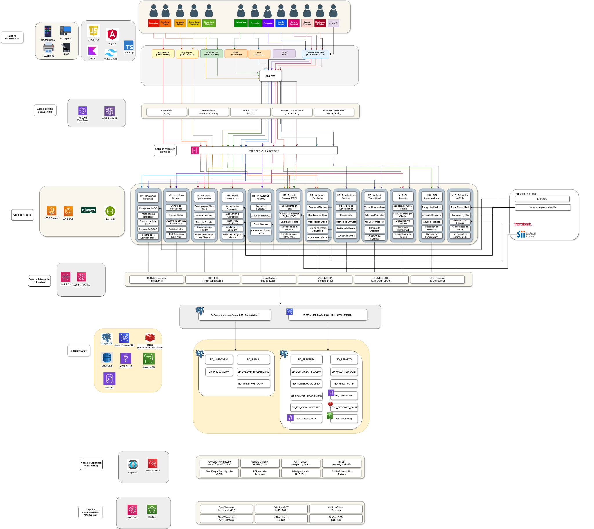

Figura 1. Diagrama general de la arquitectura lógica.
La figura de visión general muestra la solución completa: los 12 módulos viven en la Capa 4 (Lógica de negocio), la integración en la Capa 5 (Integración y eventos) y los datos en la Capa 6 (Acceso a datos), sobre el plano híbrido de nube y sitios on-premise.
Completan el mapa la presentación (Capa 1), el borde (Capa 2), la puerta de enlace (Capa 3), la seguridad (Capa 7) y la observabilidad (Capa 8).
Sin conexión, la operación de bodega y terreno continúa localmente y al volver el enlace se reconcilia (RT-03.10).

### 4.8.2  Diagrama del preventista de la arquitectura lógica

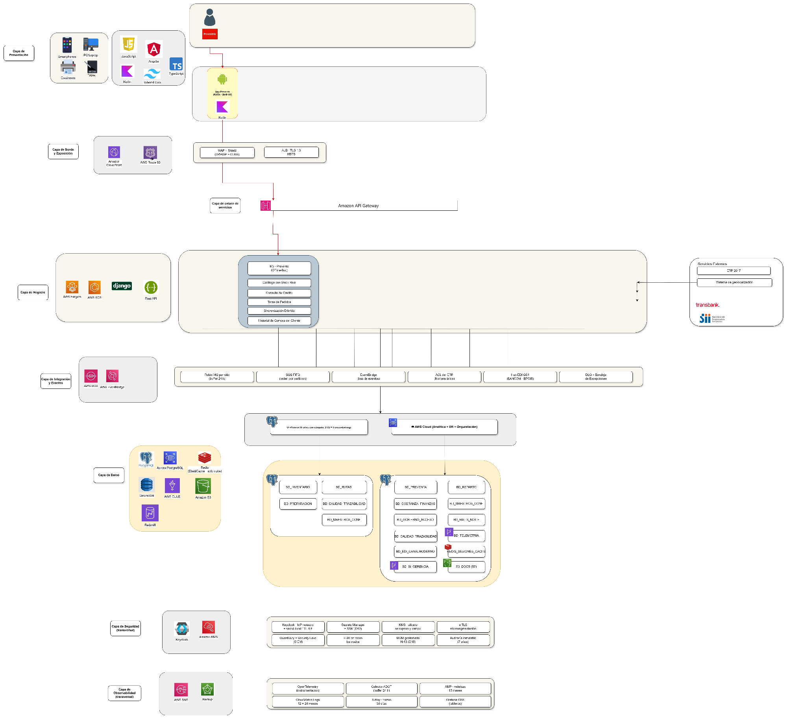

Figura 2. Diagrama del preventista de la arquitectura lógica.
La figura sigue al preventista (M3). El flujo parte de la Capa 1 (app Kotlin), pasa por la Capa 3 (API Gateway con los contratos `/v1` y `/sync/v1`) y llega a la Capa 4 (M3).
La Capa 6 entrega al inicio del turno la copia de stock, precios, crédito y promociones desde ElastiCache, almacenada en SQLite/Room del dispositivo.
Sin conexión, el pedido se toma offline con la foto local y un UUID idempotente; al reconectar, el servidor valida stock y crédito y deduplica (RT-02.06).

### 4.8.3  Diagrama del conductor propio de la arquitectura lógica

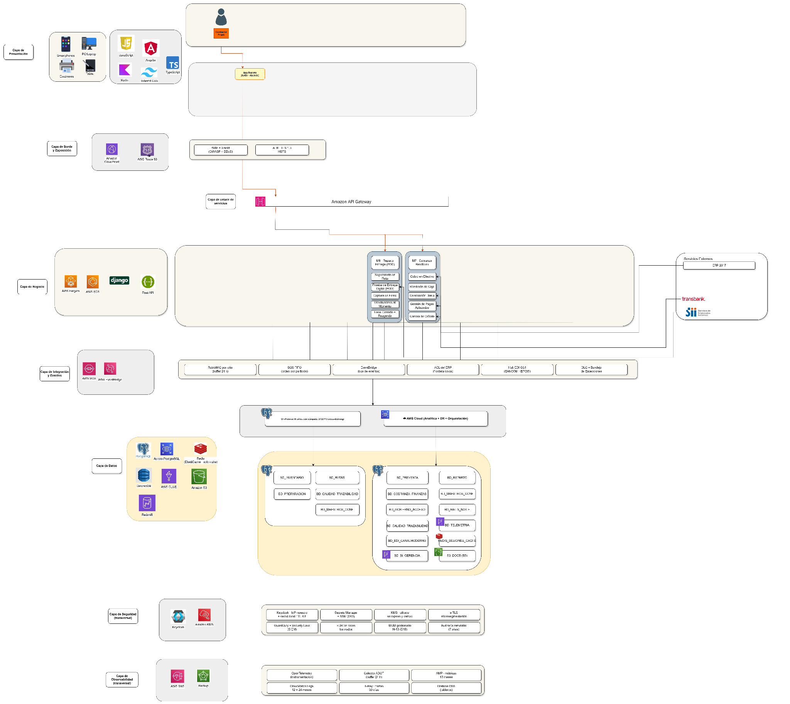

Figura 3. Diagrama del conductor propio de la arquitectura lógica.
La figura sigue al conductor propio (M6). Recorre la Capa 1 (app de reparto), la Capa 3 (puerta de enlace) y la Capa 4 (M6/M7/M8).
Sin conexión, el turno de 14 h se cumple sin señal: POD con firma, QR y foto, cobranza y devoluciones se registran de forma local.
Al reconectar sincroniza en un máximo de 10 minutos (RT-03.12) y rinde.

### 4.8.4  Diagrama del conductor externo de la arquitectura lógica

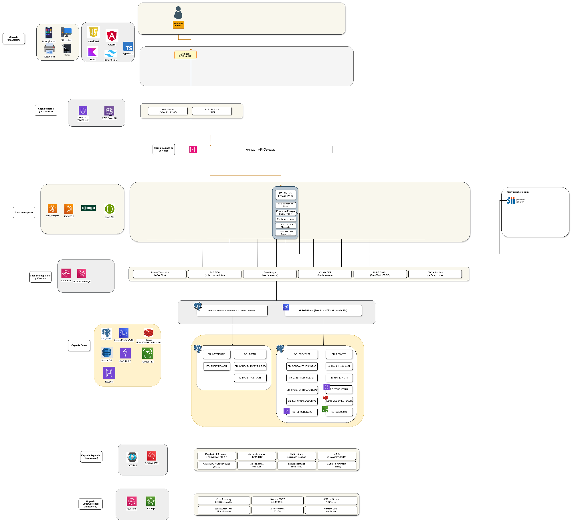

Figura 4. Diagrama del conductor externo de la arquitectura lógica.
La figura sigue al conductor externo (M6/M7) y recorre las mismas capas que la Figura 3 (Capa 1, Capa 3 y Capa 4).
Sin conexión mantiene la continuidad del turno de 14 h, con credenciales de turno de 14 h en terreno.
Al reconectar, el acuse se envía por lote (RF-06.07).

### 4.8.5  Diagrama del cliente canal tradicional de la arquitectura lógica

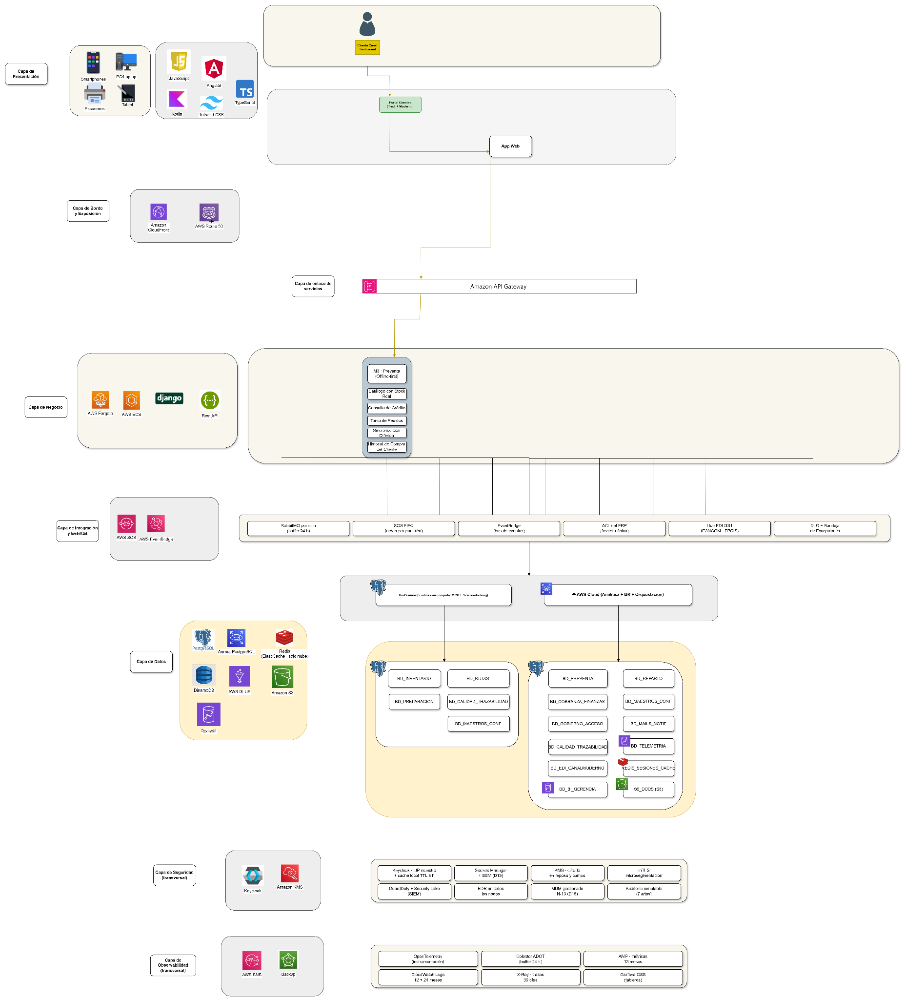

Figura 5. Diagrama del cliente canal tradicional de la arquitectura lógica.
La figura sigue al cliente del canal tradicional. Recorre la Capa 2 (CloudFront/WAF), la Capa 3 (OIDC) y la Capa 4 (consulta de pedidos y documentos).
El catálogo público admite consulta sin autenticación.
El canal es en línea y no aplica contingencia offline: el cliente consulta la nube.

### 4.8.6  Diagrama del cliente canal moderno de la arquitectura lógica

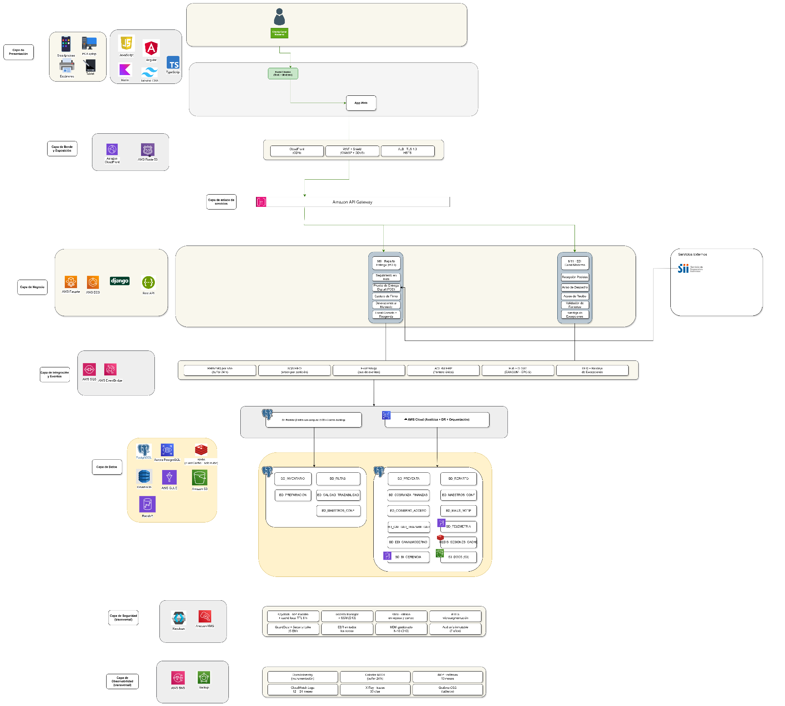

Figura 6. Diagrama del cliente canal moderno de la arquitectura lógica.
La figura sigue al cliente del canal moderno (M11). El flujo entra por la Capa 5 (Hub EDI GS1, AS2/API) y la Capa 4 (M11), y continúa hacia M3, M6 y las cadenas.
El hub vive en nube y no depende de los sitios.
Ante la falla de una cadena aplica DLQ y bandeja de excepciones con ventana de 30 minutos (RF-12.10).

### 4.8.7  Diagrama del transportista de la arquitectura lógica

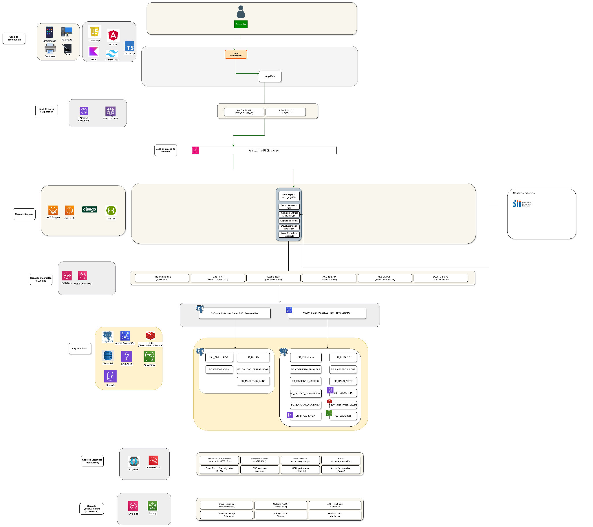

Figura 7. Diagrama del transportista de la arquitectura lógica.
La figura sigue al transportista. Recorre la Capa 1 (portal), la Capa 2, la Capa 3 y la Capa 4 (M4 para rutas y estado de M6).
El portal es en línea.
Las rutas planificadas se descargan a los dispositivos del conductor para la operación offline.

### 4.8.8  Diagrama del proveedor de la arquitectura lógica

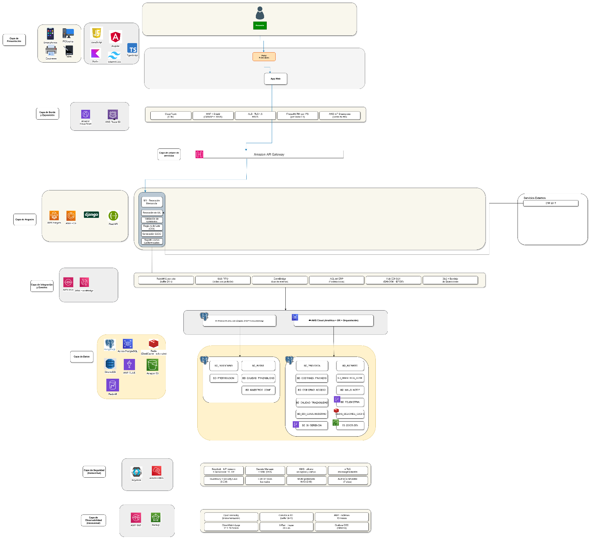

Figura 8. Diagrama del proveedor de la arquitectura lógica.
La figura sigue al proveedor (M1). Recorre la Capa 1 (portal de proveedores), la Capa 3, la Capa 4 (M1) y sale por la Capa 5 hacia el ERP mediante la ACL.
Sin conexión, la recepción se registra localmente (HHT/SSCC) y sincroniza al volver el enlace.
El ERP solo se escribe vía ACL.

### 4.8.9  Diagrama del preparador de la arquitectura lógica

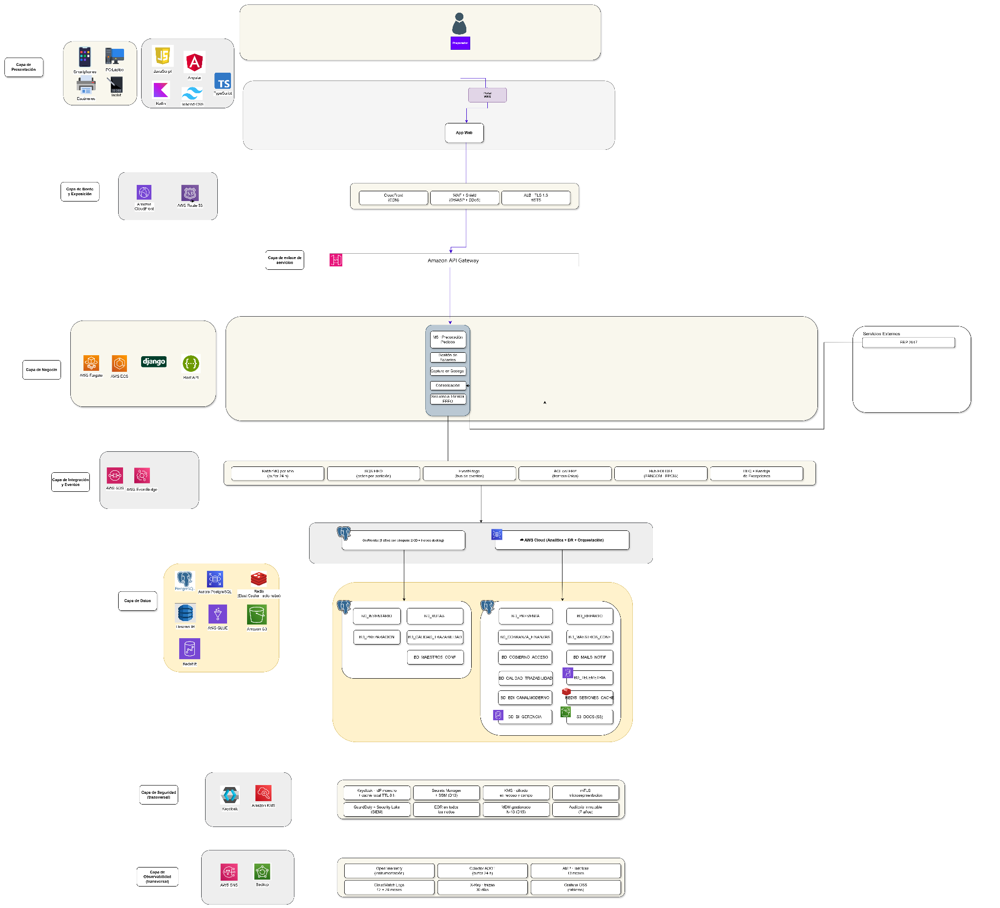

Figura 9. Diagrama del preparador de la arquitectura lógica.
La figura sigue al preparador (M5). Recorre la Capa 1 (HHT), la Capa 3 cuando hay conexión, la Capa 4 (M5) y la Capa 6 on-premise (PostgreSQL del sitio).
Sin conexión, las misiones descargadas al inicio del turno se ejecutan de forma 100 % local, incluso en cámara a -22 °C.
RabbitMQ mantiene un buffer de 24 h y los eventos críticos se envían a SQS al reconectar (INT-03).

### 4.8.10  Diagrama de jefa de calidad de la arquitectura lógica

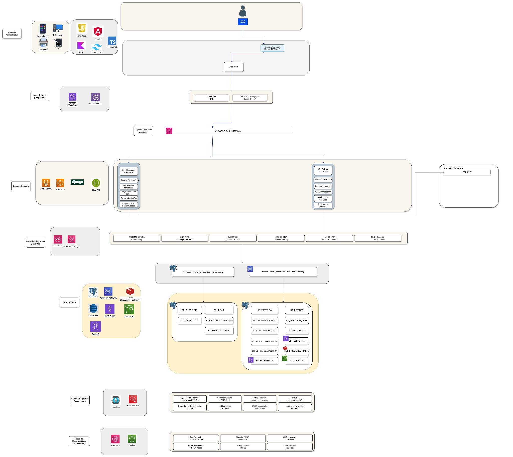

Figura 10. Diagrama de jefa de calidad de la arquitectura lógica.
La figura sigue a la jefa de calidad (M9). Recorre la Capa 2 (Greengrass y sensores), la Capa 4 (M9) y las Capas 5/8.
Sin conexión, la detección de excursión térmica y el bloqueo de despacho son 100 % locales (menos de 5 segundos, decisión 16.1 #4).
El buffer Greengrass de 14 h conserva los registros hasta reconectar (INT-05).

### 4.8.11  Diagrama de gerente comercial de la arquitectura lógica

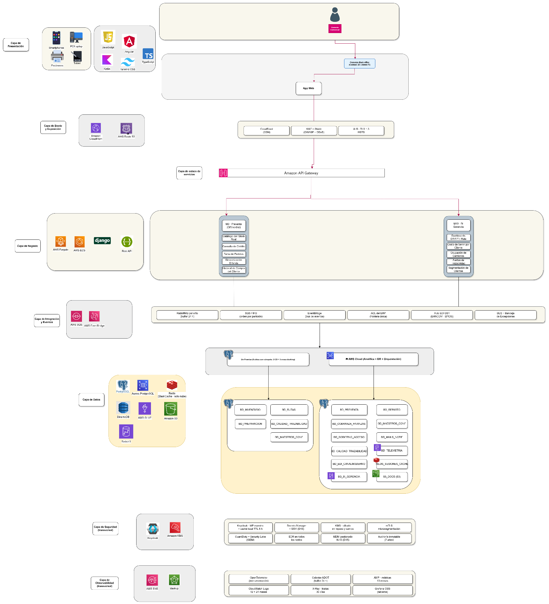

Figura 11. Diagrama de gerente comercial de la arquitectura lógica.
La figura sigue al gerente comercial (M10). Recorre la Capa 1 (tableros), la Capa 4 (M10) y la Capa 6 (Redshift Serverless).
La analítica vive en nube.
Los tableros no participan del despacho y la operación local no depende de ellos.

### 4.8.12  Diagrama de gerente finanzas de la arquitectura lógica

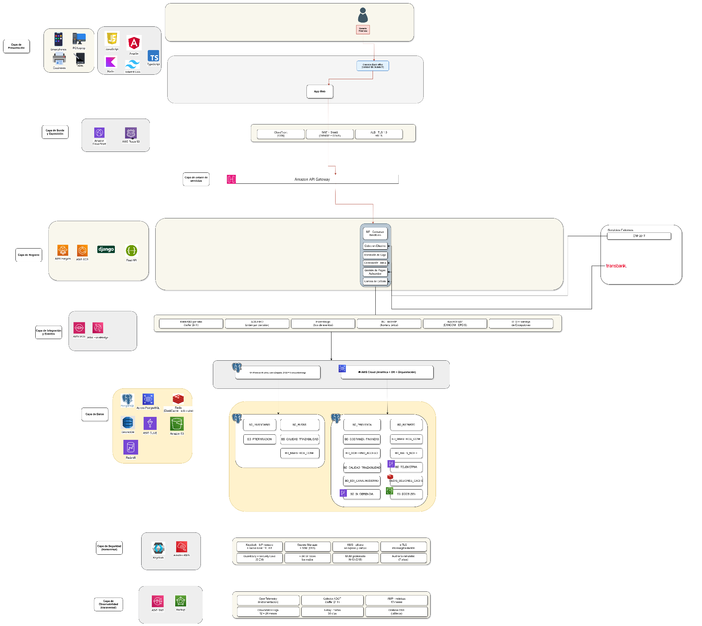

Figura 12. Diagrama de gerente finanzas de la arquitectura lógica.
La figura sigue al gerente de finanzas (M7/M10). Recorre la Capa 1, la Capa 4 (M7 y M10) y la Capa 5 (SQS hacia `celery-erp-sync`, la ACL y el ERP).
Sin conexión, la rendición se acumula localmente y se publica al reconectar.
El ERP se escribe solo por la ACL y el costo de servir se alimenta por telemetría (M12).

### 4.8.13  Diagrama de planificador de rutas de la arquitectura lógica

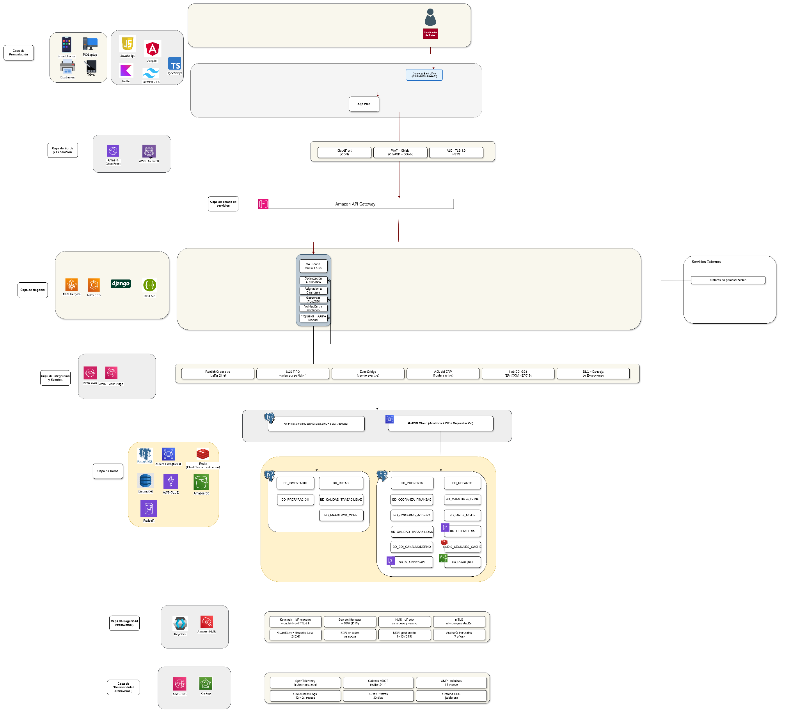

Figura 13. Diagrama de planificador de rutas de la arquitectura lógica.
La figura sigue al planificador de rutas (M4). Recorre la Capa 1 (consola), la Capa 4 (M4) y el GIS externo (INT-10) con caché de mapas.
Sin conexión, la caché de mapas por zona permite degradar a ruta offline con la secuencia cargada.
La planificación previa se descarga a los dispositivos.

### 4.8.14  Diagrama de gerente de TI de la arquitectura lógica

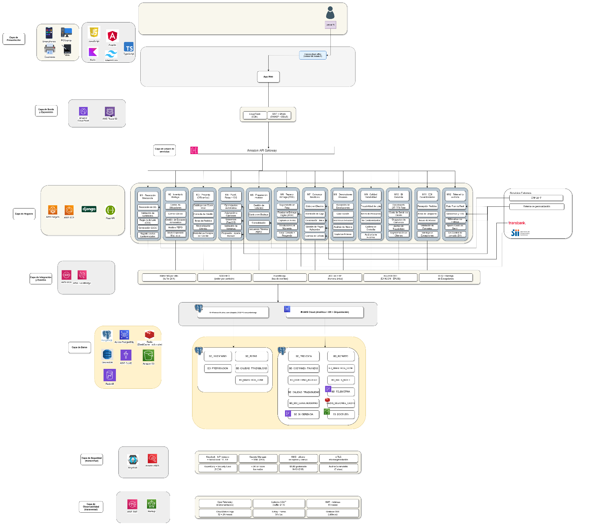

Figura 14. Diagrama de gerente de TI de la arquitectura lógica.
La figura sigue al gerente de TI. Recorre la Capa 1 (consolas, portales y back office en nube), la Capa 8 (tableros y alertas) y la Capa 7 (seguridad).
Los tableros centrales no son necesarios para despachar.
Las alarmas locales y el buffer ADOT de 24 h se envían al restablecer la conexión (Capa 8).
