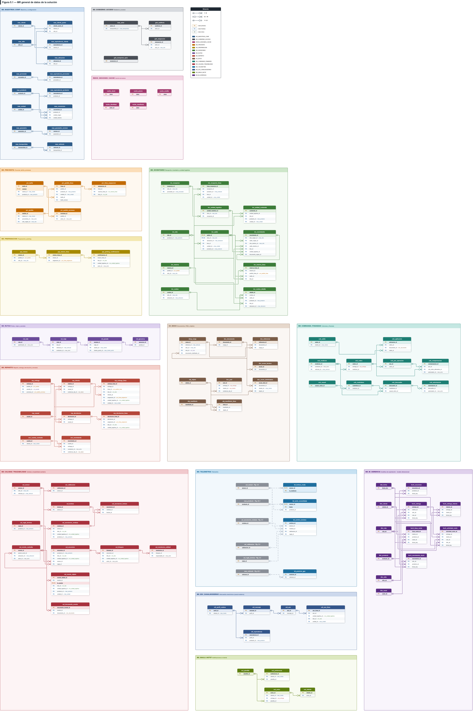
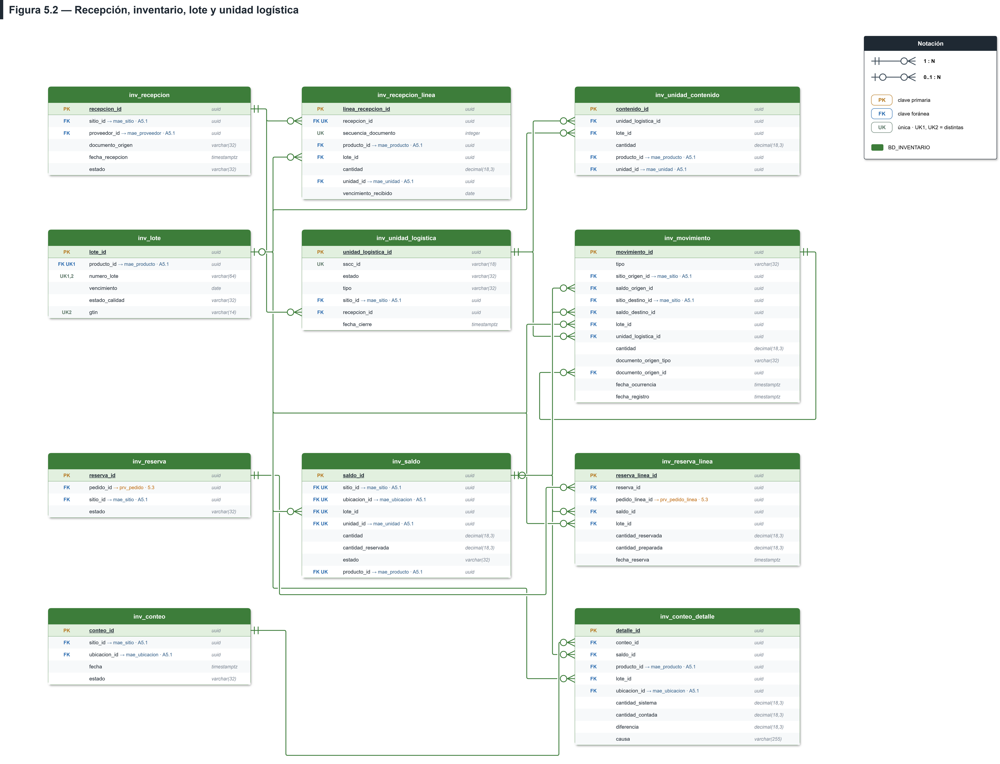
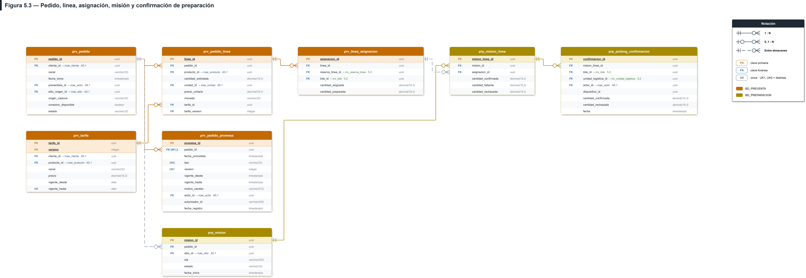
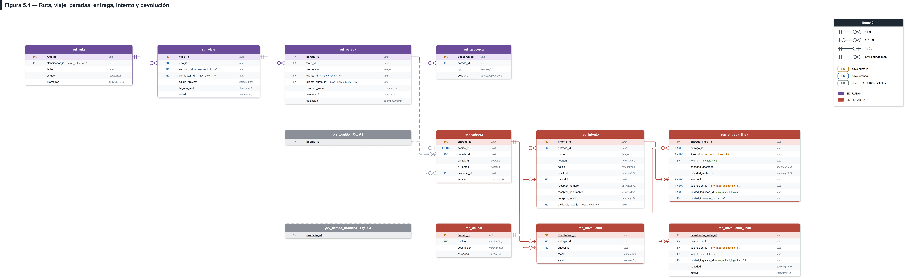
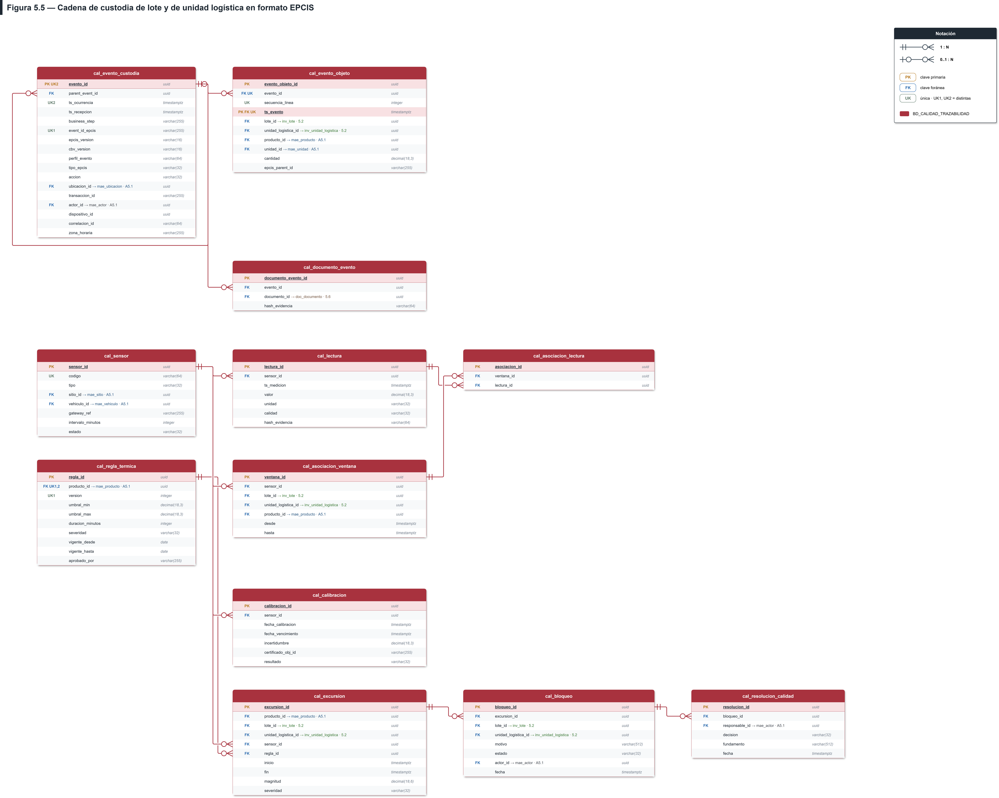
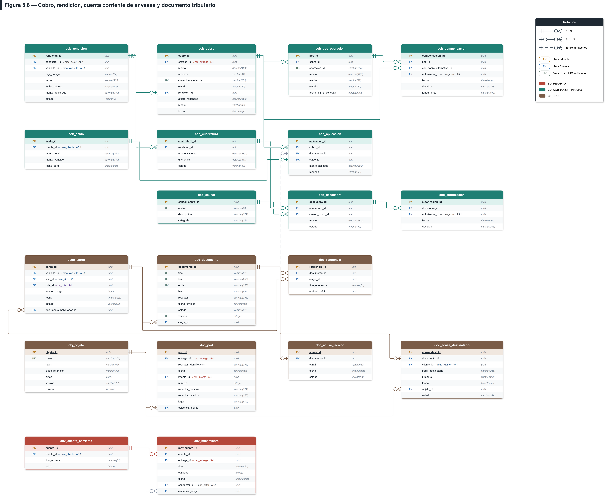
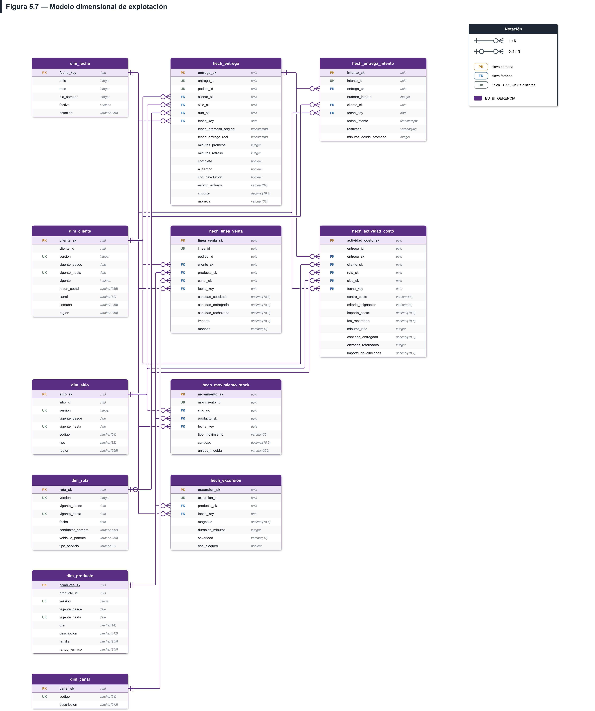

# LAFROX

Propuesta de Solución — Distribuidora Puelche S.A. Licitación N° TFEP-01/2026 — Caso 02 Logística

# Subdocumento 5

Modelo y Gestión de Datos

Subdocumento 5 · Formulario T-7

| MANDANTE | REPRESENTANTE / APODERADO DEL PROPONENTE LAFROX |
| --- | --- |
| Distribuidora Puelche S.A. | Alex Aravena Jefe de Proyecto y Apoderado contacto@lafrox.cl +56 32 250 4100 |

PROPONENTE

LafroX SpA

RUT 77.418.902-K

Av. Brasil 2241, Valparaíso

FECHA DE EMISIÓN

05 de octubre de 2026

FIRMA DEL REPRESENTANTE LEGAL

Alex Aravena

Jefe de Proyecto y Apoderado · LafroX SpA

## Índice general

| Apartado | Enlace |
| --- | --- |
| Índice general | [Índice general](#indice-general) |
| Lista de tablas | [Lista de tablas](#lista-de-tablas) |
| Lista de figuras | [Lista de figuras](#lista-de-figuras) |
| 5 Introducción al Modelo y gestión de datos | [5](#sec-5) |
| 5.1 Modelo | [5.1](#sec-5-1) |
| 5.1.1 Dominios de información y almacenes lógicos | [5.1.1](#sec-5-1-1) |
| 5.1.2 Modelo conceptual de la operación de Puelche | [5.1.2](#sec-5-1-2) |
| 5.1.3 Maestros compartidos e identidad única | [5.1.3](#sec-5-1-3) |
| 5.1.4 Recepción, inventario y unidad logística | [5.1.4](#sec-5-1-4) |
| 5.1.5 Preventa, preparación y misión de preparación | [5.1.5](#sec-5-1-5) |
| 5.1.6 Rutas, reparto, entrega y devolución | [5.1.6](#sec-5-1-6) |
| 5.1.7 Trazabilidad sanitaria y cadena de custodia | [5.1.7](#sec-5-1-7) |
| 5.1.8 Cobranza, envases, documentos y POD | [5.1.8](#sec-5-1-8) |
| 5.1.9 Intercambio electrónico, notificaciones y gobierno del acceso | [5.1.9](#sec-5-1-9) |
| 5.1.10 Telemetría, caché y objetos | [5.1.10](#sec-5-1-10) |
| 5.1.11 Modelo lógico del dominio analítico | [5.1.11](#sec-5-1-11) |
| 5.1.12 Reglas relacionales resueltas | [5.1.12](#sec-5-1-12) |
| 5.2 Gestión de datos | [5.2](#sec-5-2) |
| 5.2.1 Paradigma y motor de persistencia por dominio | [5.2.1](#sec-5-2-1) |
| 5.2.2 Transaccionalidad, aislamiento e idempotencia | [5.2.2](#sec-5-2-2) |
| 5.2.3 Autoridad de escritura y comportamiento en partición | [5.2.3](#sec-5-2-3) |
| 5.2.4 Gestión de datos maestros | [5.2.4](#sec-5-2-4) |
| 5.2.5 Calidad de datos | [5.2.5](#sec-5-2-5) |
| 5.2.6 Separación transaccional-analítica y modelo de explotación | [5.2.6](#sec-5-2-6) |
| 5.2.7 Retención, archivado, eliminación y protección | [5.2.7](#sec-5-2-7) |
| 5.2.8 Exportación e intercambio masivo | [5.2.8](#sec-5-2-8) |
| 5.3 Estrategia de migración | [5.3](#sec-5-3) |
| 5.3.1 Alcance, orígenes y volumen estimado | [5.3.1](#sec-5-3-1) |
| 5.3.2 Perfilado y saneamiento | [5.3.2](#sec-5-3-2) |
| 5.3.3 Transformación, herramientas y artefactos | [5.3.3](#sec-5-3-3) |
| 5.3.4 Secuencia, ensayos y calendario por ola | [5.3.4](#sec-5-3-4) |
| 5.3.5 Conciliación y criterios de corte | [5.3.5](#sec-5-3-5) |
| 5.3.6 Delta, reversión y continuidad del ERP | [5.3.6](#sec-5-3-6) |
| 5.4 Estrategia de desempeño | [5.4](#sec-5-4) |
| 5.4.1 Escenarios de carga de referencia | [5.4.1](#sec-5-4-1) |
| 5.4.2 Consultas críticas e índices | [5.4.2](#sec-5-4-2) |
| 5.4.3 Particionamiento y archivado | [5.4.3](#sec-5-4-3) |
| 5.4.4 Caché y copia local del dispositivo | [5.4.4](#sec-5-4-4) |
| 5.4.5 Conexiones, concurrencia y colas | [5.4.5](#sec-5-4-5) |
| 5.4.6 Medición y pruebas propuestas | [5.4.6](#sec-5-4-6) |
| Referencias | [Referencias](#sec-referencias) |
| Declaración de uso de IA | [Declaración de uso de IA](#sec-ia) |

## Lista de tablas

Objetos presentes en este documento.

| Número | Contenido |
| --- | --- |
| Tabla 5.1 | Límites declarados de operación sin cobertura y sincronización posterior |
| Tabla 5.2 | Fuente, transferencia provisional y almacenamiento estimado |
| Tabla 5.3 | Escenarios de carga vigentes del dimensionamiento |
| Tabla 5.17 | Uso de IA por apartado del capítulo |

## Lista de figuras

Objetos presentes en este documento.

| Número | Contenido |
| --- | --- |
| Figura 5.1 | MR general de datos de la solución |
| Figura 5.2 | Recepción, inventario, lote y unidad logística |
| Figura 5.3 | Pedido, línea, asignación, misión y confirmación de preparación |
| Figura 5.4 | Ruta, viaje, paradas, entrega, intento y devolución |
| Figura 5.5 | Cadena de custodia de lote y de unidad logística en formato EPCIS |
| Figura 5.6 | Cobro, rendición, cuenta corriente de envases y documento tributario |
| Figura 5.7 | Modelo dimensional de explotación |

## 5 Introducción al Modelo y gestión de datos

El ítem 5 define cómo los datos sostienen trazabilidad sanitaria, cumplimiento de entrega y control de existencias para Distribuidora Puelche S.A. S2 aporta el problema; S3 y el Formulario T-12 fijan alcance y aceptación; S4 y T-11 fijan autoridades, motores, despliegue y capacidad. El capítulo desarrolla modelo, gestión, migración y desempeño sin cambiar esas decisiones.

Las decisiones de este ítem aplican las Bases Administrativas (Distribuidora Puelche S.A., 2026a, arts. 16, 17 y 85), las Bases Técnicas del Caso 02 (Distribuidora Puelche S.A., 2026c, caps. 14–16 y 18) y las Bases Técnicas Transversales (Distribuidora Puelche S.A., 2026b, §§5 y 9); su estructura y presentación siguen las Aclaraciones de licitación (Distribuidora Puelche S.A., 2026d, §§2–6 y 11).

Los antecedentes de empresa, problema, alcance y arquitectura proceden de los Subdocumentos 1, 2, 3 y 4, respectivamente (LafroX SpA, 2026d, 2026c, 2026b, 2026a); sus remisiones señalan el apartado específico utilizado.

El cuerpo explica los modelos críticos y las decisiones de operación. El anexo aporta diccionario, cardinalidades, catálogos, retención, índices, cachés, linaje, pruebas y mapeo de migración; 5-M dibuja únicamente maestros, EDI/gobierno y telemetría que complementan las figuras del cuerpo. Los plazos y capacidades son compromisos o cálculos de diseño, no resultados de ensayos ejecutados.

## 5.1 Modelo

El modelo separa identidad comercial, lote sanitario, unidad logística, compromiso del pedido y evidencia de entrega. La Figura 5.1 presenta las relaciones generales y las Figuras 5.2–5.7 desarrollan inventario, pedido/preparación, reparto, custodia, cobranza/documentos y analítica. El diccionario 5-A contiene cada atributo; 5-B y 5-C precisan integridad y validación.

### 5.1.1 Dominios de información y almacenes lógicos

El modelo lógico se presenta por dominios: Figuras 5.2–5.6 y A5.1–A5.2 forman sus vistas relacionales; 5.7 presenta el modelo dimensional y A5.3 las estructuras de telemetría, caché y objetos. La Figura 5.1 presenta el MR general de datos de la solución; las Figuras 5.2–5.7 y A5.1–A5.3 desarrollan sus partes con tablas y relaciones específicas. Las vistas por dominio muestran claves y relaciones esenciales; el diccionario 5-A conserva todos los atributos y tipos. Una caja de referencia en otra vista no redefine la tabla ni representa otra base de datos.

Los quince dominios lógicos de S4 distribuyen autoridad y responsabilidad funcional. Maestros y configuración, preventa, rutas, reparto, cobranza/finanzas, Calidad/trazabilidad, EDI, gobierno/acceso y notificaciones residen en los almacenes centrales declarados; inventario y preparación conservan autoridad en PostgreSQL del sitio. Telemetría usa DynamoDB para ingesta térmica y S3/Glue/Redshift para detalle y agregados; BI consulta Redshift/QuickSight. Redis conserva proyecciones y S3_DOCS evidencia por clase de retención.

El Anexo 5-B integra los quince nombres, módulos, ubicaciones y motores. BD_RUTAS tiene autoridad central, con itinerarios descargados de consulta; DMS de Talca replica al esquema lector separado. La distinción permite que una operación local siga confirmada en su perímetro sin presentar la proyección central como actualizada durante un corte.

M12 captura telemetría; Calidad decide disposición sanitaria. Una excursión menor transitoria genera advertencia; una crítica o sostenida activa el bloqueo definido en S3/S4 y la resolución final corresponde a Calidad. El ERP conserva emisión tributaria única. Estas responsabilidades evitan tanto dos escritores de un saldo como una resolución sanitaria atribuida al sensor.

### 5.1.2 Modelo conceptual de la operación de Puelche

La Figura 5.1 presenta el MR general con las tablas principales y sus relaciones, agrupadas por dominio; las vistas específicas desarrollan cada parte. Distingue las referencias entre almacenes de las FK físicas y mantiene la vista conceptual de la operación. Las vistas de detalle relacionan productos y lotes con recepción, contenido logístico, custodia, asignaciones del pedido y cumplimiento. El lote se identifica por GTIN canónico+número del proveedor; la unidad tiene UUID interno y SSCC exterior. La composición admite varios lotes por unidad y unidades por lote.

**Figura 5.1 — MR general de datos de la solución.**

*Fuente: elaboración propia de LafroX a partir de las decisiones 16.1 N° 1, N° 2, N° 4 y N° 14 del capítulo 16 del caso (Distribuidora Puelche S.A., 2026c), de los requisitos RT-05.01 y RT-05.23 de las Bases Técnicas Transversales (Distribuidora Puelche S.A., 2026b) y de RF-01.07 y RF-09 del Formulario T-12.*

Cada registro de promesa tiene UUID propio como PK; version ordena sus cambios con unicidad por pedido. La entrega referencia la ORIGINAL del mismo pedido. El pedido conserva ORIGINAL y revisiones como compromisos distintos. Una entrega por pedido admite varios intentos y líneas fragmentadas por asignación/lote/unidad; POD y cobro se vinculan a esos hechos. La cabecera de custodia contiene el evento y su detalle identifica objetos y cantidades. El cliente y sus puntos se desarrollan en 5-M, sin crear una instalación de inventario por cada local de entrega. El documento fiscal emitido por ERP antecede al traslado; el POD acredita el hecho posterior.

### 5.1.3 Maestros compartidos e identidad única

La ficha de producto conserva tipo de almacenamiento, límites térmicos y referencia/versionado del documento de origen en `mae_producto` (5-A). Los límites no se deducen de un promedio ni se inventan al importar. Su publicación a cada sitio y gateway conserva versión y acuse; una ficha incompleta mantiene retenido el lote hasta contar con parámetros verificables.

Un maestro tiene dueño funcional, UUID estable e historial; la integración traduce códigos externos mediante equivalencias versionadas y nunca crea identidades paralelas. Producto conserva un GTIN canónico único cuando aplica; otros GTIN/códigos se resuelven por equivalencia aprobada, sin compartir identidad sanitaria entre productos. Corregir descripción o vencimiento no cambia el identificador ni rompe historia.

La Figura A5.1 del Anexo 5-M dibuja maestros, puntos, instalaciones y equivalencias. Un cliente puede tener varios puntos; sitio representa instalación operativa y no cada cliente. Comercial valida productos/clientes, Finanzas condiciones de crédito y Calidad reglas sanitarias; el módulo dueño publica la versión y las copias locales registran instante de actualización. Los conflictos de código se aíslan y concilian antes de publicar, conforme RT-05.09 y 5.2.4.

### 5.1.4 Recepción, inventario y unidad logística

La Figura 5.2 distingue recepción, lote, unidad, contenido, saldo, movimiento, reserva y conteo cíclico. Se exige lote al cierre de las líneas de productos que lo requieren; productos exentos y unidades VACIA/ABIERTA conservan NULL legítimos. El SSCC de 18 dígitos no sustituye el UUID; vencimiento es atributo del lote.

**Figura 5.2 — Recepción, inventario, lote y unidad logística.**

*Fuente: elaboración propia de LafroX a partir de la decisión 16.1 N° 2 y N° 14 del caso, del Subdocumento 4, 4.1.3.6, y de RF-01.07 y RF-02 del Formulario T-12.*

El saldo tiene grano sitio+ubicación+producto+lote+unidad de medida; la conversión se valida antes de comparar o reservar. La transacción bloquea el saldo, valida disponibilidad y registra movimiento/outbox sin duplicar reintentos. Varias asignaciones abastecen una línea de pedido. secuencia_documento solo existe si el documento de origen aporta ordinal; no se inventa para identificar un hecho histórico. Los ajustes y anulaciones de 5-C conservan causa, dirección y movimiento original; no sobrescriben saldo ni evidencia sin autorización.

El inventario en tránsito se deriva de los eventos de despacho con carga confirmada sin recepción confirmada correlacionada, mediante la transacción, la unidad logística y las cantidades de custodia de 5-A, y se muestra como disponibilidad futura separada del stock físico, comprometido y disponible, con fecha y hora estimada de llegada. La recepción física confirmada en destino cierra ese tránsito y habilita el stock físico local, conservando su registro offline y sincronización idempotente; la fecha de registro no sustituye el hito de recepción. Cada transferencia genera el movimiento inter-bodegas en el ERP mediante la ACL de INT-06, con encolamiento y reintento automático ante indisponibilidad y sin duplicar el efecto contable (LafroX SpA., 2026b, Anexo 3.A, RF-02.06; 2026a, Anexo 4-H, INT-06).

### 5.1.5 Preventa, preparación y misión de preparación

En TERRENO, preventista_id identifica al capturador autorizado; MOSTRADOR, EDI y PORTAL mantienen NULL sin inventar un preventista. La identidad de quien captura o integra se registra en gob_auditoria.actor_id con UUID/correlación y origen_captura: persona autorizada, cuenta de autoatención o actor técnico autenticado, respectivamente. El responsable comercial no se infiere de ese campo. M3 valida cuenta/permisos al confirmar; un pedido pendiente no crea reserva ni promesa de entrega confirmada.

La Figura 5.3 relaciona pedido, líneas, promesas, asignaciones y misiones; la reserva que abastece cada asignación se detalla en la Figura 5.2. La fecha/ventana ORIGINAL se fija al confirmar el pedido y permanece inmutable; una reprogramación agrega REVISION con motivo, actor y autorización. fecha_prometida y vigencias son timestamps UTC, con zona de origen conocida.

**Figura 5.3 — Pedido, línea, asignación, misión y confirmación de preparación.**

*Fuente: elaboración propia de LafroX a partir de RNG-01, RNG-15 y RNG-05 del Subdocumento 3, y del Subdocumento 4, 4.1.4.4.*

La promesa conserva las condiciones de S3: 24 h para urbano ingresado antes de las 14:00 y 48 h para rural, periférico o abastecido por cross-docking, según RNG-15. OTIF evalúa ORIGINAL aun después de su cierre de vigencia. La preparación puede dividir una línea entre lotes/unidades y confirmar cantidades parciales; la reserva validada por PostgreSQL del sitio sigue confirmada localmente durante un corte, con consolidación central pendiente. El móvil no reserva contra una copia indicativa de stock.

### 5.1.6 Rutas, reparto, entrega y devolución

La Figura 5.4 separa plan de ruta, viaje, parada, entrega e intento. BD_RUTAS conserva autoridad central; el itinerario descargado permite ejecutar la ruta autorizada sin señal. Una entrega por pedido admite visitas fallidas, parciales y completas sin sobrescribir las anteriores.

**Figura 5.4 — Ruta, viaje, paradas, entrega, intento y devolución.**

*Fuente: elaboración propia de LafroX a partir de las decisiones 16.1 N° 1, N° 3, N° 10 y N° 15 del caso, y del Subdocumento 4, 4.1.4.5 y 4.1.4.8.*

Las líneas del intento conservan asignación, lote/unidad, cantidad aceptada/rechazada y causal. La identidad del fragmento se reutiliza en reintentos; distintas asignaciones no se deduplican por compartir producto/cantidad. Una devolución vincula el hecho de origen y su recepción/disposición; la cuenta de envases mantiene saldo por cliente y tipo, sin serialización individual. Los geofences de configuración se distinguen de coordenadas personales GPS, cuya conservación total es doce meses.

### 5.1.7 Trazabilidad sanitaria y cadena de custodia

Antes de la aprobación de Calidad, `cal_regla_termica` materializa el rango de ficha como `PREVENTIVA_FICHA`, con severidad CRITICA y duración cero. No lleva aprobador ni permite liberar: la primera lectura válida fuera de rango retiene el lote. Calidad crea después una versión APROBADA; la excursión conserva la regla y ficha efectivamente usadas, sin reinterpretación histórica (5-A, 5-B y 5-C; SD4 4.1.4.8).

La Figura 5.5 relaciona evento, objetos, documentos, sensor, asociación temporal y resolución de Calidad. EPCIS 2.0 y CBV 2.0 tienen versiones separadas; perfil_evento identifica el contrato versionado de la solución descrito en 5-C (GS1, 2022a, 2022b). parent_event_id representa causalidad interna y admite NULL en raíz. epcis_parent_id identifica el contenedor de una agregación y no un evento causal.

**Figura 5.5 — Cadena de custodia de lote y de unidad logística en formato EPCIS.**

*Fuente: elaboración propia de LafroX a partir de RF-01.07, RF-09 y RNF-09.02 del Formulario T-12, del Subdocumento 4, 4.1.4.2, y de RT-05.23 según el capítulo 15 del caso.*

Una cabecera puede mencionar varios objetos/cantidades; la asociación temporal vincula sensor, lote, unidad y producto con las lecturas efectivamente aplicables. Regla y calibración se conservan en su versión histórica. Una advertencia menor transitoria no equivale a disposición final; el bloqueo crítico o sostenido se aplica conforme S3/S4 y únicamente Calidad libera o rechaza con fundamento. Lecturas inválidas se preservan marcadas, separando defecto de sensor, excursión y pérdida de cobertura.

La consulta forward sigue lote→contenido/unidades→objetos/eventos→asignaciones→intentos/entregas→documentos/POD. La backward invierte ese recorrido hasta recepción y proveedor; múltiples recepciones del mismo lote se distinguen por su evidencia, sin atribuir origen único cuando no puede determinarse.

El retiro identifica clientes y documentos en ≤2 h desde la solicitud de Calidad. Su presupuesto de diseño es 5 min identificación +10 custodia +15 entregas/documentos +10 pendientes +15 expediente +15 revisión +15 margen =85 min, a demostrar en prueba. Calidad consulta autoridades locales y central; despacho de cada sitio contrasta carga/ruta y conductores aportan pendientes. Los clientes planificados con lote aún offline integran el universo potencial a contactar/bloquear, distinto de entregas confirmadas. A los 30 min sin respuesta se escala a Operaciones; una lista parcial que no identifica ese universo no cumple aceptación. El Anexo 5-J fija evidencia y prueba offline; un sello de última sincronización por sí solo no demuestra completitud.

### 5.1.8 Cobranza, envases, documentos y POD

La Figura 5.6 diferencia cobro, aplicación, autorización, compensación, rendición, documento, carga y POD. El ERP es único emisor fiscal y el documento habilitador precede al traslado; no existe timbre diferido desde el móvil. POD, acuse técnico SII y recepción de mercadería son evidencias distintas, con representación en papel para destinatario no habilitado según S4.

**Figura 5.6 — Cobro, rendición, cuenta corriente de envases y documento tributario.**

*Fuente: elaboración propia de LafroX a partir de RT-16.14 y RT-16.09 de las Bases Técnicas Transversales (Distribuidora Puelche S.A., 2026b), del Anexo 4-U del Subdocumento 4, y de la decisión 16.1 N° 6 y N° 12 del caso.*

La identidad fiscal usa tipo/emisor/folio/versión; hash verifica contenido y las referencias tipadas comprueban la entidad de negocio. POD admite varias evidencias por entrega/intento; el móvil puede cerrar localmente bajo autorización con evidencia durable, conservando estado de verificación central posterior.

Un timeout de POS mantiene pago incierto: consulta, conciliación y eventual cancelación/compensación dependen del contrato del tercero. Un pago alternativo necesita autorización financiera y vínculo al primero; agotar reintentos no prueba rechazo ni evita por sí mismo doble cargo. Autoriza un actor con rol financiero distinto del ejecutor. ajuste_redondeo expresa importe registrado menos importe externo comprobado solo para tarjeta; efectivo/crédito no fabrican autorización externa. Las cuentas de envases son saldos por cliente/tipo. S4, Anexo 4-M, define AL-DTE-01 y AL-DR-01; su aceptación requiere ensayo.

### 5.1.9 Intercambio electrónico, notificaciones y gobierno del acceso

Plantillas, preferencias e intentos comparten CORREO, SMS, WHATSAPP y AVISO_EN_PORTAL. La preferencia vigente se identifica por cliente, finalidad, categoría y canal; la plantilla/versionado de referencia acredita la elección inicial, sin limitar la baja a esa edición. Antes de emitir o reintentar se comprueba la baja comercial, que persiste hasta nueva decisión expresa. Los avisos operacionales obligatorios se distinguen de los comerciales. Los atributos, nulabilidad y restricciones vigentes se especifican en 5-A–5-C; las vistas gráficas resumen sus relaciones.

La Figura A5.2 de 5-M desarrolla perfil de cadena, equivalencias, mensajes/ASN, avisos, asignación de roles, auditoría y excepciones. El perfil establece esquema y campos admitidos; se conserva mensaje original, hash, identidad externa y correlación. Un reintento devuelve resultado previo sin duplicar efecto. Un código de cadena se traduce a identidad canónica; no crea cliente/producto por defecto.

La auditoría registra actor, dispositivo, instante, operación, resultado y valores anteriores/posteriores mínimos. La excepción conserva contexto histórico, regla y versión; su identidad es (correlacion_id, clave), no hora de llegada. Los mensajes/notificaciones usan solo integraciones habilitadas en S4 y su estado de envío no sustituye recepción de mercadería ni acuse fiscal.

### 5.1.10 Telemetría, caché y objetos

La Figura A5.3 del Anexo 5-M distingue ingesta térmica cruda en DynamoDB, archivo detallado S3 Parquet/Glue, serie/analítica Redshift, posición personal y objetos. Raw dura treinta días; el perfil detallado y las versiones que lo interpretan permanecen cinco años. El agregado no permite reconstruir una lectura perdida, por lo que no sustituye el detalle.

S4, Anexo 4-W.4, fija 21 puntos térmicos ×288 y 28 termógrafos ×174 =10.920 muestras/día. Operan tres gateways: dos en Talca y uno en Concepción; las reservas de T-11 no agregan ingesta ordinaria. El sensor referencia su gateway, sin crear otra autoridad de maestros.

GPS permanece en sa-east-1, raw treinta días y plazo personal total doce meses, sin réplica internacional. La posición no se confunde con geocerca de configuración. S3_DOCS conserva originales por clase; Redis contiene lectura reconstruible y Room/SQLite conserva además hechos/evidencias durables. Las claves, vigencias y purgas están en 5-G.

### 5.1.11 Modelo lógico del dominio analítico

La Figura 5.7 define hechos y dimensiones para analizar servicio, inventario, cobro y frío. El grano e identidad de origen evitan duplicados de carga: pedido para compromiso, entrega/intento para ejecución y línea/asignación para cantidades; la entrega por pedido no cuenta cada visita como pedido independiente.

**Figura 5.7 — Modelo dimensional de explotación.**

*Fuente: elaboración propia de LafroX a partir de RF-11.06 y RF-11.07 del Formulario T-12, de los criterios R18-04 y R18-11 del capítulo 18 del caso, y de RNG-09 del Subdocumento 3.*

El modelo incluye dimensiones de fecha, cliente, producto, sitio, ruta y canal; cliente, producto, sitio y ruta conservan versiones y vigencias. El cálculo previo al grano del pedido evita multiplicar OTIF/importes al unir líneas; cada hecho conserva origen y controles monetarios/GPS. Redshift/QuickSight sirve analítica pesada y la API consultas operativas. 5-H fija fórmulas, audiencia, filtros, profundización y latencia; costo de servir inicia E2. RT-05.10/.24 deseables conservan su alcance no ofertado; RT-05.30 se oferta mediante la Innovación 3 del Capítulo 13 (sección 13.3.2), sobre las series y la asociación sensor–lote de la sección 5.1.7.

### 5.1.12 Reglas relacionales resueltas

Los extremos opcionales representan estados iniciales o excepciones, no omisión de controles: TERRENO exige preventista; producto con lote exigido exige lote; raíz causal es el único evento sin padre; un sensor fijo exige sitio y uno móvil vehículo. La unidad VACIA/ABIERTA puede no tener contenido; al cerrarse exige contenido y SSCC según el hito. Una misión puede no tener confirmación antes del picking, pero no cierra sin validar sus líneas. Pedido PENDIENTE no tiene promesa confirmada; al confirmarse mantiene exactamente una ORIGINAL y las revisiones autorizadas. Cada pedido admite cero o una entrega y varios intentos vinculados a esa entrega.

El modelo relacional lógico se presenta por dominios en las Figuras 5.2–5.6, con atributos, claves y cardinalidades; la Figura 5.7 desarrolla el modelo dimensional analítico. Las Figuras A5.1–A5.3 de 5-M completan maestros, EDI/gobierno y telemetría, y 5-A contiene el diccionario exacto. Las FK físicas se limitan al mismo almacén; entre dominios, sedes, motores y objetos se validan identidad/versión y conciliación.

Lote usa GTIN canónico+número, con vencimiento como atributo. Unidad usa UUID y SSCC exterior, composición de varios lotes y estados VACIA/ABIERTA permitidos. Saldo tiene grano sitio+ubicación+producto+lote+unidad; recepción conserva secuencia_documento solo si el origen entrega ordinal. Reserva y asignación remiten a la línea de pedido concreta y permiten fragmentación por lote/unidad.

Custodia separa cabecera y objetos; parent_event_id representa genealogía causal y admite NULL en raíz, mientras la agregación logística representa contenedor/contenido. ts_evento y secuencia_linea del detalle mantienen timestamp de cabecera y ordinal estable; las restricciones compuestas de 5-F hacen implementable la partición sin duplicar un reintento entre meses.

Un pedido tiene una entrega con varios intentos; las líneas del intento distinguen asignación, lote/unidad y cantidades aceptadas/rechazadas. promesa ORIGINAL es inmutable y la fecha/ventana usa UTC; la entrega referencia promesa_id, sin columna duplicada fecha_promesa_original. Las revisiones autorizadas no reemplazan la base de OTIF.

Documento fiscal, POD, acuse técnico y recepción de mercadería conservan identidad propia. La clave fiscal incluye tipo/emisor/folio/versión; el hash verifica contenido. El ERP emite antes del traslado. Cobro y compensación se concilian con segregación de autorizador, nunca mediante una corrección silenciosa de importe.

El Anexo 5-C define parámetros tipados, perfiles EPCIS/CBV separados, movimientos/reversiones y vigencias sin solapamiento; 5-F declara índices y unicidad global. Los casos de borde se comprobarán en PREPROD según 5-J, sin afirmar que el diseño documental ya equivale a restricciones ejecutadas.

## 5.2 Gestión de datos

Esta sección desarrolla RT-05.02–10: motor y paradigma, consistencia y disponibilidad, garantías de escritura, autoridad offline, gobierno de maestros, calidad, separación analítica, retención y exportación. Cada decisión se aplica a los dominios de 5.1 y define su comportamiento ante fallos.

### 5.2.1 Paradigma y motor de persistencia por dominio

Los quince nombres lógicos de S4 separan responsabilidades de escritura, sin exigir quince motores. El Anexo 5-B integra dominio, ubicación, motor y autoridad. PostgreSQL 16/PostGIS sostiene relaciones, restricciones e historia; Aurora concentra los dominios centrales y los PostgreSQL de sitio sostienen inventario y preparación bajo una sola autoridad por agregado. BD_RUTAS tiene autoridad central en Aurora y copias de consulta autorizadas en sitio o móvil.

Frente a una partición de red, se conserva consistencia dentro del perímetro de la autoridad: bodega puede confirmar contra su PostgreSQL local y terreno puede registrar hechos autorizados durablemente. La consolidación central queda pendiente. Una copia indicativa de stock no permite crear reservas. DynamoDB acepta ingesta térmica eventual; S3 Parquet conserva detalle y Redshift explota series y agregados. Redis/ElastiCache contiene proyecciones reconstruibles y S3_DOCS objetos versionados. Las credenciales de AWS son administración, no un motor de persistencia adicional.

La elección relacional evita saldos y cobros divergentes; el modelo columnar reduce barridos analíticos sin competir con OLTP. La disponibilidad local no concede autoridad para modificar compromisos centrales ni para crear permisos offline.

### 5.2.2 Transaccionalidad, aislamiento e idempotencia

Negocio, auditoría y outbox se escriben en la misma transacción del módulo dueño. Bajo lectura confirmada, las operaciones de saldo/reserva/cobro bloquean su agregado y validan invariantes; una clave única protege idempotencia, sin depender de consultar antes de insertar. El shipper/trabajador de S4 publica la outbox; el motor no envía directamente a la cola.

Inbox y efecto se confirman en una transacción: caída previa revierte ambos; posterior al commit devuelve el resultado, sin repetir efectos. Las proyecciones no retroceden versión, pero hechos aditivos/sanitarios/financieros tardíos se conservan. Un gap reordena y solicita faltantes; tras agotar reintentos escala y concilia. Actor, dispositivo, correlación, esquema/versión e instantes de ocurrencia/registro permiten reconstrucción RT-05.03/.19.

Offline, Room/SQLite persiste hecho e identidad/evidencia antes del acuse ≤2 s. El móvil verifica autorización preemitida por Keycloak; puede cerrar localmente la entrega autorizada con consolidación pendiente. La carga/hash central confirma después el objeto. La aceptación local no afirma que la nube ya conoce el hecho ni concede autoridad para reservar contra una copia de consulta.

### 5.2.3 Autoridad de escritura y comportamiento en partición

Cada agregado conserva un escritor autorizado. Sin WAN, bodega consulta y escribe contra PostgreSQL local; una reserva allí validada está confirmada localmente, aunque su consolidación central siga pendiente. DMS replica exclusivamente Talca hacia un esquema central lector separado. Las demás sedes publican eventos; los consumidores centrales deduplican efectos de negocio. CDC no vuelve a aplicar esos efectos ni sustituye la outbox. BD_RUTAS se administra centralmente y los itinerarios/manifiestos descargados permiten ejecutar la ruta autorizada offline.

Sin WAN, el móvil registra intentos, entregas, cobros permitidos y evidencias bajo permisos preemitidos; stock, precio y crédito descargados son indicativos para decisiones centrales. La incertidumbre POS, autorización segregada de pago alternativo y conciliación siguen 5.1.8: un timeout no prueba rechazo ni garantiza ausencia de doble cargo.

La Tabla 5.1 compara los límites heredados de S4 y su consecuencia observable.

| Alcance | Límite | Mecanismo | Al vencer |
| --- | --- | --- | --- |
| Bodega sin WAN | 24 h | PostgreSQL local, outbox durable | Escalamiento y continuidad del sitio según S4 |
| Terreno sin señal | 14 h | Room/SQLite y hechos autorizados | Sin nuevas capturas fuera de autorización vigente |
| Sincronización móvil | ≤10 min al recuperar enlace | Reintento ordenado y deduplicación | Excepción visible, sin pérdida silenciosa |
| Consolidación de sitio | ≤2 h tras recuperar enlace | Shipper y conciliación | Escalamiento por antigüedad de cola |
| Identidad de consulta | 24 h | Copia de solo lectura | Reautenticación con enlace |
| Credencial de turno | 8 h bodega / 14 h terreno | Turno preinscrito | Bloqueo de nuevas operaciones al vencer |
| Manifiesto | 26 h | Keycloak; renovación al menos horaria con enlace | Verificación local y PIN; sin permisos nuevos offline |
| Gateway térmico | Buffer 24 h | Reenvío y control local de Calidad | Escalamiento de cobertura |

**Tabla 5.1 — Límites declarados de operación sin cobertura y sincronización posterior**

*Fuente: S4, 4.1.3.6 y ADR-06; RT-10 y RT-16 de las Bases.*

Estos plazos miden objetos distintos. La vigencia del manifiesto no extiende una credencial de turno vencida. Los relevos preinscritos de 8/16 h se verifican sin enlace; Keycloak firma y renueva con conexión. La carga central del POD no bloquea el acuse durable ni el cierre local autorizado.

### 5.2.4 Gestión de datos maestros

El dueño funcional propone cambios, un rol habilitado aprueba y el módulo de maestros publica versión y vigencia sin solapamiento. Leandro Chamorro coordina datos según S1; responsables del CLIENTE validan Comercial, Finanzas, bodega y Calidad. Un conflicto de RUT/GTIN/código externo se aísla con original y decisión; no se fusionan lotes por semejanza ni se activan maestros incompletos por defecto.

La capa anticorrupción de S4 traduce ERP/WMS/cadenas a las claves y unidades canónicas. Contratos OpenAPI/AsyncAPI, autenticación entre sistemas, modo, volumen, ventana y fallo se remiten a los Anexos 4-G, 4-H y 4-I de S4; las versiones y el preaviso mínimo de seis meses de RT-05.17 conservan lectores de la ola previa. La publicación por eventos invalida copias y deja versión/instante visible; un sitio sin enlace no crea un maestro central alternativo.

### 5.2.5 Calidad de datos

La calidad se valida en captura, integración y explotación con original preservado, regla/versionado, causa, dueño y resolución. La línea base del caso es 41 % de recepciones del producto retirado sin lote; el cierre operativo exige 100 % de líneas de productos con lote obligatorio completas, y SSCC solo al hito de unidad que lo requiere. VACIA/ABIERTA y producto exento admiten ausencia legítima.

ISO/IEC 25012 (International Organization for Standardization, 2008) orienta dimensiones de completitud, exactitud, consistencia, unicidad, validez, oportunidad y credibilidad. 5-C fija dominios/rechazos; 5-H fija fórmulas y tablero de calidad con profundización a registro/decisión. Inventario monetario se compara contra valor contable del sitio con desviación ≤0,3 %, separado de exactitud por cantidades; toda diferencia debe explicarse. La línea base 2,3 % no es tolerancia. Se conservan lecturas térmicas inválidas marcadas y se mide cobertura perdida, sin destruir evidencia para mejorar el indicador. El linaje de RT-05.10 es documental, conforme T-12.

### 5.2.6 Separación transaccional-analítica y modelo de explotación

OTIF = 100 × pedidos comprometidos entregados completos dentro de la ventana ORIGINAL / total de pedidos comprometidos del período, contando cada pedido una vez e incluyendo no entregados. La promesa original se busca por tipo ORIGINAL sin filtro de vigencia; las revisiones no cambian esa base. Metas S3: 90 % M15, 93 % M19 y 95 % M32. Denominador cero se muestra no aplicable, nunca 100 % inventado.

Exactitud por cantidad = 100 × max(0, 1 − Σ|cantidad sistema − cantidad conteo| / Σ|cantidad conteo|), con cantidades homologadas por unidad y grano sitio/ubicación/producto/lote/unidad. Si la base física es cero y sistema también cero se informa sin base; si sistema no es cero se informa diferencia y no aplicable porcentual, sin ocultarla. La desviación monetaria = 100 × Σ|valor sistema − valor físico| / valor contable del sitio en CLP y misma valorización; base contable cero requiere decisión registrada. Umbral contractual ≤0,3 %, independiente de exactitud por cantidades.

Integridad de recepción considera exclusivamente líneas de productos que requieren lote al cierre; SSCC se exige en la unidad logística al hito correspondiente, sin penalizar VACIA/ABIERTA ni productos exentos. Los tableros operativos se consultan por API/proyecciones separadas con frescura ≤5 min; cierre ≤2 h desde último retorno de camión y gerencial ≤4 h en Redshift/QuickSight. El catálogo 5-H declara audiencia, período/sitio/producto/canal, drill al hecho y documento, exportación y linaje documental. Costo de servicio inicia E2. No se ofertan por esta ampliación linaje automatizado, portal de desarrolladores ni predicción deseables excluidos en S3/S4.

La analítica pesada se ejecuta en Redshift y S3 mediante Glue, separada de OLTP. Las consultas operativas puntuales usan API/proyecciones y las marcas de frescura; la CDC de Talca permanece en el esquema lector separado y no duplica el efecto de los eventos canónicos de negocio. El CLIENTE dispone de filtros, profundización y exportación autónoma del catálogo de 5-H.

La exclusión de predicción de esta ampliación no comprende la estimación determinista de vida útil remanente INN-03, ofertada en 13.3.2 del Subdocumento 13 y sustentada en las series y la asociación sensor–lote de 5.1.7 (LafroX SpA., 2026e, sección 13.3.2; Distribuidora Puelche S.A., 2026b, RT-05.30). Esta estimación emplea parámetros cinéticos documentados y no modelos aprendidos.

La creación autónoma de informes usa la autoría QuickSight integrada en las consolas, con permisos distintos de lectura y creación, conforme S4 §4.1.4.7 y §4.2.2.4, componente N-10. El modelo semántico de 5.1.11/5-H fija grano, relaciones, fórmulas y casos sin base; los informes admiten filtros guardados y envío por calendario bajo los mismos permisos, sin intervención del ADJUDICATARIO.

El Anexo 5-H concentra el catálogo por audiencia, etapa, fórmula y latencia.

Cada porcentaje declara su base y el caso cero; no se presentan cantidades de unidades distintas como comparables ni se excluyen pedidos no entregados. La marca de consolidación y los pendientes evitan mostrar como actualizada una cifra que no lo está.

### 5.2.7 Retención, archivado, eliminación y protección

La política completa por dominio/atributo está en 5-D y la clasificación/cifrado en 5-E. Documentos/POD duran seis años; expediente sanitario, máximo vida útil+seis meses/cinco años; detalle térmico, cinco años; GPS personal, doce meses totales; auditoría, siete años. Logs conservan doce meses online más veinticuatro de archivo y respaldos treinta y cinco días según S4. El tipo de objeto, y no estar en S3, determina plazo.

Maestros, reglas y calibraciones se conservan mientras interpreten un expediente vigente. Un rango temporal no autoriza eliminar toda una partición si incluye expedientes abiertos. La purga verifica filas, versiones, derivados, cachés, réplicas y copias legibles; una retención legal/Object Lock activa aplaza la eliminación elegible y deja evidencia. Eliminar coordenada requiere impedir reconstrucción desde auditoría; geocerca de configuración no es posición personal. No se destruye clave compartida de evidencia vigente. El archivo exige acceso auditado y restauración probada; la ventana histórica de migración no es plazo de borrado.

### 5.2.8 Exportación e intercambio masivo

Se propone una exportación íntegra, autónoma y sin cobro adicional, operada por un rol autorizado del CLIENTE. Incluye datos aceptados e historia, maestros y equivalencias, reglas y calibraciones, auditoría, esquemas/diccionario, manifiestos y objetos con sus referencias; respeta los permisos y los plazos de retención. Se entrega CSV UTF-8 o JSON para relaciones, Parquet para series y originales de objetos, con esquemas abiertos y sin exigir software propietario para recuperar su contenido.

El trabajo registra snapshot por autoridad, instante de corte y marcas de agua; captura los deltas hasta una frontera común conciliada y publica la relación de autoridades rezagadas. Una exportación incompleta se declara parcial y no se ofrece como copia íntegra. El manifiesto contiene versión de esquema, alcance, conteos, sumas de control, hashes SHA-256 y referencias de objetos; la validación compara la descarga con ese manifiesto.

El CLIENTE inicia, consulta avance y descarga por enlace autenticado/temporal. Se auditan solicitante, alcance y accesos. Como parámetros iniciales de diseño, el enlace vence en 24 h y puede renovarse sin repetir paquetes; estos se purgan a siete días conservando auditoría. Identidad de trabajo y bloques verificados permiten reanudación sin duplicar/omitir datos. La aceptación ensayará reconstrucción de datos y apertura de objetos fuera de la plataforma.

La exportación de gran volumen se ejecutará como trabajo asíncrono y mantendrá disponible la sesión para las demás operaciones autorizadas. Al completarse, el servicio de notificaciones existente avisará a la persona solicitante y ofrecerá acceso a la descarga bajo sus permisos (Distribuidora Puelche S.A., 2026b, RT-16.29).

La carga masiva operativa de RT-05.22 usa consolas y trabajos por lotes de S4, Anexo 4-C. Un rol CLIENTE autorizado carga CSV UTF-8/JSON según contrato versionado del módulo. Se validan formato, permisos, claves, dominios y referencias antes de aplicar, conservando identidad de origen/operación. Se aceptan registros válidos independientes; dependencias/agregados inseparables se rechazan completos. El informe consultable/descargable contiene estado, conteos y fila/clave, causa y regla de cada rechazo. Corregir y reenviar rechazados conserva identidad sin repetir aceptados; negocio, auditoría y acuse siguen 5.2.2. Descarga y exportación programada mantienen permisos, formatos y manifiesto.

## 5.3 Estrategia de migración

La migración transforma datos del ERP, WMS de 2013 y planillas al modelo de 5.1, preservando identidad e historia. Conforme RT-05.11–14, se define alcance, volumen, herramientas, saneamiento con registro de defectos, al menos dos ensayos completos en Preproducción, conciliación cuantitativa y corte con reversión.

### 5.3.1 Alcance, orígenes y volumen estimado

El alcance es maestros completos, ventas de tres años, inventario de dos años, trazabilidad de cinco años si existe y cartera viva completa más dos años de historia. El perfilado identificará disponibilidad y antigüedad; los 816.000 KB históricos de cartera no prueban que incluyan deuda viva anterior. La trazabilidad no se excluye sin perfilarla. Los datos que no se migren permanecen consultables bajo su retención, con manifiesto de origen y motivo, sin fabricar lotes, actores, eventos ni fechas.

La Tabla 5.2 separa bytes de origen de almacenamiento estimado; KB y GB son decimales. Se asume provisionalmente serialización sin expansión ni compresión; los bytes transferidos se medirán y sustituirán ese supuesto en los ensayos. El factor 2 estima almacenamiento de destino, no volumen de red.

| Conjunto | Fuente KB | Fuente/transferencia GB estimados | Destino GB, factor 2 | Alcance |
| --- | ---: | ---: | ---: | --- |
| Maestros | 34.180 | 0,03418 | 0,06836 | Completos |
| Ventas/pedidos | 10.476.000 | 10,476 | 20,952 | Tres años |
| Recepciones | 1.380.000 | 1,380 | 2,760 | Según disponibilidad de trace |
| Inventario | 3.348.600 | 3,3486 | 6,6972 | Dos años |
| Cartera histórica | 816.000 | 0,816 | 1,632 | Dos años; agregar toda deuda viva faltante |
| Total base | 16.054.780 | 16,05478 | 32,10956 | Ampliar por perfilado, sin duplicar conjuntos |

**Tabla 5.2 — Fuente, transferencia provisional y almacenamiento estimado**

*Fuente: dimensionamiento de S4; cálculo decimal y supuesto de serialización de LafroX.*

La sensibilidad heredada de almacenamiento es 30,73–33,49 GB. La ampliación de cartera viva y trace faltante tiene que cuantificarse durante el perfilado; no se declara cubierta por ese intervalo. El ERP conserva la emisión única y puede aportar copias documentales con su identidad fiscal, sin reemitirlas.

### 5.3.2 Perfilado y saneamiento

Leandro Chamorro, líder de datos de S1, coordinará el perfilado con responsables de maestros, inventario, Finanzas y Calidad del CLIENTE. Se documentarán tablas/campos reales, claves, disponibilidad temporal, bytes serializados, duplicados, valores nulos, unidades, RUT/GTIN, lotes y cobertura documental. No se presupone el esquema físico de sistemas legados que aún no ha sido levantado.

Cada registro se acepta sin cambio, se corrige con regla aprobada/versionada o se aísla para decisión. Se conservan original y transformación, sin inventar cliente activo, ubicación, lote, medición ni fecha. Clientes históricos no resolubles permanecen consultables en staging hasta aprobación; saldos no localizados quedan pendientes de ubicación, sin atribuir una posición de tránsito como hecho comprobado.

Los defectos de 5-C se concilian por conjunto. Calidad valida trazabilidad; Finanzas importes/cartera; bodega saldos y conteo. LafroX fija como criterio de aceptación de la migración una desviación monetaria de inventario de ≤0,3 % del valor contado, con toda diferencia explicada y aprobada. Es una meta de diseño que reduce en un orden de magnitud la diferencia actual de 2,3 % del conteo cíclico (Distribuidora Puelche S.A., 2026c, cap. 4.2), y esa línea base no se acepta como tolerancia de carga. Los registros aislados permanecen consultables conforme RT-05.15.

### 5.3.3 Transformación, herramientas y artefactos

La extracción usa conexiones de solo lectura al ERP/WMS y archivos originales para planillas. S3 conserva paquetes con hash, conteos, ventana y versión; Glue ejecuta transformaciones versionadas y PostgreSQL carga masivamente en staging antes de publicar maestros y hechos. DMS se limita a Talca y su esquema lector: no es herramienta universal ni aplica de nuevo negocio ya recibido por eventos.

El Anexo 5-L declara mapeo semántico origen→destino, campos críticos, claves, conversión, rechazo, conciliación y responsable. El contrato de extracción incorporará nombres físicos comprobados durante el perfilado, sin inventar tablas legadas. Toda conversión mantiene procedencia, versión y valores originales; los ensayos comprobarán ese mapeo con datos completos.

Se entregarán esquema perfilado, correspondencias aprobadas, código ETL versionado, manifiestos, defectos, tiempos, conciliación y actas go/no-go/rollback. El archivo vincula el documento ERP original; no reemite ni modifica su contenido.

### 5.3.4 Secuencia, ensayos y calendario por ola

La secuencia comprende preparación, carga inicial, ensayos, marcha blanca y corte oficial. E1 mantiene desarrollo M1–12, marcha blanca M13–15 y producción M16; E2 desarrollo M13–18, marcha blanca M19–20 y producción M21. Las últimas cuatro semanas de cada marcha blanca usan volumen real y aceptación. Los pilotos tienen perímetro y escritor definidos; no se confunden con el corte definitivo.

Cada ensayo completo independiente recorre extracción, transferencia, transformación, carga, índices, delta, conciliación y rollback; el segundo comienza con extracción nueva y registra tiempos y resultados propios. Se trata de procedimientos futuros, sin actas de ejecución acreditadas.

Las siete fases de la ola de ventas suman 285 min: 45+30+40+60+35+30+45. Con fuente/transferencia provisional de 10.476 MB, extracción requiere 3,88 MB/s y transferencia 5,82 MB/s; con margen 30 %, capacidad de 5,04 y 7,57 MB/s respectivamente. Si el perfilado comprobara 20.952 MB realmente transferidos, los valores serían 7,76/11,64 y con margen 10,09/15,13: no se aplica ese volumen por el solo factor de almacenamiento. Para inventario, los 15/10 min de extracción/transferencia de la Tabla A.26 requieren 3.348,6 MB /900 s =3,72 MB/s y /600 s =5,58 MB/s; con margen 30 %, 4,84/7,26 MB/s. Si el perfilado comprobara 6.697,2 MB físicos manteniendo esos tiempos, se requerirían 7,44/11,16 MB/s y con margen 9,67/14,51. El factor 2 de almacenamiento no acredita ese volumen de transferencia. Duración de cada fase = bytes de esa fase / tasa, sin dividir otra vez por la ventana.

5-L calcula olas y reserva rollback. Las cargas iniciales ocupan noches previas con origen como escritor; el corte solo aplica delta/validación. Se excluye 1–25 septiembre, 1–31 diciembre y primeros tres días hábiles del cierre mensual. Ventana 22:00–06:00, protegiendo despacho 05:30–07:00; domingo para cargas largas. La fecha civil depende del inicio contractual; go/no-go exige tiempos medidos compatibles con ventana y reversión.

### 5.3.5 Conciliación y criterios de corte

La conciliación cubre el universo: origen=aceptados+corregidos+aislados/excluidos con decisión; destino=aceptados/corregidos bajo transformación documentada. Compara claves/recuentos, importes por mes/moneda, cantidades homologadas por producto, saldos por sitio y cartera por cliente, incluida deuda viva anterior. Cada diferencia exige causa, evidencia y aprobación; diferencias no explicadas=cero.

El muestreo dirigido de lotes, equivalencias, documentos y riesgos complementa los controles completos; ni 19/20 ni 95 % basta para aceptar. Se exige trazabilidad del universo migrado y consulta de no migrados; inventario con conteo, desviación monetaria ≤0,3 % y toda diferencia explicada, separada de exactitud por cantidad.

Autoriza el CLIENTE mediante responsable funcional del conjunto y responsable de datos, con segregación financiera. No-go por pérdida/duplicación, trazabilidad rota no resuelta, importes no conciliados, permisos inválidos o tiempo incompatible con rollback. El ERP conserva emisión tributaria única y todo conjunto no migrado queda consultable con sus objetos, reglas y procedencia durante el plazo aplicable.

### 5.3.6 Delta, reversión y continuidad del ERP

Snapshot y marcas de agua delimitan el corte por autoridad. El delta del escritor vigente se identifica y concilia antes de transferir/devolver autoridad. Al suspender escrituras se drenan operaciones aceptadas y registra frontera final; hay un escritor por operación/sitio. DMS Talca mantiene su lector separado, sin repetir efectos de eventos.

Rollback detiene el escritor nuevo, preserva evidencia, restaura el punto de control, concilia delta y devuelve autoridad al sistema previo de cada perímetro; WMS Talca no es escritor previo de todas las sedes. El ensayo comprueba recuperación, emisión ERP y cero pérdida/duplicación, no solo cambio nominal de escritor.

La continuidad manual/papel de S3 conserva captura y conciliación, sin dos escritores ni traslado sin guía vigente. S4, Anexo 4-M, AL-DTE-01, exige preemisión por el ERP al cerrar la carga nocturna: Talca usa RabbitMQ/erp-sync en VM-04; otras sedes, shipper y colas de solicitud/respuesta con comunicación del sitio. Cambio de carga exige anulación/reemisión antes de liberarlo; sin comunicación, solo sale la carga amparada y el ajuste pasa al siguiente viaje. S5 consulta/archiva copias, sin emitir ni modificar DTE. Los protocolos AL-DTE-01 y AL-DR-01 se acreditarán en ensayo.

## 5.4 Estrategia de desempeño

Esta sección aplica los escenarios de carga de S4 a índices, particiones, caché, concurrencia y pruebas del modelo. Las decisiones protegen la operación repetitiva y permiten detectar saturación sin alterar las autoridades ni identidades de 5.1.

### 5.4.1 Escenarios de carga de referencia

La Tabla 5.3 relaciona los escenarios de S4 con su efecto sobre el modelo y la prueba prevista. RT-09.01–03 exige dimensionamiento, umbrales bajo carga y crecimiento 3×; RT-09.06 exige carga a 1,5×pico y estrés hasta saturación (Distribuidora Puelche S.A., 2026b, §9).

| Escenario | Base de cálculo | Resultado declarado | Consecuencia sobre el modelo | Verificación prevista |
| --- | --- | --- | --- | --- |
| Régimen normal a las 12:00 | 31.000 pedidos y 260.000 líneas mensuales | 12,30 TPS totales | Un hecho transaccional por línea y por operación, sin duplicar cabecera | Prueba de carga de RT-09.06 |
| Ventana de despacho de 05:30 a 07:00 | WMS de Talca en hora cargada con guías | 1,46 TPS normal / 2,68 peak en Talca; total despacho 3,76 / 6,94 | Saldos y reservas locales, sin escritura remota en la ventana | Prueba de corte de 24 horas |
| Peak de septiembre | Factor 2.600 sobre 1.400 | 14,66 TPS a las 12:00 | Índices sobre lote, unidad logística y pedido, no sobre fecha sola | Ensayo de pico de septiembre |
| Prueba exigida por RT-09.06 | 14,66 × 1,5 | 21,99 TPS | Colas con trabajo acotado y encolamiento declarado, no espera indefinida | Informe de curva de respuesta |
| Año 3, nube y portal | 36.000 pedidos y 305.000 líneas | 17,03 solicitudes por segundo | Índices y mantenimiento acotado; partición mensual solo en detalle sanitario y series/hechos analíticos | Revisión trimestral de crecimiento |
| Año 3, WMS de Talca | Proyección de S4, Tabla A.34 | 3,15 TPS | Saldo/reserva con identidad estable; índices selectivos y mantenimiento sin pérdida de operaciones | Revisión trimestral de CPU y IOPS |
| Escenario 3× de RT-09.03 | 93.000 pedidos y 780.000 líneas | 43,98 en nube y 8,05 en Talca | Escalamiento horizontal sin cambiar el esquema ni los índices | Prueba de estrés hasta el quiebre |

**Tabla 5.3 — Escenarios de carga vigentes del dimensionamiento**

*Fuente: Subdocumento 4, Anexo 4-W, §§4-W.2 y 4-W.10, Tablas A.29 y A.34 y los umbrales de RT-09.01 a RT-09.03 y RT-09.06 de las Bases Técnicas Transversales (Distribuidora Puelche S.A., 2026b).*

El máximo global combina preventa, reparto y portal; despacho distingue total distribuido y WMS Talca. Se adoptan los resultados de A.34 (3,15/8,05), cuya base visible 2,68 está redondeada, sin recalcular desde ese redondeo. Los índices priorizan lote/unidad y filtros operativos.

Los escenarios conservan identidades/restricciones, UUID internos y equivalencias de origen. Son cálculos de diseño; 5.4.6 define su ensayo en PREPROD.

### 5.4.2 Consultas críticas e índices

Los índices del Anexo 5-F responden a predicados reales del modelo: disponibilidad por sitio/ubicación/lote/unidad; composición por unidad y recorrido inverso por lote en inv_unidad_contenido; custodia por lote o unidad en cal_evento_objeto y unión a cabecera; excursiones por cal_excursion(lote_id, inicio); excepciones por gob_excepcion_sync(correlacion_id, clave) y (estado, fecha). Actor y dispositivo de una excepción se reconstruyen desde su payload histórico y auditoría, sin inventar una columna dispositivo_id.

La identidad fiscal usa tipo/emisor/folio/versión, no el hash. Los mensajes, eventos y cobros necesitan identidad global; la unicidad no depende del mes de llegada. Los índices y restricciones se verifican en PREPROD mediante creación del esquema y planes EXPLAIN con volumen representativo, conservando versión del motor, consultas y resultados. Una consulta sanitaria sin fecha conocida recorre todas las particiones pertinentes por lote y no presupone poda temporal.

### 5.4.3 Particionamiento y archivado

5-F fija tablas sin partición para unicidad global: cal_evento_custodia, prv_pedido_promesa, doc_documento, cob_cobro y edi_mensaje; índices selectivos y mantenimiento/borrado acotados fuera de despacho. rep_entrega y sus líneas conservan una entrega por pedido con varios intentos y fragmentos, sin duplicados entre meses.

cal_evento_objeto usa ts_evento inmutable y PK/UK/FK completas, concordantes con cabecera. Saldo, movimiento, excursión/bloqueo, POD y auditoría mantienen UUID global sin partición; series/hechos analíticos siguen A.17.

Una partición se retira solo con todas sus filas/expedientes vencidos y sin retención legal; de otro modo se borran filas elegibles con control y auditoría. Archivo conserva reglas, maestros y calibraciones que interpretan expedientes vivos. Se ensaya restauración según S4.

### 5.4.4 Caché y copia local del dispositivo

5-G fija claves/versiones e invalidación. Redis/ElastiCache acelera lectura, sin confirmar saldo/pago. Stock usa sitio/ubicación/producto/lote/unidad/versión; precio, producto/canal/versión; crédito, cliente/versión. La autoridad escribe e invalida por outbox; tras pérdida, reconstrucción desde esa autoridad.

Room/SQLite distingue copias indicativas de hechos/POD durables; el móvil cierra la entrega autorizada localmente y verifica el objeto central después. PostgreSQL del sitio confirma reservas; ningún saldo descargado las autoriza. El Portal de Clientes instalable usa IndexedDB para catálogo/precios fechados y pedidos pendientes. UUID y payload de pedido/líneas sobreviven al reinicio hasta acuse durable de M3, que valida stock/crédito/precio y sesión/cuenta. Antes del acuse no hay reserva ni precio/promesa confirmados. M3 es dueño del pedido de preventista, autoatención y canal moderno; canal de captura no cambia el catálogo comercial. Invalidar una cuenta bloquea acceso/envíos sin borrar pendientes sin resolución.

Keycloak preemite y firma el manifiesto de 26 h; renueva al menos cada hora con conexión. Offline se verifica firma/vigencia/PIN y relevos preinscritos; se distinguen identidad de consulta de 24 h y credenciales de 8/14 h. La copia personal se invalida y purga al vencer, cerrar sesión o retirar autorización; la eliminación local se verifica y audita, incluyendo colas, archivos temporales y versiones conforme a 5-D. No se purga evidencia durable antes de su consolidación y retención aplicable.

### 5.4.5 Conexiones, concurrencia y colas

S4 dimensiona 438,30 usuarios en régimen, extremo de 775,33 con portal y 158 dispositivos de terreno. Los pools limitan conexiones por instancia y la API limita tasa/espera; al exceder capacidad encola o devuelve estado explícito sin pérdida silenciosa. Los límites concretos de pool se calibran en PREPROD con el perfil de 5.4.1; no se presentan como medidos.

SQS FIFO no sustituye la deduplicación durable ni la conciliación. Outbox/inbox conservan identidad y resultado; edad/profundidad de cola y versión del agregado permiten detectar retrasos. La nube escala según S4 y el sitio usa capacidad local reservada; saturar el enlace no habilita dos escritores del mismo saldo.

### 5.4.6 Medición y pruebas propuestas

En PREPROD se probará carga a 1,5×pico=21,99 TPS, con distribución por sitio y hora de S4, y estrés hasta identificar saturación. Se medirán p95, recursos, error, profundidad/edad de cola, recuperación y ausencia de pérdida/duplicación; el informe incluirá curvas y punto de quiebre. Las pruebas de índices ejecutarán creación de restricciones y planes con volumen representativo.

Autonomía: bodega 24 h sin WAN y terreno 14 h sin señal, acuse local ≤2 s; sincronización de reparto ≤10 min y de sitio ≤2 h tras reconexión. AL-CLI-01 prueba reinicio, UUID y sesión/cuenta de autoatención, sin extenderle el plazo de reparto. AL-DR-01 distingue autonomía de pérdida del sitio: RTO≤4 h/RPO≤15 min críticos; RPO≤24 h analítica/mensajes no críticos y GPS dentro de sa-east-1. 5-J verifica extracción por fibra/LTE/Starlink y recuperación; buffer local no acredita RPO externo. Restauración por clase sigue 5-J.

Actas identifican versión, ambiente y datos. Ensayos completos preceden cada corte y cambio de reglas; capacidad se revisa trimestralmente y ante incidente/versión/crecimiento (RT-09.09). 5-I vincula requisitos y 5-J aceptación; son compromisos futuros dentro del alcance ofertado.

## Referencias

Estas fuentes sostienen las reglas y decisiones citadas en este ítem. Las fuentes locales son documentos de la licitación o de la propuesta; EPCIS/CBV y PostgreSQL respaldan exclusivamente sus contratos técnicos.

- Distribuidora Puelche S.A. (2026a). *Bases Administrativas de Licitación N.º TFEP-01/2026: Contratación de Solución Integral de Software y Servicios de Operación*.
- Distribuidora Puelche S.A. (2026b). *Bases Técnicas Transversales de Licitación N.º TFEP-01/2026*.
- Distribuidora Puelche S.A. (2026c). *Caso 02: Logística. Especificaciones del problema y operación de Distribuidora Puelche S.A.*
- Distribuidora Puelche S.A. (2026d). *Aclaraciones de la Licitación N.º TFEP-01/2026*.
- LafroX SpA. (2026d). *Presentación de la empresa*, Subdocumento 1..
- LafroX SpA. (2026c). *Problema y necesidad*, Subdocumento 2..
- LafroX SpA. (2026b). *Esquema de solución y alcance*, Subdocumento 3 y anexos..
- LafroX SpA. (2026a). *Arquitectura*, Subdocumento 4, anexos y formularios T-11/T-12..
- LafroX SpA. (2026e). *Innovaciones*, Subdocumento 13.
- International Organization for Standardization. (2008). *ISO/IEC 25012:2008, Software engineering — SQuaRE — Data quality model*. Dimensiones de calidad citadas en 5.2.5; no es fuente de umbrales numéricos.
- GS1. (2022a). *EPCIS Standard*, release 2.0, junio de 2022. [Estándar](https://ref.gs1.org/standards/epcis/2.0.1/).
- GS1. (2022b). *Core Business Vocabulary Standard*, release 2.0. [Estándar](https://ref.gs1.org/standards/cbv/2.0.0/).
- PostgreSQL Global Development Group. (2023). *PostgreSQL 16 Documentation: Constraints; Table Partitioning*. [Restricciones](https://www.postgresql.org/docs/16/ddl-constraints.html), [particionado](https://www.postgresql.org/docs/16/ddl-partitioning.html). Aplicación: 5-F.

## Declaración de uso de IA

En cumplimiento de la sección 7.2 de las Aclaraciones de la licitación, la tabla siguiente declara el uso de herramientas de inteligencia artificial en este subdocumento, con la revisión humana de cada parte. La declaración se consolida en el Formulario A-6.

**Tabla 5.17 - Uso de IA por apartado del capítulo**

| Sección | Herramienta | Finalidad del uso | Nivel en texto | Nivel en diagramas | Revisión humana (quién y qué verificó) |
| --- | --- | --- | --- | --- | --- |
| 5.1.1 | Asistente de programación | Estructuración de dominios y almacenes lógicos a partir de S4 y RT-05.01 | Alto | No aplica | [[REVISIÓN HUMANA]] |
| 5.1.2 | Asistente de programación | Redacción del modelo conceptual y construcción de las Figuras 5.1 y 5.2 | Alto | Alto | [[REVISIÓN HUMANA]] |
| 5.1.3 | OpenAI Codex | Identidad compartida, equivalencias y origen/versionado del rango térmico de producto | Alto | Alto | [[REVISIÓN HUMANA]] |
| 5.1.4 | Asistente de programación; OpenAI Codex | Redacción de recepción, lote y unidad logística; derivación del tránsito y transferencia ERP | Alto | Alto | [[REVISIÓN HUMANA]] |
| 5.1.5 | Asistente de programación | Redacción de preventa, reserva y preparación | Alto | Alto | [[REVISIÓN HUMANA]] |
| 5.1.6 | Asistente de programación | Redacción de ruta, entrega, intento y devolución | Alto | Alto | [[REVISIÓN HUMANA]] |
| 5.1.7 | OpenAI Codex | Custodia, excursión, asociación temporal y regla preventiva previa a aprobación | Alto | Alto | [[REVISIÓN HUMANA]] |
| 5.1.8 | Asistente de programación | Redacción de cobranza, documentos y POD | Alto | Alto | [[REVISIÓN HUMANA]] |
| 5.1.9 | OpenAI Codex | Intercambio, gobierno del acceso, catálogo común de canales y persistencia de bajas | Alto | Alto | [[REVISIÓN HUMANA]] |
| 5.1.10 | Asistente de programación | Redacción de telemetría, caché y objetos | Alto | Alto | [[REVISIÓN HUMANA]] |
| 5.1.11 | Asistente de programación | Redacción del modelo dimensional de explotación | Alto | Alto | [[REVISIÓN HUMANA]] |
| 5.1.12 | Asistente de programación | Redacción de reglas relacionales resueltas | Alto | No aplica | [[REVISIÓN HUMANA]] |
| 5.2.1 | Asistente de programación | Redacción de paradigmas, motores y su posición | Alto | No aplica | [[REVISIÓN HUMANA]] |
| 5.2.2 | Asistente de programación | Redacción de transaccionalidad, aislamiento e idempotencia | Alto | Alto | [[REVISIÓN HUMANA]] |
| 5.2.3 | Asistente de programación | Redacción de autoridad de escritura y comportamiento en partición | Alto | No aplica | [[REVISIÓN HUMANA]] |
| 5.2.4 | Asistente de programación | Redacción de la gestión de datos maestros | Alto | No aplica | [[REVISIÓN HUMANA]] |
| 5.2.5 | Asistente de programación | Redacción de controles de calidad | Alto | No aplica | [[REVISIÓN HUMANA]] |
| 5.2.6 | Asistente de programación; OpenAI Codex | Redacción de la separación analítica y fórmulas; excepción determinista INN-03 | Alto | No aplica | [[REVISIÓN HUMANA]] |
| 5.2.7 | Asistente de programación | Redacción de retención, archivado y eliminación | Alto | No aplica | [[REVISIÓN HUMANA]] |
| 5.2.8 | Asistente de programación; OpenAI Codex | Redacción de exportación e intercambio masivo; aviso de término y continuidad de sesión | Alto | No aplica | [[REVISIÓN HUMANA]] |
| 5.3.1 | Asistente de programación | Cálculo del volumen migrable y redacción del alcance | Alto | No aplica | [[REVISIÓN HUMANA]] |
| 5.3.2 | Asistente de programación | Redacción del perfilado, saneamiento y causas de rechazo | Alto | Alto | [[REVISIÓN HUMANA]] |
| 5.3.3 | Asistente de programación | Redacción de transformación y artefactos versionados | Alto | No aplica | [[REVISIÓN HUMANA]] |
| 5.3.4 | Asistente de programación | Redacción de la secuencia por olas y calendario | Alto | Alto | [[REVISIÓN HUMANA]] |
| 5.3.5 | Asistente de programación | Redacción de conciliación y criterios de corte | Alto | No aplica | [[REVISIÓN HUMANA]] |
| 5.3.6 | Asistente de programación | Redacción del delta, la reversión y la continuidad del ERP | Alto | No aplica | [[REVISIÓN HUMANA]] |
| 5.4.1 | Asistente de programación | Recálculo de escenarios de carga desde S4 4.B | Alto | No aplica | [[REVISIÓN HUMANA]] |
| 5.4.2 | Asistente de programación | Redacción de consultas críticas e índices | Alto | No aplica | [[REVISIÓN HUMANA]] |
| 5.4.3 | Asistente de programación | Redacción de particionado y archivado | Alto | No aplica | [[REVISIÓN HUMANA]] |
| 5.4.4 | Asistente de programación | Redacción de cachés y copia local del dispositivo | Alto | No aplica | [[REVISIÓN HUMANA]] |
| 5.4.5 | Asistente de programación | Redacción de conexiones, concurrencia y colas | Alto | No aplica | [[REVISIÓN HUMANA]] |
| 5.4.6 | Asistente de programación | Redacción del protocolo de medición y pruebas | Alto | No aplica | [[REVISIÓN HUMANA]] |
| Referencias | Asistente de programación; OpenAI Codex | Comprobación de existencia y formato de las fuentes citadas; incorporación del Subdocumento 13 para INN-03 | Medio | No aplica | [[REVISIÓN HUMANA]] |
| Declaración de uso de IA | Asistente de programación | Redacción de esta declaración de trazabilidad | Medio | No aplica | [[REVISIÓN HUMANA]] |
