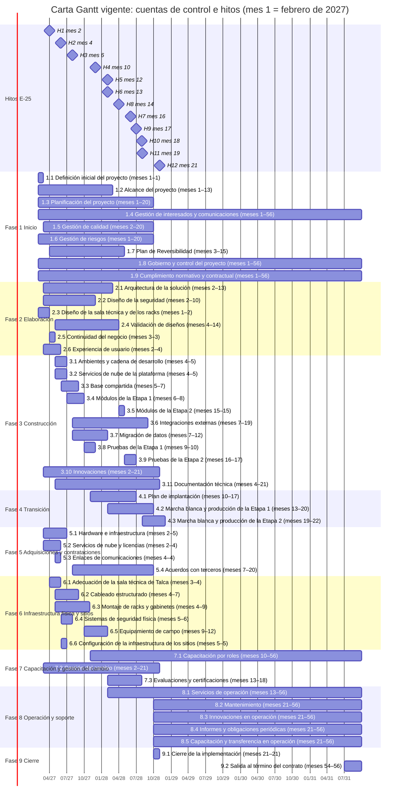

# Formulario T-14: Plan de trabajo, EDT y carta Gantt

Este formulario detalla lo que el Subdocumento 7 resume en sus secciones 7.1 y 7.3, conforme al Formulario T-14 de las Bases Administrativas y al Capítulo 7 del índice obligatorio de las Aclaraciones de la licitación. Contiene la estructura de descomposición del trabajo (EDT) completa; su diccionario, con el entregable, el criterio de aceptación, el responsable y el período de cada paquete; y la carta Gantt de los 56 meses del contrato. El método de estimación y programación, la ruta crítica y los frentes de trabajo se detallan en el Formulario T-15, y la implantación de cada etapa, en el Formulario T-18. La EDT termina en el paquete de trabajo; la descomposición de cada paquete en actividades de 8 a 80 horas hombre que caben en una quincena, con sus fechas, está en el Formulario T-15, sección 6. La EDT termina en el paquete de trabajo; la descomposición de cada paquete en actividades de 8 a 80 horas hombre que caben en una quincena está en el Formulario T-15, sección 6.

## 1 Estructura de descomposición del trabajo

La EDT descompone el 100 % del alcance de la Etapa 1, la Etapa 2 y la Operación (Bases Administrativas, Art. 15°) en nueve fases, 49 cuentas de control y 222 paquetes de trabajo. Las fases 1 a 4 son las del proceso de desarrollo declarado en el Capítulo 6 (Inicio, Elaboración, Construcción y Transición) y se recorren una vez por etapa. Las fases 5 a 9 agrupan el trabajo que no es desarrollo de software. Cada paquete es la hoja de su rama, tiene un único responsable y produce un entregable verificable. En la cuenta 3.10, cada innovación agrupa sus paquetes en un cuarto nivel. La Tabla T14.1 resume el tamaño de cada fase.

**Tabla T14.1. Cuentas de control y paquetes de trabajo por fase. Fuente: elaboración propia.**

| Fase | Cuentas de control | Paquetes de trabajo |
| --- | --- | --- |
| 1. Inicio | 9 | 35 |
| 2. Elaboración | 6 | 18 |
| 3. Construcción | 11 | 79 |
| 4. Transición | 3 | 10 |
| 5. Adquisiciones y contrataciones | 4 | 13 |
| 6. Infraestructura física y sitios | 6 | 24 |
| 7. Capacitación y gestión del cambio | 3 | 13 |
| 8. Operación y soporte (36 meses) | 5 | 26 |
| 9. Cierre | 2 | 4 |
| **Total** | **49** | **222** |

La construcción concentra 79 de los 222 paquetes, y las fases que no son software (5 a 7) suman 50. Ninguna cuenta de control tiene un solo paquete. La estructura completa es la siguiente, con la raíz «Plataforma logística de Distribuidora Puelche» y sus nueve fases en el primer nivel.

-  **1. Inicio**
  

    
-  1.1 Definición inicial del proyecto
    

      
-  1.1.1 Acta de constitución del proyecto, firmada con la Contraparte Técnica
      
-  1.1.2 Documento de validación con el CLIENTE de los problemas y metas del proyecto
      
-  1.1.3 Acta de confirmación con el CLIENTE de la fecha de inicio, la evidencia para el proveedor de lácteos, las ventanas de paso a producción y el acuse tributario
    

    
-  1.2 Alcance del proyecto
    

      
-  1.2.1 Documento de especificación de requerimientos y línea base de alcance de la Etapa 1 (H1)
      
-  1.2.2 Documento de reglas de ruteo capturadas al planificador de rutas
      
-  1.2.3 Documento de especificación de las interfaces sin documentación del ERP, del WMS de 2013 y de la telemetría del tercero
      
-  1.2.4 Matriz de trazabilidad: requerimiento, módulo, paquete y prueba (H1)
      
-  1.2.5 Documento de línea base de alcance de la Etapa 2: canal moderno y costo de servir (H8)
    

    
-  1.3 Planificación del proyecto
    

      
-  1.3.1 Plan para la dirección del proyecto, con el calendario de congelamientos de septiembre, diciembre y el cierre mensual
      
-  1.3.2 EDT y diccionario de la EDT (línea base del alcance)
      
-  1.3.3 Carta Gantt de 56 meses con los hitos H1 a H12 y la ruta crítica
      
-  1.3.4 Documento de nivelación de recursos y frentes del solapamiento de los meses 13 a 15 y 19 a 20
      
-  1.3.5 Reunión semanal de seguimiento con su informe semanal
    

    
-  1.4 Gestión de interesados y comunicaciones
    

      
-  1.4.1 Registro de interesados con su influencia, interés y estrategia
      
-  1.4.2 Plan de comunicaciones con calendario y canales por grupo de interés
      
-  1.4.3 Registro de solicitudes de cambio con análisis de impacto
    

    
-  1.5 Gestión de calidad
    

      
-  1.5.1 Plan de calidad y plan de pruebas
      
-  1.5.2 Puertas de calidad automáticas en la cadena de integración (cobertura mínima del 80 %)
    

    
-  1.6 Gestión de riesgos
    

      
-  1.6.1 Plan de riesgos y registro inicial de riesgos según ISO 31000
      
-  1.6.2 Registro de riesgos revisado en cada Comité de Proyecto
    

    
-  1.7 Plan de Reversibilidad
    

      
-  1.7.1 Plan de Reversibilidad inicial (primeros 90 días)
      
-  1.7.2 Primera actualización anual del Plan de Reversibilidad durante la implementación
    

    
-  1.8 Gobierno y control del proyecto
    

      
-  1.8.1 Oficina de gestión del proyecto con metodología basada en el PMBOK
      
-  1.8.2 Actas del Comité Ejecutivo mensual, con la aprobación de los cambios de alcance
      
-  1.8.3 Actas del Comité de Proyecto quincenal
      
-  1.8.4 Actas del Comité de Arquitectura mensual
      
-  1.8.5 Actas del Comité de Operación mensual, desde el mes 13
      
-  1.8.6 Informe mensual de avance con valor ganado
      
-  1.8.7 Tablero de estado del proyecto disponible para el CLIENTE
      
-  1.8.8 Espacio colaborativo con la documentación, los entregables, las actas, los riesgos y los cambios
    

    
-  1.9 Cumplimiento normativo y contractual
    

      
-  1.9.1 Matriz de cumplimiento normativo por obligación legal, con su control y su evidencia
      
-  1.9.2 Acuerdo de tratamiento de datos personales con el CLIENTE
      
-  1.9.3 Registro de actividades de tratamiento y evaluación de impacto en protección de datos
      
-  1.9.4 Certificación ISO/IEC 27001 vigente y entrega anual de los informes de certificación
      
-  1.9.5 Garantía de fiel cumplimiento, seguros y certificados laborales vigentes durante el contrato
    

  

  
-  **2. Elaboración**
  

    
-  2.1 Arquitectura de la solución
    

      
-  2.1.1 Documento de arquitectura lógica: capas, módulos M1 a M12 e interfaces
      
-  2.1.2 Documento de arquitectura física híbrida: nube, centros de distribución y plataformas de cross-docking
      
-  2.1.3 Modelo de datos y diccionario de datos, con la trazabilidad por lote
      
-  2.1.4 Documento de diseño detallado de M11 y del intercambio con las cadenas
    

    
-  2.2 Diseño de la seguridad
    

      
-  2.2.1 Plan de seguridad de la información
      
-  2.2.2 Modelado de amenazas por componente y por integración externa, actualizado ante cada cambio
      
-  2.2.3 Plan de respuesta a incidentes de seguridad, con aviso al CLIENTE en dos horas
      
-  2.2.4 Matriz de clasificación de la información y matriz de controles
    

    
-  2.3 Diseño de la sala técnica y de los racks
    

      
-  2.3.1 Plano de la sala técnica de Talca, con su cálculo eléctrico y térmico
      
-  2.3.2 Plano de distribución de los racks R01 de servidores y R02 de comunicaciones
      
-  2.3.3 Plano de los gabinetes de borde de Concepción y de las plataformas de cross-docking
    

    
-  2.4 Validación de diseños
    

      
-  2.4.1 Acta de aprobación de la arquitectura, el plan de seguridad y el modelo de datos (H2)
      
-  2.4.2 Acta de aprobación del diseño detallado de la Etapa 2 (H8)
    

    
-  2.5 Continuidad del negocio
    

      
-  2.5.1 Plan de continuidad del negocio según ISO 22301, con análisis de impacto y procedimientos manuales
      
-  2.5.2 Plan de continuidad TIC según ISO/IEC 27031 y plan de recuperación ante desastres
    

    
-  2.6 Experiencia de usuario
    

      
-  2.6.1 Investigación con preparadores, preventistas, conductores y almaceneros
      
-  2.6.2 Prototipos y pruebas de usabilidad con participantes del CLIENTE
      
-  2.6.3 Indicadores de usabilidad comprometidos por transacción crítica
    

  

  
-  **3. Construcción**
  

    
-  3.1 Ambientes y cadena de desarrollo
    

      
-  3.1.1 Ambientes de Desarrollo y QA en la nube (H3)
      
-  3.1.2 Ambientes de Preproducción y Producción en la nube (H3)
      
-  3.1.3 Ambiente de recuperación ante desastres en la región secundaria (H3)
      
-  3.1.4 Cadena de integración y entrega continua, e infraestructura como código
      
-  3.1.5 Observabilidad de los doce módulos y de los sitios, con tableros para el CLIENTE (H3)
    

    
-  3.2 Servicios de nube de la plataforma
    

      
-  3.2.1 Servicio de nube para la aplicación y los portales
      
-  3.2.2 Servicio de nube de base de datos, caché y mensajería
      
-  3.2.3 Servicio de nube de ingesta de IoT, telemetría cruda y plataforma analítica
      
-  3.2.4 Servicio de nube de respaldo inmutable y réplica entre regiones
      
-  3.2.5 Servicio de nube de seguridad y gobierno, y detección en endpoints
      
-  3.2.6 Servicio de gestión de dispositivos móviles
    

    
-  3.3 Base compartida
    

      
-  3.3.1 Identidad y control de acceso, incluidos los conductores externos que rotan sin aviso
      
-  3.3.2 Integración con el ERP como único emisor de la guía de despacho (INT-06 e INT-07)
      
-  3.3.3 Convivencia con el WMS de 2013 durante el reemplazo
      
-  3.3.4 Integración con la telemetría de los 42 camiones propios (INT-15)
      
-  3.3.5 Registro auditable de stock, lotes y cobros
      
-  3.3.6 Operación sin conexión: 14 horas en terreno y 24 horas en el CD
    

    
-  3.4 Módulos de la Etapa 1
    

      
-  3.4.1 Recepción de mercadería con captura de lote y vencimiento (M1 Recepción)
      
-  3.4.2 Inventario por ubicación y lote, con FEFO y conteo cíclico (M2 Inventario)
      
-  3.4.3 Preparación de pedidos en el turno de noche y en la cámara de congelado (M5 Preparación)
      
-  3.4.4 Cadena de frío, retención de lotes y retiro sanitario (M9 Calidad y trazabilidad)
      
-  3.4.5 Ingesta de temperatura y posición de la flota (M12 Telemetría)
      
-  3.4.6 Aplicación móvil de preventa sin conexión, con stock y crédito (M3 Preventa)
      
-  3.4.7 Planificación de rutas corregible por el planificador (M4 Rutas)
      
-  3.4.8 Aplicación móvil de reparto con prueba de entrega digital (M6 Reparto)
      
-  3.4.9 Devoluciones en terreno y control de envases (M8 Devoluciones y envases)
      
-  3.4.10 Cobro en ruta, rendición y conciliación (M7 Cobranza y rendición)
      
-  3.4.11 Indicadores operacionales y OTIF diario (M10 Analítica)
    

    
-  3.5 Módulos de la Etapa 2
    

      
-  3.5.1 Pedido electrónico y aviso de despacho para las cadenas, y portal de proveedores (M11 Canal moderno)
      
-  3.5.2 Portal web de clientes: cuenta, saldo, entregas y documentos
      
-  3.5.3 Portal web de transportistas: rutas asignadas del día siguiente
      
-  3.5.4 Costo de servir por cliente y por entrega (M10 Analítica)
    

    
-  3.6 Integraciones externas
    

      
-  3.6.1 Intercambio de lote y trazabilidad con los proveedores
      
-  3.6.2 Integración con la pasarela de pago para el cobro con tarjeta (INT-09)
      
-  3.6.3 Integración con el servicio de mapas y geocodificación (INT-10)
      
-  3.6.4 Integración con el servicio de avisos al cliente (INT-11)
      
-  3.6.5 Intercambio electrónico con la principal cadena, con sus pruebas aprobadas (INT-08)
      
-  3.6.6 Incorporación de las demás cadenas al intercambio electrónico (INT-08)
    

    
-  3.7 Migración de datos
    

      
-  3.7.1 Informe de perfilamiento y datos saneados
      
-  3.7.2 Datos maestros cargados: 8.400 SKU, clientes e instalaciones
      
-  3.7.3 Saldos migrados desde el WMS de Talca
      
-  3.7.4 Saldos cargados en Concepción desde el conteo físico
      
-  3.7.5 Acta de conciliación y corte fuera de las ventanas de congelamiento
    

    
-  3.8 Pruebas de la Etapa 1
    

      
-  3.8.1 Pruebas de integración, regresión e idempotencia en QA (H4)
      
-  3.8.2 Pruebas de aceptación y de accesibilidad con preventistas, conductores y bodega
      
-  3.8.3 Pruebas del perfil operacional: sin señal, sin enlace y a −22 °C con guantes
      
-  3.8.4 Pruebas de carga con el peak de septiembre y de resiliencia
      
-  3.8.5 Prueba de recuperación ante desastres con conmutación real
      
-  3.8.6 Prueba de seguridad ofensiva de la Etapa 1, por un tercero independiente
      
-  3.8.7 Acta de certificación de la Etapa 1 (H5)
      
-  3.8.8 Demostración en Preproducción del despliegue sin interrupción de la Etapa 1
    

    
-  3.9 Pruebas de la Etapa 2
    

      
-  3.9.1 Pruebas de integración y regresión sin afectar la Etapa 1 en producción (H9)
      
-  3.9.2 Pruebas de aceptación y de accesibilidad con cadenas, transportistas, Comercial y Finanzas
      
-  3.9.3 Pruebas de carga con ambas etapas activas y de resiliencia
      
-  3.9.4 Prueba de recuperación ante desastres con ambas etapas
      
-  3.9.5 Prueba de seguridad ofensiva de la Etapa 2, por un tercero independiente
      
-  3.9.6 Acta de certificación de la Etapa 2 y cierre del desarrollo (H10)
      
-  3.9.7 Demostración en Preproducción del despliegue sin interrupción de la Etapa 2
    

    
-  3.10 Innovaciones
    

      
-  3.10.1 Innovación 1: seguimiento de vencimiento posentrega en el local
      

        
-  3.10.1.1 Documento de catálogo de acciones y protocolo del piloto (INN-01.P1)
        
-  3.10.1.2 Estimador de saldo y ritmo de reposición (INN-01.P2)
        
-  3.10.1.3 Función de lista sin conexión en la aplicación de preventa (INN-01.P3)
        
-  3.10.1.4 Informe del piloto en marcha blanca y habilitación (INN-01.P4)
      

      
-  3.10.2 Innovación 2: reproducción de incidentes de terreno
      

        
-  3.10.2.1 Informe de medición inicial y contrato de evidencia (INN-02.P1)
        
-  3.10.2.2 Circuito mínimo de reproducción en la preventa (INN-02.P2)
        
-  3.10.2.3 Captura de evidencia en las aplicaciones de preventa, preparación y reparto (INN-02.P3)
        
-  3.10.2.4 Informe de validación comparada durante la implementación (INN-02.P4, primera parte)
      

      
-  3.10.3 Innovación 3: vida útil remanente por historia térmica del lote
      

        
-  3.10.3.1 Documento de familias priorizadas y parámetros aprobados (INN-03.P1)
        
-  3.10.3.2 Asociación lote–sensor en el borde y en el camión (INN-03.P2)
        
-  3.10.3.3 Vista en M9 y orden de salida sugerido (INN-03.P3)
        
-  3.10.3.4 Informe de validación en marcha blanca con Calidad (INN-03.P4)
      

      
-  3.10.4 Innovación 5: hoja de negocio del almacenero
      

        
-  3.10.4.1 Prototipo e informe de la prueba de comprensión (INN-05.P1)
        
-  3.10.4.2 Evaluación de privacidad y diseño de la impresión en cabina (INN-05.P2)
        
-  3.10.4.3 Cálculo y bloques 1 a 3 de la hoja de negocio (INN-05.P3)
        
-  3.10.4.4 Hoja certificada, en marcha blanca y en producción (INN-05.P4, primera parte)
      

    

    
-  3.11 Documentación técnica
    

      
-  3.11.1 Documentación técnica, funcional, de arquitectura, de operación y de seguridad
      
-  3.11.2 Base de conocimiento de incidentes y decisiones de diseño
      
-  3.11.3 Estándares de codificación y documentación de interfaces en OpenAPI y AsyncAPI
      
-  3.11.4 Inventario de componentes (SBOM) con sus licencias de código abierto
      
-  3.11.5 Depósito del código fuente en el repositorio del CLIENTE en cada liberación
    

  

  
-  **4. Transición**
  

    
-  4.1 Plan de implantación
    

      
-  4.1.1 Plan de olas de la Etapa 1 por sitio y zona: Talca, Concepción y plataformas de cross-docking
      
-  4.1.2 Procedimiento de reversión de la Etapa 1 antes de las 05:30, con versión operativa local y DTE emitidos por el ERP
      
-  4.1.3 Plan de implantación y reversión de la Etapa 2 fuera de la ventana de 05:30 a 07:00
    

    
-  4.2 Marcha blanca y producción de la Etapa 1
    

      
-  4.2.1 Marcha blanca de la Etapa 1 con conciliación diaria (H6)
      
-  4.2.2 Estabilización de la Etapa 1 en el turno de noche y acompañamiento en ruta
      
-  4.2.3 Acta de paso a producción y cierre de la Etapa 1 (H7)
    

    
-  4.3 Marcha blanca y producción de la Etapa 2
    

      
-  4.3.1 Marcha blanca de la Etapa 2 en convivencia con la Etapa 1 y fuente única de datos (H11)
      
-  4.3.2 Estabilización de la Etapa 2 con Comercial, Finanzas, cadenas y transportistas
      
-  4.3.3 Acta de paso a producción y aceptación final de la implementación (H12)
      
-  4.3.4 Garantía de correcto funcionamiento constituida, condición de la aceptación final (H12)
    

  

  
-  **5. Adquisiciones y contrataciones**
  

    
-  5.1 Hardware e infraestructura
    

      
-  5.1.1 Especificación de compra del equipamiento de terreno para el CLIENTE
      
-  5.1.2 Especificación y compra de la sala técnica, los racks, los servidores y los gabinetes de borde
      
-  5.1.3 Actas de recepción técnica del equipamiento de terreno comprado por el CLIENTE y de la infraestructura provista por LafroX
    

    
-  5.2 Servicios de nube y licencias
    

      
-  5.2.1 Contrato de los servicios de AWS
      
-  5.2.2 Suscripción del servicio de gestión de dispositivos y de detección en endpoints
      
-  5.2.3 Licencias de software de terceros constituidas a nombre del CLIENTE
    

    
-  5.3 Enlaces de comunicaciones
    

      
-  5.3.1 Contrato de fibra óptica de los CD de Talca y Concepción
      
-  5.3.2 Contrato de planes LTE con dos proveedores (ocho planes)
      
-  5.3.3 Contrato de Starlink para los cinco sitios: Talca, Concepción y las tres plataformas de cross-docking
    

    
-  5.4 Acuerdos con terceros
    

      
-  5.4.1 Acuerdos operacionales firmados con los diez transportistas
      
-  5.4.2 Acta de acuerdo con el sindicato sobre terminales, GPS y cámaras
      
-  5.4.3 Fórmula aprobada del tramo variable: reglas de atribución, canasta e índices (INN-04.P1)
      
-  5.4.4 Contrato de custodia de fuentes con un tercero independiente
    

  

  
-  **6. Infraestructura física y sitios**
  

    
-  6.1 Adecuación de la sala técnica de Talca
    

      
-  6.1.1 Coordinación de la obra civil de separación, a cargo del CLIENTE (RT-06.06), y piso técnico de la sala
      
-  6.1.2 Hardware de energía instalado: UPS modular N+1, generador con 24 horas de autonomía, transferencia automática y PDU A/B
      
-  6.1.3 Hardware de climatización de precisión N+1 instalado
      
-  6.1.4 Hardware de detección temprana de incendio y extinción por agente limpio instalado
      
-  6.1.5 Acta de recepción técnica de la sala
    

    
-  6.2 Cableado estructurado
    

      
-  6.2.1 Cableado de cobre Cat6A y fibra OM4 tendido, con dos ductos de ingreso independientes
      
-  6.2.2 Certificación de enlaces, etiquetado y planos as-built
      
-  6.2.3 Gabinetes de piso y switches de acceso instalados en las bodegas de Talca y Concepción
    

    
-  6.3 Montaje de racks y gabinetes
    

      
-  6.3.1 Rack R01 de servidores montado: clúster de tres nodos, respaldo local, consola KVM y traslado del servidor del ERP del CLIENTE a U25–U26, con respaldo completo verificado, en ventana dominical después del H3 y antes de la marcha blanca de Talca, sin cambios de software
      
-  6.3.2 Rack R02 de comunicaciones montado: firewalls, switches de núcleo y de gestión, y distribución de fibra
      
-  6.3.3 Gabinete de borde de Concepción montado: servidores activo y en espera, firewalls, switches, UPS, climatización y monitoreo, con toma del servicio por el de espera si falla el activo
      
-  6.3.4 Gabinetes de borde montados en Curicó, Chillán y Los Ángeles, con dos mini-PC (activo y en espera) por plataforma
    

    
-  6.4 Sistemas de seguridad física
    

      
-  6.4.1 Hardware de control de acceso biométrico y esclusa instalado
      
-  6.4.2 Hardware de videovigilancia instalado
      
-  6.4.3 Recinto de custodia de respaldos habilitado
    

    
-  6.5 Equipamiento de campo
    

      
-  6.5.1 Terminales de preventa, reparto y bodega configurados y enrolados
      
-  6.5.2 Terminales de pago configurados, uno por camión
      
-  6.5.3 Sensores de cámara y gateways IoT instalados en Talca y Concepción
      
-  6.5.4 Termógrafos instalados en los 28 camiones con frío (propios y de transportistas)
      
-  6.5.5 Impresoras de cabina instaladas
      
-  6.5.6 Impresoras de andén y balanzas de recepción instaladas
    

    
-  6.6 Configuración de la infraestructura de los sitios
    

      
-  6.6.1 Software de base instalado en los sitios: virtualización, contenedores, PostgreSQL, RabbitMQ y Keycloak
      
-  6.6.2 Enlaces de fibra, LTE y Starlink habilitados, con conmutación al respaldo
      
-  6.6.3 Borde de los CD en servicio, con la prueba de autonomía de 24 horas aprobada
    

  

  
-  **7. Capacitación y gestión del cambio**
  

    
-  7.1 Capacitación por roles
    

      
-  7.1.1 Plan de capacitación por perfil: usuarios finales, avanzados, administradores, equipo técnico y soporte
      
-  7.1.2 Programa de capacitación continua del turno de noche por la rotación del 38 %
      
-  7.1.3 Procedimiento de incorporación de los conductores de los transportistas en el andén
      
-  7.1.4 Traspaso al equipo de TI de cuatro personas del CLIENTE
      
-  7.1.5 Materiales de capacitación: manuales por perfil, guías rápidas, preguntas frecuentes y videos tutoriales
      
-  7.1.6 Plataforma de autoformación en línea con registro de avance
    

    
-  7.2 Gestión del cambio
    

      
-  7.2.1 Acompañamiento del personal con 20 o 30 años en la compañía
      
-  7.2.2 Gestión del cambio con las cadenas y los transportistas
      
-  7.2.3 Diagnóstico del impacto organizacional por área y perfil, con agentes de cambio
      
-  7.2.4 Procedimientos operativos afectados, rediseñados y documentados
      
-  7.2.5 Medición de la adopción y plan de acción correctiva
    

    
-  7.3 Evaluaciones y certificaciones
    

      
-  7.3.1 Certificación de preventistas, conductores y preparadores (Etapa 1)
      
-  7.3.2 Certificación de Comercial y Finanzas en costo de servir (Etapa 2)
    

  

  
-  **8. Operación y soporte (36 meses)**
  

    
-  8.1 Servicios de operación
    

      
-  8.1.1 Servicio de centro de operaciones 24×7 y mesa de servicio durante los 36 meses de operación (04:00 a 22:00; 24×7 en septiembre y diciembre)
      
-  8.1.2 Servicio de gestión de incidentes, problemas y niveles de servicio del Art. 78° durante los 36 meses de operación
      
-  8.1.3 Servicio de continuidad y pruebas semestrales de recuperación ante desastres durante los 36 meses de operación
      
-  8.1.4 Actualizaciones anuales del Plan de Reversibilidad durante los 36 meses de operación
      
-  8.1.5 Servicio de centro de operaciones de seguridad 24×7 con SIEM durante los 36 meses de operación
      
-  8.1.6 Pruebas mensuales de restauración de respaldos durante los 36 meses de operación
    

    
-  8.2 Mantenimiento
    

      
-  8.2.1 Mantenimiento correctivo y evolutivo del software durante los 36 meses de operación, con bolsa anual de horas y fuera de las ventanas de congelamiento
      
-  8.2.2 Mantenimiento de ciberseguridad durante los 36 meses de operación: vulnerabilidades, intrusión anual e inyección de fallas
      
-  8.2.3 Mantenimiento del hardware durante los 36 meses de operación: sala técnica, racks, gabinetes de borde y equipamiento de terreno
      
-  8.2.4 Registro y reducción de la deuda técnica durante los 36 meses de operación
      
-  8.2.5 Actualizaciones anuales de los componentes de base durante los 36 meses de operación
      
-  8.2.6 Revisiones semestrales de las instalaciones eléctricas de la sala durante los 36 meses de operación
      
-  8.2.7 Ciclo de vida del equipamiento durante los 36 meses de operación: reposición y disposición final
    

    
-  8.3 Innovaciones en operación
    

      
-  8.3.1 Innovación 2: mantenimiento de escenarios de regresión (INN-02.P4, segunda parte)
      
-  8.3.2 Innovación 3: revisión semestral de parámetros durante los 36 meses de operación (INN-03.P5)
      
-  8.3.3 Innovación 4: línea base y liquidaciones en sombra (INN-04.P2)
      
-  8.3.4 Innovación 4: liquidación mensual del tramo variable, meses 24 a 56 (INN-04.P3)
      
-  8.3.5 Innovación 5: despliegue gradual por rutas (INN-05.P4, segunda parte)
      
-  8.3.6 Innovación 5: bloque 4 condicionado (INN-05.P5)
    

    
-  8.4 Informes y obligaciones periódicas
    

      
-  8.4.1 Gestión de la capacidad con proyección trimestral durante los 36 meses de operación
      
-  8.4.2 Informes mensuales de consumo de nube (FinOps) durante los 36 meses de operación
      
-  8.4.3 Estimaciones anuales de la huella de carbono de la operación
      
-  8.4.4 Actualizaciones semestrales del depósito de custodia de fuentes durante los 36 meses de operación
    

    
-  8.5 Capacitación y transferencia en operación
    

      
-  8.5.1 Dos jornadas anuales de actualización y capacitación del personal nuevo durante los 36 meses de operación
      
-  8.5.2 Mentoría al equipo técnico del CLIENTE durante los seis meses posteriores al mes 21
      
-  8.5.3 Mantenimiento de la base de conocimiento durante los 36 meses de operación, con métricas de uso
    

  

  
-  **9. Cierre**
  

    
-  9.1 Cierre de la implementación
    

      
-  9.1.1 Entrega del código fuente, la infraestructura como código y los procedimientos de despliegue
      
-  9.1.2 Informe de lecciones aprendidas y archivo de la implementación
    

    
-  9.2 Salida al término del contrato
    

      
-  9.2.1 Ejecución del Plan de Reversibilidad y acompañamiento de 90 días
      
-  9.2.2 Certificado de devolución o eliminación de datos personales

## 2 Diccionario de la EDT

El diccionario describe cada paquete con su entregable, su criterio de aceptación, su responsable y el período del cronograma en que se ejecuta, con el hito del Formulario E-25 que habilita cuando corresponde. Todo entregable se recibe con un acta de la Contraparte Técnica (Bases Administrativas, Art. 18.1), que acompaña la evidencia de verificación, la trazabilidad hacia los requerimientos del Formulario T-12 y las observaciones resueltas (Art. 18.2). Los criterios de cada paquete se suman a esa regla común.

Los responsables son los roles de la estructura para el proyecto del Capítulo 1, sección 1.5. La Tabla T14.2 presenta las siglas usadas en el diccionario.

**Tabla T14.2. Responsables de los paquetes. Fuente: Capítulo 1, sección 1.5.**

| Sigla | Rol | Persona |
| --- | --- | --- |
| JP | Jefe de Proyecto | Alex Aravena |
| ARQ | Arquitecto de Solución | Bastián Trejo |
| SEG | Encargado de Seguridad de la Información | Álvaro Catalán |
| DAT | Líder de Datos | Leandro Chamorro |
| DES | Líder de Desarrollo | Tomás Pérez |
| CAL | Líder de Calidad | Maximiliano Miño |
| SRE | Líder de Operación / SRE | Guillermo Castillo |
| IMP | Líder de Implantación y Gestión del Cambio | Patricio Henríquez |

Los paquetes de la fase 8 son paquetes de esfuerzo continuo. Cada uno cubre un servicio durante los 36 meses de operación y se controla con entregables mensuales o anuales, como el informe de servicio, el informe de pruebas o la actualización de un plan; esos entregables son sus puntos de verificación.

### 2.1 Fase 1. Inicio

La fase 1 reúne 9 cuentas de control y 35 paquetes de trabajo.

#### Cuenta 1.1 — Definición inicial del proyecto

Esta cuenta de control reúne los tres documentos con que el proyecto arranca formalmente.

La Tabla T14.3 presenta sus paquetes.

**Tabla T14.3. Diccionario de la cuenta 1.1. Fuente: elaboración propia.**

| Código | Paquete de trabajo | Entregable | Criterio de aceptación | Resp. | Período |
| --- | --- | --- | --- | --- | --- |
| 1.1.1 | Acta de constitución del proyecto, firmada con la Contraparte Técnica | Acta firmada por LafroX y Puelche. | Está firmada en el mes 1 e identifica al patrocinador, a la Contraparte Técnica, al Jefe de Proyecto y los objetivos. | JP | Mes 1. |
| 1.1.2 | Documento de validación con el CLIENTE de los problemas y metas del proyecto | Documento de validación con los cambios acordados, si los hay. | Las gerencias del CLIENTE confirman por escrito los problemas y las metas. | JP | Mes 1. |
| 1.1.3 | Acta de confirmación con el CLIENTE de la fecha de inicio, la evidencia para el proveedor de lácteos, las ventanas de paso a producción y el acuse tributario | Acta con la respuesta del CLIENTE a cada tema. | Los cuatro temas tienen una respuesta escrita incorporada al plan. | JP | Mes 1, antes del H1. |

#### Cuenta 1.2 — Alcance del proyecto

Esta cuenta de control fija qué se construye y deja todo listo para diseñar. Incluye la captura del conocimiento del planificador y el levantamiento de las interfaces, porque ambos son insumos del alcance.

La Tabla T14.4 presenta sus paquetes.

**Tabla T14.4. Diccionario de la cuenta 1.2. Fuente: elaboración propia.**

| Código | Paquete de trabajo | Entregable | Criterio de aceptación | Resp. | Período |
| --- | --- | --- | --- | --- | --- |
| 1.2.1 | Documento de especificación de requerimientos y línea base de alcance de la Etapa 1 (H1) | Especificación de requerimientos aprobada (línea base de alcance). | El 100 % de los requerimientos de la Etapa 1 tiene módulo y criterio de aceptación, y la línea base está firmada en el mes 2. | ARQ | Mes 1 (H1). |
| 1.2.2 | Documento de reglas de ruteo capturadas al planificador de rutas | Catálogo de reglas de ruteo validado por don Hugo. | Don Hugo firma que las reglas representan su criterio. Las rutas que el software genera con esas reglas resultan operables cuando se comparan con las suyas. | IMP | Meses 1 a 3. |
| 1.2.3 | Documento de especificación de las interfaces sin documentación del ERP, del WMS de 2013 y de la telemetría del tercero | Especificación de cada interfaz (formato, volumen y horario) y prueba de conexión. | Cada interfaz tiene contrato y una prueba de conexión exitosa en el ambiente de Desarrollo antes del H2. | ARQ | Meses 1 a 4. |
| 1.2.4 | Matriz de trazabilidad: requerimiento, módulo, paquete y prueba (H1) | Matriz de trazabilidad. | Ningún requerimiento ofertado queda sin paquete ni sin prueba. | CAL | Mes 2 (H1). Se actualiza con cada cambio aprobado. |
| 1.2.5 | Documento de línea base de alcance de la Etapa 2: canal moderno y costo de servir (H8) | Línea base de alcance de la Etapa 2. | Está aprobada por la Contraparte Técnica en el mes 14. | ARQ | Mes 13 (H8). |

#### Cuenta 1.3 — Planificación del proyecto

Esta cuenta de control reúne los documentos que dicen cómo y cuándo se hará el trabajo, y los informes que muestran si se cumple.

La Tabla T14.5 presenta sus paquetes.

**Tabla T14.5. Diccionario de la cuenta 1.3. Fuente: elaboración propia.**

| Código | Paquete de trabajo | Entregable | Criterio de aceptación | Resp. | Período |
| --- | --- | --- | --- | --- | --- |
| 1.3.1 | Plan para la dirección del proyecto, con el calendario de congelamientos de septiembre, diciembre y el cierre mensual | Plan para la dirección con el calendario de congelamientos. | Ningún paso a producción, corte de datos ni despliegue cae en una fecha prohibida; los meses 16 y 21 coinciden con el Art. 17°; el plan está aprobado. | JP | Mes 1 (H1). Se actualiza con cada cambio. |
| 1.3.2 | EDT y diccionario de la EDT (línea base del alcance) | EDT dibujada y diccionario aprobados. | Todo requerimiento de la matriz (1.2.4) cae en un paquete, y ningún paquete queda sin responsable. | JP | Mes 2 (H1). |
| 1.3.3 | Carta Gantt de 56 meses con los hitos H1 a H12 y la ruta crítica | Carta Gantt aprobada. | Cubre los 56 meses, respeta el Art. 17° y nombra la ruta crítica con su cálculo. | JP | Mes 2. |
| 1.3.4 | Documento de nivelación de recursos y frentes del solapamiento de los meses 13 a 15 y 19 a 20 | Nivelación de recursos por etapa y por frente. | Ningún mes asigna a una persona por sobre su capacidad, y los dos frentes del solapamiento tienen dotación propia. | JP | Mes 2. Se revisa antes del mes 13. |
| 1.3.5 | Reunión semanal de seguimiento con su informe semanal | Una reunión y un informe por semana. | La reunión se hace cada semana, y su informe se publica con el avance por paquete y las desviaciones frente al cronograma. | JP | Semanal, durante toda la implementación. |

#### Cuenta 1.4 — Gestión de interesados y comunicaciones

Esta cuenta de control reúne el trabajo con las personas que pueden apoyar o frenar el proyecto, y el lugar donde se toman las decisiones.

La Tabla T14.6 presenta sus paquetes.

**Tabla T14.6. Diccionario de la cuenta 1.4. Fuente: elaboración propia.**

| Código | Paquete de trabajo | Entregable | Criterio de aceptación | Resp. | Período |
| --- | --- | --- | --- | --- | --- |
| 1.4.1 | Registro de interesados con su influencia, interés y estrategia | Registro de interesados. | Están los 17 grupos, cada uno con un responsable de la relación, y el registro se revisa antes de cada ola de implantación. | JP | Mes 1. |
| 1.4.2 | Plan de comunicaciones con calendario y canales por grupo de interés | Plan de comunicaciones. | Cada grupo del registro tiene su mensaje, su canal y su frecuencia. | JP | Mes 1. |
| 1.4.3 | Registro de solicitudes de cambio con análisis de impacto | Registro de solicitudes de cambio con su análisis de impacto. | Cada solicitud tiene su análisis de impacto y la decisión del Comité Ejecutivo, y ningún cambio se ejecuta sin aprobación. | JP | Durante todo el contrato. |

#### Cuenta 1.5 — Gestión de calidad

Esta cuenta de control reúne las reglas que impiden que algo defectuoso llegue a los usuarios.

La Tabla T14.7 presenta sus paquetes.

**Tabla T14.7. Diccionario de la cuenta 1.5. Fuente: elaboración propia.**

| Código | Paquete de trabajo | Entregable | Criterio de aceptación | Resp. | Período |
| --- | --- | --- | --- | --- | --- |
| 1.5.1 | Plan de calidad y plan de pruebas | Plan de calidad y plan de pruebas aprobados. | Cada tipo de prueba que exigen las Bases tiene su ambiente, su calendario y su criterio de salida. | CAL | Mes 2. |
| 1.5.2 | Puertas de calidad automáticas en la cadena de integración (cobertura de pruebas unitarias del 80 % y de lógica de negocio del 70 %) | Puertas activas en la cadena de integración, con su informe de métricas. | Una versión queda bloqueada si la cobertura de líneas por pruebas unitarias del código modificado es inferior al 80 % (política del SD1) o si la cobertura de la lógica de negocio de los módulos es inferior al 70 % (RT-04.11); ninguna llega a Preproducción con pruebas en falla. | CAL | Desde que existe la cadena de integración (3.1.4). |

#### Cuenta 1.6 — Gestión de riesgos

Esta cuenta de control mantiene vivo el registro de riesgos y verifica que cada respuesta se ejecute.

La Tabla T14.8 presenta sus paquetes.

**Tabla T14.8. Diccionario de la cuenta 1.6. Fuente: elaboración propia.**

| Código | Paquete de trabajo | Entregable | Criterio de aceptación | Resp. | Período |
| --- | --- | --- | --- | --- | --- |
| 1.6.1 | Plan de riesgos y registro inicial de riesgos según ISO 31000 | Plan de riesgos y registro inicial. | Cada riesgo tiene dueño, disparador y respuesta, y cada respuesta tiene un paquete o una actividad en la EDT. | JP | Mes 2. |
| 1.6.2 | Registro de riesgos revisado en cada Comité de Proyecto | Registro actualizado con su historial. | El registro se revisa en cada Comité de Proyecto, y cada cambio de evaluación queda registrado. | JP | Quincenal, durante toda la implementación. |

#### Cuenta 1.7 — Plan de Reversibilidad

Esta cuenta de control asegura que Puelche pueda cambiar de proveedor o asumir la operación sin interrumpir el servicio. Lo exige el Art. 77°.

La Tabla T14.9 presenta sus paquetes.

**Tabla T14.9. Diccionario de la cuenta 1.7. Fuente: elaboración propia.**

| Código | Paquete de trabajo | Entregable | Criterio de aceptación | Resp. | Período |
| --- | --- | --- | --- | --- | --- |
| 1.7.1 | Plan de Reversibilidad inicial (primeros 90 días) | Plan de Reversibilidad. | Se entrega dentro de los primeros 90 días con sus cuatro contenidos. | JP | Hasta el mes 3. |
| 1.7.2 | Primera actualización anual del Plan de Reversibilidad durante la implementación | Plan actualizado. | El inventario coincide con lo instalado a la fecha de la actualización. | JP | Mes 15, al cumplirse un año de la entrega de 1.7.1; las actualizaciones de los meses 27, 39 y 51 son el paquete 8.1.4 (Art. 77.2). |

#### Cuenta 1.8 — Gobierno y control del proyecto

Esta cuenta de control reúne las instancias de gobierno que el Art. 71° de las Bases Administrativas hace obligatorias para ambas partes, y los mecanismos de control y reporte del capítulo 19 de las Bases Técnicas Transversales. Las actas de todos los comités se levantan dentro de los dos días hábiles siguientes, con acuerdos, responsables y plazos (RT-19.09).

La Tabla T14.10 presenta sus paquetes.

**Tabla T14.10. Diccionario de la cuenta 1.8. Fuente: elaboración propia.**

| Código | Paquete de trabajo | Entregable | Criterio de aceptación | Resp. | Período |
| --- | --- | --- | --- | --- | --- |
| 1.8.1 | Oficina de gestión del proyecto con metodología basada en el PMBOK | Oficina constituida, con su manual de procedimientos y sus plantillas. | Los procesos de alcance, cronograma, costos, riesgos, cambios y comunicaciones tienen procedimiento y responsable desde el mes 1. | JP | Mes 1, y durante toda la implementación. |
| 1.8.2 | Actas del Comité Ejecutivo mensual, con la aprobación de los cambios de alcance | Un acta por reunión mensual, con las decisiones y los cambios aprobados o rechazados. | Hay un acta por mes, levantada dentro de dos días hábiles, y todo cambio ejecutado tiene su aprobación previa en un acta. | JP | Mensual, durante todo el contrato. |
| 1.8.3 | Actas del Comité de Proyecto quincenal | Un acta por reunión quincenal. | Hay un acta cada quince días, levantada dentro de dos días hábiles. | JP | Quincenal, durante la implementación. |
| 1.8.4 | Actas del Comité de Arquitectura mensual | Un acta por reunión mensual, con las decisiones de arquitectura registradas. | Hay un acta por mes, y cada decisión aprobada está en el registro de decisiones de arquitectura. | ARQ | Mensual, durante todo el contrato. |
| 1.8.5 | Actas del Comité de Operación mensual, desde el mes 13 | Un acta por reunión mensual, desde el mes 13 hasta el mes 56. | Hay un acta por mes, levantada dentro de dos días hábiles. | SRE | Mensual, meses 13 a 56. |
| 1.8.6 | Informe mensual de avance con valor ganado | Un informe por mes. | Cada informe trae los índices de valor ganado, y cada desviación mayor al 10 % tiene su aviso y su plan dentro de cinco días hábiles. | JP | Mensual, durante la implementación. |
| 1.8.7 | Tablero de estado del proyecto disponible para el CLIENTE | Tablero publicado, con acceso para el CLIENTE. | El CLIENTE accede en todo momento, y los datos coinciden con el último informe. | JP | Desde el mes 2. |
| 1.8.8 | Espacio colaborativo con la documentación, los entregables, las actas, los riesgos y los cambios | Espacio colaborativo habilitado, con acceso para el CLIENTE. | Cada entregable aceptado y cada acta están en el espacio, en su versión vigente. | JP | Desde el mes 1. |

#### Cuenta 1.9 — Cumplimiento normativo y contractual

Esta cuenta de control reúne las obligaciones legales y contractuales que no producen software, pero que el contrato exige mantener y acreditar: cumplimiento normativo, datos personales, certificación de seguridad, garantías, seguros y obligaciones laborales.

La Tabla T14.11 presenta sus paquetes.

**Tabla T14.11. Diccionario de la cuenta 1.9. Fuente: elaboración propia.**

| Código | Paquete de trabajo | Entregable | Criterio de aceptación | Resp. | Período |
| --- | --- | --- | --- | --- | --- |
| 1.9.1 | Matriz de cumplimiento normativo por obligación legal, con su control y su evidencia | Matriz de cumplimiento normativo. | Cada obligación aplicable tiene su control y su evidencia, y la matriz está aprobada por el CLIENTE. | SEG | Mes 1, y actualizada ante cada cambio normativo. |
| 1.9.2 | Acuerdo de tratamiento de datos personales con el CLIENTE | Acuerdo firmado. | Está firmado antes de tratar datos reales; es decir, antes de cargar el maestro (3.7.2). | SEG | Mes 1. |
| 1.9.3 | Registro de actividades de tratamiento y evaluación de impacto en protección de datos | Registro de tratamientos y evaluaciones de impacto. | Cada tratamiento tiene su registro; los de alto riesgo tienen evaluación de impacto; hay una contraparte designada. | SEG | Mes 2, y actualizado ante cada tratamiento nuevo. |
| 1.9.4 | Certificación ISO/IEC 27001 vigente y entrega anual de los informes de certificación | Certificación vigente durante el contrato e informe anual de certificaciones. | La certificación nunca está vencida, y hay un informe entregado cada año. | SEG | Anual, durante todo el contrato. |
| 1.9.5 | Garantía de fiel cumplimiento, seguros y certificados laborales vigentes durante el contrato | Garantía constituida, pólizas acreditadas cada año y certificados laborales mensuales. | Ninguna garantía ni póliza queda vencida, y hay un certificado laboral por mes. | JP | Desde la adjudicación hasta el término del contrato. |

### 2.2 Fase 2. Elaboración

La fase 2 reúne 6 cuentas de control y 18 paquetes de trabajo.

#### Cuenta 2.1 — Arquitectura de la solución

Esta cuenta de control reúne los planos técnicos del software y de su emplazamiento.

La Tabla T14.12 presenta sus paquetes.

**Tabla T14.12. Diccionario de la cuenta 2.1. Fuente: elaboración propia.**

| Código | Paquete de trabajo | Entregable | Criterio de aceptación | Resp. | Período |
| --- | --- | --- | --- | --- | --- |
| 2.1.1 | Documento de arquitectura lógica: capas, módulos M1 a M12 e interfaces | Documento de arquitectura lógica. | Está aprobado en el H2, y cada requerimiento de la línea base apunta a un módulo. | ARQ | Mes 2 (H2). |
| 2.1.2 | Documento de arquitectura física híbrida: nube, centros de distribución y plataformas de cross-docking | Documento de arquitectura física. | Está aprobado en el H2, y cada componente tiene su lugar y su razón. | ARQ | Mes 2 (H2). |
| 2.1.3 | Modelo de datos y diccionario de datos, con la trazabilidad por lote | Modelo de datos y diccionario de datos. | Está aprobado en el H2, y un retiro simulado recorre un lote desde la recepción hasta sus clientes. | DAT | Mes 2 (H2). |
| 2.1.4 | Documento de diseño detallado de M11 y del intercambio con las cadenas | Documento de diseño detallado de la Etapa 2. | Está aprobado en el H8 y no cambia ningún contrato de la Etapa 1. | ARQ | Mes 13 (H8). |

#### Cuenta 2.2 — Diseño de la seguridad

Esta cuenta de control define cómo se protegen los datos y los accesos.

La Tabla T14.13 presenta sus paquetes.

**Tabla T14.13. Diccionario de la cuenta 2.2. Fuente: elaboración propia.**

| Código | Paquete de trabajo | Entregable | Criterio de aceptación | Resp. | Período |
| --- | --- | --- | --- | --- | --- |
| 2.2.1 | Plan de seguridad de la información | Plan de seguridad. | Está aprobado en el H2, y cada requisito de seguridad del T-12 tiene su control. | SEG | Mes 2 (H2). |
| 2.2.2 | Modelado de amenazas por componente y por integración externa, actualizado ante cada cambio | Modelo de amenazas con sus controles. | Cada amenaza alta tiene un control probado o un riesgo aceptado por escrito por el CLIENTE. | SEG | Meses 3 a 10, y ante cada cambio de arquitectura. |
| 2.2.3 | Plan de respuesta a incidentes de seguridad, con aviso al CLIENTE en dos horas | Plan de respuesta a incidentes de seguridad. | El plan define la clasificación, el escalamiento, los plazos y los responsables, y se ensaya una vez antes del H5. | SEG | Mes 3. |
| 2.2.4 | Matriz de clasificación de la información y matriz de controles | Las dos matrices. | Cada tipo de dato tiene su nivel, y cada nivel tiene sus controles implementados. | SEG | Mes 2 (con el H2). |

#### Cuenta 2.3 — Diseño de la sala técnica y de los racks

Esta cuenta de control reúne los planos de la infraestructura física que se instala en la fase 6. La sala actual de Talca tiene 25 m², un aire acondicionado de pared y una UPS que dura 10 minutos, y no cumple el estándar exigido (Caso, cap. 5 y 16).

La Tabla T14.14 presenta sus paquetes.

**Tabla T14.14. Diccionario de la cuenta 2.3. Fuente: elaboración propia.**

| Código | Paquete de trabajo | Entregable | Criterio de aceptación | Resp. | Período |
| --- | --- | --- | --- | --- | --- |
| 2.3.1 | Plano de la sala técnica de Talca, con su cálculo eléctrico y térmico | Plano y memoria de cálculo. | La potencia y la climatización calculadas cubren la carga de diseño con redundancia N+1. | SRE | Meses 1 y 2. |
| 2.3.2 | Plano de distribución de los racks R01 de servidores y R02 de comunicaciones | Plano de distribución de los racks. | Los servidores y las comunicaciones quedan en racks separados (RT-06.05), y cada equipo tiene doble alimentación (RT-08.04). | SRE | Meses 1 y 2. |
| 2.3.3 | Plano de los gabinetes de borde de Concepción y de las plataformas de cross-docking | Planos de los gabinetes. | Cada gabinete sostiene su sitio operando sin enlace durante el tiempo declarado. | SRE | Mes 2. |

#### Cuenta 2.4 — Validación de diseños

Esta cuenta de control reúne las dos actas que cierran las fases de Elaboración y dan acceso a los hitos de pago.

La Tabla T14.15 presenta sus paquetes.

**Tabla T14.15. Diccionario de la cuenta 2.4. Fuente: elaboración propia.**

| Código | Paquete de trabajo | Entregable | Criterio de aceptación | Resp. | Período |
| --- | --- | --- | --- | --- | --- |
| 2.4.1 | Acta de aprobación de la arquitectura, el plan de seguridad y el modelo de datos (H2) | Acta del H2. | Está firmada en el mes 4, sin observaciones abiertas. | ARQ | Mes 4 (H2). |
| 2.4.2 | Acta de aprobación del diseño detallado de la Etapa 2 (H8) | Acta del H8. | Está firmada en el mes 14. | ARQ | Mes 14 (H8). |

#### Cuenta 2.5 — Continuidad del negocio

Esta cuenta de control reúne los planes que dicen cómo sigue operando Puelche si la solución, un sitio o un proveedor fallan. Va más allá de la recuperación técnica (3.1.3): incluye contingencias auxiliares manuales cuando el proceso las admite. El despacho de 96 camiones entre 05:30 y 07:00 requiere continuidad tecnológica probada, sin sustitución manual ni interrupción.

La Tabla T14.16 presenta sus paquetes.

**Tabla T14.16. Diccionario de la cuenta 2.5. Fuente: elaboración propia.**

| Código | Paquete de trabajo | Entregable | Criterio de aceptación | Resp. | Período |
| --- | --- | --- | --- | --- | --- |
| 2.5.1 | Plan de continuidad del negocio según ISO 22301, con análisis de impacto y procedimientos manuales | Plan de continuidad del negocio con su análisis de impacto. | Cada proceso identifica continuidad y activación aprobadas por CLIENTE; sólo admite apoyo manual donde corresponda. El despacho crítico exige cero interrupción y flujo tecnológico/DTE probado, independientemente del RTO general. | SRE | Mes 3. |
| 2.5.2 | Plan de continuidad TIC según ISO/IEC 27031 y plan de recuperación ante desastres | Plan de continuidad TIC y plan de recuperación ante desastres. | Los dos planes están articulados con el plan de continuidad del negocio, y el RTO y el RPO coinciden con los comprometidos. | SRE | Mes 3. |

#### Cuenta 2.6 — Experiencia de usuario

Esta cuenta de control reúne el trabajo de diseñar la solución con las personas que la van a usar, **antes** de construirla. Lo exige el Art. 26°. En Puelche es decisivo: preparadores con guantes a −22 °C, preventistas sin señal, conductores externos que se incorporan en minutos y almaceneros sin internet.

La Tabla T14.17 presenta sus paquetes.

**Tabla T14.17. Diccionario de la cuenta 2.6. Fuente: elaboración propia.**

| Código | Paquete de trabajo | Entregable | Criterio de aceptación | Resp. | Período |
| --- | --- | --- | --- | --- | --- |
| 2.6.1 | Investigación con preparadores, preventistas, conductores y almaceneros | Informe de investigación de usuarios por perfil. | Cada perfil operacional tiene sus tareas críticas y sus condiciones de uso documentadas. | IMP | Mes 2. |
| 2.6.2 | Prototipos y pruebas de usabilidad con participantes del CLIENTE | Prototipos e informe de las pruebas de usabilidad. | Cada flujo crítico se probó con usuarios de su perfil, y los hallazgos están incorporados al diseño antes de construir el módulo (D-05). | IMP | Mes 3. |
| 2.6.3 | Indicadores de usabilidad comprometidos por transacción crítica | Tabla de indicadores de usabilidad. | Cada transacción crítica tiene sus cuatro indicadores, que se verifican en las pruebas de aceptación (3.8.2). | IMP | Mes 4. |

### 2.3 Fase 3. Construcción

La fase 3 reúne 11 cuentas de control y 79 paquetes de trabajo.

#### Cuenta 3.1 — Ambientes y cadena de desarrollo

Esta cuenta de control reúne los lugares donde el software se construye, se prueba y se ejecuta, y las herramientas que lo mueven entre ellos. Las Bases exigen cinco ambientes: Desarrollo, QA, Preproducción, Producción y Recuperación ante desastres.

La Tabla T14.18 presenta sus paquetes.

**Tabla T14.18. Diccionario de la cuenta 3.1. Fuente: elaboración propia.**

| Código | Paquete de trabajo | Entregable | Criterio de aceptación | Resp. | Período |
| --- | --- | --- | --- | --- | --- |
| 3.1.1 | Ambientes de Desarrollo y QA en la nube (H3) | Ambientes de Desarrollo y QA operativos. | La cadena de integración despliega todos los módulos en ambos ambientes. | SRE | Hasta el mes 5 (H3). |
| 3.1.2 | Ambientes de Preproducción y Producción en la nube (H3) | Ambientes de Preproducción y Producción operativos. | La misma versión del software pasa de QA a Preproducción y a Producción sin volver a compilarse; toda diferencia de escala entre Preproducción y Producción está declarada. | SRE | Hasta el mes 5 (H3). |
| 3.1.3 | Ambiente de recuperación ante desastres en la región secundaria (H3) | Ambiente de recuperación habilitado, con su procedimiento de conmutación. | El ambiente está habilitado en el H3. La prueba real se hace en 3.8.5. | SRE | Hasta el mes 5 (H3). |
| 3.1.4 | Cadena de integración y entrega continua, e infraestructura como código | Cadena operativa y repositorio de infraestructura como código. | Un cambio pasa por la cadena hasta QA sin intervención manual; los ambientes se pueden recrear desde el repositorio. | SRE | Mes 4. |
| 3.1.5 | Observabilidad de los doce módulos y de los sitios, con tableros para el CLIENTE (H3) | Tableros y alertas operativos. | Cada módulo y cada sitio publica sus indicadores con alertas configuradas. | SRE | Hasta el mes 5 (H3: «con observabilidad operativa»). |

#### Cuenta 3.2 — Servicios de nube de la plataforma

Esta cuenta de control reúne la puesta en marcha de cada servicio de nube del T-11, antes de que el software lo use. Contratar el servicio no basta: hay que configurarlo según el plan de seguridad y conectarlo a la observabilidad.

La Tabla T14.19 presenta sus paquetes.

**Tabla T14.19. Diccionario de la cuenta 3.2. Fuente: elaboración propia.**

| Código | Paquete de trabajo | Entregable | Criterio de aceptación | Resp. | Período |
| --- | --- | --- | --- | --- | --- |
| 3.2.1 | Servicio de nube para la aplicación y los portales | Servicio configurado. | El software se despliega en él y cumple el plan de seguridad. | SRE | Mes 4. |
| 3.2.2 | Servicio de nube de base de datos, caché y mensajería | Servicio configurado. | La base de datos replica a la región secundaria y las colas entregan los mensajes sin duplicarlos. | SRE | Mes 4. |
| 3.2.3 | Servicio de nube de ingesta de IoT, telemetría cruda y plataforma analítica | Servicio configurado. | Las lecturas de un sensor de prueba llegan al almacén analítico. | SRE | Mes 4. |
| 3.2.4 | Servicio de nube de respaldo inmutable y réplica entre regiones | Servicio configurado, con su política de retención. | Una restauración de prueba recupera los datos. | SRE | Mes 4. |
| 3.2.5 | Servicio de nube de seguridad y gobierno, y detección en endpoints | Servicio configurado. | Los controles del plan de seguridad están activos y los equipos físicos reportan a la consola. | SEG | Mes 4. |
| 3.2.6 | Servicio de gestión de dispositivos móviles | Servicio configurado. | Un terminal de prueba se enrola, recibe la aplicación y se borra a distancia. | SRE | Antes del enrolamiento de los terminales (6.5.1). |

#### Cuenta 3.3 — Base compartida

Esta cuenta de control reúne los servicios de software que usan los doce módulos. Se construyen primero porque, si fallan, fallan todos los módulos a la vez.

La Tabla T14.20 presenta sus paquetes.

**Tabla T14.20. Diccionario de la cuenta 3.3. Fuente: elaboración propia.**

| Código | Paquete de trabajo | Entregable | Criterio de aceptación | Resp. | Período |
| --- | --- | --- | --- | --- | --- |
| 3.3.1 | Identidad y control de acceso, incluidos los conductores externos que rotan sin aviso | Identidad y control de acceso funcionando en QA. | Un conductor externo nuevo se habilita en el andén y pierde el acceso al terminar; la identidad funciona durante un corte de 24 horas. | SEG | Antes del H4. |
| 3.3.2 | Integración con el ERP como único emisor de la guía de despacho (INT-06 e INT-07) | Integración en QA. | Toda guía la emite el ERP; cada entrega se concilia con su guía el mismo día; una caída del ERP no detiene el despacho. | ARQ | Meses 5 y 6; termina antes de la prueba de integración del H4 (T-15, Tabla 6.1). |
| 3.3.3 | Convivencia con el WMS de 2013 durante el reemplazo | Mecanismo de convivencia y procedimiento para apagar el WMS. | No hay doble escritura de stock durante la convivencia. | ARQ | Antes del H4. |
| 3.3.4 | Integración con la telemetría de los 42 camiones propios (INT-15) | Integración en QA. | M12 recibe la posición de los 42 camiones. | ARQ | Antes del H4. |
| 3.3.5 | Registro auditable de stock, lotes y cobros | Registro auditable en QA. | Toda operación de stock, lote y cobro queda registrada y se puede consultar. | ARQ | Antes del H4. |
| 3.3.6 | Operación sin conexión: 14 horas en terreno y 24 horas en el CD | Mecanismo de operación sin conexión en QA. | En Preproducción, una jornada de 14 horas sin señal y un corte de 24 horas del CD terminan sin pedidos perdidos ni duplicados. | ARQ | Antes del H4. |

#### Cuenta 3.4 — Módulos de la Etapa 1

Esta cuenta de control reúne los once programas que la Etapa 1 pone en producción en el mes 16. Cada uno es un paquete. Se construye por iteraciones de RUP y entra al H4 (mes 10) con QA superado.

La Tabla T14.21 presenta sus paquetes.

**Tabla T14.21. Diccionario de la cuenta 3.4. Fuente: elaboración propia.**

| Código | Paquete de trabajo | Entregable | Criterio de aceptación | Resp. | Período |
| --- | --- | --- | --- | --- | --- |
| 3.4.1 | Recepción de mercadería con captura de lote y vencimiento (M1 Recepción) | M1 en QA. | Los requerimientos del T-12 asignados al módulo pasan sus pruebas; además, ningún producto con trazabilidad obligatoria se recibe sin lote. | DES | H4. |
| 3.4.2 | Inventario por ubicación y lote, con FEFO y conteo cíclico (M2 Inventario) | M2 en QA. | Los requerimientos del T-12 asignados al módulo pasan sus pruebas; además, cada diferencia de conteo queda con su causa. | DES | H4. |
| 3.4.3 | Preparación de pedidos en el turno de noche y en la cámara de congelado (M5 Preparación) | M5 en QA. | Los requerimientos del T-12 asignados al módulo pasan sus pruebas; además, se opera con guantes en el terminal de congelado, y cada faltante queda con su causa. | DES | Meses 6 y 7; construye después de los contratos de 3.4.1/3.4.2 e integra después de su entrega (D-16). |
| 3.4.4 | Cadena de frío, retención de lotes y retiro sanitario (M9 Calidad y trazabilidad) | M9 en QA. | Los requerimientos del T-12 asignados al módulo pasan sus pruebas; además, un retiro simulado entrega la lista de clientes en menos de 2 horas. | DES | H4. |
| 3.4.5 | Ingesta de temperatura y posición de la flota (M12 Telemetría) | M12 en QA. | Los requerimientos del T-12 asignados al módulo pasan sus pruebas; además, las series no tienen brechas sin registrar. | DES | H4. |
| 3.4.6 | Aplicación móvil de preventa sin conexión, con stock y crédito (M3 Preventa) | M3 en QA. | Los requerimientos del T-12 asignados al módulo pasan sus pruebas; además, ningún pedido se pierde ni se duplica al recuperar la señal. | DES | H4. |
| 3.4.7 | Planificación de rutas corregible por el planificador (M4 Rutas) | M4 en QA. | Los requerimientos del T-12 asignados al módulo pasan sus pruebas; además, la ruta se genera en menos de 20 minutos y don Hugo la valida. | DES | Mes 7; construye después de los contratos de 3.4.3 y 3.4.6 e integra después de su entrega (D-18); H4. |
| 3.4.8 | Aplicación móvil de reparto con prueba de entrega digital (M6 Reparto) | M6 en QA. | Los requerimientos del T-12 asignados al módulo pasan sus pruebas; además, funciona sin señal, y la prueba de entrega llega al ERP el mismo día. | DES | Mes 7; construye después de los contratos de 3.4.3 y 3.4.6 e integra después de su entrega (D-18); H4. |
| 3.4.9 | Devoluciones en terreno y control de envases (M8 Devoluciones y envases) | M8 en QA. | Los requerimientos del T-12 asignados al módulo pasan sus pruebas; además, cada devolución queda con su causa. | DES | Mes 8; H4. |
| 3.4.10 | Cobro en ruta, rendición y conciliación (M7 Cobranza y rendición) | M7 en QA. | Los requerimientos del T-12 asignados al módulo pasan sus pruebas; además, cada cobro queda unido a su entrega. | DES | Mes 8; construye después de los contratos de 3.4.8 e integra después de su entrega (D-19); H4. |
| 3.4.11 | Indicadores operacionales y OTIF diario (M10 Analítica) | Indicadores publicados. | Los requerimientos del T-12 asignados al módulo pasan sus pruebas; además, operaciones reproduce el cálculo sobre una muestra. | DAT | Mes 8; H4. |

#### Cuenta 3.5 — Módulos de la Etapa 2

Esta cuenta de control reúne lo que la Etapa 2 pone en producción en el mes 21. Se construye entre los meses 13 y 18, mientras la Etapa 1 está en marcha blanca. Entra al H9 (mes 17) con QA superado.

La Tabla T14.22 presenta sus paquetes.

**Tabla T14.22. Diccionario de la cuenta 3.5. Fuente: elaboración propia.**

| Código | Paquete de trabajo | Entregable | Criterio de aceptación | Resp. | Período |
| --- | --- | --- | --- | --- | --- |
| 3.5.1 | Pedido electrónico y aviso de despacho para las cadenas, y portal de proveedores (M11 Canal moderno) | M11 en QA. | Los requerimientos del T-12 asignados pasan sus pruebas, incluido el portal de proveedores que consulta en modo de solo lectura el estado de sus órdenes de compra (RF-12.22). | DES | Mes 15; integración mes 16 (H9). |
| 3.5.2 | Portal web de clientes: cuenta, saldo, entregas y documentos | Portal en QA. | Los requerimientos del T-12 asignados pasan sus pruebas; además, cada cliente ve solo sus datos, y el portal cumple las normas de accesibilidad. | DES | Mes 15; integración mes 16 (H9). |
| 3.5.3 | Portal web de transportistas: rutas asignadas del día siguiente | Portal en QA. | Los requerimientos del T-12 asignados pasan sus pruebas; además, cada empresa ve solo sus rutas. | DES | Mes 15; integración mes 16 (H9). |
| 3.5.4 | Costo de servir por cliente y por entrega (M10 Analítica) | Costo de servir publicado. | Los requerimientos del T-12 asignados pasan sus pruebas; además, finanzas reproduce el costo de una muestra de entregas. | DAT | Mes 15; integración mes 16 (H9). |

#### Cuenta 3.6 — Integraciones externas

Esta cuenta de control reúne las conexiones con terceros que no están en la base compartida. Llevan el código de interfaz de la arquitectura del Capítulo 4. Cada integración tiene una conducta definida para cuando el tercero falla, para que una caída externa no detenga la operación.

La Tabla T14.23 presenta sus paquetes.

**Tabla T14.23. Diccionario de la cuenta 3.6. Fuente: elaboración propia.**

| Código | Paquete de trabajo | Entregable | Criterio de aceptación | Resp. | Período |
| --- | --- | --- | --- | --- | --- |
| 3.6.1 | Intercambio de lote y trazabilidad con los proveedores | Intercambio operativo con los proveedores priorizados. | El proveedor de lácteos acepta la evidencia de trazabilidad. | DAT | Antes del H5. |
| 3.6.2 | Integración con la pasarela de pago para el cobro con tarjeta (INT-09) | Integración en QA. | Un cobro de prueba se autoriza, se concilia con su entrega, y una falla de la pasarela no lo deja como aprobado. | DES | Antes del H4. |
| 3.6.3 | Integración con el servicio de mapas y geocodificación (INT-10) | Integración en QA. | Las rutas se generan con las direcciones georreferenciadas, y la ruta precargada funciona sin señal. | DES | Antes del H4. |
| 3.6.4 | Integración con el servicio de avisos al cliente (INT-11) | Integración en QA. | Un aviso de prueba llega por el canal configurado, y los reintentos quedan registrados. | DES | Antes del H4. |
| 3.6.5 | Intercambio electrónico con la principal cadena, con sus pruebas aprobadas (INT-08) | Intercambio certificado por la cadena. | La cadena aprueba por escrito las pruebas antes del H10. | DES | Meses 13 a 18 (H10). |
| 3.6.6 | Incorporación de las demás cadenas al intercambio electrónico (INT-08) | Cadenas incorporadas. | Cada cadena incorporada tiene sus pruebas aprobadas. | DES | Certificación antes de cada activación; todo el alcance habilitado antes de las cuatro semanas finales de marcha blanca E2. |

#### Cuenta 3.7 — Migración de datos

Esta cuenta de control reúne el traslado de los datos actuales a la nueva solución. Las Bases exigen dos ensayos antes de la migración definitiva y una conciliación sin diferencias no explicadas (Bases Técnicas Transversales, numeral 20.1).

La Tabla T14.24 presenta sus paquetes.

**Tabla T14.24. Diccionario de la cuenta 3.7. Fuente: elaboración propia.**

| Código | Paquete de trabajo | Entregable | Criterio de aceptación | Resp. | Período |
| --- | --- | --- | --- | --- | --- |
| 3.7.1 | Informe de perfilamiento y datos saneados | Informe de calidad de datos y datos corregidos. | Cada defecto tiene su corrección o una aceptación del dueño del dato. | DAT | Antes de 3.7.2. |
| 3.7.2 | Datos maestros cargados: 8.400 SKU, clientes e instalaciones | Maestro cargado en Preproducción. | El maestro cuadra con el origen en los dos ensayos. | DAT | Antes de la primera ola. |
| 3.7.3 | Saldos migrados desde el WMS de Talca | Saldos de Talca migrados y conciliados. | Los documentos y los lotes coinciden, y cada diferencia de inventario queda clasificada y explicada. | DAT | Antes de la ola de Talca. |
| 3.7.4 | Saldos cargados en Concepción desde el conteo físico | Saldos de Concepción cargados. | Lo cargado coincide con el conteo, y cada diferencia frente a las planillas queda clasificada. | DAT | Antes de la ola de Concepción. |
| 3.7.5 | Acta de conciliación y corte fuera de las ventanas de congelamiento | Acta de corte por sitio. | No quedan diferencias sin explicar, y la fecha no es una fecha prohibida. | DAT | Antes del H6. |

#### Cuenta 3.8 — Pruebas de la Etapa 1

Esta cuenta de control reúne las pruebas que exigen las Bases antes del paso a producción de la Etapa 1, y el acta que las certifica. Cada prueba tiene su criterio de salida en el Bases Técnicas Transversales, numeral 20.1.

La Tabla T14.25 presenta sus paquetes.

**Tabla T14.25. Diccionario de la cuenta 3.8. Fuente: elaboración propia.**

| Código | Paquete de trabajo | Entregable | Criterio de aceptación | Resp. | Período |
| --- | --- | --- | --- | --- | --- |
| 3.8.1 | Pruebas de integración, regresión e idempotencia en QA (H4) | Informe de pruebas. | Todos los flujos se ejecutan sin error, y no hay regresiones. | CAL | Mes 9 (H4). |
| 3.8.2 | Pruebas de aceptación y de accesibilidad con preventistas, conductores y bodega | Casos de aceptación firmados. | Los casos están firmados por la Contraparte Técnica, y la accesibilidad cumple WCAG 2.2 AA. | CAL | Antes del H5. |
| 3.8.3 | Pruebas del perfil operacional: sin señal, sin enlace y a −22 °C con guantes | Informe de las tres pruebas. | No se pierde ni se duplica ningún registro, y el terminal se usa con guantes. | CAL | Antes del H5. |
| 3.8.4 | Pruebas de carga con el peak de septiembre y de resiliencia | Informe de carga y resiliencia. | Se cumplen los tiempos exigidos a 1,5 veces el peak, y la solución se recupera sin intervención. | CAL | Antes del H5. |
| 3.8.5 | Prueba de recuperación ante desastres con conmutación real | Informe de la prueba. | Se alcanzan el RTO y el RPO comprometidos. | CAL | Antes del H5. |
| 3.8.6 | Prueba de seguridad ofensiva de la Etapa 1, por un tercero independiente | Informe íntegro del tercero y evidencia de las correcciones. | No quedan hallazgos críticos ni altos abiertos. | SEG | Antes del H5. |
| 3.8.7 | Acta de certificación de la Etapa 1 (H5) | Acta del H5 con su expediente de evidencia. | Las pruebas 3.8.2 a 3.8.6 están aprobadas y el acta está firmada. | CAL | Mes 10 (H5). |
| 3.8.8 | Demostración en Preproducción del despliegue sin interrupción de la Etapa 1 | Informe de la demostración. | La versión se despliega y se revierte en Preproducción sin interrupción y sin intervención manual. | SRE | Antes del H5 y antes de cada paso a producción. |

#### Cuenta 3.9 — Pruebas de la Etapa 2

Esta cuenta de control reúne las mismas pruebas para la Etapa 2, con una exigencia adicional: demostrar que la Etapa 1, ya en producción, no se degrada.

La Tabla T14.26 presenta sus paquetes.

**Tabla T14.26. Diccionario de la cuenta 3.9. Fuente: elaboración propia.**

| Código | Paquete de trabajo | Entregable | Criterio de aceptación | Resp. | Período |
| --- | --- | --- | --- | --- | --- |
| 3.9.1 | Pruebas de integración y regresión sin afectar la Etapa 1 en producción (H9) | Informe de pruebas. | No hay regresiones en la Etapa 1. | CAL | Mes 16 (H9). |
| 3.9.2 | Pruebas de aceptación y de accesibilidad con cadenas, transportistas, Comercial y Finanzas | Casos firmados. | Los casos están firmados por la Contraparte Técnica, y los portales cumplen WCAG 2.2 AA. | CAL | Antes del H10. |
| 3.9.3 | Pruebas de carga con ambas etapas activas y de resiliencia | Informe. | Se cumplen los tiempos a 1,5 veces el peak. | CAL | Antes del H10. |
| 3.9.4 | Prueba de recuperación ante desastres con ambas etapas | Informe. | Se alcanzan el RTO y el RPO comprometidos. | CAL | Antes del H10. |
| 3.9.5 | Prueba de seguridad ofensiva de la Etapa 2, por un tercero independiente | Informe y correcciones. | No quedan hallazgos críticos ni altos abiertos. | SEG | Antes del H10. |
| 3.9.6 | Acta de certificación de la Etapa 2 y cierre del desarrollo (H10) | Acta del H10. | Las pruebas 3.9.2 a 3.9.5 están aprobadas y el acta está firmada. | CAL | Meses 16 y 17 (H10). |
| 3.9.7 | Demostración en Preproducción del despliegue sin interrupción de la Etapa 2 | Informe de la demostración. | La versión se despliega y se revierte sin interrumpir ninguna de las dos etapas. | SRE | Antes del H10. |

#### Cuenta 3.10 — Innovaciones

Esta cuenta de control reúne los paquetes de construcción de las innovaciones 1, 2, 3 y 5. La parte de la innovación 4 que se hace antes de la Operación está en la fase 5 (5.4.3), porque es un diseño contractual. Las partes que ocurren durante la Operación están en la fase 8. Las metas son propuestas de diseño.

La Tabla T14.27 presenta sus paquetes.

**Tabla T14.27. Diccionario de la cuenta 3.10. Fuente: elaboración propia.**

| Código | Paquete de trabajo | Entregable | Criterio de aceptación | Resp. | Período |
| --- | --- | --- | --- | --- | --- |
| 3.10.1.1 | Innovación 1: documento de catálogo de acciones y protocolo del piloto (INN-01.P1) | Documento de catálogo de acciones y protocolo del piloto. | Aprobado por Comercial y Calidad. | DAT | Meses 7 a 9 |
| 3.10.1.2 | Innovación 1: estimador de saldo y ritmo de reposición (INN-01.P2) | Estimador de saldo y ritmo de reposición. | Entra al H4 con QA superado. | DAT | Meses 9 y 10 (H4) |
| 3.10.1.3 | Innovación 1: función de lista sin conexión en la aplicación de preventa (INN-01.P3) | Función de lista sin conexión en la aplicación de preventa. | Entra al H4 y funciona sin señal. | DAT | Meses 9 y 10 (H4) |
| 3.10.1.4 | Innovación 1: informe del piloto en marcha blanca y habilitación (INN-01.P4) | Informe del piloto en marcha blanca y habilitación. | Al mes 15, al menos el 70 % de los avisos confirma el riesgo, con al menos 100 avisos. | DAT | Meses 11 a 15 (H5 y marcha blanca) |
| 3.10.2.1 | Innovación 2: informe de medición inicial y contrato de evidencia (INN-02.P1) | Informe de medición inicial y contrato de evidencia. | Aprobado por el Encargado de Seguridad. | CAL | Meses 2 y 3 |
| 3.10.2.2 | Innovación 2: circuito mínimo de reproducción en la preventa (INN-02.P2) | Circuito mínimo de reproducción en la preventa. | Un incidente se reproduce en QA a partir de su evidencia. | CAL | Meses 3 a 5 |
| 3.10.2.3 | Innovación 2: captura de evidencia en las aplicaciones de preventa, preparación y reparto (INN-02.P3) | Captura de evidencia en las aplicaciones de preventa, preparación y reparto. | Las tres aplicaciones envían evidencia válida antes del H4. | CAL | Meses 5 a 10 (antes del H4) |
| 3.10.2.4 | Innovación 2: informe de validación comparada durante la implementación (INN-02.P4, primera parte) | Informe de validación comparada durante la implementación. | Al mes 15 se cumplen dos metas: el tiempo de diagnóstico baja 30 %, con al menos 20 casos comparables, y al menos el 80 % de los incidentes se reproduce. | CAL | Meses 11 a 15 (validación en meses 13 a 15) |
| 3.10.3.1 | Innovación 3: documento de familias priorizadas y parámetros aprobados (INN-03.P1) | Documento de familias priorizadas y parámetros aprobados. | Los parámetros están aprobados por Calidad. | DAT | Meses 3 a 5 |
| 3.10.3.2 | Innovación 3: asociación lote–sensor en el borde y en el camión (INN-03.P2) | Asociación lote–sensor en el borde y en el camión. | Un lote recorre todo su camino con historia completa en QA. | DAT | Meses 5 a 9 |
| 3.10.3.3 | Innovación 3: vista en M9 y orden de salida sugerido (INN-03.P3) | Vista en M9 y orden de salida sugerido. | Entra al H4 sin cambiar la regla de Calidad. | DAT | Meses 9 y 10 (H4) |
| 3.10.3.4 | Innovación 3: informe de validación en marcha blanca con Calidad (INN-03.P4) | Informe de validación en marcha blanca con Calidad. | Al mes 15 se cumplen dos metas: al menos el 95 % de los lotes tiene historia completa, y al menos el 80 % de las estimaciones queda dentro de ±15 %. | DAT | Meses 11 a 15 (H5 y marcha blanca) |
| 3.10.4.1 | Innovación 5: prototipo e informe de la prueba de comprensión (INN-05.P1) | Prototipo e informe de la prueba de comprensión. | Al menos el 80 % de los 24 almaceneros entiende la hoja. | IMP | Meses 13 y 14 |
| 3.10.4.2 | Innovación 5: evaluación de privacidad y diseño de la impresión en cabina (INN-05.P2) | Evaluación de privacidad y diseño de la impresión en cabina. | Aprobada por el Encargado de Seguridad, según la Ley 21.719. | IMP | Meses 14 y 15 |
| 3.10.4.3 | Innovación 5: cálculo y bloques 1 a 3 de la hoja de negocio (INN-05.P3) | Cálculo y bloques 1 a 3 de la hoja de negocio. | Entra al H9 y funciona sin señal. | IMP | Meses 15 a 17 (H9) |
| 3.10.4.4 | Innovación 5: hoja certificada, en marcha blanca y en producción (INN-05.P4, primera parte) | Hoja certificada, en marcha blanca y en producción. | Incluida en el acta del H12. | IMP | Meses 18 a 21 (H10 a H12) |

#### Cuenta 3.11 — Documentación técnica

Esta cuenta de control reúne lo que permite entender, mantener y traspasar la solución. Lo exige el Art. 77°.

La Tabla T14.28 presenta sus paquetes.

**Tabla T14.28. Diccionario de la cuenta 3.11. Fuente: elaboración propia.**

| Código | Paquete de trabajo | Entregable | Criterio de aceptación | Resp. | Período |
| --- | --- | --- | --- | --- | --- |
| 3.11.1 | Documentación técnica, funcional, de arquitectura, de operación y de seguridad | Repositorio documental con versiones. | Cada versión en producción tiene su documentación en la misma versión. | ARQ | Se revisa antes del H7 y del H12. |
| 3.11.2 | Base de conocimiento de incidentes y decisiones de diseño | Base de conocimiento. | Cada incidente cerrado y cada decisión de arquitectura tienen su entrada. | SRE | Desde el H4. |
| 3.11.3 | Estándares de codificación y documentación de interfaces en OpenAPI y AsyncAPI | Documento de estándares y documentación de interfaces publicada. | Cada interfaz tiene su documentación generada y versionada, y la cadena de integración verifica los estándares. | DES | Desde el mes 4, y actualizada en cada versión. |
| 3.11.4 | Inventario de componentes (SBOM) con sus licencias de código abierto | Inventario de componentes actualizado en cada versión. | Cada componente tiene su versión y su licencia, y ninguna licencia es incompatible con el uso del CLIENTE. | DES | Desde el mes 4, y en cada versión. |
| 3.11.5 | Depósito del código fuente en el repositorio del CLIENTE en cada liberación | Código depositado en cada liberación. | Cada versión en producción está en el repositorio del CLIENTE, con la misma etiqueta de versión. | DES | En cada liberación, desde la primera. |

### 2.4 Fase 4. Transición

La fase 4 reúne 3 cuentas de control y 10 paquetes de trabajo.

#### Cuenta 4.1 — Plan de implantación

Esta cuenta de control reúne los planes que dicen cómo entra la solución y cómo se vuelve atrás si algo falla.

La Tabla T14.29 presenta sus paquetes.

**Tabla T14.29. Diccionario de la cuenta 4.1. Fuente: elaboración propia.**

| Código | Paquete de trabajo | Entregable | Criterio de aceptación | Resp. | Período |
| --- | --- | --- | --- | --- | --- |
| 4.1.1 | Plan de olas de la Etapa 1 por sitio y zona: Talca, Concepción y plataformas de cross-docking | Plan de implantación por sitio y perfil. | Cada ola tiene su sitio, su zona, su criterio de avance escrito y su registro oficial. | IMP | Antes del H6. |
| 4.1.2 | Procedimiento de reversión de la Etapa 1 antes de las 05:30, con versión operativa local y DTE emitidos por el ERP | Procedimiento escrito y ensayado. | Ensayo de reversión con tiempos medidos, 96 despachos sin interrupción, DTE válidos emitidos sólo por ERP, WMS sólo lectura y cero pérdida/duplicación; final antes de 05:30 y fechas permitidas. | IMP | Antes de cada corte. |
| 4.1.3 | Plan de implantación y reversión de la Etapa 2 fuera de la ventana de 05:30 a 07:00 | Plan de implantación de la Etapa 2. | La reversión desactiva la capacidad de la Etapa 2 que falla sin tocar ni degradar la Etapa 1. El ensayo se realiza fuera de la ventana de 05:30 a 07:00 y de las fechas prohibidas, con tiempos medidos y sin pérdida ni duplicación de datos. | IMP | Antes del H11. |

#### Cuenta 4.2 — Marcha blanca y producción de la Etapa 1

Esta cuenta de control reúne la operación supervisada de la Etapa 1, el acompañamiento posterior y el acta que la convierte en el registro oficial.

La Tabla T14.30 presenta sus paquetes.

**Tabla T14.30. Diccionario de la cuenta 4.2. Fuente: elaboración propia.**

| Código | Paquete de trabajo | Entregable | Criterio de aceptación | Resp. | Período |
| --- | --- | --- | --- | --- | --- |
| 4.2.1 | Marcha blanca de la Etapa 1 con conciliación diaria (H6) | Informes diarios de indicadores y de conciliación. | Se cumplen las seis condiciones del Art. 17.3. | IMP | Meses 13 a 15. Empieza con el H6. |
| 4.2.2 | Estabilización de la Etapa 1 en el turno de noche y acompañamiento en ruta | Informe de estabilización por ola. | Cada ruta recibe al menos un acompañamiento, y no quedan defectos críticos ni altos abiertos. | IMP | Meses 16 a 20, después del paso a producción del H7 (D-28). |
| 4.2.3 | Acta de paso a producción y cierre de la Etapa 1 (H7) | Acta firmada. | Está firmada por la Contraparte Técnica en el mes 16. | JP | Mes 16 (H7). |

#### Cuenta 4.3 — Marcha blanca y producción de la Etapa 2

Esta cuenta de control es igual a la 4.2, aplicada a la Etapa 2. Agrega una condición: convivir con la Etapa 1 ya en producción, con una sola fuente de verdad para los datos compartidos.

La Tabla T14.31 presenta sus paquetes.

**Tabla T14.31. Diccionario de la cuenta 4.3. Fuente: elaboración propia.**

| Código | Paquete de trabajo | Entregable | Criterio de aceptación | Resp. | Período |
| --- | --- | --- | --- | --- | --- |
| 4.3.1 | Marcha blanca de la Etapa 2 en convivencia con la Etapa 1 y fuente única de datos (H11) | Informes diarios de indicadores y de conciliación. | Se cumplen las seis condiciones del Art. 17.3, y no hay doble digitación. | IMP | Meses 19 y 20. Empieza con el H11. |
| 4.3.2 | Estabilización de la Etapa 2 con Comercial, Finanzas, cadenas y transportistas | Informe de estabilización. | No quedan defectos críticos ni altos abiertos al cierre del período. | IMP | Cuatro semanas desde el H12: meses 21 y 22 con inicio en febrero de 2027. |
| 4.3.3 | Acta de paso a producción y aceptación final de la implementación (H12) | Acta de aceptación final. | Está firmada en el mes 21, y la Etapa 1 no se degradó. | JP | Mes 21 (H12). |
| 4.3.4 | Garantía de correcto funcionamiento constituida, condición de la aceptación final (H12) | Garantía constituida. | Está entregada antes de la firma del acta del H12. | JP | Mes 21 (H12). |

### 2.5 Fase 5. Adquisiciones y contrataciones

La fase 5 reúne 4 cuentas de control y 13 paquetes de trabajo.

#### Cuenta 5.1 — Hardware e infraestructura

Esta cuenta de control reúne la especificación del equipamiento de terreno que compra el CLIENTE, la especificación y compra de la infraestructura que provee LafroX y su recepción técnica. LafroX provee, instala, integra y mantiene la infraestructura dentro del precio del contrato (Bases Administrativas, art. 14.2), con valorización en la Oferta Económica (art. 50.2).

La Tabla T14.32 presenta sus paquetes.

**Tabla T14.32. Diccionario de la cuenta 5.1. Fuente: elaboración propia.**

| Código | Paquete de trabajo | Entregable | Criterio de aceptación | Resp. | Período |
| --- | --- | --- | --- | --- | --- |
| 5.1.1 | Especificación de compra del equipamiento de terreno para el CLIENTE | Especificación de compra con su calendario. | Cada partida de equipamiento de terreno del T-11 tiene modelo, cantidad y fecha de necesidad antes de su ola, y el CLIENTE la aprueba. | ARQ | Mes 2. |
| 5.1.2 | Especificación y compra de la sala técnica, los racks, los servidores y los gabinetes de borde | Especificación y orden de compra emitida por LafroX. | Coincide con los planos de la fase 2 (2.3) y con el T-11. LafroX emite la orden de compra en el mes 2 para instalar la sala en el mes 3. | ARQ | Mes 2. |
| 5.1.3 | Actas de recepción técnica del equipamiento de terreno comprado por el CLIENTE y de la infraestructura provista por LafroX | Actas de recepción. | El 100 % de lo especificado se recibe conforme antes de su instalación (fase 6). | SRE | Según el calendario de compra. |

#### Cuenta 5.2 — Servicios de nube y licencias

Esta cuenta de control reúne los servicios de software que LafroX contrata.

La Tabla T14.33 presenta sus paquetes.

**Tabla T14.33. Diccionario de la cuenta 5.2. Fuente: elaboración propia.**

| Código | Paquete de trabajo | Entregable | Criterio de aceptación | Resp. | Período |
| --- | --- | --- | --- | --- | --- |
| 5.2.1 | Contrato de los servicios de AWS | Servicios contratados y cuentas habilitadas. | Todos los servicios de la arquitectura física del Capítulo 4 están activos antes de configurar los ambientes (3.1). | SRE | Antes del mes 4. |
| 5.2.2 | Suscripción del servicio de gestión de dispositivos y de detección en endpoints | Suscripciones activas. | Las licencias cubren todos los equipos del T-11 antes de su enrolamiento. | SRE | Antes del enrolamiento de los terminales. |
| 5.2.3 | Licencias de software de terceros constituidas a nombre del CLIENTE | Licencias a nombre del CLIENTE y su registro. | Ninguna licencia de terceros está a nombre de LafroX, y todas están vigentes. | ARQ | Antes de usar cada producto. |

#### Cuenta 5.3 — Enlaces de comunicaciones

Esta cuenta de control reúne los contratos de conexión de los sitios que contrata LafroX. El caso nombra la dependencia de un solo enlace en Concepción como un riesgo, y Los Ángeles tiene señal intermitente justo en su ventana de madrugada. Cada CD tiene fibra como enlace principal, LTE de respaldo y Starlink como tercer camino en espera caliente. Cada plataforma de cross-docking tiene Starlink como enlace principal y LTE de dos proveedores como respaldo.

La Tabla T14.34 presenta sus paquetes.

**Tabla T14.34. Diccionario de la cuenta 5.3. Fuente: elaboración propia.**

| Código | Paquete de trabajo | Entregable | Criterio de aceptación | Resp. | Período |
| --- | --- | --- | --- | --- | --- |
| 5.3.1 | Contrato de fibra óptica de los CD de Talca y Concepción | Contrato y fecha de instalación. | La capacidad contratada coincide con la del T-11. | SRE | Antes del H3. |
| 5.3.2 | Contrato de planes LTE con dos proveedores (ocho planes) | Contratos. | Los ocho planes cubren un respaldo LTE en Talca, uno en Concepción y dos de proveedores distintos en cada plataforma de cross-docking. | SRE | Antes del H3. |
| 5.3.3 | Contrato de Starlink para los cinco sitios: Talca, Concepción y las tres plataformas de cross-docking | Contratos y equipos. | Cubren los 56 meses del contrato en los cinco sitios. | SRE | Antes del H3. |

#### Cuenta 5.4 — Acuerdos con terceros

Esta cuenta de control reúne los acuerdos sin los cuales la solución no puede salir a la ruta, y la fórmula contractual de la innovación 4.

La Tabla T14.35 presenta sus paquetes.

**Tabla T14.35. Diccionario de la cuenta 5.4. Fuente: elaboración propia.**

| Código | Paquete de trabajo | Entregable | Criterio de aceptación | Resp. | Período |
| --- | --- | --- | --- | --- | --- |
| 5.4.1 | Acuerdos operacionales firmados con los diez transportistas | Diez acuerdos firmados. | Los diez acuerdos están firmados antes de la ola de reparto. | IMP | Antes del H6. |
| 5.4.2 | Acta de acuerdo con el sindicato sobre terminales, GPS y cámaras | Acta firmada por el sindicato y el CLIENTE. | Está firmada antes de la ola de reparto, y la configuración respeta lo acordado. | IMP | Antes del H6. |
| 5.4.3 | Fórmula aprobada del tramo variable: reglas de atribución, canasta e índices (INN-04.P1) | Fórmula aprobada. | Finanzas del CLIENTE aprueba la fórmula simulada con casos antes del mes 21. | JP | Meses 17 a 20. |
| 5.4.4 | Contrato de custodia de fuentes con un tercero independiente | Contrato de custodia firmado y primer depósito. | El contrato incluye las cláusulas de liberación ante insolvencia o incumplimiento grave, y el primer depósito está hecho. | JP | Antes del H4. |

### 2.6 Fase 6. Infraestructura física y sitios

La fase 6 reúne 6 cuentas de control y 24 paquetes de trabajo.

#### Cuenta 6.1 — Adecuación de la sala técnica de Talca

Esta cuenta de control reúne el trabajo de convertir la sala de Talca en una sala técnica que cumpla las Bases (BTT, capítulo 6). Termina con un acta que habilita el montaje de los racks.

La Tabla T14.36 presenta sus paquetes.

**Tabla T14.36. Diccionario de la cuenta 6.1. Fuente: elaboración propia.**

| Código | Paquete de trabajo | Entregable | Criterio de aceptación | Resp. | Período |
| --- | --- | --- | --- | --- | --- |
| 6.1.1 | Coordinación de la obra civil de separación, a cargo del CLIENTE (RT-06.06), y piso técnico de la sala | Sala acondicionada según el plano, con obra civil de separación especificada y coordinada por LafroX y piso técnico provisto por LafroX. | El recinto coincide con el plano aprobado, incluido el blindaje perimetral especificado, y está listo para recibir los equipos. | SRE | Mes 3, después de la especificación 5.1.2 (D-10). |
| 6.1.2 | Hardware de energía instalado: UPS modular N+1, generador con 24 horas de autonomía, transferencia automática y PDU A/B | Sistema de energía instalado y probado. | En una prueba con carga real, el corte de la red pasa a la UPS y al generador sin que se apague ningún equipo. | SRE | Mes 3. |
| 6.1.3 | Hardware de climatización de precisión N+1 instalado | Climatización instalada y probada. | Con un equipo apagado, la sala se mantiene en el rango de temperatura del fabricante. | SRE | Mes 3. |
| 6.1.4 | Hardware de detección temprana de incendio y extinción por agente limpio instalado | Sistema instalado y conectado al monitoreo. | Una prueba de detección genera la alarma en el monitoreo, y la extinción queda armada. | SRE | Mes 3. |
| 6.1.5 | Acta de recepción técnica de la sala | Acta firmada. | Las pruebas de 6.1.2 a 6.1.4 están aprobadas. | SRE | Mes 4, después de 6.1.2 a 6.1.4 y antes del montaje de los racks (6.3). |

#### Cuenta 6.2 — Cableado estructurado

Esta cuenta de control reúne la red física de cables que conecta los equipos de la sala y de las bodegas.

La Tabla T14.37 presenta sus paquetes.

**Tabla T14.37. Diccionario de la cuenta 6.2. Fuente: elaboración propia.**

| Código | Paquete de trabajo | Entregable | Criterio de aceptación | Resp. | Período |
| --- | --- | --- | --- | --- | --- |
| 6.2.1 | Cableado de cobre Cat6A y fibra OM4 tendido, con dos ductos de ingreso independientes | Cableado tendido. | Los dos ductos de ingreso están separados (RT-06.32), y todos los puntos del diseño están cableados. | SRE | Mes 4. |
| 6.2.2 | Certificación de enlaces, etiquetado y planos as-built | Informe de certificación por enlace y planos as-built. | El 100 % de los enlaces está certificado y etiquetado. | SRE | Mes 6. |
| 6.2.3 | Gabinetes de piso y switches de acceso instalados en las bodegas de Talca y Concepción | Gabinetes de piso instalados y conectados. | Cada punto de la bodega tiene red, y el Wi-Fi cubre las zonas de trabajo de los terminales. | SRE | Antes del H6. |

#### Cuenta 6.3 — Montaje de racks y gabinetes

Esta cuenta de control reúne el montaje de los equipos de cómputo y comunicaciones en cada uno de los cinco sitios.

La Tabla T14.38 presenta sus paquetes.

**Tabla T14.38. Diccionario de la cuenta 6.3. Fuente: elaboración propia.**

| Código | Paquete de trabajo | Entregable | Criterio de aceptación | Resp. | Período |
| --- | --- | --- | --- | --- | --- |
| 6.3.1 | Rack R01 de servidores montado: clúster de tres nodos, respaldo local, consola KVM y traslado del servidor del ERP del CLIENTE | Rack montado, energizado por los dos caminos y conectado. Servidor del ERP de 2017 trasladado desde la sala actual de 25 m² a R01 (U25–U26), con respaldo completo verificado, en ventana dominical y sin cambios de software. | Cada equipo tiene doble fuente en circuitos distintos. El clúster sigue funcionando con un nodo apagado. El traslado del ERP a R01 se realiza después del H3 y antes de la marcha blanca de Talca, con respaldo completo verificado, en ventana dominical y sin cambios de software (SD4, 4.3.1.4; T-11). | SRE | Montaje antes del H3. Traslado del ERP después del H3 y antes de la marcha blanca de Talca. |
| 6.3.2 | Rack R02 de comunicaciones montado: firewalls, switches de núcleo y de gestión, y distribución de fibra | Rack montado y conectado. | Al apagar un firewall o un switch, el tráfico sigue sin cortarse. | SRE | Antes del H3. |
| 6.3.3 | Gabinete de borde de Concepción montado: servidores activo y en espera, firewalls, switches, UPS, climatización y monitoreo | Gabinete montado y monitoreado, con dos servidores HPE DL20 (activo y en espera). | El gabinete reporta su estado al centro de operaciones, la falla de un firewall no corta la red y el servidor de espera toma el servicio si falla el activo. | SRE | Antes del H3. |
| 6.3.4 | Gabinetes de borde montados en Curicó, Chillán y Los Ángeles, con dos mini-PC (activo y en espera) por plataforma | Tres gabinetes montados, cada uno con dos mini-PC industriales E-01 (activo y en espera). | Cada plataforma opera su ventana de madrugada con el enlace cortado y el mini-PC de espera toma el servicio si falla el activo. | SRE | Antes de la ola de cross-docking. |

#### Cuenta 6.4 — Sistemas de seguridad física

Esta cuenta de control reúne lo que protege físicamente a la sala y a sus respaldos.

La Tabla T14.39 presenta sus paquetes.

**Tabla T14.39. Diccionario de la cuenta 6.4. Fuente: elaboración propia.**

| Código | Paquete de trabajo | Entregable | Criterio de aceptación | Resp. | Período |
| --- | --- | --- | --- | --- | --- |
| 6.4.1 | Hardware de control de acceso biométrico y esclusa instalado | Control de acceso instalado y con las personas autorizadas enroladas. | Solo las personas enroladas entran, y cada ingreso queda registrado. | SEG | Antes del H3. |
| 6.4.2 | Hardware de videovigilancia instalado | Cámaras instaladas y conectadas al monitoreo. | Se pueden consultar las imágenes de las seis zonas de los últimos 30 días. | SEG | Antes del H3. |
| 6.4.3 | Recinto de custodia de respaldos habilitado | Recinto habilitado. | El recinto mantiene entre 18 y 27 °C y entre 40 y 60 % de humedad. | SEG | Antes del H3. |

#### Cuenta 6.5 — Equipamiento de campo

Esta cuenta de control reúne la puesta en marcha de los equipos que usan las personas en la bodega y en la ruta. Se instalan por olas, antes de que cada ola empiece.

La Tabla T14.40 presenta sus paquetes.

**Tabla T14.40. Diccionario de la cuenta 6.5. Fuente: elaboración propia.**

| Código | Paquete de trabajo | Entregable | Criterio de aceptación | Resp. | Período |
| --- | --- | --- | --- | --- | --- |
| 6.5.1 | Terminales de preventa, reparto y bodega configurados y enrolados | Terminales enrolados y asignados. | El 100 % de los terminales de cada ola está enrolado y probado antes de que la ola empiece. | SRE | Antes de cada ola (H6). |
| 6.5.2 | Terminales de pago configurados, uno por camión | Terminales de pago configurados y asignados a cada camión. | Un cobro de prueba con tarjeta se autoriza y queda unido a su entrega. | SRE | Antes de la ola de reparto. |
| 6.5.3 | Sensores de cámara y gateways IoT instalados en Talca y Concepción | Sensores y gateways instalados y calibrados. | Los 21 puntos reportan a M12 sin brechas durante una semana antes de la marcha blanca. | SRE | Antes del H5. |
| 6.5.4 | Termógrafos instalados en los 28 camiones con frío (propios y de transportistas) | 28 camiones instrumentados. | Cada camión descarga su registro completo al volver, y la alerta se ve en la cabina. | SRE | Antes de la ola de reparto. |
| 6.5.5 | Impresoras de cabina instaladas | Impresoras instaladas y vinculadas al terminal de reparto. | Cada camión imprime sin señal. | SRE | Antes de la ola de reparto. |
| 6.5.6 | Impresoras de andén y balanzas de recepción instaladas | Equipos instalados y conectados. | La recepción imprime etiquetas y registra el peso desde M1. | SRE | Antes de la ola de recepción. |

#### Cuenta 6.6 — Configuración de la infraestructura de los sitios

Esta cuenta de control reúne lo necesario para que el hardware instalado funcione como plataforma: el software de base, los enlaces y la prueba de autonomía.

La Tabla T14.41 presenta sus paquetes.

**Tabla T14.41. Diccionario de la cuenta 6.6. Fuente: elaboración propia.**

| Código | Paquete de trabajo | Entregable | Criterio de aceptación | Resp. | Período |
| --- | --- | --- | --- | --- | --- |
| 6.6.1 | Software de base instalado en los sitios: virtualización, contenedores, PostgreSQL, RabbitMQ y Keycloak | Software de base instalado en los cinco sitios. | Cada sitio ejecuta la misma imagen de la aplicación que la nube. | SRE | Antes del H3. |
| 6.6.2 | Enlaces de fibra, LTE y Starlink habilitados, con conmutación al respaldo | Enlaces operativos. | Al cortar el enlace principal, el respaldo toma el tráfico en menos de 30 segundos. | SRE | Antes del H3. |
| 6.6.3 | Borde de los CD en servicio, con la prueba de autonomía de 24 horas aprobada | Informe de la prueba de autonomía por sitio. | Cada CD opera 24 horas sin enlace y concilia sin pérdidas ni duplicados. | SRE | Mes 5, antes del H3; pruebas de aceptación ampliadas antes del H5. |

### 2.7 Fase 7. Capacitación y gestión del cambio

La fase 7 reúne 3 cuentas de control y 13 paquetes de trabajo.

#### Cuenta 7.1 — Capacitación por roles

Esta cuenta de control reúne la capacitación de cada grupo según su rol y su situación.

La Tabla T14.42 presenta sus paquetes.

**Tabla T14.42. Diccionario de la cuenta 7.1. Fuente: elaboración propia.**

| Código | Paquete de trabajo | Entregable | Criterio de aceptación | Resp. | Período |
| --- | --- | --- | --- | --- | --- |
| 7.1.1 | Plan de capacitación por perfil: usuarios finales, avanzados, administradores, equipo técnico y soporte | Plan de capacitación aprobado. | Cubre todos los perfiles de cada ola y está aprobado por el CLIENTE. | IMP | Antes del H6. |
| 7.1.2 | Programa de capacitación continua del turno de noche por la rotación del 38 % | Programa de inducción continua y tutores formados. | Un preparador nuevo opera su flujo después de un máximo de dos horas de aprendizaje. | IMP | Desde el H6, y durante toda la Operación. |
| 7.1.3 | Procedimiento de incorporación de los conductores de los transportistas en el andén | Procedimiento de incorporación y registro de cada conductor. | Ningún conductor externo sale a ruta sin su inducción y su habilitación registradas. | IMP | Desde el H6. |
| 7.1.4 | Traspaso al equipo de TI de cuatro personas del CLIENTE | Acuerdo de qué funciones se traspasan y qué funciones quedan como servicio, y certificación de las cuatro personas. | Las cuatro personas están certificadas en sus funciones antes del cierre de cada marcha blanca. | IMP | Antes del H7 y del H12. |
| 7.1.5 | Materiales de capacitación: manuales por perfil, guías rápidas, preguntas frecuentes y videos tutoriales | Materiales por perfil. | Cada perfil tiene su manual, su guía rápida, sus preguntas frecuentes y sus videos, entregados en formato editable. | IMP | Antes del H6, y actualizados antes del H11. |
| 7.1.6 | Plataforma de autoformación en línea con registro de avance | Plataforma habilitada con los cursos por perfil. | Cada perfil tiene su curso, y el avance de cada persona queda registrado. | IMP | Antes del H6. |

#### Cuenta 7.2 — Gestión del cambio

Esta cuenta de control reúne el acompañamiento de quienes no basta con capacitar.

La Tabla T14.43 presenta sus paquetes.

**Tabla T14.43. Diccionario de la cuenta 7.2. Fuente: elaboración propia.**

| Código | Paquete de trabajo | Entregable | Criterio de aceptación | Resp. | Período |
| --- | --- | --- | --- | --- | --- |
| 7.2.1 | Acompañamiento del personal con 20 o 30 años en la compañía | Registro del acompañamiento por persona. | Cada persona identificada tiene su plan de acompañamiento y queda certificada. | IMP | Antes del H6 y hasta el H7. |
| 7.2.2 | Gestión del cambio con las cadenas y los transportistas | Plan de comunicación externa ejecutado. | Cada cadena y cada transportista recibe la comunicación y su acceso antes de la marcha blanca de la Etapa 2. | IMP | Antes del H11. |
| 7.2.3 | Diagnóstico del impacto organizacional por área y perfil, con agentes de cambio | Diagnóstico de impacto y nómina de agentes de cambio habilitados. | Cada área tiene su impacto y sus resistencias previstas, con una estrategia para cada una, y cada sitio tiene al menos un agente de cambio. | IMP | Meses 2 a 6. |
| 7.2.4 | Procedimientos operativos afectados, rediseñados y documentados | Procedimientos operativos documentados. | Cada proceso afectado tiene su procedimiento nuevo, aprobado por la jefatura correspondiente. | IMP | Antes de cada ola. |
| 7.2.5 | Medición de la adopción y plan de acción correctiva | Informe de adopción por ola y plan de acción cuando corresponde. | Cada ola tiene su medición, y cada meta no alcanzada tiene su plan. | IMP | Durante cada marcha blanca y en la estabilización. |

#### Cuenta 7.3 — Evaluaciones y certificaciones

Esta cuenta de control reúne las pruebas con que se demuestra que cada persona sabe usar la solución. Es una de las seis condiciones del Art. 17.3.

La Tabla T14.44 presenta sus paquetes.

**Tabla T14.44. Diccionario de la cuenta 7.3. Fuente: elaboración propia.**

| Código | Paquete de trabajo | Entregable | Criterio de aceptación | Resp. | Período |
| --- | --- | --- | --- | --- | --- |
| 7.3.1 | Certificación de preventistas, conductores y preparadores (Etapa 1) | Registro de certificaciones por persona. | El 100 % de los usuarios de la ola está certificado antes de su cierre. | IMP | H6 y H7. |
| 7.3.2 | Certificación de Comercial y Finanzas en costo de servir (Etapa 2) | Registro de certificaciones. | El 100 % de los usuarios definidos está certificado antes del mes 19. | IMP | Antes del H11. |

### 2.8 Fase 8. Operación y soporte (36 meses)

La fase 8 reúne 5 cuentas de control y 26 paquetes de trabajo.

#### Cuenta 8.1 — Servicios de operación

Esta cuenta de control reúne los servicios que mantienen la solución funcionando cada día y la actualización anual del Plan de Reversibilidad, que exige el Art. 77°.

La Tabla T14.45 presenta sus paquetes.

**Tabla T14.45. Diccionario de la cuenta 8.1. Fuente: elaboración propia.**

| Código | Paquete de trabajo | Entregable | Criterio de aceptación | Resp. | Período |
| --- | --- | --- | --- | --- | --- |
| 8.1.1 | Servicio de centro de operaciones 24×7 y mesa de servicio durante los 36 meses de operación (04:00 a 22:00; 24×7 en septiembre y diciembre) | El servicio prestado durante los 36 meses, con un informe mensual de servicio y un informe anual por cada año de operación. | Se cumplen los horarios de cobertura en cada uno de los 36 meses. | SRE | Meses 21 a 56. Se paga en el hito mensual. |
| 8.1.2 | Servicio de gestión de incidentes, problemas y niveles de servicio del Art. 78° durante los 36 meses de operación | El servicio prestado durante los 36 meses, con un informe mensual de niveles de servicio, los informes de causa raíz y un informe anual. | Se cumplen los tiempos, y cada incidente crítico tiene su informe a tiempo. | SRE | Meses 21 a 56. Las multas se descuentan del hito mensual. |
| 8.1.3 | Servicio de continuidad y pruebas semestrales de recuperación ante desastres durante los 36 meses de operación | Seis pruebas de conmutación en los 36 meses (dos por año), cada una con su informe. | Cada prueba alcanza el RTO y el RPO comprometidos en una conmutación real, programada fuera de los congelamientos. | SRE | Dos veces al año durante los meses 21 a 56. |
| 8.1.4 | Actualizaciones anuales del Plan de Reversibilidad durante los 36 meses de operación | Tres actualizaciones del plan, una por año de operación. | En cada actualización, el inventario, las claves y la exportación están vigentes. | JP | Meses 27, 39 y 51, continuando la serie anual que inicia 1.7.2 (Art. 77.2). |
| 8.1.5 | Servicio de centro de operaciones de seguridad 24×7 con SIEM durante los 36 meses de operación | El servicio prestado durante los 36 meses, con un informe mensual de seguridad. | Cobertura 24×7 todos los meses, cada incidente crítico avisado dentro de dos horas y cada brecha notificada dentro de 24 horas. | SEG | Meses 21 a 56 (y desde la primera marcha blanca, mes 13). |
| 8.1.6 | Pruebas mensuales de restauración de respaldos durante los 36 meses de operación | 36 informes de restauración, uno por mes. | Cada mes la restauración funciona sin errores, con su tiempo medido. | SRE | Mensual, meses 21 a 56. |

#### Cuenta 8.2 — Mantenimiento

Esta cuenta de control reúne el trabajo que mantiene la solución sana y actualizada, separado por tipo: software, ciberseguridad y hardware.

La Tabla T14.46 presenta sus paquetes.

**Tabla T14.46. Diccionario de la cuenta 8.2. Fuente: elaboración propia.**

| Código | Paquete de trabajo | Entregable | Criterio de aceptación | Resp. | Período |
| --- | --- | --- | --- | --- | --- |
| 8.2.1 | Mantenimiento correctivo y evolutivo del software durante los 36 meses de operación, con bolsa anual de horas y fuera de las ventanas de congelamiento | Versiones desplegadas, cada una con su registro: requisito, cambio, prueba, aprobación y despliegue. | Ningún despliegue cae en una fecha prohibida, y cada cambio tiene su registro completo. | DES | Meses 21 a 56. |
| 8.2.2 | Mantenimiento de ciberseguridad durante los 36 meses de operación: vulnerabilidades, intrusión anual e inyección de fallas | En los 36 meses, los informes periódicos de vulnerabilidades, tres informes de intrusión (uno por año) y seis de resiliencia (dos por año). | Se cumplen los plazos de corrección; la prueba anual termina sin hallazgos críticos ni altos abiertos; hay dos pruebas de resiliencia por año. | SEG | Meses 21 a 56. |
| 8.2.3 | Mantenimiento del hardware durante los 36 meses de operación: sala técnica, racks, gabinetes de borde y equipamiento de terreno | Registro de mantenimientos de los 36 meses y un informe anual por cada año de operación. | Se cumplen los mantenimientos programados, y ningún equipo crítico queda sin repuesto. | SRE | Meses 21 a 56. |
| 8.2.4 | Registro y reducción de la deuda técnica durante los 36 meses de operación | Registro de deuda técnica e informe trimestral de su reducción. | El registro está cuantificado y se cumple la fracción de capacidad declarada. | DES | Meses 21 a 56. |
| 8.2.5 | Actualizaciones anuales de los componentes de base durante los 36 meses de operación | Plan anual de actualización y su ejecución. | Cada año hay un plan aprobado, ejecutado en su ventana y con su reversión ensayada. | SRE | Una vez por año, meses 21 a 56. |
| 8.2.6 | Revisiones semestrales de las instalaciones eléctricas de la sala durante los 36 meses de operación | Seis informes de revisión eléctrica. | Cada semestre hay una revisión con su informe y sus correcciones. | SRE | Semestral, meses 21 a 56. |
| 8.2.7 | Ciclo de vida del equipamiento durante los 36 meses de operación: reposición y disposición final | Plan de ciclo de vida y registro de reposiciones y disposiciones. | Cada tipo de equipo del T-11 tiene su ciclo de vida, y cada equipo retirado tiene su disposición registrada. | SRE | Meses 21 a 56. |

#### Cuenta 8.3 — Innovaciones en operación

Esta cuenta de control reúne la parte de las innovaciones que ocurre después del mes 21. Las metas son propuestas de diseño.

La Tabla T14.47 presenta sus paquetes.

**Tabla T14.47. Diccionario de la cuenta 8.3. Fuente: elaboración propia.**

| Código | Paquete de trabajo | Entregable | Criterio de aceptación | Resp. | Período |
| --- | --- | --- | --- | --- | --- |
| 8.3.1 | Innovación 2: mantenimiento de escenarios de regresión (INN-02.P4, segunda parte) | Informe trimestral. | Ningún incidente se reabre por la misma causa, y ninguna evidencia contiene datos personales. | CAL | Desde el mes 21. |
| 8.3.2 | Innovación 3: revisión semestral de parámetros durante los 36 meses de operación (INN-03.P5) | Parámetros ajustados y aprobados por Calidad. | Una revisión por semestre. Si la exactitud baja del 80 % dos veces seguidas, se hace un ajuste extraordinario. | DAT | Cada seis meses. |
| 8.3.3 | Innovación 4: línea base y liquidaciones en sombra (INN-04.P2) | Línea base y tres liquidaciones de prueba. | Finanzas reproduce las tres sin diferencias. | JP | Meses 21 a 23. |
| 8.3.4 | Innovación 4: liquidación mensual del tramo variable, meses 24 a 56 (INN-04.P3) | Las 33 liquidaciones mensuales (meses 24 a 56) y el registro de las recomendaciones. | Finanzas reproduce cada liquidación, y cada recomendación tiene su respuesta registrada. | JP | Mensual, desde el mes 24. |
| 8.3.5 | Innovación 5: despliegue gradual por rutas (INN-05.P4, segunda parte) | Hoja disponible en todas las rutas. | Al mes 27, la hoja se muestra en al menos el 90 % de los locales que la aceptan, y al menos el 85 % de las copias pedidas se entrega dentro de dos visitas. | IMP | Meses 22 a 26. |
| 8.3.6 | Innovación 5: bloque 4 condicionado (INN-05.P5) | Dictamen legal y, si es favorable, el bloque activado. | No se activa sin un dictamen favorable, y todas las emisiones cumplen el umbral de agrupación. | IMP | Meses 24 a 27. |

#### Cuenta 8.4 — Informes y obligaciones periódicas

Esta cuenta de control reúne los informes y las tareas que las Bases fijan con una periodicidad durante la Operación y que no forman parte de los servicios diarios.

La Tabla T14.48 presenta sus paquetes.

**Tabla T14.48. Diccionario de la cuenta 8.4. Fuente: elaboración propia.**

| Código | Paquete de trabajo | Entregable | Criterio de aceptación | Resp. | Período |
| --- | --- | --- | --- | --- | --- |
| 8.4.1 | Gestión de la capacidad con proyección trimestral durante los 36 meses de operación | 12 informes trimestrales de capacidad. | Cada trimestre hay una proyección, con alertas y una propuesta de ajuste cuando corresponde. | SRE | Trimestral, meses 21 a 56. |
| 8.4.2 | Informes mensuales de consumo de nube (FinOps) durante los 36 meses de operación | 36 informes mensuales de consumo. | Cada informe desglosa el consumo, y toda desviación sobre el presupuesto tiene su alerta y su explicación. | SRE | Mensual, meses 21 a 56. |
| 8.4.3 | Estimaciones anuales de la huella de carbono de la operación | Tres informes anuales de huella de carbono. | Cada informe declara su metodología y compara con el año anterior. | SRE | Anual, meses 21 a 56. |
| 8.4.4 | Actualizaciones semestrales del depósito de custodia de fuentes durante los 36 meses de operación | Seis actualizaciones del depósito, con su constancia. | Cada semestre el depósito coincide con la versión en producción. | JP | Semestral, meses 21 a 56. |

#### Cuenta 8.5 — Capacitación y transferencia en operación

Esta cuenta de control reúne la capacitación y el traspaso de conocimiento que las Bases exigen después de la implementación.

La Tabla T14.49 presenta sus paquetes.

**Tabla T14.49. Diccionario de la cuenta 8.5. Fuente: elaboración propia.**

| Código | Paquete de trabajo | Entregable | Criterio de aceptación | Resp. | Período |
| --- | --- | --- | --- | --- | --- |
| 8.5.1 | Dos jornadas anuales de actualización y capacitación del personal nuevo durante los 36 meses de operación | Seis jornadas de actualización como mínimo y registro de la capacitación del personal nuevo. | Cada año hay al menos dos jornadas, y cada persona nueva está capacitada en su perfil. | IMP | Meses 21 a 56. |
| 8.5.2 | Mentoría al equipo técnico del CLIENTE durante los seis meses posteriores al mes 21 | Plan de mentoría y registro de las sesiones. | La mentoría cubre al menos seis meses, y el equipo de TI ejecuta solo sus funciones al final del período. | IMP | Meses 21 a 27. |
| 8.5.3 | Mantenimiento de la base de conocimiento durante los 36 meses de operación, con métricas de uso | Base de conocimiento actualizada e informe trimestral de uso. | Cada incidente resuelto con una solución nueva tiene su entrada, y hay métricas de uso y de utilidad cada trimestre. | SRE | Meses 21 a 56. |

### 2.9 Fase 9. Cierre

La fase 9 reúne 2 cuentas de control y 4 paquetes de trabajo.

#### Cuenta 9.1 — Cierre de la implementación

Esta cuenta de control reúne lo que se entrega cuando termina la implementación.

La Tabla T14.50 presenta sus paquetes.

**Tabla T14.50. Diccionario de la cuenta 9.1. Fuente: elaboración propia.**

| Código | Paquete de trabajo | Entregable | Criterio de aceptación | Resp. | Período |
| --- | --- | --- | --- | --- | --- |
| 9.1.1 | Entrega del código fuente, la infraestructura como código y los procedimientos de despliegue | Repositorios entregados. | El equipo de TI de Puelche reconstruye y despliega una versión en un ambiente de prueba siguiendo solo lo entregado. | DES | Mes 21 (H12). |
| 9.1.2 | Informe de lecciones aprendidas y archivo de la implementación | Informe de lecciones aprendidas y archivo. | El informe cubre las dos etapas, y el archivo contiene todas las actas de H1 a H12. | JP | Después del H12. |

#### Cuenta 9.2 — Salida al término del contrato

Esta cuenta de control reúne el traspaso final y la eliminación de los datos personales.

La Tabla T14.51 presenta sus paquetes.

**Tabla T14.51. Diccionario de la cuenta 9.2. Fuente: elaboración propia.**

| Código | Paquete de trabajo | Entregable | Criterio de aceptación | Resp. | Período |
| --- | --- | --- | --- | --- | --- |
| 9.2.1 | Ejecución del Plan de Reversibilidad y acompañamiento de 90 días | Acta de traspaso. | El receptor opera sin interrupción durante los 90 días de acompañamiento y firma la recepción. | JP | Meses 54 a 56: el acompañamiento empieza al menos 90 días antes del término del contrato, mientras LafroX mantiene la operación. Si el CLIENTE fija un término anticipado o una transición posterior, el período se ajusta para conservar los 90 días. |
| 9.2.2 | Certificado de devolución o eliminación de datos personales | Certificado de devolución, transferencia de custodia y eliminación. | Los datos se devuelven íntegros en formatos abiertos; las copias en ambientes y respaldos de LafroX se eliminan; los objetos con retención inmutable (Object Lock, registro de auditoría de siete años) se transfieren en custodia al CLIENTE sin alterar su retención, y su eliminación se certifica al vencer cada retención. El certificado identifica qué se eliminó, qué se transfirió y con qué fecha de vencimiento. | SEG | Al término del contrato, después de 9.2.1. |

## 3 Carta Gantt de 56 meses

La carta Gantt cubre los 56 meses del contrato y muestra las ventanas de marcha blanca, los pasos a producción y el inicio de la fase de Operación, como exige el Formulario T-14. Su estructura contractual la fija el Art. 17° de las Bases Administrativas, y los hitos y sus meses, el Formulario E-25. La Tabla T14.52 presenta esa estructura fija, sobre la cual se programan los paquetes de la sección 2.

**Tabla T14.52. Períodos contractuales e hitos. Fuente: Bases Administrativas, Art. 17°, y Formulario E-25.**

| Período contractual | Meses | Hitos del período |
| --- | --- | --- |
| Etapa 1 · Desarrollo | 1 a 12 | H1 (mes 2), H2 (mes 4), H3 (mes 6), H4 (mes 10), H5 (mes 12) |
| Etapa 1 · Marcha blanca | 13 a 15 | H6 (mes 13) |
| Etapa 1 · Producción | Desde el 16 | H7 (mes 16) |
| Etapa 2 · Desarrollo | 13 a 18 | H8 (mes 14), H9 (mes 17), H10 (mes 18) |
| Etapa 2 · Marcha blanca | 19 y 20 | H11 (mes 19) |
| Etapa 2 · Producción y aceptación final | 21 | H12 (mes 21) |
| Operación | 21 a 56 | Hito mensual (36 pagos) |

Ningún paso a producción, inicio de ola, corte de datos ni intervención con impacto en la facturación o en el inventario valorizado se programa en septiembre, en diciembre ni en los tres primeros días hábiles de un mes (Caso 02, secciones 13.2 y 13.3). La correspondencia entre meses contractuales y meses calendario depende de la fecha de inicio del contrato; se analiza en la sección 7.3.2 del Subdocumento 7 y en su Anexo 7.A, que adoptan como supuesto un inicio en febrero de 2027. La Figura T14.1 presenta la carta de los 56 meses por período contractual y por fase.

  
- Periodos del Art. 17° e hitos del E-25
- hito mensual
- Fases de la EDT
- Marcha blanca
- Continua o a demanda
- Septiembre y diciembre (sin pasos a producción)
- Hito del Formulario E-25
  
**Figura T14.1. Carta Gantt de los 56 meses por período contractual y por fase, con inicio en febrero de 2027. Fuente: elaboración propia a partir de las Bases Administrativas, Art. 17°, del Formulario E-25 y de la sección 2 de este formulario.**

  

La carta confirma que los períodos fijos del Art. 17° se cumplen mes a mes y que ningún paso a producción cae en una columna de congelamiento. La sección 3.1 detalla la programación por cuenta de control.

Según la carta de la sección 3.1, la sala técnica y el borde de los sitios se instalan entre los meses 3 y 5, la base compartida y los módulos de la Etapa 1 se construyen entre los meses 5 y 8, y las pruebas de integración y certificación de la Etapa 1 ocupan los meses 9 y 10, antes del H5 del mes 12. Las cuentas de la Etapa 2 (3.5, 3.9, 4.3 y la segunda parte de 5.4) se ubican entre los meses 13 y 22, con los módulos en el mes 15 y la integración y certificación en los meses 16 y 17. Las cuentas de capacitación y de gestión del cambio se intensifican desde el mes 10, en preparación de cada marcha blanca.

### 3.1 Carta Gantt por cuenta de control

La carta siguiente reemplaza como fuente vigente a las figuras anteriores, que conservan la programación previa a la reconciliación de ventanas. Cada barra va desde el primer mes del primer paquete de la cuenta hasta el último mes del último paquete, según el cronograma por actividad del Formulario T-15 (secciones 4.2 y 6.1); los hitos se ubican al cierre de su mes, salvo H6 y H11, que marcan el inicio de una marcha blanca. El detalle por paquete, con sus 222 ventanas, está en esa misma sección, y la red con revisiones del CLIENTE y ruta crítica, en su sección 5. Las cuentas recurrentes (1.4, 1.8, 1.9, 7.1 y 8) se muestran como barras continuas, aunque su trabajo se ejecute con la frecuencia que fija este diccionario.

## Criterios vigentes de programación y recursos

Las ventanas mensuales de asignación y las HH por paquete están en el T-15, sección 4. La preparación del H3 sigue esta secuencia: planos 2.3.1/2.3.2 en el mes 1, especificación y orden de compra de LafroX 5.1.2 en el mes 2, instalación 6.1.1–6.1.4 en el mes 3 y recepción 6.1.5 en el mes 4. Los racks R01/R02 se montan en los meses 4 y 5, el gabinete de Concepción en el mes 4 y el borde de los CD entra en servicio mediante 6.6.3 en el mes 5. Los gabinetes de cross-docking se montan en el mes 9. El CLIENTE compra el equipamiento de terreno antes de cada ola.

4.2.2 incorpora estabilización y soporte puente E1 en los meses 16–20, después del paso a producción del H7. La fase contractual de Operación comienza en el mes 21. 4.3.2 comprende cuatro semanas reforzadas posteriores al H12, imputadas a los meses 21 y 22. El T-18, sección 6, declara la dotación y la regla de decremento. 8.3.2 realiza la revisión INN-03.P5 cada seis meses: meses 26, 32, 38, 44, 50 y 56, contados desde el inicio de Operación. El esfuerzo equivalente mensual del T-15 conserva esta frecuencia. La coordinación de reserva y retención (SD4, apartado 4.1.4.4) y las pruebas AL-STOCK-01/AL-ACT-01 se incorporan a los paquetes existentes conforme al T-18, sección 6.5. AL-STOCK-01 mide la proporción de líneas con más de una retención y las pruebas de carga 3.8.4/3.9.3 verifican el drenaje.

## Referencias

Las Bases se citan con su documento y el artículo, capítulo o sección.

  
-  Distribuidora Puelche S.A. (2026a). *Bases Administrativas de Licitación N.º TFEP-01/2026: Contratación de Solución Integral de Software y Servicios de Operación*.
  
-  Distribuidora Puelche S.A. (2026c). *Caso 02: Logística. Especificaciones del problema y operación de Distribuidora Puelche S.A.*
  
-  Distribuidora Puelche S.A. (2026d). *Aclaraciones de la Licitación N.º TFEP-01/2026*.

## Declaración de uso de IA

En cumplimiento de la sección 7.2 de las Aclaraciones de la licitación, la tabla siguiente declara el uso de herramientas de inteligencia artificial en este formulario, con la revisión humana de cada parte. La declaración se consolida en el Formulario A-6.

| Sección | Herramienta | Finalidad del uso | Nivel en texto | Nivel en diagramas | Revisión humana (quién y qué verificó) |
| --- | --- | --- | --- | --- | --- |
| 1 EDT | Claude Code | Estructura a partir de la EDT de trabajo del equipo | Alto | Alto (descripción de figura) | [[REVISIÓN HUMANA]] |
| 2 Diccionario | Claude Code; Codex | Diccionario, periodos y criterios; ajustes de periodos, reversibilidad, salida y calidad | Alto | Ninguno | [[REVISIÓN HUMANA]] |
| 3 Carta Gantt | Claude Code | Estructura contractual; carta vigente en Mermaid generada desde las ventanas del T-15 | Alto | Alto | [[REVISIÓN HUMANA]] |
