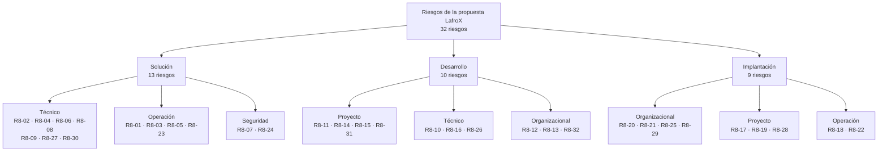

# LafroX — Subdocumento 8: Plan de riesgos

El plan establece tratamiento de riesgos de solución, desarrollo e implantación, con responsables, cuantificación y reservas durante el contrato.

# Introducción a los Riesgos

La solución de LafroX integra recepción y trazabilidad, inventario, frío, preventa, reparto y cobranza en E1, y canal moderno, portales y costo de servir en E2. Sus riesgos dependen de una operación que despacha 96 camiones entre 05:30 y 07:00, mantiene los CD 24 horas sin WAN y el terreno 14 horas sin señal, conserva ERP como único emisor tributario y despliega sin detener rutas (Distribuidora Puelche S.A., 2026c, Cap. 10). Este plan conecta las decisiones comerciales del SD2, alcance del SD3, contratos y dimensionamiento del SD4, gobierno del SD6 y programación del SD7 (LafroX, 2026).

El cuerpo establece método y decisiones; los Anexos 8.A–8.F contienen registro ampliado, FMEA, escenarios, reservas y condiciones de evidencia; el T-16 conserva el formato obligatorio separado (Distribuidora Puelche S.A., 2026d, sección 11). Las condiciones que deben cerrarse antes de cada hito, incluida la verificación del RPO y del riesgo residual que el SD4 declara en la sección 4.3.2.4, se registran en el Anexo 8.E con responsable y plazo.

## 8.1 Plan de riesgos

Esta sección define cómo se gestionan los riesgos durante los 56 meses: el ciclo y sus instancias, los roles y su autoridad, las escalas con que se analizan y las reglas de registro y cierre.

### 8.1.1 Enfoque y ciclo

El registro vivo sigue identificación, análisis, respuesta y seguimiento conforme a la norma ISO 31000 (International Organization for Standardization [ISO], 2018), que exige el RT-19.04 de las Bases Técnicas Transversales (Distribuidora Puelche S.A., 2026b). Cada entrada distingue causa, evento incierto y consecuencia, sin convertir una inconsistencia observada en riesgo futuro. El Anexo 8.E separa problemas y dependencias actuales.

JP mantiene el registro único. Los líderes identifican riesgos al revisar interfaces, pruebas, capacidad y despliegues; verifican disparadores semanalmente y ante cada cambio. El Comité de Proyecto quincenal revisa todos los riesgos abiertos, responsables, plazos y evidencia. Los comités Ejecutivo y de Arquitectura mensuales deciden escalamiento y cambios de sus ámbitos, y desde el mes 13 el Comité de Operación mensual revisa los riesgos de servicio: niveles de atención, incidentes, capacidad y continuidad (SD6, sección 6.1.6). Una amenaza a continuidad, seguridad o hito se escala inmediatamente. Marcha blanca exige seguimiento diario; operación mantiene vigilancia diaria de incidentes y colas y revisión en comités. En cada comité se compara la reserva restante con el riesgo remanente (análisis de reserva), y al cierre de cada etapa, en el H5 y el H10, una auditoría de riesgos comprueba que el proceso funciona (PMI, 2017, p. 456). El Comité Ejecutivo recibe cada mes un extracto con los diez riesgos de mayor exposición; el registro completo queda en el repositorio del proyecto.

### 8.1.2 Roles y autoridad

La Tabla 8.1 distingue al responsable del riesgo, la familia de esfuerzo y su vigencia. Los responsables dirigen equipos; no ejecutan solos las HH. Las familias del T-15 se conservan al relevar liderazgo.

**Tabla 8.1 — Responsabilidad y vigencia por familia. Fuente: SD1 Tabla 1.3, SD13 y T-16.**

| Familia | Hasta mes 21 | Meses 22–56 | Autoridad/aprobación |
| --- | --- | --- | --- |
| JP | Alex Aravena | Alex Aravena, dirección de contrato | Registro/escalamiento |
| ARQ | Bastián Trejo | Trejo, Comité Arquitectura | Diseño/frontera DR |
| SEG | Álvaro Catalán | Álvaro Catalán | Seguridad/privacidad |
| DAT | Leandro Chamorro | Guillermo Castillo; equipo DAT | Miño/Calidad: parámetros |
| DES | Tomás Pérez | Guillermo Castillo; equipo DES | CAL: verifica cambios |
| CAL | Maximiliano Miño | Maximiliano Miño | Evidencia/eficacia |
| SRE | Guillermo Castillo | Guillermo Castillo | Capacidad/continuidad |
| IMP | Patricio Henríquez | Guillermo Castillo; equipo IMP | CAL: usuarios; SEG: privacidad |

Las responsabilidades de DAT e IMP se transfieren al frente F8 de Operación, como establece el SD13. R8-27 requiere aprobación sanitaria de Calidad; R8-29, privacidad de Seguridad. La Contraparte Técnica acepta con acta; Operaciones autoriza cortes y Calidad del CLIENTE decide sobre los aspectos sanitarios. Su agenda se fija en mes 1 y se sigue con R8-12. Los cambios físicos siguen el gobierno de arquitectura.

### 8.1.3 Escalas previas al análisis

P/I/D se asignan como juicios ordinales iniciales sustentados en exposición y controles descritos, no como frecuencias medidas; para el análisis cuantitativo, P e I se calibran con los tramos de la Tabla 8.3. La Tabla 8.2 define los cinco niveles de cada escala. Horizonte: hasta entregar el control de cada ficha y, para riesgos recurrentes, los 56 meses del contrato. R8-11 cubre hasta H12; puntuación inicial conservada como juicio de partida, a contrastar con avance. Todo cambio de horizonte se revisa en Comité.

**Tabla 8.2 — Escalas ordinales de probabilidad, impacto y detección. Fuente: elaboración propia a partir de ISO (2018) e IEC (2018)**

| Valor | Probabilidad ordinal P | Impacto I: mayor efecto aplicable | Detección D: mayor valor, peor detección |
| --- | --- | --- | --- |
| 1 | Excepcional, sin dependencia expuesta identificada | Corrección local sin afectar aceptación ni servicio | Control automático probado detecta antes de confirmar |
| 2 | Posible con exposición limitada | Retrabajo absorbible en capacidad asignada | Ensayo sistemático detecta antes de habilitar |
| 3 | Plausible por una dependencia expuesta | Consume contingencia o afecta servicio auxiliar | Requiere conciliación o ensayo específico |
| 4 | Exposición recurrente o varias dependencias sin control demostrado | Amenaza hito, SLA o alcance obligatorio | Se aprecia al afectar operación o en revisión tardía |
| 5 | Condiciones muy favorables al evento sin barrera eficaz | Detiene despacho crítico, compromete seguridad/datos/sanidad o impide aceptación | Sin evidencia de detección o reconocible después de pérdida |

Exposición E = P × I (1–25): baja 1–3, moderada 4–7, alta 8–14 y crítica 15–25. FMEA agrega NPR = P × I × D (1–125), para ordenar dentro del nivel; desempates por impacto y proximidad del plazo. I = 5 exige escalamiento aunque E no alcance 15. No se asigna D = 1 a un control por describirlo.

El apetito de riesgo del proyecto se fija por nivel de exposición, con una regla de acción por zona. Un riesgo crítico (E de 15 a 25) o con I = 5 se evita, se mitiga o se escala antes de su hito, con su control como paquete de la EDT, aunque su retorno en HH sea menor que 1; si el control falla, se cambia el diseño. Si su causa no admite un control previo, como la demanda real de la mesa (R8-22), se acepta activamente con la contingencia ya dimensionada y su disparador. Uno alto (8 a 14) se mitiga con un control de la EDT y revisión quincenal en el Comité de Proyecto. Uno moderado (4 a 7) se acepta activamente, con reserva y disparador. Uno bajo (1 a 3) se acepta pasivamente, con revisión mensual. La tolerancia es cero días de atraso en los hitos del Art. 17° y en el despacho de 05:30 a 07:00, y ningún riesgo que afecte un requisito obligatorio se acepta sin tratamiento. El umbral de escalamiento es cualquier riesgo crítico o con I = 5, o un consumo de la reserva de contingencia mayor que el previsto para el período en la Tabla 8.6.

Para el análisis cuantitativo, cada valor de P se calibra con un tramo de probabilidad y cada valor de I con la fracción del esfuerzo de los paquetes afectados que el evento agregaría como retrabajo o trabajo adicional. Los paquetes afectados son los que cada ficha del Anexo 8.A nombra en «Fuente y EDT», con sus HH del Formulario T-15. La calibración es un juicio del equipo, no una frecuencia medida, y se revisa con los datos del proyecto. La Tabla 8.3 fija los valores usados.

**Tabla 8.3 — Calibración cuantitativa de las escalas. Fuente: elaboración propia a partir del Formulario T-15**

| Valor | Probabilidad (tramo y valor usado) | Impacto (fracción del esfuerzo afectado) |
| --- | --- | --- |
| 1 | Menos de 10 %; 5 % | Sin esfuerzo adicional |
| 2 | 10 a 30 %; 20 % | 5 % |
| 3 | 30 a 50 %; 40 % | 10 % |
| 4 | 50 a 70 %; 60 % | 20 % |
| 5 | Más de 70 %; 80 % | 30 % |

El valor esperado de un riesgo es su probabilidad por su impacto en HH. Las horas sirven de unidad porque la oferta técnica no contiene montos (Distribuidora Puelche S.A., 2026a, Art. 50.2); la Oferta Económica valoriza esas horas.

### 8.1.4 Registro y cierre

El responsable actualiza fuente, estado, disparador, tratamiento, consumo de HH y evidencia. Estados: identificado, en tratamiento, control verificado o materializado. Materializar el evento abre un problema y conserva su ID. CAL verifica cierre técnico; JP registra la decisión; la aceptación contractual corresponde al CLIENTE. La puntuación residual efectiva exige eficacia comprobada; C.5 sólo compara hipótesis. Verificar un control no libera reserva automáticamente. Ninguna aceptación de riesgo exime requisitos obligatorios.

## 8.2 Identificación y Análisis de Riesgos

Esta sección identifica los riesgos con una RBS y los analiza en dos niveles: uno cualitativo con FMEA y otro cuantitativo con el valor esperado de cada riesgo en horas hombre y una simulación de Monte Carlo sobre el cronograma por actividad del SD7.

### 8.2.1 RBS y análisis separados

La estructura de desglose de riesgos (RBS) tiene raíz «Riesgos de la propuesta LafroX» y tres ramas, una por cada análisis que exige el Formulario T-22: riesgo de la solución, del desarrollo y de la implantación. Dentro de cada rama, los riesgos se agrupan en las categorías técnica, organizacional, de proyecto, de seguridad y de operación que les corresponden. Los ID son únicos aunque una causa afecte varias ramas. La Figura 8.1 presenta la estructura con los 32 riesgos del Anexo 8.A.

**Figura 8.1 — Estructura de desglose de riesgos (RBS). Fuente: elaboración propia a partir del Anexo 8.A.**

La figura muestra que la solución concentra 13 de los 32 riesgos y 11 de los 22 de nivel crítico de la Tabla B.1, porque reúne la continuidad del despacho, la reserva de stock y la evidencia de frío. Los dos riesgos de seguridad (R8-07 y R8-24) pertenecen a la rama de la solución, porque sus fichas los originan en los portales, móviles, integraciones y trazas que la arquitectura expone. El desarrollo se concentra en la categoría de proyecto (dotación, capacidad protegida de la Etapa 1, certificación de cadenas y revisión del CLIENTE), y la implantación, en la organizacional (rotación, transportistas, sindicato y adopción de innovaciones).

Solución: integridad de stock/custodia, ERP/DTE, autonomía, capacidad, RPO, seguridad, obsolescencia y proveedores. Desarrollo: interfaces sin documentación, recursos, contrapartes, conocimiento de rutas, migración, certificación externa, certificación paralela a la revisión del CLIENTE y refuerzo subcontratado de calidad. Implantación: congelamientos, cuatro semanas completas, suministros, adopción, relevos y atención. Anexo 8.A desarrolla 32 amenazas; 8.F cubre las cinco innovaciones y una oportunidad de diagnóstico con INN-02. Las tres ramas permiten preparar los análisis separados exigidos por T-22.

Los siete riesgos que el Caso 02 espera encontrar en este plan (Distribuidora Puelche S.A., 2026c, Cap. 19) tienen ficha propia: la pérdida del conocimiento de rutas (R8-13), la objeción sindical y el rechazo de los conductores de terceros (R8-21), la rotación en bodega (R8-20) y la ausencia de documentación de interfaces (R8-10). La dependencia de un solo enlace en Concepción la resuelve el SD4 con tres caminos independientes, y R8-03 la verifica con la prueba de 24 horas sin WAN en cada centro de distribución. El peak de septiembre coincide con las semanas de cierre de la marcha blanca de la Etapa 2, y R8-18 lo trata con la habilitación completa en agosto y la prueba de carga a 1,5 veces el peak antes del H11.

### 8.2.2 Resultados cualitativos y FMEA

El análisis de modos de falla y sus efectos (FMEA) sigue la IEC 60812 (International Electrotechnical Commission [IEC], 2018): a la probabilidad y el impacto agrega la detección, y su producto da el número de prioridad del riesgo (NPR). Anexo 8.B presenta P/I/D, exposición y NPR. La prioridad inicial se concentra en continuidad, RPO, ERP/DTE, seguridad, capacidad y aceptación. T-16 compara exposición; NPR no reemplaza su columna Expos.

La Tabla 8.4 extrae del Anexo 8.B, Tabla B.1, los cinco riesgos con mayor número de prioridad (NPR); el registro completo de los 32 está en ese anexo.

**Tabla 8.4 — Riesgos con mayor NPR. Fuente: Anexo 8.B, Tabla B.1**

| Riesgo | P | I | D | NPR = P × I × D |
| --- | --- | --- | --- | --- |
| R8-01 ERP indisponible o guía invalidada | 4 | 5 | 4 | 80 |
| R8-07 Ataque o exposición de datos críticos | 4 | 5 | 4 | 80 |
| R8-27 INN-03 estima vida remanente insegura | 4 | 5 | 4 | 80 |
| R8-05 Pérdida del sitio supera RPO | 3 | 5 | 5 | 75 |
| R8-02 Doble reserva o custodia en la coordinación de reserva | 4 | 5 | 3 | 60 |

Los cinco pertenecen a la rama de la solución y todos tienen impacto 5. Lo que los separa es la detección: R8-05 tiene la probabilidad más baja, pero su D = 5 (sólo se aprecia al perder el sitio) lo deja en el cuarto lugar, por sobre riesgos más probables. R8-02 desempata NPR 60 por control antes de H4. Por eso sus respuestas privilegian controles que se prueban antes del corte (ensayo de caída del ERP, prueba de concurrencia y ejercicio de recuperación) en vez de controles que sólo reaccionan cuando el evento ocurre.

No se suman puntuaciones como probabilidad del proyecto. Las relaciones importan: ausencia de contraparte puede atrasar interfaces/cadenas y eliminar semanas de evidencia; migración deficiente puede invalidar trazabilidad y aceptación. Los mismos efectos o consumos no se contabilizan dos veces.

### 8.2.3 Análisis cuantitativo

El análisis combina exposición individual, registro conjunto y calendario con recursos (PMI, 2017, pp. 433–434). La Tabla B.3 permite seguir cada cifra hasta sus paquetes, meses, perfiles y controles. R8-11 abarca 162 paquetes con entregable de implementación, que suman 45.040,00 HH y se desglosan en la Tabla B.4. El esfuerzo recurrente cubre toda su ventana; la probabilidad no se convierte en una tasa mensual.

Los valores esperados individuales suman 35.969,16 HH. Al contar una sola vez una misma corrección de capacidad o interfaz, el registro conjunto suma **35.219,98 HH** bajo independencia y **34.756,36 HH** en el escenario correlacionado. La contingencia adopta el mayor de los dos registros conjuntos. Es una necesidad de capacidad bajo los supuestos del análisis y no un consumo cierto ni una frecuencia medida.

La simulación ejecuta 5.000 iteraciones sobre las 564 actividades, con semilla 20261008, PERT por paquete y nueva nivelación diaria. Conserva las fechas contractuales y desarrolla las precedencias del Anexo 7.B. La Tabla 8.5 resume el escenario independiente; el Anexo 8.C incluye intervalos de incertidumbre, correlación, sensibilidad con muestras comunes y el procedimiento reproducible.

**Tabla 8.5 — Entrega por hito con recursos y riesgos. Fuente: Anexo 8.C, Tabla C.3.**

| Hito | Límite de entrega | P50 | P80 | P a tiempo |
| --- | --- | --- | --- | --- |
| H1 | 17-03-2027 | 10-03-2027 | 11-03-2027 | 100,00 % |
| H2 | 17-05-2027 | 02-06-2027 | 02-06-2027 | 0,00 % |
| H3 | 16-07-2027 | 07-07-2027 | 13-07-2027 | 88,32 % |
| H4 | 16-11-2027 | 29-10-2027 | 05-11-2027 | 99,92 % |
| H5 | 17-01-2028 | 24-12-2027 | 04-01-2028 | 97,76 % |
| H8 | 17-03-2028 | 04-04-2028 | 04-04-2028 | 0,00 % |
| H9 | 16-06-2028 | 26-05-2028 | 31-05-2028 | 100,00 % |
| H10 | 17-07-2028 | 21-07-2028 | 27-07-2028 | 31,02 % |

H2 y H8 presentan una incompatibilidad incluso sin riesgos: las actividades de aprobación terminan después de sus fechas límite de entrega. Al conservar D-31, el P80 del H10 es el 27-07-2028 y supera su límite del 17-07-2028; la proporción de entregas a tiempo es 31,02 %. Ninguna iteración cumple simultáneamente las ocho entregas bajo estas fuentes y supuestos. E8-13 y E8-14 requieren resolución antes de declarar factibilidad.

La Tabla C.6 comprueba la preparación de H6 y H11 y las condiciones de calendario de H7 y H12. Una fecha fija no elimina la incertidumbre. El alcance completo, la capacidad y las cuatro semanas de evidencia son condiciones necesarias; las seis condiciones del Art. 17.3 requieren mediciones y acta, que la simulación no acredita.

El T-15 conserva 202.774 HH, incluidas 9.336 HH de soporte puente y 3.072 HH de capacidad protegida E1. Las 9.336 HH forman parte de las 16.664 HH del período 16–20 del SD7. El peak de 69 personas y las 48 simultáneas de desarrollo son referencias de la programación fuente; su asignación nominal continúa siendo una condición. La nueva contingencia y los resultados de este SD8 no están incorporados todavía en esa curva.

## 8.3 Plan de Acción a Riesgos

Esta sección fija las respuestas a los riesgos analizados, las reservas que las financian en horas y las condiciones que deben cumplirse antes de declarar factible la propuesta.

### 8.3.1 Respuestas y costo-beneficio técnico

Cada ficha del Anexo 8.A define estrategia, responsable temporal, disparador, plazo, mitigación, contingencia, residual hipotético, riesgo secundario y evidencia. Se mitigan 29 amenazas, incluida R8-14; R8-12 y R8-17 se escalan, y R8-22 se acepta activamente con medición y escalamiento. La subcontratación no traslada la obligación final de LafroX.

La Tabla C.5 compara las 32 respuestas en HH (PMI, 2017, pp. 442–443). Los 35 paquetes de control únicos suman 6.768,00 HH ya programadas. Su costo se cuenta una vez, aunque un control proteja varios riesgos; los retornos individuales no se suman. Se descarta toda alternativa que incumpla sanidad, despacho, integridad de datos o una función obligatoria.

Si la probabilidad disminuyera un nivel, el registro conjunto residual sería 27.218,57 HH, frente a las 35.219,98 HH iniciales. Esta hipótesis no acredita eficacia ni permite liberar automáticamente la diferencia de 8.001,41 HH. CAL comprueba resultados y JP solicita cambios con evidencia, remanente y ventana de uso. La certificación paralela origina R8-31; el refuerzo de calidad, R8-32; la captura de trazas, R8-24; y la separación de equipos mantiene presión sobre R8-11.

### 8.3.2 Reservas y cronograma

La reserva de contingencia cubre los riesgos identificados: **35.219,98 HH**, el 18,50 % de las 190.366 HH base. La capacidad protegida sólo se descuenta cuando coinciden los meses 13–20, la Etapa 1 y los perfiles DES/CAL. La matriz actual sitúa los paquetes de R8-02 y R8-04 antes del mes 13, y los de R8-14 en la Etapa 2. No demuestra absorción por capacidad protegida; por eso requiere **35.219,98 HH adicionales**. Las 3.072 HH continúan protegidas para correcciones E1 futuras, sin prestarse a E2.

La Tabla 8.6 resume los períodos y la Tabla D.2 detalla cada mes y perfil. La capacidad adicional es una necesidad calculada que todavía no está incorporada en las 202.774 HH del T-15. Su integración exigiría conciliar 237.993,98 HH con la dotación y las ventanas, conservando los 56 meses contractuales.

**Tabla 8.6 — Contingencia adicional por período, HH. Fuente: D.2.**

| Período | HH adicionales |
| --- | --- |
| Meses 1–6 | 5.149,18 |
| Meses 7–12 | 5.104,75 |
| Meses 13–15 | 4.445,38 |
| Meses 16–21 | 5.292,88 |
| Meses 22–33 | 5.228,07 |
| Meses 34–56 | 9.999,72 |
| Total | 35.219,98 |

La distribución mantiene reserva hasta el mes 56. Cada cargo identifica evento, paquete, etapa, perfil, mes, HH y evidencia para impedir el doble consumo. Sólo una misma corrección comparte cargo; el residual hipotético no se libera sin cierre y autorización.

La reserva de gestión propuesta es de **400 HH adicionales: 240 DES y 160 CAL**, separadas de contingencia y fuera de la línea base. La autoriza el Comité Ejecutivo para un imprevisto adicional dimensionado con C-01/C-02, sin atribuir antecedentes históricos a LafroX. Con capacidad adicional de 256 DES y 128 CAL al mes, requiere 1,25 meses en paralelo; completarla en un mes exige otras 32 HH CAL. Esa capacidad no consume la protección E1 ni se presenta como contratación acreditada.

La reserva de cronograma se contrasta con el pronóstico y los límites, resolviendo H2, H8 y D-31 según el Anexo 8.E. Las cuatro semanas finales son evidencia obligatoria. La valorización y el flujo monetario corresponden a la Oferta Económica (BA Art. 50.2); el flujo técnico por mes y perfil aparece en la Tabla D.2.

### 8.3.3 Factibilidad y aceptación

El Anexo 8.E registra las condiciones de evidencia: productividad/dotación, secuencias diarias y plazos de revisión/subsanación del Art. 18.3, fecha contractual, continuidad de 96 despachos, RPO remoto, atención y evidencia láctea. La coordinación de reserva y retención de INT-03/04 (SD4, apartado 4.1.4.4 y Anexo 4-G) está dimensionada en el Anexo 4-I, Tabla A.10, y el Anexo 4-W, Tablas A.32 y A.33, con un máximo de cuatro mensajes por línea. La retención consumida no se libera y esa holgura cubre líneas repartidas entre lotes o sitios. AL-STOCK-01 mide la proporción de líneas con más de una retención antes del H4. Las pruebas 3.8.4 y 3.9.3 verifican la carga y el drenaje, sin sumar la coordinación al drenaje tras un corte. El compromiso RPO ≤15 min del SD4, sección 4.2.5.1, se verifica por escenario sobre fibra, LTE y Starlink. La falla simultánea de los tres caminos seguida de la destrucción del sitio antes de reponer alguno es el riesgo residual declarado en SD4 4.3.2.4 (RT-02.11). R8-05 lo trata con alarmas de retraso de replicación a los 5 y 15 min, reposición del enlace por el proveedor, preemisión de guías al cerrar la carga y conservación local en el NAS WORM de Talca. AL-DR-01 mide RPO/RTO antes de H5/H10. Si el NAS se destruye con el sitio, sólo queda la última copia remota consistente: las medidas locales no demuestran por sí solas una pérdida de datos de 15 minutos o menos. RT-02.11 no exime de RT-07.04; E8-05 exige resolver y demostrar esa frontera.

El retiro sanitario debe identificar a los clientes afectados con evidencia en menos de dos horas; los 85 minutos de diseño del SD5 no constituyen un ensayo aprobado. E8-13 a E8-16 establecen las condiciones de calendario y capacidad. No se autoriza corte sin continuidad medida ni aceptación sin las seis condiciones simultáneas del Art. 17.3 y acta según Art. 18. La suspensión del proveedor de lácteos, de marzo a septiembre de 2026, es antecedente ocurrido. La consulta V-13 del SD3 (Anexo 3.H) precisa en el mes 1, con el CLIENTE y el proveedor, qué evidencia de trazabilidad restablece la relación, y la Etapa 1 prioriza esa trazabilidad; la restitución depende del proveedor. La propuesta queda sujeta a las condiciones de cierre del Anexo 8.E, cada una con responsable, hito límite y evidencia; ninguna se da por cumplida sin las decisiones, pruebas y actas que allí se indican.

## Referencias

Las fuentes citadas en este documento se listan a continuación en formato APA 7.ª edición.

- Distribuidora Puelche S.A. (2026a). *Bases Administrativas de Licitación N.º TFEP-01/2026*, artículos 17, 18 y 50.2, y Formularios T-16 y T-22.
- Distribuidora Puelche S.A. (2026b). *Bases Técnicas Transversales de Licitación N.º TFEP-01/2026*, RT-07.04, RT-07.07, RT-19.04, RT-21.06, RT-21.07 y RT-26.04.
- Distribuidora Puelche S.A. (2026c). *Caso 02: Logística*, capítulos 10 a 14 y requisitos específicos citados.
- Distribuidora Puelche S.A. (2026d). *Aclaraciones de la Licitación N.º TFEP-01/2026*, secciones 2, 4, 6, 7 y 11 (Capítulo 8).
- LafroX. (2026). Subdocumentos 1 a 7 y 13, con los anexos y formularios citados.
- International Electrotechnical Commission. (2018). *IEC 60812:2018 Failure modes and effects analysis (FMEA and FMECA)*. IEC.
- International Organization for Standardization. (2018). *ISO 31000:2018 Risk management — Guidelines*. ISO.
- Project Management Institute. (2017). *La guía de los fundamentos para la dirección de proyectos (Guía del PMBOK®)* (6.ª ed.), capítulo 11. Project Management Institute.

## Declaración de uso de IA

La tabla declara apoyo de IA conforme a las Aclaraciones §7.2. La revisión humana identifica quién efectivamente verificó cada parte y se consolida en el Formulario A-6.

| Sección | Herramienta | Finalidad del uso | Nivel en texto | Nivel en diagramas | Revisión humana (quién y qué verificó) |
| --- | --- | --- | --- | --- | --- |
| Introducción | Codex | Conexión con operación, alcance y formularios | Alto | Ninguno | [[REVISIÓN HUMANA]] |
| 8.1 Plan de riesgos | Codex; Claude Code | Roles, escalas, ciclo y cierre | Alto | Ninguno | [[REVISIÓN HUMANA]] |
| 8.2 Identificación y Análisis de Riesgos | Codex; Claude Code | RBS, FMEA y cuantificación reproducible | Alto | Medio | [[REVISIÓN HUMANA]] |
| 8.3 Plan de Acción a Riesgos | Codex; Claude Code | Respuestas, contingencia y gestión | Alto | Ninguno | [[REVISIÓN HUMANA]] |
| Anexo 8.A | Codex; Claude Code | Ver declaración propia de ese anexo | Alto | Ninguno | [[REVISIÓN HUMANA]] |
| Anexo 8.B | Codex; Claude Code | Ver declaración propia de ese anexo | Alto | Ninguno | [[REVISIÓN HUMANA]] |
| Anexo 8.C | Codex; Claude Code | Ver declaración propia de ese anexo | Alto | Ninguno | [[REVISIÓN HUMANA]] |
| Anexo 8.D | Codex; Claude Code | Ver declaración propia de ese anexo | Alto | Ninguno | [[REVISIÓN HUMANA]] |
| Anexo 8.E | Codex; Claude Code | Ver declaración propia de ese anexo | Alto | Ninguno | [[REVISIÓN HUMANA]] |
| Anexo 8.F | Codex; Claude Code | Ver declaración propia de ese anexo | Alto | Ninguno | [[REVISIÓN HUMANA]] |
| Formulario T-16 | Codex; Claude Code | Ver declaración propia del formulario | Alto | Ninguno | [[REVISIÓN HUMANA]] |
