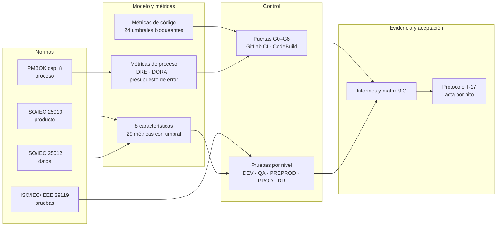
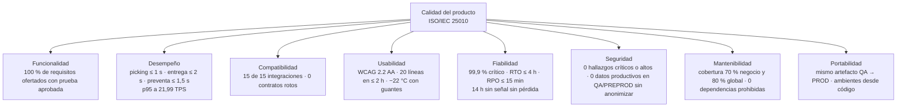
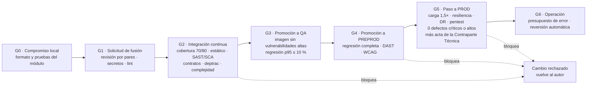
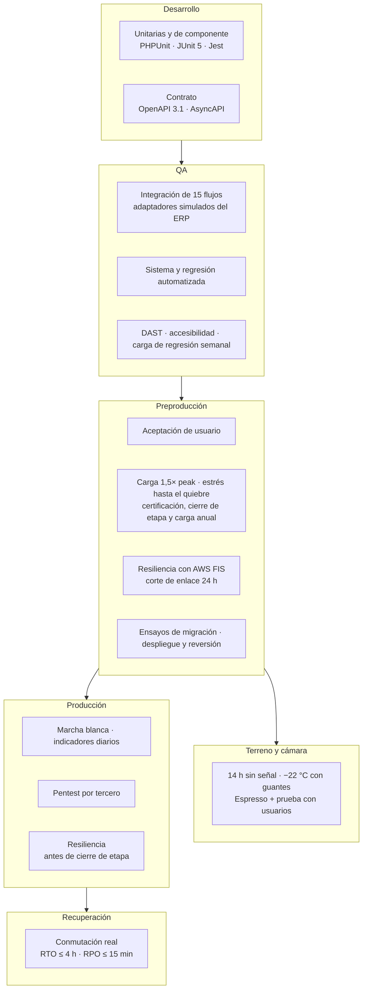
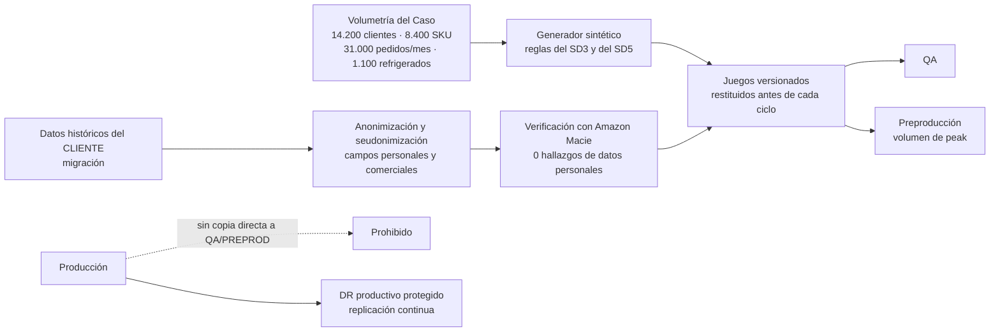
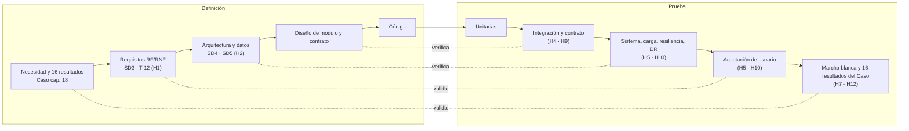
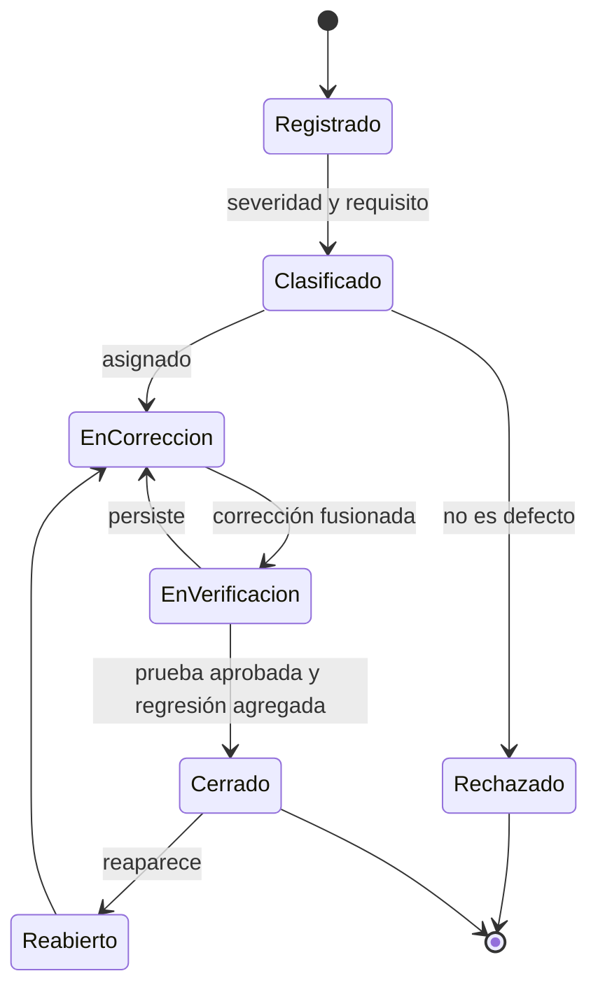
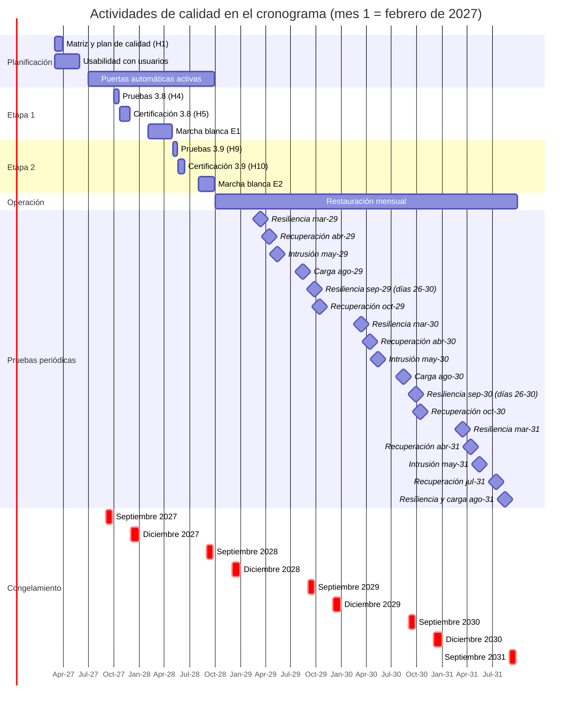
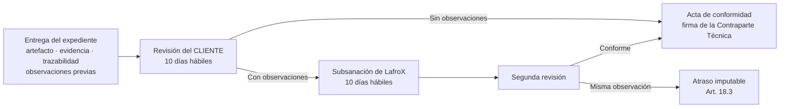

# Propuesta Técnica — Subdocumento 9: Plan de calidad

**Licitación:** TFEP-01/2026  
**Proyecto:** Plataforma Digital de Misión Crítica — Caso 02: Logística  
**Mandante:** Distribuidora Puelche S.A.  
**Proponente:** LafroX SpA — RUT 77.418.902-K  
**Representante legal:** Alex Aravena, Jefe de Proyecto y Apoderado  
**Fecha de emisión:** 9 de octubre de 2026  
**Formularios:** T-13 y T-17

## Índice

- [Introducción al Plan de calidad](#introducción-al-plan-de-calidad)
  - [9.1 Plan de Calidad](#91-plan-de-calidad)
    - [9.1.1 Marco de aseguramiento y gobierno de la calidad](#911-marco-de-aseguramiento-y-gobierno-de-la-calidad)
    - [9.1.2 Modelos de madurez](#912-modelos-de-madurez)
    - [9.1.3 Modelo de calidad del producto según ISO/IEC 25010](#913-modelo-de-calidad-del-producto-según-isoiec-25010)
    - [9.1.4 Métricas de código con umbral bloqueante](#914-métricas-de-código-con-umbral-bloqueante)
    - [9.1.5 Métricas de proceso y costo de la calidad](#915-métricas-de-proceso-y-costo-de-la-calidad)
  - [9.2 Estrategia de Aseguramiento de Calidad](#92-estrategia-de-aseguramiento-de-calidad)
    - [9.2.1 Puertas de calidad](#921-puertas-de-calidad)
    - [9.2.2 Revisión por pares y análisis estático y dinámico](#922-revisión-por-pares-y-análisis-estático-y-dinámico)
    - [9.2.3 Estrategia de pruebas conforme a ISO/IEC/IEEE 29119](#923-estrategia-de-pruebas-conforme-a-isoiecieee-29119)
    - [9.2.4 Datos de prueba](#924-datos-de-prueba)
    - [9.2.5 Verificación, validación y trazabilidad](#925-verificación-validación-y-trazabilidad)
    - [9.2.6 Gestión de defectos](#926-gestión-de-defectos)
  - [9.3 Alineación con Plan de Trabajo](#93-alineación-con-plan-de-trabajo)
    - [9.3.1 Actividades de calidad en la EDT](#931-actividades-de-calidad-en-la-edt)
    - [9.3.2 Calidad en el cronograma y en los hitos](#932-calidad-en-el-cronograma-y-en-los-hitos)
    - [9.3.3 Pruebas periódicas durante la Operación](#933-pruebas-periódicas-durante-la-operación)
- [Referencias](#referencias)
- [Declaración de uso de IA](#declaración-de-uso-de-ia)

# Introducción al Plan de calidad

Este capítulo establece cómo LafroX asegura y demuestra que la plataforma de Distribuidora Puelche cumple lo comprometido. La exigencia es concreta: confirmar una línea de picking en un segundo bajo el peak de septiembre, operar un turno de 14 horas sin señal sin perder ni duplicar un registro, despachar 96 camiones entre las 05:30 y las 07:00 sin indisponibilidad, y entregar al CLIENTE, ante un retiro sanitario, la lista de clientes afectados en menos de dos horas (Distribuidora Puelche S.A., 2026c, caps. 15 y 18). El plan convierte esas exigencias en umbrales medibles, en controles automáticos que bloquean un cambio que no los cumple y en pruebas con fecha, ambiente, datos y criterio de salida.

La sección 9.1 fija el marco: ISO/IEC 25010 para el producto, ISO/IEC 25012 para los datos, ISO/IEC/IEEE 29119 para las pruebas y el PMBOK para el proceso, junto con los modelos de madurez y las métricas de código y de proceso. La sección 9.2 describe la estrategia: puertas de calidad, revisión por pares, análisis estático y dinámico, niveles y tipos de prueba en los cinco ambientes del Subdocumento 4 (en adelante, SD4; la sigla SD seguida de un número designa cada subdocumento de esta propuesta), datos de prueba, trazabilidad y gestión de defectos. La sección 9.3 ubica cada actividad de calidad en la EDT y en el cronograma del SD7.

El capítulo toma los requisitos del catálogo del SD3 y del Formulario T-12, los umbrales de desempeño, los ambientes y la cadena de entrega del SD4, sección 4.2, las reglas de calidad de datos y de migración del SD5, las compuertas y la definición de terminado del SD6, sección 6.2, los paquetes y los hitos del SD7 y de los Formularios T-14 y T-15, los riesgos de calidad del registro del SD8, cuyos códigos R8-nn identifican cada riesgo (R8-18, marcha blanca que no cumple las seis condiciones; R8-31, observaciones que obligan a repetir una certificación; R8-32, evaluadores subcontratados no disponibles), y la innovación INN-02 del SD13, reproducción de incidentes de terreno (LafroX, 2026). El detalle se entrega por separado. El Formulario T-13 contiene el plan de pruebas y validación, con criterios de entrada y salida y calendario. El Formulario T-17 contiene el protocolo de aceptación de cada hito y del producto final. Los Anexos 9.A a 9.D contienen los umbrales completos por subcaracterística, el catálogo de reglas de análisis estático, la matriz de trazabilidad entre pruebas y requisitos y la especificación de los datos de prueba.

## 9.1 Plan de Calidad

Esta sección define con qué normas se juzga la calidad, quién decide sobre ella, qué nivel de madurez sustenta los procesos, y qué métricas y umbrales hacen exigible cada característica del producto, del código y del proceso.

### 9.1.1 Marco de aseguramiento y gobierno de la calidad

La Figura 9.1 presenta el marco completo, de las normas a la aceptación. En ella, G0 a G6 son las siete puertas de calidad de la sección 9.2.1; DRE es la eficiencia de remoción de defectos, y DORA designa las cuatro métricas de entrega del programa DevOps Research and Assessment que describen Forsgren, Humble y Kim (2018), ambas en la sección 9.1.5. Cada norma gobierna un objeto distinto, y ninguna se cita sin el mecanismo que la hace verificable, como exige el Art. 4.3 de las Bases Administrativas (Distribuidora Puelche S.A., 2026a).

**Figura 9.1 — Marco de aseguramiento de la calidad del proyecto. Fuente: elaboración propia.**

La figura muestra que el marco tiene una sola salida: la evidencia que el CLIENTE revisa para firmar el acta de cada hito (Distribuidora Puelche S.A., 2026a, art. 18.2). Las normas de producto y de datos definen qué se mide; la de pruebas define cómo se prueba; el PMBOK define cómo se planifica, se asegura y se controla la calidad del proyecto (Project Management Institute [PMI], 2017, pp. 271–306). Las métricas de código y de proceso no llegan al CLIENTE como declaraciones: se aplican en las puertas automáticas y sus resultados quedan en la matriz de trazabilidad del Anexo 9.C.

El gobierno distingue aseguramiento de control (PMI, 2017, p. 290). El aseguramiento, es decir, que el proceso produzca calidad, está a cargo del Líder de Calidad del proyecto, Maximiliano Miño, con dedicación entre los meses 1 y 56 (SD1, sección 1.5). Lo apoya el Comité de Calidad y Procesos de LafroX, que sesiona mensualmente, analiza la adherencia metodológica y las métricas de defectos y puede vetar una promoción (SD1, sección 1.3.1). El control, es decir, que cada entregable cumpla, lo ejecutan las puertas automáticas y el equipo de pruebas (rol CAL del Formulario T-15). La aceptación la decide el CLIENTE por medio de la Contraparte Técnica (Distribuidora Puelche S.A., 2026a, art. 70.2), con el Líder Funcional, Patricio Henríquez, como responsable de LafroX en las pruebas de aceptación de usuario. El Líder de Calidad no responde ante el equipo de desarrollo. Escala al Jefe de Proyecto y, en desacuerdo, al Comité Ejecutivo, para que la presión del plazo no relaje un umbral.

La calidad de datos es parte del marco y no un apéndice. Las siete dimensiones de ISO/IEC 25012 (ISO & IEC, 2008) (completitud, exactitud, consistencia, unicidad, validez, oportunidad y credibilidad) y sus 16 indicadores ya están definidos en el SD5, sección 5.2. Este plan los incorpora como criterio de salida de las pruebas de migración y como indicador de la marcha blanca, sin redefinirlos.

### 9.1.2 Modelos de madurez

LafroX opera un sistema de gestión de calidad certificado conforme a ISO 9001:2015 (ISO, 2015) y prácticas de desarrollo evaluadas en el nivel 3 de CMMI-DEV (SD1, secciones 1.3.1 y 1.4). El nivel 3 significa procesos definidos para la organización y adaptados al proyecto. Para este contrato, eso se traduce en tres áreas de práctica que el plan aplica explícitamente: verificación y validación (las pruebas de la sección 9.2.3), revisión entre pares (sección 9.2.2) y aseguramiento de la calidad del proceso, ejercido por las auditorías trimestrales de trazabilidad entre requisito, código y prueba que exige la política de LafroX (CMMI Institute, 2018).

La evaluación SCAMPI A N° 58190 de CMMI-DEV declarada en el SD1 (CMMI Institute, 2023) vence en noviembre de 2026, antes del inicio del contrato. LafroX presenta su renovación ante la Contraparte Técnica junto con la línea base del H1, el primero de los doce hitos contractuales H1 a H12 del Formulario E-25 (Distribuidora Puelche S.A., 2026a, art. 18.1), que la sección 9.3.2 relaciona con las pruebas. Mientras no la acredite, el proyecto no invoca ese nivel como garantía y se rige por los procesos auditados bajo ISO 9001.

CMMI evalúa la organización de desarrollo, pero no la madurez del proceso de pruebas. Para ello, el plan adopta como referencia el modelo TMMi (TMMi Foundation, 2018), cuyo nivel 3, «Definido», exige una organización de pruebas independiente, un programa de capacitación en pruebas, integración de las pruebas en el ciclo de vida, pruebas no funcionales y revisiones entre pares. La Tabla 9.1 muestra cómo el plan cubre cada área de proceso de ese nivel.

**Tabla 9.1 — Áreas de proceso del nivel 3 de TMMi y su cobertura en el plan. Fuente: elaboración propia a partir de TMMi Foundation (2018).**

| Área de proceso TMMi nivel 3 | Mecanismo del plan | Sección | Evidencia |
| --- | --- | --- | --- |
| Organización de pruebas | Rol CAL independiente del desarrollo, con escalamiento propio | 9.1.1 | Organigrama del SD1 y T-15 |
| Programa de capacitación en pruebas | Inducción en herramientas y datos de prueba para evaluadores subcontratados | 9.3.2 | Registro de capacitación |
| Ciclo de vida e integración de pruebas | Nivel de prueba por ambiente y puerta por promoción | 9.2.1, 9.2.3 | Pipeline y T-13 |
| Pruebas no funcionales | Carga, estrés, resiliencia, DR, seguridad, accesibilidad y terreno | 9.2.3 | Informes por hito |
| Revisión entre pares | Revisión obligatoria de cada solicitud de fusión | 9.2.2 | Historial de GitLab |

La tabla muestra que las cinco áreas tienen un mecanismo y una evidencia propios del proyecto. LafroX no declara una certificación TMMi. Declara una autoevaluación contra el modelo, que el Comité de Calidad ejecuta en el H5 y en el H10, cuando cada etapa termina sus pruebas, y cuyas brechas se convierten en acciones del plan con responsable y plazo.

### 9.1.3 Modelo de calidad del producto según ISO/IEC 25010

El Art. 24 de las Bases Administrativas exige criterios de calidad conforme a ISO/IEC 25010 con umbrales numéricos para ocho características: funcionalidad, desempeño, compatibilidad, usabilidad, fiabilidad, seguridad, mantenibilidad y portabilidad (Distribuidora Puelche S.A., 2026a). Son las ocho del modelo de calidad del producto de la norma (International Organization for Standardization [ISO] & International Electrotechnical Commission [IEC], 2011). La revisión de 2023 renombra usabilidad como capacidad de interacción, portabilidad como flexibilidad, y agrega la seguridad física (ISO & IEC, 2023). El plan conserva los nombres que usan las Bases para no crear una nomenclatura distinta de la del contrato. La Figura 9.2 presenta las ocho características con la métrica que las vuelve exigibles para Puelche.

**Figura 9.2 — Modelo de calidad del producto aplicado a la solución. Fuente: elaboración propia a partir de ISO & IEC (2011) y de los umbrales de las Bases y del SD4.**

En la figura, cada característica tiene al menos una métrica que nace de la operación de Puelche y no de un valor genérico. La Tabla 9.2 resume la métrica principal de cada característica, su umbral y su origen. El Anexo 9.A detalla las 29 métricas por subcaracterística, con método, ambiente y paquete de la EDT.

**Tabla 9.2 — Umbral principal por característica de ISO/IEC 25010. Fuente: elaboración propia a partir de las Bases, del SD3 y del SD4.**

| Característica | Métrica principal | Umbral | Origen |
| --- | --- | --- | --- |
| Funcionalidad | Requisitos ofertados del T-12 con prueba aprobada | 100 % | Caso, sección 17.1 |
| Desempeño | p95 de la transacción crítica a 1,5 × el peak | Picking ≤ 1 s; entrega ≤ 2 s; preventa ≤ 1,5 s; stock y crédito ≤ 2 s | Caso, RT-09.01; SD4 Tabla 31 |
| Compatibilidad | Flujos de integración ejecutados sin error | 15 de 15 | BTT §20.1; SD4 sección 4.1 |
| Usabilidad | Conformidad de accesibilidad | WCAG 2.2 AA sin incumplimientos | BTT RT-13.01 |
| Fiabilidad | Disponibilidad mensual de servicios críticos | ≥ 99,9 % y 0 min entre 05:30 y 07:00 | BTT RT-10.01; Caso RT-10.05 |
| Seguridad | Hallazgos críticos o altos abiertos | 0 | BTT RT-04.05 y RT-11.20 |
| Mantenibilidad | Cobertura de lógica de negocio y global | ≥ 70 % y ≥ 80 % | BA Art. 24; SD1 sección 1.3.1 |
| Portabilidad | Despliegues que promueven el mismo artefacto | 100 % | BTT RT-04.08 |

De la tabla se concluye que siete de los ocho umbrales vienen fijados por las Bases o por el Caso. El octavo, el de mantenibilidad, combina el mínimo del Art. 24 (70 % en lógica de negocio) con el 80 % de cobertura global, un compromiso de LafroX que ya figura en el SD1. Ningún umbral se presenta como una medición ya obtenida: todos son criterios de salida que se verifican con la prueba y en el ambiente que indica el Anexo 9.A. El desempeño, con seis métricas, y la fiabilidad, con cuatro, concentran el modelo porque la operación de Puelche depende de transacciones de segundos en la ventana de despacho y de que el despacho siga sin enlace y sin señal (Distribuidora Puelche S.A., 2026c, cap. 15, RT-03.10 y RT-03.13).

### 9.1.4 Métricas de código con umbral bloqueante

La mantenibilidad se juzga sobre el código mientras se escribe, no al final. La Tabla 9.3 fija los umbrales que bloquean una fusión o una promoción en los tres lenguajes de la solución: PHP 8.5 con Laravel 13 en el monolito modular de 12 módulos, Kotlin en la aplicación Android y TypeScript con Angular en las consolas y los portales (SD4, sección 4.1.1).

**Tabla 9.3 — Métricas de código con umbral bloqueante. Fuente: elaboración propia a partir de las Bases Administrativas, Art. 24, del SD1 y del SD6.**

| Métrica | Umbral bloqueante | Herramienta (PHP · Kotlin · TypeScript) | Puerta |
| --- | --- | --- | --- |
| Cobertura de lógica de negocio | ≥ 70 % | PHPUnit con PCOV · Kover · Jest | G2 |
| Cobertura unitaria global | ≥ 80 % | PHPUnit con PCOV · Kover · Jest | G2 |
| Complejidad ciclomática por método | ≤ 10 | PHPMD · detekt · ESLint | G2 |
| Complejidad cognitiva por método | ≤ 15 | PHPMD · detekt · eslint-plugin-sonarjs | G2 |
| Dependencias prohibidas entre módulos | 0 | deptrac | G2 |
| Duplicación de código | ≤ 3 % | PHPCPD · jscpd | G2 |
| Razón de deuda técnica | ≤ 5 % | Análisis estático y registro de deuda | G2 |

La cobertura usa dos umbrales distintos, ambos bloqueantes. El 70 % sobre la lógica de negocio es el mínimo del Art. 24 y del RT-04.11 (Distribuidora Puelche S.A., 2026b, cap. 4), y se mide sobre las clases de dominio y de casos de uso de cada módulo. El 80 % sobre todo el código es la política corporativa de LafroX (SD1, sección 1.3.1) y la compuerta del SD6, sección 6.2.2. Que se exijan ambos evita un efecto conocido: una cobertura global alta lograda con pruebas sobre controladores y vistas mientras la regla de asignación de stock o de excursión térmica queda sin probar.

El límite de complejidad ciclomática de 10 por método es el valor propuesto por McCabe (1976) como cota de un módulo comprobable. Con él, cada método tiene a lo sumo diez caminos independientes, cada uno cubierto por una prueba. La complejidad cognitiva complementa esa medida porque penaliza el anidamiento que la ciclomática no distingue. El acoplamiento se controla en la frontera que importa a esta arquitectura: la regla del RT-02.02 exige módulos con límites de contexto explícitos y acoplamiento débil (Distribuidora Puelche S.A., 2026b). deptrac verifica en cada fusión que ningún módulo invoque clases internas de otro fuera de su contrato, de modo que una violación detiene la integración y no se descubre en una revisión de arquitectura meses después. Los umbrales de complejidad, duplicación y deuda son propios de LafroX; el Comité de Calidad puede endurecerlos con datos del proyecto, pero no relajarlos más allá de la cota de la Tabla 9.3 sin acta del Comité de Arquitectura. El catálogo completo de reglas está en el Anexo 9.B.

### 9.1.5 Métricas de proceso y costo de la calidad

El código puede cumplir sus umbrales y el proceso puede seguir dejando escapar defectos. La Tabla 9.4 fija las métricas con que el Comité de Calidad juzga el proceso cada mes.

**Tabla 9.4 — Métricas de proceso y su meta. Fuente: elaboración propia a partir del SD4, sección 4.2.4.1.4, y de Forsgren, Humble y Kim (2018).**

| Métrica | Fórmula | Meta | Origen de la meta |
| --- | --- | --- | --- |
| Eficiencia de remoción de defectos | Defectos hallados antes de PROD / defectos totales | ≥ 95 % | LafroX |
| Tasa de cambios fallidos | Despliegues que requieren reversión o corrección / despliegues | ≤ 5 % mensual | SD4; RT-04.12 |
| Frecuencia de despliegue | Despliegues a producción por período habilitado | Cadencia quincenal | SD4; RT-04.12 |
| Tiempo del commit a producción | Mediana de días hábiles habilitados | ≤ 5 días | SD4; RT-04.12 |
| Tiempo de restauración del servicio crítico | Mediana desde detección hasta restauración | ≤ 4 h | SD4; BA art. 78.3 |
| Consumo del presupuesto de error crítico | Minutos indisponibles / 43,2 min | ≤ 100 % | SD4; RT-10.09 |

Las cuatro métricas de entrega (frecuencia de despliegue, tasa de cambios fallidos, tiempo del commit a producción y tiempo de restauración) son las de Forsgren, Humble y Kim (2018), y sus metas son las que el SD4 ya comprometió con el RT-04.12. La frecuencia se mide sólo sobre los períodos habilitados, porque septiembre, diciembre y los tres primeros días hábiles de cada mes no admiten despliegues (SD4, sección 4.2.4.1.4). El presupuesto de error se obtiene de la disponibilidad: (1 − 0,999) × 30 días × 1.440 minutos = 43,2 minutos al mes para un servicio crítico, y 216, 432 y 864 minutos para los niveles alto, medio y bajo de la Tabla 16 del SD4. Al agotarse, se suspenden los despliegues no correctivos hasta el mes siguiente (SD4, sección 4.2.4.1.4). Así, la calidad en operación frena el ritmo de cambio en vez de competir con él.

El costo de la calidad se expresa en horas hombre, porque la Oferta Técnica no admite montos (Distribuidora Puelche S.A., 2026a, art. 50.2). Siguiendo las cuatro categorías del PMBOK (PMI, 2017, p. 283), la prevención suma 4.224 HH: la matriz de trazabilidad, el plan de calidad y las puertas automáticas (1.2.4, 1.5.1 y 1.5.2, 240 HH), la investigación y las pruebas de usabilidad (2.6.1 a 2.6.3, 720 HH), la captura de evidencia de INN-02 (3.10.2.1 a 3.10.2.4, 960 HH) y la gestión de deuda técnica (8.2.4, 2.304 HH). La evaluación suma 6.624 HH: pruebas de la Etapa 1 (3.8, 2.080 HH) y de la Etapa 2 (3.9, 1.760 HH), ensayo de reversión y certificación de usuarios (4.1.2, 7.3.1 y 7.3.2, 400 HH) y pruebas periódicas de la Operación (8.1.3, 8.1.6, 8.2.2 y 8.3.1, 2.384 HH). Ambas cifras se suman paquete por paquete desde el Formulario T-15, y 4.224 + 6.624 = 10.848 HH. Las fallas se valorizan con el valor esperado de sus riesgos en el SD8. Las fallas internas suman 358,4 HH: una certificación repetida (R8-31, 153,6 HH) y evaluadores no disponibles (R8-32, 204,8 HH). Las fallas externas suman 2.956,8 HH: una marcha blanca que no cierra y se extiende a costo de LafroX (R8-18). Las 10.848 HH de conformidad son 3,3 veces las 3.315,2 HH de no conformidad esperada, y equivalen al 5,0 % de las 216.935 HH del proyecto. La conclusión es que el plan invierte en evaluación antes de cada hito para no pagar la falla más cara: una marcha blanca extendida sin desplazar las fechas contractuales (Distribuidora Puelche S.A., 2026a, art. 17.3).

## 9.2 Estrategia de Aseguramiento de Calidad

Esta sección describe cómo se aplican los umbrales de la sección 9.1: en qué puertas se verifican, cómo se revisa y analiza el código, qué pruebas se ejecutan en cada ambiente y con qué datos, cómo se mantiene la trazabilidad y cómo se gestionan los defectos.

### 9.2.1 Puertas de calidad

Una puerta de calidad es un punto del recorrido de un cambio donde un criterio objetivo decide si avanza. La Figura 9.3 presenta las siete puertas, del computador del desarrollador a la operación, sobre la cadena de entrega del SD4, sección 4.2.4.1: GitLab CI orquesta, AWS CodeBuild construye con procedencia SLSA nivel 3, y la imagen firmada se promueve por su digest desde Elastic Container Registry.

**Figura 9.3 — Puertas de calidad en la cadena de entrega. Fuente: elaboración propia a partir del SD4, sección 4.2.4.1, y del Formulario T-10, sección 6.2.2.**

La figura muestra que el control es más barato cuanto antes ocurre. G0 a G2 se ejecutan en minutos y en cada cambio; G5 se ejecuta pocas veces y exige semanas de prueba. Las cinco compuertas bloqueantes que define el Formulario T-10, sección 6.2.2, que acompaña al SD6, viven en G2 y G3: hallazgo crítico o alto, contrato roto, cobertura de negocio bajo 70 %, cobertura global bajo 80 % y deuda bloqueante o prueba en falla. Este plan agrega las puertas de promoción G4 y G5, que el SD6 no detalla, y la de operación G6, que conecta la calidad con el presupuesto de error. La Tabla 9.5 resume lo que bloquea cada puerta y quién puede levantarla.

**Tabla 9.5 — Criterios de bloqueo y autoridad por puerta. Fuente: elaboración propia.**

| Puerta | Momento | Bloquea si | Autoridad para levantar |
| --- | --- | --- | --- |
| G0–G1 | Cada compromiso y cada solicitud de fusión | Falta aprobación de un par, hay secreto o error de lint | Nadie; se corrige |
| G2 | Cada ejecución del pipeline | Falla un umbral de la Tabla 9.3, hay hallazgo crítico o alto, contrato roto o prueba en falla | Nadie; se corrige |
| G3 | Promoción a QA | Imagen con vulnerabilidad crítica o alta, o p95 empeora más de 10 % | Nadie para la vulnerabilidad; Líder de Calidad para la regresión de desempeño, con registro de deuda |
| G4 | Promoción a PREPROD | Regresión con fallas, alerta alta de DAST, incumplimiento WCAG AA o defecto crítico o alto abierto | Nadie; se corrige |
| G5 | Paso a producción | Prueba de la Tabla 9.6 no aprobada, defecto crítico o alto abierto, o falta el acta de la Contraparte Técnica | Nadie; se corrige. El acta de la Contraparte Técnica es una condición adicional de G5 y no levanta una prueba fallida ni un defecto crítico o alto |
| G6 | Cada despliegue en Producción y cada mes de Operación | Canario con un p95 sobre su umbral o con más errores que la entrega estable; presupuesto de error crítico del mes agotado | Nadie; la reversión del canario es automática y los despliegues no correctivos quedan suspendidos hasta el mes siguiente |

Se concluye que ningún hallazgo de seguridad crítico o alto admite excepción en ninguna puerta, conforme al Formulario T-10, sección 6.2.2, y al RT-04.05, que exige bloqueo automático (Distribuidora Puelche S.A., 2026b, cap. 4). La única excepción que el plan admite es la regresión de desempeño de G3: el Líder de Calidad puede aceptarla con registro de deuda y fecha de cierre cuando la causa está identificada y no afecta un umbral p95 de la Tabla 9.2. G5 sólo se supera con el acta de la Contraparte Técnica, porque es la condición del paso a producción del Art. 18.1 (Distribuidora Puelche S.A., 2026a). El acta se suma a las pruebas aprobadas y no las reemplaza: no levanta una prueba de la Tabla 9.6 no aprobada ni un defecto crítico o alto abierto, que el Art. 17.3 tampoco admite al cierre de la marcha blanca. G6 aplica en Producción las dos reglas del SD4: la reversión automática del canario (sección 4.2.4.1.2) y la suspensión de los despliegues no correctivos al agotarse el presupuesto de error (sección 4.2.4.1.4). La regresión de desempeño de G3 se apoya en la prueba de carga automática que el SD4, sección 4.2.4.1.4, ejecuta en QA sobre cada versión candidata y al menos una vez por semana. El 10 % es la tolerancia de LafroX al ruido de medición antes de declarar una regresión.

### 9.2.2 Revisión por pares y análisis estático y dinámico

Toda modificación entra a la rama principal por una solicitud de fusión. La rama principal está protegida y la escritura directa está prohibida (RT-04.03; Distribuidora Puelche S.A., 2026b, cap. 4, p. 10). La fusión requiere la aprobación de al menos un par que no haya escrito el cambio. Los cambios en módulos de criticidad alta del SD4, Tabla 16, requieren además la aprobación del arquitecto del frente: emisión de guía, bloqueo por excursión térmica, reserva de stock y sincronización. Los cambios en autenticación, cifrado o datos personales requieren la del Encargado de Seguridad. El revisor verifica tres cosas que una herramienta no ve: que el cambio implemente el requisito citado, que las pruebas prueben la regla y no sólo recorran líneas, y que el nombre de los componentes sea el del SD3 y del SD4.

El análisis estático se ejecuta en G1 y G2 sobre cada cambio. En PHP, PHPStan con Larastan en nivel 8 y Laravel Pint, ya incorporados al pipeline del SD4, se complementan con PHPMD para complejidad, PHPCPD para duplicación y deptrac para dependencias entre módulos. En Kotlin, detekt y ktlint cumplen esa misma función, y en TypeScript, ESLint. El análisis de seguridad estático usa el analizador SAST de GitLab, la auditoría de dependencias (`composer audit` y `npm audit`), la detección de secretos y el escaneo de imágenes de Amazon Inspector, que cubren los cinco análisis mínimos del RT-04.05 (Distribuidora Puelche S.A., 2026b, cap. 4, p. 10).

El análisis dinámico ejecuta el software. En QA, OWASP ZAP recorre los portales y las API publicadas con la definición OpenAPI 3.1 de cada contrato. Una alerta alta detiene G4. La herramienta axe-core evalúa automáticamente las vistas de los portales y de la aplicación contra WCAG 2.2 AA (World Wide Web Consortium [W3C], 2023). La revisión manual complementa la herramienta con navegación por teclado, lector de pantalla y contraste bajo sol directo, porque el RT-13.01 exige ambas verificaciones (Distribuidora Puelche S.A., 2026b). La inyección de fallas, la carga y el estrés son también análisis dinámico y se describen en la sección siguiente.

### 9.2.3 Estrategia de pruebas conforme a ISO/IEC/IEEE 29119

La estrategia sigue el modelo de procesos de ISO/IEC/IEEE 29119. En el nivel organizacional rige la política de pruebas de LafroX. En el nivel de gestión, el plan de pruebas del proyecto, que es el Formulario T-13, se monitorea y se cierra en cada hito. En el nivel dinámico se diseñan, preparan y ejecutan las pruebas y se informan sus resultados (ISO, IEC & Institute of Electrical and Electronics Engineers [IEEE], 2022). Las técnicas de diseño se eligen por tipo de regla, conforme a la parte 4 de la norma (ISO, IEC & IEEE, 2021):

- partición de equivalencia y valores límite para los umbrales térmicos y de crédito;
- tablas de decisión para la asignación de stock y el tratamiento de la entrega con local cerrado;
- transición de estados para el ciclo del pedido y de la guía;
- casos de uso para los flujos del SD3.

La Figura 9.4 ubica cada nivel y tipo de prueba en el ambiente donde se ejecuta.

**Figura 9.4 — Niveles y tipos de prueba por ambiente. Fuente: elaboración propia a partir del SD4, Tabla 12.**

La figura sigue la regla del SD4, Tabla 12: el software se prueba en un ambiente cada vez más parecido a producción, y lo que se promueve es la misma imagen. Desarrollo concentra las pruebas rápidas y aisladas. QA concentra las de integración y regresión con datos controlados. Preproducción, equivalente a producción en topología y configuración (RT-04.02), concentra las pruebas que dependen de la escala y de las fallas. Las pruebas propias del caso, como el turno sin señal y la cámara de congelado, no caben en un ambiente de nube. Se ejecutan en terreno con dispositivos reales y una unidad de cada tipo de equipo, antes de la compra masiva (RT-08.15). La Tabla 9.6 sintetiza las pruebas que habilitan un paso a producción. El Formulario T-13 contiene su especificación completa, con criterios de entrada y salida.

**Tabla 9.6 — Pruebas que habilitan cada paso a producción. Fuente: elaboración propia a partir de las Bases Técnicas Transversales, sección 20.1, y del Caso, capítulo 15.**

| Prueba | Ambiente | Carga o escenario | Criterio de salida |
| --- | --- | --- | --- |
| Integración y regresión | QA | 15 integraciones y batería completa | 0 fallas y 0 regresiones |
| Aceptación de usuario | PREPROD | Casos del SD3 con preventistas, conductores, bodega y Comercial | Casos firmados por la Contraparte Técnica |
| Carga | PREPROD | 21,99 TPS, 1.163 usuarios y 237 dispositivos | Todos los p95 de la Tabla 9.2 |
| Estrés | PREPROD | Escalones de 2×, 3× (43,98 TPS) y 4× | Punto de quiebre registrado, degradación controlada, sin pérdida |
| Resiliencia | PREPROD | Caída de instancia, zona, dependencia, latencia y disco | Recuperación sin intervención |
| Perfil operacional | Terreno y PREPROD | 14 h sin señal, 24 h sin enlace, −22 °C | 0 pérdidas y 0 duplicados; sincronización ≤ 10 min y ≤ 2 h |
| Recuperación ante desastres | DR | Conmutación regional real | RTO ≤ 4 h y RPO ≤ 15 min |
| Seguridad ofensiva | PREPROD | Tercero independiente | 0 hallazgos críticos o altos abiertos |
| Accesibilidad | QA y PREPROD | axe-core y revisión manual | Conformidad WCAG 2.2 AA documentada |
| Migración | PREPROD | Dos ensayos completos, 32,11 GB | 0 diferencias no explicadas |

La carga de la prueba se deriva del dimensionamiento y no se elige. El peak de septiembre del SD4, Tabla 33, es de 14,66 TPS; por 1,5 da 21,99 TPS (RT-09.06; Distribuidora Puelche S.A., 2026b, cap. 9, p. 21). Con el mismo factor, los 775,33 usuarios concurrentes de la cota extrema pasan a 1.163, y los 158 dispositivos de terreno simultáneos pasan a 237. El escalón de 3× (43,98 TPS) verifica el crecimiento de tres veces sin rediseño del RT-09.03. El de 4× busca el punto de quiebre y comprueba que, al superarse la capacidad, la solución encola y avisa en vez de perder transacciones (RT-09.08). La prueba se ejecuta con k6, distribuyendo la carga por lugar de proceso según el perfil horario del SD4. Además de la prueba de septiembre, se reproduce la ventana de despacho de 05:30 a 07:00 a 1,5 × 6,94 TPS = 10,41 TPS, con la emisión de guías concentrada en 90 minutos. Su criterio no es sólo el tiempo de respuesta: no puede haber un minuto de indisponibilidad. La resiliencia usa AWS Fault Injection Service en la nube y desconexiones controladas en el sitio emulado de Preproducción. La prueba de terreno usa Espresso para automatizar los flujos de la aplicación y personas del CLIENTE con guantes térmicos en la cámara de −22 °C, porque la operabilidad con guantes no se automatiza.

La automatización es el criterio por defecto. Una prueba es manual sólo si exige el juicio de una persona usuaria, una condición física o un tercero. Con la estimación del Anexo 9.C, el catálogo inicial tiene unos 1.297 casos:

- 846 casos para los 259 requisitos funcionales y no funcionales ofertados del T-12 que se prueban directamente (56 críticos, 160 altos y 43 medios según su prioridad en el SD3), a razón de cinco por requisito crítico, tres por alto y dos por medio. Los nueve absorbidos por otra fila se prueban con ella. Las 271 filas RF y RNF del T-12 se concilian así: 259 con prueba propia, 9 absorbidas y 3 en «No cumple» (RF-07.11, RNF-21.02 y RNF-21.07), que no se prueban;
- 346 casos para los RT en estado «Cumple» o «Cumple parcialmente»;
- 105 casos de contrato para las 15 integraciones, siete por integración: éxito, dependencia que no responde, respuesta con error, respuesta con lentitud, duplicado, orden y versión. Los tres casos de falla son los que distingue el RT-10.08 (Distribuidora Puelche S.A., 2026b, cap. 10).

El total es 846 + 346 + 105 = 1.297 casos. Si el 80 % se automatiza, a medio minuto por caso, la regresión completa de 0,8 × 1.297 ≈ 1.038 casos tarda 1.038 × 0,5 / 60 ≈ 8,7 horas en un ejecutor. Repartida en dos ejecutores paralelos baja a 4,3 horas y cabe en una ejecución nocturna antes de cada promoción a Preproducción. Los 259 casos restantes requieren 259 × 15 / 60 ≈ 65 HH por ciclo, a 15 minutos por caso, que se planifican con los evaluadores en los meses de certificación.

### 9.2.4 Datos de prueba

Ningún ambiente no productivo de prueba contiene datos productivos reales sin anonimización verificable (SD3, Anexo 3.B; SD4, sección 4.2.4.1). La regla se aplica a Desarrollo, QA, Preproducción y Terreno. El ambiente de Recuperación ante Desastres no se usa como ambiente funcional de prueba: es una réplica productiva protegida, con acceso restringido y auditado, para ejecutar la conmutación real que exigen las Bases. La regla se funda en la Ley N.º 21.719, que protege los datos personales de los clientes, de los conductores de terceros y la geolocalización de los trabajadores (Ley N.º 21.719, 2024). La Figura 9.5 muestra de dónde vienen los datos de cada ambiente.

**Figura 9.5 — Origen y control de los datos de prueba. Fuente: elaboración propia a partir del SD4, sección 4.2.4.1, y del SD5, sección 5.3.**

La figura muestra dos fuentes para los ambientes de prueba y separa el sitio de recuperación como continuidad productiva. Los datos sintéticos se generan desde la volumetría del caso (Distribuidora Puelche S.A., 2026c, sección 14.1) y respetan las reglas de negocio: lotes con fecha de vencimiento, productos refrigerados con su rango térmico y clientes con crédito y comportamiento de pago. Así, la prueba de carga de Preproducción opera sobre un volumen comparable al de peak. Los datos históricos sólo se usan en los ensayos de migración, después de anonimizar los campos personales y comerciales que el Caso, RT-11.10, exige cifrar. Amazon Macie verifica que no queden datos personales antes de que el juego de datos llegue a QA o Preproducción, y una prueba de reidentificación documentada revisa una muestra de seudónimos, trazas y antecedentes comerciales antes de liberar el juego. QA trabaja con juegos versionados que se restituyen a un estado conocido antes de cada ciclo, para que un fallo sea reproducible. Esa misma propiedad usa INN-02 para convertir un incidente de terreno en una prueba de regresión permanente (SD13, sección 13.2). El Anexo 9.D especifica cada juego de datos, su volumen y su regla de anonimización.

### 9.2.5 Verificación, validación y trazabilidad

La verificación comprueba que cada producto cumpla su especificación; la validación comprueba que la solución resuelva el problema de Puelche. La Figura 9.6 empareja cada artefacto de diseño con el nivel de prueba que lo verifica y con el hito que lo acepta.

**Figura 9.6 — Verificación y validación por nivel y por hito. Fuente: elaboración propia a partir del Formulario E-25.**

La figura muestra que la verificación termina en la certificación de cada etapa (H5 y H10), mientras que la validación termina en la marcha blanca (H7 y H12). Recién en Producción, con usuarios y volumen reales, se puede comprobar que la lista de un retiro sanitario se obtiene en menos de dos horas o que el indicador de entregas completas y a tiempo se mide de una sola forma. Por eso los 16 resultados del Caso, capítulo 18, que el SD3 y el Formulario T-17 identifican como R18-01 a R18-16, se aceptan con el protocolo del Formulario T-17, en el mes que fija el SD3, Anexo 3.J, Tabla 3.A.13, y no con la certificación técnica.

La trazabilidad es la cadena que pide el Caso, sección 17.1: origen, requisito, componente, paquete de la EDT, prueba de verificación y criterio de aceptación. El RT-04.04 le agrega el cambio de código y el despliegue (Distribuidora Puelche S.A., 2026b, cap. 4, p. 10). La Figura 9.7 presenta la cadena con los identificadores que la sostienen: M1 a M12 son los doce módulos del monolito modular y INT-01 a INT-15, las quince integraciones de la solución (SD4, sección 4.1).

```mermaid
flowchart LR
    O["Origen<br/>párrafo del Caso · RT<br/><i>Caso cap. 18, resultado 1:<br/>retiro en menos de 2 h</i>"] --> R["Requisito<br/>RF · RNF · RT del T-12 (645 ID)<br/><i>RF-09.01 trazabilidad<br/>hacia adelante</i>"]
    R --> C["Componente<br/>M1–M12 · INT-01–15<br/><i>M9 Calidad y trazabilidad</i>"]
    C --> E["Paquete EDT<br/>T-14<br/><i>3.4.4 Cadena de frío, retención<br/>de lotes y retiro sanitario</i>"]
    E --> K["Caso de prueba<br/>CP-ID requisito-nn<br/><i>CP-RF-09.01-01 a -05<br/>en 3.8.1 y 3.8.2</i>"]
    K --> G["Cambio<br/>solicitud de fusión con ID<br/><i>aprobada por un par</i>"]
    G --> D["Despliegue<br/>digest de imagen<br/><i>imagen firmada en PROD</i>"]
    D --> A["Aceptación<br/>acta T-17<br/><i>resultado R18-01: simulacro<br/>de retiro, H7</i>"]
```

**Figura 9.7 — Cadena de trazabilidad de extremo a extremo. Fuente: elaboración propia a partir del Caso, sección 17.1, y de las Bases Técnicas Transversales, RT-04.04.**

La figura muestra que cada eslabón se apoya en un identificador que ya existe en la propuesta, y la recorre en cursiva con un requisito crítico: la lista de clientes afectados por un lote en menos de dos horas. Los 645 ID del Formulario T-12 enlazan los requisitos con sus componentes y con la sección que los desarrolla. Cada caso de prueba lleva el ID del requisito en su nombre y, en el código, en una anotación de grupo de PHPUnit o en una etiqueta de JUnit. Así, el informe de cada ejecución del pipeline se agrupa por requisito sin trabajo manual. Cada solicitud de fusión cita el requisito o la incidencia que atiende, y cada despliegue registra el digest de la imagen que llevó. Con esos cuatro enlaces, la matriz del Anexo 9.C se genera desde el repositorio y el historial del pipeline, y no se mantiene a mano. La meta es que el 100 % de los ID con estado «Cumple» o «Cumple parcialmente» tenga al menos una prueba aprobada antes de su hito. Los 31 ID en estado «No cumple» (1 RF, 2 RNF y 28 RT) quedan en la matriz con esa condición y sin prueba, para que la Contraparte vea la brecha en vez de un vacío.

### 9.2.6 Gestión de defectos

Un defecto es toda diferencia entre el resultado esperado de una prueba y el obtenido. Se registra en GitLab con el caso de prueba, el requisito, el ambiente, la versión y la evidencia. La Figura 9.8 presenta su ciclo de vida.

**Figura 9.8 — Ciclo de vida del defecto. Fuente: elaboración propia.**

En la figura, un defecto sólo se cierra cuando la prueba que lo detectó pasa y queda incorporada a la regresión. Así, un defecto corregido no puede volver sin que una prueba lo detecte. La severidad usa las cuatro clases de los niveles de servicio del SD4, Tabla 16, para que un defecto y un incidente se midan con la misma vara. Un defecto es crítico si impide la preparación, el despacho o la emisión de la guía en la ventana de 05:30 a 07:00, si compromete la seguridad o la integridad de datos, o si impide el bloqueo por excursión térmica. Es alto si afecta un servicio de nivel alto, que sólo tiene una alternativa costosa, como la captura sin conexión de la toma de pedido, la entrega o la consulta de stock y crédito. Es medio si el servicio afectado dispone de una alternativa operativa, y bajo si no impide operar. Ningún defecto crítico o alto abierto pasa la puerta G4. Ninguna marcha blanca se cierra con incidentes críticos o altos abiertos atribuibles a la solución (Distribuidora Puelche S.A., 2026a, art. 17.3). Un defecto reabierto dos veces por la misma causa pasa a análisis de causa raíz en el Comité de Calidad, con el mismo formato que el Art. 25 de las Bases Administrativas exige para los incidentes críticos.

## 9.3 Alineación con Plan de Trabajo

Esta sección muestra dónde quedan las actividades de calidad en la EDT y en el cronograma del SD7, con sus horas, sus meses, los hitos que habilitan y las pruebas periódicas de la Operación.

### 9.3.1 Actividades de calidad en la EDT

La EDT del Formulario T-14 no tiene una rama de calidad aislada. Las actividades de calidad están en las cuentas donde se produce lo que verifican, como muestran la matriz de cobertura del SD7, Tabla 7.2, y su Figura 7.16. La Tabla 9.7 agrupa esos paquetes por cuenta, con sus horas del Formulario T-15.

**Tabla 9.7 — Paquetes de calidad de la EDT por cuenta. Fuente: elaboración propia a partir de los Formularios T-14 y T-15.**

| Cuenta | Paquetes | Contenido | Meses | HH |
| --- | --- | --- | --- | --- |
| 1.2 y 1.5 | 1.2.4, 1.5.1, 1.5.2 | Matriz de trazabilidad, plan de calidad y pruebas, puertas automáticas | 2; 6–20 | 240 |
| 2.6 | 2.6.1–2.6.3 | Investigación con usuarios, prototipos, pruebas e indicadores de usabilidad | 2–4 | 720 |
| 3.8 | 3.8.1–3.8.8 | Pruebas y certificación de la Etapa 1 | 9–10 | 2.080 |
| 3.9 | 3.9.1–3.9.7 | Pruebas y certificación de la Etapa 2 | 16–17 | 1.760 |
| 3.10.2 | 3.10.2.1–3.10.2.4 | INN-02: reproducción de incidentes de terreno | 2–15 | 960 |
| 4.1, 7.3 | 4.1.2, 7.3.1, 7.3.2 | Ensayo de reversión y certificación de usuarios | 11–18 | 400 |
| 8.1–8.3 | 8.1.3, 8.1.6, 8.2.2, 8.2.4, 8.3.1 | DR, restauraciones, pentest, inyección de fallas, deuda técnica y regresión de INN-02 | 21–56 | 4.688 |

La tabla suma 10.848 HH, el 5,0 % de las 216.935 HH de la línea base. De ellas, 4.656 HH son del rol CAL; el resto corresponde a Seguridad, SRE, Implantación y Desarrollo, que ejecutan las pruebas de su especialidad bajo los criterios de este plan. Las pruebas de las etapas se concentran en dos bloques de dos meses: 3.8 en los meses 9 y 10, y 3.9 en los meses 16 y 17. Esa concentración no es casual: las pruebas empiezan cuando los módulos están integrados, y terminan con margen para que la revisión del CLIENTE de 10 días hábiles y una eventual subsanación de otros 10 quepan antes de la fecha del hito (Distribuidora Puelche S.A., 2026a, art. 18.3). Las 4.688 HH de la Operación muestran que la calidad no termina con la aceptación final. En los 36 meses siguientes se sostiene con las pruebas periódicas de la sección 9.3.3 y con la gestión de deuda técnica que exige el Art. 24.

### 9.3.2 Calidad en el cronograma y en los hitos

La Figura 9.9 ubica las actividades de calidad en los 56 meses del contrato, junto con los hitos del Formulario E-25 y las ventanas de congelamiento.

**Figura 9.9 — Actividades de calidad en el cronograma del contrato. Fuente: elaboración propia a partir del Formulario T-15, sección 6.1.**

La figura muestra que ninguna prueba de certificación ni ninguna prueba periódica de la Operación cae en un congelamiento. Las resiliencias de septiembre de 2029 y de 2030 (meses 32 y 44) se ejecutan entre los días 26 y 30, después del congelamiento del 1 al 25, como fija la sección 9.3.3. Las de la Etapa 1 terminan en noviembre de 2027, antes de diciembre, y las de la Etapa 2 en junio de 2028. La marcha blanca de la Etapa 2 coincide con el peak de septiembre de 2028, pero no introduce cambios técnicos durante el congelamiento: es operación supervisada, y su medición diaria con el volumen de peak es justamente la exigencia más dura sobre la solución (Distribuidora Puelche S.A., 2026c, cap. 13). El refuerzo de evaluadores subcontratados, de hasta 16 por día (SD6, sección 6.1.3), cubre los meses 9 a 12 y 16 a 18. Su capacidad máxima, 16 × 21 días hábiles × 6,4 HH efectivas por persona y día = 2.150,4 HH mensuales (Formulario T-15, sección 5.1), supera las horas de prueba programadas en cada uno de esos meses. Por eso queda disponible para la subsanación de observaciones de los meses 11, 12 y 18, que el riesgo R8-31 cuantifica en 153,6 HH esperadas (SD8, Anexo 8.A). Los evaluadores reciben antes de su primer turno una inducción en las herramientas, los datos de prueba y los criterios de este plan, registrada como parte del programa de capacitación de la sección 9.1.2.

Las Bases exigen pruebas de carga, resiliencia y seguridad ofensiva antes de cada paso a producción (Distribuidora Puelche S.A., 2026b, sección 20.1, RT-10.07 y RT-11.20). En cada etapa, el primer paso a Producción es el inicio de la marcha blanca (H6 y H11), porque la marcha blanca ya opera en Producción con datos y usuarios reales (SD4, sección 4.2.4.1). Las pruebas de certificación de los paquetes 3.8 y 3.9 se ejecutan después de la integración y regresión de su alcance y antes de ese primer paso. Entre el inicio de la marcha blanca y el paso a producción definitivo (H7 y H12), la versión cambia sólo por correcciones. Cada corrección pasa por las puertas G0 a G5 con regresión completa, DAST y la prueba de carga de regresión semanal. Antes del H7 y del H12 se repiten obligatoriamente la prueba de intrusión por tercero, la prueba de resiliencia y la prueba de carga aplicable sobre la versión que cerrará la marcha blanca. Si las correcciones no cambiaron toda la superficie de la etapa, el alcance de esas ejecuciones se acota a los componentes modificados y a sus dependencias, pero no se reemplaza por una declaración de ausencia de cambios. El costo se carga a la reserva de contingencia del riesgo R8-07 del SD8.

Cada hito de la Tabla 9.8 se acepta con el protocolo del Formulario T-17. El entregable se presenta con su evidencia objetiva y la trazabilidad a los requisitos que satisface (Distribuidora Puelche S.A., 2026a, art. 18.2), al menos 10 días hábiles antes del último día hábil del mes del hito (Formulario T-15, sección 5.5). La tabla compara, para los hitos con fecha de entrega programada, la reserva del Formulario T-15 con los 10 días de una eventual subsanación.

**Tabla 9.8 — Hitos que dependen de pruebas, reserva y holgura ante observaciones. Fuente: elaboración propia a partir del Formulario E-25 y del Formulario T-15, Tabla 5.2.**

| Hito (mes) | Prueba o entregable que lo habilita | Entrega programada | Reserva (días háb.) | Holgura con observaciones (días háb.) |
| --- | --- | --- | --- | --- |
| H1 (2) | Matriz de trazabilidad 1.2.4 | 09-03-2027 | 6 | −4 |
| H4 (10) | Integración y regresión 3.8.1 | 20-10-2027 | 19 | 9 |
| H5 (12) | Certificación 3.8.7 | 29-11-2027 | 35 | 25 |
| H8 (14) | Diseño detallado E2 | 13-03-2028 | 4 | −6 |
| H9 (17) | Integración y regresión 3.9.1 | 18-05-2028 | 21 | 11 |
| H10 (18) | Certificación 3.9.6 | 12-06-2028 | 25 | 15 |

La holgura con observaciones es la reserva menos los 10 días hábiles de subsanación. Es positiva en todos los hitos que dependen de pruebas: el H5 conserva 25 días y el H10, 15. El H1 y el H8 son la excepción, con −4 y −6 días, porque sus entregables son documentos de alcance con poco margen entre la elaboración y la fecha del hito. Para ellos, el Formulario T-15, sección 5.5, y el riesgo R8-12 del SD8 establecen la revisión anticipada de la versión preliminar con la Contraparte Técnica una semana antes de la entrega. Así, las observaciones de fondo se resuelven antes de iniciar el plazo formal. Los hitos H6 y H11 habilitan el inicio de la operación supervisada y se aceptan con condiciones de entrada: reversión ensayada, capacitación y conciliación de datos. Los hitos H7 y H12 cierran la marcha blanca y se aceptan con las seis condiciones copulativas del Art. 17.3, medidas con los indicadores diarios del SD7, Tabla 7.9.

La Figura 9.10 presenta el procedimiento de aceptación que el Formulario T-17 aplica a cada hito.

**Figura 9.10 — Procedimiento de aceptación de un hito. Fuente: elaboración propia a partir de las Bases Administrativas, Art. 18.**

La figura muestra que el plan sólo dispone de una oportunidad de subsanación: una segunda presentación con observaciones de la misma naturaleza es atraso imputable (Distribuidora Puelche S.A., 2026a, art. 18.3). Por eso el Líder de Calidad revisa el expediente con los criterios del Formulario T-17 antes de entregarlo, y toda observación del CLIENTE se registra con su causa para no repetirla en otro entregable.

### 9.3.3 Pruebas periódicas durante la Operación

Durante los 36 meses de Operación, las Bases exigen pruebas con frecuencia mínima. Este plan las fija fuera del congelamiento del 1 al 25 de septiembre, de diciembre y de los tres primeros días hábiles de cada mes (Distribuidora Puelche S.A., 2026c, cap. 15, RT-10.05). La Tabla 9.9 resume el calendario. El Formulario T-13 lo detalla mes a mes.

**Tabla 9.9 — Pruebas periódicas de la Operación (meses 21 a 56). Fuente: elaboración propia a partir de las Bases y del Formulario T-14.**

| Prueba | Frecuencia exigida | Meses propuestos | Cantidad | Paquete |
| --- | --- | --- | --- | --- |
| Recuperación ante desastres con conmutación real | Semestral, con separación máxima de seis meses (RT-07.07) | 27, 33, 39, 45, 51, 54 | 6 | 8.1.3 |
| Resiliencia por inyección de fallas | Semestral, con separación máxima de seis meses (RT-10.07) | 26, 32, 38, 44, 50, 55 | 6 | 8.2.2 |
| Prueba de intrusión por tercero | Anual (RT-11.20) | 28, 40, 52 | 3 | 8.2.2 |
| Restauración de respaldos | Mensual (RT-07.12) | 21 a 56 | 36 | 8.1.6 |
| Carga previa al peak de septiembre, en Preproducción | Anual (propuesta LafroX) | 31, 43, 55 | 3 | 8.2 |

Las cantidades coinciden con los entregables del Formulario T-14: seis pruebas de recuperación ante desastres, 36 informes de restauración y tres pruebas de intrusión en la Operación. Ninguna prueba que interviene Producción cae en diciembre ni en los tres primeros días hábiles; las dos pruebas de resiliencia de septiembre, en los meses 32 y 44, se ejecutan entre los días 26 y 30, en una ventana aprobada fuera del congelamiento del 1 al 25. La recuperación ante desastres y la resiliencia se alternan en meses distintos, para no ensayar dos fallas mayores en el mismo período, y mantienen una separación máxima de seis meses entre ejecuciones del mismo tipo. La prueba de carga anual en agosto no la exige el contrato y se ejecuta en Preproducción, como toda prueba de carga (Distribuidora Puelche S.A., 2026a, art. 24; 2026b, RT-09.06): la agrega LafroX porque el peak de septiembre es la mayor exigencia de cada año y el congelamiento impide corregir durante él (Distribuidora Puelche S.A., 2026c, cap. 13). Cada prueba produce un informe con el resultado medido, la comparación con su umbral y el plan de corrección de las brechas, conforme al RT-07.07. Las brechas entran al registro de deuda técnica del paquete 8.2.4 y a la gestión de la capacidad del paquete 8.4.1 del Formulario T-14, cuya proyección trimestral propone el ajuste que corresponda.

## Referencias

Las fuentes citadas en este documento se listan en formato APA 7.ª edición. Las Bases se citan en el texto con su documento y el artículo, capítulo, sección o código del requisito.

- CMMI Institute. (2018). *CMMI Development V2.0*. CMMI Institute.
- CMMI Institute. (2023). *CMMI for Development, Version 2.0: Maturity Level 3 SCAMPI A Appraisal Report N° 58190*. CMMI Institute.
- Distribuidora Puelche S.A. (2026a). *Bases Administrativas de Licitación N.º TFEP-01/2026: Contratación de Solución Integral de Software y Servicios de Operación*.
- Distribuidora Puelche S.A. (2026b). *Bases Técnicas Transversales de Licitación N.º TFEP-01/2026*.
- Distribuidora Puelche S.A. (2026c). *Caso 02: Logística. Especificaciones del problema y operación de Distribuidora Puelche S.A.*
- Forsgren, N., Humble, J., & Kim, G. (2018). *Accelerate: The science of lean software and DevOps*. IT Revolution Press.
- International Organization for Standardization & International Electrotechnical Commission. (2011). *ISO/IEC 25010:2011 Systems and software engineering — Systems and software Quality Requirements and Evaluation (SQuaRE) — System and software quality models*. ISO.
- International Organization for Standardization. (2015). *ISO 9001:2015 Quality management systems — Requirements*. ISO.
- International Organization for Standardization & International Electrotechnical Commission. (2008). *ISO/IEC 25012:2008 Software engineering — Software product Quality Requirements and Evaluation (SQuaRE) — Data quality model*. ISO.
- International Organization for Standardization & International Electrotechnical Commission. (2023). *ISO/IEC 25010:2023 Systems and software engineering — Systems and software Quality Requirements and Evaluation (SQuaRE) — Product quality model*. ISO.
- International Organization for Standardization, International Electrotechnical Commission, & Institute of Electrical and Electronics Engineers. (2021). *ISO/IEC/IEEE 29119-4:2021 Software and systems engineering — Software testing — Part 4: Test techniques*. ISO.
- International Organization for Standardization, International Electrotechnical Commission, & Institute of Electrical and Electronics Engineers. (2022). *ISO/IEC/IEEE 29119-1:2022 Software and systems engineering — Software testing — Part 1: General concepts*. ISO.
- LafroX. (2026). Subdocumentos 1, 3 a 8 y 13, con sus anexos, y Formularios T-10, T-12, T-13, T-14, T-15 y T-17.
- Ley N.º 21.719. (2024). *Regula la protección y el tratamiento de los datos personales y crea la Agencia de Protección de Datos Personales*. Diario Oficial de la República de Chile.
- McCabe, T. J. (1976). A complexity measure. *IEEE Transactions on Software Engineering, SE-2*(4), 308–320.
- Project Management Institute. (2017). *La guía de los fundamentos para la dirección de proyectos (Guía del PMBOK®)* (6.ª ed.), capítulo 8. Project Management Institute.
- TMMi Foundation. (2018). *TMMi framework R1.2: Test Maturity Model integration*. TMMi Foundation.
- World Wide Web Consortium. (2023). *Web Content Accessibility Guidelines (WCAG) 2.2*. W3C.

## Declaración de uso de IA

La tabla declara el apoyo de IA conforme a las Aclaraciones, §7.2. La revisión humana identifica quién verificó efectivamente cada parte y se consolida en el Formulario A-6.

| Sección | Herramienta | Finalidad del uso | Nivel en texto | Nivel en diagramas | Revisión humana (quién y qué verificó) |
| --- | --- | --- | --- | --- | --- |
| Introducción | Claude Code | Conexión con los subdocumentos, anexos y formularios | Alto | Ninguno | [[REVISIÓN HUMANA]] |
| 9.1 Plan de Calidad | Claude Code | Marco, madurez, umbrales ISO/IEC 25010, métricas y costo de la calidad | Alto | Medio | [[REVISIÓN HUMANA]] |
| 9.2 Estrategia de Aseguramiento de Calidad | Claude Code | Puertas, análisis, estrategia de pruebas, datos, trazabilidad y defectos | Alto | Medio | [[REVISIÓN HUMANA]] |
| 9.3 Alineación con Plan de Trabajo | Claude Code | Paquetes, horas, hitos y calendario de pruebas | Alto | Medio | [[REVISIÓN HUMANA]] |
| Anexo 9.A | Claude Code | Métricas y umbrales por subcaracterística; ver declaración propia de los anexos | Alto | Ninguno | [[REVISIÓN HUMANA]] |
| Anexo 9.B | Claude Code | Reglas y configuración de análisis; ver declaración propia de los anexos | Alto | Ninguno | [[REVISIÓN HUMANA]] |
| Anexo 9.C | Claude Code | Matriz de trazabilidad desde el T-12 y el SD3; ver declaración propia de los anexos | Alto | Ninguno | [[REVISIÓN HUMANA]] |
| Anexo 9.D | Claude Code | Juegos de datos y reglas de anonimización; ver declaración propia de los anexos | Alto | Ninguno | [[REVISIÓN HUMANA]] |
| Formulario T-13 | Claude Code | Ver declaración propia del formulario | Alto | Ninguno | [[REVISIÓN HUMANA]] |
| Formulario T-17 | Claude Code | Ver declaración propia del formulario | Alto | Ninguno | [[REVISIÓN HUMANA]] |
