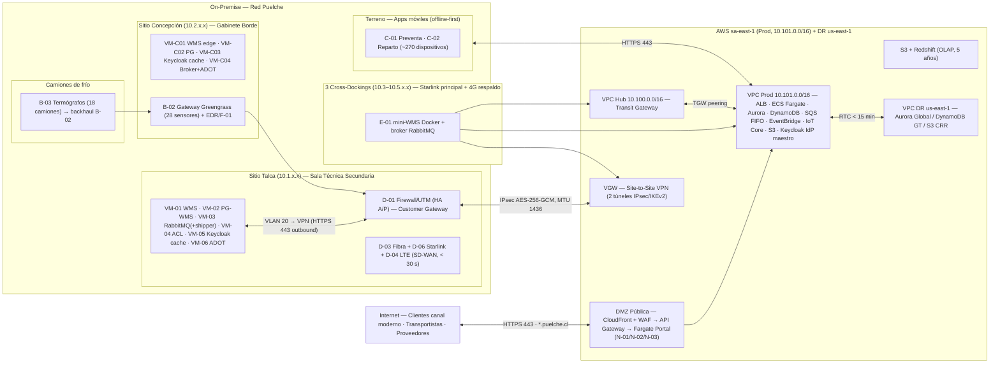

# ARQUITECTURA FÍSICA HÍBRIDA CONSOLIDADA — Caso 02 Logística (Distribuidora Puelche S.A.)

**Documento:** Arquitectura Física Híbrida Consolidada — Caso 02 — v02.0  
**Licitación:** TFEP-01/2026 — Subdocumento 3 (Informe 1)  
**Proponente:** *(empresa proponente pendiente de definir)*  
**Última actualización:** 05-09-2026

---

## 1. Objetivo y lectura del documento

Este documento consolida en **una sola arquitectura física** los dos dominios que operan como sistema único: la **carga principal en nube pública AWS** (Art. 16 de las Bases Administrativas) y los **componentes on-premise** que distribuyen la operación de la Distribuidora Puelche S.A.

**Lectura única de la red de instalaciones (alineada con el plan de capacidad §2.1 y con N1 de la lógica v6.2):** el caso declara **6 instalaciones** (Tabla 14.1 y RT-21.16, «seis instalaciones en cuatro regiones»), de las cuales **5 alojan cómputo**: Talca (CD), Concepción (CD) y las **3 plataformas de cross-docking** (Curicó, Chillán, Los Ángeles). La **sexta** es la casa matriz y oficinas de Talca, contigua al CD principal (§2.1 y Cap. 3 del caso): se sirve de la red y de los sistemas del CD y **no lleva nodo de cómputo propio**, pero sí cuenta para cobertura de red, soporte y traslados (RT-21.16). El §8 del caso menciona «cinco instalaciones»; prevalecen la Tabla 14.1 y RT-21.16, y la divergencia se eleva como consulta al mandante (Art. 43.3) sin alterar el dimensionamiento. La proyección del caso a tres años es de **7 instalaciones**, absorbidas por parametrización (RT-02.12).

Es la **fuente única consolidada** de la arquitectura física híbrida. Los documentos de origen —`Propuesta_Arquitectura_Cloud_Caso02_CLAUDE_v2.md` (v3.6), `Dimensionamiento_Infraestructura_OnPremise_v05.md` (v05), `Tabla_Emplazamiento_OnPremise_v06.md` (v06) y `Sala_Servidores_OnPremise_v02.md` (v02)— se declaran alineados por referencia a este documento; cualquier divergencia se resuelve con este archivo. En particular, la **identidad** se rige por el **Modelo B** (decisión D6 de la Arquitectura Lógica v1): autoridad única de identidad en el **Keycloak IdP maestro (ECS/Fargate, nube)**, con **caché local de solo lectura A-05 (TTL 8 h)** en VM-05 (Talca) y VM-C03 (Concepción). No existe un maestro on-premise ni promoción local a escritura.

**Cómo leerlo:** §3 define el inventario único de componentes; §4 la topología de red; §5 las **costuras de integración** (los puntos exactos donde el dominio on-premise y el dominio cloud se tocan); §6 a §10 consolidan identidad, datos, HA/DRP, observabilidad y ambientes; §11 resume la trazabilidad normativa; §12 registra cada decisión de alineación tomada para lograr la consistencia 100 %.

---

## 2. Principios de diseño híbrido consolidado

| Principio | Declaración | Base |
|---|---|---|
| **Hibridación obligatoria y equilibrada** | Carga principal en nube pública; on-premise solo donde la latencia, la criticidad operacional o la ausencia de señal lo exigen (bodega −22 °C, preventa/reparto rural, sensores industriales). | Art. 16.1-16.2 |
| **Un solo sistema, dos dominios** | Una única imagen Docker de Django en dos modos: `MODE=full` (cloud: todos los módulos) y `MODE=wms_only` (on-premise: solo bodega). | Cloud v3.6 §1/§3.1 |
| **Autoridad única de identidad (Modelo B)** | Keycloak IdP maestro en nube (authority única, escrituras); caché local A-05 de solo lectura (TTL 8 h) para la operación offline (24 h CD · 14 h terreno). Sin maestro on-premise ni promoción local. | D6 Arquitectura Lógica v1, RT-03.10, RNF-13.01 |
| **Autonomía local 24 h** | Cada CD (Talca, Concepción, cross-dock) opera su broker de colas RabbitMQ (A-03) y sus bases PostgreSQL locales cuando el enlace WAN no está disponible. | RNF-13.01, RT-03.10 |
| **Zero Trust end-to-end** | Sin conexiones entrantes a la red on-premise salvo dos excepciones controladas por la VPN (DMS→PostgreSQL y celery-erp-sync→ACL; ver D-AL-05). Todo lo demás es tráfico iniciado desde adentro. | Cloud v3.6 §5, On-prem v05 §3 |
| **Durabilidad y retención** | Telemetría 5 años (DynamoDB 30 días → S3 raw 5 años + consolidado OLAP S3 Parquet/Redshift 5 años); trazabilidad sanitaria de lote vida útil + 6 meses con mínimo de 5 años; documentos 6 años; evidencia de entrega 6 años; **geolocalización de personas 12 meses**; auditoría 7 años; logs de seguridad 12 meses en línea + 24 en archivo. | **RT-16.10** (el caso lo rotula RT-05.10), Art. 21.3, Cap. 15 del caso |
| **Disponibilidad y DRP** | SLA ≥ 99,9 % capa cloud central; DRP global RTO ≤ 4 h / RPO ≤ 15 min; DRP local (Talca → Concepción) para la capa logística. | BTT Cap. 10, Art. 20 |

---

## 3. Inventario único de componentes (nube + on-premise)

### 3.1 Núcleo logístico

| ID | Componente | Emplazamiento | Instancia nube | Instancia on-premise |
|---|---|---|---|---|
| A-01 | Motor WMS (recepción, picking FEFO, misiones RF, despacho, SSCC GS1) | **On-premise (maestro)** + nube (DRP) | Módulo `wms_only` en Aurora como réplica de continuidad (DMS CDC) | **VM-01** Talca (maestro, 8 vCPU/16 GB), **VM-C01** Concepción (edge autónoma), **E-01** cross-docks (mini-WMS, contenedor Docker ~1 vCPU/2 GB) |
| A-02 | Base de datos transaccional WMS (PostgreSQL + PostGIS) | **On-premise** + nube (réplica/OLTP cloud) | Aurora PostgreSQL: OLTP de módulos cloud + réplica DRP del WMS | **VM-02** Talca (8 vCPU/32 GB, 1,5 TB), **VM-C02** Concepción, BD local cross-dock |
| A-03 | Broker de colas offline (RabbitMQ) | **On-premise** (+ nube coordinada) | SQS FIFO (reconciliación/ERP) + EventBridge (eventos de negocio) | **VM-03** Talca (capacidad ~3 M mensajes), **VM-C04** Concepción, broker cross-dock (E-01) |
| A-04 | Capa anticorrupción (ACL) de acceso al ERP | **On-premise** | `celery-erp-sync` (cloud) consume contratos OpenAPI vía la ACL por VPN | **VM-04** Talca |
| A-05 | Keycloak — IdP maestro (nube) + caché local | **Híbrido** | **Keycloak IdP maestro** en ECS Fargate (1 vCPU/2 GB, 2 tareas Multi-AZ en peak, backend Aurora) — autoridad única (todas las escrituras) | **VM-05** Talca + **VM-C03** Concepción: **caché local de solo lectura TTL 8 h** (validación local de firma OIDC; sin escrituras; Modelo B, D6) |

### 3.2 Cadena de frío e IoT industrial

| ID | Componente | Emplazamiento | Instancia nube | Instancia on-premise |
|---|---|---|---|---|
| B-01 | Sensores industriales (temperatura, humedad) | **On-premise** | — | RS-485/Modbus en cámara y andenes; 28 sensores (Talca + Concepción) |
| B-02 | Gateway IoT Greengrass v2 | **On-premise** (gestionado desde nube) | AWS IoT Core (ingesta MQTTS, OTA, gestión de flota) | Gateway Talca y Concepción (ADAM-6000); termógrafos de camión (18) con backhaul BLE/RS-485 → gateway |
| B-03 | Termógrafos de transporte (18 camiones de frío) | **Híbrido** | AWS IoT Core (validación `fn-iot-validator`, alertas SNS < 5 s) | Dispositivos embarcados; descarga local BLE en bodega sin señal |

### 3.3 Terreno / fuerza de venta y reparto

| ID | Componente | Emplazamiento | Instancia nube | Instancia on-premise |
|---|---|---|---|---|
| C-01 | App preventa (62 preventistas) | **Híbrido** (offline-first) | API Gateway + módulos Django (pedidos, crédito, catálogo) | App móvil con SQLite local y sync deduplicado |
| C-02 | App repartidor/~200 conductores | **Híbrido** (offline-first, 14 h) | API Gateway + módulos (POD, sincro, ERP events) | App móvil; punto de venta portátil; control de devoluciones |
| C-03 | Terminales de bodega y cámara | **On-premise** | — | 144 dotación Talca (120 simultáneos + 20 % reserva) + 30 dotación Concepción (25 simultáneos + 20 % reserva); terminales RF rugosas −22 °C |
| C-04 | Impresoras de andén (SSCC) | **On-premise** | — | 4 Talca (2 recepción + 2 despacho) · 2 Concepción |
| C-05 | Balanza de recepción (control de merma) | **On-premise** | — | Dibal BEV: 2 Talca · 1 Concepción; periférico local del proceso de recepción (M1) |

### 3.4 Red y emplazamiento

| ID | Componente | Emplazamiento | Instancia nube | Instancia on-premise |
|---|---|---|---|---|
| D-01 | Firewall/UTM (Customer Gateway IPsec) | **On-premise + nube** | VGW (AWS Site-to-Site VPN, 2 túneles) | Par de firewall en HA A/P (Talca); gateway borde Concepción |
| D-02 | Switching de core / borde | **On-premise** | — | Stack/MLAG Talca; switch borde Concepción; switch compacto cross-dock |
| D-03/D-04 | Enlaces WAN | **On-premise** | — | Fibra dedicada (D-03) + 4G/LTE backhaul (D-04); **SD-WAN multi-WAN junto a D-06** (3 tecnologías/proveedores distintos); BGP entre túneles; conmutación < 30 s |
| D-05 | NAS de respaldo (WORM) | **On-premise + nube** | Pierna inmutable en S3 (Object Lock / Backup Vault Lock) | Synology WORM-30d (RTO local 4 h) |
| D-06 | Enlace WAN satelital (Starlink Enterprise) | **On-premise** | — | 5 kits (antena techumbre + router): respaldo automático de CDs (cierra brecha RNF-13.07 en Concepción) y **enlace principal** de las 3 cross-docks (RT-03.17); plan priorizado 1 TB / 500 GB |

### 3.4 bis Plataformas de cross-docking

| ID | Componente | Emplazamiento | Instancia nube | Instancia on-premise |
|---|---|---|---|---|
| E-01 | Mini-WMS de cross-docking + escáner GS1 | **On-premise** | — (visibilidad diferida en nube; eventos críticos directos a SQS/IoT) | Mini-PC industrial ×3 (Curicó, Chillán, Los Ángeles) con contenedor Docker (~1 vCPU / 2 GB), broker RabbitMQ local y 2 escáneres DS2208 por plataforma. Ventana de operación de 3 h **100 % local** (RT-03.10/03.11) |

### 3.5 Resiliencia, observabilidad y seguridad

| ID | Componente | Emplazamiento | Instancia nube | Instancia on-premise |
|---|---|---|---|---|
| F-01 | Emisores de telemetría (ADOT) + agente de gestión (SSM) | **On-premise** (emisor) + **nube** (plataforma) | CloudWatch, X-Ray, AMP, Grafana OSS (sa-east-1), SSM Endpoint regional | VM-06 (Talca), VM-C04 (Concepción), contenedor cross-dock |
| F-02 | Orquestador de parches (Ansible) | **On-premise** | — | VM gestión; política de parcheo mensual |
| F-03 | EDR en endpoints | **On-premise + nube** | Consola EDR cloud (SIEM) | Agentes en todos los nodos on-premise |

> **Nota de completitud del inventario (2026-09-06).** Esta sección enumera los componentes del dominio on-premise e híbrido y los servicios administrados de nube en forma resumida. El **inventario canónico y completo —36 componentes con su criterio de emplazamiento del Art. 16.2 (LAT, CRIT, VOL, CONN, TCO, HW, REG)— es `Tabla_Emplazamiento_OnPremise_v06.md` §1.0**, que incluye los identificadores N-01 a **N-13** del dominio de nube pura. Este documento prevalece en materia de **arquitectura** (topología, costuras, identidad, HA/DRP, ambientes); la tabla de emplazamiento prevalece en materia de **inventario y justificación componente por componente**.

### 3.6 Dominio cloud (servicios administrados)

| Servicio AWS | Uso | Justificación Art. 16.2/16.3 |
|---|---|---|
| ECS Fargate (monolito Django + workers Celery) | Carga principal: 2 vCPU/4 GB base, auto-escalado (peak septiembre hasta 3×) | Servicio administrado: sin nodos a operar; FinOps por vCPU/RAM |
| Aurora PostgreSQL | OLTP cloud + réplica DRP + Keycloak backend (maestro) | Multi-AZ, failover < 30 s, PITR 35 días |
| DynamoDB | Solo IoT raw (30 días TTL) | Escrituras < 10 ms p99, serverless |
| S3 / Redshift / QuickSight | Data lake analítico 5 años + BI | Almacenamiento y analítica administrados |
| AWS IoT Core + Greengrass | Orquestación edge, ingesta MQTT, OTA | Gestión de flota administrada |
| SQS FIFO + EventBridge | Colas de trabajo Celery + bus de eventos/alertas | Durabilidad y orden en reconciliación |
| S3 Object Lock / GuardDuty / Security Lake / WAF / Shield Advanced | Inmutabilidad documental, detección, SIEM, WAF, DDoS | Cumplimiento y seguridad administrados |
| **Secrets Manager + SSM Parameter Store** (D13 · ADR-15) | Custodia y rotación automática de secretos de integración (ERP, AS2/EDI, SII, Transbank) y credenciales de servicio; consumo **saliente** desde on-premise por VPC Endpoint | Servicio administrado con rotación nativa: cumple el Art. 21.4 sin agregar una VM ni un procedimiento de desellado manual a un equipo de 4 |
| **AMP + CloudWatch + X-Ray + Grafana OSS** (D14 · ADR-14) | Plataforma **única** de observabilidad para nube y on-premise; el on-premise solo emite (colectores ADOT, buffer 24 h) | Art. 16.4 y RT-03.16 exigen «la misma plataforma que la nube, sin puntos ciegos»; AMP es compatible con Prometheus/PromQL, sin lock-in |
| **N-13 — MDM gestionado** (Android Enterprise / Zebra DNA, SaaS) (D15) | Enrolamiento, política, modo quiosco, actualización de aplicación y de caché de turno, inventario por IMEI/serie y **borrado remoto selectivo** del parque de terreno | **RT-03.18 es Obligatorio**; el parque es 100 % Android/Zebra y el equipo de TI del CLIENTE es de 4 personas |

### 3.7 Canal moderno — portales web en DMZ pública (N-01…N-03)

| ID | Componente | Emplazamiento | Instancia nube | Instancia on-premise |
|---|---|---|---|---|
| N-01 | Portal de Clientes (catálogo público RF-12.14 + autoatención RF-12.15–12.18 y 12.25–12.29 + pago RF-12.30 + cobranza RF-07.07/07.08) | **DMZ pública** (cloud) | S3 + CloudFront + WAF → API Gateway → ECS Fargate tarea `portal` (misma imagen Django: módulos catálogo/pedidos/estado/DTE/saldo/cuentas + módulo `integraciones` → Transbank) → Aurora; estáticos en S3 | — (sin modo offline: RT-03.13) |
| N-02 | Portal de Transportistas (RF-12.19–12.21; OTP de un solo uso para conductores, RF-06.08) | **DMZ pública** (cloud) | Misma SPA Angular + módulos Django; OTP sin cuenta corporativa | — |
| N-03 | Portal de Proveedores (RF-12.22–12.24: OC, recepciones, devoluciones, notas de crédito) | **DMZ pública** (cloud) | Misma SPA Angular + módulos Django | — |

> **Modelo de entrada:** una sola SPA Angular (90 % UI común, §8 doc lógico) servida por **subdominios `*.puelche.cl`**; el **rol Keycloak** (`cliente`, `transportista`, `proveedor`, `invitado`) decide las vistas y los endpoints del API Gateway (RBAC), no hay despliegues separados por portal. Las consolas internas no pasan por esta DMZ (entrada intranet/VPN).

### 3.8 Back-office web — superficies internas (consolas y administración)

Superficies de escritorio del personal interno (planificación, calidad, gerencia y administración de TI). Son una **SPA Angular interna** servida por la **tarea `web` de ECS Fargate (nube)** con subdominio `web.puelche.cl`, **entrada exclusiva por intranet/VPN** (nunca por la DMZ pública), autenticación **SSO Keycloak (MFA)** y **RBAC por rol** que decide las vistas. Ninguna de estas consolas cuelga del Portal WMS de bodega (M1/M2/M5): cada una pertenece a su módulo y lectura su propia base.

| Superficie | Actor canónico | Módulo | Dato que muestra / edita | Base de datos física | Acceso |
|---|---|---|---|---|---|
| **Consola de planificación de rutas** | Planificador de rutas (RF-04) | M4 | Secuenciación, ventanas, capacidad, cadena de frío | **BD_RUTAS** (PostGIS) → on-prem **VM-02** + réplica **Aurora** | intranet/VPN → task `web` |
| **Consola de calidad / trazabilidad** | Jefa de calidad (RF-09) | M9 | Lotes, sensores de frío, excursiones térmicas, control sanitario | **BD_CALIDAD_TRAZABILIDAD** → on-prem **VM-02** + **DynamoDB** (sensores raw) | intranet/VPN → task `web` |
| **Tableros BI / gerencia** | Gerente comercial y de finanzas (RF-11) | M10 | OTIF, costo de servir, ocupación de flota, segmentación | **BD_BI_GERENCIA** → **Redshift Serverless (N-10)** (nunca Aurora directo) | intranet/VPN → **QuickSight** (cuentas federadas Keycloak) |
| **Portal de administración TI** | Jefe de TI | transversal | Administración de la plataforma: usuarios, roles, parámetros | **BD_MAESTROS_CONF** + **BD_GOBIERNO_ACCESO** → **Aurora** (Keycloak) | intranet/VPN → task `web` (Django admin) |

> **Nota de aplicación:** el back-office **no se instala** en las VM on-premise: corre como **web (SPA Angular)** en la nube (`web` Fargate) y QuickSight (N-10), accesible por navegador desde la PC del usuario vía **intranet/VPN** (Seguridad v01 §2.2, RT-03.22). Los datos de bodega (VM-02) llegan a la nube por la **costura C2** (DMS CDC → Aurora, RPO ≤ 15 min). Correlacionado 1:1 con la lógica §5.1 y §10.2.

---

## 4. Topología de red consolidada

### 4.1 Vista unificada

> **Nota de lectura:** todo tráfico on-premise → AWS es **outbound** (HTTPS/443, MQTTS/8883), salvo las dos excepciones D-AL-05. Los cross-docks salen **por Starlink (D-06, enlace principal) con respaldo automático LTE/4G dual** directamente a SQS/IoT/SSM (configuración crítica) y sincronizan detalle a Talca por AMQPS entre brokers; los CDs sostienen la VPN **tri-camino (fibra → satelital → LTE, SD-WAN)**. El Realm de Keycloak se **importa** por las cachés A-05/VM-C03 desde un objeto cifrado publicado por el maestro (nube) en S3 hacia la VPN (outbound), sin conexiones entrantes a Keycloak.

### 4.2 Segmentación de red (sin solapamiento)

| Dominio | Bloque | Uso |
|---|---|---|
| Talca | 10.1.x.x | VLAN 10 (MGT), 20 (SRV), 30 (OPS), 40 (WKS), 50 (IOT) |
| Concepción | 10.2.x.x | Misma segmentación VLAN |
| Cross-dockings | 10.3.x.x – 10.5.x.x | Red plana simplificada + SSM/IoT outbound |
| VPC Hub (sa-east-1) | 10.100.0.0/16 | Transit Gateway, adjuntos de VPN |
| VPC Prod (sa-east-1) | 10.101.0.0/16 | Multi-AZ (a/b): subredes públicas DMZ 10.101.1.0/24 (az1) y 10.101.2.0/24 (az2) — ALB/WAF/CloudFront origin/NAT GW, portal N-01/N-02/N-03 · subredes app y datos |
| VPC PreProd | 10.102.0.0/16 | Pre-Producción |
| VPC QA | 10.103.0.0/16 | Calidad |
| VPC Dev | 10.104.0.0/16 | Desarrollo |
| DR us-east-1 | 10.201.0.0/16 | Recuperación ante desastres (5.º ambiente, RT-04.01) |

**Flujos permitidos desde la red SRV (outbound, Zero Trust):**

| Flujo | Protocolo | Destino |
|---|---|---|
| Broker → SQS FIFO (shipper VM-03) | HTTPS 443 (VPC Endpoint SQS/PrivateLink) | AWS |
| Telemetría ADOT → CloudWatch/AMP | HTTPS 443 | AWS |
| Greengrass → IoT Core | MQTTS 8883 | AWS |
| SSM Agent (todos los nodos) | HTTPS 443 saliente | SSM Endpoint regional |
| Sync WMS Concepción → Talca | TCP 8080 / 5432 | SRV-TALCA (on-prem) |
| Sync cross-dock → Talca (broker a broker) | AMQPS 5671 | SRV-TALCA (on-prem) |
| Caché Keycloak A-05/VM-C03 → S3 (import del Realm) | HTTPS 443 (VPC Endpoint S3 / PrivateLink, outbound) | AWS (objeto Realm cifrado) |

**Excepciones entrantes por VPN (controladas, D-AL-05):**

| Flujo | Protocolo | Origen | Destino |
|---|---|---|---|
| AWS DMS → PostgreSQL WMS (replicación CDC) | TCP 5432 | VPC (sobre túnel IPsec autenticado) | VM-02 SRV-TALCA |
| `celery-erp-sync` → ACL ERP | HTTPS 443 | VPC (sobre túnel IPsec autenticado) | VM-04 SRV-TALCA |

---

## 5. Costuras de integración (puntos de contacto cloud ↔ on-premise)

| Costura | Extremo on-premise | Protocolo | Extremo cloud | Mecanismo | RPO/latencia | Modo degradado |
|---|---|---|---|---|---|---|
| C1 — VPN corporativa | D-01 (Customer Gateway, HA A/P) | IPsec/IKEv2, AES-256-GCM, BGP, MTU 1436 | VGW → VPC Hub (10.100) → TGW | Site-to-Site VPN, 2 túneles (activo + standby) | Conmutación < 30 s | Autonomía local 24 h por CD |
| C2 — Réplica WMS → Aurora | A-02 (PostgreSQL, `wal_level=logical`) | TCP 5432 (over VPN) | Aurora (DMS CDC) | AWS DMS en VPC lee el WAL lógico; réplica de continuidad | RPO ≤ 15 min | DMS encola en origen si la VPN cae |
| C3 — Aurora → Concepción (DRP local) | VM-C02 | TCP 5432 (over VPN) | Aurora (PITR 35 días) | Restore puntual / resiembra en contingencia | RTO +1–2 h local | Concepción opera local hasta sincronizar |
| C4 — Broker → SQS FIFO | A-03 (VM-03, shipper modo `wms_only`) | HTTPS 443 (VPC Endpoint SQS) | SQS FIFO → `celery-reconciliation` | Publicación cronológica e idempotente del buffer local | < 10 min tras reconexión (RT-03.12) | Buffer RabbitMQ 24 h |
| C5 — ERP vía ACL | A-04 (VM-04, ACL sobre ERP) | HTTPS 443 (over VPN) + SQS | `celery-erp-sync` | Lectura de contratos OpenAPI del ERP vía ACL; notificaciones SQS; **nunca escritura directa al ERP** | Encolado hasta 24 h | ACL concentra acceso; ERP sigue sin tocar directo |
| C6 — Identidad (Keycloak, Modelo B) | A-05 (VM-05 + VM-C03: cachés locales de solo lectura TTL 8 h) | Import del Realm cifrado → S3 (outbound, desde la nube) | Keycloak IdP maestro en ECS Fargate (autoridad única) | Cachés de solo lectura; mismos dominios y claves JWT; SCIM para aprovisionamiento ≤ 24 h (RT-12.10/RT-15.05) | Propaga ≤ 8 h (TTL) / < 24 h (SCIM) | Autenticación offline 24 h CD · 14 h terreno (RNF-13.01, RT-03.10), vía validación local de firma |
| C7 — IoT Greengrass → nube | B-02 (gateway + 18 termógrafos) | MQTTS 8883, X.509 | AWS IoT Core | Stream Manager con buffering; OTA para actualización de flota | At-least-once; buffer 14 h | Alertas locales en gateway |
| C8 — Observabilidad | F-01 (VM-06, VM-C04, cross-dock) | HTTPS 443 | CloudWatch / X-Ray / AMP / Grafana OSS | ADOT exporta con buffer en disco 24 h | Near real-time | Buffer local en disco |
| C9 — Gestión remota | Todos los nodos (SSM Agent) | HTTPS 443 saliente | SSM Endpoint regional | Gestión sin puertos entrantes | — | — |
| C10 — Apps de terreno | C-01/C-02 (offline-first) | HTTPS 443 | API Gateway + módulos Django | Sync deduplicado con idempotency keys | < 10 min tras reconexión (RNF-07.01) | Operación offline completa (preventa/reparto) |
| C11 — DRP nube | — | nativo AWS | sa-east-1 ↔ us-east-1 | Aurora Global DB + DynamoDB Global Tables + S3 CRR (RTC < 15) | RTO ≤ 4 h / RPO ≤ 15 min | Réplica legible en DR |
| C12 — DRP local | Talca → Concepción | Sync WMS (8080/5432) | Aurora (opcional) | Promoción controlada de VM-C01 (procedimiento de 5 pasos). La identidad **no requiere conmutación local**: el maestro está en la nube y las cachés A-05/VM-C03 siguen validando firmas (DRP de identidad = misma autoridad en nube) | RTO +1–2 h | Concepción ya opera autónoma |
| C13 — Cross-dock → consolidado | E-01 | HTTPS 443 + MQTTS 8883 (**Starlink D-06 principal, LTE dual respaldo**) y AMQPS 5671 (→ Talca) | SQS FIFO / IoT Core / SSM | Eventos críticos directos a SQS/IoT; detalle del mini-WMS a Talca | < 10 min | Buffer local en cross-dock |
| C14 — Notificaciones al negocio | — | — | EventBridge → SNS/API SII/EDI retail | Alertas de frío < 5 s; DTE; EDI a cadenas de retail | — | Reintento con backoff |
| C15 — Portal web DMZ (N-01/N-02/N-03) | Stock/crédito/cobranza desde red Puelche (vía API Gateway) | HTTPS 443 | S3+CloudFront+WAF → API Gateway → tarea `portal` | Sesión OIDC Keycloak por rol (MFA TOTP/OTP, Art. 22°); sin datos locales (RT-03.13) | Online (sin modo offline) | Reintento del navegador; sin modo degradado |
| C16 — Pago Transbank (RF-12.30) | Saldo/contrato del cliente en módulos cloud | HTTPS 443 (salida DMZ) | Módulo `integraciones` Django → Webpay (certificados SUSCERTIF) | Idempotencia por `transaction_id`; pedido confirmado (RF-12.15) + sesión activa (RF-12.26); registro de confirmación/rechazo | Síncrono | Reintento con backoff; estado persistido en el portal |

---

## 6. Identidad y seguridad unificadas

**Keycloak — autoridad única en nube y cachés locales (A-05, Modelo B):** conforme a la decisión **D6 de la Arquitectura Lógica v1** (2026-09-04), la autoridad única de identidad vive en el **Keycloak IdP maestro (ECS Fargate — nube)**; VM-05/VM-C03 son **cachés locales de solo lectura (TTL 8 h)**. Cognito queda descartado como dependencia (solo alternativa).

| Instancia | Rol | Comportamiento |
|---|---|---|
| **Keycloak IdP maestro** (ECS Fargate, sa-east-1) | **Autoridad de identidad única (todas las escrituras)** | Altas, cambios de rol, políticas, revocaciones. Backend Aurora. MFA (Art. 22°) para todo acceso externo; PIN 6 dígitos (factor de posesión + PIN) para terreno. Integración LDAP/SCIM con el directorio corporativo del CLIENTE (por VPN outbound). |
| **Caché local Talca (A-05, VM-05)** | Caché de solo lectura (TTL 8 h) | Validación local de la firma OIDC y emisión de sesiones/tokens offline; sostiene la autonomía 24 h del CD y 14 h de terreno (RNF-13.01, RT-03.10). Sin escrituras; no es un segundo IdP. |
| **Caché local Concepción (VM-C03)** | Caché de solo lectura (TTL 8 h) | Ídem para el CD borde; réplica de caché Talca. DRP de identidad = misma autoridad en nube (sin promoción local a maestro). |

**Sincronización de identidad (sin conexiones entrantes):** el maestro (nube) publica el **Realm Puelche cifrado a S3** (export/import, outbound) y las cachés locales A-05/VM-C03 lo importan para mantenerse **Δ ≤ 8 h (TTL)**. Aprovisionamiento/desaprovisionamiento por API/SCIM disparado por eventos EventBridge en **≤ 24 h** (RT-12.10/RT-15.05). La misma clave de firma JWT y el mismo dominio `puelche.cl` se mantienen en cachés y maestro; las altas, bajas y roles se propagan **desde el maestro hacia las cachés, nunca a la inversa**.

**Portales de entidad externa (N-01/N-02/N-03):** una sola SPA Angular servida por subdominios `*.puelche.cl` (`portal.puelche.cl`, `transportistas.puelche.cl`, `proveedores.puelche.cl`); el **rol del token Keycloak** decide vistas y endpoints (RBAC). Todo acceso externo con MFA (Art. 22°): TOTP/SMS para roles corporativos (`cliente`, `proveedor`, `transportista`) y **OTP de un solo uso** para conductores externos (RF-06.08), sin cuenta corporativa. El portal de clientes **no opera offline** (RT-03.13): el autoservicio exige conexión a la DMZ.

**Estrategia de tokens unificada:** id_token 1 h · access_token 30 min · refresh_token 30 días · **token offline con TTL por perfil de actor**: **8 h** turno nocturno de bodega (RNF-13.01) y **14 h turno completo de reparto / jornada de preventa** (RNF-06.02). El token offline se **renueva al inicio de turno en cobertura** o contra la **caché local A-05 (VM-05/VM-C03)** en el CD (validación de firma offline), de modo que la ventana offline siempre cubre la jornada completa aunque el dispositivo no vuelva a ver señal (sin autenticación en la ruta).

> **Nota Modelo B (revocación):** al reconectar, el maestro propaga la revocación a las cachés A-05/VM-C03 (Δ ≤ 8 h por TTL; < 24 h por SCIM, RT-12.10). Para identidades de alta sensibilidad, la baja se refuerza con la matrícula de activos y el control de dispositivos (MDM), de modo que una desvinculación bloquea también el terminal.

**Zero Trust end-to-end:** mTLS/TLS 1.3 mínimo (HSTS con precarga), WAF + Shield Advanced, VPN IPsec, cifrado en reposo (KMS/AES-256) y en tránsito, EDR en todos los endpoints, SIEM (Security Lake) con 6 casos de uso de negocio, IAM Identity Center con MFA para consolas, permisos mínimos, SCPs.

---

## 7. Datos, persistencia y retención unificados

| Categoría | Sistema de verdad | Emplazamiento | Retención |
|---|---|---|---|
| Bodega (inventario, SSCC) | PostgreSQL WMS (A-02) | on-premise Talca (+ Concepción) | PITR; respaldo 3-2-1-1-0 |
| OLTP cloud (pedidos, preventa, reparto, trazabilidad) | Aurora PostgreSQL | cloud | PITR 35 días; dump diario cifrado |
| IoT raw (lecturas de temperatura) | DynamoDB | cloud | TTL 30 días (después de consolidar) |
| Consolidado analítico de temperatura | S3 Parquet (`s3-analytics-parquet`) + Redshift Serverless | cloud | 5 años |
| Trazabilidad por envío de temperatura | GSI por `shipment_id` en DynamoDB + S3 raw | cloud | 5 años (S3); 35 días el GSI |
| OLAP / BI | S3 Data Lake + Redshift + QuickSight | cloud | 5 años |
| Documentos tributarios (DTE) | S3 Object Lock + Aurora (metadatos) + firma Ley 19.799 | cloud | 6 años |
| Auditoría de negocio | Aurora `audit_log` (eventos EventBridge) | cloud | 7 años |
| Logs de seguridad | CloudWatch (online) + S3 archivo | cloud | 12 meses online + 24 en archivo (Art. 21.3 / RT-11.14) |

**Respaldo 3-2-1-1-0 unificado:** 1 original en producción · 2 copias (RAID local + Aurora) · 1 copia fuera del sitio (pierna inmutable S3/Backup Vault) · 1 copia aislada (DR us-east-1) · 0 errores de restauración al año (pruebas semestrales, Art. 20 / RT-07.07).

---

## 8. Alta disponibilidad y DRP unificado

**Capa cloud (sa-east-1):** todos los componentes Multi-AZ (2 AZ mínimo, tercera disponible). ALB + ECS Fargate 2 tareas base (escalado a 3× en septiembre), Aurora failover < 30 s, DynamoDB serverless. SLA ≥ 99,9 % (< 8,76 h/año; BTT Cap. 10 pide salida y control).

**Capa on-premise (HA individual, sin SLA compuesto):** hipervisor Ceph N+1, RAID 10, par de firewall HA A/P, stack de switches, **enlaces WAN tri-camino D-03+D-06+D-04 (fibra → satelital Starlink → LTE)**, VMs dimensionadas con headroom (×1,5, RNF-19.04 → tolerar 3.900 entregas en septiembre).

**DRP local (Talca → Concepción):** procedimiento de 5 pasos con promoción controlada del WMS edge (VM-C01); **la identidad no requiere conmutación local** — el maestro está en la nube y las cachés A-05/VM-C03 siguen validando firmas (DRP de identidad = misma autoridad en nube, sin promoción local a maestro). Concepción ya opera autónoma (latencia ≤ 1 s, RNF-05.01). RTO +1–2 h.

**DRP nube (sa-east-1 → us-east-1):** Aurora Global Database, DynamoDB Global Tables, S3 CRR (RTC < 15 min). RTO ≤ 4 h / RPO ≤ 15 min. Prueba semestral (Art. 20 / RT-07.07).

---

## 9. Observabilidad consolidada

- **On-premise:** emisores ADOT/SSM (F-01: VM-06, VM-C04, cross-dock) → CloudWatch, X-Ray, AMP. Buffer en disco 24 h ante corte de WAN.
- **Cloud:** métricas, logs y trazas centralizadas en CloudWatch; **Grafana OSS self-managed en sa-east-1** (Amazon Managed Grafana no disponible en la región) para tableros unificados.
- **SIEM:** Security Lake (Parquet/OpenSearch) con 6 casos de uso de negocio (alerta nocturna fuera de patrón, acceso remoto anómalo, MFA en shadow IT, exfiltración de stock, escalada de privilegios, respuesta a incidente reglamentario).
- **Alertas operacionales:** PagerDuty + SNS; alertas de cadena de frío < 5 s (`fn-iot-validator` + `celery-alert-engine`).

---

## 10. Ambientes y despliegue (RT-04.01)

| Ambiente | Cuenta AWS | VPC | Uso |
|---|---|---|---|
| Desarrollo | Cuenta 1 | 10.104.0.0/16 | Dev, integración continua |
| Calidad | Cuenta 2 | 10.103.0.0/16 | QA |
| Pre-Producción | Cuenta 3 | 10.102.0.0/16 | Marcha blanca, pruebas de aceptación |
| Producción | Cuenta 4 | 10.101.0.0/16 | Operación real (sa-east-1) |
| Recuperación ante Desastres | Cuenta 5 | us-east-1 | DR (5.º ambiente obligatorio, RT-04.01) |

**On-premise en el modelo de ambientes:** el despliegue on-premise es **producción** (imagen `wms_only`); la misma imagen pasa por los ambientes cloud (Dev→QA→PreProd) antes de su cutover en Talca (ventana de 24 h, RT-03.10). No se mantienen ambientes on-premise separados; la paridad la garantiza la imagen única y el IaC (Terraform/CloudFormation) versionado.

**Portal web (N-01/N-02/N-03):** la SPA Angular se publica **por ambiente** en S3+CloudFront (bucket + distribución por cuenta AWS); el backend `portal` es la misma imagen Django del ambiente. El portal entra a producción con el **hito de enero 2029 (RNF-12.01)** siguiendo el mismo pipeline Dev→QA→PreProd→Prod.

---

## 11. Trazabilidad normativa (resumen)

| Exigencia | Cumplimiento consolidado |
|---|---|
| Art. 16.1–16.3 — híbrido + servicios administrados | Modelo híbrido §2; justificación por componente §3; FinOps e IaC 100 % |
| Art. 21.2 — TLS/HSTS | TLS 1.3 mínimo + HSTS con precarga (§6) |
| Art. 21.3 — SIEM/logs | Security Lake + 6 casos de uso; logs 12+24 meses (§7) |
| Art. 22° — MFA | Todo acceso externo; factor de posesión + PIN en terreno (§6) |
| Art. 16.1/16.2 + RT-21.16 | **6 instalaciones**, de las cuales **5 alojan cómputo** (2 CD + 3 cross-docking); la 6.ª es la casa matriz de Talca, sin nodo propio (§1, §3, §4) |
| RT-04.01 — 5 ambientes | §10 |
| RT-03.12 — reconexión sincronizada | Costuras C4/C7/C10: deduplicación idempotente, < 10 min |
| RT-03.10 — 14 h offline / cutover 24 h | C7/C10 + caché A-05 (C6) + procedimiento de cutover (§8) |
| **RT-16.10** — retención de datos históricos y de auditoría | §7. *(El Cap. 15 del caso rotula esta materia como RT-05.10; el código transversal correcto es **RT-16.10** —RT-05.10 es «catálogo de datos con linaje», Deseable—. Se responde contra RT-16.10 en el T-12 y el desajuste se eleva como consulta, Art. 43.3.)* |
| RT-06.01 — tipología on-prem | Sala Técnica Secundaria (Talca, Doc. Sala v02), Gabinete Borde (Concepción/cross-dock) |
| RT-11.14 / RT-11.15 — logs y SIEM | §7, §9 |
| RT-12.01 — identidad centralizada (Modelo B) | Keycloak IdP maestro en nube + caché local A-05 TTL 8 h (§6, C6) |
| RT-12.02 — SSO propagado | Back-channel logout; la revocación alcanza la caché A-05 en la primera re-sincronización (§6) |
| RT-12.10/RT-12.11 — aprovisionamiento ≤ 24 h; perfiles operacionales | C6 (§6); PIN 6 dígitos + facial; dispositivo compartido; offline |
| RT-15.05 — aprovisionamiento ≤ 24 h | C6 (§6) |
| BTT Cap. 10 — SLA 99,9 %, RTO/RPO | §8 |
| BTT Cap. 12 — identidad (RT-12.11) | PIN 6 dígitos + facial; dispositivo compartido; offline (§6) |
| **Caso Cap. 17.4 — los 13 puntos** | Mapa completo y verificado en `Propuesta_Arquitectura_Cloud_Caso02_CLAUDE_v2.md` §7.13. Aporte de este documento: **punto 1** (emplazamiento componente por componente, §3 y Tabla v06 §1.0) · **punto 2** (autonomía y reconciliación, C1–C5) · **punto 3** (terreno sin señal, C10) · **punto 4** (cámara −22 °C, C7) · **punto 5** (ERP y DTE, C5 y C14) · **punto 7** (trazabilidad de lote con GSI `shipment_id`, §7) · **punto 8** (evidencia de entrega, §7) · **punto 11** (separación OLTP/OLAP, §7) · **punto 13** (peak de septiembre, §8) |

---

## 12. Registro de decisiones de alineación

**D-AL-01 — Modelo de identidad (Modelo B).** La identidad se rige por la decisión **D6 de la Arquitectura Lógica v1 (2026-09-04)** y por `Tabla_Emplazamiento_OnPremise_v06` §A-05: **Keycloak IdP maestro en la nube (ECS Fargate, autoridad única de escrituras)** con **caché local de solo lectura TTL 8 h** en VM-05 (Talca) y VM-C03 (Concepción). El documento cloud quedó alineado (v3.6: §3.3, §3.5, §5.4, §7.3, §7.10, L-02, Apéndice C), incluyendo la corrección histórica de 5 pasajes que citaban “VM-01” como maestro (VM-01 es el **WMS Core**, A-01).

**D-AL-02 — Trío de instancias Keycloak (Modelo B).** Autoridad única en **nube (ECS Fargate, escrituras)**; **cachés locales de solo lectura** en **VM-05 (Talca)** y **VM-C03 (Concepción)** con **TTL 8 h**; sincronización por export/import del Realm cifrado vía S3 (outbound, publicado **desde la nube**), sin conexiones entrantes a Keycloak. Se elimina la “promoción controlada de VM-C03 a maestro”: **no existe un maestro on-premise que promover**; el DRP de identidad es la misma autoridad en la nube.

**D-AL-03 — Transporte broker → nube.** El envío del buffer RabbitMQ a la nube lo ejecuta un **shipper en VM-03 (modo `wms_only`)** hacia **SQS FIFO por HTTPS/443 (VPC Endpoint SQS/PrivateLink)**. Se corrigió el flujo on-premise “Sync broker → nube” (Antes: “SQS / Amazon MQ AWS — AMQPS 5671”; Ahora: “SQS FIFO — HTTPS 443”) y la fila de VLAN 20. **AMQPS 5671 queda reservado a brokers on-premise↔on-premise** (cross-dock → Talca).

**D-AL-04 — Cross-docks independientes.** E-01 envía eventos críticos **directo a SQS/IoT/SSM por Starlink (D-06) con respaldo automático LTE/4G dual (outbound)**; el detalle del mini-WMS se sincroniza a Talca por AMQPS. Lo crítico no depende de Talca. La selección del camino Starlink/LTE la hace el router del kit D-06 (SD-WAN de borde); los kits se incorporan según los planes y precios **declarados en la propia oferta** (T-11 C27, 56 meses) y resuelven la intermitencia de señal de Los Ángeles entre 03:00–05:00.

**D-AL-05 — Flujos entrantes por VPN (excepciones al Zero Trust).** Solo dos: AWS DMS → PostgreSQL on-premise (TCP 5432, replicación CDC) y `celery-erp-sync` → ACL (HTTPS 443). Ambos únicamente desde la VPC sobre el túnel IPsec autenticado.

**D-AL-06 — Modelo de datos DynamoDB.** PK `device_id` + SK `timestamp` (ingesta por dispositivo) **más GSI por `shipment_id`** para la trazabilidad por envío (Punto 6). Reconciliados §4.2 y §7.13.

**D-AL-07 — Estrategia de tokens.** Alineada a §5.4: id_token 1 h / access_token 30 min / refresh_token 30 días; **token offline con TTL por perfil de actor**: 8 h bodega (turno nocturno, RNF-13.01) y **14 h reparto / jornada preventa** (RNF-06.02), renovado al inicio de turno en cobertura o contra la caché local A-05, para que la sesión offline cubra el turno completo.

**D-AL-08 — Zonas de Disponibilidad.** Mínimo **2 AZ** (sa-east-1a/1b) con tercera disponible (escalado multi-AZ); se normalizó el Apéndice C que decía “3 AZ”.

**D-AL-09 — Mecanismo único de réplica WMS → Aurora.** AWS DMS CDC (WAL lógico, `wal_level=logical`), RPO ≤ 15 min, sin agentes propietarios on-premise. La redacción on-premise de “réplica WAL” se lee como DMS-CDC sobre WAL lógico.

**D-AL-10 — Ambientes.** 5 cuentas AWS (Dev/QA/PreProd/Prod + DR us-east-1). On-premise = **producción + DR local (Concepción)**; la imagen `wms_only` se valida en los ambientes cloud antes del cutover (24 h, RT-03.10).

**D-AL-11 — SLA/DRP objetivo.** SLA ≥ 99,9 % capa cloud central; HA on-premise individual (sin SLA compuesto); DRP global RTO ≤ 4 h / RPO ≤ 15 min; DRP local Talca → Concepción RTO +1–2 h.

**D-AL-12 — Observabilidad.** ADOT on-prem → CloudWatch/X-Ray/AMP; Grafana OSS self-managed en sa-east-1 (AMG no disponible en la región); SIEM con 6 casos de uso de negocio.

**D-AL-13 — Logs de seguridad.** 12 meses en línea + 24 en archivo (36 meses totales), superando los mínimos de Art. 21.3 y RT-11.14. Auditoría de negocio 7 años.

**D-AL-14 — Retención de telemetría.** 5 años: DynamoDB (TTL 30 días) → S3 raw (5 años) + consolidado analítico OLAP (S3 Parquet/Redshift, 5 años). Coherente con RT-05.10/RT-16.10.

**D-AL-15 — Respaldo 3-2-1-1-0 único.** D-05 (RTO local 4 h) + pierna inmutable nube (S3 Object Lock / Backup Vault Lock), con prueba de restauración semestral.

**D-AL-16 — Fuente única consolidada.** Este documento (v02.0) prevalece como arquitectura física híbrida; los documentos de origen quedan alineados a él (Cloud v3.6, Dim v05, Tabla v06, Sala v02). Empresa proponente pendiente de definir (nomenclatura Art. 43.3). **Serie de portales de canal moderno** (antes C-05/C-06/C-07, en colisión con la balanza C-05 de la Tabla v06) **renumerada a N-01…N-03** (serie Nube/DMZ), conforme a la expansión de la Tabla v06 (v07, Sección 1.0 — tabla maestra de emplazamiento).

**D-AL-17 — Portal de canal moderno en DMZ pública.** Los portales de Clientes (N-01, RF-12.14–12.18, 12.25–12.30 y cobranza RF-07.07/07.08), Transportistas (N-02, RF-12.19–12.21, OTP RF-06.08) y Proveedores (N-03, RF-12.22–12.24) son **una sola SPA Angular** servida por subdominios `*.puelche.cl` (CloudFront+WAF → API Gateway → tarea Fargate `portal` de la misma imagen Django), con **RBAC por rol en Keycloak**; entrada intranet/VPN para las consolas internas. El pago de autoservicio usa **Transbank Webpay** (módulo `integraciones`, idempotencia por `transaction_id`) — RF-12.30. **Sin modo offline** (RT-03.13); entra con el hito de enero 2029 (RNF-12.01); no abre conexiones entrantes al on-premise (solo lectura de stock/crédito/cobranza vía API Gateway, costura C15).

**D-AL-18 — Cierre del Modelo B de identidad en la fuente consolidada.** La contradicción histórica entre la decisión lógica (Keycloak maestro en nube) y el documento de nube (que hasta la v3.5 declaraba el maestro en VM-05, on-premise) queda **cerrada**: la v3.6 del documento de nube adoptó el Modelo B en §3.3, §3.5, §5.4, §7.3, §7.10, L-02 y Apéndice C, y este consolidado lo fija como arquitectura vigente en §6, C6, D-AL-01 y D-AL-02 — **Keycloak IdP maestro en ECS Fargate (autoridad única de escrituras) y cachés locales de solo lectura A-05/VM-C03 con TTL 8 h, sin maestro on-premise ni promoción local**. Es la decisión que el T-12 referencia al declarar cerrada la reconciliación de identidad. *(Esta decisión existía en los hechos pero faltaba en la numeración: el registro saltaba de D-AL-17 a D-AL-19.)*

**D-AL-19 — Redundancia WAN satelital (Starlink D-06).** Para cerrar la brecha de redundancia WAN se incorpora el **camino satelital en los 5 sitios**: en los CDs (Talca y Concepción) como respaldo automático de la fibra (**cierra la brecha RNF-13.07 de Concepción**), y en las **3 cross-docks** como **enlace principal** (elimina la dependencia exclusiva de la red móvil; Los Ángeles tiene intermitencia 03:00–05:00, su ventana operacional). Los caminos WAN quedan en **3 tecnologías/proveedores distintos** (fibra D-03 → satelital D-06 → LTE D-04) gestionados con **SD-WAN multi-WAN** en D-01 y firewall de borde; en cross-docks el router del kit maneja la conmutación a LTE dual. Precio, planes (1 TB CD / 500 GB cross-dock) y reposición 15 %/56 meses **declarados en la oferta** (T-11 C27 · T-12 RT-08.13); MTU túnel 1.436.

---

**D-AL-20 — Camino dedicado complementario (AWS Direct Connect).** Se incorpora **AWS Direct Connect como complemento activable por el CLIENTE**, terminado en el par de firewall D-01 mediante un VIF dedicado o alojado sobre la fibra D-03, **sin hardware adicional**. **No reemplaza** los tres caminos SD-WAN (fibra D-03 → satelital D-06 → LTE D-04) ni la salida directa de las cross-docks (D-AL-04): aporta capacidad dedicada para la réplica DMS CDC, la telemetría y los sincronismos por lote. Mientras no se contrate, **la VPN IPsec sostiene por sí sola** el RPO ≤ 15 min, el RTO ≤ 4 h y el SLA ≥ 99,9 %. Alineado con Cloud v3.6 §2.4, Dimensionamiento v05 §3.6/§3.7/§4.1, Tabla v06 (D-01) y Sala v02 §7 (alineación INC-02, 06-09-2026).

**D-AL-21 — Componentes incorporados por la auditoría del Subdocumento 4 (06-09-2026).** Tres decisiones de la arquitectura lógica carecían de componente físico y quedan emplazadas: **(a)** la gestión de secretos pasa de un gestor autoalojado sin VM a **Secrets Manager + SSM** (D13 · ADR-15); **(b)** la observabilidad pasa de un conjunto Prometheus/Grafana/Loki autoadministrado por sitio —sin VM dimensionada y contrario a la exigencia de plataforma única del Art. 16.4 y RT-03.16— a **emisión ADOT con buffer de 24 h hacia AMP/CloudWatch/X-Ray/Grafana OSS** (D14 · ADR-14); **(c)** la gestión de dispositivos que exige **RT-03.18 (Obligatorio)** deja de ser una mención transversal y se declara como componente **N-13, MDM gestionado** (D15). Los tres quedan reflejados en §3.6, en `Tabla_Emplazamiento_OnPremise_v06.md` §1.0(b) y en el T-11.

---

## 13. Referencias

| Documento | Versión | Rol |
|---|---|---|
| `Propuesta_Arquitectura_Cloud_Caso02_CLAUDE_v2.md` | v3.6 | Dominio cloud (fuente; IdP maestro Modelo B) |
| `Dimensionamiento_Infraestructura_OnPremise_v05.md` | v05 | Dominio on-premise, dimensionamiento y flujos (fuente) |
| `Tabla_Emplazamiento_OnPremise_v06.md` | v06 | Emplazamiento A-01…F-03, Modelo B de identidad (fuente) |
| `Sala_Servidores_OnPremise_v02.md` | v02 | Sala Técnica Secundaria (Talca) y Gabinete Borde (Concepción) |
| `Arquitectura_Logica_v6-2.md` | **v6.2** | **Arquitectura lógica vigente** — 8 capas, módulos M1–M12, límites de contexto, stack y decisiones D1–D15 (D6 Keycloak Modelo B, D13 secretos, D14 observabilidad, D15 MDM) |
| `Arquitectura_de_Integracion_v01.md` | v01 | Vista de integración — catálogo de 15 integraciones, contratos, mensajería, versionado y gobierno (Subdoc 4, apartado 3) |
| `Arquitectura_de_Seguridad_v01.md` | v01 | Vista de seguridad — Zero Trust, capa expuesta, identidad, cifrado, controles y residencia de datos (Subdoc 4, apartado 4) |
| `Arquitectura_de_Despliegue_v01.md` | v01 | Vista de despliegue — ambientes, redes, HA, DRP y respaldos (Subdoc 4, apartado 5) |
| `Dimensionamiento_y_Plan_de_Capacidad_v01.md` | v01 | Dimensionamiento y plan de capacidad (Subdoc 4, apartado 6) |
| `Registro_Decisiones_Arquitectura_ADR_v01.md` | **v02** | Decisiones registradas ADR-01 a ADR-15 (Subdoc 4, apartado 7) |
| `Bases/Bases_Administrativas.md`, `Bases/Bases_Tecnicas_Transversales.md`, `Bases/Caso_02_Logistica.md` | — | Documentos rectores (precedencia) |
| `Requerimientos/decisiones.md` | D1–D40 | Decisión técnica Keycloak (D6 Modelo B): interna, no se registra en decisiones formales |