# Arquitectura Lógica v6.3 — Documento Unificado (Puelche S.A. · Caso 2 Logística)

> **Cambios v6.2 → v6.3 (2026-09-24 — coherencia lógica interna, solo capa lógica).** Corrección de coherencia interna en la capa lógica, **sin cambios de diseño ni de física**:
>
> 1. **Nomenclatura de eventos §8.6 alineada a PascalCase**, con mapeo explícito a los **10 eventos canónicos de integración** (dos niveles: dominio/entidad → canónico, §8.6).
> 2. **Referencias S28 corregidas** hacia §9.6 y la matriz del Cap. 17.1 (§16.4, §9.6) — ya no apuntan a §8.4 (tabla de límites de contexto).
> 3. **Columna de IDs INT-01…INT-15 y fila de telemetría (INT-15)** en la matriz de integraciones §9.7.
> 4. **Volumetría de mensajería por integración (~150.000 msg/día en régimen)** añadida a §9.7 (cierre parcial del numeral 14.2).
> 5. **Diagrama §18.4 enriquecido** con capa anticorrupción (ACL) y eventos canónicos.

> **Cambios v6.1 → v6.2 (2026-09-06, alineación íntegra lógica ↔ física — auditoría del Subdocumento 4).** Esta versión cierra **todas** las divergencias detectadas entre la vista lógica y la vista física, sin cambiar ninguna decisión de negocio y sin introducir componentes nuevos que no tengan emplazamiento declarado:
>
> 1. **Gestión de secretos (SEC-01, hallazgo A3):** se elimina **HashiCorp Vault** —que no tenía emplazamiento físico— y se adopta **AWS Secrets Manager + SSM Parameter Store** con consumo saliente desde los nodos on-premise por VPC Endpoint. Afecta §4, §4.2, §8.7, §9.6, §11, §11.6, §11.8, §13, §18.5 y D13.
> 2. **Observabilidad (hallazgo A4):** se elimina el conjunto **Prometheus/Grafana/Loki autoadministrado on-premise** —sin VM dimensionada ni retención sostenible en VM-06— y se declara **una sola plataforma** (RT-03.16 y Art. 16.4 exigen «la misma plataforma que la nube, sin puntos ciegos»): colectores **ADOT** on-premise con buffer en disco de 24 h que exportan a **AMP (compatible Prometheus) · CloudWatch Logs · X-Ray**, con tableros en **Grafana OSS** en sa-east-1. Afecta §4, §12, §12.3, §13, §18.2 y D9.
> 3. **Duración del token de acceso (hallazgo A5):** `access_token` pasa de 15 a **30 min**, valor prevalente de la fuente física (D-AL-07). §11.4.
> 4. **Borde on-premise (hallazgo C6):** la Capa 2 deja de declarar «WAF on-premise»; el ingreso por centro de distribución es el **firewall/UTM con IPS (D-01)**. §4, §6, §13.
> 5. **Contenedores on-premise:** se elimina **K3s**; el on-premise corre **Docker/Docker Compose** sobre el clúster Proxmox, coherente con la física y con un equipo de TI de 4 personas. §13.
> 6. **Trazas, caché y CI:** se elimina **Jaeger** (queda X-Ray), se elimina el **Redis local** (la caché es N-07 ElastiCache en nube; la sesión sin conexión la sostiene la caché A-05) y se unifica el pipeline en **GitLab CI con etapa de construcción hermética en AWS CodeBuild** (procedencia SLSA 3). §12, §13.
> 7. **Gestión de dispositivos (RT-03.18):** el **MDM** pasa de mención transversal a **componente con emplazamiento declarado (N-13, servicio gestionado en nube)**, incorporado también a la tabla de emplazamiento y al T-11. §11.7, §13.
> 8. **Código de retención corregido (hallazgo D4):** la retención de auditoría se responde contra **RT-16.10**, no contra RT-05.10 (que es «catálogo de datos con linaje», Deseable). §10.8, §11, D1, S14.
> 9. **Instalaciones (hallazgo B1):** se declara la lectura única — **6 instalaciones**, de las cuales **5 alojan cómputo**; la sexta es la casa matriz/oficinas de Talca, sin nodo propio. §0.2, §8.1, §8.4.
> 10. **Supuesto camión ≠ conductor (hallazgo D3):** se declara S31 con la derivación que reconcilia el §2.3, el §2.4 y la Tabla 14.1 del caso.
> 11. **Decisiones nuevas registradas:** **D13** (secretos), **D14** (observabilidad unificada) y **D15** (MDM como servicio gestionado), con alternativa evaluada y criterio, conforme al apartado 7 del Subdocumento 4 y a RT-02.04.

> **Documento único de la capa lógica (v6.1).** Unifica en un solo archivo todo el contenido relevante de la arquitectura lógica de los documentos `00` → `08` **más las correcciones de la auditoría T-7/T-21/T-22 (2026-09-04)**, **el cierre de brechas frente a los RT de las Bases Técnicas Transversales (v3, 2026-09-05)**, **la resolución íntegra de los hallazgos de la auditoría v3 (2026-09-05)** **y la auditoría BA v4 (2026-09-05, H1 traza documental resuelto)**: contexto y cifras, marco normativo, referencia metodológica, actores, modelo de **8 capas (RT-02.01)**, módulos M1–M12, datos, seguridad y observabilidad transversales, stack de herramientas, decisiones (D1–D12), notas (N1–N5), supuestos (S01–S30), flujos críticos, diagramas C4, trazabilidad y pendientes.
>
> **Vigencia:** 2026-09-24 (**v6.3**). Supera a la v6.2 y a todas las versiones anteriores (v6.1, v6, v5.5, v5, v5.1, v4, v3, v2, v1, consolidaciones `08`/`07`). Los documentos `00`–`08` se mantienen como **fuentes de trazabilidad** (cada sección indica su origen).
>
> **Decisiones vigentes: D1–D15** (D9 superada por D14, conservada por trazabilidad). **Supuestos: S01–S31.** **Notas: N1–N5.**
>
> **Cambios v1→v2 (2026-09-04):** ADR fechados con alternativa evaluada/criterio (§14) · límites de contexto y dependencias inter-módulo (§8.4) · dimensionamiento lógico (§8.5) · TOGAF + ISO/IEC 42010 declarados (§1, §4.3, §19) · NIST SP 800-207 + STRIDE (§11) · vista de procesos formal (§17) · bitácora de reconciliación (Art. 16.4, §9.1) · gobierno de la capa de integración (§9.4) · diagramas de datos/integración/seguridad (§18.3–18.5). Detalle: registro de auditorías.
>
> **Cambios v2→v3 (2026-09-05, auditoría de cumplimiento RT de las Bases Técnicas Transversales — Caps. 2, 3, 5, 9, 10, 12, 14, 16, 17 y 18):** RT-02.13 modelo de dominio canónico con eventos (§8.6) · RT-02.11 SPOF declarados y mitigados (§8.7) · RT-03.13 funciones no disponibles offline + procedimiento manual (§9.5) · contratos formales OpenAPI 3.1 / AsyncAPI 2.6, obsolescencia 6 meses, OAuth 2.1/mTLS y capa anticorrupción sobre ERP/WMS (§9.6) · matriz de integraciones con modo/volumen/ventana/comportamiento (§9.7) · carga y descarga masiva (§9.8) · posición CAP declarada (§10.4) · diccionario de datos (§10.5) · calidad ISO/IEC 25012 (§10.6) · MDM de datos maestros (§10.7) · retención/eliminación/Art. 85/exportabilidad (§10.8) · analítica con latencia ≤ 4 h, autoservicio y drill-down (§10.9) · identidad completa RBAC+ABAC, sesiones, aprovisionamiento, perfil de terreno, break-glass y MDM de dispositivos (§11.1–11.7) · tablero del mandante, alertas por síntomas y retención de observabilidad (§12.1–12.3) · desempeño 3×, cuello de botella, degradación controlada y clasificación de servicios (§17A) · módulos transversales RT-16.x: parametrización, workflows, GED/firma, notificaciones, búsqueda, autoatención (§17B) · movilidad RT-17.x (§17C) · RT-18: sin IA, declaración fundada (§17D). Detalle: auditoría de cumplimiento RT (v3) y **Anexo A** (matriz RT→sección integrada).
>
> **Cambios v3→v4 (2026-09-05 — auditoría de cumplimiento RT v3, 0 bloqueante):** se resuelven **todos** los hallazgos EN CAMINO con compromisos numéricos del Cap. 15 integrados en el diseño y decisiones del caso 16.1 tomadas y fundadas:

> - **Sync tras reconexión (RT-03.12 / caso RT-03.13):** ≤10 min en reparto · ≤2 h en CD, con particionado/reanudación, dedupe y reconciliación determinista (§9.1, §9.5, §9.8).
> - **Latencias analíticas (RT-05.29):** operación del día ≤5 min · cierre comercial ≤2 h · gestión ≤4 h, alimentadas por eventos (Capa 5) (§10.4, §10.6, §10.9).
> - **P95 transaccional (RT-09.01):** picking ≤1 s · registro de entrega ≤2 s · línea de preventa ≤1,5 s · stock/crédito ≤2 s (§17A, §8.5, §12.2).
> - **Decisiones 16.1:** #2 unidad de trazabilidad = lote del proveedor GS1 (GTIN+lote) + SSCC (§8.6) · #10 envases = saldo por cliente (M8, §8.6) · #14 WMS 2013 = **absorción en M2/M5** con justificación técnica (§9.6, §9.7, §10.1).
> - **RTO/RPO (Art. 20 / RT-07.04):** RPO ≤15 min · RTO ≤4 h, ventana crítica 05:30–07:00 en cero indisponibilidad (§8.7, S27).
> - **STRIDE por componente + matriz de controles ISO/IEC 27001:2022 / 27002** (§11.8) · **contratos de la API de negocio** (S28, §9.6) · **históricos ERP/WMS consultables** (RT-05.15, §10.8) · **traza documental** (matriz RT integrada en Anexo A; H1 de referencias de auditoría resuelto en v5, más abajo).
>
> **Cambios v4→v5 (2026-09-05 — auditoría BA lógica v4, 0 bloqueante):** se resuelve **H1 (traza documental)**: las referencias a `Auditoria_Arquitectura_Logica_v3.md` (inexistente) se corrigen, apuntando a la **matriz del Anexo A** (única fuente de traza RT lógica). Sin cambios de diseño ni contenido: pendientes declarados en §20 (innovaciones RT-26.01 y alineación con la arquitectura física, fuera del alcance de la lógica hasta que existan).

> **Cambios v5→v5.1 (2026-09-05 — alineación con la arquitectura física, hallazgos A1/A2 de la auditoría lógica↔física):** las apps de campo (preventa/reparto) pasan de **Flutter** a **Kotlin nativo (Android)** (ADR-07 de la física: SQLite/Room + Zebra DataWedge sobre parque Zebra) y la puerta de enlace (Capa 3) pasa de **Kong** a **Amazon API Gateway**, como está desplegada en la física (Despliegue v01 · Cloud v3.6 · Tabla v06). Kong queda solo como alternativa open source.
>
> **Cambios v5.1→v5.5 (2026-09-05 — auditoría de cumplimiento con los requisitos de arquitectura lógica de las Bases Administrativas, Subdoc 4):** resuelve **H1** (tabla §20: versión vigente declarada como "v4 (este)" → **v5.5**, con cadena de superados v5/v4/v3/v2/v1) · **H2** (Anexo A: **RT-04.01** "5 ambientes + DR" sin trazar en la matriz → fila añadida; ya declarado en §1 principio 6, §13 y §18.9) · **H3** (N1: supuesto de **5 sitios** (2 CD + 3 CDK) declarado explícitamente **candidata a consulta Art. 43.3** por la inconsistencia caso §8 (5) vs Tabla 14.1/RT-21.16 (6), con topología parametrizable RF-02.02/RT-02.12). Sin cambios de diseño ni contenido. Detalle: auditoría BA lógica **v5** (veredicto: CUMPLE; 0 bloqueantes; observación H4 sobre registros de auditorías previas no presentes en el repo).
>
> **Actualización (2026-09-05 — alineación con la arquitectura física, D2):** la **serie de tiempo consolidada** deja de proponerse como extensión transaccional de PostgreSQL sobre Aurora y pasa a **OLAP por diseño**: DynamoDB raw (TTL 30 d) → Glue → S3 Parquet (5 años inmutable) → Redshift Serverless (consulta/QuickSight). D2 actualizada; S15 ahora decide solo la **granularidad de agregación** (no el motor); S17/S18 y los diagramas §18 ajustados; control `grep -i timescale` en el repo: **0 resultados**. On-prem queda PostgreSQL + PostGIS.
>
> **v5.5.1 (2026-09-05): cifra TPS unificada con la física — ~35 TPS base / ~105 TPS ráfaga (35×3) / ≤130 TPS transitorio (hallazgo M2).**
>
> **Cambios v5.5.1→v6 (2026-09-05 — promoción formal a v6):** el documento unificado se promueve a **v6** (posteriormente renombrado a `Arquitectura_Logica_v6-2.md`), consolidando la actualización D2 (serie de tiempo a **OLAP por diseño**) y la unificación TPS con la física (v5.5.1). Sin cambios de contenido; cadena de superados y tabla §20 actualizadas.

> **Actualización de diagramas (2026-09-05):** set completo de la arquitectura lógica en §18 (13 diagramas): contexto revisado (Keycloak interno en Capa 7), contenedores 8 capas, módulos M1–M12 con dependencias, actores → superficies, vista de procesos (5 secuencias), datos, integración, seguridad y ubicación lógica híbrida. **La fuente canónica de los diagramas es el texto Mermaid de este documento (§18);** los SVG/PNG se exportan a `Diagramas/` para el informe (AGENTS).
>
> **Documentos base (origen por sección):** `00` (contexto) · `01` (esqueleto) · `02` (actores) · `03` (plan y decisiones) · `04` (maqueta) · `05` (stack) · `06` (supuestos) · `07_v1` (consolidación 6 capas, superada) · `08` (consolidación 8 capas) · Bases (BA · BTT · Caso 02).

---

## 0. Contexto y marco — el mandante y la operación (origen: `00`)

### 0.1 El mandante

| Antecedente | Detalle |
|---|---|
| **Razón social** | Distribuidora Puelche S.A. (empresa ficticia) |
| **Giro** | Distribución mayorista de productos de consumo masivo (alimentos, bebidas, aseo, cuidado personal) |
| **Fundación** | 1974, Talca — empresa familiar, tercera generación |
| **Ventas anuales** | $148.000 millones |
| **Cobertura** | O'Higgins → La Araucanía |
| **Operación** | Talca (casa matriz + CD principal), Concepción, y **3 plataformas de cross-docking** (Curicó, Chillán, Los Ángeles) → **2 CD + 3 cross-dockings** (N1) |
| **Canales** | Canal tradicional (11.600 almacenes), food service (2.100), cadenas/supermercados (500) |
| **Mandante clave** | Amparo Ossa Bulnes, Gerenta General — condición: *"no cambie al cliente; atiéndalo mejor"* |

### 0.2 Cifras que condicionan todo el diseño (Cap. 15 del caso)

| Indicador | Valor |
|---|---|
| Clientes activos | 14.200 |
| SKU activos | 8.400 (≈1.100 refrigerados/congelados); pasa a ~9.500 según caso |
| Pedidos / mes | 31.000 · 260.000 líneas · 2,4 M unidades |
| Entregas / día hábil | ≈1.400 (peak septiembre ≈2.600, ~2× volumen durante 3 semanas) |
| Kms / mes | ≈420.000 |
| Docs tributarios / mes | ≈34.000 |
| Envases retornables | 68.000 canastillos y 9.400 pallets (pérdida estimada 14 % anual) |
| Conteo cíclico / merma | Diferencia 2,3 % del valor contado · merma por vencimiento 1,7 % |
| OTIF base | 82,4 % de entregas completas y a tiempo |
| Ventana crítica | Despacho 05:30–07:00 con **cero indisponibilidad** (96 camiones: 42 propios + 54 de transportistas) |
| **Instalaciones a cubrir** | **6** (Tabla 14.1 y RT-21.16), de las cuales **5 alojan cómputo**: CD Talca, CD Concepción y las 3 plataformas de cross-docking (Curicó, Chillán, Los Ángeles). La sexta es la **casa matriz y oficinas de Talca**, contigua al CD (§2.1 y Cap. 3 del caso), que se sirve de la red y de los sistemas del CD y **no lleva nodo de cómputo propio**. Proyección del caso a 3 años: 7 instalaciones, absorbidas por parametrización (RT-02.12). *Lectura declarada: el §8 del caso menciona «cinco instalaciones»; prevalece el 6 de la Tabla 14.1 y de RT-21.16, y la divergencia se eleva como consulta (Art. 43.3) sin alterar el dimensionamiento.* |
| **Personas de terreno y bodega** | 62 preventistas · **42 conductores propios** (uno por camión propio) y ≈160 conductores de transportistas · ~120 preparadores concurrentes en el turno nocturno · 310 personas de CD · **4 personas en el área de TI** (ver **S31** sobre camión ≠ conductor) |

### 0.3 Dolencias centrales que la propuesta debe resolver

1. **Trazabilidad de lote** — retiro sanitario tardó 9 días y no se pudo entregar lista (pérdida $31 M; proveedor suspendió a Puelche por 6 meses).
2. **Promesa de entrega** — no se puede comprometer plazos; ventana de entrega de 30 min del canal moderno en 2029 (riesgo de perder el **11 % de la venta**).
3. **Costo de servir** — $4,2 M/mes de diferencia de rendición sin investigar.

### 0.4 La operación tal como es hoy (puntos críticos)

- **Preventa:** 62 preventistas en terreno con app obsoleta (sin stock, sin deuda del cliente, se cae y duplica pedidos).
- **Preparación nocturna:** ~120 personas, picking con hoja impresa; rotación 38 %/año; cámara de congelado a −22 °C sin señal.
- **Despacho:** ventana crítica 05:30–07:00 → 96 camiones; "si el sistema se cae en esa ventana, no hay operación".
- **Reparto:** ~200 conductores (42 propios + ~160 de transportistas externos, 10 empresas); rutas sin señal (Cauquenes, Villa Alegre); guías de papel; efectivo en ruta ($1–1,5 M) con riesgo de seguridad; **sin protocolo ante local cerrado**.
- **Planificador de rutas:** 1 persona, 21 años, planilla de 11 hojas; **se jubila en 2 años** (riesgo de conocimiento clave).
- **Calidad:** sin registro continuo de temperatura, sin sistema consultable de lotes, **sin regla escrita de excursión térmica**.
- **TI:** equipo de 4 personas; sala de 25 m² con UPS de 10 min; sin documentación de interfaces del ERP (implantado 2017; partner ya no trabaja con ellos).

### 0.5 Trabajo de traducción exigido (Cap. 17 del caso)

- Catálogo de **requerimientos funcionales** (ID, descripción, **actor**, precondición, resultado esperado, prioridad, origen) — ya existe como hoja `consolidado de requerimientos F` (RF-01…RF-14, 138 requerimientos).
- Catálogo de **requerimientos no funcionales** (umbral numérico y método de verificación).
- **Registro de supuestos** · **registro de reglas de negocio** · **matriz de trazabilidad** · **registro de vacíos y consultas**.
- **Asuntos propios del caso (Cap. 17.4):** qué se ejecuta en cada CD y qué en nube (y por qué); operación ante corte de enlace y reconciliación; dispositivo de reparto un turno completo sin señal y resolución de conflictos; captura en cámara de congelado (−22 °C); integración con ERP y DTE; qué hacer con el WMS 2013; modelo de trazabilidad de lote; evidencia de entrega + guía electrónica/acuse; conductores externos; canal moderno EDI (2029); separación transaccional vs analítico; sala de servidores actual; absorción del peak de septiembre.

---

## 1. Principios rectores y restricciones del marco (origen: `03` §2, `00` §5, AGENTS)

**Precedencia de fuentes (Art. 5° BA):** `Bases Administrativas` > `Bases Técnicas Transversales` > `Caso 02 Logística`. El caso puede **endurecer** un requisito transversal, nunca rebajarlo.

Principios rectores (no negociables):

1. **Offline / sin señal es requisito de primera clase** — preventa, reparto y bodega operan sin conexión; la sincronización es diferida e **idempotente**.
2. **El cliente del canal tradicional no cambia su forma de operar** — el sistema se adapta a él, no al revés.
3. **Híbrido cloud + on-premise es obligatorio** (Art. 16) — núcleo transaccional por CD + analítica/integración en nube. No se admiten propuestas solo-nube ni solo-on-prem.
4. **Cronograma de 56 meses innegociable** (Art. 17) — Etapa 1 (meses 1–15, producción mes 16), Etapa 2 (meses 13–20, producción mes 21), Operación 36 meses.
5. **Zero Trust y multi-zona** — IAM central (OIDC/MFA), microsegmentación, IaC, sin confianza implícita en la red.
6. **5 innovaciones obligatorias** (Cap. 5 BA) y **5 ambientes + DR** (RT-04.01).
7. **Equipo TI pequeño (4 personas)** — todo componente administrable por el equipo de Puelche o por soporte del adjudicatario en los 56 meses.
8. **Consistente con la misma licitación de "Pancho" pero NO copiado** — misma estructura de capas, contenido 100 % re-mapeado a Logística.
9. **Marco de gobierno arquitectónico: TOGAF declarado, descripción conforme a ISO/IEC/IEEE 42010** (glosario BA) — **las seis vistas exigidas están completas**: lógica (§4–§12), de procesos (§17), de datos (§10), de seguridad (`Arquitectura_de_Seguridad_v01.md`, apoyada en §11), de **integración** (`Arquitectura_de_Integracion_v01.md`, apoyada en §9) y de **despliegue/física** (`Arquitectura_de_Despliegue_v01.md` + `Arquitectura_Fisica_Hibrida_Consolidada_Caso02_v02.md`); **ADR fechado y fundado** (§14, RT-02.04).

**Inconsistencias detectadas en las Bases (se elevan como consulta al mandante conforme al Art. 43.3, sin corregirlas unilateralmente; cada una tiene además una lectura declarada para poder diseñar):**

| Inconsistencia | Lectura declarada por LafroX |
|---|---|
| Instalaciones: 5 (§8 del caso) vs 6 (Tabla 14.1 y RT-21.16) | **6 instalaciones, 5 con cómputo** (§0.2). Prevalece la fuente mayor y las dos menciones técnicas |
| Ponderación del Formulario T-21 suma 98 %, no 100 % | Sin efecto en el diseño; se consulta por el 2 % faltante |
| Ambientes: 4 (Art. 24) vs 5 (Art. 3 y Transversales §4.1/RT-04.01) | **5 ambientes**, con Recuperación ante Desastres como quinto (RT-04.01 prevalece) |
| Códigos RT mal mapeados en la tabla del Cap. 15 del caso | Se responde en el T-12 contra el **código correcto del transversal**: **RT-03.24 → RT-03.23** (red inalámbrica), **RT-03.13 → RT-03.12** (sincronización tras reconexión), **RT-05.10 → RT-16.10** (retención de auditoría), y RT-06.01 se lee como exclusividad/aislamiento, no como tipología |
| Camiones vs conductores: 42 propios (Tabla 14.1) vs 84 personas (§2.4) | **S31**: los 84 son 42 conductores + 42 peonetas, una tripulación por camión. El terminal se asigna por tripulación |
| T-22 no menciona los entregables del Cap. 17.1 | Viven **dentro del registro de requerimientos**, no como capítulo aparte |
| Fechas de calendario T-20/T-22 solapadas | Sin alterar el cronograma; se consultan |
| Identificador «FEP01.26/FEP02.26» vs TFEP-01/2026 | Se estandariza a **TFEP-01/2026** |
| Desconexión: «hasta dos horas» (§6, §8) vs turno de 14 h (Cap. 10 y RT-03.10) | **2 h como nominal, 14 h como contingencia de diseño**; ambos documentados |

---

## 2. Referencia metodológica — esqueleto de "Pancho" y lecciones aplicadas (origen: `01`, `04` §11)

"Pancho" (Caso 4 — Salud, solución HospiNet) es de la **misma licitación** pero otra industria: su arquitectura lógica es **patrón/referencia**, no contenido.

### 2.1 Modelo de capas de la referencia (6 capas)

```
┌─────────────────────────────────────────────────────────┐
│ 1. CAPA CLIENTE        actores / usuarios finales       │
│ 2. CAPA PRESENTACIÓN   portales + app móvil + web        │
│ 3. CAPA DE NEGOCIO     módulos funcionales (dominios)    │
│ 4. CAPA CACHE          entre negocio y datos             │
│ 5. CAPA DE DATOS       híbrida: datacenter local + nube  │
│ 6. CAPA SERVICIOS EXTERNOS  terceros                    │
└─────────────────────────────────────────────────────────┘
```

### 2.2 Lecciones/vacíos de "Pancho" y cómo se resuelven en Puelche

| Lección de la referencia (`01` §4) | Cómo se resuelve aquí |
|---|---|
| Módulo de integraciones vacío ("AÑADIR DESCRIPCIÓN") | Capa 5 (Integración y eventos) de **primera clase** + módulo EDI dedicado (M11) (lección del `01` §1.4 aplicada en `04` §7) |
| Ordenar la arquitectura por **tipos de actor** | La capa cliente se organiza por **11 actores canónicos** (`02` §1), no por cargo individual |
| Sin dimensión offline (salud asume conectividad) | Capa 4/5 con buffers locales, UUID e idempotencia; el offline es ciudadano de primera clase |
| Tecnologías de cliente pesadas para campo | Apps ligeras **offline-first** (Kotlin/Android nativo); el cliente tradicional ni siquiera instala app |
| Superposición nube/outpost sin aclarar | Se justifica componente por componente (Cap. 17.4 punto 1): bodega on-prem, preventa/reparto en nube |
| Equipo TI pequeño | Monolito modular Django + stack administrable + soporte del adjudicatario en 56 meses |
| Integraciones para el caso que "Pancho" no tiene | ERP 2017, WMS 2013, **EDI** canal moderno, GPS/telemetría, escaneo GS1, sensores de frío |

---

## 3. Modelo de actores (origen: `02`, `08` §2)

> **Decisión D3:** la arquitectura se construye sobre los **11 actores canónicos** (ordenados por tipo de actor, estilo "Pancho"). Los A1–A16 del `02` §3 quedan **documentados pero NO integrados** (S06/S07): ningún RF queda sin actor con el set canónico; los roles especializados (bodega, excepciones EDI, entidades externas) se gestionan como perfiles de portal o funcionalidad.

### 3.1 Los 11 actores canónicos — rol, dispositivo, condición y funcionalidades

| # | Actor canónico | Rol / ineficiencia que enfrenta | Dispositivo | Condición operativa | Funcionalidades con que interactúa |
|---|---|---|---|---|---|
| 1 | **Preventista** (62) | Toma pedidos y cobra en terreno; app obsoleta sin stock/crédito | Tablet/smartphone app preventa **offline** | Sin señal; stock/crédito/precio sin conexión | Pedidos, stock, crédito, promociones, precios, sincronización diferida, ID de pedido (RF-03) |
| 2 | **Conductor repartidor propio** (42) | Entrega y cobra; sin protocolo ante local cerrado; efectivo en ruta | Smartphone app reparto **offline** + impresora térmica | Entrega/firma/QR/cobranza sin señal | Entregas, POD, QR, firma, cobranza, envases, devoluciones, comprobante (RF-06, RF-08) |
| 3 | **Conductor de transportista externo** (~160) | No es trabajador de Puelche; rota sin aviso; incorporación requiere acuerdo con cada transportista | App "conductor invitado" + **OTP** | Sin afiliación laboral | Entregas, POD, confirmación de identidad (RF-06.08) |
| 4 | **Preparador de pedidos** (120) | Picking con hoja impresa, turno nocturno, rotación 38 %/año | Terminal con escáner GS1 (HHT) | Turno nocturno, cámara −22 °C **sin señal** | Misiones de picking, escaneo GS1, faltantes, secuenciación térmica (RF-05) |
| 5 | **Planificador de rutas** (1) | Conocimiento crítico concentrado; se jubila en 2 años | Estación/pantalla de planificación | Conocimiento crítico a transferir antes de su retiro | Secuenciación de rutas, ventanas, capacidad, cadena de frío (RF-04) |
| 6 | **Jefa de calidad** | Sin registro continuo de temperatura ni regla de excursión térmica | Consola de calidad + sensores | Lectura de sensores de frío y trazabilidad de lote | Trazabilidad, sensores, excursiones térmicas, control sanitario, bloqueo (RF-09) |
| 7 | **Gerente comercial** | No puede comprometer plazos; riesgo 11 % ventas 2029 | Consola/tablero BI | Define promesa de entrega, gestiona canal moderno | OTIF, canal moderno, promesa de entrega (RF-11, RF-12) |
| 8 | **Gerente de finanzas** | Sin costo de servir real; $4,2 M/mes de diferencias de rendición | Consola/tablero BI | Controla costo logístico y rendición de efectivo | Costo de servir, rendición, indicadores, segmentación (RF-07, RF-11) |
| 9 | **Jefe de TI** (equipo de 4) | No puede administrar sistemas adicionales sin soporte | Portal de administración TI | Sin capacidad de administrar sistemas sin soporte | Configuración topológica, usuarios, parámetros, admin del sistema (RF-02.01, transversal) |
| 10 | **Cliente canal tradicional** (11.600) | No tiene internet ni dispositivo; no puede cambiar su forma de operar | **Ninguno obligatorio**: aviso WhatsApp/SMS, confirma con firma/QR del conductor | No cambia su forma de operar | Estado/aviso de entrega, confirmación sin app (RF-06.02) |
| 11 | **Cliente canal moderno** (500) | Exige integración electrónica (EDI) desde enero 2029 | Portal de clientes + **EDI (AS2/API)** | Exigencia electrónica desde 2029 | Pedido EDI, estado, documentos, autoservicio (RF-12) |

### 3.2 Roles no-humanos (sistemas/dispositivos — `02` §4)

| Entrada | Tratamiento |
|---|---|
| `Sistema` (RF-04.04/04.06/04.08, 05.04) | Componente automático → actor `Sistema` + humano responsable/beneficiario |
| `Aplicación de preventa` (RF-03.16) | Componente de presentación; actor real = **Preventista** |
| `Sensor de temperatura` (RF-09.03/09.04) | Dispositivo de captura en **Capa 2 (Borde IoT)**; responsable = **Jefa de calidad** |
| `Sistema de monitoreo` (RF-09.05) | Alerta automática (Capa 8); destinataria = **Jefa de calidad** |
| `Usuario no autenticado` (RF-12.14) | Rol público del portal (catálogo), no actor de negocio |
| Telemetría de camiones (RF-14) | Fuente externa integrada en Capa 5/6 (M12); uso **operativo** |

### 3.3 Actores adicionales A1–A16 (`02` §3) — supuestos declarados, NO integrados

Roles documentados con su justificación (jefe de bodega, recepcionista, operador de bodega, jefe de operaciones, jefe de flota, cajero liquidador, ejecutivo de cobranza, supervisor de crédito, administrador comercial, jefe de abastecimiento, administrador de sistema, operador de excepciones EDI, centro de control, cargador, empresa transportista —entidad externa—, proveedor —entidad externa—). **Decisión 2026-09-01:** no se integran a la maqueta; quedan como referencia para futuras ampliaciones de perfiles (S07). Proveedores y transportistas se tratan como **roles de portal de entidad externa** (S09).

### 3.4 Interacción actor ↔ capas (resumen)

- **Terreno sin señal:** Preventista y conductores usan apps de la **Capa 1** (offline-first) con foto local de datos y captura local cifrada; sincronizan al volver a cobertura **por Capa 2 → Capa 3 (Gateway)** con **UUID idempotente** (RF-03.16/17, RF-06.07/12).
- **Bodega (−22 °C sin señal):** Preparador opera **HHT/escáner GS1** con misión descargada; autonomía local **24 h** (RNF-13.01/RT-03.10) y token offline TTL 8 h (Capa 7).
- **Back-office con conexión:** Planificador, Jefa de calidad, Gerentes y Jefe de TI por consolas/portales con **SSO OIDC (Keycloak)** y MFA; todo tráfico pasa por Borde → Gateway.
- **IoT / flota:** sensores de frío y telemetría entran por **Greengrass (Capa 2)** con buffer de reenvío y persistencia local durante los cortes.
- **Clientes:** canal tradicional no instala nada (aviso WhatsApp/SMS + firma/QR); canal moderno por **portales y EDI (AS2)**.
- **Externos:** conductores de transportistas con **OTP** de un solo uso; proveedores/transportistas por portales de entidad externa.

---

## 4. Modelo de capas — 8 capas canónicas (origen: `08` §1, numeral 2.1 / RT-02.01)

La solución se organiza en las **ocho capas de existencia obligatoria** del numeral 2.1 de las Bases Técnicas Transversales. La tecnología de cada capa se justifica en §13.

```
┌───────────────────────────────────────────────────────────────┐
│ 8 · OBSERVABILIDAD TRANSVERSAL     OTel/ADOT · AMP·CW·X-Ray    │
│ 7 · SEGURIDAD TRANSVERSAL       Keycloak + Secrets Mgr + KMS   │
│ 6 · DATOS (híbrida)                PG+PostGIS·Aurora·DynamoDB· │
│     S3 Parquet·Glue·Redshift·Redis                            │
│ 5 · INTEGRACIÓN Y EVENTOS          RabbitMQ·SQS·EventBridge    │
│ 4 · SERVICIOS DE NEGOCIO           M1–M12 (stateless)          │
│ 3 · PUERTA DE ENLACE DE SERVICIOS  API Gateway (AWS)          │
│ 2 · BORDE Y EXPOSICIÓN             CDN·WAF·TLS 1.3·IoT edge    │
│ 1 · PRESENTACIÓN                   apps Kotlin·portales·HHT   │
└───────────────────────────────────────────────────────────────┘
```

| Capa | Rol en Puelche | Componentes principales | Exigencias del numeral 2.1 |
|---|---|---|---|
| **1. Presentación** | Superficies de los 11 actores | Apps móviles **offline-first** (Kotlin/Android) · portales web (Angular) · consolas back-office · HHT con escáner GS1 | Adaptativo, accesible y **sin lógica de negocio**; ninguna interfaz accede directo a la BD |
| **2. Borde y exposición** | Único punto de entrada público, terminación de cifrado y borde IoT | **CloudFront** CDN · **WAF + Shield** · **ALB** · **TLS 1.3** · ingreso on-prem por CD con **firewall/UTM con IPS (D-01)** · **IoT Greengrass** | CDN, WAF gestionado, DDoS L3/L4/L7, TLS 1.3 |
| **3. Puerta de enlace de servicios** | Publicación y gobierno de APIs de negocio y de sync offline | **Amazon API Gateway** (OIDC/Keycloak) en nube · validación de esquema · rate limiting · cuotas · versionado | Validación de esquema, inspección de carga útil, trazabilidad por transacción, catálogo de servicios |
| **4. Servicios de negocio** | Lógica de los **12 módulos** con límites de contexto explícitos | Monolito modular **Django** (M1–M12) **stateless** + workers extraíbles (EDI, Telemetría, Sync) | Sin estado, despliegue independiente de los críticos, contratos versionados retro-compatibles |
| **5. Integración y eventos** | Comunicación asíncrona, desacoplamiento y orquestación | **RabbitMQ** (on-prem) + **SQS FIFO/EventBridge** (nube) · DLQ · retry · dedupe · sync offline idempotente | Bus con persistencia, cola de mensajes fallidos, reintento y deduplicación |
| **6. Datos** | Persistencia transaccional, analítica, documental y archivos (la serie de tiempo consolidada es dato analítico OLAP) | **PostgreSQL+PostGIS** on-prem por sitio · **Aurora** nube · **DynamoDB** IoT (raw, TTL 30 d) · **Redis** · **S3 Parquet** (raw 5 años inmutable) · **AWS Glue** · **Redshift Serverless** | Separación transaccional/analítica, cifrado en reposo, respaldo y retención declarados |
| **7. Seguridad transversal** | Identidad, autorización, secretos, cifrado, auditoría y detección | **Keycloak** (OIDC/MFA/SSO/OTP) · **AWS Secrets Manager + SSM Parameter Store** (D13) · **KMS** · mTLS · auditoría inmutable · GuardDuty/Security Hub | Aplicada a todas las capas, no como perímetro único |
| **8. Observabilidad transversal** | Métricas, registros y trazas distribuidas correlacionadas | **OpenTelemetry**: colectores **ADOT** on-prem (buffer en disco 24 h) → **AMP** (compatible Prometheus) · **CloudWatch Logs** · **X-Ray** · tableros **Grafana OSS** (sa-east-1) · RUM apps campo (D14) | Instrumentación OTel; **una sola plataforma** para nube y on-premise, sin puntos ciegos (RT-03.16, Art. 16.4) |

### 4.1 Mapeo del modelo anterior (6 capas → 8 capas)

| Capa `07` (anterior) | Destino en el modelo de 8 capas |
|---|---|
| 1. Cliente (actores) | Se separa: **dispositivos/superficies → Capa 1 (Presentación)**; **sensores y telemetría → Capa 2 (Borde, IoT edge)** |
| 2. Presentación | Capa 1 — **sin lógica de negocio**: valida forma y captura local idempotente; stock/crédito/promos son **foto de datos de lectura**, las reglas viven en Capa 4 |
| 3. Negocio (M1–M12) | Capa 4 — **stateless** (RT-02.05): sesión y estado de proceso en almacenes externos |
| 4. Cache/Offline/Mensajería | **Se reparte (N4):** mensajería asíncrona → **Capa 5**; buffers offline de apps → **Capa 1/2**; Redis cache/sesiones → **Capa 6** |
| 5. Datos (híbrida) | Capa 6 |
| 6. Servicios Externos | **Desaparece como capa propia (N5):** externos entran por **Capa 5** (síncronos vía Gateway Capa 3, asíncronos por colas) |

### 4.2 Interfaces entre capas (contratos — exigencia literal de RT-02.01)

| Interfaz | Capas | Contrato / protocolo |
|---|---|---|
| Presentación → Borde | 1 → 2 | HTTPS/TLS 1.3; WebSocket push para avisos |
| Borde → Puerta de enlace | 2 → 3 | HTTPS/TLS 1.3 terminado en WAF/ALB |
| Puerta de enlace → Negocio | 3 → 4 | OpenAPI `/v1`; autenticación OIDC (Keycloak) en el gateway |
| Negocio → Integración | 4 → 5 | Mensajería asíncrona (AMQP 0.9.1 / SQS API), DLQ, retry |
| Negocio → Datos | 4 → 6 | ORM/GeoDjango (PostGIS); escrituras por aplicación, nunca desde la UI |
| Borde IoT → Integración/Datos | 2 → 5/6 | MQTT/TLS → Greengrass → raw DynamoDB (TTL 30 d) → Glue → S3 Parquet → Redshift (OLAP) |
| Seguridad → todas | 7 → 1..6 | OIDC/mTLS; secretos en **Secrets Manager/SSM** (consumo saliente por VPC Endpoint desde on-premise); KMS para cifrado en reposo |
| Observabilidad → todas | 8 → 1..6 | OTel spans/traces con `transaction_id`; push métricas/logs |

### 4.3 Cumplimiento RT-02.x (mapa para el T-12)

| Código | Dónde se declara | Estado |
|---|---|---|
| RT-02.01 (8 capas + diagrama) | Este documento (§4 + §4.2) + §18 (C4) | ☑ |
| RT-02.02 (modular, despliegue independiente de críticos) | §8.2 (workers extraíbles EDI/Telemetría/Sync) | ☑ |
| RT-02.03 (vistas ISO/IEC 42010) | Lógica (este doc), procesos (§17), datos (§10), seguridad (`Arquitectura_de_Seguridad_v01.md`), **integración** (`Arquitectura_de_Integracion_v01.md`) y **física/despliegue** (`Arquitectura_Fisica_Hibrida_Consolidada_Caso02_v02.md` + `Arquitectura_de_Despliegue_v01.md`) · marco de gobierno **TOGAF declarado** (§1 #9, §19) | ☑ **completo (v6.2)** |
| RT-02.04 (ADR fechado) | §14 (D1–D12) — registro vivo | ☑ |
| RT-02.05 (negocio sin estado) | §8.2 | ☑ |
| RT-02.06 (idempotencia) | §9.1, §8 (regla de oro UUID) | ☑ |
| RT-02.07 (eventos ≥1 vez + dedupe + orden) | §9.1 | ☑ |
| RT-02.08 (resiliencia) | §9.3 (retry exponencial, cortacircuitos, timeouts obligatorios) | ☑ |
| RT-02.09 (degradación elegante) | §9.3 (operación local si la nube falla; modo reducido informado) | ☑ |
| RT-02.10 (autoescalado apps e integración) | §8.3 (Fargate autoscaling + límites/costo en la oferta) | ☑ |
| RT-02.11 (SPOF declarados) | §8.7 — SPOF de cada capa con mitigación (IdP, API Gateway, PostgreSQL por sitio, mensajería, M11/EDI, planificador, externos) | ☑ |
| RT-02.12 (replicación/parametrización) | §10.3 (multi-sitio RF-02.02) | ☑ |
| RT-02.13 (modelo de dominio) | §8.6 — entidades, relaciones y eventos canónicos (modelo que alimenta la matriz de trazabilidad Cap. 17) | ☑ |
| RT-02.14 (Deseable: anticorrupción/estrangulamiento) | §9.6 — capa anticorrupción (ACL) y estrategia de estrangulamiento sobre ERP 2017 / WMS 2013 | ☑ |

---

## 5. Capa 1 · Presentación — superficies y frameworks (origen: `08` §3)

### 5.1 Superficies

| Superficie | Público (actor canónico) | Función clave |
|---|---|---|
| **App Preventa** (móvil offline) | Preventista | Pedidos, stock, crédito, promos, sincronización diferida (RF-03.x) |
| **App Reparto** (móvil offline) | Conductores propios y externos | Entregas, POD, QR, firma, cobranza, envases, devoluciones (RF-06.x, RF-08.x) |
| **Portal WMS (bodega)** | Preparador / Jefe de TI | Operación de bodega: recepción, inventario, preparación/picking — **web interna** (M1/M2/M5, BD_INVENTARIO + BD_PREPARACION; sirve estaciones de trabajo en CD) |
| **Consola/estación de planificación** | Planificador de rutas | Secuenciación y modificación de rutas (RF-04) |
| **Consola de calidad** | Jefa de calidad | Trazabilidad, sensores, excursiones térmicas (RF-09) |
| **Tableros BI / consola de gerencia** | Gerente comercial y de finanzas | OTIF, costo de servir, ocupación de flota (RF-11) |
| **Portal de Administración TI** | Jefe de TI | Administración de la plataforma: usuarios, roles y parámetros (transversal) |
| **Portal de Clientes** | Canal tradicional y moderno | Estado de cuenta, entregas, documentos tributarios, autoservicio (RF-12.15–12.18) |
| **Portal Público (catálogo)** | Usuario no autenticado | Catálogo consultable sin login (RF-12.14) |
| **Portal de Transportistas** | Empresa transportista / conductores externos | Rutas asignadas, documentación, confirmación (RF-12.19–12.21) |
| **Portal de Proveedores** | Proveedor | OC, recepciones, devoluciones y notas de crédito (RF-12.22–12.24) |

### 5.2 Reglas de la capa

- **Sin lógica de negocio:** las apps de campo mantienen **foto local de datos de lectura** (stock, precios, crédito, rutas) y **captura local de eventos** (pedidos, POD, firmas); las **reglas** (crédito, promociones, FEFO, secuenciación térmica) se evalúan siempre en la Capa 4.
- **Escritura idempotente:** todo evento generado offline lleva **UUID** y se envía por Gateway con deduplicación en el servidor (RT-02.06, RF-03.17).
- **Sin acceso directo a datos:** ninguna interfaz se conecta a la Capa 6; todo consumo es por API vía Capa 3.
- **Superficies web (back-office y bodega)** — no son apps instaladas: son **SPA Angular en el navegador**, servidas **por la nube** (`web` Fargate y QuickSight N-10) y accesibles por **intranet/VPN** (nunca por la DMZ pública). El **Portal WMS** (bodega M1/M2/M5) se sirve por la misma task `web` y se consume desde las estaciones de trabajo de los CD; las consolas de planificación (M4), calidad (M9), gerencia (M10, QuickSight) y administración TI (Django admin) conforman el **back-office web**, cada una con su BD (§10.2). Correlacionado 1:1 con la física Consolidada §3.8.

### 5.3 Frameworks (justificación en §13)

**Angular + Tailwind** (portales y consolas web, OIDC/Keycloak) · **Kotlin (Android nativo)** (apps de campo offline-first: preventa/reparto) · **Django admin** (consolas internas para el equipo de 4).

---

## 6. Capa 2 · Borde y exposición (origen: `08` §4)

Único punto de entrada público de la plataforma; en Puelche además es el **borde de terreno y bodega**, donde la conectividad es intermitente.

| Componente | Rol | Exigencia numeral 2.1 |
|---|---|---|
| **CDN (CloudFront)** | Distribución de contenido estático de portales y catálogo público | CDN |
| **WAF gestionado** | Filtrado de tráfico en el borde (OWASP Top 10 + reglas custom por API) | WAF gestionado |
| **Shield / protección DDoS** | Mitigación en capas 3, 4 y 7 | Protección DDoS L3/L4/L7 |
| **ALB** (nube) · **firewall/UTM con IPS D-01** (on-premise) | Balanceo y terminación de **TLS 1.3** hacia el Gateway; el ingreso a la red de cada centro de distribución termina en el par de firewall en HA activo-pasivo | Terminación de cifrado TLS 1.3 |
| **Ingreso on-prem por CD** | Único punto de entrada local (IPS/WAF de sitio) para consolas y tráfico de bodega | Borde también del lado on-premise |
| **AWS IoT Greengrass** | Borde IoT en terreno/almacenes: recolecta sensores de frío y telemetría, filtra y **bufferiza** durante cortes, reenvía al volver cobertura (MQTT/TLS) | — |
| **Dispositivos offline (borde delgado)** | Apps de preventa/reparto: cola local de eventos cifrada que se entrega por el Gateway al reconectar | — |

> **Cero indisponibilidad en la ventana 05:30–07:00:** borde y Gateway con redundancia activa en nube y **autonomía local on-prem** para que el despacho no dependa del enlace (RT-03.10: 24 h CD · 14 h terreno).

---

## 7. Capa 3 · Puerta de enlace de servicios (origen: `08` §5)

> **Decisión D8 (actualizada 2026-09-05, alineación con la física):** **Amazon API Gateway**. Alternativa open source: Kong Gateway. API Gateway es **administrado** (sin nodo a operar — clave para el equipo TI de 4), se integra con **WAF/Shield y ALB**, autenticación **OIDC con Keycloak**, rate limiting, cuotas, versionado, validación de esquema y trazabilidad por transacción; coherente con la arquitectura física desplegada (Despliegue v01 · Cloud v3.6 · Tabla v06).

| Función | Detalle |
|---|---|
| **Publicación de APIs** | Catálogo de servicios de negocio (`/v1`) y de **sincronización offline** (`/sync/v1`, escrituras idempotentes con UUID) |
| **Autenticación / autorización** | OIDC con **Keycloak** (Capa 7); valida `access_token` y scopes por actor antes de llegar a la Capa 4 |
| **Cuotas y límites de tasa** | **Rate limiting** por cliente/actor y endpoint; cuotas por tipo de tráfico (peso: preventa, reparto, EDI) |
| **Versionado** | Contratos versionados `/v1`; **compatibilidad hacia atrás** (RT-02.02) |
| **Inspección de carga útil** | **Validación de esquema** (OpenAPI) y saneamiento de payload (anti-inyección) |
| **Trazabilidad por transacción** | Asigna `transaction_id` a cada llamada; lo propaga a Capa 8 |
| **Observabilidad de APIs** | Métricas de latencia, error y volumen por ruta en los tableros Grafana OSS de la Capa 8 (alimentados por AMP/CloudWatch) |

> **Sync offline formalizado:** la sincronización de preventa/reparto y misiones de picking **es tráfico de API de primera clase**: entra por el Gateway, valida esquema y deduplica (RT-02.06). Cierra el diseño offline-first sin romper el modelo de 8 capas.

---

## 8. Capa 4 · Servicios de negocio — los 12 módulos (origen: `08` §6, `04` §4)

### 8.1 Módulos (columna vertebral: todo RF cae en un módulo y todo módulo tiene actor responsable)

| Módulo | Épica / RF | Funciones críticas | Actor canónico responsable |
|---|---|---|---|
| **M1 Recepción** | RF-01 | Validación vs OC, lote/vencimiento, SSCC, cuarentena, GS1, integración ERP (RF-01.01–01.11) | Preparador / Jefe de TI (integración) |
| **M2 Inventario** | RF-02 | Stock multi-sitio (**2 CD + 3 cross-dockings**), slotting, conteo ciego, FEFO, stock disponible (RF-02.01–02.10) | Preparador, Jefa de calidad (lote) |
| **M3 Preventa** | RF-03 | Stock y crédito online/offline, reserva, promociones, precios, ID único offline, dedupe (RF-03.01–03.17) | **Preventista** |
| **M4 Planificación de rutas** | RF-04 | Secuenciación automática, ventanas horarias, cadena de frío, bloqueo por capacidad, costo de entrega (RF-04.01–04.08) | **Planificador de rutas** |
| **M5 Preparación** | RF-05 | Misiones de picking, escaneo GS1, faltantes con motivo, secuenciación térmica, FEFO, carga dirigida (RF-05.01–05.07) | **Preparador de pedidos** |
| **M6 Reparto / Entrega** | RF-06 | POD digital, QR, local cerrado + reagenda, recaudación, envases, comprobante térmico, OTP externo (RF-06.01–06.13) | **Conductores** (propios/externos), Cliente |
| **M7 Cobranza / Rendición** | RF-07 | Rendición digital individual, causales de descuadre, cartera de crédito, POS móvil, interfaz cobranzas→ERP (RF-07.02–07.11) | **Gerente de finanzas**, Conductor (cobra) |
| **M8 Devoluciones / Envases** | RF-08 | Devoluciones en ruta, destino de devueltos, cuenta corriente de envases, mermas al costo de servir (RF-08.01–08.07) | Conductor, Gerente comercial |
| **M9 Calidad / Trazabilidad** | RF-09 | Trazabilidad forward/backward, sensores de frío, excursiones térmicas, control sanitario (RF-09.01–09.10) | **Jefa de calidad** |
| **M10 BI / Gerencia** | RF-11 | OTIF, fill rate, costo de servir, ocupación de flota, tablero real-time, segmentación (RF-11.01–11.08) | **Gerente comercial, Gerente de finanzas** |
| **M11 EDI Canal Moderno** | RF-12 | Pedido EDI (AS2/API), validación, excepciones, ASN, ventana 30 min, acuse digital (RF-12.01–12.13) | **Cliente canal moderno**, Jefe de TI (integración) |
| **M12 Telemetría / Flota** | RF-14 (acotado) | Integración fuente existente (propios), ruta planificada vs real, geocercas, desviaciones, costo de servir (RF-14.01/03/04/06/07/08) | **Gerente comercial / Jefa de calidad** (monitoreo operativo) |
| **⚙ Autenticación (transversal)** | Todos | Login SSO OIDC, MFA, roles por actor (`02`), OTP conductor externo, sesiones de portal (Capa 7) | **Jefe de TI** (administración), todos (usuarios) |

> **M12 / Telemetría — alcance confirmado (D1):** se integra la **telemetría existente** (RT-17.06) para uso **operativo**: ruta planificada vs real, geocercas, ETA, kilometraje y apoyo a cadena de frío. **No** para **control de jornada ni cámaras en cabina** (objeción sindical, L577). **RF-14.02 → supuesto declarado**, **RF-14.05 → exclusión declarada**, **RF-14.09 → eliminado** (§16).

### 8.2 Stateless (RT-02.05) y estilo modular (RT-02.02)

- **Sin estado:** sesiones en **Keycloak/Cookie y Redis (ElastiCache, N-07)**; en operación desconectada la sesión la sostiene la **caché local del IdP (A-05, TTL 8 h)**, no un Redis on-premise. Estado de proceso (pedidos, misiones, órdenes) en BD y colas de la Capa 6/5, **nunca en memoria del proceso**.
- **Monolito modular Django:** todos los módulos en una base de código, separados por apps/contextos. **Equipo TI de 4 personas, 14.200 clientes y ~31.000 pedidos/mes no justifican microservicios** (§2.3 de las Transversales lo desalienta expresamente) — S01.
- **Despliegue independiente de los críticos (RT-02.02):** los componentes críticos se empaquetan y escalan por separado como *workers/procesos desacoplados*: **Sync-offline**, **EDI (AS2)**, **Telemetría** y **colas de integración**. La modularidad permite **extraer** estas apps del monolito si el volumen lo exige.

### 8.3 Escalado horizontal (RT-02.10)

- Nube: **ECS Fargate** con autoscaling por umbrales (CPU/rutas/colas), límites superiores y costo **declarados en la oferta** (FinOps, equipo de 4).
- On-prem: contenedores por sitio con réplicas; los workers escalan con la cola (la ventana 05:30–07:00 se dimensiona contra el **peak de septiembre**, no el promedio).

### 8.4 Límites de contexto y dependencias entre módulos (T-7 Subdoc 4 · Art. 19)

| Módulo | Contexto delimitado (qué le pertenece) | Qué NO le pertenece (frontera) | Consume de | Publica hacia | Acoplamiento |
|---|---|---|---|---|---|
| **M1 Recepción** | Entrada de mercadería, lote/vencimiento, SSCC, cuarentena, GS1 | No asigna stock a venta ni arma pedidos | ERP (colas), M2 (ubicación destino) | M2 (evento recepción), ERP | Bajo (eventos) |
| **M2 Inventario** | Stock multi-sitio (**2 CD + 3 CDK**), slotting, conteo ciego, FEFO, disponibilidad | No decide crédito ni rutas | M1 (recepción), M5 (misiones) | M3/M4/M5 (disponibilidad vía Capa 3) | Bajo (lecturas + eventos) |
| **M3 Preventa** | Pedido, reserva de stock, promociones, precios, crédito al cliente | No emite guías ni arma rutas | M2 (stock), M7 (crédito) | M5 (pedido confirmado), M6 (guía) | Medio (reserva + eventos) |
| **M4 Planificación de rutas** | Secuenciación, ventanas, capacidad, cadena de frío | No ejecuta la entrega ni liquida cobros | M2/M3 (pedidos), GIS externo | M6 (rutas/ventanas), M12 (desvío) | Bajo (eventos) |
| **M5 Preparación** | Misiones de picking, GS1, faltantes, térmica, FEFO | No gestiona flota ni clientes | M3 (pedidos), M2 (ubicaciones) | M6 (unidad preparada), ERP | Bajo (eventos) |
| **M6 Reparto / Entrega** | POD, QR, local cerrado + reagenda, cobranza en ruta, devoluciones, OTP | No liquida ni define crédito | M4 (rutas), M7 (cobranza ruta) | M7 (rendición), M8 (devoluciones), SII (DTE) | Medio (transaccional en ruta) |
| **M7 Cobranza / Rendición** | Rendición, cartera, costo de servir, POS | No planifica rutas | M6 (rendición), POS (pagos) | ERP (colas), M10 (BI) | Bajo (eventos) |
| **M8 Devoluciones / Envases** | Devoluciones en ruta, cuenta corriente de envases, mermas | No arma pedidos | M6 (devoluciones) | M2 (stock), M10 (mermas) | Bajo (eventos) |
| **M9 Calidad / Trazabilidad** | Lotes, sensores, excursiones, retiro sanitario | No ejecuta la venta | Sensores (Capa 2), M2/M5 (lotes) | M5 (bloqueo de despacho), M10 (BI) | Bajo (eventos + bloqueo) |
| **M10 BI / Gerencia** | OTIF, costo de servir, tableros, segmentación | No escribe transacciones | M1–M9 (eventos), Capa 6 (analítica) | Gerencia (tableros BI) | Solo lectura |
| **M11 EDI Canal Moderno** | Pedido EDI, AS2/API, excepciones, ASN, acuse | No gestiona el transporte | Cadenas (EDI/API), M3 (catálogo/precios) | M3 (pedido EDI), M6 (estado), cadenas (ASN) | Medio (con trazabilidad exigida) |
| **M12 Telemetría / Flota** | Ruta planificada vs real, geocercas, ETA, kilómetros | No controla jornada ni cámaras (D1) | GPS/telemetría (Capa 2), M4 (ruta planificada) | M10 (costo de servir), M9 (cadena de frío) | Bajo (solo lectura operativa) |

> **Acoplamiento débil (Art. 19):** las dependencias fuertes se modelan como **eventos asíncronos por Capa 5**; solo las lecturas críticas (disponibilidad de stock, crédito) son **síncronas por Capa 3** con timeout explícito (N5). El **detalle de contratos por módulo (S28)** se completa en la matriz de trazabilidad (Cap. 17.1).

### 8.5 Dimensionamiento lógico (T-7 Subdoc 4 · RT-02.10 — datos Cap. 15 + S25)

| Capa / servicio | Parámetro crítico | Pico esperado | Dimensionamiento lógico |
|---|---|---|---|
| **Preventa (Capa 1 + M3)** | Concurrencia de preventistas y sync | 62 preventistas; 31.000 pedidos/mes → 260.000 líneas, 2,4 M unidades | ~35 TPS base (descomposición 20/8/35 de la física); diseño ~105 TPS (35×3, ventana 05:30–07:00 y peak septiembre); ráfagas de sync offline al recuperar cobertura (buffer local + dedupe; techo transitorio ≤130 TPS) |
| **Reparto (Capa 1 + M6/M7)** | Entregas y cobranza en ventana crítica | ≈1.400 entregas/día (peak sept ≈2.600); ~200 conductores | Sync por turno; POS/DTE picos 05:30–07:00 con **cero indisponibilidad** |
| **Bodega (Capa 1/2 + M1/M2/M5)** | Misiones de picking nocturno | ~120 preparadores, 2 CD; cámara −22 °C sin señal | Misiones descargadas al HHT; autonomía local 24 h (RT-03.10) |
| **Gateway (Capa 3)** | TPS agregado | ~35 TPS base · ~105 TPS de diseño (35×3, ventana 05:30–07:00 y peak septiembre) · ≤130 TPS transitorio (sync offline + EDI) | Autoscalado Fargate con límites y costo declarados en la oferta (RT-02.10) |
| **Mensajería (Capa 5)** | Volumen y orden de eventos | ERP, EDI AS2, telemetría; dedupe (RT-02.07) | RabbitMQ por sitio + SQS FIFO nube; DLQ con retención declarada |
| **Datos (Capa 6)** | Tamaño y retención | 5 años traza/temperatura · 6 años POD/DTE · 12 meses geolocalización | Aurora PITR 35 días · S3 Parquet · Redshift Serverless BI (S19) |
| **Observabilidad (Capa 8)** | Métricas/trazas | **p95 comprometido (RT-09.01): picking ≤1 s · entrega ≤2 s · preventa ≤1,5 s · stock/crédito ≤2 s (§17A)**; ventana crítica monitoreada | OTel con `transaction_id`; retención de trazas declarada |

> **Principio:** el dimensionamiento es contra el **peak** (septiembre, ventana 05:30–07:00), nunca contra el promedio; la concurrencia precisa se cierra con el dimensionamiento físico (S27/S28). **Los compromisos de desempeño del Cap. 15 (P95 §17A y latencias §10.9) son exigibles al T-12 y se verifican con carga de la ventana crítica + pruebas de desempeño (marcha blanca).**

### 8.6 Modelo de dominio — entidades, relaciones y eventos canónicos (RT-02.13 · v3)

RT-02.13 exige el modelo de dominio de la solución (entidades del negocio, sus relaciones y eventos), hasta ahora solo prometido en la matriz de trazabilidad. Este es el **modelo canónico** que alimenta la matriz formal del Cap. 17.1 y los contratos AsyncAPI (§9.6). Los eventos de la tabla se expresan en **PascalCase** (verbo en participio + sustantivo, p. ej. `ClienteCreado`) y constituyen el **Nivel 1** del modelo de eventos: evento de **dominio/entidad** de **granularidad fina**, fuente de la bitácora de reconciliación (§9.1) y de los esquemas AsyncAPI por módulo (§9.6).

| Entidad | Atributos clave | Eventos de dominio (idempotentes, §9.1) | Guardada en |
|---|---|---|---|
| **Cliente** | RUT, razón social, canal (tradicional/food/cadena), crédito (RF-03.08/09), georreferencia, bloqueo | `ClienteCreado` · `ClienteActualizado` · `BloqueoDeClienteCambiado` | BD_CLIENTES (PostgreSQL) |
| **Pedido** | UUID, preventista, cliente, líneas (SKU/cantidad/precio), estado (tomado→confirmado→preparado→despachado→entregado→rendido), osatura de stock | `PedidoTomado` · `PedidoConfirmado` · `LineaDePreparacionAsignada` · `PedidoDespachado` · `EntregaEvidenciada` | BD_PEDIDOS_VENTAS |
| **Línea de pedido** | SKU, cantidad, lote asignado, ubicación de preparación, merma/vencimiento | `LoteAsignadoALinea` · `MermaDeLineaRegistrada` | BD_PEDIDOS_VENTAS + BD_BODEGA |
| **SKU / Producto** | GTIN/GS1, unidad, refrigerado/congelado, rangos térmicos (RF-09.01), vida útil | `ProductoCatalogado` · `PrecioDeProductoCambiado` (regla 16.1 #9) | BD_CATALOGO |
| **Lote** | N° lote GS1 (GTIN + lote + vencimiento FEFO + temperatura), **unidad de trazabilidad sanitaria (decisión 16.1 #2, v4)** — identidad primaria del retiro; vinculado a **unidad logística SSCC** por movimiento interno | `LoteRecibido` · `LoteBloqueado` (RF-09.07) · `RetiroSanitarioIniciado` · `UnidadLogisticaEnlazada` | BD_TRAZABILIDAD (S3 raw 5 años + OLAP Redshift) |
| **Misión de preparación** | HHT, oleada, ubicación, unidades, estado (descargada→ejecutada→cerrada) | `MisionAsignada` · `MisionEjecutada` · `MisionCerrada` | BD_BODEGA |
| **Ruta / viaje** | Planificador, vehículo, conductor, ventanas, secuencia de entregas, geocercas (RF-14.08) | `RutaPlanificada` · `RutaEnCamino` · `DesviacionDeRutaDetectada` (RF-14.04) | BD_RUTAS_GEO |
| **Entrega** | Pedido, viaje, POD (firma/QR), foto, documentos DTE, efectivo (RF-06.02/11, RF-07.06) | `EntregaEvidenciada` · `ReintentoDeEntregaRegistrado` (decisión 16.1 #3) · `RendicionDeEntregaAprobada` | BD_ENTREGAS + S3_DOCS |
| **Documento tributario** | Factura/boleta/guía, folio SII, acuse (RF-12.13), nota de crédito | `DteEmitido` · `DteAcusado` · `NotaDeCreditoEmitida` | BD_DTE + S3_DOCS |
| **Envase retornable** | Canastillo/pallet, cliente, saldo, pérdida 14 % (decisión 16.1 #10) | `EnvaseEntregado` · `EnvaseDevuelto` · `MermaDeEnvaseRegistrada` | BD_INVENTARIO |
| **Sensor / registro térmico** | Dispositivo, lote/posición, temperatura, excursión (RF-09.03/05/07) | `TemperaturaRegistrada` · `ExcursionTermicaDetectada` · `DespachoBloqueado` | BD_TRAZABILIDAD (series) |

> **Dos niveles de eventos (mapeo al catálogo de integración):**
> - **Nivel 1 — evento de dominio/entidad:** la tabla anterior (granularidad fina); alimenta la bitácora de reconciliación (§9.1) y los esquemas AsyncAPI por módulo (§9.6).
> - **Nivel 2 — evento canónico de integración:** los **10 eventos que cruzan la frontera de módulos** según §9.4/§9.6 (catálogo del entregable §4.2.5.1), con su origen en el Nivel 1: `RecepcionConfirmada` ← `LoteRecibido` (M1, calidad según RF-09.07 / decisión 16.1 #4) · `StockReservado`/`ReservaLiberada` ← regla de reserva derivada de `PedidoConfirmado` (§9.1, decisión 16.1 #8) · `PedidoConfirmado` ← `PedidoConfirmado` · `MisionPreparada` ← `MisionAsignada` + `MisionEjecutada` (M5) · `EntregaRegistrada` ← `EntregaEvidenciada` (M6) · `DevolucionRegistrada` ← evento de devolución en ruta de M8 (RF-08) · `EnvaseMovido` ← `EnvaseEntregado`/`EnvaseDevuelto` (M8) · `ExcursionTermicaDetectada` ← `ExcursionTermicaDetectada` (M9) · `RendicionCerrada` ← `RendicionDeEntregaAprobada` (M7) · `DesviacionDeRutaDetectada` ← `DesviacionDeRutaDetectada` (M12).

> Los eventos usan **verbos en pasado** y son la base de los esquemas AsyncAPI (§9.6); toda escritura offline es idempotente (UUID, RT-02.06). El detalle por entidad (atributos completos y cardinalidades) se cierra en la matriz de trazabilidad del Cap. 17.1 (S28).

Diagrama ER canónico (complementa la vista de datos §18.3):

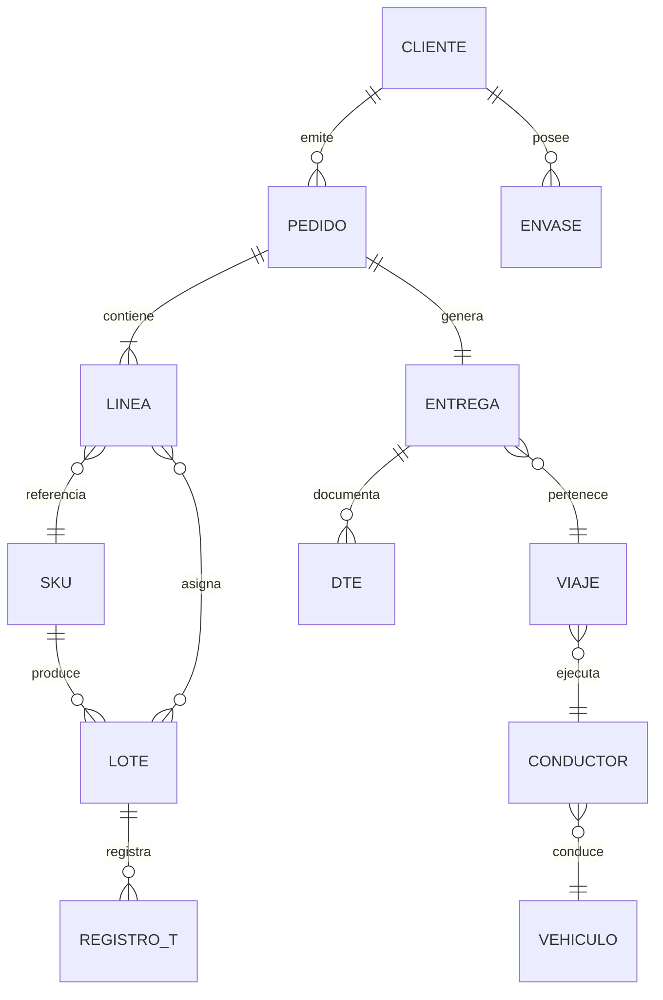

> **Decisiones del caso cerradas en v4 (§8.6):**
> - **16.1 #2 · Unidad de trazabilidad sanitaria = lote del proveedor (GS1: GTIN + lote + vencimiento) como identidad**, enlazado a la **unidad logística (SSCC)** en cada movimiento interno de Puelche. Se descartan caja y pallet como identidad primaria por la volumetría (~9.500 SKU, 2,4 M unidades/mes) y por el estado real de la captura (41 % de recepciones sin lote): el problema es la **captura**, no el nivel de agregación; por eso la recepción exige lectura del lote del proveedor (RF-01), la trazabilidad forward/backward es **evento a evento (GS1 EPCIS, §17D)** y el **retiro sanitario se resuelve < 2 h** (Cap. 18).
> - **16.1 #10 · Control de envases retornables = saldo por cliente** (68.000 canastillos y 9.400 pallets; pérdida 14 % anual). Se descarta el control por unidad identificada: el parque está sin etiquetar y su marcado/lectura es inviable en operación. M8 mantiene la **cuenta corriente por cliente** (RF-08) con cargo/abono por entrega y devolución, y **KPI de reposición** para atacar la merma.

### 8.7 Puntos únicos de falla (SPOF) declarados y mitigados (RT-02.11 · v3)

RT-02.11 exige **declarar** los SPOF (no omitirlos) y su mitigación. No todo SPOF se elimina: se **declara, se monitorea y se mitiga** según criticidad; la ventana 05:30–07:00 opera con **cero indisponibilidad** (§0.2), por lo que ningún SPOF crítico depende de un solo componente físico sin respaldo lógico.

| # | SPOF lógico | Dónde | Mitigación declarada | Respaldo físico |
|---|---|---|---|---|
| 1 | **IdP (Keycloak)** | Capa 7 | IdP maestro en ECS/Fargate multi-AZ + **caché local on-prem TTL 8 h** (autonomía 24 h CD · 14 h terreno, RT-03.10); tokens JWT cortos firmados; break-glass (§11.6) | VM-05/VM-C03 = Keycloak Local Auth Cache (solo lectura) |
| 2 | **Gateway (AWS API Gateway)** | Capa 3 | Multi-AZ administrado (RT-02.10); timeouts por integración (RT-02.08); mamparos (§9.3) | WAF + ALB |
| 3 | **PostgreSQL maestro por sitio** | Capa 6 on-prem | **Autonomía 24 h**: el CD sigue operando sin nube; réplica de continuidad + WAL; PITR 35 días en nube; reconciliación idempotente y auditada (Art. 16.4, §9.1) | 2 réplicas + respaldo WAL |
| 4 | **Mensajería on-prem (RabbitMQ)** | Capa 5 | Colas durables + DLQ; si la cola cae, los **buffers locales de terreno retienen** (UUID) y sincronizan al recuperar (§9.1) | VM redundante |
| 5 | **M11 EDI / AS2** | Capa 5 | DLQ + reintentos; **bandeja de excepciones** operada por actor canónico (RF-12.05); acuerdo de niveles con cadenas (ventana 30 min, RF-12.10) | Colas durables + certificados rotados en **Secrets Manager** |
| 6 | **Planificador de rutas (conocimiento humano)** | Capa 4 (M4) | **Riesgo de conocimiento clave** (§0.4, se jubila en 2 años): ruteo automático < 20 min (Cap. 18) + el planificador valida como actor canónico; matriz de conocimiento cruzado antes de su retiro | M4 + capacitación |
| 7 | **SII / Transbank / GIS (terceros)** | Capas 3/5 | SPOF **externos declarados** (RT-02.11 lo permite): cortacircuitos + colas + degradación elegante (§9.3); POS con **doble captura offline** y rendición posterior (RF-07.06/12) | No aplica (terceros) |

> **Regla SPOF:** los SPOF **críticos** (1–3) tienen redundancia real; los **no críticos** (4–7) se mitigan con colas, cortacircuitos o **procedimiento manual declarado** (RT-03.13 → §9.5). **RTO/RPO comprometido (Art. 20 BA / RT-07.04, v4): RPO ≤ 15 min · RTO ≤ 4 h** sobre el conjunto de la solución, respaldado por replicación continua (CDC/WAL, §10.3, §10.1), Aurora **PITR 35 días** y **DRP us-east-1** (S16); la **ventana 05:30–07:00 opera en cero indisponibilidad** por diseño **activo-activo intra-región (2 AZ en sa-east-1)** — no porque el DR esté activo: el **DRP us-east-1 es activo-pasivo con promoción manual** y **drill semestral (Art. 20 / RT-07.07)**. El detalle físico de respaldos se cierra en S27 (física).

---

## 9. Capa 5 · Integración y eventos (origen: `08` §7)

Capa de **primera clase** (lección de "Pancho"): el caso Puelche se juega en las integraciones (ERP sin interfaces documentadas, EDI 2029, SII, telemetría).

### 9.1 Mensajería asíncrona (RT-02.07)

| Componente | Rol |
|---|---|
| **RabbitMQ** (on-prem por sitio) | Integraciones locales: cobranzas→ERP (RF-07.09), prep→ERP (RF-05.06), EDI, telemetría; colas con retry y DLQ |
| **SQS FIFO + EventBridge** (nube) | Reconciliación y eventos cross-sitio; **orden garantizado por partición**; EventBridge para coreografía inter-módulo |
| **DLQ / retry / dedupe** | Cola de mensajes fallidos, reintento con retroceso (RT-02.08), deduplicación en el consumidor (RT-02.07) |

> **Regla de oro mantenida:** toda escritura offline es **idempotente** (UUID + ventana de deduplicación documentada, RT-02.06); el servidor es la fuente de verdad y resuelve conflictos por **regla de negocio** (no timestamp ciego) — S26. **Toda decisión de reconciliación queda registrada en bitácora (Art. 16.4):** qué transacción, qué conflicto, qué regla se aplicó y por quién — auditable ante el mandante.

> **Compromiso de sincronización (caso RT-03.13 → RT-03.12, v4):** la sync de un dispositivo de reparto tras un **turno completo sin señal no supera 10 minutos**; la del **CD tras un corte de 24 h no supera 2 horas**, resolviendo los conflictos de stock **de forma determinista** (regla de reserva, §9.1; bitácora Art. 16.4). Mecanismo: sincronizadores con **partición y reanudación** (chunking), dedupe por UUID (RT-02.06), **orden por partición** (SQS FIFO, §9.2), acuse por lote (RF-06.07) y métricas de sync en Capa 8 — el umbral se monitorea como SLO (tasa de sync ≥ 99 %, §12.2).

### 9.2 Conexiones con sistemas externos (antigua "Capa 6")

| Sistema externo | Protocolo | Vía | Módulos consumidores |
|---|---|---|---|
| ERP existente (2017, sin documentación de interfaces) | REST / API + colas | **Asíncrono por colas**; síncrono solo lecturas por Gateway | M1, M5, M7 (RF-01.09, RF-05.06, RF-07.09) |
| WMS 2013 (**decisión 16.1 #14 / S29, v4: absorción en M2/M5**) | REST / EDI (legado, solo período de coexistencia) | Colas + API; capacidades absorbidas en M1/M2/M5 (§9.6) | M1, M2, M5 |
| SII / facturación (DTE) | Web service SII | **Síncrono por Gateway** (Capa 3) | M6, M7, portales (RF-12.17) |
| Canal moderno (cadenas) | **EDI (AS2 / API)** | AS2 por colas; API síncrona selectiva | M11 (RF-12.01–12.13) |
| Mapas / rutas / geocercas | API GIS (direcciones, ETA) | **Síncrono por Gateway** | M4, M12 (RF-04.04, RF-14.08) |
| POS móvil / Transbank | API pagos | **Síncrono por Gateway** | M7 (RF-07.06) |
| Notificaciones (SMS/WhatsApp/push) | API notificaciones | Colas (desacoplado del flujo) | M4, M6, M12 (RF-04.06) |
| IAM (Keycloak) | **OIDC / SAML 2.0** | Todas las superficies (SSO, MFA, OTP) | Capa 7 |

> **N5:** la clasificación síncrono/asíncrono define el contrato y el timeout de cada integración: **lo síncrono pasa por la Capa 3 con timeout explícito obligatorio** (RT-02.08); **lo asíncrono por la Capa 5** con DLQ y retry.

### 9.3 Resiliencia (RT-02.08 / RT-02.09)

- Reintento con **retroceso exponencial y jitter**; **cortacircuitos** sobre ERP/Transbank/SII; **mamparos** por integración (un fallo de ERP no degrada preventa).
- **Timeout explícito en toda llamada remota**.
- **Degradación elegante:** si la nube cae, la operación on-prem continúa en modo reducido (autonomía 24 h CD · 14 h terreno) y las apps informan "modo offline" a la persona usuaria; nunca fallo total.

### 9.4 Gobierno de la capa de integración (T-7 Subdoc 4 · Art. 19)

- **Catálogo de servicios de integración** versionado (OpenAPI/AsyncAPI): cada contrato tiene dueño de módulo, semver, estado y **compatibilidad hacia atrás declarada** (RT-02.02).
- **Política de cambio de contrato:** la evolución es **aditiva** primero; los cambios disruptivos requieren aprobación del **Comité de Arquitectura** y plan de migración con doble versión.
- **Gobernanza de eventos:** esquema publicado (AsyncAPI) con propietario del evento y consumidores registrados; **DLQ monitoreada** por SRE (equipo de 4 con soporte del adjudicatario).
- **Aseguramiento:** pruebas de contrato (consumidor-proveedor) y observabilidad por integración (latencia, error, volumen) en Capa 8 — toda integración nueva entra por este marco.

### 9.5 Funciones no disponibles en modo desconectado y procedimiento manual (RT-03.13 · v3)

RT-03.13 exige declarar **qué no está disponible offline** y el **procedimiento manual** de contingencia. Regla general: **lo transaccional crítico de terreno/bodega opera offline (14 h terreno · 24 h CD); lo que depende de la nube o de terceros degrada con procedimiento manual declarado y sin pérdida de datos.**

| Función | Modo desconectado | Procedimiento manual de contingencia |
|---|---|---|
| Consulta de crédito del cliente (RF-03.08/09) | **No disponible** en tiempo real | Preventista lleva **saldo y bloqueos cacheados al inicio del turno** (TTL en la app); la venta queda como **pendiente de validación** y se resuelve en sync (regla de crédito, Cap. 17.1); el pedido no se pierde |
| Disponibilidad de stock (RF-03.03) | **No disponible** en tiempo real | **Stock cacheado por ruta/segmento** al inicio del turno (osatura por preventista); el pedido se toma y la **confirmación definitiva ocurre en sync** con regla de reserva (§9.1, decisión 16.1 #8) |
| DTE / guía electrónica (RF-06.02, RF-07.09) | Emisión offline **no disponible** (SII requiere conexión) | **Captura local de evidencia** (firma/QR/foto, RF-06.11) + datos de guía en el dispositivo; **timbre SII al sincronizar** con folio reservado por dispositivo (rango) — **cero guías de papel** (RF-06.02) |
| Cambio de precio del día (regla 16.1 #9) | Cambio de último minuto **no disponible** | **Tarifa de turno descargada al inicio**; cambios intraturno se aplican al siguiente ciclo; excepción documentada en la bitácora de reconciliación (Art. 16.4) |
| Excursión térmica (decisión de bloqueo) | Detección **sí** (sensor local); resolución central **no** | Protocolo escrito aprobado (Cap. 18): el HHT/sensor **alerta**, el responsable de bodega aplica la regla de bloqueo local y **registra la decisión** para sincronizar; la evidencia queda en el dispositivo (RF-09.05/06/07) |
| EDI canal moderno | **No disponible** (AS2 requiere conexión) | **Fallback manual declarado** (RF-12): pedido vía portal/llamada según acuerdo con la cadena; no es proceso normal — bandeja de excepciones (§8.7 #5) |
| Notificaciones (SMS/WhatsApp/push) | **No disponibles** al momento | **Cola local de notificaciones** con entrega al recuperar señal; el envío es asíncrono por diseño (§9.2), sin pérdida |
| BI / tableros (M10) | **No disponibles** en vivo | Fuente analítica en nube (Capa 6); se declara **no operativo en contingencia** salvo caché de tableros (TTL) en consolas locales |

> **Declaración formal:** ningún proceso de la ventana crítica (despacho 05:30–07:00, §0.2) depende de las funciones de esta tabla; las que afectan terreno tienen **caché de turno + resolución diferida**, y las que afectan cumplimiento tributario/sanitario **registran evidencia local** que se timbra al reconectar (RT-03.12 — sin pérdida de datos). **Tiempos de sync comprometidos (v4): reparto ≤ 10 min · CD ≤ 2 h** tras la reconexión (§9.1) — valores del Cap. 15 del caso (RT-03.13 → RT-03.12).

### 9.6 Contratos de integración formales — OpenAPI 3.1, AsyncAPI 2.6 y control de obsolescencia (RT-05.16/17/18/20 · v3)

| Exigencia | Cumplimiento |
|---|---|
| **RT-05.16** — contratos API formales | API de negocio (Capas 3/4): **OpenAPI 3.1** (REST síncrona) por módulo; eventos (Capa 5): **AsyncAPI 2.6** con JSON Schema versionados; cada contrato con `x-owner` (módulo dueño), semver y estado (draft/stable/deprecated); catálogo servido por el **API Registry** (Amazon API Gateway + portal de desarrolladores interno) |
| **RT-05.17** — obsolescencia | **6 meses de aviso mínimo** antes de deprecar una versión; **doble versión concurrente** durante la migración; cambio disruptivo requiere aprobación del Comité de Arquitectura (§9.4); el registro de deprecaciones es público al equipo |
| **RT-05.18** — autenticación OAuth 2.1 / mTLS | Superficies: **OAuth 2.1** con PKCE; servicio a servicio: **mTLS** (microsegmentación §11); tokens cortos firmados por Keycloak; máquina a máquina con client credentials y secretos rotados en **Secrets Manager** (D13) |
| **RT-05.20** — anticorrupción (ERP 2017 / WMS 2013) | **Capa anticorrupción (ACL)** frente a los legados sin documentación: adaptadores por contrato OpenAPI (de Puelche), mapeo de datos con trazabilidad de excepciones y **estrangulamiento** — las capacidades del ERP 2017 se absorben de a una en M1/M5/M7/M11; el **WMS 2013 se absorbe en M2/M5 (decisión 16.1 #14 / S29, v4)**; tabla "capacidad absorbida" en la matriz de trazabilidad (Cap. 17.1) |

> **Régimen de versionado:** semver estricto (`major.minor.patch`); `major` = breaking (requiere aviso 6 meses), `minor` = aditivo, `patch` = corrección. Toda integración entra por el **gobierno de la capa (§9.4)** con pruebas de contrato consumidor-proveedor.

> **Decisión WMS 2013 (16.1 #14 / S29, v4):** el WMS 2013 **se absorbe en M2 (inventario/recepción) y M5 (preparación/picking)** mediante **estrangulamiento por capacidades** (recepción GS1, slotting, misiones de picking con HHT, conteo cíclico), retirándolo al cierre de la Etapa 1. Justificación fundada: sin documentación de interfaces (mismo déficit que el ERP), no soporta GS1/SSCC ni el **modo offline de la cámara −22 °C**, y su integración persistente encarece la operación sin aportar trazabilidad; los maestros de bodega (SKU, ubicaciones, saldos) se **migran a la BD on-prem del maestro de bodega (§10.1)** con carga verificada (§9.8). El Cap. 19 del caso **delega la decisión al PROPONENTE** — se declara **tomada y fundada** (no requiere consulta al mandante).
> **Contratos de la API de negocio (S28, v4):** OpenAPI 3.1 (síncrona) y AsyncAPI 2.6 (eventos) por módulo con `x-owner`, semver y fecha de obsolescencia — límites de contexto por módulo en §8.4; los contratos formales y sus esquemas se definen en esta subsección (§9.6) y se cierran en la matriz del Cap. 17.1 a partir de este catálogo.

### 9.7 Matriz de integraciones — modo, volumen, ventana y comportamiento ante falla (RT-05.21 + RT-10.08 · v3)

RT-05.21 exige la matriz de integraciones; RT-10.08, el comportamiento ante falla de cada una. Complementa §9.2 (protocolo) con **volumetría, ventana y comportamiento declarados**.

| ID | Integración | Modo | Volumen crítico | Ventana crítica | Comportamiento ante falla (RT-10.08) |
|---|---|---|---|---|---|
| **INT-06** | ERP 2017 (catálogo, stock, cobranzas) | Asíncrona (colas) + síncrona solo lecturas | ~34.000 DTE/mes; cobranzas por turno | Cierre contable diario | **Cortacircuitos**: preventa/reparto no se degradan (§9.3); colas retienen; desajuste declarado en bitácora (Art. 16.4) |
| **INT-03** | WMS 2013 → **absorción en M2/M5** (decisión 16.1 #14 / S29, v4) | Asíncrona (colas) / API solo en coexistencia (Etapa 1) | Misiones de picking nocturno (~120 HHT) | 22:00–06:00 | Fallo del legado → **modo local de bodega** (autonomía 24 h) y absorción adelantada de capacidades; reconciliación auditada |
| **INT-07** | SII (DTE) | Síncrona (Gateway) | ~34.000 docs/mes; pico 05:30–07:00 | Emisión por turno | **No se detiene la entrega**: evidencia local + timbre diferido (§9.5); reintentos con backoff |
| **INT-08** | EDI cadenas (AS2/API) | Asíncrona (colas) | Canal moderno; pico 2029 | Ventana 30 min (RF-12.10) | DLQ + bandeja de excepciones (§8.7 #5); fallback manual declarado (RF-12) |
| **INT-10** | GIS / mapas / ETA | Síncrona (Gateway) | Rutas y geocercas | Planificación diaria | **Caché de mapas por zona** en dispositivos; degradación a ruta offline con secuencia cargada (M4); sin pérdida de la función de entrega |
| **INT-09** | Transbank (POS) | Síncrona (Gateway) | ~1.400 entregas/día | Ventana crítica 05:30–07:00 | **Doble captura offline**: cobro en el POS local, rendición al reconectar (RF-07.06/12); el cobro nunca se pierde |
| **INT-11** | Notificaciones | Asíncrona (colas) | Avisos por turno | Pre-entrega / alertas | Cola local + entrega diferida (§9.5) |
| **INT-13** | Keycloak (OIDC) | Síncrona | Todos los inicios de sesión | 24×7 | **Caché local TTL 8 h** (§8.7 #1, §11) — la operación no se detiene sin nube |
| **INT-15** | Telemetría de flota (solo lectura) | Asíncrona (solo lectura) | ~42 vehículos; ≈ 60.500 msg/día | Operación diurna | **Degradación a ruta planificada sin posición real** ante fallo (D1, no control de jornada) |

> **Total: 15 integraciones (INT-01…INT-15)** conforme al catálogo §9.4 / entregable §4.5. La matriz lista las **externas de negocio**, la **identidad (INT-13)** y la **telemetría (INT-15)**; las integraciones **internas (INT-01…INT-05)** viven en el catálogo de §9.4/§9.6 y quedan fuera de esta matriz.

**Volumetría de mensajería por integración (régimen nominal):** el total en régimen es **≈ 150.000 mensajes/día**, dominado por trazabilidad y telemetría (series de tiempo que **no atraviesan la base transaccional**: entran por el borde y consolidan en la capa analítica, ADR-04). Desglose conforme al entregable §4.5, Tabla 8:

| Integración | Volumen régimen | Peak septiembre | Derivación |
|---|---|---|---|
| Capa anticorrupción ERP (asíncrona) | ≈ 4.700 msg/día | ≈ 9.400 | 1.240 pedidos + 46 recepciones + 1.400 preparaciones + 1.400 evidencias + ≈ 600 recaudaciones |
| Documentos tributarios y acuse (SII, síncrona) | ≈ 2.700 msg/día | ≈ 5.400 | 34.000 docs/mes + acuse, sobre 25 días |
| Eventos trazabilidad GS1 EPCIS | ≈ 52.000 eventos/día | ≈ 104.000 | 260.000 líneas/mes × 5 eventos ciclo, sobre 25 días |
| Telemetría cadena frío (IoT Core) | ≈ 13.200 msg/día | sin variación | 46 fuentes (28 cámaras + 18 termógrafos) × 1 muestra/5 min |
| Telemetría flota | ≈ 60.500 msg/día | ≈ 72.000 | 42 camiones × 1 posición/30 s durante 12 h ruta |
| Sync terreno (colas dispositivo) | ≈ 13.000 escrituras/día | ≈ 26.000 | 1.240 pedidos + 1.400 evidencias + 10.400 confirmaciones prep. |
| EDI canal moderno (Etapa 2) | ≈ 550 msg/día | ≈ 1.100 | 136 pedidos/día × 4 mensajes (pedido, confirmación, aviso, acuse) |
| Notificaciones multicanal | ≈ 2.800 msg/día | ≈ 5.600 | hora estimada llegada y acuse por entrega |
| Autorización pago (POS móvil) | ≈ 500 msg/día | ≈ 1.000 | fracción canal tradicional que migra efectivo a electrónico |
| Servicio mapas y geocodificación | ≈ 200 llamadas/día | ≈ 400 | una corrida ruteo por zona + recálculos incidencia |

> Esta subsección **cierra la dimensión de mensajería de integración del numeral 14.2 del caso** (cierre parcial del hallazgo D1); las demás dimensiones de volumetría siguen pendientes en §20.

> **Regla única (RT-10.08):** toda integración declara su comportamiento ante falla (retry / degradar / diferir / manual) en el contrato; la matriz vive en el catálogo de §9.4 y se verifica con **pruebas de falla por integración** en las marchas blancas.

### 9.8 Carga y descarga masiva de datos (RT-05.22 · v3)

RT-05.22 exige definir el mecanismo de carga/descarga masiva (catálogo inicial, históricos, migraciones periódicas) con volumen, frecuencia y control de calidad.

| Escenario | Volumen | Mecanismo | Control y auditoría |
|---|---|---|---|
| Carga inicial: catálogo e históricos del ERP/WMS | Cientos de miles de registros (SKU, clientes, saldos) | Proceso **ETL/load una vez** por lotes (bulk load) con inserción idempotente por UUID; ventana fuera de operación | Conteo pre/post por lote; conciliación de totales; bitácora de carga (quién, cuándo, lote, resultado); rechazados a cuarentena con reproceso |
| Descarga regulatoria / auditoría | Traza de lote, temperaturas, DTE, geolocalización | **Exportación asíncrona** a archivo (CSV/Parquet) firmado y con checksum (§17B); retención según §10.8 | Registro de la extracción (solicitante, filtro, resultado); control de acceso (RT-16.09) |
| Sync masivo de terreno (turno) | Pedidos, entregas, evidencia (fotos/POD) por turno | Sincronizadores con **partición y reanudación** (chunking) + dedupe (RT-02.06); medios a S3 por objeto | **SLO comprometido (v4): turno completo ≤ 10 min (§9.1)**; métricas de sync en Capa 8 (tasa de éxito, reintentos, volúmenes) |
| Interfaces periódicas con terceros | EDI AS2, aportes SII | Colas con `batch_id` y confirmación por lote | Monitoreo de DLQ; **acuse por lote** en la bandeja de excepciones |

> **Regla:** ninguna carga masiva interrumpe la operación transaccional (ventana de cero indisponibilidad): se ejecuta **fuera de 05:30–07:00** en lotes con seguimiento y reanudación, y **cada carga queda registrada y auditable** (RT-05.22).

---

## 10. Capa 6 · Datos (híbrida) — bases de datos consolidadas (origen: `08` §8, `04` §6)

### 10.1 Entornos de datos

| Entorno | Contenido | Tecnología |
|---|---|---|
| **On-premise por sitio (2 CD Talca/Concepción + 3 cross-dockings)** | Transaccional de bodega y operación local (recepción, inventario, preparación) — **maestro de bodega** (sucesor del WMS 2013, decisión S29/16.1 #14, v4) con autonomía 24 h | **PostgreSQL + PostGIS** local por sitio, con réplica (A-02 física) |
| **Nube (OLTP cloud + réplica/DRP del maestro de bodega)** | Preventa, reparto, BI + réplica/DRP del maestro on-premise (CDC sobre WAL lógico) | **Amazon Aurora PostgreSQL** (no es segundo WMS: réplica/DRP + OLTP cloud) |
| **Ingesta IoT / telemetría en frío** | Lecturas de sensores y termógrafos (cadena de frío, −22 °C offline) | **Amazon DynamoDB** (raw, **TTL 30 días** — N3) + **AWS IoT Greengrass** en borde |
| **Serie consolidada (OLAP)** | Telemetría camiones, series de temperatura (consolidado 5 años) | **S3 Parquet (s3-analytics-parquet) ← AWS Glue ← DynamoDB raw (TTL 30 d)** · consulta **Redshift Serverless** (QuickSight) |
| **Cache / sesiones** | Stock caliente, precios, sesiones SSO, sync offline | **Redis — Amazon ElastiCache (N-07, nube)**. Sin instancia on-premise: la caché de turno vive en el dispositivo y la sesión sin conexión en A-05 |
| **Documentos / adjuntos** | POD firmado, DTE, comprobantes, evidencia QR | **Amazon S3** (object storage/data lake) + caché local |
| **Analítica / BI (consolidada nube)** | OTIF, costo de servir, BI/gerencia, históricos (5 años) | **Amazon Redshift Serverless** (OLAP), alimentado desde **S3 → Glue (ETL) — nunca directo a Aurora** (S19) |

> **Directrices:** multi-sitio (`RF-02.02`): cada CD informa su stock al consolidado; venta con stock en **tiempo real con conexión** y **foto local** sin ella. Trazabilidad de lote forward/backward en todos los entornos (RF-09.01/09.02).

### 10.2 Bases/almacenes lógicos con nombre (estilo "Pancho") — ~15 BD lógicas, no 15 servidores (S18)

| # | BD (nombre propuesto) | Dominio | Guarda | Módulos / RF |
|---|---|---|---|---|
| 1 | **BD_INVENTARIO** | Almacén e inventario | Recepción, ubicaciones, stock por posición, slotting, conteo, lotes | M1, M2 (RF-01, RF-02) |
| 2 | **BD_PREVENTA** | Venta y pedidos | Preventistas, pedidos offline (UUID), stock/crédito, promociones | M3 (RF-03) |
| 3 | **BD_RUTAS** *(PostGIS)* | Planificación y geocercas | Rutas, secuenciación, ventanas, capacidad, geometrías/geocercas | M4, M12 (RF-04, RF-14.08) |
| 4 | **BD_PREPARACION** | Bodega / picking | Misiones de picking, escaneo GS1, faltantes, secuenciación térmica | M5 (RF-05) |
| 5 | **BD_REPARTO** | Despacho y entrega | Guías, POD, QR, firmas, estados, devoluciones en ruta | M6, M8 (RF-06, RF-08) |
| 6 | **BD_COBRANZA_FINANZAS** | Cobranza y cartera | Rendición, cartera de crédito, causales de descuadre, POS, costo de servir | M7, M10 (RF-07, RF-11) |
| 7 | **BD_MAESTROS_CONF** | Maestros y configuración | Catálogo de productos, clientes, bodegas, usuarios, parámetros | transversal (RF-02.01, RF-12.14) |
| 8 | **BD_GOBIERNO_ACCESO** | Seguridad / IAM | Roles, permisos, sesiones, auditoría de acceso, OTP externos | transversal (Keycloak) |
| 9 | **BD_CALIDAD_TRAZABILIDAD** | Calidad y trazabilidad | Lotes, sensor de frío, excursiones, trazabilidad forward-backward, control sanitario | M9 (RF-09) |
| 10 | **BD_TELEMETRIA** *(OLAP: S3 Parquet → Glue → Redshift)* | Flota / series de tiempo (consolidado; raw en DynamoDB) | Posición/velocidad GPS, eventos de ruta, series de temperatura | M12 (RF-14.01/03/04/06/07/08) |
| 11 | **BD_EDI_CANALMODERNO** | Canal moderno EDI | Pedidos EDI (AS2/API), excepciones, ASN, acuses, integración cadenas | M11 (RF-12) |
| 12 | **BD_BI_GERENCIA** *(analítica nube)* | Analítica / reportes | OTIF, costo de servir, ocupación de flota, segmentación, tableros | M10 (RF-11) |
| 13 | **BD_MAILS_NOTIF** | Notificaciones / mensajería | Colas de avisos (SMS/WhatsApp/push), bitácora de envío | M4, M6, M12 (RF-04.06) |
| 14 | **REDIS_SESIONES_CACHE** *(Redis — ElastiCache N-07, solo nube)* | Cache / sesiones | Stock caliente, precios, sesiones SSO, sincronización offline | Capa 4 / Capa 6 apoyo |
| 15 | **S3_DOCS** *(S3)* | Documentos / adjuntos | POD firmado, DTE, comprobantes, evidencia QR | M6, M7, portales |

### 10.3 Retención, respaldo y replicación

- **Retención (valores del Cap. 15 del caso; el caso los rotula RT-05.10, pero el código transversal correcto es **RT-16.10** — RT-05.10 es «catálogo de datos con linaje», Deseable):** registros de temperatura y trazabilidad de lote **5 años** · evidencia de entrega **6 años** · **geolocalización de personas 12 meses** · DTE 6 años. El desajuste de códigos se responde en el T-12 contra RT-16.10 y se eleva como consulta al mandante (Art. 43.3).
- **Respaldo declarado:** Aurora **PITR 35 días** · S3 versionado/Intelligent-Tiering · PostgreSQL on-prem con respaldo diario + WAL.
- **Replicación / parametrización multi-sitio (RT-02.12):** nuevo CD se incorpora por **parametrización topológica** (RF-02.02) sin rediseño: una instancia PostgreSQL por sitio espeja la plantilla del cluster.

### 10.4 Consistencia y posición ante CAP (RT-05.02 · v3)

RT-05.02 exige declarar la posición ante el teorema CAP (consistencia / disponibilidad / tolerancia a partición).

**Decisión: AP con consistencia eventual reconciliada — consistencia fuerte solo donde el negocio lo exige.**

| Clase de dato | Posición CAP | Justificación de negocio |
|---|---|---|
| **Stock / crédito (reserva y validación)** | **CP** (consistencia fuerte) en la ruta síncrona por Gateway; offline el preventista usa **caché de turno** y la reserva se confirma en sync (regla §9.1) | Doble compromiso de stock es el riesgo #1 (decisión 16.1 #8); la regla se aplica en el servidor, no con timestamp ciego (S26) |
| **Pedidos / entregas / POD / cobros** | **AP** con UUID + dedupe (RT-02.06/07): la escritura offline nunca se pierde, se reconcilia | Terreno sin señal 14 h (RT-03.10); exigir consistencia fuerte en terreno = dejar de operar |
| **Trazabilidad de lote / temperatura** | **AP** con **orden garantizado por partición** (SQS FIFO/colas) + deduplicación | El registro continuo es evidencia; el orden por lote se preserva; la lectura consolidada ocurre en la fuente de verdad (servidor) |
| **Configuración / parámetros (RF-02.02)** | **CP** (una versión vigente por topología, RT-02.12) | Un parámetro divergente corrompe inventario; versionado + aprobación (§17B) |
| **Analítica (M10)** | **Eventual** por diseño (separación transaccional/analítico, Cap. 15) | Los tableros leen del almacén con **latencias comprometidas (v4): día ≤ 5 min · cierre ≤ 2 h · gestión ≤ 4 h** (§10.9), nunca del transaccional en vivo |
| **Notificaciones** | **AP** (colas) | Asíncrono por diseño; entrega diferida sin pérdida |

### 10.5 Diccionario de datos y catálogo de activos (RT-05.01 · v3)

RT-05.01 exige diccionario de datos/catálogo documentado. La capa de datos mantiene un **diccionario por base lógica (§10.2)** con formato estándar:

| Campo del diccionario | Contenido |
|---|---|
| Base lógica / objeto | BD_* (§10.2), tabla/vista, esquema |
| Definición de negocio | Significado en Puelche (trazable al RF) |
| Tipo / longitud / nulos / PK-FK | Perfil técnico |
| Linaje y origen | ¿Nace en transaccional (Mx), en integración (Capa 5) o en analítica? |
| Dueño del dato | Módulo dueño (trazable a la matriz Cap. 17.1) |
| Reglas | Regla de negocio asociada (crédito, excursión, envases, FEFO) |
| Retención | Según §10.8 (5 años traza, 6 años POD/DTE, 12 meses geo) |
| Calidad | Regla y umbral de calidad (§10.6, RT-05.04) |
| Sensibilidad | ¿Dato personal? (Ley 19.628 / geolocalización Ley 21.719, RT-11.10) |

> El diccionario se publica en el **catálogo de datos** (activos de datos) con versionado; alimenta la matriz de trazabilidad Cap. 17.1 y habilita el linaje (RT-05.10, Deseable) sobre Redshift Serverless + S3 (§10.2).

### 10.6 Calidad de datos (RT-05.04 · v3)

RT-05.04 (Deseable; se declara **adoptado** para reforzar el T-12) — marco **ISO/IEC 25012**:

| Característica 25012 | Regla aplicada en Puelche | Dónde se verifica |
|---|---|---|
| Exactitud | Conteo cíclico: diferencia **baja de 2,3 % a <1 %** (§0.2); conciliación de saldos por CD | M2/M5, proceso cíclico |
| Completitud | Todo pedido/entrega con UUID y estado; **cero pedidos perdidos/duplicados** (Cap. 18) | Sync (Capa 3) + dedupe |
| Consistencia | Reglas de negocio únicas (crédito, excursión, precio) aplicadas en el servidor; bitácora de reconciliación (Art. 16.4) | Capa 4 + Capa 8 |
| Puntualidad | Sync de turno (≤ 10 min, §9.1); stock cacheado al inicio; analítica día ≤ 5 min · cierre ≤ 2 h · gestión ≤ 4 h (§10.9) | SLO en Capa 8 |
| Integridad (referencial) | FKs y eventos canónicos (§8.6); validación en ACL (§9.6) | Hooks de integridad + pruebas de contrato |
| Trazabilidad | Toda escritura con actor/equipo/dispositivo y timestamp; lote GS1 completo | Registros inmutables (RT-16.07) |

> Las reglas de calidad se declaran en el diccionario (§10.5) y se monitorean con **controles automáticos** (duplicados, saltos de secuencia, totales de conciliación) en Capa 8; el incumplimiento genera tarea en el flujo de excepciones (§17B).

### 10.7 Gestión de datos maestros (MDM) (RT-05.09 · v3)

RT-05.09 exige gestión de datos maestros. Maestros y dueño lógico:

| Dato maestro | Dueño (módulo) | Canonicalidad | Observaciones |
|---|---|---|---|
| **Cliente** | M3 (preventa/ventas) | El **preventista crea/actualiza el maestro en terreno** (RF-03.x); georreferencia al visitar; bloqueo con regla de crédito | Un solo registro por RUT; domicilio normalizado (GIS) |
| **Producto / SKU** | M3 + M2 (bodega) | Catálogo único con GTIN/GS1 y rangos térmicos (RF-09.01) | El lote comparte el mismo maestro |
| **Proveedor** | M1 (compras/abastecimiento) | Maestro único con datos SII y días de entrega | Origen: 180 proveedores del caso |
| **Vehículo / conductor** | M4 (rutas) | Vehículo (42 propios + externos) y conductor (propios/externos, OTP §11) | Sin control de jornada (D1, objeción sindical) |
| **Ubicación (instalaciones)** | M2 (bodega) | Topología CD/cross-docking parametrizable (RF-02.02, RT-02.12, N1) | 2 CD + 3 cross-dockings; nuevos sitios por parámetro |

> **Gobierno MDM:** los maestros se editan por **módulo dueño** y se consumen por suscripción de eventos (Capa 5); toda modificación queda en la **bitácora de auditoría** (RT-16.07) con actor y motivo; alimenta el diccionario (§10.5) y la matriz de trazabilidad.

### 10.8 Retención, eliminación y exportabilidad (RT-05.06/07/08 · Art. 85 · v3)

RT-05.06 (exportabilidad), RT-05.07 (retención/eliminación) y **Art. 85 BA / RT-05.08** (tratamiento de datos personales al término del contrato) exigen una **política de ciclo de vida de datos** explícita.

| Clase de dato | Retención mínima | Eliminación al término del contrato | Exportabilidad |
|---|---|---|---|
| Traza de lote y temperatura | **5 años** (RF-09.x + caso Cap. 15) | Entrega de copia íntegra al mandante; luego purga controlada | Exportación masiva asíncrona firmada (§9.8) |
| POD / evidencia de entrega | **6 años** (vida tributaria) | Ídem | Ídem |
| DTE / documentos tributarios | Plazo legal SII (mín. 6 años) | Custodia legal del mandante; destrucción solo tras instrucción | Ídem |
| Datos personales (clientes, conductores, preventistas) | Mínimo necesario (Ley 19.628) | **Art. 85 BA:** entrega de datos al mandante + **eliminación certificada** al término; directorio actualizado de tratamiento | Ídem + formato interoperable (CSV/JSON, con diccionario §10.5) |
| Geolocalización de personas | **12 meses** (Ley 21.719, RT-11.10) | Eliminación certificada al vencimiento; visibilidad solo operativa (D1) | Ídem con control de acceso (RT-16.09) |
| Logs y observabilidad | Según §12.3 (métricas 13 m · trazas 30 d · logs 12/24 m) | Resumen al mandante; retención solo de lo exigible legalmente | Exportación gestionada |

> **Garantías al mandante (Art. 85):** al término del contrato (o ante solicitud) el proponente entrega **copia íntegra, en formato interoperable y con el diccionario**, de los datos del mandante; la **eliminación es certificada** (registro inmutable del proceso, RT-16.07) y auditable.

> **Históricos de ERP y WMS consultables (RT-05.15, v4):** el catálogo, los saldos y los registros históricos del ERP 2017 y del WMS 2013 se **migran y quedan consultables en modo solo lectura** durante todo el contrato (carga inicial §9.8, retención según esta tabla): el negocio y el mandante acceden al dato histórico sin depender del sistema legado, y la información es exportable bajo el mismo régimen del Art. 85.

### 10.9 Analítica: latencia, autoservicio e informes (RT-05.25–29 · v3)

| Exigencia | Cumplimiento |
|---|---|
| RT-05.25 (información oportuna) | **Latencias comprometidas (v4, valores del Cap. 15 / RT-05.29): operación del día ≤ 5 min · cierre comercial ≤ 2 h · gestión ≤ 4 h** entre transaccional y analítica; alimentación por **eventos incrementales (Capa 5)** con generadores de flujo procesando fuera de la ventana crítica (S19) y series del día en el tablero operacional (§12) |
| RT-05.26 (modelo dimensional) | Hechos (ventas, entregas, stock, costo de servir) y dimensiones (cliente, SKU, tiempo, ruta, canal) en **Redshift Serverless** (esquema estrella); base lógica **BD_ANALITICA** (§10.2) |
| RT-05.27 (autoservicio) | **Self-service BI** con **modelo semántico** (mismo lenguaje de negocio: OTIF, fill rate, costo por entrega — Cap. 17.1); usuarios = Gerencia + Jefes, con **aislamiento y auditoría** de consultas (§17B) |
| RT-05.28 (informes programados y exportación) | Informes **programables** (diarios/semanales/mensuales) + **exportación asíncrona firmada con checksum** (§9.8) desde el portal |
| RT-05.29 (análisis multidimensional) | Drill-down hasta **línea de pedido y lote** (resolución completa de trazabilidad sanitaria; retiro < 2 h, Cap. 18) |

> **Separación transaccional/analítico (Cap. 15):** la analítica no lee del transaccional (evita degradar la ventana crítica); el almacén es la única vía de M10 (BI), alimentado por eventos (Capa 5). **Latencia por capa (v4):** operación del día ≤ 5 min (stream de eventos → tabla de agregados), cierre comercial ≤ 2 h tras el retorno del último camión, gestión ≤ 4 h. El cumplimiento se mide con SLO en Capa 8.

---

## 11. Capa 7 · Seguridad transversal (origen: `08` §9, `04` §8)

Aplicada a **todas** las capas, no como perímetro único.

| Dominio | Componente | Alcance en Puelche |
|---|---|---|
| **Identidad** | **Keycloak** (OIDC/SAML, SSO, MFA) — IdP maestro en ECS/Fargate; perfiles por actor (11 canónicos) | Autenticación de todas las superficies (Capa 1); **caché local on-prem TTL 8 h** para autonomía 24 h sin señal |
| **Acceso externo** | **OTP de un solo uso** sin cuenta corporativa | Conductor externo (RF-06.08, portal transportistas) |
| **App offline** | Token corto + **pinning/MDM opcional**; datos locales cifrados; borrado remoto | Preventa y reparto en terreno sin señal (RF-03.16/06.12) |
| **Secretos** | **AWS Secrets Manager + SSM Parameter Store** (nube), con **rotación automática** y consumo **saliente** desde los nodos on-premise por VPC Endpoint (**D13**; sin gestor de secretos autoadministrado on-premise) | Credenciales ERP, AS2/EDI (certificados), SII, Transbank |
| **Cifrado** | En tránsito **TLS 1.3 / mTLS** · en reposo **KMS** por BD/objeto | Todas las capas |
| **Microsegmentación** | mTLS entre servicios; sin confianza implícita en red interna; WAF en borde | Cliente web ↔ API de negocio ↔ datos |
| **Auditoría** | **Registros inmutables** (RT-16.07), trazabilidad de acciones por actor | Cumplimiento y trazabilidad sanitaria (RF-09) |
| **Detección** | **GuardDuty / Security Hub / CloudTrail** + monitoreo SIEM on-prem; correlación en Capa 8 | Alertamiento de anomalías de acceso |
| **Modelado de amenazas** | **STRIDE** por componente y por integración externa (Art. 21.1: ERP, EDI/AS2, SII, Transbank, GIS/fleet, apps de campo) | Identifica y mitiga amenazas antes de la implementación |
| **Marco de referencia** | **Zero Trust conforme a NIST SP 800-207**: verificación explícita de cada solicitud, privilegio mínimo, presunción de compromiso | Aplica a toda la plataforma; el perímetro no es confiable por defecto |
| **Ley 21.719 (geolocalización)** | Retención **12 meses**, **cifrado a nivel de campo** (RT-11.10), **registro de consultas a datos sensibles** (RT-16.09); la visibilidad de flota **no** se desliza a control de jornada (objeción sindical, L577) | M12 / RF-14 |

> **Modelo de identidad (Modelo B):** autoridad única en nube + **caché local on-prem TTL 8 h** (Keycloak) que sostiene la autonomía 24 h de los CD y los 14 h de terreno en contingencia (RT-03.10).

### 11.1 Identidad y acceso — RBAC + ABAC, segregación y sesiones (RT-12.05/12.06/12.07 · v3)

Detalla el dominio Identidad de §11 (RT-12.x, hasta ahora solo declarado). Modelo: **RBAC por rol canónico + ABAC por atributos de contexto** (instalación, horario de turno, dispositivo).

| Exigencia RT-12.x | Cumplimiento |
|---|---|
| RT-12.05 (roles y permisos) | **RBAC sobre los 11 actores canónicos** (§3.1) + **ABAC** para condiciones: solo instalación asignada, solo horario de turno (05:30–07:00 válido para despacho), solo dispositivo provisto (MDM) — permisos en Keycloak, policies aplicadas en Capa 4 |
| RT-12.06 (segregación de funciones) | **Separación de deberes** en aprobaciones: conciliación ≠ aprobación (M10), bloqueo de excursión ≠ decisión (M9), rendición ≠ cierre contable (M7); nadie que genera un control lo ejecuta (matriz de segregación en la matriz Cap. 17.1) |
| RT-12.07 (sesiones y elevación) | Sesiones **cortas** (web: 8 h máx. con reautenticación; app campo: token corto + pinning); **elevación temporal de privilegios (JIT)** con justificación, ventana limitada (máx. 2 h) y **registro auditado** (RT-16.07); la elevación la aprueba un segundo perfil (break-glass §11.6) |

### 11.2 Ciclo de vida de identidades y aprovisionamiento (RT-12.09 · v3)

- **Aprovisionamiento ≤ 24 h** desde el alta en RR.HH./proveedor: cuenta Keycloak, permisos por rol canónico, dispositivo (HHT/app) enrolado vía MDM (§11.7).
- **Baja inmediata** (mismo día) al término de la relación: revocación de tokens, **borrado remoto del dispositivo** (RF-03.16/06.12), revocación de accesos externos (OTP conductor externo).
- Flujo **desatendido y auditable**: solicitud con aprobación del jefe de área, bitácora de aprovisionamiento y **revisión semestral de accesos** (certificación de identidades) acorde al SGSI.

### 11.3 Perfil operacional de terreno (campo) (RT-12.10 · v3)

- Preventista y conductor **autentican con PIN (o biometría del dispositivo)** al inicio de turno **con conexión** (se descargan credenciales y token corto cifrado); luego operan sin red el turno completo (14 h).
- En terreno **no se usan claves simples**: el PIN desbloquea el token local, no autentica contra el IdP por transacción; los datos locales están cifrados y con borrado remoto (RF-03.16/06.12, §11).
- Conductor externo accede al **portal con OTP de un solo uso** (RF-06.08) — sin cuenta corporativa (§11).

### 11.4 Sesiones web y refresh de tokens (RT-12.12 · v3)

- **Estrategia de tokens unificada (valor único de la propuesta, alineado con D-AL-07):** `id_token` **1 h** · **`access_token` 30 min** · `refresh_token` **30 días, rotativo** con familia y revocación: cada uso de refresh emite uno nuevo e invalida el anterior (reúso detectado = posible robo → reautenticación). *(Hasta v6.1 esta sección declaraba 15 min, en contradicción con la fuente física; corregido en v6.2.)*
- **Token de operación sin conexión, con TTL por perfil de actor:** **8 h** en el turno nocturno de bodega (RNF-13.01) y **14 h** en el turno completo de reparto y en la jornada de preventa (RNF-06.02). Se renueva al inicio de turno con cobertura o contra la caché local A-05, de modo que la ventana sin señal cubre siempre la jornada completa.
- **Identificador de sesión fuera de la URL** (Art. 22): el token viaja en cabecera, nunca en la ruta de la dirección web.
- **Control de sesiones concurrentes:** una sesión activa por actor de terreno; se deniega el inicio concurrente del mismo preventista o conductor en otro dispositivo, con opción de invalidar la anterior.
- Inactividad: cierre a los **30 min** en portales de bodega/consolas; a los **60 min** en superficies de lectura (BI).
- **Cierre global de sesión** (un botón de administración) para contingencia de dispositivo perdido/comprometido.

### 11.5 Acceso de actores externos (cliente y proveedor) (RT-12.11 · v3)

- **Cliente del canal tradicional:** no tiene cuenta; la evidencia y el saldo llegan por el medio que ya usa (WhatsApp / portal de consulta sin cuenta con OTP; RF-04.06/12.17).
- **Transportistas externos (10 empresas, ~160 conductores):** portal con **OTP por operación** (RF-06.08) — el conductor lo registra sin alta corporativa; el contrato de transporte define el alcance (sin control de jornada, D1).
- **Proveedores (180):** acceso acotado vía M1 (órdenes de compra y documentos) con cuenta **restringida por NIT** y aislamiento por proveedor (no ven datos de otros; §17B).

### 11.6 Cuenta de emergencia (break-glass) (RT-12.13 · v3)

- Cuenta **fuera de banda**, custodiada en **sobre sellado con doble firma en la bóveda física de la sala** (recinto de custodia, Sala v02 §4.5) — deliberadamente **fuera de todo sistema en línea**, para que siga siendo utilizable cuando el IdP o el enlace no estén disponibles. Su existencia y su rotación se registran en Secrets Manager como metadato, nunca el secreto.
- Activación: procedimiento escrito, **notificación inmediata a TI y gerencia**, registro en cadena de custodia (RT-16.07); uso solo en la ventana de contingencia; **rotación de credenciales post-uso**.
- La **caché local TTL 8 h** (§8.7 #1) reduce la probabilidad de requerirla; se prueba **dos veces al año** (junto con el drill de DR, Art. 20 / RT-07.07).

### 11.7 MDM de dispositivos (RT-03.18 · v3)

RT-03.18 exige gestión de dispositivos finales. Enrolamiento, política y control de los **HHT/apps de terreno**:

| Capacidad | Alcance |
|---|---|
| **Enrolamiento** | Alta del dispositivo contra el usuario (PIN/OTP) antes del turno; perfil por rol (preventista / preparador / conductor) |
| **Configuración** | Push de políticas: cifrado local, PIN obligatorio, cierre de pantalla, kiosko (app única), actualización de app y de **caché de turno** (saldo, stock, tarifa — §9.5) |
| **Monitoreo** | Estado de sync, batería, versiones de app; alertas en Capa 8 (dispositivo perdido, storage bajo, sync fallido recurrente) |
| **Seguridad** | **Borrado remoto selectivo** (RF-03.16/06.12): datos de la app y caché, sin tocar la información personal del dispositivo; revocación de tokens al borrar |
| **Inventario** | Registro de dispositivos (IMEI/serial), asignación y estado; soporta el dimensionamiento (§8.5: 62 preventistas · ~120 preparadores · ~200 conductores) |
| **Emplazamiento** | **N-13 — MDM gestionado (Android Enterprise / Zebra DNA, SaaS)**, componente con emplazamiento declarado en `Tabla_Emplazamiento_OnPremise_v06.md` §1.0(b) y en el T-11 (**D15**). No es opcional: **RT-03.18 es Obligatorio**. No se administra localmente — el equipo de TI del CLIENTE es de 4 personas (§1 #7) |

### 11.8 Modelado STRIDE por componente y matriz de controles ISO/IEC 27001:2022 (RT-11.02/11.05 · v4)

**RT-11.02 — STRIDE por componente e integración:** cada superficie y cada integración externa modela sus amenazas STRIDE y su mitigación antes de implementar (Art. 21.1). Modelo declarado:

| Componente / integración | Amenazas STRIDE relevantes | Mitigación diseñada | Verificación |
|---|---|---|---|
| Apps de terreno (Kotlin offline) | Spoofing de usuario/HD · Tampering de datos locales · Repudiation de operaciones · DoS por buffer sin control | PIN/biometría + MDM (§11.7) · cifrado local + buffer de escrituras inmutable (RT-16.07) · buffer acotado con monitoreo (RF-03.16/17) | Pruebas de seguridad de app + revisión semestral |
| Gateway (AWS API Gateway, Capa 3) | Spoofing de llamadas · DoS | OIDC PKCE + rate limiting + WAF/CDN (Capa 2) · throttling exponencial (§9.3) | Carga/abuso en marcha blanca |
| API de negocio (Django) | Spoofing · Tampering · Info disclosure · Elevation | OAuth 2.1/mTLS (§9.6) · ORM + validación (injection) · RBAC+ABAC (§11.1) · cifrado de sensibles en reposo | SAST/DAST en pipeline |
| Colas / eventos (RabbitMQ/SQS/EventBridge) | Tampering de mensajes · Repudiation | mTLS + firma de eventos · bitácora de reconciliación (Art. 16.4) | Pruebas de contrato + auditoría |
| BD (PostgreSQL/Aurora/Redshift/S3) | Info disclosure · Tampering | KMS + cifrado en reposo · retención/exportación (§10.8) · auditoría de acceso (RT-16.09) | Controles de acceso + revisión de cifrado |
| ERP 2017 / SII / Transbank / EDI-AS2 | Spoofing · Tampering de datos intercambiados · Repudio de transacciones | mTLS con certificados gestionados en **Secrets Manager/ACM** (§11) · ACL (§9.6) · firmas/checksum en mensajes y exportaciones (§9.8) | Pruebas de falla por integración (§9.7) |
| Telemetría / IoT (Greengrass → DynamoDB) | Spoofing de sensores · Tampering de lecturas | Certificados de dispositivo + borde autenticado · series inmutables | Rol de dispositivo + revisión |

**RT-11.05 — matriz de controles ISO/IEC 27001:2022/27002 (Anexo A):** el catálogo de controles del SGSI se mapea a los dominios de esta capa; abajo los controles Aplicados a la solución, detallados en el plan de seguridad (entregable de T-16 / Art. 21):

| Control ISO/IEC 27001:2022 | Aplicación en Puelche | Evidencia |
|---|---|---|
| 5.15 Control de acceso | RBAC+ABAC sobre 11 actores (§11.1) | Policies de Keycloak + Capa 4 |
| 5.16 Gestión de acceso privilegiado | Break-glass (§11.6), JIT (§11.1) | Procedimiento escrito + bootstrap |
| 5.17/5.18 Autenticación / gestión de identidades | OIDC·OAuth 2.1·MFA, aprovisionamiento ≤ 24 h (§11.2) | Keycloak + MDM |
| 5.19/5.20 Seguridad en relaciones con proveedores | OTP para conductores externos (§11.5); segregación de datos | Contratos + mecanismo OTP |
| 5.23/5.24 Ciberseguridad en la nube | AWS multi-AZ, GuardDuty, WAF, IAM/KMS, IaC (Art. 16) | Configuración de cuenta cloud |
| 5.25/6.8 Seguridad en el desarrollo | SAST/DAST, pruebas de contrato, pipeline CI/CD, code review | Pipeline + repositorio |
| 7.10/7.11 Respaldos y gestión de capacidad | Aurora PITR 35 días, WAL on-prem, CDC; RPO 15 min / RTO 4 h (§8.7) | Drill semestral de DR (Art. 20) |
| 7.12/8.8 Gestión de redes y vulnerabilidades | Microsegmentación mTLS (§11), parches, escaneo | Seguridad Capa 7 + plan de parches |
| 8.10 Eliminación de la información | Retención/eliminación certificada Art. 85 (§10.8) | Registro inmutable (RT-16.07) |
| 8.11 Enmascaramiento de datos | Cifrado a nivel de campo de geolocalización (Ley 21.719) | Validación técnica (RF-14) |
| 8.15/8.16 Registro, monitoreo y SIEM | Registros inmutables (RT-16.07), alertas por síntomas (§12.2) | Capa 8 + correlación |
| 8.17 Relojes sincronizados | NTP en borde, on-prem y nube | Configuración + verificación |
| 8.23 Auditorías de registros | Revisión periódica por el encargado de seguridad (RT-16.09) | Procedimiento de auditoría |

---

## 12. Capa 8 · Observabilidad transversal (origen: `08` §10)

Capa nueva del modelo de 8 capas: formaliza métricas, registros y trazas con correlación en nube y on-premise.

| Dominio | Componente | Detalle |
|---|---|---|
| **Instrumentación** | **OpenTelemetry** (SDK en Django, apps Kotlin, API Gateway, RabbitMQ/SQS, Greengrass) | Trazas y métricas nativas; spans con `transaction_id` propagado desde la Capa 3 |
| **Recolección on-premise** | **Colector ADOT** (F-01: VM-06 Talca, VM-C04 Concepción, contenedor en cross-dock) con **buffer en disco de 24 h** | Único punto de salida de la telemetría on-premise; sostiene la autonomía de 24 h sin perder señal de observabilidad |
| **Métricas** | **Amazon Managed Service for Prometheus (AMP)** — compatible Prometheus/PromQL — + **CloudWatch** | SLO/SLI de los ejes de negocio: OTIF, ventana 05:30–07:00 con cero indisponibilidad, tasa de sync offline, p95 de respuesta (RT-09.01). Retención 13 meses |
| **Registros** | **CloudWatch Logs** (+ archivo en S3) | Logs centralizados de nube y on-prem, **sin puntos ciegos**; 12 meses en línea + 24 en archivo |
| **Trazas** | **AWS X-Ray** | Trazas distribuidas correlacionadas extremo a extremo (Capa 1 → 2 → 3 → 4 → 5/6). Retención 30 días |
| **RUM / apps de campo** | Instrumentación de experiencia real | Detección de fallos de sincronización offline y degradación de apps Kotlin |
| **Alertas** | Reglas de alerta en **AMP/Alertmanager** y alarmas CloudWatch → **SNS/PagerDuty** | Integra con RF-09.05 (excursión térmica) y el "Sistema de monitoreo" (actor no-humano) |
| **Dashboard operacional** | **Grafana OSS** autoadministrado en sa-east-1 (Amazon Managed Grafana no está disponible en la región) | Unifica flota, cadena de frío, sync y OTIF para Jefe de TI y Jefa de calidad |

> **Decisión D14 (2026-09-06, reemplaza a D9):** la observabilidad se construye sobre **OpenTelemetry** y sobre **una sola plataforma**. El on-premise **emite** (colectores ADOT con buffer de 24 h) y la nube **almacena, correlaciona y presenta** (AMP, CloudWatch Logs, X-Ray, Grafana OSS), con correlación por `transaction_id`. *Alternativa evaluada: un conjunto Prometheus + Grafana + Loki autoadministrado en cada centro de distribución — **rechazada** porque constituye una segunda plataforma de observabilidad (RT-03.16 y Art. 16.4 exigen «la misma plataforma que la nube»), porque no tiene VM dimensionada (VM-06 es de 2 vCPU / 4 GB / 50 GB) y porque su operación recae sobre un equipo de TI de 4 personas.*
>
> **Qué se ve durante un corte de enlace.** Es la contrapartida honesta de esta decisión y se declara como tal (RT-03.13): mientras dura el corte, los **tableros centralizados no están disponibles**. Lo que sí opera es (a) el **buffer de 24 h** en disco, que garantiza que no se pierde ninguna métrica, registro ni traza y que el hueco se cierra al reconectar; (b) las **alarmas locales del propio equipamiento** —excursión térmica con señal acústica y luminosa en bodega, sensores de sala al DCIM/BMS (RT-06.14), alarmas del hipervisor y del firewall—, que son las que efectivamente detienen un despacho; y (c) el **bloqueo de despacho por excursión, que es 100 % local** y no depende de ningún tablero. Ninguna decisión de la ventana crítica 05:30–07:00 depende de la observabilidad centralizada.

### 12.1 Tableros para el CLIENTE — la observabilidad se comparte (RT-14.02 · v3)

RT-14.02 exige que la información de la operación esté disponible para el **cliente** (mandante). La Capa 8 define **tres niveles de tableros**:

| Nivel | Audiencia | Contenido | Acceso |
|---|---|---|---|
| **Operacional** | Jefe de TI, SRE, bodega | Ventana 05:30–07:00, sync de terreno, colas/DLQ, excursión térmica, dispositivos (§12) | Portal interno con 2FA |
| **Gerencial** | Gerencia, Jefes | OTIF, costo de servir, fill rate, cumplimiento de frío, pendientes de excepción | Portal BI (M10) |
| **Mandante (cliente)** | Amparo Ossa / representantes de Puelche | **RT-14.02:** tablero de cumplimiento del servicio (OTIF, retiros sanitarios resueltos ≤ 2 h, evidencia de frío, SLAs) — **solo lectura, con auditoría de consultas** | Portal de servicio con cuenta de solo lectura y registro (RT-16.09) |

> El tablero del mandante es **solo lectura y registra cada consulta** (RT-16.09/RT-14.02); no expone datos personales (la geolocalización de personas queda fuera salvo agregados legales).

### 12.2 Alertas por síntomas y sin ruido (RT-14.04 · v3)

| Principio | Implementación |
|---|---|
| **Alertar por síntomas, no por causas** | Umbrales de negocio: OTIF de la ventana, tasa de sync < 99 % con **sync objetivo ≤ 10 min** (§9.1), excursión térmica detectada (RF-09.05), DLQ > 0 en integraciones críticas, **p95 sobre los umbrales del Cap. 15** (picking ≤1 s · entrega ≤2 s · preventa ≤1,5 s · stock/crédito ≤2 s, §17A) |
| **Sin falsos positivos** | Alertas con **ventana de evaluación** (p.ej. 2 muestras en 5 min) y correlación (agrupación por causa raíz); silenciables por el turno con justificación registrada |
| **Escalamiento** | Ruta por criticidad: SRE (equipo de 4) en horario → soporte del adjudicatario en los 56 meses → líder de operación; nada queda sin dueño (RT-14.04) |
| **Enlace con el negocio** | Las alertas operativas disparan tareas en el flujo de excepciones (§17B) con SLA (p.ej. excursión: decisión según RF-09.06) |

### 12.3 Higiene de registros y retención de observabilidad (RT-14.07/08 · v3)

| Práctica | Detalle |
|---|---|
| **Estructura** | Logs **estructurados** (JSON, `transaction_id` propagado desde Capa 3); sin stdout ad-hoc; esquema por servicio |
| **Correlación** | Métricas + trazas + logs correlacionados por `transaction_id` (**D14**, OTel); la ventana crítica tiene **tableros en vivo** mientras hay enlace. Durante un corte rigen el buffer de 24 h y las alarmas locales del equipamiento (D14) |
| **Retención (RT-14.07/08)** | **Métricas: 13 meses** (ciclo anual completo, incluido peak septiembre) · **trazas: 30 días** · **logs: 12 meses caliente + 24 meses archivo** (investigación y cumplimiento); geolocalización de personas: 12 meses (Ley 21.719) — la observabilidad **distingue datos técnicos de datos personales** |
| **Integridad** | **Firma y control de acceso a los registros** (RT-16.07): los registros de auditoría son inmutables; rotación y respaldo declarados (S3/objeto frío) |
| **Anonimización** | PII en logs se **enmascara por defecto** (RUT, teléfono); des-enmascarar requiere motivo y queda auditado |

---

## 13. Stack de herramientas consolidado (origen: `08` §11, `04`/`05`; fuente única de decisión)

> Sustituye el detalle disperso de `04`/`05`. Toda herramienta se justifica contra un RT, una decisión (S16–S20 / D8–D9 / **D13–D15**) o una nota (N1–N5), **y debe tener un componente con emplazamiento declarado en la vista física** (regla de coherencia v6.2, ver nota al pie de la tabla).

| Capa / Componente | Herramienta decidida | Alternativa sólida | Justificación principal |
|---|---|---|---|
| **Backend (12 módulos)** | **Django (Python 3.12)** — monolito modular | Spring Boot | **GeoDjango/PostGIS de primer nivel** (caso GIS-fuerte), un solo lenguaje, admin integrado, ecosistema EDI/telemetría/colas, LTS 56 meses (S20) |
| **Frontend web (portales + consolas)** | **Angular** + Tailwind CSS | React/Next.js | Framework corporativo (TypeScript), OIDC directo (Keycloak), portales con 90 % UI común, LTS Google |
| **Apps de campo (preventa/reparto)** | **Kotlin (Android nativo)** | Flutter · React Native | Nativo del parque Zebra/Android (EC55 · TC58e · MC9400), escáner GS1 vía **Zebra DataWedge**, SQLite/Room offline, acceso nativo a GPS/POS/térmica; un solo SO objetivo (ADR-07) |
| **Borde / CDN / WAF (Capa 2)** | **CloudFront + WAF + Shield** + ALB (nube) · ingreso on-prem con IPS/WAF | Cloudflare · Akamai | CDN, DDoS L3/L4/L7 y TLS 1.3 gestionados; evita fricción de operación al equipo de 4 |
| **Puerta de enlace de servicios (Capa 3)** | **Amazon API Gateway** | Kong Gateway (open source, autoalojado) | **D8 (2026-09-05)**: administrado (sin nodo a operar — equipo TI de 4), WAF/throttling/cuotas integrados, OIDC con Keycloak, trazabilidad por transacción; coherente con la física |
| **BD transaccional** | **PostgreSQL + PostGIS** | MariaDB · MySQL | GIS (rutas/geocercas), JSONB (pedidos offline, EDI), madurez OLTP |
| **BD nube (OLTP + DRP)** | **Amazon Aurora PostgreSQL** | RDS estándar | Compatible PostgreSQL, multi-AZ, failover < 30 s, PITR 35 días |
| **Ingesta IoT / frío** | **Amazon DynamoDB** (+ Greengrass borde) | Cassandra | Escrituras serverless < 10 ms p99, TTL nativo (**raw 30 días**, N3) |
| **Serie consolidada (OLAP)** | **S3 Parquet + AWS Glue + Redshift Serverless** | InfluxDB · motores de series dedicados | OLAP por diseño: DynamoDB raw → Glue → S3 Parquet → Redshift; no motor transaccional ni extensión de PostgreSQL (D2) |
| **Cache / sesiones** | **Redis** — Amazon ElastiCache (N-07, **solo nube**) | Memcached | Cache stock/precios/sesiones SSO. Sin instancia on-premise: la operación desconectada se sostiene con la caché de turno del dispositivo y la caché A-05 del IdP |
| **Mensajería asíncrona (Capa 5)** | **RabbitMQ** (on-prem) + **SQS FIFO/EventBridge** (nube) | Kafka (solo si eventos masivos) | Colas con retry/DLQ; SQS gestionado para reconciliación/ERP |
| **Analítica / BI** | **S3 Data Lake + Redshift Serverless** (+ Glue ETL) | MariaDB analítico | OLAP histórico sin degradar OLTP (S19) |
| **Objetos / documentos** | **Amazon S3** (+ Intelligent-Tiering, Object Lock) | — | POD, DTE, evidencia QR, data lake raw (Parquet) |
| **IAM / Identidad (Capa 7)** | **Keycloak** (OIDC/SAML, SSO, MFA) — IdP maestro en nube + caché local A-05 | Amazon Cognito · Auth0 | Open source sin lock-in, perfiles por actor, OTP externos (D6) |
| **Gestión de secretos (Capa 7)** | **AWS Secrets Manager + SSM Parameter Store** | HashiCorp Vault autoadministrado | **D13 (2026-09-06)**: servicio administrado con rotación automática, sin VM ni licencia adicional y sin operación local para un equipo de 4 (Art. 16.3); los nodos on-premise lo consumen por VPC Endpoint **saliente**, coherente con Zero Trust |
| **Observabilidad (Capa 8)** | **OpenTelemetry/ADOT** (emisión on-prem, buffer 24 h) + **AMP · CloudWatch Logs · X-Ray · Grafana OSS** (plataforma única en nube) | Prometheus/Grafana/Loki autoadministrado on-prem · Datadog · New Relic | **D14**: una sola plataforma para nube y on-premise (RT-03.16, Art. 16.4); AMP es compatible Prometheus, de modo que las reglas y consultas PromQL se conservan sin lock-in |
| **Gestión de dispositivos de terreno (RT-03.18)** | **MDM gestionado — Android Enterprise / Zebra DNA (N-13, SaaS)** | MDM autoalojado on-premise | **D15**: enrolamiento, política, modo quiosco, actualización y borrado remoto selectivo sobre un parque 100 % Android/Zebra; servicio gestionado porque el equipo de TI del CLIENTE es de 4 personas |
| **Contenedores / orquestación** | Docker · **ECS Fargate** (nube) · **Docker Compose** sobre el clúster Proxmox y los mini-PC de cross-docking (on-premise) | EKS · K3s · Nomad | Fargate: sin nodos a operar, FinOps por vCPU/RAM (N2). **On-premise no se opera Kubernetes**: 10 VM y 3 contenedores de borde no lo justifican y su operación excede a un equipo de 4 |
| **Infraestructura como Código** | **Terraform** (multi-zona) + Ansible | Pulumi · CloudFormation | Define zonas, redes y segmentación Zero Trust por código; multi-proveedor |
| **CI/CD** | **GitLab CI** como orquestador del pipeline (repositorio del CLIENTE, RT-03.03) + **AWS CodeBuild** para la etapa de construcción hermética con procedencia **SLSA 3** y firma Sigstore/cosign | GitHub Actions · Jenkins | Entrega de los 12 módulos con pruebas automáticas y compuertas de seguridad (Art. 21.4); la construcción hermética es la que sostiene la declaración de RT-11.24 |
| **Búsqueda de catálogo** | **OpenSearch** | Elasticsearch | Historial EDI y catálogo de productos |
| **Documentación API** | OpenAPI / Swagger | Postman Collections | Contratos de integración explícitos (Capa 3) |
| **Testing** | pytest (backend) · Playwright (web) | Cypress | Cobertura de los 12 módulos |

**Servicios AWS consumidos (resumen):** CloudFront · WAF+Shield · ALB · API Gateway · Aurora · ElastiCache · DynamoDB · S3 · Redshift Serverless · ECS Fargate · Route 53 · Secrets Manager/SSM · KMS · IAM+Organizations · CloudWatch/X-Ray/AMP · Transit Gateway/VPC Peering · SQS · AWS Backup · GuardDuty/Security Hub · CloudTrail · SES/SNS · IoT Core+Greengrass.

> **Nota de coherencia de stack reconciliada (2026-09-04 · 2026-09-05 · cerrada 2026-09-06):** lógica y física usan **Django · AWS · Aurora · ECS Fargate · Redis (ElastiCache) · Keycloak · Angular · Amazon API Gateway · Kotlin (Android) · Secrets Manager/SSM · ADOT+AMP/CloudWatch/X-Ray/Grafana OSS · Docker/Docker Compose on-premise** — **no queda ninguna divergencia de stack entre las dos vistas**. Quedaron fuera, con su motivo declarado: **Laravel** (descartado por decisión del equipo, 2026-09-04), **Cognito** (solo alternativa, D6), **Flutter** y **Kong** (alineación con la física, 2026-09-05), y **HashiCorp Vault**, **Prometheus/Grafana/Loki autoadministrado on-premise**, **K3s**, **Jaeger** y **Redis local** (alineación con la física, 2026-09-06 — ninguno tenía emplazamiento físico ni dimensionamiento declarado, ver D13, D14 y §13).
>
> **Regla que gobierna esta tabla desde v6.2:** *ninguna herramienta puede figurar en el stack lógico si no tiene un componente con emplazamiento declarado en `Tabla_Emplazamiento_OnPremise_v06.md` §1.0.* Es la traducción operativa del Art. 16.2 —que exige justificar el emplazamiento componente por componente— y del Art. 16.4 in fine, que califica de **incoherencia grave** la divergencia entre arquitectura lógica, física y costo.

---

## 14. Decisiones de diseño — ADR (origen: `08` §14, `03` §8; RT-02.04)

| # | Decisión | Detalle / trazabilidad |
|---|---|---|
| D1 | **Telemetría: uso operativo, no control de jornada** *(2026-09-02)* | Integra fuente existente (L268, L594, RT-17.06). Excluidos: cámaras en cabina y control de jornada (L577). Resguardos Ley 21.719 (RT-16.10 · RT-11.10 · RT-16.09). **RF-14.02→supuesto, 14.05→exclusión, 14.09→eliminado.** *Alternativa evaluada: control de jornada/cámaras (rechazada por objeción sindical L577 y por el alcance operativo RT-17.06).* |
| D2 | **Serie consolidada en OLAP (S3/Glue/Redshift) por diseño** *(actualizada 2026-09-05)* | La serie de tiempo **consolidada** (telemetría y temperatura, retención 5 años) es **dato analítico OLAP**, no motor transaccional ni extensión de PostgreSQL: **DynamoDB raw (TTL 30 d) → AWS Glue → S3 Parquet → Redshift Serverless** (QuickSight). *Alternativa evaluada: InfluxDB / motores de series dedicados (rechazados: Aurora/RDS administrados no soportan la extensión y no se opera un motor extra).* |
| D3 | **Modelo de actores: 11 canónicos** *(2026-09-01)* | La arquitectura se construye sobre los 11 canónicos (Capa 1); A1–A16 documentados pero NO integrados (S06/S07). *Alternativa evaluada: set ampliado de 27 actores (A1–A16 + canónicos, propuesta 2026-09-03) — rechazado por roles traslapados; todo RF queda cubierto con 11.* |
| D4 | **Nube AWS + PostgreSQL/Redis (2026-09-02)** | Nube **AWS** multi-AZ (sa-east-1, DRP us-east-1); BD **PostgreSQL + PostGIS** y **Redis** (ElastiCache); **Aurora** para OLTP nube/réplica DRP; DynamoDB IoT; S3+Redshift BI (S16/S17). |
| D5 | **Backend Django (2026-09-03, confirmado 2026-09-04)** | **Django (Python 3.12) monolito modular**; Laravel **descartado** (no es alternativa). Cómputo nube en **ECS Fargate** (N2). |
| D6 | **IAM Keycloak (2026-09-04)** | Keycloak como identidad de negocio (**IdP maestro en ECS/Fargate**); Cognito solo alternativa (`05` §7). On-prem: **caché local offline TTL 8 h** (Modelo B de identidad). |
| D7 | **Híbrido obligatorio + multi-zona + IaC + Zero Trust** *(2026-09-02)* | Bases (Art. 16). On-prem por sitio con autonomía 24 h (RT-03.10: 24 h CD · 14 h terreno). *Alternativa evaluada: solo-nube o solo-on-prem (rechazada por inadmisión contractual, Art. 16).* |
| D8 | **Amazon API Gateway — Capa 3 (actualizada 2026-09-05)** | **Nueva por reformulación 8 capas (RT-02.01); alineada con la física (hallazgo A2).** **Amazon API Gateway** administrado en nube: OIDC con Keycloak, rate limiting, cuotas, versionado, validación de esquema y **trazabilidad por transacción**. Alternativa open source: Kong. |
| D9 | **Observabilidad OpenTelemetry — Capa 8 (2026-09-04)** | **Superada por D14 (2026-09-06).** Se conserva por trazabilidad: fijó OTel como estándar y la correlación por `transaction_id`; su parte de plataforma (Prometheus/Grafana/Loki on-prem) quedó sin emplazamiento y fue reemplazada. |
| D10 | **WMS 2013 se absorbe en M2/M5** *(2026-09-05)* | Decisión 16.1 #14 / S29: **estrangulamiento por capacidades** (recepción GS1, slotting, misiones HHT, conteo cíclico), retiro en Etapa 1; maestros de bodega migrados a la BD on-prem (§10.1). *Alternativas evaluadas: mantener+integrar (rechazada: sin documentación de interfaces, sin GS1/SSCC, sin offline) y reemplazo por WMS de terceros (rechazada: riesgo de implantación y lock-in).* |
| D11 | **Unidad de trazabilidad sanitaria = lote del proveedor + SSCC** *(2026-09-05)* | Decisión 16.1 #2: identidad = **lote GS1 (GTIN + lote + vencimiento)**; la **unidad logística (SSCC)** se enlaza en cada movimiento interno; trazabilidad evento a evento (EPCIS) y **retiro < 2 h** (§8.6, §17D). *Alternativas evaluadas: caja/pallet como identidad (rechazadas por volumetría y captura real), SSCC individual puro como identidad (rechazado por costo de etiquetado).* |
| D12 | **Envases retornables = control por saldo por cliente** *(2026-09-05)* | Decisión 16.1 #10: **cuenta corriente por cliente** en M8 (RF-08) con cargo/abono por entrega y devolución y **KPI de reposición** (68.000 canastillos, 9.400 pallets, merma 14 %). *Alternativa evaluada: control por unidad identificada (rechazada: parque sin etiquetar, costo de marcado/lectura inviable en operación).* |
| **D13** | **Gestión de secretos en servicio administrado** *(2026-09-06 — resolución SEC-01)* | Los secretos de integración (ERP, AS2/EDI, SII, Transbank) y las credenciales de servicio viven en **AWS Secrets Manager + SSM Parameter Store**, con rotación automática; los nodos on-premise los consumen por **VPC Endpoint saliente**, sin abrir puertos entrantes (Art. 21). El secreto de la cuenta de emergencia queda **fuera de línea**, en sobre sellado con doble firma en el recinto de custodia (§11.6). *Alternativa evaluada: **HashiCorp Vault autoadministrado on-premise** — rechazada porque exigía una VM adicional con su alta disponibilidad, respaldo, sellado, licencia y operación local sobre un equipo de TI de 4 personas, contra la preferencia por servicios administrados del Art. 16.3; y porque, tal como estaba declarada, **no tenía emplazamiento físico**, lo que incumple el Art. 16.2.* |
| **D14** | **Observabilidad de plataforma única** *(2026-09-06 — reemplaza a D9)* | **OpenTelemetry** como estándar de instrumentación; **colectores ADOT on-premise con buffer en disco de 24 h** que exportan a una **única plataforma en nube**: **AMP** (compatible Prometheus/PromQL), **CloudWatch Logs**, **X-Ray** y tableros **Grafana OSS** en sa-east-1. Durante un corte, el buffer garantiza que no se pierde telemetría y las decisiones críticas —bloqueo por excursión térmica— siguen siendo locales. *Alternativa evaluada: conjunto **Prometheus + Grafana + Loki autoadministrado por centro de distribución** — rechazada porque constituye una segunda plataforma de observabilidad (RT-03.16 y Art. 16.4 exigen la misma que la nube, sin puntos ciegos), porque no tenía VM dimensionada y porque su operación excede al equipo de 4. Alternativa evaluada: Datadog o New Relic — rechazadas por lock-in y costo.* |
| **D15** | **MDM como servicio gestionado, con emplazamiento declarado** *(2026-09-06)* | La gestión de dispositivos de borde y terreno que exige **RT-03.18 (Obligatorio)** se materializa en un **componente con emplazamiento propio: N-13, MDM gestionado (Android Enterprise / Zebra DNA, SaaS)**, con enrolamiento, política, modo quiosco, actualización de aplicación y de caché de turno, inventario por IMEI/serie y **borrado remoto selectivo**. *Alternativa evaluada: MDM autoalojado on-premise — rechazada por la misma razón que D13 (operación local sobre un equipo de 4) y porque el parque es 100 % Android/Zebra, donde el ecosistema gestionado es el camino nativo.* Hasta v6.1 el MDM se mencionaba de forma transversal **sin componente ni emplazamiento**; desde v6.2 figura en la tabla de emplazamiento y en el T-11. |

---

## 15. Notas de consolidación (origen: `08` §15)

| # | Nota | Detalle |
|---|---|---|
| **N1** | **6 instalaciones, de las cuales 5 alojan cómputo** *(actualizada 2026-09-06)* | El caso define **2 centros de distribución (Talca, Concepción) + 3 plataformas de cross-docking (Curicó, Chillán, Los Ángeles)** como los sitios donde ocurre la operación logística, y la Tabla 14.1 junto a RT-21.16 declaran **6 instalaciones en cuatro regiones**. **Lectura declarada:** las 6 son los 5 sitios operacionales **más la casa matriz y oficinas de Talca** (§2.1 y Cap. 3 del caso), contigua al CD principal; esa sexta instalación se sirve de la red y de los sistemas del CD y **no lleva nodo de cómputo propio**. Por eso el stock multi-sitio de M2 y la topología de datos se declaran sobre **5 sitios**, mientras la cobertura de red, soporte y traslados (RT-21.16) se declara sobre **6**. La divergencia con el §8 del caso («red de cinco instalaciones») se eleva como **consulta (Art. 43.3)** y la topología queda **parametrizable** (RF-02.02, RT-02.12) para admitir la séptima instalación proyectada a 3 años y el eventual CD de Los Lagos hacia 2030. |
| **N2** | **Cómputo nube = ECS Fargate** | Se adopta **Amazon ECS Fargate** (monolito Django + workers + Keycloak), coherente con D6. EKS queda solo como alternativa. |
| **N3** | **DynamoDB = raw TTL 30 días** | DynamoDB es **ingesta raw con TTL 30 días** (GSI por `shipment_id` para consultas de flota); el consolidado de 5 años vive en la **capa OLAP**: S3 Parquet (s3-analytics-parquet) ← AWS Glue ← DynamoDB raw, consultado con **Redshift Serverless** (RT-05.10). S3 raw sigue **5 años inmutable**; retención de trazabilidad de frío = 5 años en ambas piernas (on-prem PostgreSQL + nube S3/Redshift). |
| **N4** | **Redistribución de la antigua capa 4 (Cache/Offline/Mensajería)** | **Nueva por reformulación 8 capas.** Mensajería asíncrona → **Capa 5**; Redis cache/sesiones → **Capa 6**; buffers offline de apps → **Capa 1/2** (borde delgado con sync idempotente por Capa 3). |
| **N5** | **Conexiones externas: síncronas vs asíncronas** | **Nueva por reformulación 8 capas.** Síncronas (SII DTE, Transbank, GIS) por **Gateway (Capa 3)** con timeout explícito; asíncronas (ERP, EDI AS2, telemetría, cobranzas, notificaciones) por **colas (Capa 5)** con DLQ y retry. |

---

## 16. Supuestos y exclusiones (origen: `06` — registro completo S01–S30)

Estados: **Decisión confirmada** · **Supuesto declarado** · **Exclusión declarada** · **Eliminado** · **Supuesto de diseño** · **Pendiente / a validar**.

### 16.1 Alcance, estilo y actores (S01–S09)

| ID | Supuesto | Estado | En una línea |
|---|---|---|---|
| S01 | **Monolito modular en Django** en vez de microservicios | Decisión confirmada | Equipo de 4, escala modesta (~35 TPS base · ~105 TPS de diseño, 35×3), pliegos no imponen microservicios; vía de extracción contemplada (RT-02.02) |
| S02 | **Operación offline como ciudadano de primera clase** | Supuesto de diseño | Preventa/reparto y cámara −22 °C sin señal; condiciona toda la capa de sync y los datos locales cifrados |
| S03 | **Cliente tradicional (11.600) no usa app ni internet** | Supuesto declarado | WhatsApp/SMS + firma/QR del conductor; no puede cambiar su forma de operar |
| S04 | **Híbrido nube + on-premise obligatorio, multi-zona** | Decisión confirmada | Imposición contractual; cada CD con autonomía local y consolidación en nube |
| S05 | **Maestro de bodega local con autonomía 24 h por CD** (sucesor del WMS 2013, decisión S29/16.1 #14, v4); Aurora es réplica/DRP + OLTP | Decisión confirmada (v4) | Aurora no compite por la autoridad operativa de bodega |
| S06 | **11 actores canónicos** como modelo de la maqueta | Decisión confirmada | Ordenada por tipo de actor; set ampliado descartado |
| S07 | **A1–A16 quedan como supuestos a futuro, NO integrados** | Supuesto declarado | Perfiles de bodega, EDI y terceros se gestionan por funcionalidad/portal |
| S08 | **Conductor externo (~160) como "conductor invitado" con OTP** | Supuesto de diseño | Sin cuenta corporativa ni afiliación laboral; menor privilegio |
| S09 | **Proveedores y transportistas como roles de portal de entidad externa** | Supuesto declarado | Gestionados por la operación/Jefe de TI, no actores internos |

### 16.2 Telemetría y geolocalización (S10–S15) — decisión 2026-09-02

| ID | Supuesto | Estado |
|---|---|---|
| S10 | **RF-14.01/03/04/06/07/08 vigentes (uso operativo)** | Decisión confirmada |
| S11 | **RF-14.02 → Supuesto declarado**: telemetría a los 54 camiones externos fuera del alcance comprometido (requiere acuerdo con cada transportista, L655/L875) | Supuesto declarado |
| S12 | **RF-14.05 → Exclusión declarada**: NO se registra tiempo de conducción/descanso desde GPS (control de jornada objetado, L577) | Exclusión declarada |
| S13 | **RF-14.09 → Eliminado**: consumo de combustible no calculable con la fuente (solo posición/velocidad) y roza dimensión mecánica excluida (L594); kilometraje absorbido por RF-14.06 | Eliminado |
| S14 | **Geolocalización de personas** con menor privilegio: retención 12 meses (**RT-16.10**; el caso lo rotula RT-05.10), cifrado a nivel de campo (RT-11.10), registro de consultas (RT-16.09), Ley 21.719. **Queda excluida de la replicación transfronteriza a us-east-1** (Art. 23, ver `Arquitectura_de_Seguridad_v01.md` §10) | Supuesto de diseño |
| S15 | **Dimensión de muestreo de telemetría** a definir → decide la **granularidad de agregación en Glue/Redshift**; no decide el motor (D2) | Pendiente / a validar |

### 16.3 Datos y nube (S16–S20)

| ID | Supuesto | Estado |
|---|---|---|
| S16 | **AWS** multi-AZ (sa-east-1, DRP us-east-1) | Decisión confirmada |
| S17 | **Stack de datos**: PostgreSQL+PostGIS · Aurora · Redis/ElastiCache · DynamoDB · S3 (Parquet) · Glue · Redshift Serverless (series como OLAP; sin motor de series extra) | Decisión confirmada (2026-09-05) |
| S18 | **15 bases/almacenes lógicos con nombre**, separados lógicamente por dominio (no 15 servidores) | Supuesto de diseño |
| S19 | **Separación OLTP/OLAP estricta**: analítica desde S3→Glue→Redshift, nunca directa a Aurora | Supuesto de diseño |
| S20 | **Backend Django (Python 3.12)** como decisión | Decisión confirmada (2026-09-04: Laravel descartado) |

### 16.4 Integraciones, capacidad y pendientes (S21–S30)

| ID | Supuesto | Estado |
|---|---|---|
| S21 | **ERP actual expone REST/API + colas** pero **sin documentación de interfaces** → levantamiento previo | Supuesto declarado |
| S22 | **Canal moderno EDI** (500 puntos) exigencia **enero 2029** vía **AS2/API**, ventana 30 min | Supuesto declarado |
| S23 | **Terceros disponibles**: POS/Transbank, mapas/GIS, notificaciones, **IAM Keycloak** (decisión 2026-09-04) | Supuesto declarado |
| S24 | **Equipo TI de 4 personas**, administrable por ellos o por soporte del adjudicatario (56 meses) | Decisión confirmada |
| S25 | **Volumetría operativa**: 14.200 clientes, 31.000 pedidos/mes → 260.000 líneas/mes, ~35 TPS base · ~105 TPS de diseño (35×3, ventana 05:30–07:00 y peak septiembre) · ≤130 TPS transitorio (sync offline/EDI), 62 preventistas, 42 propios + ~160 externos, ~120 preparadores | Supuesto de diseño |
| S26 | **Maestro de datos por CD con reconciliación en nube**; venta con stock en tiempo real o foto local; idempotencia resuelve conflictos | Supuesto de diseño |
| S27 | **RTO/RPO comprometidos: RPO ≤ 15 min · RTO ≤ 4 h** (Art. 20 / RT-07.04); ventana 05:30–07:00 en cero indisponibilidad (§8.7) | Decisión confirmada (v4) |
| S28 | **Contratos de la API de negocio**: OpenAPI 3.1 / AsyncAPI 2.6 por módulo con dueño, semver y obsolescencia 6 meses (§9.6); límites de contexto por módulo en §8.4; los contratos formales y sus esquemas se definen en §9.6 y se cierran en la matriz del Cap. 17.1 | Decisión confirmada (v4) |
| S29 | **WMS 2013 se absorbe en M2/M5** (decisión 16.1 #14: el Cap. 19 delega al PROPONENTE — no requiere consulta al mandante; fundada en §9.6) | Decisión confirmada (v4) |
| S30 | **Plan de gestión del cambio** para telemetría con el sindicato (aceptación del alcance operativo) | Pendiente / a validar |
| **S31** | **Camión ≠ conductor — reconciliación de la dotación de reparto (2026-09-06).** El caso ofrece tres cifras que parecen contradictorias: **42 camiones propios** (§2.3), **84 «conductores propios y peonetas»** (§2.4) y **«Conductores (42 propios y ≈160 de terceros) ≈ 200»** (Tabla 14.1). Se declara la lectura que las reconcilia sin residuo: los 84 del §2.4 son **una tripulación por camión — 42 conductores más 42 peonetas** —, lo que coincide exactamente con los 42 camiones propios del §2.3 y con los 42 conductores propios de la Tabla 14.1. **Consecuencia de diseño:** el terminal de reparto se asigna **por tripulación (una por vehículo)**, no por persona; el peoneta no porta terminal propio porque manipula carga y opera a una mano junto al conductor (Cap. 3 y RT-13.08). El parque queda por tanto en **42 + reserva** para conductores propios y **≈160 + reserva** para externos, tal como está dimensionado | **Supuesto declarado** · se eleva como consulta al mandante (Art. 43.3) para confirmar la composición de los 84 y el criterio de asignación; si el CLIENTE exigiera un terminal por persona, el parque propio sube de 42 a 84 y el impacto se traslada a la oferta económica |

---

## 17. Vista de procesos (ISO/IEC/IEEE 42010) — flujos críticos de referencia (origen: `08` §13)

> **Vista de procesos (RT-02.03):** flujos end-to-end que cruzan capas y módulos; cada uno nombra su punto de entrada, las capas que atraviesa y su salida/actor. Complementa las vistas lógica (§4–§12), de datos (§10), de seguridad, de integración y de despliegue/física, todas disponibles como documentos propios desde v6.2.

1. **Preventa offline → venta:** preventista toma pedido sin señal (RF-03.02, Capa 1) → app genera UUID (RF-03.16) → **sync por Gateway** (Capa 2→3) → dedupe (RF-03.17) → reserva stock (RF-03.03) → valida crédito (RF-03.08/09, Capa 4).
2. **Reparto → POD → rendición:** conductor entrega, captura firma/QR (RF-06.02/11), cobra POS (RF-07.06) sin señal (RF-06.12) → sincroniza turno (RF-06.07, Capa 3) → gerente de finanzas liquida (RF-07.02) → **colas** ERP (RF-07.09, Capa 5).
3. **Cadena de frío:** sensor registra (RF-09.03/04, Capa 2 IoT) → monitoreo alerta (RF-09.05, Capa 8) → bloqueo del despacho (RF-09.07, Capa 4) → jefa de calidad resuelve (RF-09.06) → evidencia de cumplimiento (RF-09.10).
4. **Canal moderno EDI:** pedido electrónico (RF-12.01, AS2 por Capa 5) → validación/resolución SKU (RF-12.02/03) → ventana 30 min (RF-12.10) → ASN (RF-12.09) → acuse digital (RF-12.13).
5. **Telemetría / flota:** GPS camiones propios (RF-14.01, Capa 2) → monitoreo operativo detecta desviación (RF-14.04) y valida geocercas/ventana (RF-14.08) → kilómetros reales por entrega al costo de servir (RF-14.06) → serie consolidada en OLAP (DynamoDB raw 30 d → Glue → S3 Parquet → Redshift Serverless; D2) → **sin control de jornada ni consumo** (RF-14.05/14.09 fuera de alcance) → resguardos Ley 21.719.

### 17A. Desempeño, capacidad y degradación controlada (RT-09.03/05/08 · RT-10.02 · v3)

**RT-09.03 (crecimiento 3× sin rediseño):** el diseño soporta **3× el volumen pico** del Cap. 15 (septiembre: ~2.600 entregas/día) **sin rediseñar**, solo añadiendo capacidad declarada:

| Componente | Base (pico sept) | 3× sin rediseño | Mecanismo |
|---|---|---|---|
| Gateway (API Gateway + Fargate) | ~105 TPS ráfaga (35×3); ≤130 TPS transitorio | ~400 TPS | Autoscaling horizontal declarado (RT-02.10); servicio stateless (§8.2) |
| API de negocio (Django monolito modular) | 12 módulos | Mismos 12 módulos | Escalado horizontal de réplicas (el estado vive en Capa 6, no en la app) |
| Mensajería (colas) | Volumen pico | Particiones nuevas sin código | SQS FIFO particionable · RabbitMQ con nodos adicionales |
| Datos transaccionales | 2 CD + 3 cross-dockings | +sitios por parametrización (RF-02.02, RT-02.12) | Plantilla de cluster (topología) |
| Analítica | Día ≤ 5 min · cierre ≤ 2 h · gestión ≤ 4 h (v4, §10.9) | Misma latencia con mayor volumen | Redshift Serverless escala el almacén + stream de eventos del día (S19) |
| Terreno | 62 preventistas / ~200 conductores | 3× dispositivos | Misma app + MDM; el sync particiona por tramos (§9.8) |

**RT-09.01 (transacción operacional crítica — P95 comprometido, v4 — valores del Cap. 15):**

| Transacción | Umbral P95 comprometido | Estrategia de cumplimiento |
|---|---|---|
| Confirmación de línea de preparación (picking) | **≤ 1 s** | Lectura local PostgreSQL por CD + HHT GS1 con misión descargada (sin espera de red, §17C); validación de esquema en borde |
| Registro de entrega en el local del cliente | **≤ 2 s** | App Reparto con captura local (firma/QR/foto) y acuse inmediato; sync posterior por turno (RF-06.07) |
| Registro de línea en toma de pedido de preventa | **≤ 1,5 s** | App offline con caché de turno (stock/crédito/precio precargados, §9.5); escritura local y dedupe en sync |
| Consulta de stock y crédito en preventa | **≤ 2 s** | Caché Redis de turno (Capa 6) + lectura síncrona por Gateway solo cuando hay conexión; degradación declarada (§9.5) |

> Estos umbrales son **exigibles al T-12** (RT-09.01) y se verifican con la carga de la ventana crítica (Cap. 14.2 del caso) + pruebas de desempeño en marcha blanca; se monitorean como SLO en Capa 8 (§12.2).

**RT-09.05 (cuello de botella):** el cuello de botella declarado es la **ventana 05:30–07:00** (96 camiones, cero indisponibilidad) con su dependencia síncrona de **DTE y validación de crédito**. Mitigación: **pre-generación de documentos de despacho la noche anterior**, validaciones batch anticipadas (crédito/stock confirmados en el cierre de preparación) y **colas para todo lo no crítico de la ventana** (N5).

**RT-09.08 (degradación controlada sin pérdida silenciosa) — clasificación de servicios (RT-10.02):**

| Clase | Servicio | Degradación controlada (sin pérdida de datos ni de ventas) |
|---|---|---|
| **Crítico** | Despacho 05:30–07:00, entrega, POD/cobro, bodega nocturna, trazabilidad de lote, cadena de frío | Nunca degrada a fallo: operación local + colas + evidencia offline (§9.3, §9.5); si un componente no responde, **fallo transparente con reintento** — la transacción no se pierde |
| **Alto** | Preventa con stock/crédito, ruteo, DTE | Modo reducido **informado a la persona** ("modo offline", caché de turno), resolución diferida en sync; confirmaciones **no silenciosas**: si no pudo confirmarse stock, el pedido queda **pendiente visible** (regla 16.1 #8) |
| **Medio** | EDI 2029, notificaciones, BI | Diferimiento: colas/DLQ + tableros con caché (TTL); sin impacto en operación |
| **Bajo** | Reportes ad-hoc, portales de consulta | Disponibilidad best-effort; se programan fuera de la ventana crítica |

> **Declaración:** ninguna degradación produce **pérdida silenciosa** de una transacción de venta/entrega — si una escritura no llega, queda en buffer local, visible como pendiente y reconciliada (RT-02.06, §9.1). La clasificación anterior es la **oficial (RT-10.02)** para el T-12: cada servicio declara disponibilidad objetivo (ventana crítica 99,9 %; resto 99,5 %) y ruta de escalamiento (§12.2).

### 17B. Módulos transversales: parametrización, flujos, documentos y autoatención (RT-16.x · v3)

**RT-16.01/16.02 (parametrización):** los parámetros operativos (topología RF-02.02, tarifas, reglas de crédito, umbrales térmicos, ventanas EDI) se gestionan **parametrizados y versionados**: cambio en `MASTER_CONFIG` con **aprobación de un segundo perfil** (segregación §11.1) y despliegue por topología (RT-02.12); sin edición directa en producción; cada versión queda **auditada** (quién, cuándo, qué, por qué) en el registro inmutable (RT-16.07).

**RT-16.03/16.04 (flujos de trabajo):** los procesos de excepción (crédito vencido, excursión térmica, local cerrado, rendición con diferencia, excepción EDI, pedido no confirmado por stock) corren en un **motor de workflows transversal** (M9/M10 + **bandeja unificada**): cada tarea tiene **dueño (actor canónico), SLA y prioridad**; el actor ve y resuelve sus tareas desde la misma superficie (Capa 1) con **firma de resolución** y trazabilidad.

**RT-16.05/16.06 (GED y firma electrónica):** gestor documental integrado (S3_DOCS + metadatos): POD, DTE, certificados térmicos, actas de reconciliación y documentos del registro sanitario, versionados y con retención (§10.8); **firma electrónica** conforme al régimen chileno (Ley 19.799 / DTE SII) para acuse, guías y certificaciones — la evidencia capturada en terreno (firma/QR/foto) se **vincula al documento** (S3) y es oponible.

**RT-16.08 (canales de notificación):** **mínimo 3 canales** (WhatsApp/SMS/push, correo, portal de consulta), asíncronas (colas, §9.2), con **preferencia por cliente** y confirmación de lectura en hitos críticos (aviso de entrega, bloqueo, acuse EDI); sin pérdida (cola local + entrega diferida, §9.5).

**RT-16.09 (auditoría de acceso a datos sensibles):** registro de consulta a datos personales (geolocalización, saldos, historial) — quién, cuándo, qué y con qué fin; **revisión periódica** por el encargado de seguridad; la geolocalización con **cifrado a nivel de campo y acceso restringido** (RT-11.10, Ley 21.719) — ya declarado en §11.

**RT-16.10 (búsqueda y exportación global):** búsqueda global indexada (pedidos, entregas, lotes, documentos, actores) con filtros por CD/topología/fecha; **exportación asíncrona firmada con checksum** (§9.8); los informes programables (§10.9) comparten el mismo motor.

**RT-16.11/16.12 (portal y autoatención):** **portal de autoatención** para el canal tradicional (principio #2: el cliente no cambia su forma de operar): consulta de saldo, estado de pedido, catálogo y **registro de pedidos por el propio cliente**, con **aislamiento por tienda** (tenant por cliente) — **objetivo ≥ 30 % de consultas autoatendidas** (métrica declarada); cada pedido autoatendido evita un contacto del preventista/fono y **reducción del costo de servir** (§0.3), cuantificada en la oferta.

### 17C. Movilidad y dispositivos de terreno (RT-17.x · v3)

| Exigencia | Cumplimiento |
|---|---|
| **RT-17.01 (SO móviles)** | Apps de terreno (preventa, reparto, bodega) soportan **la versión vigente y las 2 anteriores** de Android (HHT/tablet/ruteador); iOS en versiones vigentes + 2 anteriores solo si el parque lo requiere — el parque declarado es Android |
| **RT-17.02 (distribución y actualizaciones)** | **Entrega por tienda (MDM §11.7)** con despliegue gradual (canarios: 5 % → 25 % → 100 %); actualización forzada por versión mínima soportada; **rollback automático** si la versión nueva supera el umbral de fallos (Capa 8) |
| **RT-17.03 (almacenamiento y red local)** | App **offline-first**: datos locales cifrados, **buffer de escrituras inmutable** (no se borra hasta acuse del servidor) y **optimización de datos/batería**: caché de turno precargada (saldo/stock/tarifa), sync por tramos, subida de medios comprimida en segundo plano — consumo objetivo **≤ 8–12 MB/turno**, sin procesos en primer plano fuera de turno |
| **RT-17.04 (seguridad del dispositivo)** | PIN + cifrado + kiosko; **borrado remoto selectivo** (RF-03.16/06.12, §11.7); revocación de token al borrar; MDM como servicio gestionado |
| **Dispositivos soportados** | HHT con escáner GS1 (bodega RF-02.x), tablet/ruteador del conductor (GPS + POS + evidencia), smartphone del preventista (LTE + offline) — 62 + ~200 + ~120 dispositivos (dimensionamiento §8.5) |

### 17D. No se propone inteligencia artificial (RT-18 · v3)

**Declaración formal (RT-18): la solución no incorpora componentes de IA/ML** — no es una omisión, es una decisión de diseño fundada:

- **Ruteo:** algoritmo de **optimización determinístico** (VRP con capacidad y ventanas de tiempo, formulación explícita) ejecutado por M4 en **< 20 min** (Cap. 18) — no requiere ML para la escala (31.000 pedidos/mes, 96–260 vehículos) y es **auditable y explicable** para el planificador (conocimiento clave §0.4).
- **Pronóstico de demanda:** método **estadístico clásico** (estacionalidad base + promociones + estacionalidad de septiembre) con revisión del planificador — sin modelos entrenados que oculten la regla (el caso premia explicabilidad).
- **Telemetría / desviaciones (RF-14.04):** reglas de geocercas y ventanas **declaradas por configuración** (no "sospechosas por ML") — evita además fricción con el sindicato (D1).
- **Trazabilidad sanitaria:** evento a evento (GS1 EPCIS, §8.6) — búsqueda binaria y forense, no probabilística.
- **Consecuencia:** no hay entrenamiento, ni drift, ni sesgo que explicar; el **rendimiento es predecible en la ventana crítica** (RT-09.01) y la auditoría de decisiones es completa (RT-16.07). Se declara **N/A fundado** en el T-12 con constancia de que no se omite por desconocimiento sino por diseño.

---

## 18. Diagramas de la arquitectura lógica (set de 13 diagramas, vigente en v4 — fuente canónica: bloques Mermaid de este documento; exportar SVG/PNG a `Diagramas/` para el informe, AGENTS)

Set del modelo de 8 capas, **vigente en v4**: los diagramas representan el modelo completo 8 capas que v3–v4 **refuerzan con secciones nuevas**: modelo de dominio §8.6 (lote GS1 + SSCC), SPOF §8.7 (RTO/RPO), decisiones WMS §9.6–9.7, datos §10.4–10.9, identidad §11.1–11.8 (STRIDE/ISO), observabilidad §12.1–12.3 y transversales §17A–17D.

Inventario del set: contexto · contenedores (8 capas) · módulos (M1–M12) · actores → superficies · vista de procesos (5 secuencias) · datos · integración · seguridad · ubicación lógica híbrida.

### 18.1 Diagrama de contexto

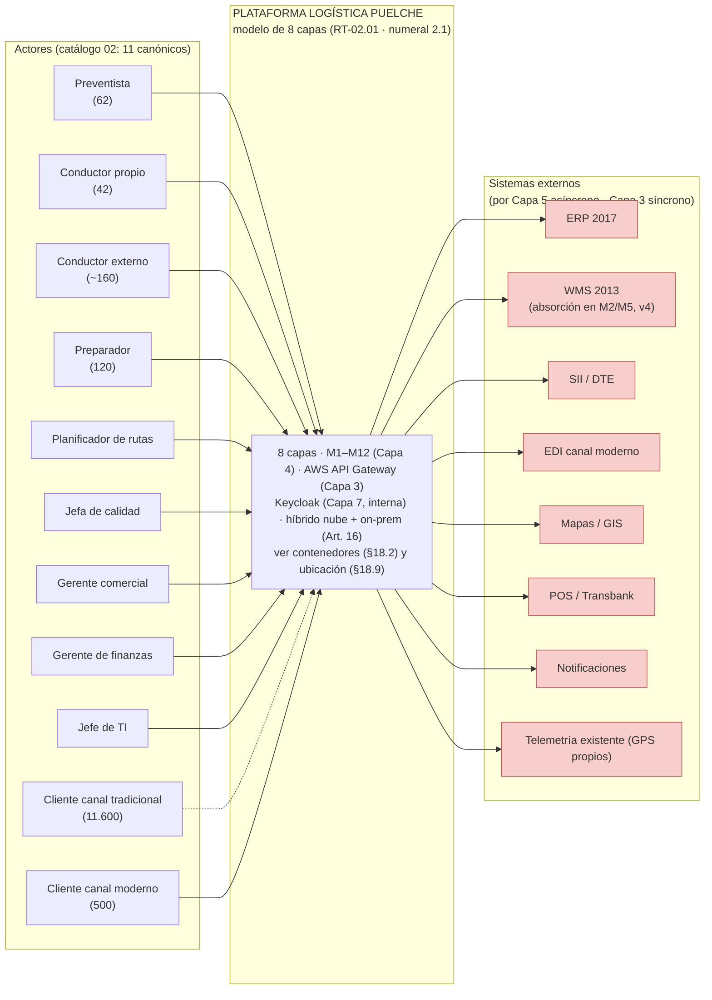

### 18.2 Diagrama de contenedores (8 capas)

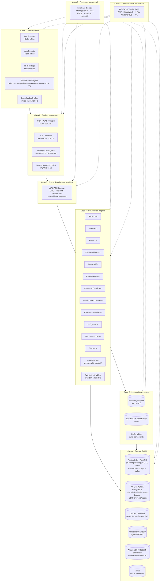

> Diagrama de contenedores (8 capas): fuente canónica en el texto Mermaid de este documento (§18.2); exportado SVG/PNG a `Diagramas/` para el informe (2026-09-04).

### 18.3 Diagrama de datos (vista lógica — subdoc 5)

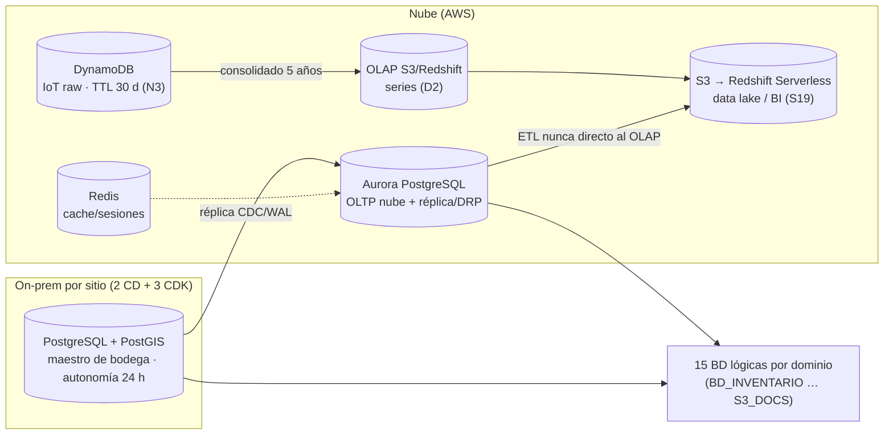

### 18.4 Diagrama de integración (vista de integración — Capa 5 / externos)

**ACL y eventos canónicos:** el ERP 2017 se integra **solo a través de la capa anticorrupción (ACL)** (RT-05.20, §9.6) antes de tocar Capa 3/5; los módulos se acoplan por los **10 eventos canónicos** del catálogo (§9.6, entregable §4.2.5.1) transportados por la Capa 5.

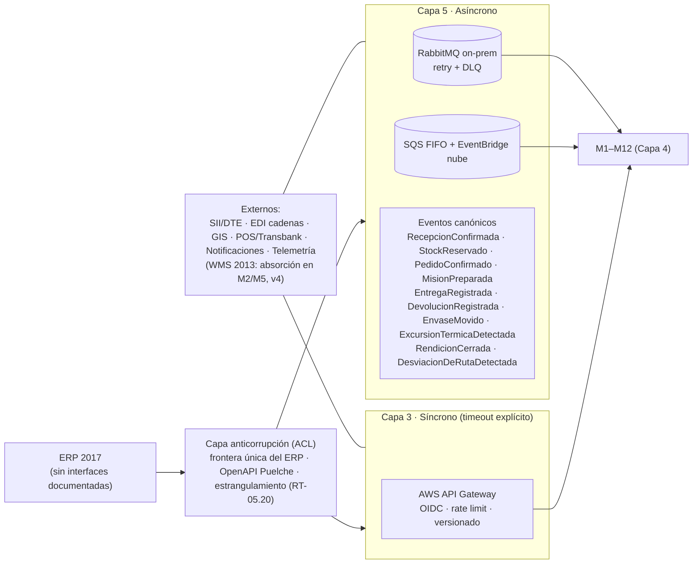

### 18.5 Diagrama de seguridad (vista de seguridad — Capa 7)

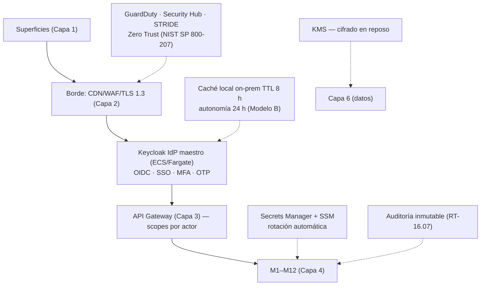

### 18.6 Diagrama de módulos (Capa 4 · dominios y dependencias — orígenes §8.1/§8.4)

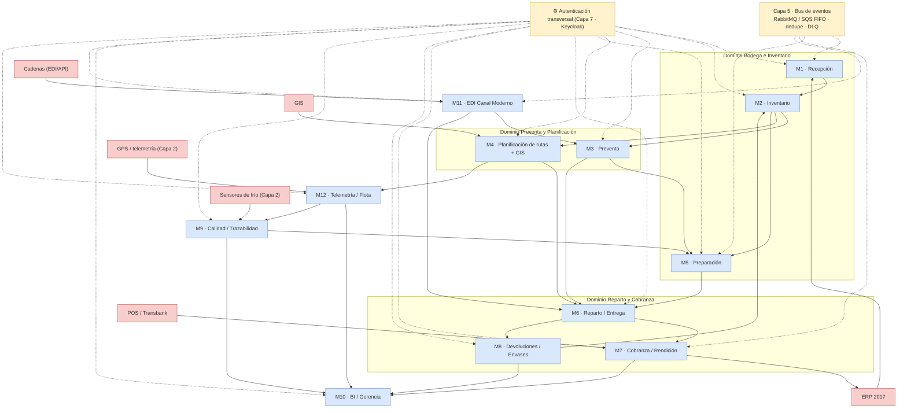

### 18.7 Diagrama de actores → superficies (Capa 1 · §3.1/§5.1)

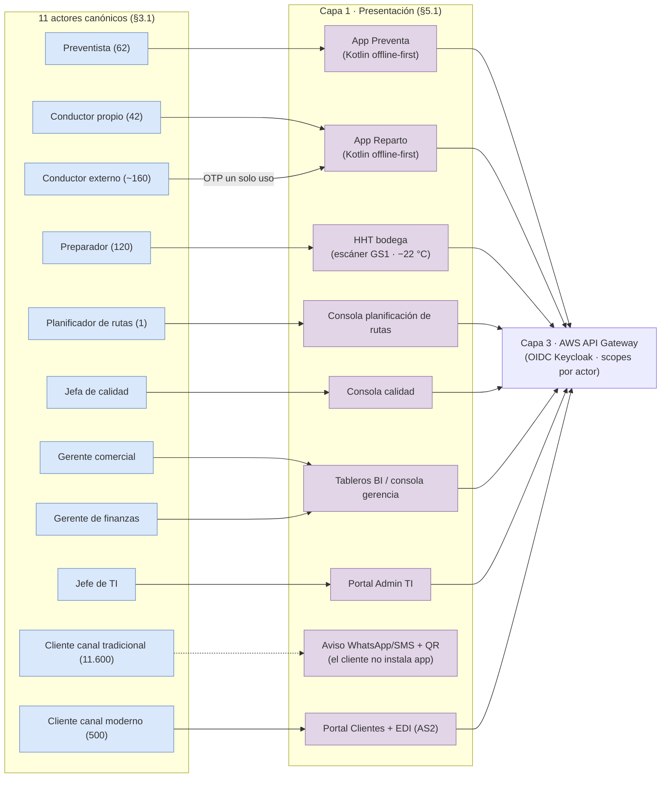

### 18.8 Vista de procesos (origen: §17) — 5 secuencias críticas

#### 18.8.1 Preventa offline (RF-03)

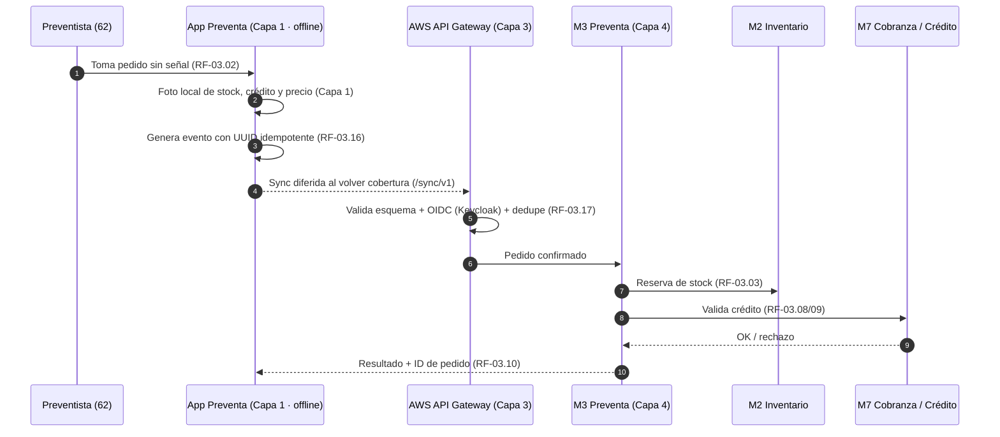

#### 18.8.2 Reparto y POD (RF-06 · RF-07)

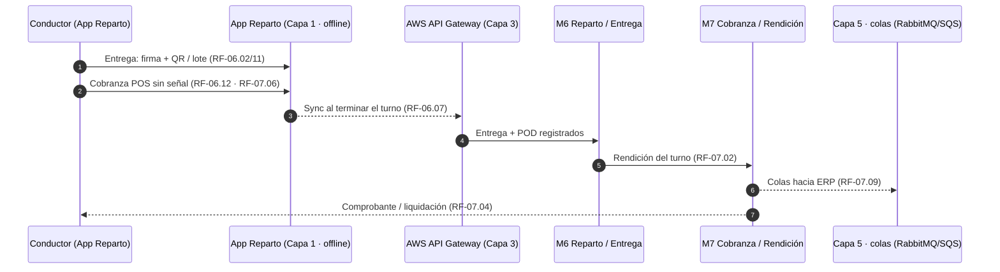

#### 18.8.3 Cadena de frío y calidad (RF-09)

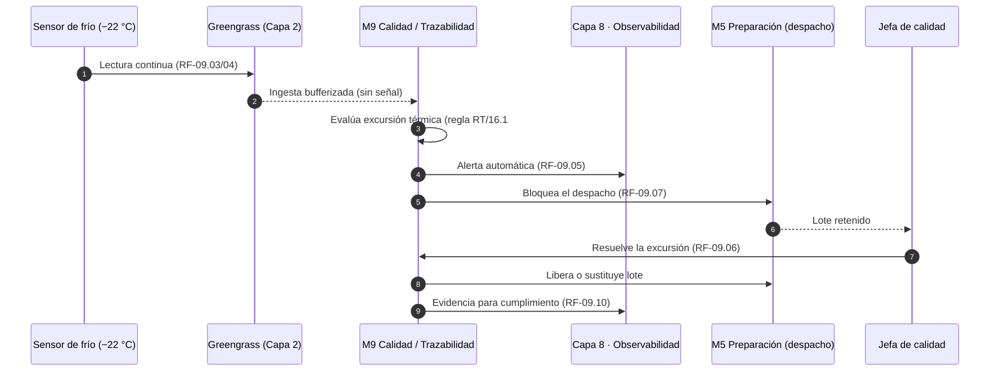

#### 18.8.4 EDI canal moderno (RF-12)

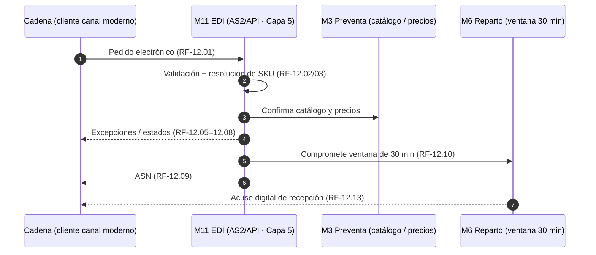

#### 18.8.5 Telemetría de flota (RF-14 · D1)

```mermaid
sequenceDiagram
    autonumber
    participant GPS as GPS existente (camiones propios)
    participant GR as Greengrass (Capa 2)
    participant M12 as M12 Telemetría / Flota (Capa 4)
    participant M4 as M4 Ruta planificada
    participant M10 as M10 BI (costo de servir)
    participant TS as OLAP S3/Redshift (Capa 6 · D2)
    GPS->>GR: Posición / velocidad (RF-14.01)
    GR-->>M12: Ingesta bufferizada al volver cobertura
    M12->>M4: Consulta ruta planificada
    M4-->>M12: Secuencia + ventanas + geocercas (RF-14.08)
    M12->>M12: Detecta desviación (RF-14.04) — uso operativo, sin control de jornada (D1)
    M12->>M10: Kilómetros reales por entrega (RF-14.06)
    M12->>TS: Serie consolidada (raw→Glue→S3→Redshift; D2)
    Note over M12: Sin cámaras en cabina ni consumo de combustible (RF-14.05/09 excluidos).
```

### 18.9 Diagrama de ubicación lógica (híbrido — Art. 16)

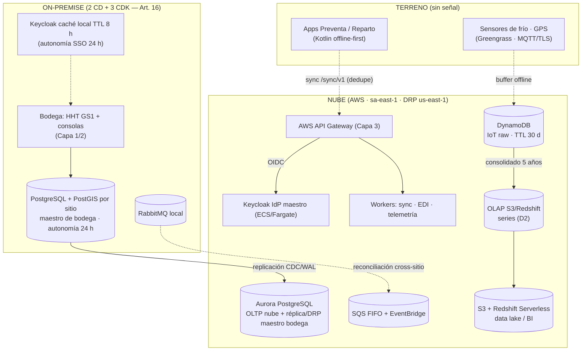

---

## 19. Cumplimiento de la licitación (origen: `05` §9) y trazabilidad

| Exigencia | Cómo la cumple este stack |
|---|---|
| Híbrido cloud + on-premise obligatorio | BD on-prem por CD (maestro de bodega, sucesor del WMS 2013, v4) + analítica/objetos en nube AWS (Capa 6) |
| Multi-zona e IaC | Amazon ECS Fargate multi-AZ + Terraform (AWS y on-prem) |
| Zero Trust | Keycloak OIDC/MFA + mTLS + Secrets Manager/SSM + AWS WAF/IAM/KMS + segmentación por IaC |
| Sin vendor lock-in | Núcleo open source (Django, Angular, PostgreSQL, Redis, RabbitMQ, **Keycloak**) portable; apps de campo **Kotlin nativo Android**; AWS aporta servicios gestionados (incl. API Gateway) sin amarrar el núcleo |
| Descripción de arquitectura (ISO/IEC/IEEE 42010) y marco de gobierno | **TOGAF** declarado (§1 #9); vistas lógica, de procesos (§17), de datos (§10), de seguridad (§11); **ADR fechado y fundado** (§14 → RT-02.04) |
| Mantenible 56 meses por equipo pequeño | Monolito modular + LTS + documentación OpenAPI + servicios AWS gestionados |
| Operación offline 1ª clase | Apps Kotlin offline-first (SQLite/Room + DataWedge) + sync idempotente (UUID + Gateway + dedupe) |
| 5 innovaciones obligatorias | Trazables con arquitectura, EDT y flujo de caja (pendiente de mapear formalmente en matriz) |
| RT-02.11 / RT-02.13 (SPOF y modelo de dominio) | §8.7 (SPOF declarados con mitigación) · §8.6 (modelo de dominio canónico: entidades, relaciones, eventos) |
| RT-03.13 / RT-05.x / RT-10.08 (modo desconectado, contratos, datos, integraciones) | §9.5 (offline + procedimiento manual) · §9.6 (OpenAPI 3.1 / AsyncAPI 2.6, obsolescencia, OAuth 2.1/mTLS, ACL) · §9.7 (matriz de integraciones) · §9.8 (carga masiva) · §10.4–10.9 (CAP, diccionario, calidad 25012, MDM, retención/Art. 85, analítica) |
| RT-12.x / RT-14.x / RT-03.18 (identidad, observabilidad, dispositivos) | §11.1–11.7 (RBAC+ABAC, sesiones, aprovisionamiento, terreno, externos, break-glass, MDM) · §12.1–12.3 (tablero del mandante, alertas por síntomas, retención de observabilidad) |
| RT-09.x / RT-10.02 / RT-16.x / RT-17.x / RT-18 (desempeño, transversales, movilidad, IA) | §17A (3×, cuello de botella, degradación controlada, clasificación de servicios) · §17B (RT-16.x: parametrización, workflows, GED/firma, notificaciones, búsqueda, autoatención) · §17C (RT-17.x movilidad) · §17D (sin IA — N/A fundado) |
| Cumplimiento RT detallado (matriz RT → estado → dónde) | **Anexo A de este documento** (matriz integrada RT→sección) — única fuente de traza RT lógica |

**Trazabilidad módulo ↔ actor ↔ RF:** el cuadro de §8.1 es la columna vertebral — todo RF cae en un módulo y todo módulo tiene al menos un actor canónico responsable (`04`/`08`); alimenta la **matriz de trazabilidad del Cap. 17**. Los 12 módulos son trazables a los 138 RF.

---

## 20. Estado, vigencia y pendientes

| Documento | Rol |
|---|---|
| **`Arquitectura_Logica_v6-2.md` (este)** | **Documento unificado de la capa lógica v6.3** — referencia de lectura única. Incorpora la **alineación íntegra lógica ↔ física del 2026-09-06** (D13, D14, D15, S31, N1 actualizada) y la **coherencia lógica interna resuelta el 2026-09-24** (eventos §8.6 en PascalCase con mapeo canónico · IDs INT-01…15 y telemetría en §9.7 · volumetría de mensajería §9.7 · diagrama §18.4 con ACL). Fuentes previas: 00→08 + auditoría T-7/T-21/T-22 + cierre de RT de las BTT + resolución de la auditoría v3 + resolución de la auditoría BA v4 (H1) + alineación con la física v5.1 (A1/A2) + auditoría BA lógica v5.5 (H1–H3) + **serie de tiempo a OLAP por diseño (D2)** + **unificación TPS con la física** (v5.5.1: ~35 base / ~105 ráfaga 35×3 / ≤130 transitorio)) |
| `Arquitectura_Logica_v5.5.md` | Unificado v5.5 (00→08 + cierre de RT de las BTT + resolución de la auditoría v3 + auditoría BA v4 + alineación con la física v5.1 (A1/A2) + auditoría BA lógica H1–H3) — **superado por v6.1**, conservado para trazabilidad |
| `Arquitectura_Logica_v5.md` | Unificado v5 (00→08 + cierre de RT de las BTT + resolución de la auditoría v3 + auditoría BA v4) — **superado por v5.5**, conservado para trazabilidad |
| `Arquitectura_Logica_v4.md` | Unificado v4 (00→08 + cierre de RT de las BTT) — **superado por v5**, conservado para trazabilidad |
| `Arquitectura_Logica_v3.md` | Unificado v3 (00→08 + auditoría T-7/T-21/T-22) — **superado por v4**, conservado para trazabilidad |
| `Arquitectura_Logica_v2.md` | Unificado v2 (00→08 + auditoría T-7/T-21/T-22) — **superado por v3**, conservado para trazabilidad |
| `Arquitectura_Logica_v1.md` | Unificado v1 (00→08) — superado, conservado para trazabilidad |
| `08_Consolidacion_Arquitectura_Logica_Puelche.md` | Consolidación vigente (8 capas) — fuente de trazabilidad de este documento |
| `07_v1_Consolidacion_Arquitectura_Logica_6capas_Puelche.md` | Consolidación v1 (6 capas) — superada, conservada para trazabilidad |
| `00`–`06` | Contexto, referencia, actores, plan, maqueta, stack, supuestos — fuentes por sección |

**Pendientes de la capa lógica:**

- [x] Modelo de 8 capas (RT-02.01) alineado + diagramas (2026-09-04) · **set completo: 13 diagramas (§18)** — **fuente canónica: bloques Mermaid de este documento**; exportados SVG/PNG a `Diagramas/` para el informe (AGENTS).
- [x] Alineación N1–N3 en `04`/`05` (2 CD + 3 CDK · ECS Fargate · DynamoDB TTL 30 d) (2026-09-04).
- [x] Coherencia de stack reconciliada (Laravel descartado · Keycloak · ECS Fargate) (2026-09-04).
- [x] **Auditoría contra T-7 / T-21 / T-22 + Bases Administrativas (2026-09-04)** → correcciones aplicadas: ADR fechados con alternativa/criterio (§14) · límites de contexto y dependencias inter-módulo (§8.4) · dimensionamiento lógico (§8.5) · TOGAF + ISO 42010 declarados (§1 #9, §19) · NIST SP 800-207 + STRIDE (§11) · vista de procesos formal (§17) · bitácora de reconciliación (§9.1) · gobierno de la capa de integración (§9.4) · set completo de diagramas: contexto, contenedores, módulos, actores→superficies, procesos, datos, integración, seguridad y ubicación (§18.1–18.9). Detalle: registro de auditorías.
- [x] **Auditoría de cumplimiento RT de las Bases Técnicas Transversales (2026-09-05)** → **v3 creada**: RT-02.11 SPOF (§8.7) · RT-02.13 modelo de dominio (§8.6) · RT-03.13 offline + procedimiento manual (§9.5) · contratos e integraciones (§9.6–9.8) · datos completos CAP/diccionario/calidad/MDM/retención/analítica (§10.4–10.9) · identidad completa (§11.1–11.7) · observabilidad con tablero del mandante (§12.1–12.3) · desempeño/transversales/movilidad/sin IA (§17A–17D). Detalle: auditoría de cumplimiento RT v3 y matriz RT en el **Anexo A**.
- [x] **Auditoría v3 (2026-09-05) resuelta en v4** → compromisos numéricos del Cap. 15 (sync ≤10 min / ≤2 h §9.1·§9.5·§9.8; latencias 5/2/4 h §10.9; P95 1/1,5/2/2 s §17A) · decisiones 16.1 #2 (trazabilidad lote+SSCC, §8.6), #10 (envases saldo por cliente, §8.6) y #14 (WMS absorción en M2/M5, §9.6) · RTO/RPO 15 min / 4 h (§8.7, S27) · STRIDE + controles ISO/IEC 27001 (§11.8) · contratos de la API de negocio (S28, §9.6) · históricos ERP/WMS consultables (RT-05.15, §10.8) · matriz RT integrada (Anexo A).
- [x] **Auditoría BA lógica v4 (2026-09-05) resuelta en v5 (H1: traza documental)** → veredicto 0 bloqueantes; se corrigen las 6 referencias a `Auditoria_Arquitectura_Logica_v3.md` (inexistente), apuntando a la **matriz del Anexo A** como única fuente de traza RT lógica. Sin cambios de diseño.
- [x] **Alinear la física consolidada con la decisión lógica de Keycloak** (IdP maestro en ECS/Fargate; VM-05 = caché offline 8 h) — **cerrado**: el documento de nube pasó a Modelo B en su v3.6 y quedó consolidado en D-AL-01/D-AL-02/D-AL-18.
- [x] **Auditoría de coherencia del Subdocumento 4 (2026-09-06) resuelta en v6.2** → **cero divergencias lógica ↔ física**: SEC-01 resuelta con Secrets Manager/SSM (**D13**), observabilidad de plataforma única (**D14**, reemplaza a D9), MDM con emplazamiento propio N-13 (**D15**), `access_token` unificado en 30 min, borde on-premise declarado como firewall/UTM con IPS, eliminación de K3s, Jaeger y Redis local, pipeline unificado en GitLab CI + CodeBuild, retención respondida contra RT-16.10, lectura única de 6 instalaciones con 5 nodos de cómputo (N1) y supuesto **S31** (camión ≠ conductor). Detalle: `AUDITORIA_Coherencia_Subdoc4_v01.md`.
- [x] **Vistas ISO/IEC/IEEE 42010 completas (RT-02.03)** — se incorporan como documentos propios la vista de **integración** (`Arquitectura_de_Integracion_v01.md`) y la de **seguridad** (`Arquitectura_de_Seguridad_v01.md`), que faltaban en el Subdocumento 4.
- [x] **Coherencia lógica interna (2026-09-24) resuelta en v6.3** — eventos §8.6 renombrados a **PascalCase** con mapeo explícito a los **10 eventos canónicos de integración** (dos niveles, §8.6) · referencias S28 corregidas (§16.4/§9.6) · matriz §9.7 con **IDs INT-01…INT-15** y fila de **telemetría (INT-15)** · **volumetría de mensajería por integración (~150.000 msg/día régimen)** en §9.7 · diagrama §18.4 con **ACL y eventos canónicos**. El **numeral 14.2 queda parcialmente cerrado** (solo la dimensión de mensajería de integración del hallazgo D1; las demás dimensiones de volumetría siguen pendientes).
- [ ] **Completar el numeral 14.2 del caso** (volumetría de sistema): 9 dimensiones sin estimar y 3 parciales. Es el pendiente de mayor impacto en la evaluación, porque el caso declara que las celdas vacías se evalúan como dimensionamiento no realizado.
- [x] RTO/RPO (S27): **confirmado en v4 — RPO ≤ 15 min · RTO ≤ 4 h** (§8.7; Art. 20 / RT-07.04).
- [x] Contratos de la API de negocio (S28): **cerrado en v4** — OpenAPI 3.1 / AsyncAPI 2.6 por módulo, dueño, semver y obsolescencia 6 meses (§9.6); matriz formal con la trazabilidad del Cap. 17.1.
- [x] WMS 2013 (S29): **decisión tomada en v4** — absorción en M2/M5 fundada (§9.6); no requiere consulta al mandante (Cap. 19 delega al PROPONENTE).
- [x] **Promoción a v6 (2026-09-05) y renombrado a v6.1:** archivo `Arquitectura_Logica_v6-2.md`; consolida la actualización D2 (serie de tiempo a **OLAP por diseño**) y la unificación TPS con la física (v5.5.1). Sin cambios de contenido; tabla §20 y encabezado actualizados.
- [ ] Plan de gestión del cambio de telemetría con el sindicato (S30).
- [ ] Pasar a PDF (texto) + XLSX (tablas) si se requiere formato derivado.

---

*Documento unificado de la capa lógica **v6.1** — 2026-09-05 · Supera a `Arquitectura_Logica_v5.5.md`; incorpora la alineación con la arquitectura física (v5.1, A1/A2), la serie de tiempo a **OLAP por diseño** (D2) y la unificación TPS con la física (v5.5.1). Ver auditorías.*
*Actualización 2026-09-05: set completo de 13 diagramas (§18) — fuente canónica Mermaid en este documento; exportados a `Diagramas/` para el informe (AGENTS). Promoción a **v6.1** (archivo `Arquitectura_Logica_v6-2.md`) sin cambios de contenido.*
*Actualización 2026-09-24: **v6.3** — coherencia lógica interna (eventos PascalCase §8.6 · S28 §16.4/§9.6 · IDs INT §9.7 · volumetría §9.7 · ACL/eventos §18.4).*

---

## Anexo A — Matriz de cumplimiento RT → sección (integra la traza documental que v3 remitía a archivos inexistentes; H1)

> Esta matriz es **la fuente de la traza RT de la capa lógica** (T-12). Estado: **C** = Completo · **D** = Deseable adoptado. La acreditación queda integrada en esta matriz (única fuente de traza RT lógica).

| RT (BTT) | Materia | Estado | Dónde en v6 |
|---|---|---|---|
| RT-02.01 | Modelo de 8 capas | **C** | §2, §18.1–18.9 |
| RT-02.02 | Modular, límites de contexto, evolución aditiva | **C** | §8.1–8.4, §9.4 |
| RT-02.03 | Vista de procesos | **C** | §17 |
| RT-02.04 | ADR fechado/fundado | **C** | §14 (**D1–D15**) |
| RT-02.05 | Servicios de negocio stateless | **C** | §8.2 |
| RT-02.06 | Idempotencia | **C** | §9.1 |
| RT-02.07 | Eventos ≥1 vez + dedupe + orden | **C** | §9.1 |
| RT-02.08 | Resiliencia | **C** | §9.3 |
| RT-02.09 | Degradación elegante | **C** | §9.3, §9.5 |
| RT-02.10 | Autoescalado | **C** | §8.3, §17A |
| RT-02.11 | SPOF declarados/mitigados | **C** | §8.7 |
| RT-02.12 | Replicación/parametrización | **C** | §10.3 |
| RT-02.13 | Modelo de dominio | **C** | §8.6 |
| RT-02.14 (D) | Anticorrupción/estrangulamiento | **D** · **C** | §9.6 |
| RT-03.10 | Autonomía offline 24 h CD / 14 h terreno | **C** | §6, §9.5, §17C |
| RT-03.12 | Sync + reconciliación determinista + bitácora | **C** | §9.1 — **≤10 min reparto / ≤2 h CD (v4)** |
| RT-03.13 | No disponible offline + procedimiento manual | **C** | §9.5 |
| RT-03.18 | MDM dispositivos | **C** | §11.7 — componente **N-13** con emplazamiento declarado (D15) |
| RT-04.01 | 5 ambientes + DR | **C** | §1 (principio 6), §13, §18.9 — **detalle de despliegue en la física** |
| RT-05.01 | Diccionario de datos | **C** | §10.5 |
| RT-05.02 | Posición CAP | **C** | §10.4 |
| RT-05.04 (D) | Calidad ISO/IEC 25012 | **D** · **C** | §10.6 |
| RT-05.09 | MDM de datos maestros | **C** | §10.7 |
| RT-05.15 | Históricos consultables | **C** | §10.8 (históricos ERP/WMS, v4) |
| RT-05.16/17 | Contratos API + obsolescencia | **C** | §9.6 (S28, v4) |
| RT-05.18 | OAuth 2.1 / mTLS | **C** | §9.6, §11 |
| RT-05.20 | ACL | **C** | §9.6 |
| RT-05.21 | Matriz de integraciones | **C** | §9.7 |
| RT-05.22 | Carga/descarga masiva | **C** | §9.8 |
| RT-05.25 | Retención/eliminación/Art. 85/exportabilidad | **C** | §10.8 |
| RT-05.27/28 | MDM cliente/producto/corporativo | **C** | §10.7 |
| RT-05.29 | Latencia analítica | **C** | §10.9, §10.4, §10.6 — **día ≤5 min · cierre ≤2 h · gestión ≤4 h (v4)** |
| RT-07.03/07.04 | RTO/RPO | **C** | §8.7, S27 — **RPO ≤15 min / RTO ≤4 h (v4)** |
| RT-09.01 | P95 transaccional crítico | **C** | §17A, §8.5, §12.2 — **picking ≤1 s · entrega ≤2 s · preventa ≤1,5 s · stock/crédito ≤2 s (v4)** |
| RT-09.03/05/08 | 3× sin rediseño · cuello de botella · degradación controlada | **C** | §17A |
| RT-10.02/10.08 | Clasificación de servicios / comportamiento ante falla | **C** | §17A, §9.7 |
| RT-11.01 | Zero Trust NIST SP 800-207 | **C** | §11, §19 |
| RT-11.02 | STRIDE por componente/integración | **C** | §11.8 (v4) |
| RT-11.05 | Controles ISO/IEC 27001/27002 | **C** | §11.8 (v4) |
| RT-12.05–12.13 | Identidad completa | **C** | §11.1–11.6 |
| RT-14.02/14.04/14.07–08 | Tablero mandante · alertas por síntomas · retención observabilidad | **C** | §12.1–12.3 |
| RT-16.07 | Auditoría de acceso a datos sensibles | **C** | §11, §10.8 |
| RT-16.10 | Retención histórica / auditoría | **C** | §10.3, §10.8 |
| RT-16.11–16.14 | Parametrización · workflows · bandeja unificada | **C** | §17B |
| RT-16.x | GED/firma · notificaciones · búsqueda · autoatención | **C** | §17B |
| RT-17.x | Movilidad y periféricos offline | **C** | §17C |
| RT-18 | Sin IA (N/A fundado) | **C** | §17D |

**Caso 02 — decisiones del num. 16.1 resueltas en v4:** #2 trazabilidad = lote GS1 + SSCC (§8.6) · #10 envases = saldo por cliente (§8.6) · #14 WMS 2013 = absorción en M2/M5 (§9.6). Resto de decisiones del numeral en el registro de decisiones del Cap. 17.1.

---

*Documento unificado de la capa lógica **v6.3** — 2026-09-24. Cierra la coherencia lógica interna del 2026-09-24 (eventos §8.6 en PascalCase con mapeo a los eventos canónicos · IDs INT-01…15 y telemetría en §9.7 · volumetría de mensajería §9.7 · diagrama §18.4 con ACL) y mantiene la auditoría de coherencia del Subdocumento 4: **no queda ninguna divergencia entre la arquitectura lógica y la arquitectura física**. Toda herramienta declarada en el stack (§13) tiene un componente con emplazamiento justificado en `Tabla_Emplazamiento_OnPremise_v06.md` §1.0, conforme al Art. 16.2 y al Art. 16.4 in fine.*