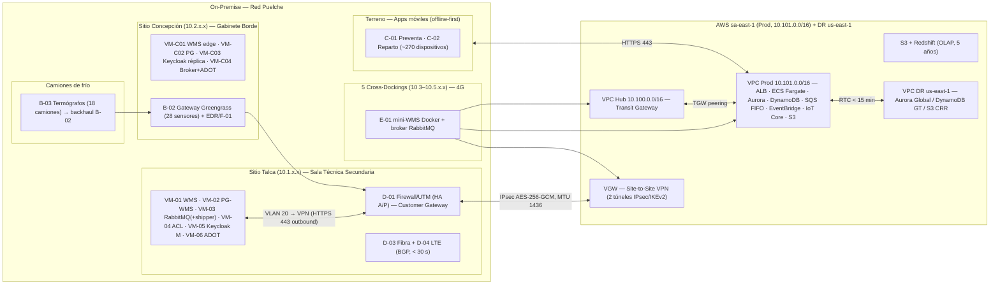

# ARQUITECTURA FÍSICA HÍBRIDA CONSOLIDADA — Caso 02 Logística (Distribuidora Puelche S.A.)

**Documento:** Arquitectura Física Híbrida Consolidada — Caso 02 — v01.0  
**Licitación:** TFEP-01/2026 — Subdocumento 3 (Informe 1)  
**Proponente:** *(empresa proponente pendiente de definir)*  
**Última actualización:** 04-09-2026

---

## 1. Objetivo y lectura del documento

Este documento consolida en **una sola arquitectura física** los dos dominios que operan como sistema único: la **carga principal en nube pública AWS** (Art. 16 de las Bases Administrativas) y los **componentes on-premise** que distribuyen la operación de la Distribuidora Puelche S.A. (5 sitios: Talca, Concepción, Curicó, Chillán y Los Ángeles, más 5 cross-dockings).

Es la **fuente única consolidada** de la arquitectura física híbrida. Los documentos de origen —`Propuesta_Arquitectura_Cloud_Caso02_CLAUDE_v2.md` (v3.2), `Dimensionamiento_Infraestructura_OnPremise_v03.md` (v03.2) y `Tabla_Emplazamiento_OnPremise_v04.md` (v04)— se declaran alineados por referencia a este documento; cualquier divergencia se resuelve con este archivo.

**Cómo leerlo:** §3 define el inventario único de componentes; §4 la topología de red; §5 las **costuras de integración** (los puntos exactos donde el dominio on-premise y el dominio cloud se tocan); §6 a §10 consolidan identidad, datos, HA/DRP, observabilidad y ambientes; §11 resume la trazabilidad normativa; §12 registra cada decisión de alineación tomada para lograr la consistencia 100 %.

---

## 2. Principios de diseño híbrido consolidado

| Principio | Declaración | Base |
|---|---|---|
| **Hibridación obligatoria y equilibrada** | Carga principal en nube pública; on-premise solo donde la latencia, la criticidad operacional o la ausencia de señal lo exigen (bodega −22 °C, preventa/reparto rural, sensores industriales). | Art. 16.1-16.2 |
| **Un solo sistema, dos dominios** | Una única imagen Docker de Django en dos modos: `MODE=full` (cloud: todos los módulos) y `MODE=wms_only` (on-premise: solo bodega). | Cloud v3.1 §1/§3.1 |
| **Autonomía local 24 h** | Cada CD (Talca, Concepción, cross-dock) opera su broker de colas RabbitMQ (A-03) y sus bases PostgreSQL locales cuando el enlace WAN no está disponible. | RNF-13.01, RT-03.10 |
| **Zero Trust end-to-end** | Sin conexiones entrantes a la red on-premise salvo dos excepciones controladas por la VPN (DMS→PostgreSQL y celery-erp-sync→ACL; ver D-AL-05). Todo lo demás es tráfico iniciado desde adentro. | Cloud v3.1 §5, On-prem v03.1 §3 |
| **Durabilidad y retención** | Telemetría 5 años (DynamoDB 30 días → TimescaleDB + S3 raw 5 años); documentos 6 años; auditoría 7 años; logs de seguridad 12 meses en línea + 24 en archivo. | RT-05.10, RT-16.10, Art. 21.3 |
| **Disponibilidad y DRP** | SLA ≥ 99,9 % capa cloud central; DRP global RTO ≤ 4 h / RPO ≤ 15 min; DRP local (Talca → Concepción) para la capa logística. | BTT Cap. 10, Art. 20 |

---

## 3. Inventario único de componentes (nube + on-premise)

### 3.1 Núcleo logístico

| ID | Componente | Emplazamiento | Instancia nube | Instancia on-premise |
|---|---|---|---|---|
| A-01 | Motor WMS (recepción, picking FEFO, misiones RF, despacho, SSCC GS1) | **On-premise (maestro)** + nube (DRP) | Módulo `wms_only` en Aurora como réplica de continuidad (DMS CDC) | **VM-01** Talca (maestro, 8 vCPU/16 GB), **VM-C01** Concepción (edge autónoma), **E-01** cross-docks (mini-WMS, contenedor Docker ~1 vCPU/2 GB) |
| A-02 | Base de datos transaccional WMS (PostgreSQL + PostGIS + TimescaleDB) | **On-premise** + nube (réplica/OLTP cloud) | Aurora PostgreSQL: OLTP de módulos cloud + réplica DRP del WMS | **VM-02** Talca (8 vCPU/32 GB, 1,5 TB), **VM-C02** Concepción, BD local cross-dock |
| A-03 | Broker de colas offline (RabbitMQ) | **On-premise** (+ nube coordinada) | SQS FIFO (reconciliación/ERP) + EventBridge (eventos de negocio) | **VM-03** Talca (capacidad ~3 M mensajes), **VM-C04** Concepción, broker cross-dock (E-01) |
| A-04 | Capa anticorrupción (ACL) de acceso al ERP | **On-premise** | `celery-erp-sync` (cloud) consume contratos OpenAPI vía la ACL por VPN | **VM-04** Talca |
| A-05 | Keycloak — IdP maestro | **Híbrido** | Keycloak Replica ECS Fargate (1 vCPU/2 GB, 2 tareas Multi-AZ en peak, backend Aurora) | **VM-05** Talca (master, todas las escrituras) + **VM-C03** Concepción (réplica de solo lectura; promoción controlada en DRP local) |

### 3.2 Cadena de frío e IoT industrial

| ID | Componente | Emplazamiento | Instancia nube | Instancia on-premise |
|---|---|---|---|---|
| B-01 | Sensores industriales (temperatura, humedad) | **On-premise** | — | RS-485/Modbus en cámara y andenes; 28 sensores (Talca + Concepción) |
| B-02 | Gateway IoT Greengrass v2 | **On-premise** (gestionado desde nube) | AWS IoT Core (ingesta MQTTS, OTA, gestión de flota) | Gateway Talca y Concepción (ADAM-6000); termógrafos de camión (18) con backhaul BLE/RS-485 → gateway |
| B-03 | Termógrafos de transporte (18 camiones de frío) | **Híbrido** | AWS IoT Core (validación `fn-iot-validator`, alertas SNS < 5 s) | Dispositivos embarcados; descarga local BLE en bodega sin señal |

### 3.3 Terreno / fuerza de venta y reparto

| ID | Componente | Emplazamiento | Instancia nube | Instancia on-premise |
|---|---|---|---|---|
| C-01 | App preventa (62 preventistas) | **Híbrido** (offline-first) | API Gateway + módulos Django (pedidos, crédito, catálogo) | App móvil con SQLite local y sync deduplicado |
| C-02 | App repartidor/~200 conductores | **Híbrido** (offline-first, 14 h) | API Gateway + módulos (POD, sincro, ERP events) | App móvil; punto de venta portátil; control de devoluciones |
| C-03 | Terminales de bodega y cámara | **On-premise** | — | 144 (Talca) + 30 (Concepción); terminales RF rugosas −22 °C |
| C-04 | Impresoras de andén (SSCC) | **On-premise** | — | 2 en Talca, 1 Concepción, 1 por cross-dock |

### 3.4 Red y emplazamiento

| ID | Componente | Emplazamiento | Instancia nube | Instancia on-premise |
|---|---|---|---|---|
| D-01 | Firewall/UTM (Customer Gateway IPsec) | **On-premise + nube** | VGW (AWS Site-to-Site VPN, 2 túneles) | Par de firewall en HA A/P (Talca); gateway borde Concepción |
| D-02 | Switching de core / borde | **On-premise** | — | Stack/MLAG Talca; switch borde Concepción; switch compacto cross-dock |
| D-03/D-04 | Enlaces WAN | **On-premise** | — | Fibra dedicada (D-03) + 4G/LTE backhaul (D-04); BGP entre túneles; conmutación < 30 s |
| D-05 | NAS de respaldo (WORM) | **On-premise + nube** | Pierna inmutable en S3 (Object Lock / Backup Vault Lock) | Synology WORM-30d (RTO local 4 h) |

### 3.5 Resiliencia, observabilidad y seguridad

| ID | Componente | Emplazamiento | Instancia nube | Instancia on-premise |
|---|---|---|---|---|
| F-01 | Emisores de telemetría (ADOT) + agente de gestión (SSM) | **On-premise** (emisor) + **nube** (plataforma) | CloudWatch, X-Ray, AMP, Grafana OSS (sa-east-1), SSM Endpoint regional | VM-06 (Talca), VM-C04 (Concepción), contenedor cross-dock |
| F-02 | Orquestador de parches (Ansible) | **On-premise** | — | VM gestión; política de parcheo mensual |
| F-03 | EDR en endpoints | **On-premise + nube** | Consola EDR cloud (SIEM) | Agentes en todos los nodos on-premise |

### 3.6 Dominio cloud (servicios administrados)

| Servicio AWS | Uso | Justificación Art. 16.2/16.3 |
|---|---|---|
| ECS Fargate (monolito Django + workers Celery) | Carga principal: 2 vCPU/4 GB base, auto-escalado (peak septiembre hasta 3×) | Servicio administrado: sin nodos a operar; FinOps por vCPU/RAM |
| Aurora PostgreSQL | OLTP cloud + réplica DRP + TimescaleDB + Keycloak backend | Multi-AZ, failover < 30 s, PITR 35 días |
| DynamoDB | Solo IoT raw (30 días TTL) | Escrituras < 10 ms p99, serverless |
| S3 / Redshift / QuickSight | Data lake analítico 5 años + BI | Almacenamiento y analítica administrados |
| AWS IoT Core + Greengrass | Orquestación edge, ingesta MQTT, OTA | Gestión de flota administrada |
| SQS FIFO + EventBridge | Colas de trabajo Celery + bus de eventos/alertas | Durabilidad y orden en reconciliación |
| S3 Object Lock / GuardDuty / Security Lake / WAF / Shield Advanced | Inmutabilidad documental, detección, SIEM, WAF, DDoS | Cumplimiento y seguridad administrados |

---

## 4. Topología de red consolidada

### 4.1 Vista unificada

> **Nota de lectura:** todo tráfico on-premise → AWS es **outbound** (HTTPS/443, MQTTS/8883), salvo las dos excepciones D-AL-05. Los cross-docks salen por 4G directamente a SQS/IoT/SSM (configuración crítica) y sincronizan detalle a Talca por AMQPS entre brokers.

### 4.2 Segmentación de red (sin solapamiento)

| Dominio | Bloque | Uso |
|---|---|---|
| Talca | 10.1.x.x | VLAN 10 (MGT), 20 (SRV), 30 (OPS), 40 (WKS), 50 (IOT) |
| Concepción | 10.2.x.x | Misma segmentación VLAN |
| Cross-dockings | 10.3.x.x – 10.5.x.x | Red plana simplificada + SSM/IoT outbound |
| VPC Hub (sa-east-1) | 10.100.0.0/16 | Transit Gateway, adjuntos de VPN |
| VPC Prod (sa-east-1) | 10.101.0.0/16 | Multi-AZ (a/b): subredes pública, app y datos |
| VPC PreProd | 10.102.0.0/16 | Pre-Producción |
| VPC QA | 10.103.0.0/16 | Calidad |
| VPC Dev | 10.104.0.0/16 | Desarrollo |
| DR us-east-1 | 10.201.0.0/16 | Recuperación ante desastres (5.º ambiente, RT-04.01) |

**Flujos permitidos desde la red SRV (outbound, Zero Trust):**

| Flujo | Protocolo | Destino |
|---|---|---|
| Broker → SQS FIFO (shipper VM-03) | HTTPS 443 (VPC Endpoint SQS/PrivateLink) | AWS |
| Telemetría ADOT → CloudWatch/AMP | HTTPS 443 | AWS |
| Greengrass → IoT Core | MQTTS 8883 | AWS |
| SSM Agent (todos los nodos) | HTTPS 443 saliente | SSM Endpoint regional |
| Sync WMS Concepción → Talca | TCP 8080 / 5432 | SRV-TALCA (on-prem) |
| Sync cross-dock → Talca (broker a broker) | AMQPS 5671 | SRV-TALCA (on-prem) |

**Excepciones entrantes por VPN (controladas, D-AL-05):**

| Flujo | Protocolo | Origen | Destino |
|---|---|---|---|
| AWS DMS → PostgreSQL WMS (replicación CDC) | TCP 5432 | VPC (sobre túnel IPsec autenticado) | VM-02 SRV-TALCA |
| `celery-erp-sync` → ACL ERP | HTTPS 443 | VPC (sobre túnel IPsec autenticado) | VM-04 SRV-TALCA |

---

## 5. Costuras de integración (puntos de contacto cloud ↔ on-premise)

| Costura | Extremo on-premise | Protocolo | Extremo cloud | Mecanismo | RPO/latencia | Modo degradado |
|---|---|---|---|---|---|---|
| C1 — VPN corporativa | D-01 (Customer Gateway, HA A/P) | IPsec/IKEv2, AES-256-GCM, BGP, MTU 1436 | VGW → VPC Hub (10.100) → TGW | Site-to-Site VPN, 2 túneles (activo + standby) | Conmutación < 30 s | Autonomía local 24 h por CD |
| C2 — Réplica WMS → Aurora | A-02 (PostgreSQL, `wal_level=logical`) | TCP 5432 (over VPN) | Aurora (DMS CDC) | AWS DMS en VPC lee el WAL lógico; réplica de continuidad | RPO ≤ 15 min | DMS encola en origen si la VPN cae |
| C3 — Aurora → Concepción (DRP local) | VM-C02 | TCP 5432 (over VPN) | Aurora (PITR 35 días) | Restore puntual / resiembra en contingencia | RTO +1–2 h local | Concepción opera local hasta sincronizar |
| C4 — Broker → SQS FIFO | A-03 (VM-03, shipper modo `wms_only`) | HTTPS 443 (VPC Endpoint SQS) | SQS FIFO → `celery-reconciliation` | Publicación cronológica e idempotente del buffer local | < 10 min tras reconexión (RT-03.12) | Buffer RabbitMQ 24 h |
| C5 — ERP vía ACL | A-04 (VM-04, ACL sobre ERP) | HTTPS 443 (over VPN) + SQS | `celery-erp-sync` | Lectura de contratos OpenAPI del ERP vía ACL; notificaciones SQS; **nunca escritura directa al ERP** | Encolado hasta 24 h | ACL concentra acceso; ERP sigue sin tocar directo |
| C6 — Identidad (Keycloak) | A-05 (VM-05 master + VM-C03 réplica) | Export/import del Realm cifrado → S3 (outbound) | Keycloak Replica Fargate | Mismos dominios y claves JWT; SCIM para aprovisionamiento ≤ 24 h (RT-15.05) | Propaga < 24 h | Autenticación offline 24 h (RNF-13.01) |
| C7 — IoT Greengrass → nube | B-02 (gateway + 18 termógrafos) | MQTTS 8883, X.509 | AWS IoT Core | Stream Manager con buffering; OTA para actualización de flota | At-least-once; buffer 14 h | Alertas locales en gateway |
| C8 — Observabilidad | F-01 (VM-06, VM-C04, cross-dock) | HTTPS 443 | CloudWatch / X-Ray / AMP / Grafana OSS | ADOT exporta con buffer en disco 24 h | Near real-time | Buffer local en disco |
| C9 — Gestión remota | Todos los nodos (SSM Agent) | HTTPS 443 saliente | SSM Endpoint regional | Gestión sin puertos entrantes | — | — |
| C10 — Apps de terreno | C-01/C-02 (offline-first) | HTTPS 443 | API Gateway + módulos Django | Sync deduplicado con idempotency keys | < 10 min tras reconexión (RNF-07.01) | Operación offline completa (preventa/reparto) |
| C11 — DRP nube | — | nativo AWS | sa-east-1 ↔ us-east-1 | Aurora Global DB + DynamoDB Global Tables + S3 CRR (RTC < 15) | RTO ≤ 4 h / RPO ≤ 15 min | Réplica legible en DR |
| C12 — DRP local | Talca → Concepción | Sync WMS (8080/5432) | Aurora (opcional) | Promoción controlada de VM-C01 (procedimiento de 5 pasos) | RTO +1–2 h | Concepción ya opera autónoma |
| C13 — Cross-dock → consolidado | E-01 | HTTPS 443 + MQTTS (4G) y AMQPS 5671 (→ Talca) | SQS FIFO / IoT Core / SSM | Eventos críticos directos a SQS/IoT; detalle del mini-WMS a Talca | < 10 min | Buffer local en cross-dock |
| C14 — Notificaciones al negocio | — | — | EventBridge → SNS/API SII/EDI retail | Alertas de frío < 5 s; DTE; EDI a cadenas de retail | — | Reintento con backoff |

---

## 6. Identidad y seguridad unificadas

**Keycloak — autoridad única y replicación (A-05):**

| Instancia | Rol | Comportamiento |
|---|---|---|
| **Keycloak Master** (VM-05, Talca) | Autoridad de identidad | Todas las escrituras: altas, cambios de rol, políticas, revocaciones. Backend PostgreSQL local (A-02). MFA (Art. 22°) para todo acceso externo; PIN 6 dígitos (factor de posesión + PIN) para terreno. |
| **Keycloak Réplica on-premise** (VM-C03, Concepción) | Réplica local de solo lectura | Autenticación offline 24 h en el CD borde. **Promoción controlada a escritura en DRP local** (Talca caída) y reconciliación al restablecer. |
| **Keycloak Réplica cloud** (ECS Fargate, sa-east-1) | Réplica de solo lectura | Autenticación de apps/usuarios cloud. Backend Aurora. |

**Sincronización de identidad (sin conexiones entrantes):** export/import del Realm Puelche cifrado publicado a S3 (push desde Talca por VPN outbound); las réplicas lo importan. Aprovisionamiento/desaprovisionamiento por API/SCIM con eventos EventBridge en ≤ 24 h (RT-15.05). Misma clave de firma JWT, mismo dominio `puelche.cl`.

**Estrategia de tokens unificada:** id_token 1 h · access_token 30 min · refresh_token 30 días · **token offline con TTL extendido de 8 h** (turno nocturno de bodega, RNF-13.01).

**Zero Trust end-to-end:** mTLS/TLS 1.3 mínimo (HSTS con precarga), WAF + Shield Advanced, VPN IPsec, cifrado en reposo (KMS/AES-256) y en tránsito, EDR en todos los endpoints, SIEM (Security Lake) con 6 casos de uso de negocio, IAM Identity Center con MFA para consolas, permisos mínimos, SCPs.

---

## 7. Datos, persistencia y retención unificados

| Categoría | Sistema de verdad | Emplazamiento | Retención |
|---|---|---|---|
| Bodega (inventario, SSCC) | PostgreSQL WMS (A-02) | on-premise Talca (+ Concepción) | PITR; respaldo 3-2-1-1-0 |
| OLTP cloud (pedidos, preventa, reparto, trazabilidad) | Aurora PostgreSQL | cloud | PITR 35 días; dump diario cifrado |
| IoT raw (lecturas de temperatura) | DynamoDB | cloud | TTL 30 días (después de consolidar) |
| Consolidado analítico de temperatura | TimescaleDB (en Aurora) | cloud | 5 años |
| Trazabilidad por envío de temperatura | GSI por `shipment_id` en DynamoDB + S3 raw | cloud | 5 años (S3); 35 días el GSI |
| OLAP / BI | S3 Data Lake + Redshift + QuickSight | cloud | 5 años |
| Documentos tributarios (DTE) | S3 Object Lock + Aurora (metadatos) + firma Ley 19.799 | cloud | 6 años |
| Auditoría de negocio | Aurora `audit_log` (eventos EventBridge) | cloud | 7 años |
| Logs de seguridad | CloudWatch (online) + S3 archivo | cloud | 12 meses online + 24 en archivo (Art. 21.3 / RT-11.14) |

**Respaldo 3-2-1-1-0 unificado:** 1 original en producción · 2 copias (RAID local + Aurora) · 1 copia fuera del sitio (pierna inmutable S3/Backup Vault) · 1 copia aislada (DR us-east-1) · 0 errores de restauración al año (pruebas semestrales, Art. 20 / RT-07.07).

---

## 8. Alta disponibilidad y DRP unificado

**Capa cloud (sa-east-1):** todos los componentes Multi-AZ (2 AZ mínimo, tercera disponible). ALB + ECS Fargate 2 tareas base (escalado a 3× en septiembre), Aurora failover < 30 s, DynamoDB serverless. SLA ≥ 99,9 % (< 8,76 h/año; BTT Cap. 10 pide salida y control).

**Capa on-premise (HA individual, sin SLA compuesto):** hipervisor Ceph N+1, RAID 10, par de firewall HA A/P, stack de switches, enlaces D-03+D-04, VMs dimensionadas con headroom (×1,5, RNF-19.04 → tolerar 3.900 entregas en septiembre).

**DRP local (Talca → Concepción):** procedimiento de 5 pasos con promoción controlada del WMS edge y de Keycloak VM-C03; Concepción ya opera autónoma (latencia ≤ 1 s, RNF-05.01). RTO +1–2 h.

**DRP nube (sa-east-1 → us-east-1):** Aurora Global Database, DynamoDB Global Tables, S3 CRR (RTC < 15 min). RTO ≤ 4 h / RPO ≤ 15 min. Prueba semestral (Art. 20 / RT-07.07).

---

## 9. Observabilidad consolidada

- **On-premise:** emisores ADOT/SSM (F-01: VM-06, VM-C04, cross-dock) → CloudWatch, X-Ray, AMP. Buffer en disco 24 h ante corte de WAN.
- **Cloud:** métricas, logs y trazas centralizadas en CloudWatch; **Grafana OSS self-managed en sa-east-1** (Amazon Managed Grafana no disponible en la región) para tableros unificados.
- **SIEM:** Security Lake (Parquet/OpenSearch) con 6 casos de uso de negocio (alerta nocturna fuera de patrón, acceso remoto anómalo, MFA en shadow IT, exfiltración de stock, escalada de privilegios, respuesta a incidente reglamentario).
- **Alertas operacionales:** PagerDuty + SNS; alertas de cadena de frío < 5 s (`fn-iot-validator` + `celery-alert-engine`).

---

## 10. Ambientes y despliegue (RT-04.01)

| Ambiente | Cuenta AWS | VPC | Uso |
|---|---|---|---|
| Desarrollo | Cuenta 1 | 10.104.0.0/16 | Dev, integración continua |
| Calidad | Cuenta 2 | 10.103.0.0/16 | QA |
| Pre-Producción | Cuenta 3 | 10.102.0.0/16 | Marcha blanca, pruebas de aceptación |
| Producción | Cuenta 4 | 10.101.0.0/16 | Operación real (sa-east-1) |
| Recuperación ante Desastres | Cuenta 5 | us-east-1 | DR (5.º ambiente obligatorio, RT-04.01) |

**On-premise en el modelo de ambientes:** el despliegue on-premise es **producción** (imagen `wms_only`); la misma imagen pasa por los ambientes cloud (Dev→QA→PreProd) antes de su cutover en Talca (ventana de 24 h, RT-03.10). No se mantienen ambientes on-premise separados; la paridad la garantiza la imagen única y el IaC (Terraform/CloudFormation) versionado.

---

## 11. Trazabilidad normativa (resumen)

| Exigencia | Cumplimiento consolidado |
|---|---|
| Art. 16.1–16.3 — híbrido + servicios administrados | Modelo híbrido §2; justificación por componente §3; FinOps e IaC 100 % |
| Art. 21.2 — TLS/HSTS | TLS 1.3 mínimo + HSTS con precarga (§6) |
| Art. 21.3 — SIEM/logs | Security Lake + 6 casos de uso; logs 12+24 meses (§7) |
| Art. 22° — MFA | Todo acceso externo; factor de posesión + PIN en terreno (§6) |
| Art. 16.1/16.2 + RT-21.16 | 6 instalaciones + 5 cross-docks (§3, §4) |
| RT-04.01 — 5 ambientes | §10 |
| RT-03.12 — reconexión sincronizada | Costuras C4/C7/C10: deduplicación idempotente, < 10 min |
| RT-03.10 — 14 h offline / cutover 24 h | C7/C10 + procedimiento de cutover (§8) |
| RT-05.10 / RT-16.10 — retención | §7 |
| RT-06.01 — tipología on-prem | Sala Técnica Secundaria (Talca), Gabinete Borde (Concepción/cross-dock) |
| RT-11.14 / RT-11.15 — logs y SIEM | §7, §9 |
| RT-15.05 — aprovisionamiento ≤ 24 h | C6 (§6) |
| BTT Cap. 10 — SLA 99,9 %, RTO/RPO | §8 |
| BTT Cap. 12 — identidad (RT-12.11) | PIN 6 dígitos + facial; dispositivo compartido; offline (§6) |
| Caso Cap. 17.4 Puntos 1–11 | C7/C10/C11/C14 + GSI `shipment_id` (Punto 6) |

---

## 12. Registro de decisiones de alineación

**D-AL-01 — Ubicación del Keycloak Master.** El doc cloud citaba en 5 pasajes “VM-01 Talca” como Keycloak Master; VM-01 es el **WMS Core** (A-01). **Corregido a VM-05 Talca (A-05)** en el doc cloud (§3.3, §5.4, §7.10, §7.10-RT-12.11) y consolidado aquí.

**D-AL-02 — Trío de instancias Keycloak.** Autoridad única en **VM-05** (escrituras); **réplica on-premise en Concepción (VM-C03)** de solo lectura con promoción controlada en DRP local; **réplica cloud en ECS Fargate**. Sincronización por export/import del Realm cifrado vía S3 (outbound), sin conexiones entrantes a Keycloak.

**D-AL-03 — Transporte broker → nube.** El envío del buffer RabbitMQ a la nube lo ejecuta un **shipper en VM-03 (modo `wms_only`)** hacia **SQS FIFO por HTTPS/443 (VPC Endpoint SQS/PrivateLink)**. Se corrigió el flujo on-premise “Sync broker → nube” (Antes: “SQS / Amazon MQ AWS — AMQPS 5671”; Ahora: “SQS FIFO — HTTPS 443”) y la fila de VLAN 20. **AMQPS 5671 queda reservado a brokers on-premise↔on-premise** (cross-dock → Talca).

**D-AL-04 — Cross-docks independientes.** E-01 envía eventos críticos **directo a SQS/IoT/SSM por 4G (outbound)**; el detalle del mini-WMS se sincroniza a Talca por AMQPS. Lo crítico no depende de Talca.

**D-AL-05 — Flujos entrantes por VPN (excepciones al Zero Trust).** Solo dos: AWS DMS → PostgreSQL on-premise (TCP 5432, replicación CDC) y `celery-erp-sync` → ACL (HTTPS 443). Ambos únicamente desde la VPC sobre el túnel IPsec autenticado.

**D-AL-06 — Modelo de datos DynamoDB.** PK `device_id` + SK `timestamp` (ingesta por dispositivo) **más GSI por `shipment_id`** para la trazabilidad por envío (Punto 6). Reconciliados §4.2 y §7.13.

**D-AL-07 — Estrategia de tokens.** Alineada a §5.4: id_token 1 h / access_token 30 min / refresh_token 30 días; **token offline con TTL extendido de 8 h** (reemplaza el “JWT ~8 h” genérico de §3.3).

**D-AL-08 — Zonas de Disponibilidad.** Mínimo **2 AZ** (sa-east-1a/1b) con tercera disponible (escalado multi-AZ); se normalizó el Apéndice C que decía “3 AZ”.

**D-AL-09 — Mecanismo único de réplica WMS → Aurora.** AWS DMS CDC (WAL lógico, `wal_level=logical`), RPO ≤ 15 min, sin agentes propietarios on-premise. La redacción on-premise de “réplica WAL” se lee como DMS-CDC sobre WAL lógico.

**D-AL-10 — Ambientes.** 5 cuentas AWS (Dev/QA/PreProd/Prod + DR us-east-1). On-premise = **producción + DR local (Concepción)**; la imagen `wms_only` se valida en los ambientes cloud antes del cutover (24 h, RT-03.10).

**D-AL-11 — SLA/DRP objetivo.** SLA ≥ 99,9 % capa cloud central; HA on-premise individual (sin SLA compuesto); DRP global RTO ≤ 4 h / RPO ≤ 15 min; DRP local Talca → Concepción RTO +1–2 h.

**D-AL-12 — Observabilidad.** ADOT on-prem → CloudWatch/X-Ray/AMP; Grafana OSS self-managed en sa-east-1 (AMG no disponible en la región); SIEM con 6 casos de uso de negocio.

**D-AL-13 — Logs de seguridad.** 12 meses en línea + 24 en archivo (36 meses totales), superando los mínimos de Art. 21.3 y RT-11.14. Auditoría de negocio 7 años.

**D-AL-14 — Retención de telemetría.** 5 años: DynamoDB (TTL 30 días) → TimescaleDB consolidado + S3 raw (5 años). Coherente con RT-05.10/RT-16.10.

**D-AL-15 — Respaldo 3-2-1-1-0 único.** D-05 (RTO local 4 h) + pierna inmutable nube (S3 Object Lock / Backup Vault Lock), con prueba de restauración semestral.

**D-AL-16 — Fuente única consolidada.** Este documento (v01.0) prevalece como arquitectura física híbrida; los 3 documentos de origen quedan alineados a él. Empresa proponente pendiente de definir (nomenclatura Art. 43.3).

---

## 13. Referencias

| Documento | Versión | Rol |
|---|---|---|
| `Propuesta_Arquitectura_Cloud_Caso02_CLAUDE_v2.md` | v3.2 | Dominio cloud (fuente) |
| `Dimensionamiento_Infraestructura_OnPremise_v03.md` | v03.2 | Dominio on-premise, dimensionamiento y flujos (fuente) |
| `Tabla_Emplazamiento_OnPremise_v04.md` | v04 | Emplazamiento A-01…F-03, sección de referencias cruzadas (fuente) |
| `04_Maqueta_Arquitectura_Logica_Puelche.md` / `05_Herramientas_Sugeridas.md` | — | Arquitectura lógica (nombres de módulos, decisión RabbitMQ) |
| `Bases/Bases_Administrativas.md`, `Bases/Bases_Tecnicas_Transversales.md`, `Bases/Caso_02_Logistica.md` | — | Documentos rectores (precedencia) |
| `Requerimientos/decisiones.md` | D1–D40 | Decisión técnica Keycloak: interna, no se registra en decisiones formales |