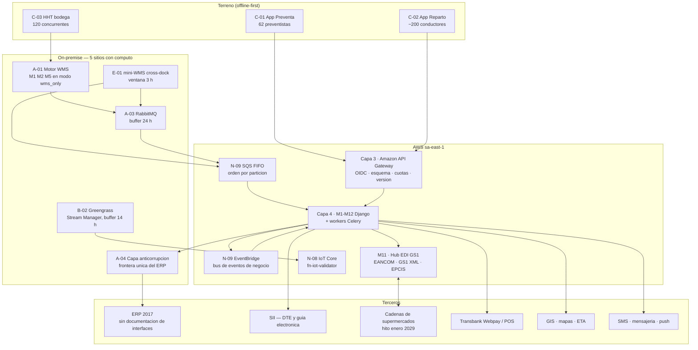

# Arquitectura de Integración — Caso 02 Logística

## Distribuidora Puelche S.A. — Licitación TFEP-01/2026 (Caso 02 — Logística)

| Atributo | Valor |
|---|---|
| Documento | Arquitectura de integración (Subdocumento 4, apartado 3) |
| Versión | v01 |
| Fecha | 2026-09-06 |
| Estado | En revisión interna |
| Autor | Arquitecto de Solución (LafroX) |
| Marco | BA Art. 16.4 (bitácora de reconciliación) · Art. 19 (acoplamiento débil) · Art. 21 (Zero Trust) · Art. 23 (OpenAPI/AsyncAPI, versionado y obsolescencia) · BTT RT-02.06–02.09/02.14 · RT-03.11/03.12/03.13 · RT-05.16–05.23 · RT-10.08 |
| Fuentes | `Arquitectura_Logica_v6-1.md` (§8.4, §9.1–§9.8), `Arquitectura_Fisica_Hibrida_Consolidada_Caso02_v02.md` (§5, costuras C1–C16), `Tabla_Emplazamiento_OnPremise_v06.md` (A-03/A-04, N-08/N-09), `Propuesta_Arquitectura_Cloud_Caso02_CLAUDE_v2.md` v3.6, `Registro_Decisiones_Arquitectura_ADR_v01.md` (ADR-05/08/11) |

> **Finalidad.** Este documento responde el apartado 3 del Subdocumento 4 — **Arquitectura de integración: servicios, contratos, mensajería, versionado y gobierno** — y constituye la **vista de integración** (ISO/IEC/IEEE 42010, RT-02.03) de la arquitectura híbrida. No introduce cifras nuevas: consolida en una sola vista lo declarado en la Arquitectura Lógica v6.1 (Capa 5) y en las costuras C1–C16 de la fuente física única.
>
> **Por qué la integración es una capa de primera clase en Puelche.** El caso no describe un sistema legado único que reemplazar: describe un **tejido** de sistemas —ERP de 2017 sin documentación de interfaces, WMS de 2013 con proveedor desaparecido, una preventa cuyo proveedor ya no existe, planillas y papel— más 14.200 puntos de entrega, 10 empresas transportistas y un hito externo contractual (**enero de 2029**, condiciones comerciales de la principal cadena de supermercados). El riesgo de este proyecto no está en construir módulos: está en las **costuras**.

---

## 1. Principios de integración

| # | Principio | Declaración | Base |
|---|---|---|---|
| 1 | **Contrato antes que conexión** | Ninguna integración existe sin contrato publicado (OpenAPI 3.1 o AsyncAPI 2.6), dueño declarado y versión semántica. Una integración sin contrato no entra al catálogo y no se despliega. | Art. 23 · RT-05.16 |
| 2 | **Asíncrono por defecto, síncrono por excepción** | Toda dependencia entre módulos se modela como **evento** por la Capa 5. Solo las lecturas críticas de la venta (disponibilidad de stock, crédito del cliente) y los actos de fe pública (DTE al SII, autorización de pago) son síncronas, y siempre con **timeout explícito**. | Art. 19 · RT-02.07/02.08 |
| 3 | **Idempotencia universal** | Toda escritura originada en terreno o en bodega lleva **UUID de cliente** y ventana de deduplicación documentada. El servidor es la fuente de verdad y resuelve conflictos por **regla de negocio**, nunca por marca de tiempo ciega. | RT-02.06 · S26 |
| 4 | **Bitácora de reconciliación auditable** | Toda decisión de reconciliación registra qué transacción, qué conflicto, qué regla se aplicó, quién la aplicó y cuándo. Es un entregable auditable ante el mandante, no un registro técnico. | **Art. 16.4** · RT-03.12 |
| 5 | **El legado nunca se escribe directo** | El ERP de 2017 se toca **solo** a través de la capa anticorrupción A-04. Ninguna cadena de supermercados, ningún portal y ningún módulo escribe al ERP. | RT-05.20 · ADR-11 |
| 6 | **Zero Trust también en la integración** | Todo tráfico on-premise → nube es **saliente** (HTTPS/443, MQTTS/8883). Las dos únicas excepciones entrantes están declaradas y acotadas (D-AL-05). | Art. 21 · D-AL-05 |
| 7 | **Toda integración declara cómo falla** | Cada entrada del catálogo declara su comportamiento ante falla —reintentar, degradar, diferir o suplir con procedimiento manual— y se verifica con inyección de fallas. | **RT-10.08** · RT-09.08 |
| 8 | **Ninguna integración interrumpe la ventana crítica** | Cargas masivas, reprocesos y despliegues de conectores se ejecutan **fuera de 05:30–07:00** de lunes a sábado. | RT-10.05 (caso) |

---

## 2. Vista de integración

> **Lectura del diagrama.** Las flechas desde el dominio on-premise hacia la nube son todas **salientes**. Los cross-docks (E-01) publican sus eventos críticos **directo** a la nube y solo el detalle del mini-WMS viaja a Talca: lo crítico no depende de Talca (D-AL-04). El ERP tiene **una sola puerta** y esa puerta es la ACL.

---

## 3. Catálogo de servicios de integración (RT-05.16 · RT-05.21)

El catálogo es el **registro único** de integraciones. Cada entrada tiene identificador estable, módulo dueño, contrato, versión y comportamiento ante falla. Vive versionado junto al código y se publica en el portal interno de desarrolladores servido por **Amazon API Gateway** (Capa 3).

### 3.1 Integraciones internas — superficies y plano híbrido

| ID | Integración | Modo | Contrato | Módulo dueño | Ventana crítica | Comportamiento ante falla (RT-10.08) |
|---|---|---|---|---|---|---|
| **INT-01** | App Preventa ↔ plataforma (pedidos, stock, crédito, promociones, precios) | Síncrono para lectura + **sincronización diferida idempotente** para escritura | OpenAPI 3.1 `/v1/preventa` y `/v1/sync` | M3 | 09:00–18:00 | Caché de turno (saldo, stock, tarifa; TTL 8 h); el pedido se toma sin conexión y se confirma en la sincronización; **no se pierde** |
| **INT-02** | App Reparto ↔ plataforma (POD, entregas, devoluciones, cobranza, envases) | Sincronización diferida idempotente por lotes | OpenAPI 3.1 `/v1/reparto` y `/v1/sync` | M6, M7, M8 | 05:30–07:00 y 17:00–20:00 | Turno completo de 14 h sin señal; sincronización **≤ 10 min** al reconectar (RT-03.12); acuse por lote (RF-06.07) |
| **INT-03** | Broker on-premise → nube (reconciliación del WMS) | Asíncrono | AsyncAPI 2.6 · SQS FIFO, `MessageGroupId` = sitio | M2, M5 | 22:00–06:00 | Buffer RabbitMQ **24 h**; publicación cronológica al reconectar; el CD queda sincronizado **≤ 2 h** tras un corte de 24 h |
| **INT-04** | Cross-dock → Talca (detalle del mini-WMS) | Asíncrono broker a broker | AsyncAPI 2.6 · AMQPS 5671 | M2 | 03:00–06:00 | Ventana de 3 h 100 % local; los eventos críticos van directo a SQS y **no dependen de Talca** (D-AL-04) |
| **INT-05** | Borde IoT → nube (cadena de frío) | Asíncrono, al menos una vez | AsyncAPI 2.6 · MQTTS 8883 con X.509 por dispositivo | M9, M12 | 24×7 | Buffer Greengrass **14 h**; la detección de excursión y el **bloqueo de despacho son 100 % locales** y no dependen de la nube |
| **INT-12** | Réplica WMS → Aurora (continuidad) | Asíncrono CDC | WAL lógico (`wal_level=logical`) por AWS DMS | M2 | continua | Excepción entrante declarada (D-AL-05); si la VPN cae, DMS encola en origen y reanuda sin pérdida — RPO ≤ 15 min |
| **INT-13** | Identidad: maestro → cachés locales | Asíncrono (importación del Realm cifrado por S3, saliente) | Exportación/importación de Realm Keycloak | Capa 7 | 24×7 | Δ ≤ 8 h por TTL y ≤ 24 h por SCIM; **sin conexiones entrantes** hacia Keycloak |
| **INT-14** | Observabilidad on-premise → plataforma | Asíncrono (OTLP) | OpenTelemetry | Capa 8 | 24×7 | Buffer en disco 24 h; el envío diferido cierra el hueco al reconectar |

### 3.2 Integraciones externas — plataforma y terceros

| ID | Sistema | Modo | Contrato / estándar | Volumen declarado | Ventana crítica | Comportamiento ante falla (RT-10.08) |
|---|---|---|---|---|---|---|
| **INT-06** | **ERP 2017** (catálogo, stock valorizado, cobranzas, contabilidad) | Asíncrono por colas + síncrono **solo lecturas** | OpenAPI 3.1 **de Puelche** expuesto por la ACL (A-04); el ERP no publica contrato propio | ≈ 34.000 DTE/mes; cobranzas por turno | Cierre contable diario y primeros tres días hábiles del mes | **Cortacircuito**: preventa y reparto no se degradan; las colas retienen hasta 24 h; el desajuste se declara en la bitácora del Art. 16.4 |
| **INT-07** | **SII** — DTE, guía de despacho electrónica y acuse de recibo | Síncrono por la puerta de enlace | Formato de la autoridad tributaria (RT-05.23); firma conforme a la Ley 19.799 | ≈ 34.000 documentos/mes; pico en 05:30–07:00 | Emisión por turno | **La entrega no se detiene**: evidencia local (firma, QR, fotografía) y **timbre diferido** con folio reservado por dispositivo; reintento con retroceso exponencial — **cero guías de papel** (RF-06.02) |
| **INT-08** | **Cadenas de supermercados** — canal moderno | Asíncrono (AS2) + API síncrona selectiva | **EANCOM D.01B / GS1 XML** (pedido, aviso de despacho, factura) y **EPCIS** para eventos de trazabilidad | 500 puntos de entrega del canal moderno | **Ventana de 30 min** (RF-12.10); hito **enero de 2029** (RNF-12.01) | DLQ y **bandeja de excepciones** operada por un actor canónico (RF-12.05/12.06); alternativa manual declarada por acuerdo con cada cadena |
| **INT-09** | **Transbank Webpay y POS móvil** | Síncrono por la puerta de enlace | API de la pasarela; idempotencia por `transaction_id` | ≈ 1.400 entregas/día (≈ 2.600 en el peak); ≈ 11.800 cobros en efectivo/mes | 05:30–07:00 | **Doble captura sin conexión**: el POS registra la transacción como pendiente para autorización diferida; si no procede, efectivo o giro a crédito con firma. **El cobro nunca se pierde** |
| **INT-10** | **GIS, mapas, ETA y geocercas** | Síncrono por la puerta de enlace | API del proveedor GIS | Planificación diaria de ≈ 96 camiones | Planificación previa al despacho | **Caché de mapas por zona** en el dispositivo; degradación a ruta sin conexión con la secuencia ya cargada (M4); la entrega no se pierde |
| **INT-11** | **Notificaciones** — correo, aplicación, mensajería instantánea y SMS | Asíncrono por colas | API del proveedor de notificaciones | Avisos de despacho y de llegada por turno | Previo a la entrega | Cola local con entrega diferida; el canal se elige **por cliente**, porque buena parte del canal tradicional no usa correo (RT-16.21) |
| **INT-15** | **Telemetría de flota existente** (camiones propios) | Asíncrono, solo lectura | API de la fuente existente (RT-17.06) | 42 vehículos propios; ≈ 420.000 km/mes | Operación diurna | Degrada a ruta planificada sin posición real; **no se usa para control de jornada** (D1, objeción sindical L577) |

> **Número de integraciones declarado: 15** (8 internas, 7 externas). El numeral 14.2 del caso exige declarar además el **volumen de mensajes por integración**. Los volúmenes de negocio están arriba; su traducción a mensajes por día es una de las celdas que debe cerrarse (ver `AUDITORIA_Coherencia_Subdoc4_v01.md`, hallazgo D1).

---

## 4. Contratos (RT-05.16 · RT-05.18 · Art. 23)

| Dimensión | Definición |
|---|---|
| **API síncrona** | **OpenAPI 3.1** por módulo, con ruta `/v{major}/...`. Metadatos obligatorios: `x-owner` (módulo dueño), `x-version` (semver), `x-status` (`draft`, `stable`, `deprecated`) y `x-sunset` (fecha de retiro). |
| **Eventos** | **AsyncAPI 2.6** con **JSON Schema** versionado por evento. Cada evento declara productor único, consumidores registrados, clave de partición y política de reintento. |
| **Autenticación** | Superficies: **OAuth 2.1 con PKCE**. Servicio a servicio: **mTLS**. Máquina a máquina: credenciales de cliente con secreto de rotación automática. Todos los tokens los firma Keycloak (Capa 7). |
| **Validación** | Validación de esquema e inspección de carga útil **en la puerta de enlace** (Art. 21.2), antes de alcanzar la Capa 4. Un mensaje que no valida no entra: se rechaza con causa y queda registrado. |
| **Trazabilidad** | Todo llamado y todo evento propaga `transaction_id` (OpenTelemetry) desde la Capa 3 hasta la Capa 6. Es la clave con la que se reconstruye una operación de extremo a extremo, conforme al Art. 23: quién, qué, cuándo, desde dónde y con qué valores anteriores y posteriores. |

### 4.1 Eventos canónicos del dominio

Los eventos son el vocabulario del sistema. Se nombran en pasado, son inmutables y llevan `event_id` (UUID), `occurred_at`, `site_id` y `transaction_id`.

| Evento | Productor | Consumidores | Clave de partición | Por qué existe (origen en el caso) |
|---|---|---|---|---|
| `RecepcionConfirmada` | M1 | M2, M9, ACL → ERP | `site_id` | Origen de la trazabilidad de lote (Cap. 9.5: retiro sanitario en menos de 2 h) |
| `StockReservado` / `ReservaLiberada` | M2 | M3, M5 | `sku_id` | Resuelve el doble compromiso de stock (decisión 16.1 N° 8) |
| `PedidoConfirmado` | M3, M11 | M4, M5, M7 | `pedido_id` | Une preventa y canal moderno en un único flujo |
| `MisionPreparada` | M5 | M6, ACL → ERP | `pedido_id` | Cierra el ciclo de bodega a andén |
| `EntregaRegistrada` | M6 | M7, M8, M10, SII | `entrega_id` | Define «entrega cumplida» y alimenta el OTIF (decisión 16.1 N° 1) |
| `DevolucionRegistrada` | M8 | M2, M7, M10 | `entrega_id` | Efecto sobre el documento tributario ya emitido (decisión 16.1 N° 12) |
| `EnvaseMovido` | M8 | M2, M10 | `cliente_id` | 68.000 canastillos y 9.400 pallets con 14 % de pérdida anual (decisión 16.1 N° 10) |
| `ExcursionTermicaDetectada` | M9 (borde) | M5 (bloqueo), M10, alertas | `shipment_id` | Alerta en menos de 5 s; el bloqueo de despacho es **local** (decisión 16.1 N° 4) |
| `RendicionCerrada` | M7 | M10, ACL → ERP | `conductor_id` | Control del efectivo que hoy circula en ruta |
| `DesviacionDeRutaDetectada` | M12 | M10, M9 | `ruta_id` | Costo de servir; **no** control de jornada (D1) |

---

## 5. Mensajería (RT-02.06 · RT-02.07 · ADR-05)

| Plano | Tecnología | Emplazamiento | Rol |
|---|---|---|---|
| **Buffer local de sitio** | **RabbitMQ** (A-03) | VM-03 Talca (≈ 3 M mensajes) · VM-C04 Concepción · broker en E-01 | Sostiene la **autonomía de 24 h** del centro de distribución. Es lo que permite que la bodega reciba, prepare y despache con el enlace caído. |
| **Trabajo y reconciliación** | **SQS FIFO** (N-09) | Nube | Orden garantizado **por partición** (`MessageGroupId` = sitio) y deduplicación; alimenta a `celery-reconciliation` y `celery-erp-sync`. |
| **Bus de eventos de negocio** | **EventBridge** (N-09) | Nube | Coreografía entre módulos y disparo de alertas y notificaciones. Un módulo publica; los interesados se suscriben. |
| **Transporte hacia la nube** | *Shipper* en VM-03 (modo `wms_only`) | On-premise → nube | **HTTPS 443 sobre VPC Endpoint SQS/PrivateLink** (D-AL-03). AMQPS 5671 queda reservado a broker con broker on-premise. |

**Garantías declaradas:**

- **Entrega al menos una vez, con deduplicación en el consumidor.** No se promete entrega exactamente una vez: se promete **idempotencia verificable**.
- **Orden por partición**, no orden global. La partición es el sitio o la entidad de negocio, según el evento.
- **DLQ por cola** con retención declarada, monitoreada por el equipo de operación y con bandeja de excepciones cuando el mensaje afecta a un tercero (EDI, DTE).
- **Reintento con retroceso exponencial y variación aleatoria**; **cortacircuitos** sobre ERP, SII y Transbank; **mamparos** por integración: un fallo del ERP no degrada la preventa.
- **Reconciliación determinista:** al reconectar, el conflicto de stock se resuelve por la **regla de reserva** declarada, nunca por marca de tiempo, y la decisión queda en la bitácora del Art. 16.4.

---

## 6. Costuras híbridas — amarre con la arquitectura física

La vista de integración y la vista física describen los mismos puntos de contacto. Esta tabla es el amarre entre ambas y debe leerse junto a `Arquitectura_Fisica_Hibrida_Consolidada_Caso02_v02.md` §5.

| Costura física | Integración lógica | Contrato | Extremos |
|---|---|---|---|
| C1 — VPN corporativa | portadora de INT-06 e INT-12 | IPsec/IKEv2, BGP, MTU 1436 | D-01 ↔ VGW |
| C2 — Réplica WMS → Aurora | **INT-12** | WAL lógico / DMS CDC | VM-02 ↔ Aurora |
| C4 — Broker → SQS FIFO | **INT-03** | AsyncAPI 2.6 | VM-03 ↔ N-09 |
| C5 — ERP por la ACL | **INT-06** | OpenAPI 3.1 de Puelche | VM-04 ↔ `celery-erp-sync` |
| C6 — Identidad | **INT-13** | Realm cifrado por S3 | Keycloak maestro ↔ A-05 / VM-C03 |
| C7 — IoT Greengrass | **INT-05** | MQTTS 8883, X.509 | B-02 ↔ N-08 |
| C8 — Observabilidad | **INT-14** | OTLP | F-01 ↔ CloudWatch / X-Ray / AMP |
| C10 — Apps de terreno | **INT-01 / INT-02** | OpenAPI 3.1 | C-01 / C-02 ↔ Capa 3 |
| C13 — Cross-dock | **INT-04** | AsyncAPI 2.6 / AMQPS | E-01 ↔ VM-03 y ↔ N-09 |
| C14 — Notificaciones y EDI | **INT-08 / INT-11** | GS1 / API de notificaciones | EventBridge ↔ terceros |
| C15 — Portales de la DMZ | INT-01 (lectura de stock, crédito y cobranza) | OpenAPI 3.1 | N-01/N-02/N-03 ↔ Capa 3 |
| C16 — Pago Transbank | **INT-09** | API de la pasarela | Módulo `integraciones` ↔ Webpay |

---

## 7. Capa anticorrupción y estrangulamiento del legado (RT-05.20 · RT-02.14 · ADR-08 · ADR-11)

**Frontera única del ERP (A-04).** El ERP de 2017 no tiene documentación de interfaces. En vez de descubrir su forma real dentro de cada módulo, se levanta **una sola frontera**: la ACL expone hacia adentro un contrato **OpenAPI 3.1 propio de Puelche** y absorbe hacia afuera la forma del ERP. Consecuencias:

- El conocimiento del ERP queda **concentrado y documentado en un solo componente**, no disperso en doce módulos.
- Ningún módulo, portal ni cadena de supermercados escribe al ERP: `celery-erp-sync` publica notificaciones por SQS y **lee** contratos por la ACL.
- Cuando una capacidad del ERP se absorbe en la plataforma, se retira de la ACL sin tocar a los consumidores.

**Estrangulamiento del WMS de 2013 (ADR-08).** El WMS se reemplaza en la Etapa 1 por los módulos M1, M2 y M5 del monolito. Durante la coexistencia el legado queda **detrás de la misma ACL**, con una tabla de «capacidad absorbida» —recepción GS1, *slotting*, misiones de picking con HHT, conteo cíclico— que se vacía ola a ola por sitio, con estrategia azul-verde y plan de reversión.

**Hub EDI GS1 (ADR-11).** Una cadena nueva se incorpora por **configuración de perfil** (equivalencias GTIN por cadena, RF-12.03), no por desarrollo. El hub mapea cada cadena contra un **modelo canónico GS1**, no contra el ERP: es exactamente lo que evita construir una integración distinta por cada cadena (Cap. 17.4, punto 10 del caso).

---

## 8. Versionado y política de obsolescencia (RT-05.17 · Art. 23)

| Regla | Definición |
|---|---|
| **Versionado semántico estricto** | `major.minor.patch`. `major` = cambio disruptivo; `minor` = aditivo y retro-compatible; `patch` = corrección. |
| **Evolución aditiva primero** | Un campo se agrega, nunca cambia de significado. Un campo que deja de usarse se marca `deprecated` antes de retirarse. |
| **Preaviso mínimo de 6 meses** | Ninguna versión se retira antes de seis meses de aviso formal (Art. 23 y RT-05.17). El registro de deprecaciones es visible para todo el equipo y para el CLIENTE. |
| **Doble versión concurrente** | Durante la migración conviven `v{n}` y `v{n+1}`; el consumidor migra en su ventana, no en la del proveedor. |
| **Aprobación de cambios disruptivos** | Un `major` requiere aprobación del **Comité de Arquitectura** y plan de migración con los consumidores identificados uno a uno. |
| **Congelamientos del caso** | No se publica ni se retira ninguna versión en **septiembre**, en **diciembre** ni en los **tres primeros días hábiles del mes** (Cap. 13.2 del caso). |
| **Contratos que no controla el proponente** | Las especificaciones de cada cadena de supermercados y del SII las fija la contraparte: se versionan como **perfiles del hub** y se prueban contra el banco de pruebas de cada contraparte antes de activarse. |

---

## 9. Gobierno de la capa de integración (Art. 19 · RT-05.16 · Cap. 14 BTT)

| Mecanismo | Cómo opera | Responsable |
|---|---|---|
| **Catálogo único versionado** | Toda integración vive en el catálogo con dueño, contrato, versión, estado y comportamiento ante falla. Lo que no está en el catálogo no se despliega. | Arquitecto de Solución |
| **Comité de Arquitectura** | Aprueba altas de integración y cambios `major`, con cadencia declarada en el plan de gobierno del proyecto. | Arquitecto de Solución, Jefe de Proyecto y Jefe de TI del CLIENTE |
| **Pruebas de contrato consumidor-proveedor** | Cada integración tiene pruebas de contrato en el pipeline; un cambio que rompe a un consumidor registrado **bloquea el despliegue** de forma automática. | Líder de Desarrollo y Líder de Calidad |
| **Pruebas de falla por integración** | Inyección de fallas (RT-10.07) por integración durante la marcha blanca: se verifica que el comportamiento declarado en el catálogo sea el comportamiento real. | Líder de Calidad y Líder de Operación |
| **Observabilidad por integración** | Latencia, tasa de error, volumen y profundidad de DLQ por integración, correlacionados por `transaction_id` (Capa 8). Toda DLQ tiene dueño y alerta. | Líder de Operación / SRE |
| **Bandeja de excepciones de negocio** | Lo que falla y afecta a un tercero (EDI, DTE) no muere en una cola técnica: aparece en una bandeja operada por un actor canónico con responsabilidad declarada (RF-12.05/12.06). | Jefe de TI y responsable del canal moderno |
| **Traspaso al equipo de cuatro personas** | El CLIENTE opera con **4 personas de TI**. El catálogo, las guías de resolución y la bandeja de excepciones son los artefactos que hacen operable esta capa sin el proponente. | Líder de Implantación y Gestión del Cambio |

---

## 10. Carga y descarga masiva de datos (RT-05.22)

| Escenario | Mecanismo | Control y auditoría |
|---|---|---|
| Carga inicial de maestros e históricos (ERP y WMS) | Proceso ETL por lotes con inserción **idempotente por UUID**, en ventana sin operación | Conteo previo y posterior por lote, conciliación de totales y bitácora de carga (quién, cuándo, lote, resultado); los rechazados van a cuarentena con reproceso |
| Descarga regulatoria (traza de lote, temperaturas, DTE, geolocalización) | Exportación **asíncrona** a CSV o Parquet, firmada y con suma de verificación | Registro de la extracción (solicitante, filtro, resultado) y control de acceso a datos sensibles (RT-16.09) |
| Sincronización masiva de turno (terreno) | Sincronizadores con **partición y reanudación** más deduplicación; los medios van a S3 por objeto | Nivel de servicio comprometido: **turno completo ≤ 10 min**; métricas de sincronización en la Capa 8 |
| Interfaces periódicas con terceros | Colas con `batch_id` y confirmación por lote | Monitoreo de DLQ y **acuse por lote** en la bandeja de excepciones |

> **Regla:** ninguna carga masiva se ejecuta dentro de la ventana crítica **05:30–07:00**, y toda carga queda registrada y es auditable.

---

## 11. Funciones que no operan sin conexión (RT-03.13)

La declaración formal que exige RT-03.13 vive en `Tabla_Emplazamiento_OnPremise_v06.md` §1.1 y en `Arquitectura_Logica_v6-1.md` §9.5. Desde la vista de integración la regla es una sola:

> **Lo transaccional crítico de terreno y de bodega opera sin conexión (14 h en terreno, 24 h en el centro de distribución). Lo que depende de la nube o de un tercero degrada con procedimiento manual declarado y sin pérdida de datos.**

Ninguna función de la ventana crítica de despacho (05:30–07:00) depende de una integración externa: el DTE se timbra de forma diferida con folio reservado, el cobro se captura como pendiente, la excursión térmica se detecta y bloquea localmente, y la ruta ya está cargada en el dispositivo.

---

## 12. Referencias cruzadas con las decisiones de arquitectura

| ADR | Aporte a la vista de integración |
|---|---|
| ADR-01 | Monolito modular: los módulos se comunican por eventos internos; EDI, telemetría y sincronización son *workers* extraíbles |
| ADR-05 | Mensajería asíncrona: RabbitMQ local con buffer de 24 h más SQS FIFO y EventBridge en nube |
| ADR-06 | Identidad: el maestro publica hacia las cachés (INT-13), nunca a la inversa |
| ADR-08 | WMS de 2013: absorción por estrangulamiento detrás de la ACL, con reversión azul-verde |
| ADR-11 | Hub EDI GS1 centralizado con capa anticorrupción; una cadena nueva se agrega por configuración |
| ADR-12 | El peak de septiembre se absorbe con elasticidad de los consumidores de cola, no con más integraciones |

---

## 13. Trazabilidad normativa (resumen)

| Requisito | Cómo se cumple |
|---|---|
| BA Art. 16.4 | Bitácora de reconciliación auditable de cada decisión de conflicto (§1, §5) |
| BA Art. 19 | Acoplamiento débil por eventos; dependencias síncronas acotadas y con timeout (§1, §3) |
| BA Art. 21 | Zero Trust: tráfico saliente; validación de esquema e inspección de carga útil en la puerta de enlace (§1, §4) |
| BA Art. 23 | OpenAPI 3.1 y AsyncAPI con versionado semántico y obsolescencia con preaviso de seis meses (§4, §8) |
| RT-02.06 | Idempotencia con UUID y ventana de deduplicación documentada (§1, §5) |
| RT-02.07 | Entrega al menos una vez, deduplicación y orden por partición (§5) |
| RT-02.08 / RT-02.09 | Reintento con retroceso, cortacircuitos, mamparos, timeout obligatorio y degradación elegante (§5) |
| RT-02.14 | Capa anticorrupción y estrangulamiento del legado (§7) |
| RT-03.11 / RT-03.12 | Registro local íntegro y reconciliación determinista con bitácora (§5, §11) |
| RT-03.13 | Declaración de funciones no disponibles sin conexión y procedimiento manual (§11) |
| RT-05.16 | Contratos formales OpenAPI 3.1 y AsyncAPI 2.6 con dueño y estado (§4) |
| RT-05.17 | Obsolescencia con seis meses de preaviso y doble versión concurrente (§8) |
| RT-05.18 | OAuth 2.1 con PKCE en superficies y mTLS entre servicios (§4) |
| RT-05.20 | Capa anticorrupción frente al ERP de 2017 y al WMS de 2013 (§7) |
| RT-05.21 | Matriz de integraciones con modo, volumen y ventana (§3) |
| RT-05.22 | Carga y descarga masiva con volumen, frecuencia y control de calidad (§10) |
| RT-05.23 | Estándares sectoriales: GS1 (EANCOM, GS1 XML, EPCIS) y formato de la autoridad tributaria (§3.2) |
| RT-10.08 | Comportamiento ante falla declarado por integración y verificado con inyección de fallas (§3, §9) |
| Caso Cap. 17.4, puntos 5, 6, 8 y 10 | Integración con el ERP y con los documentos tributarios (§3.2, §7); destino del WMS de 2013 (§7); evidencia de entrega articulada con la guía electrónica (INT-07); canal moderno sin una integración por cadena (§7) |

---

## Referencias

1. `Arquitectura_Logica_v6-1.md` — Capa 5 (§9.1–§9.8), límites de contexto (§8.4), modelo de dominio (§8.6).
2. `Arquitectura_Fisica_Hibrida_Consolidada_Caso02_v02.md` — costuras C1–C16 (§5) y topología (§4).
3. `Tabla_Emplazamiento_OnPremise_v06.md` — A-03 (broker), A-04 (ACL), N-08 y N-09 (IoT y mensajería en nube), §1.1 (funciones sin conexión).
4. `Propuesta_Arquitectura_Cloud_Caso02_CLAUDE_v2.md` v3.6 — §3 (cómputo y colas) y §7 (matriz de justificación).
5. `Registro_Decisiones_Arquitectura_ADR_v01.md` — ADR-05 (mensajería), ADR-08 (WMS de 2013), ADR-11 (hub EDI GS1).
6. `Bases/Bases_Administrativas.md` — Art. 16.4, 19, 21 y 23.
7. `Bases/Bases_Tecnicas_Transversales.md` — RT-02.06 a RT-02.09 y RT-02.14, RT-03.11 a RT-03.13, RT-05.16 a RT-05.23, RT-10.08.
8. `Bases/Caso_02_Logistica.md` — Cap. 13.2 (hitos externos), Cap. 15 (RT-05.23, RT-16.21), Cap. 16.1 (decisiones 1, 4, 8, 10, 12 y 14), Cap. 17.4 (puntos 5, 6, 8 y 10).
