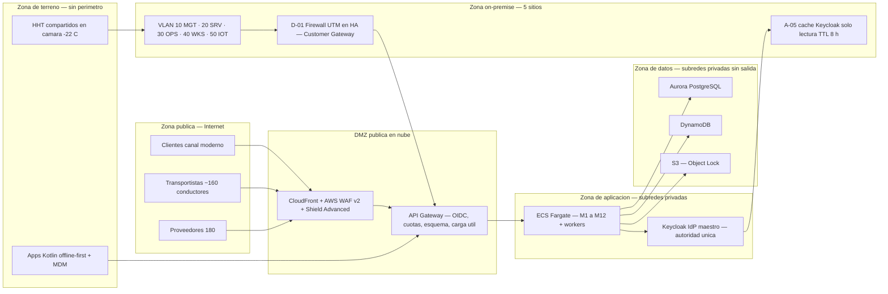

# Arquitectura de Seguridad — Caso 02 Logística

## Distribuidora Puelche S.A. — Licitación TFEP-01/2026 (Caso 02 — Logística)

| Atributo | Valor |
|---|---|
| Documento | Arquitectura de seguridad (Subdocumento 4, apartado 4) |
| Versión | v01 |
| Fecha | 2026-09-06 |
| Estado | En revisión interna |
| Autor | Encargado de Seguridad de la Información (LafroX), con el Arquitecto de Solución |
| Marco | BA Art. 21 (seguridad y ciberseguridad) · Art. 22 (identidad, acceso y sesiones) · Art. 23 (datos y residencia) · Art. 16.3/16.4 · BTT Cap. 11 (RT-11.01–11.28), Cap. 12 (RT-12.01–12.13), RT-03.15/03.18/03.22, RT-16.07/16.09 · NIST SP 800-207 · ISO/IEC 27001:2022 · STRIDE · Ley 21.719 · Ley 19.799 |
| Fuentes | `Arquitectura_Logica_v6-1.md` (§11 Capa 7), `Propuesta_Arquitectura_Cloud_Caso02_CLAUDE_v2.md` v3.6 (§5, §7.9, §7.10), `Dimensionamiento_Infraestructura_OnPremise_v05.md` (PARTE 8 y PARTE 9), `Arquitectura_Fisica_Hibrida_Consolidada_Caso02_v02.md` (§6), `Sala_Servidores_OnPremise_v02.md` (§4), `Registro_Decisiones_Arquitectura_ADR_v01.md` (ADR-03/06/07) |

> **Finalidad.** Este documento responde el apartado 4 del Subdocumento 4 — **Arquitectura de seguridad: modelo Zero Trust, capa expuesta, identidad, cifrado y controles** — y constituye la **vista de seguridad** (ISO/IEC/IEEE 42010, RT-02.03) de la arquitectura híbrida.
>
> Es además el **«documento de seguridad del consolidado»** que `Dimensionamiento_Infraestructura_OnPremise_v05.md` referencia en sus apartados 8.2, 8.4 y 8.10 y que hasta esta versión no existía como artefacto propio. Los valores aquí declarados no son nuevos salvo donde se indica expresamente: consolidan lo ya comprometido en los documentos fuente.
>
> **Por qué la seguridad de Puelche no es la de una oficina.** El perímetro de esta solución no es un edificio: son 62 preventistas de pie en la puerta de un almacén, ~200 conductores —de los cuales ~160 **no son trabajadores de la compañía y rotan sin aviso**—, dispositivos compartidos entre turnos en una cámara a −22 °C, un turno de preparación con 38 % de rotación anual y 14.200 puntos de entrega. Un modelo de seguridad basado en la red corporativa aquí no protege nada. Por eso el modelo es Zero Trust y por eso la identidad es la pieza central.

---

## 1. Principios rectores

| # | Principio | Declaración | Base |
|---|---|---|---|
| 1 | **Zero Trust conforme a NIST SP 800-207** | Verificación explícita de cada solicitud, privilegio mínimo y presunción de compromiso. La red interna **no** confiere confianza. | Art. 21.1 |
| 2 | **Seguridad desde el diseño y por defecto** | Modelado de amenazas **STRIDE** documentado por cada componente y por cada integración externa, antes de implementar. | Art. 21.1 · RT-11.02 |
| 3 | **La identidad es el perímetro** | Autoridad única de identidad (Keycloak, Modelo B); toda decisión de acceso se toma sobre el token, no sobre la dirección de red de origen. | Art. 22 · RT-12.01 · ADR-06 |
| 4 | **Sin conexiones entrantes al on-premise** | Todo tráfico on-premise → nube es saliente. Las dos únicas excepciones (DMS → PostgreSQL y `celery-erp-sync` → ACL) están declaradas, acotadas al túnel IPsec autenticado y auditadas. | Art. 21 · D-AL-05 · RT-11.13 |
| 5 | **Cifrado en tránsito y en reposo sin excepciones** | TLS 1.3 mínimo con HSTS; cifrado en reposo del 100 % de los datos con claves gestionadas en KMS/HSM y separación de funciones en su custodia. | Art. 21.2 · RT-11.08/11.09 |
| 6 | **La seguridad no puede detener la ventana crítica** | Ningún control de seguridad puede introducir una dependencia en línea dentro de 05:30–07:00 ni en las 14 h de terreno sin señal. La autenticación de terreno se resuelve **sin red** por diseño. | RT-10.05 (caso) · RT-03.10 |
| 7 | **Operable por cuatro personas** | El CLIENTE tiene 4 personas de TI. Se privilegian servicios administrados y un SOC contratado 24×7 por sobre plataformas que exijan operación local especializada. | Art. 16.3 · Cap. 2.4 del caso |
| 8 | **Evidencia inalterable** | Todo evento de seguridad y toda acción de negocio quedan en un registro **inalterable** y con retención declarada; ni un administrador puede modificarlo. | Art. 21.3 · RT-11.14 · RT-16.07 |

---

## 2. Modelo Zero Trust aplicado (Art. 21.1 · NIST SP 800-207)

### 2.1 Los siete principios de NIST SP 800-207 en Puelche

| Principio NIST | Aplicación concreta en esta solución |
|---|---|
| Todo recurso de datos y servicio de cómputo es un recurso a proteger | Los 12 módulos, las 15 integraciones del catálogo, las bases on-premise y en nube, el borde IoT y los HHT de bodega están inventariados como recursos con dueño y clasificación |
| Toda comunicación se asegura sin importar la ubicación de red | TLS 1.3 entre superficies y borde; **mTLS servicio a servicio**; IPsec/IKEv2 con AES-256-GCM en la VPN; MQTTS con X.509 por dispositivo en el borde IoT |
| El acceso se concede por sesión | Tokens de vida breve firmados por Keycloak; el token de terreno se emite por **turno**, no de forma permanente |
| El acceso lo determina una política dinámica | **RBAC** por los 11 actores canónicos más **ABAC** por atributos de contexto: instalación asignada, horario de turno y dispositivo provisto (verificado por MDM) |
| Se vigila la integridad y postura de todos los activos | EDR en todos los nodos on-premise y estaciones (F-03); MDM con postura y estado de sincronización en los dispositivos de terreno (§4.6); escaneo semanal de vulnerabilidades |
| La autenticación y autorización son dinámicas y estrictamente aplicadas antes de conceder acceso | Autenticación en la puerta de enlace (OIDC), autorización en la Capa 4; elevación temporal de privilegios con aprobación y grabación |
| Se recolecta el máximo de información para mejorar la postura | SIEM (Security Lake) con **casos de uso del proceso logístico**, no solo de infraestructura; correlación por `transaction_id` en la Capa 8 |

### 2.2 Zonas y flujos

**Reglas de zona declaradas:**

- La **única** exposición pública es la DMZ en nube (CloudFront → WAF → API Gateway). Las consolas internas **no** pasan por ahí: entran por intranet o VPN (RT-03.22).
- La zona de datos **no tiene salida a internet** y se consume por VPC Endpoints/PrivateLink.
- Desde la zona on-premise no se acepta ninguna conexión entrante salvo las dos excepciones D-AL-05.
- La zona de terreno **no tiene perímetro**: se protege con identidad, cifrado local, MDM y borrado remoto.

---

## 3. Capa expuesta (Art. 21.2 · RT-11.11/11.13)

| Control | Implementación | Exigencia |
|---|---|---|
| **Publicación exclusiva por capa de borde** | CloudFront (CDN) como único origen público; los orígenes están restringidos y no se alcanzan directamente | Art. 21.2 |
| **WAF con reglas gestionadas y personalizadas** | AWS WAF v2: conjunto gestionado OWASP Top 10 más reglas propias por API (límites de tamaño, patrones de la operación logística) | Art. 21.2 |
| **Protección DDoS en capas 3, 4 y 7** | AWS Shield Advanced con respuesta gestionada | Art. 21.2 |
| **TLS 1.3 y prohibición de TLS 1.0/1.1** | TLS 1.3 mínimo, conjuntos de cifrado modernos con AEAD, **HSTS con precarga**; deshabilitados RC4 y CBC sin AEAD | Art. 21.2 · RT-11.08 |
| **Gestión automatizada de certificados** | Inventario centralizado, renovación automática y **alerta anticipada a 30 días** del vencimiento; revisión de cadenas en la prueba semestral | RT-11.08 |
| **Puerta de enlace con controles completos** | API Gateway con autenticación OIDC, autorización por rol, **cuotas y límites de tasa por cliente**, validación de esquema e **inspección de carga útil** | Art. 21.2 · RT-11.11 |
| **Protección contra bots y abuso automatizado** | Reto progresivo en los puntos de entrada públicos (catálogo público y portales), sin degradar la accesibilidad | Art. 21.2 |
| **Superficie de exposición declarada** | Inventario completo de servicios, protocolos y puertos por sitio y por zona (§3.1) | **RT-11.13** |

### 3.1 Superficie de exposición completa (RT-11.13)

| Zona / sitio | Servicios expuestos | Protocolos y puertos | ¿Alcanzable desde internet? |
|---|---|---|---|
| DMZ pública en nube | Portales N-01, N-02 y N-03 sobre `*.puelche.cl`; catálogo público | 443/TCP (HTTPS, TLS 1.3) | **Sí**, por CloudFront con WAF y Shield |
| Zona de aplicación en nube | ECS Fargate, Keycloak maestro | Solo desde el ALB y la puerta de enlace; sin dirección pública | No |
| Zona de datos en nube | Aurora, DynamoDB, S3 | Solo por VPC Endpoint/PrivateLink | No |
| Talca — red interna | Portal WMS, API WMS, PostgreSQL, caché LDAPS, broker AMQP, gestión SSH | 443, 8080, 5432, 636, 5671–5672, 22 (VLAN MGT con MFA) | **No** — solo por VPN Zero Trust |
| Talca — borde | Clúster de firewall en HA (Customer Gateway) | IPsec 500/4500 UDP | Solo terminación IPsec; ningún otro servicio |
| Talca / Concepción — IoT | Greengrass hacia IoT Core | MQTTS 8883 **saliente** | No; sin puertos entrantes |
| Concepción y cross-docking | Gabinete de borde (mini-PC) | IPsec 500/4500 UDP; SSM 443 saliente | Solo por VPN IPsec / SSM |
| Estaciones de trabajo | — | 443 saliente por proxy | No |

> **Regla declarada:** ningún nodo on-premise abre puertos entrantes. Toda gestión remota entra por el agente SSM sobre HTTPS saliente o por la VPN, nunca por un puerto publicado.

---

## 4. Identidad, acceso y sesiones (Art. 22 · BTT Cap. 12 · ADR-06)

### 4.1 Modelo de identidad (Modelo B)

**Autoridad única en nube, cachés locales de solo lectura.** El **Keycloak IdP maestro** vive en ECS Fargate (sa-east-1, Multi-AZ, respaldo en Aurora) y concentra **todas** las escrituras: altas, bajas, cambios de rol, políticas y revocaciones. En VM-05 (Talca) y VM-C03 (Concepción) operan **cachés locales de solo lectura con TTL de 8 h** que validan la firma OIDC de forma local. **No existe un maestro on-premise ni promoción local a escritura.**

Esta decisión resuelve un problema real del caso: el centro de distribución debe autenticar durante 24 h sin enlace y el terreno durante 14 h sin señal, pero un segundo maestro on-premise habría creado dos fuentes de verdad de identidad y un procedimiento de conmutación con riesgo de divergencia. Con el Modelo B, el **DRP de identidad es la misma autoridad en nube**: no hay nada que promover.

| Instancia | Rol | Comportamiento |
|---|---|---|
| Keycloak IdP maestro (nube) | Autoridad única, todas las escrituras | Integración LDAP/SCIM con el directorio corporativo del CLIENTE por VPN saliente; MFA para todo acceso externo |
| Caché local Talca (A-05, VM-05) | Solo lectura, TTL 8 h | Validación local de firma y emisión de sesiones sin conexión; sostiene 24 h de centro de distribución y 14 h de terreno |
| Caché local Concepción (VM-C03) | Solo lectura, TTL 8 h | Ídem para el centro de distribución de borde |

**Sincronización sin conexiones entrantes:** el maestro publica el Realm cifrado a S3 y las cachés lo importan (INT-13, saliente). Las altas, bajas y roles se propagan **desde el maestro hacia las cachés, nunca a la inversa**. Revocación: Δ ≤ 8 h por TTL y < 24 h por SCIM; para identidades de alta sensibilidad la baja se refuerza con el bloqueo del terminal por MDM.

### 4.2 Federación, SSO y factores (Art. 22)

- **OpenID Connect y OAuth 2.1**, con SAML 2.0 disponible si la integración con el CLIENTE lo requiere; integración con el directorio corporativo por LDAP.
- **Inicio de sesión único** para todos los módulos y **cierre de sesión propagado** (*back-channel logout*).
- **MFA obligatoria** para administradores, accesos privilegiados y **todo acceso desde fuera de la red corporativa**.
- **Factores resistentes a la suplantación:** **FIDO2/WebAuthn (claves de acceso)** disponible y preferente para perfiles administradores, además de TOTP (RT-12.04, deseable, se supera el mínimo).
- **Acceso de conductores externos:** **OTP de un solo uso por operación**, sin cuenta corporativa (RF-06.08). Es la respuesta al hecho de que ~160 conductores no son trabajadores de la compañía y rotan sin aviso.

### 4.3 Autorización: RBAC más ABAC (RT-12.05)

| Capa de control | Definición |
|---|---|
| **RBAC** | Roles derivados de los **11 actores canónicos** del modelo lógico. Los permisos viven en Keycloak. |
| **ABAC** | Atributos de contexto que acotan el rol: **instalación asignada**, **horario de turno** (el despacho solo es válido en su ventana), **dispositivo provisto** y enrolado por MDM. Las políticas se aplican en la Capa 4. |
| **Segregación de funciones (RT-12.06)** | Conciliación ≠ aprobación (M10); detección de excursión térmica ≠ decisión de bloqueo (M9); rendición ≠ cierre contable (M7). **Nadie que genera un control lo ejecuta.** La matriz completa se declara en el registro de requerimientos (Cap. 17.1). |
| **Aislamiento de externos (RT-12.11)** | Cada proveedor ve solo sus órdenes de compra y documentos; cada transportista solo sus rutas asignadas. No hay visibilidad cruzada. |

### 4.4 Política de sesión (Art. 22 · RT-12.07/12.12)

| Parámetro | Valor declarado |
|---|---|
| `id_token` | 1 h |
| `access_token` | **30 min** (valor prevalente, D-AL-07) |
| `refresh_token` | 30 días, **rotativo con familia y detección de reúso**: cada uso emite uno nuevo e invalida el anterior; un reúso detectado fuerza reautenticación |
| **Token sin conexión — bodega** | TTL **8 h** (turno nocturno de preparación, RNF-13.01) |
| **Token sin conexión — terreno** | TTL **14 h** (turno completo de reparto y jornada de preventa, RNF-06.02) |
| Renovación del token sin conexión | Al inicio de turno **con cobertura**, o contra la caché local A-05 en el centro de distribución. La ventana sin conexión cubre siempre el turno completo aunque el dispositivo no vuelva a ver señal |
| Caducidad por inactividad | 30 min en consolas de bodega y back-office; 60 min en superficies de solo lectura (BI) |
| Sesiones concurrentes | **Una sesión activa por actor de terreno**; se deniega el inicio concurrente del mismo preventista o conductor en otro dispositivo, con opción de invalidar la anterior |
| Identificador de sesión en la URL | **Prohibido** (Art. 22): el token viaja en cabecera, nunca en la ruta |
| Cierre global de sesión | Botón de administración para contingencia de dispositivo perdido o comprometido |
| Elevación temporal (JIT) | Máximo 2 h, con justificación, aprobación de un segundo perfil y **registro auditado** |

> **Discrepancia resuelta (2026-09-06):** la arquitectura lógica declaraba un `access_token` de 15 min, contra los 30 min de la fuente física consolidada (D-AL-07). Prevalece **30 min** y la corrección está aplicada en la lógica **v6.2** §11.4. Es ahora el valor único de la propuesta (hallazgo A5 de la auditoría, cerrado).

### 4.5 Autenticación en el perfil operacional de terreno (RT-12.11/12.10 — Según caso)

El caso fija condiciones que descartan la contraseña como mecanismo de terreno: **guantes térmicos a −22 °C**, uso **a una mano** durante la descarga, uso **de pie y a la intemperie** en la puerta del local, **dispositivos compartidos entre turnos** en bodega y **38 % de rotación anual** en preparación. La respuesta declarada:

- El operador autentica **con conexión al inicio de turno** (PIN de 6 dígitos o biometría del dispositivo) y descarga un token cifrado de vida acotada al turno.
- Durante el turno el **PIN desbloquea el token local**; no autentica contra el IdP por transacción. No hay dependencia de red en la ruta.
- El dispositivo es un **factor de posesión** enrolado por MDM; el PIN es el segundo factor. Esto satisface la MFA del Art. 22 sin exigir un segundo dispositivo a alguien que trabaja con guantes.
- Los datos locales están cifrados y admiten **borrado remoto selectivo** (RF-03.16/06.12): se borra la aplicación y su caché, no la información personal del dispositivo.

### 4.6 Gestión de dispositivos (MDM — RT-03.18)

| Capacidad | Alcance |
|---|---|
| Enrolamiento | Alta del dispositivo contra el usuario antes del turno; perfil por rol (preventista, preparador, conductor) |
| Configuración | Cifrado local obligatorio, PIN obligatorio, bloqueo de pantalla, modo quiosco (aplicación única), actualización de aplicación y de caché de turno |
| Postura y monitoreo | Estado de sincronización, batería, versión de aplicación; alertas por dispositivo perdido, almacenamiento bajo o fallo recurrente de sincronización |
| Seguridad | Borrado remoto selectivo con revocación de tokens |
| Inventario | Registro por IMEI/serie, asignación y estado |
| Operación | MDM **como servicio gestionado** (Android Enterprise o equivalente): el equipo de TI del CLIENTE es de 4 personas y no administra la plataforma localmente |

### 4.7 Ciclo de vida de la identidad (RT-12.09 · RT-15.05)

- **Aprovisionamiento ≤ 24 h** desde el alta en recursos humanos o en el proveedor: cuenta, permisos por rol canónico y dispositivo enrolado.
- **Baja efectiva en ≤ 24 h** desde la desvinculación (Art. 22): revocación de tokens, borrado remoto del dispositivo y revocación de accesos externos.
- Flujo **desatendido y auditable**, con aprobación del jefe de área, bitácora de aprovisionamiento y **revisión semestral de accesos** (certificación de identidades).
- **Auditoría de identidad** con no repudio: creación, modificación, elevación y baja de cuentas, con retención declarada (§7).

### 4.8 Accesos privilegiados y cuenta de emergencia (RT-12.06 · RT-12.13)

- **PAM con acceso a demanda:** sin acceso interactivo permanente a producción. La operación excepcional se hace *just-in-time* por AWS Systems Manager Session Manager, con MFA, aprobación y **sesión grabada** (RT-11.27).
- **Cuenta de emergencia (*break-glass*):** fuera de banda, custodiada en bóveda física con doble firma, para contingencia de indisponibilidad del IdP. Su activación exige procedimiento escrito, **notificación inmediata a TI y a la gerencia**, registro en cadena de custodia y **rotación de credenciales tras el uso**. Se prueba **dos veces al año** junto con el simulacro de recuperación ante desastres.

---

## 5. Cifrado y gestión de claves (Art. 21.2 · RT-11.08/11.09/11.10)

### 5.1 En tránsito

| Trayecto | Protección |
|---|---|
| Superficies públicas y portales | TLS 1.3 con HSTS y precarga; TLS 1.0/1.1 deshabilitados |
| Servicio a servicio | **mTLS** (microsegmentación; sin confianza implícita en la red interna) |
| On-premise ↔ nube | **IPsec/IKEv2 con AES-256-GCM**, BGP, MTU 1436, dos túneles |
| Borde IoT → nube | **MQTTS 8883** con certificado **X.509 por dispositivo** |
| Respaldos y replicación | TLS 1.3 en tránsito (RT-07.10) |

### 5.2 En reposo

| Elemento | Cifrado | Gestión de claves |
|---|---|---|
| Almacenamiento del clúster (OSD Ceph / RAID 10) | LUKS/dm-crypt o NVMe con autocifrado | CMK dedicada on-premise (o HSM de borde), custodiada y respaldada |
| NAS de respaldo D-05 | LUKS/SED | CMK **independiente** de la de producción (RT-07.10) |
| PostgreSQL on-premise | Cifrado del sistema de archivos subyacente | CMK dedicada |
| Aurora, DynamoDB, S3 | SSE-KMS | AWS KMS con CMK y rotación anual |
| Estaciones de trabajo | BitLocker/LUKS gestionado | Servidor de claves corporativo |
| Terminales de terreno | Cifrado del dispositivo (Android FBE) y aplicación en entorno aislado | MDM (§4.6) |

**Rotación y custodia:** claves de datos con rotación anual o ante revocación o compromiso; claves maestras según el calendario del proveedor; rotación en línea, **sin degradación del servicio**. Los respaldos conservan la versión de clave necesaria para una restauración auditable. **Separación de funciones en la custodia de claves** (Art. 21.2): quien administra la plataforma no administra las claves maestras.

### 5.3 Cifrado a nivel de campo (RT-11.10 — Según caso)

El caso lo declara exigible para cuatro conjuntos de datos. Aplicación declarada:

| Dato sensible | Tratamiento |
|---|---|
| **Comportamiento de pago y antecedentes comerciales del cliente** | Cifrado a nivel de campo con clave en KMS; acceso restringido por rol y **registro de consultas** (RT-16.09) |
| **Datos de geolocalización de personas** | Cifrado a nivel de campo, retención **12 meses** y registro de consultas. La visibilidad de flota es operativa y **no se desliza a control de jornada** (D1, objeción sindical L577) |
| **Medios de pago electrónicos** | El PAN **no se almacena**: tokenización en la pasarela; el terminal POS es PCI PTS 7.x |
| **RUT de clientes en bases y registros** | Pseudonimización mediante cifrado a nivel de campo (`pgcrypto` con clave en KMS) |

**Gestión de secretos.** Los secretos de integración (credenciales del ERP, certificados AS2/EDI, credenciales del SII y de Transbank) se administran en **AWS Secrets Manager y SSM Parameter Store**, con **rotación automática** y consumo desde los nodos on-premise por VPC Endpoint **saliente**, coherente con el principio 4. Prohibición absoluta de secretos embebidos en código, imágenes o archivos de configuración (Art. 21.4).

> **SEC-01 — resuelta y aplicada (2026-09-06).** Se adoptó la alternativa (A): **Secrets Manager + SSM Parameter Store**, formalizada en **ADR-15** y en **D13** de la arquitectura lógica v6.2, y propagada a §11, §11.6, §9.6 y §13 de la lógica, a **N-12** de la tabla de emplazamiento y a la línea **B12** del T-11. El texto original de la decisión se conserva a continuación como fundamento.
>
> *(Planteamiento original.)* `Arquitectura_Logica_v6-1.md` declara **HashiCorp Vault on-premise** como gestor de secretos de la Capa 7, pero Vault **no tiene emplazamiento físico**: no figura en las 10 máquinas virtuales del dimensionamiento on-premise, ni en el inventario del consolidado físico, ni en la tabla de emplazamiento, ni en el T-11. Alternativas evaluadas: **(A)** eliminar Vault y usar Secrets Manager/SSM con consumo saliente —menor superficie, servicio administrado (Art. 16.3), sin carga para un equipo de 4 personas, sin nueva máquina virtual ni licencia—; **(B)** incorporar una máquina virtual Vault en Talca con su alta disponibilidad, respaldo, sellado y costo, y declararla en el T-11 y en el dimensionamiento. **Este documento adopta la alternativa (A)**; si LafroX ratifica, debe corregirse `Arquitectura_Logica_v6-1.md` §11, §11.6, §9.6 y §13. Si se prefiere (B), debe incorporarse el componente a la arquitectura física, al T-11 y al dimensionamiento. **No es admisible dejarlo como está**: un componente de seguridad sin emplazamiento incumple el Art. 16.2.

---

## 6. Clasificación de la información y controles por nivel (RT-11.03)

| Nivel | Ejemplos en Puelche | Controles mínimos |
|---|---|---|
| **Restringido** | Claves KMS/HSM, credenciales de servicio, firma privada de DTE, claves de respaldo | PAM (§4.8), *break-glass* (§4.8), KMS/HSM, cifrado a nivel de campo |
| **Confidencial** | Base del WMS (inventario, clientes, trazabilidad de lote), evidencia de entrega, tokens, auditoría, antecedentes comerciales, geolocalización de personas | Cifrado en reposo, TLS 1.3, RBAC más ABAC, registro de consultas (RT-16.09) |
| **Interno** | Registros de operación, métricas, configuraciones | Acceso por rol y retención declarada |
| **Público** | Catálogo público de productos sin precios (RT-16.30) | Sin controles de confidencialidad; sí integridad y disponibilidad |

---

## 7. Detección, respuesta y evidencia (Art. 21.3 · RT-11.14 a RT-11.21)

| Control | Implementación |
|---|---|
| **Registro centralizado e inalterable** | Todos los eventos de seguridad (autenticación, cambios de configuración, accesos, EDR, firewall, DCIM) se centralizan con ingesta continua. Inalterabilidad por sellado en modo solo-anexado y S3 Object Lock: **ni un administrador modifica un evento sellado** |
| **Retención de eventos de seguridad** | **12 meses en línea + 24 meses en archivo recuperable** (36 meses en total), por sobre el mínimo del Art. 21.3 y de RT-11.14 |
| **Auditoría de negocio** | 7 años en `audit_log` (eventos de EventBridge), con no repudio |
| **SIEM con casos de uso del negocio** | Security Lake con **6 casos de uso propios de la operación logística**: alerta nocturna fuera de patrón, acceso remoto anómalo, MFA en TI en la sombra, exfiltración de datos de stock, escalada de privilegios y respuesta a incidente reglamentario. No son casos genéricos de infraestructura (Art. 21.3) |
| **EDR en nube y on-premise** | Agentes en todos los nodos on-premise, estaciones y cargas en nube, con consola centralizada integrada al SIEM |
| **SOC 24×7** | Cobertura contractual de ambos dominios con dotación mínima declarada (un analista de primer nivel por turno más segundo nivel de guardia) y catálogo de procedimientos |
| **Gestión de vulnerabilidades** | Plazos contractuales: **crítica 7 días** (CVSS ≥ 9,0 o explotación activa), **alta 15 días** (7,0–8,9), **media 30 días** (4,0–6,9). Escaneo automatizado semanal, escaneo externo trimestral y **verificación de corrección** por reexploración; trazabilidad reportada trimestralmente al CLIENTE |
| **Respuesta a incidentes** | Plan con fases, roles, clasificación y escalamiento; **comunicación al CLIENTE en ≤ 2 h** desde la detección de un incidente de severidad crítica |
| **Notificación de brechas** | Notificación al CLIENTE en **≤ 24 h** desde la detección con informe preliminar, y análisis de causa raíz dentro de los **5 días hábiles** siguientes |
| **Pruebas de intrusión** | **Anuales por un tercero independiente** del adjudicatario y **previas a cada paso a producción**, con entrega íntegra del informe y plan de remediación con plazos |
| **Simulacros con el CLIENTE** | Ejercicios de incidente conjuntos, coordinados con el simulacro semestral de recuperación ante desastres (Art. 20) |

---

## 8. Modelado de amenazas STRIDE (Art. 21.1 · RT-11.02)

Cada componente y cada integración externa modela sus amenazas antes de implementarse.

| Componente o integración | Amenazas STRIDE relevantes | Mitigación diseñada | Verificación |
|---|---|---|---|
| Apps de terreno (Kotlin, sin conexión) | Suplantación de usuario o dispositivo · alteración de datos locales · repudio de operaciones · denegación por buffer sin control | PIN o biometría más MDM (§4.6); cifrado local y buffer de escrituras inmutable; buffer acotado con monitoreo | Pruebas de seguridad de aplicación y revisión semestral |
| Puerta de enlace (API Gateway) | Suplantación de llamadas · denegación de servicio | OIDC con PKCE, límites de tasa, WAF y CDN en el borde, limitación exponencial | Pruebas de carga y abuso en marcha blanca |
| API de negocio (Django, M1–M12) | Suplantación · alteración · divulgación · elevación de privilegios | OAuth 2.1 y mTLS, ORM con validación de entrada, RBAC más ABAC, cifrado de datos sensibles | SAST y DAST en el pipeline |
| Colas y eventos (RabbitMQ, SQS, EventBridge) | Alteración de mensajes · repudio | mTLS, firma de eventos, bitácora de reconciliación (Art. 16.4) | Pruebas de contrato y auditoría |
| Bases de datos (PostgreSQL, Aurora, Redshift, S3) | Divulgación · alteración | KMS y cifrado en reposo, política de retención y eliminación, auditoría de acceso (RT-16.09) | Control de accesos y revisión de cifrado |
| ERP 2017, SII, Transbank, EDI/AS2 | Suplantación · alteración de datos intercambiados · repudio de transacciones | mTLS con certificados gestionados, capa anticorrupción, firmas y sumas de verificación en mensajes y exportaciones | Pruebas de falla por integración |
| Telemetría e IoT (Greengrass → DynamoDB) | Suplantación de sensores · alteración de lecturas | Certificado X.509 por dispositivo, borde autenticado, series inmutables | Rol de dispositivo y revisión periódica |
| Portales de la DMZ (N-01, N-02, N-03) | Suplantación de cliente externo · abuso automatizado · divulgación entre entidades | OIDC por rol, MFA y OTP, WAF con reglas propias, protección de bots, aislamiento estricto por entidad | Pentest previo a producción |
| Sala técnica y acceso físico | Acceso físico no autorizado · sustracción de medios | Cuatro capas de acceso, biometría facial, esclusa con antipassback, CCTV ≥ 30 días, custodia de medios | Auditoría física y bitácora |

---

## 9. Seguridad del ciclo de desarrollo (Art. 21.4 · RT-11.22 a RT-11.27)

| Control | Implementación |
|---|---|
| Análisis en el pipeline | SAST, análisis de composición de software, DAST y escaneo de imágenes de contenedor, con **bloqueo automático del despliegue** ante hallazgos críticos o altos |
| **SBOM por versión** | Inventario de componentes en **CycloneDX**, generado en el pipeline y **entregado al CLIENTE** junto con cada versión liberada |
| **Firma de artefactos y procedencia** | Imágenes OCI y SBOM firmados con Sigstore/cosign; construcción hermética con procedencia **SLSA nivel 3**, verificada antes de cada despliegue |
| Secretos | Prohibición absoluta de credenciales embebidas; gestor de secretos con rotación automática (§5.3) |
| Datos no productivos | Desarrollo, calidad y preproducción operan con **datos sintéticos** derivados de la volumetría del Cap. 14; las plantillas cercanas a producción pasan por anonimización o seudonimización verificable |
| Acceso a producción | **Sin acceso interactivo**: los despliegues son exclusivamente por pipeline; la excepción es *just-in-time* con MFA, aprobación y grabación de sesión |

---

## 10. Datos personales, residencia y transferencia internacional (Art. 23 · Ley 21.719)

| Materia | Declaración |
|---|---|
| **Residencia primaria** | Toda la operación productiva reside en **AWS sa-east-1 (São Paulo)**. El dominio on-premise reside en las instalaciones del CLIENTE en Chile |
| **Región secundaria** | **us-east-1 (Norte de Virginia, EE. UU.)**, exclusivamente como ambiente de recuperación ante desastres (quinto ambiente, RT-04.01) |
| **Transferencia internacional** | La replicación hacia us-east-1 (Aurora Global Database, DynamoDB Global Tables y S3 Cross-Region Replication) constituye una **transferencia internacional de datos personales** en el sentido de la Ley 21.719 y debe contar con base de licitud y resguardos, conforme exige el Art. 23 |
| **Resguardos declarados** | (a) Cifrado en reposo con **CMK gestionada por el CLIENTE** y en tránsito extremo a extremo; (b) acuerdo de tratamiento de datos con el proveedor de nube con cláusulas de transferencia; (c) **minimización**: la región secundaria no se usa para explotación analítica ni para consultas de negocio, solo para continuidad; (d) los datos de **geolocalización de personas** quedan **excluidos** de la replicación transfronteriza y se conservan solo en sa-east-1 con retención de 12 meses; (e) registro de la transferencia en el inventario de tratamientos |
| **Aprobación del CLIENTE** | La residencia y la transferencia quedan **sujetas a aprobación expresa del CLIENTE** (Art. 23). Si el CLIENTE no aprueba la transferencia a us-east-1, la alternativa declarada es la **continuidad intrarregional en sa-east-1** —entendida como **no salir de la región AWS sa-east-1 (São Paulo, Brasil)**, la única con los servicios requeridos; **AWS no posee región dentro de Chile**, por lo que esta alternativa **no es un segundo sitio geográfico ni usa los sitios on-premise del CLIENTE** (Talca/Concepción solo sostienen el dominio on-premise y su DRP local con RTO +1–2 h, ADR-09 §4)—: ampliación a la **tercera zona de disponibilidad** (sa-east-1a/1b/1c) más **respaldo inmutable regional** (S3 Object Lock / Backup Vault, esquema 3-2-1-1-0). Cubre **falla de zona de disponibilidad y corrupción de datos** (RTO ≤ 4 h / RPO ≤ 15 min), que es lo que ya provee el multi-AZ, pero **no una caída de toda la región sa-east-1**: en ese escenario la reconstrucción desde el respaldo inmutable toma **24–72 h**, incumpliendo RNF-20.06. Esta degradación es el impacto sobre el objetivo de recuperación, cuantificado en la **alternativa D del ADR-09** — y es la razón por la que el plan base solicita la aprobación del CLIENTE para us-east-1 con los resguardos del Art. 23 |
| **Retención por categoría** | Documentos tributarios y su respaldo: 6 años · trazabilidad sanitaria de lote: vida útil del producto más 6 meses, con mínimo de 5 años · registros de temperatura: 5 años · evidencia de entrega: 6 años · **geolocalización de personas: 12 meses** · eventos de seguridad: 12 meses en línea más 24 en archivo · auditoría de negocio: 7 años |
| **Eliminación segura** | Procedimiento verificable de eliminación al vencimiento, con registro inalterable; borrado seguro de medios que salen de servicio y disposición final con gestor autorizado |
| **Exportabilidad** | Capacidad de exportar la totalidad de la información del CLIENTE en formatos abiertos y documentados, en cualquier momento del contrato y sin costo adicional |
| **Derechos de los titulares (ARCOP)** | Acceso, rectificación, cancelación/supresión, oposición, portabilidad y bloqueo temporal; respuesta en **30 días corridos prorrogables 30**; canal único, verificación de identidad y registro de cada solicitud (§10.1) |
| **Base de licitud** | Resuelta por tratamiento en **§10.5** (Ley 21.719, Art. 12/13): geolocalización de trabajadores y POD por **ejecución del contrato de trabajo + interés legítimo del empleador** (no consentimiento, por desequilibrio; test de proporcionalidad documentado); clientes y crédito por **ejecución de contrato + interés legítimo**; DTE/RSA por **obligación legal**; conductores externos por **consentimiento del titular**; CCTV por **interés legítimo (seguridad)**; formalizada en el RAT (entregable) |
| **Política de privacidad / aviso al titular** | Aviso informativo para clientes y trabajadores (qué se trata, con qué fin, base de licitud, derechos y cómo ejercerlos); versión preliminar anexable al Informe 1 (§10.2) |
| **Evaluación de Impacto (EIPD)** | Obligatoria por tratamientos de alto riesgo (monitoreo sistemático de personas); entregable del proyecto con alcance preliminar (§10.3) y versión final antes de producción |

> **Nota (2026-09-06).** Este apartado **cierra el hallazgo D2 de la auditoría**: la arquitectura declaraba la región secundaria y su distancia, pero no la base de licitud ni los resguardos de la transferencia internacional que exige el Art. 23. Los resguardos **(c) minimización** y **(d) exclusión de la geolocalización de personas de la replicación transfronteriza** son decisiones de diseño adoptadas y **ya propagadas** a `Arquitectura_de_Despliegue_v01.md` §4.1 y §7, y a S14 de la arquitectura lógica v6.2. La decisión (d) tiene además un fundamento del caso: la geolocalización de personas es el dato con la objeción sindical explícita (L577) y con la retención más corta (12 meses); mantenerlo en una sola jurisdicción reduce la superficie legal sin afectar la continuidad, porque no es un dato necesario para reanudar la operación.

### 10.1 Protocolo ARCOP — derechos de los titulares (Ley 21.719)

Declaración de cumplimiento de los derechos de los titulares sobre los datos personales tratados por la solución:

- **Derechos cubiertos:** acceso, rectificación, cancelación (supresión), oposición, portabilidad y bloqueo temporal. Instrumentación: acceso y portabilidad vía exportabilidad (§10, RT-05.06, formato abierto CSV/JSON con diccionario — lógica §10.8); rectificación y supresión vía ciclo de vida de datos (§10, RT-05.07/05.08) con trazabilidad de cada cambio; bloqueo temporal conforme a la ley en caso de impugnación del titular.
- **Canal único:** correo dedicado y formulario web con acuse de recibo, publicados en la política de privacidad (§10.2) y en la documentación del mandante (Consolidado §9). Ningún otro canal inicia el plazo de respuesta.
- **Plazo:** respuesta en **30 días corridos, prorrogables una sola vez por 30 más**, con aviso al titular (Art. 11 de la Ley 21.719).
- **Verificación de identidad:** autenticación del titular o su representante (documento de identidad / poder), proporcional al riesgo del dato (reforzada para geolocalización y datos sensibles); registro de cada verificación.
- **Contraparte responsable (BA Art. 462):** el **Encargado de Seguridad de la Información** coordina la recepción y respuesta de solicitudes y su registro; es la contraparte única e identificable ante los titulares y ante el CLIENTE.
- **Registro:** bitácora de solicitudes ARCOP (qué derecho, quién, cuándo, resolución y plazo real), conservada conforme a la retención de auditoría (§10) y disponible para la Agencia de Protección de Datos Personales.

### 10.2 Política de Privacidad — versión preliminar (aviso al titular, Ley 21.719)

Documento de referencia del aviso informativo a titulares (clientes y trabajadores); **versión preliminar anexable al Informe 1**:

1. **Responsable:** Distribuidora Puelche S.A. (CLIENTE), con el proponente como **encargado del tratamiento** (cláusulas de tratamiento de datos, BA). Residencia primaria: Chile y AWS sa-east-1.
2. **Datos tratados:** identificación y contacto de clientes (14.200 puntos, mayoría personas naturales); comportamiento de pago e historial crediticio del canal tradicional; datos laborales de trabajadores; **geolocalización** de preventistas (62) y conductores (~200) con **finalidad exclusivamente operativa** (rutas, verificación de entrega, costo de servir) — **sin control de jornada ni cámaras en cabina** (decisión D1; objeción sindical L577).
3. **Finalidades:** operación comercial y logística (preventa, reparto, facturación), trazabilidad sanitaria obligatoria (D.S. 977/96), seguridad de la información y continuidad (DR/DRP), cumplimiento normativo.
4. **Base de licitud:** por tratamiento, según la tabla de **§10.5** (Art. 12/13 de la Ley 21.719): geolocalización de trabajadores por **ejecución del contrato de trabajo e interés legítimo del empleador** (no consentimiento, por desequilibrio; test de proporcionalidad en §10.5); clientes por **ejecución de contrato e interés legítimo**; obligaciones legales (DTE, trazabilidad sanitaria) por **obligación legal**; conductores externos por **consentimiento del titular**. Donde aplique consentimiento, será expreso, informado, específico y **revocable**, con registro de la revocación.
5. **Destinatarios y transferencias:** AWS (encargado, ISO/IEC 27018) y subencargados declarados (BA 73.4); transferencia internacional a us-east-1 solo bajo los resguardos del Art. 23 (§10); **geolocalización de personas excluida de la replicación transfronteriza**.
6. **Retención y eliminación:** por categoría (§10): geolocalización 12 meses; trazabilidad sanitaria 5 años; documentos tributarios 6 años; eliminación certificada al término del contrato (Art. 85 BA).
7. **Derechos del titular:** acceso, rectificación, supresión, oposición, portabilidad y bloqueo temporal; cómo ejercerlos en §10.1 (canal dedicado, plazo 30 + 30 días).
8. **Seguridad:** medidas declaradas en este documento — cifrado a nivel de campo (RT-11.10), RBAC/ABAC, registro de consultas a datos sensibles (RT-16.09), Zero Trust (NIST SP 800-207).
9. **Brechas:** notificación al CLIENTE en **≤ 24 h** (RT-11.19); el CLIENTE, como responsable, cumple la notificación ante la Agencia de Protección de Datos Personales y los titulares afectados.
10. **Portales de canal moderno (N-01/N-02/N-03) y cookies:** no se instrumentan cookies de terceros ni analítica de seguimiento; en caso de solicitarse, se implementará un **banner de consentimiento de cookies** conforme a la Ley 21.719 y un aviso específico del portal.

### 10.3 Evaluación de Impacto sobre Protección de Datos (EIPD) — alcance preliminar

- **Procedencia:** BA Art. 462 (evaluación de impacto "cuando corresponda") y Ley 21.719 (tratamientos de alto riesgo). El caso la gatilla: **tratamiento masivo de datos personales** (14.200 clientes) y **monitoreo sistemático de personas** (GPS de ~260 trabajadores).
- **Alcance (criterios):** finalidad, base de licitud, categorías (incluidas sensibles: geolocalización, comportamiento de pago), destinatarios, transferencias internacionales (us-east-1), retención por categoría, medidas de seguridad (§10) y riesgos para los titulares (vigilancia de trabajadores, acceso indebido a historial crediticio, exposición de geolocalización).
- **Tratamientos incluidos:** preventa/reparto (geolocalización); gestión de crédito y cobranza (comportamiento de pago); trazabilidad sanitaria lote→cliente (D.S. 977/96); POD (firma/foto); analítica y observabilidad con datos personales.
- **Resultado comprometido:** EIPD según metodología reconocida (p.ej. ISO/IEC 29134 / CNIL PIA): documento de riesgos y controles y veredicto de proporcionalidad; **versión final antes de la entrada en producción** y actualización ante cualquier cambio de tratamiento.
- **Entregable:** documento formal del proyecto, con **versión preliminar anexada al Informe 1** y revisión anual durante la operación.

### 10.4 Vigencia y seguimiento normativo

La Ley 21.719 entra en vigencia el **01-dic-2026** (Diario Oficial 13-dic-2024; vacancia de 2 años). El 31-ago-2026 el Gobierno ingresó el **Boletín N° 18.623-07** (Mensaje N° 110-374, urgencia 01-sep-2026), que **postergaría su entrada en vigencia al 01-dic-2027**, aumenta a 5 los consejeros de la Agencia y amplía la primera amonestación a todos los responsables. Al cierre de esta versión **es proyecto de ley, aún no publicado**: mientras tanto rige el calendario 01-dic-2026. La propuesta es **robusta a ambas fechas** por diseño: se alinea contra el articulado completo ya publicado y la operación (contrato de 56 meses) cae dentro del régimen cualquiera sea la fecha; ninguno de los controles de este §10 depende de la fecha de vigencia. Seguimiento registrado en `Requerimientos/respaldo_casos_reales.md` ("Fechas a vigilar").

### 10.5 Base de licitud por tratamiento (Ley 21.719, Art. 12 y 13)

Cierre de la decisión de base de licitud. La regla general de la ley es el consentimiento (Art. 12), salvo que concurra alguna de las bases distintas al consentimiento (Art. 13): ejecución de contrato, obligación legal, interés vital o interés legítimo del responsable. Cada tratamiento del caso declara su base, su fundamento y sus garantías:

| Tratamiento | Datos | Base de licitud | Fundamento y garantías |
|---|---|---|---|
| Geolocalización de trabajadores (62 preventistas + ~200 conductores) | geolocalización (tratada como sensible por RT-11.10) | **Ejecución del contrato de trabajo + interés legítimo del empleador** (Art. 13) | No se usa consentimiento por desequilibrio empleador–trabajador. Minimización (D1): finalidad exclusivamente operativa, **sin control de jornada ni cámaras en cabina** (objeción sindical L577), retención 12 meses, cifrado a nivel de campo (RT-11.10), registro de consultas (RT-16.09), **excluida de la réplica transfronteriza** (§10). Test de proporcionalidad documentado e información previa a los trabajadores (aviso §10.2) |
| Comportamiento de pago e historial crediticio (canal tradicional) | financieros/comerciales | **Ejecución de contrato (venta a crédito) + interés legítimo (gestión de riesgo crediticio)** (Art. 13) | Datos derivados de la relación comercial (Decisión 16.1 N° 8/9); no requieren consentimiento para la operación de crédito; cifrado a nivel de campo y acceso restringido a crédito/cobranza (RBAC/ABAC) |
| Datos laborales de trabajadores (RUT, cuenta, perfil) | recursos humanos | **Cumplimiento de obligación legal + ejecución del contrato de trabajo** | Cláusula de protección de datos en contratos de trabajo (Art. 154 bis Código del Trabajo); acceso restringido a RRHH; retención según la ley |
| Clientes — identificación y contacto (preventa, DTE, portal canal moderno) | básicos de identificación | **Ejecución de contrato + cumplimiento de obligación legal** (DTE/SII) | Necesarios a la preventa, facturación y autoservicio; no se usan para marketing sin consentimiento del titular |
| POD — firma/foto de entrega | imagen/firma | **Ejecución de contrato (evidencia de entrega)** (Art. 13) | Retención 6 años; acceso acotado a operación y reclamos; minimización (un solo fin) |
| Conductores externos (~160, personal de terceros) | identificación, OTP, geolocalización si aplica | **Consentimiento del titular** vinculado a la relación contractual con la empresa de transporte (Art. 12) | Personal que **no es trabajador del CLIENTE**; datos mínimos y OTP sin cuenta corporativa (RF-06.08); los terminales TC58e son del parque único; borrado al término de la operación (Art. 85 BA) |
| Videovigilancia on-premise (CCTV, §12 y Sala §4.3) | imágenes | **Interés legítimo (seguridad de las instalaciones) + obligación de seguridad física RT-06.24** | Aviso de videovigilancia a personal y visitantes en el sitio; retención ≥ 30 días; acceso restringido y auditado |

Garantías transversales de esta tabla:
- **RAT (registro de actividades de tratamiento):** entregable del proyecto; cada fila se formaliza con finalidad, categorías, plazos, destinatarios y medidas (§10, control ISO 5.31/5.34).
- **Sensibilidad:** geolocalización y comportamiento de pago se tratan como categorías sensibles que el caso identifica (RT-05.08/RT-11.10), con cifrado de campo y registro de consultas; la geolocalización se apoya en la **excepción laboral/contractual** de la ley, no en un consentimiento general.
- **Consentimiento donde aplique** (uso no contractual de clientes, conductores externos): expreso, informado, específico y **revocable**, con registro de la revocación.
- **Menores de edad:** la solución no trata datos de NNA; si un cliente resultara menor de 14 años, el consentimiento corresponderá a padres o representantes, y entre 14 y 18 al titular con asistencia, conforme la ley.
- **Ciclo de vida:** eliminación certificada al término del contrato (Art. 85 BA) y retención por categoría (§10).

---

## 11. Matriz de controles ISO/IEC 27001:2022 (RT-11.05)

Referencia única de controles para toda la solución, nube y on-premise. `Dimensionamiento_Infraestructura_OnPremise_v05.md` §8.4 se apoya en esta matriz.

| Control (Anexo A) | Aplicación en Puelche | Evidencia |
|---|---|---|
| 5.7 Inteligencia de amenazas | Casos de uso del SIEM alimentados con contexto del sector logístico | Catálogo de detecciones |
| 5.15 Control de acceso | RBAC más ABAC sobre los 11 actores canónicos (§4.3) | Políticas de Keycloak y de la Capa 4 |
| 5.16 Gestión de acceso privilegiado | PAM *just-in-time* y *break-glass* (§4.8) | Procedimiento escrito y sesiones grabadas |
| 5.17 / 5.18 Autenticación y gestión de identidades | OIDC, OAuth 2.1, MFA, aprovisionamiento y baja ≤ 24 h (§4.7) | Keycloak y MDM |
| 5.19 / 5.20 Relaciones con proveedores | OTP para conductores externos, aislamiento por proveedor (§4.3) | Contratos y mecanismo OTP |
| 5.23 / 5.24 Seguridad en la nube y gestión de incidentes | Multi-AZ, GuardDuty, WAF, IAM, KMS, IaC; plan de respuesta (§7) | Configuración de cuentas y plan de incidentes |
| 5.31 / 5.34 Cumplimiento legal y privacidad | Ley 21.719, Ley 19.799, residencia y transferencia (§10) | Inventario de tratamientos, protocolo ARCOP y política de privacidad (§10.1–10.2) |
| 6.8 Notificación de eventos de seguridad | Canal declarado y plazos de 2 h y 24 h (§7) | Registro de notificaciones |
| 7.10 / 7.11 Respaldo y capacidad | Aurora con PITR de 35 días, WAL on-premise, CDC; RPO 15 min y RTO 4 h | Simulacro semestral (Art. 20) |
| 7.12 / 8.8 Redes y vulnerabilidades | Microsegmentación con mTLS, parches por Ansible, escaneo semanal (§7) | Plan de parches e informes de escaneo |
| 8.5 Autenticación segura | MFA, FIDO2 para administradores, PIN más posesión en terreno (§4.2, §4.5) | Configuración del IdP |
| 8.10 Eliminación de la información | Retención y eliminación certificada por categoría (§10) | Registro inalterable |
| 8.11 Enmascaramiento de datos | Cifrado a nivel de campo de geolocalización y antecedentes comerciales (§5.3) | Inventario de campos cifrados |
| 8.15 / 8.16 Registro, monitoreo y SIEM | Registros inalterables y alertas por síntomas de negocio (§7) | Capa 8 y correlación por `transaction_id` |
| 8.17 Sincronización de relojes | NTP en borde, on-premise y nube | Configuración y verificación |
| 8.23 Auditoría de registros | Revisión periódica por el Encargado de Seguridad (RT-16.09) | Procedimiento de auditoría |
| 8.25 / 8.28 Desarrollo seguro y codificación segura | SAST, DAST, SCA, SBOM, SLSA 3 (§9) | Pipeline y repositorio |
| 8.31 Separación de ambientes | Cinco cuentas AWS aisladas con SCP (RT-04.01) | Organización de cuentas |

---

## 12. Seguridad física (BTT Cap. 6)

La seguridad física del sitio primario se detalla en `Sala_Servidores_OnPremise_v02.md`. Resumen de lo que sostiene esta arquitectura:

- **Cuatro capas de acceso** hasta la sala blanca, con biometría facial (AFIS de respaldo) y esclusa con antipassback; acceso **de a una persona** con reverificación (RT-06.23).
- **CCTV IP con retención ≥ 30 días** y respaldo en medio secundario auditable, cubriendo cada puerta controlada (RT-06.24).
- **Recinto de custodia de medios** de 10 m² con condiciones ambientales declaradas, e inventario con rotación y registro de todo movimiento (RT-06.26 a RT-06.28).
- **Acceso de terceros** (fabricantes, mantenedores, auditores) con acompañamiento obligatorio y registro (RT-06.25).
- **Control de dispositivos extraíbles** en los nodos on-premise y **borrado seguro verificable** de los medios que salen de servicio.

---

## 13. Referencias cruzadas con las decisiones de arquitectura

| ADR | Aporte a la vista de seguridad |
|---|---|
| ADR-03 | Modelo híbrido: define qué queda expuesto y qué no; el on-premise no publica servicios |
| ADR-06 | Identidad híbrida Modelo B: autoridad única en nube y cachés de solo lectura; el DRP de identidad no requiere conmutación |
| ADR-07 | Movilidad nativa Android: habilita cifrado local, MDM y borrado remoto selectivo en el parque de terreno |
| ADR-09 | Recuperación ante desastres multi-región: origina la materia de transferencia internacional del §10 |
| ADR-11 | Hub EDI con capa anticorrupción: ninguna cadena externa alcanza el ERP |
| **ADR-13** | Puerta de enlace Amazon API Gateway: concentra autenticación OIDC, cuotas, límites de tasa, validación de esquema e inspección de carga útil (Art. 21.2) en un único punto administrado |
| **ADR-14** | Observabilidad de plataforma única: sostiene la detección y la evidencia del §7 sin operar una segunda plataforma on-premise |
| **ADR-15** | Gestión de secretos en servicio administrado (SEC-01, §5.3) — **adoptada y propagada** el 2026-09-06 |

---

## 14. Trazabilidad normativa (resumen)

| Requisito | Cómo se cumple |
|---|---|
| BA Art. 21.1 | Zero Trust NIST SP 800-207 (§2); STRIDE por componente e integración (§8); clasificación de la información (§6); plazos de remediación 7/15/30 días (§7) |
| BA Art. 21.2 | Capa expuesta con CDN, WAF y Shield; TLS 1.3 con HSTS; cifrado en reposo con KMS y separación de funciones; puerta de enlace con cuotas, esquema y carga útil; protección de bots (§3, §5) |
| BA Art. 21.3 | Registro centralizado e inalterable con 12 + 24 meses; SIEM con casos de uso del negocio; EDR en ambos dominios; respuesta en 2 h; brechas en 24 h; pentest anual y previo a producción (§7) |
| BA Art. 21.4 | SAST, DAST, SCA y escaneo de imágenes con bloqueo; SBOM CycloneDX; SLSA 3; sin secretos embebidos; sin datos productivos en ambientes no productivos (§9) |
| BA Art. 22 | Identidad centralizada con OIDC/OAuth 2.1 y LDAP; SSO con cierre propagado; MFA; FIDO2; RBAC y ABAC con segregación de funciones; PAM; política de sesión completa; auditoría de identidad; baja ≤ 24 h; perfil operacional de terreno (§4) |
| BA Art. 23 | Residencia declarada, transferencia internacional con base de licitud y resguardos, retención por categoría, eliminación segura y exportabilidad (§10) |
| RT-11.02 | Modelado STRIDE por componente e integración (§8) |
| RT-11.03 | Clasificación en cuatro niveles con controles diferenciados (§6) |
| RT-11.04 | Programa de vulnerabilidades con plazos y verificación de corrección (§7) |
| RT-11.05 | Matriz de controles ISO/IEC 27001:2022 (§11) |
| RT-11.08 / RT-11.09 | TLS 1.3 con gestión de certificados; cifrado en reposo con KMS y rotación (§5) |
| RT-11.10 | Cifrado a nivel de campo para los cuatro conjuntos que fija el Cap. 15 del caso (§5.3) |
| RT-11.11 | Puerta de enlace con autenticación, cuotas, límites, esquema e inspección de carga útil (§3) |
| RT-11.13 | Superficie de exposición completa por zona y sitio (§3.1) |
| RT-11.14 / RT-11.15 / RT-11.17 | Eventos inalterables con retención; SIEM; SOC 24×7 (§7) |
| RT-11.18 / RT-11.19 / RT-11.20 / RT-11.21 | Plan de respuesta, notificación de brechas, pentest independiente y simulacros con el CLIENTE (§7) |
| RT-11.22 a RT-11.27 | Seguridad del ciclo de desarrollo (§9) |
| RT-12.01 a RT-12.13 | Identidad, acceso y sesiones completos (§4) |
| RT-03.15 | Endurecimiento CIS con gestión centralizada de parches (§7, F-02) |
| RT-03.18 | MDM de dispositivos de borde y terreno (§4.6) |
| RT-03.22 | Acceso remoto con confianza cero y verificación de postura; sin servicios internos expuestos (§2.2, §3.1) |
| RT-16.07 / RT-16.09 | Registro inalterable y registro de consultas a información sensible (§5.3, §7) |
| Caso Cap. 15 (RT-11.10, RT-12.11, RT-12.12, RT-16.09) | Cifrado a nivel de campo (§5.3); autenticación con guantes, a una mano y en dispositivos compartidos (§4.5); usuarios externos (§4.2, §4.3); registro de consultas (§5.3) |
| Caso Cap. 17.4, puntos 3 y 9 | Operación de un turno completo sin señal con autenticación local (§4.1, §4.5); incorporación de conductores de terceros con OTP y sin cuenta corporativa (§4.2) |

---

## Referencias

1. `Arquitectura_Logica_v6-1.md` — Capa 7 (§11 a §11.8), Capa 8 (§12).
2. `Propuesta_Arquitectura_Cloud_Caso02_CLAUDE_v2.md` v3.6 — §5 (seguridad, identidad y cumplimiento), §5.6 (declaraciones específicas), §7.9 y §7.10.
3. `Dimensionamiento_Infraestructura_OnPremise_v05.md` — PARTE 8 (seguridad on-premise) y PARTE 9 (identidad, accesos y observabilidad).
4. `Arquitectura_Fisica_Hibrida_Consolidada_Caso02_v02.md` — §6 (identidad y seguridad unificadas), D-AL-01, D-AL-02, D-AL-05, D-AL-07, D-AL-13.
5. `Sala_Servidores_OnPremise_v02.md` — §4 (seguridad física, incendio, CCTV y custodia de medios).
6. `Arquitectura_de_Integracion_v01.md` — contratos, autenticación de integraciones y comportamiento ante falla.
7. `Registro_Decisiones_Arquitectura_ADR_v01.md` — ADR-03, ADR-06, ADR-07, ADR-09, ADR-11.
8. `Bases/Bases_Administrativas.md` — Art. 16, 20, 21, 22 y 23.
9. `Bases/Bases_Tecnicas_Transversales.md` — Cap. 11 (RT-11.01 a RT-11.28), Cap. 12 (RT-12.01 a RT-12.13), RT-03.15, RT-03.18, RT-03.22, RT-16.07, RT-16.09.
10. `Bases/Caso_02_Logistica.md` — Cap. 2.4 (dotación), Cap. 6 (condiciones del sitio), Cap. 12 (marco normativo), Cap. 15 (RT-11.10, RT-12.11, RT-12.12, RT-16.09), Cap. 17.4 (puntos 3 y 9).
11. NIST SP 800-207 *Zero Trust Architecture*; ISO/IEC 27001:2022 Anexo A; Ley 21.719 sobre protección de datos personales; Ley 19.799 sobre firma electrónica.
