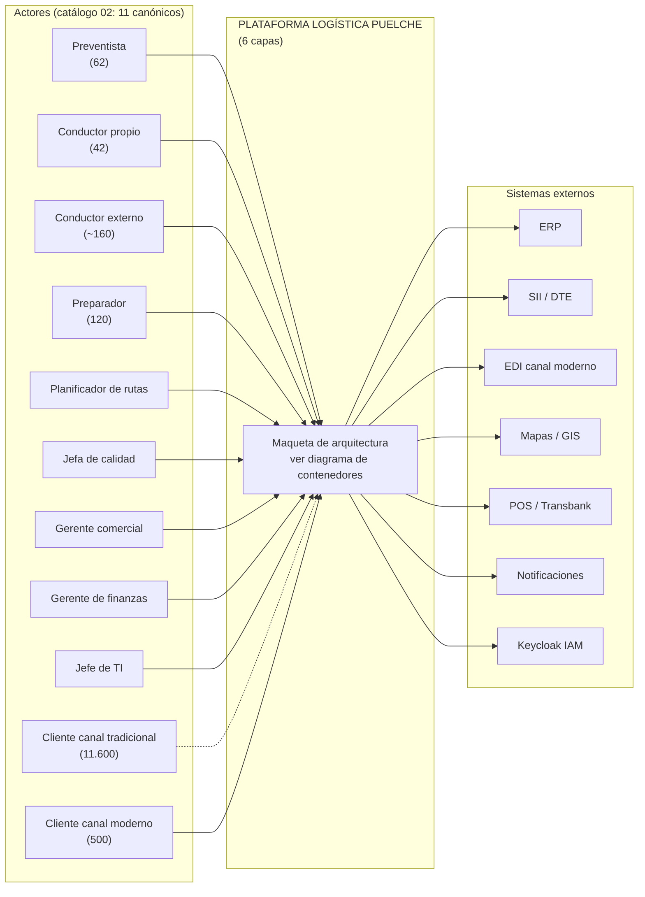

# 04 — Maqueta de Arquitectura Lógica (Puelche S.A. · Caso 2 Logística)

> **Maqueta = esqueleto de diseño lógico.** Capas y componentes que la propuesta deberá llevar a la licitación TFEP-01/2026, **adaptados al caso Puelche** (no copiados de "Pancho"). Cada componente es trazable a requerimientos (RF) y a los **11 actores canónicos** del catálogo `02`.
>
> **Documentos base:** `00` (contexto y cifras) · `01` (esqueleto 6 capas de referencia) · `02` (actores) · `03` (plan) · `05` (herramientas sugeridas).

---

## 1. Vista general — 6 capas (esqueleto de referencia `01` §1, re-mapeado a Logística)

| Capa | Rol en Puelche | Componentes principales |
|---|---|---|
| **1. Cliente** | Personas, dispositivos y sensores de campo | Preventista (62) · Conductores (42 propios + ~160 externos) · Preparadores (120) · Planificador (1) · Jefa de calidad · Gerentes · Jefe de TI · Clientes canal tradicional (11.600) y moderno (500) · Sensores de frío · Telemetría de camiones |
| **2. Presentación** | Superficies donde los actores interactúan | Apps móviles offline (preventa, reparto) · Portales web (clientes, transportistas, proveedores, público) · Consolas internas |
| **3. Negocio** | Lógica de los **12 módulos** del caso | Recepción · Inventario · Preventa · Planificación de rutas · Preparación · Reparto · Cobranza/Rendición · Devoluciones/Envases · Calidad/Trazabilidad · BI/Gerencia · EDI Canal Moderno · Telemetría + Autenticación transversal |
| **4. Cache / Offline / Mensajería** | Rendimiento + **operación sin señal** (1ª clase) | Redis (cache/sesiones) · Colas asíncronas (RabbitMQ) · Buffers locales offline + sincronización idempotente |
| **5. Datos (híbrida)** | Persistencia por CD y consolidación en nube | BD transaccional on-prem por CD · BD analítica consolidada nube · Time-series telemetría · Docs/adjuntos (POD, firmas, DTE) |
| **6. Servicios Externos** | Integraciones de la operación | ERP · WMS · SII/DTE · EDI/AS2 canal moderno · Mapas/GIS · POS/Transbank · Notificaciones · IAM (Keycloak) |

> **Decisión de estilo (importante):** se propone **monolito modular** en **Django (Python)** (todos los módulos en una base de código, separados por apps/contextos) en vez de microservicios completos. Justificación: equipo TI de **4 personas**, 14.200 clientes y 31.000 pedidos/mes no justifican la complejidad distribuida; la modularidad permite extraer apps acopladas (EDI, Telemetría) si el volumen crece.

---

## 2. Capa 1 — Cliente (los 11 actores canónicos)

> **Modelo de actores:** se usan **solo los 11 actores canónicos** del catálogo `02` §1. El set canónico ordena la arquitectura **por tipo de actor** (estilo de la referencia "Pancho", §1.2 del `01`), y cada tipo agrupa las funcionalidades con las que interactúa con el sistema.

### 2.1 Los 11 actores canónicos y su interacción con el sistema

| # | Actor canónico | Dispositivo | Condición operativa | Funcionalidades con que interactúa |
|---|---|---|---|---|
| 1 | **Preventista** (62) | Tablet/smartphone app preventa **offline** | Sin señal; stock/crédito/precio sin conexión | Pedidos, stock, crédito, promociones, precios, sincronización diferida, ID de pedido (RF-03) |
| 2 | **Conductor repartidor propio** (42) | Smartphone app reparto **offline** + impresora térmica | Entrega/firma/QR/cobranza sin señal | Entregas, POD, QR, firma, cobranza, envases, devoluciones, comprobante (RF-06, RF-08) |
| 3 | **Conductor transportista externo** (~160) | App "conductor invitado" + **OTP** | Sin afiliación laboral | Entregas, POD, confirmación de identidad (RF-06) |
| 4 | **Preparador de pedidos** (120) | Terminal con escáner GS1 (HHT) | Turno nocturno, cámara −22 °C **sin señal** | Misiones de picking, escaneo GS1, faltantes, secuenciación térmica (RF-05) |
| 5 | **Planificador de rutas** (1) | Estación/pantalla de planificación | Conocimiento crítico a transferir antes de su retiro | Secuenciación de rutas, ventanas, capacidad, cadena de frío (RF-04) |
| 6 | **Jefa de calidad** | Consola de calidad + sensores | Lectura de sensores de frío y trazabilidad de lote | Trazabilidad, sensores, excursiones térmicas, control sanitario, bloqueo (RF-09) |
| 7 | **Gerente comercial** | Consola/tablero BI | Define promesa de entrega, gestiona canal moderno | OTIF, canal moderno, promesa de entrega (RF-11, RF-12) |
| 8 | **Gerente de finanzas** | Consola/tablero BI | Controla costo logístico y rendición de efectivo | Costo de servir, rendición, indicadores, segmentación (RF-07, RF-11) |
| 9 | **Jefe de TI** (equipo de 4) | Portal de administración TI | Sin capacidad de administrar sistemas adicionales sin soporte | Configuración topológica, usuarios, parámetros, admin del sistema (RF-02.01, transversal) |
| 10 | **Cliente canal tradicional** (11.600) | **Ninguno obligatorio**: recibe aviso por WhatsApp/SMS, confirma con firma/QR del conductor | No cambia su forma de operar | Estado/aviso de entrega, confirmación sin app (RF-06.02) |
| 11 | **Cliente canal moderno** (500) | Portal de clientes + EDI (AS2/API) | Exigencia electrónica desde 2029 | Pedido EDI, estado, documentos, autoservicio (RF-12) |

### 2.2 Roles no-humanos (componentes/dispositivos, `02` §4)

Sensores de temperatura (cámaras/camiones, RF-09.03–04), sistema de monitoreo térmico (RF-09.05), telemetría de camiones (RF-14.01/03/04/06/07/08), `Sistema` (RF-04.04/06/08, RF-05.04) y `Usuario no autenticado` (portal público RF-12.14). Se modelan como componentes de la capa presentación/negocio, no como actores humanos.

---

## 3. Capa 2 — Presentación (superficies)

| Superficie | Público (actor canónico) | Función clave |
|---|---|---|
| **App Preventa (móvil offline)** | Preventista | Pedidos, stock, crédito, promos, sincronización diferida (RF-03.x) |
| **App Reparto (móvil offline)** | Conductores propios y externos | Entregas, POD, QR, firma, cobranza, envases, devoluciones (RF-06.x, RF-08.x) |
| **Consola/estación de planificación** | Planificador de rutas | Secuenciación y modificación de rutas (RF-04) |
| **Consola de calidad** | Jefa de calidad | Trazabilidad, sensores, excursiones térmicas (RF-09) |
| **Tableros BI / consola de gerencia** | Gerente comercial, Gerente de finanzas | OTIF, costo de servir, ocupación de flota (RF-11) |
| **Portal de Administración TI** | Jefe de TI | Configuración topológica, usuarios, parámetros (RF-02.01) |
| **Portal de Clientes** | Cliente canal tradicional y moderno | Estado de cuenta, entregas, documentos tributarios, autoservicio (RF-12.15–12.18) |
| **Portal Público (catálogo)** | Usuario no autenticado | Catálogo consultable sin login (RF-12.14) |
| **Portal de Transportistas** | Empresa transportista / conductores externos | Rutas asignadas, documentación, confirmación conductor/vehículo (RF-12.19–12.21) |
| **Portal de Proveedores** | Proveedor | OC, recepciones, devoluciones y notas de crédito (RF-12.22–12.24) |

> **Pendientes del canal moderno (RF-12):** los portales de transportistas, proveedores y clientes asumen **actores externos** (empresas transportistas y proveedores). En el modelo de 11 canónicos estos se tratan como **roles de portal de entidad externa**, gestionados por la operación (Jefe de TI y canales), no como actores internos adicionales.

---

## 4. Capa 3 — Negocio: los 12 módulos

| Módulo | Épica / RF | Funciones críticas para Puelche | Actor canónico responsable |
|---|---|---|---|
| **M1 Recepción** | RF-01 | Validación vs OC, lote/vencimiento, SSCC, cuarentena, GS1, integración ERP (RF-01.01–01.11) | Preparador / Jefe de TI (integración) |
| **M2 Inventario** | RF-02 | Stock multi-sitio (3 CD), slotting, conteo ciego, FEFO, stock disponible a preventa (RF-02.01–02.10) | Preparador, Jefa de calidad (lote) |
| **M3 Preventa** | RF-03 | Stock y crédito online/offline, reserva, promociones, precios, ID único de pedido offline, dedupe (RF-03.01–03.17) | **Preventista** |
| **M4 Planificación de rutas** | RF-04 | Secuenciación automática, ventanas horarias, cadena de frío, bloqueo por capacidad, costo de entrega (RF-04.01–04.08) | **Planificador de rutas** |
| **M5 Preparación** | RF-05 | Misiones de picking, escaneo GS1, faltantes con motivo, secuenciación térmica, FEFO, carga dirigida (RF-05.01–05.07) | **Preparador de pedidos** |
| **M6 Reparto / Entrega** | RF-06 | POD digital, QR, local cerrado + reagenda, recaudación, envases, comprobante térmico, OTP conductor externo (RF-06.01–06.13) | **Conductores** (propios/externos), Cliente |
| **M7 Cobranza / Rendición** | RF-07 | Rendición digital individual, causales de descuadre, cartera de crédito, POS móvil, interfaz cobranzas→ERP (RF-07.02–07.11) | **Gerente de finanzas**, Conductor (cobra) |
| **M8 Devoluciones / Envases** | RF-08 | Devoluciones en ruta, destino de devueltos, cuenta corriente de envases, mermas al costo de servir (RF-08.01–08.07) | Conductor, Gerente comercial |
| **M9 Calidad / Trazabilidad** | RF-09 | Trazabilidad forward/backward, sensores de frío, excursiones térmicas, control sanitario (RF-09.01–09.10) | **Jefa de calidad** |
| **M10 BI / Gerencia** | RF-11 | OTIF, fill rate, costo de servir, ocupación de flota, tablero real-time, segmentación (RF-11.01–11.08) | **Gerente comercial, Gerente de finanzas** |
| **M11 EDI Canal Moderno** | RF-12 | Pedido EDI (AS2/API), validación, excepciones, ASN, ventana 30 min, acuse digital (RF-12.01–12.13) | **Cliente canal moderno**, Jefe de TI (integración) |
| **M12 Telemetría / Flota** | RF-14 | Integración de telemetría existente (propios), ruta planificada vs real, geocercas, desviaciones, costo de servir (RF-14.01, 14.03, 14.04, 14.06, 14.07, 14.08) | **Gerente comercial / Jefa de calidad** (monitoreo operativo) |
| **⚙ Autenticación (transversal)** | Todos | Login SSO OIDC, MFA, roles por actor (`02`), OTP conductor externo, sesiones de portal | **Jefe de TI** (administración), todos (usuarios) |

> **Trazabilidad:** este cuadro es la columna vertebral: **todo RF cae en un módulo** y todo módulo tiene al menos un **actor canónico** responsable según `02`.

> **M12 / Telemetría — alcance confirmado en sesión:** se integra la **telemetría existente** (RT-17.06) para **uso operativo**: ruta planificada vs real, geocercas, ETA, kilometraje y apoyo a cadena de frío. **No** se usa para **control de jornada ni cámaras en cabina** (objeción del sindicato, L577); se acompaña de plan de gestión del cambio y de los resguardos de geolocalización de personas (Ley 21.719 · RT-05.10 · RT-11.10 · RT-16.09).
>
> **RF-14 ajustado — alcance acotado al enfoque integrador (decisión 2026-09-02):**
> - **RF funcionales vigentes (operativos):** **14.01** (integrar fuente existente), **14.03** (ruta planificada vs real), **14.04** (alerta de desviación), **14.06** (telemetría → costo de servir), **14.07** (identificación conductor–camión, Decisión #5), **14.08** (geocercas para ventana horaria).
> - **RF-14.02 → Supuesto declarado** (deja de ser RF): extensión de telemetría a los 54 camiones externos. Los externos **no están cubiertos** por la fuente (L268) y requieren **acuerdo con cada transportista** (L655/L875) que no existe; no se compromete alcance. Se mantiene la **integración operativa** de la flota externa (estado de entrega, POD, OTP — RF-06/12) pero **sin telemetría de posición**. Supuesto a validar si el negocio logra acuerdos con transportistas.
> - **RF-14.09 → Eliminado**: el **consumo de combustible no es calculable** con la fuente del caso (solo posición/velocidad, L268/L973) y roza la dimensión **mecánica excluida** (L594). El **kilometraje por entrega** queda absorbido por **RF-14.06** (costo de servir). Sin pérdida funcional.
> - **RF-14.05 → Exclusión declarada** (deja de ser RF): registrar tiempo de conducción/descanso desde el GPS es **control de jornada**, objetado por el sindicato (L577) y solo permitido con su acuerdo (RF-14.05 original). Se **excluye** como funcionalidad; se documenta la fundamentación (Cap. 12 régimen de jornada · Decisión #13 · Restricción #10).

---

## 5. Capa 4 — Cache / Offline / Mensajería (la capa "sin señal")

1. **App de preventa offline (RF-03.02, 03.05, 03.16):** el preventista inicia en casa/almacén con **última foto de stock, precios y crédito** replicada localmente (base local cifrada). Genera **UUID de pedido locales**; al recuperar señal sincroniza y el servidor **descarta duplicados por idempotencia** (RF-03.17).
2. **App de reparto offline (RF-06.12):** confirmación de entrega, firma, QR y recaudación se guardan en el dispositivo; sincronización automática de turno (RF-06.07) al volver a cobertura o a la base del CD.
3. **Mensajería asíncrona (colas):** integraciones que no exigen respuesta inmediata (cobranzas→ERP RF-07.09, prep→ERP RF-05.06, EDI RF-12, telemetría RF-14) van por colas con retry y DLQ.
4. **Redis (cache / sesiones / colas ligeras):** caché de consultas calientes (stock disponible, precios, estado de cuenta) y sesiones SSO de portal. En nube se implementa con **Amazon ElastiCache (Redis)**; también sirve de cola ligera/respaldo a RabbitMQ en la sincronización diferida offline. Ver `05` §5.

> **Regla de oro:** **toda escritura offline es idempotente**; el servidor es la fuente de verdad y resuelve conflictos por regla de negocio (última escritura válida según contexto, no por timestamp ciego).

---

## 6. Capa 5 — Datos (híbrida, obligación de licitación)

| Entorno | Contenido | Tecnología (ver `05`) |
|---|---|---|
| **On-premise por CD (3 CDs)** | Transaccional de bodega y operación local (recepción, inventario, preparación) — **maestro WMS** con autonomía 24 h | **PostgreSQL + PostGIS** local por sitio, con réplica (A-02 física) |
| **Nube (OLTP cloud + réplica/DRP del WMS)** | Preventa, reparto, BI + **réplica de continuidad/DRP del WMS on-premise** vía WAL (A-01/A-02 física, DRP nube→on-prem) | **Amazon Aurora PostgreSQL** (compatible PostgreSQL; no es un segundo WMS, es réplica/DRP + OLTP de procesos cloud) |
| **Ingesta IoT / telemetría en frío** | Lecturas de sensores y termógrafos (cadena de frío, -22 °C offline) | **Amazon DynamoDB** (ingesta serverless low-latency, key-value deviceId+timestamp) + **AWS IoT Greengrass** en borde (B-02 física) |
| **Time-series operacional** | Telemetría camiones (posición/velocidad, geolocalización operativa) | **TimescaleDB** (extensión de PostgreSQL) sobre el OLTP de flota, **según dimensionamiento** de muestreo (Cap. 8 — ver `05` §5.1) |
| **Cache / sesiones / colas ligeras** | Stock caliente, precios, sesiones SSO, sincronización diferida offline | **Redis** (Amazon ElastiCache en nube + Redis local) |
| **Documentos / adjuntos** | POD firmado, DTE, comprobantes, evidencia QR | **Amazon S3** (object storage, data lake) + caché local |
| **Analítica / BI (consolidada nube)** | OTIF, costo de servir, BI/gerencia, históricos de cadena de frío, tableros | **Amazon Redshift Serverless** (OLAP), alimentado desde **S3 → Glue ETL** (nunca accede directo a Aurora — separación OLTP/OLAP) |

**Directrices:**
- **Multi-sitio:** `RF-02.02` (consolidación de stock físico multi-sitio) requiere que cada CD informe su stock al consolidado en nube; la venta toma stock en **tiempo real cuando hay conexión** y con **foto local** cuando no.
- **RTO/RPO:** completar con los valores de `Bases_Tecnicas_Transversales.md`; en el `01` §3.6 ya se trazó la implicancia física (piensa siempre en **qué pierde el negocio si un CD queda aislado**).
- **Trazabilidad de lote:** `RF-09.01/09.02` exige consulta forward/backward por lote en todos los entornos (transaccional local + consolidado).

### 6.1 Bases de datos por dominio (nombres de prueba, estilo "Pancho")

> Para tener **noción de cuántas BD se necesitan**, se descompone la capa de datos por **dominio de negocio** (igual que "Pancho": finanzas, control de acceso, RRHH, bodega…). Cada BD se **nombre por su función**. La arquitectura física (ver `markdownsarquitecturafisica/`) es la misma (PostgreSQL+PostGIS on-prem, **Aurora PostgreSQL** en nube, DynamoDB para ingesta IoT, TimescaleDB para series, Redis, S3, Redshift para BI), pero los **objetos (schemas/databases) se separan lógicamente por dominio** para trazabilidad y aislamiento.

| # | BD (nombre propuesto) | Dominio | Guarda | Módulos / RF |
|---|---|---|---|---|
| 1 | **BD_INVENTARIO** | Almacén e inventario | Recepción, ubicaciones, stock por posición, slotting, conteo, lotes | M1, M2 (RF-01, RF-02) |
| 2 | **BD_PREVENTA** | Venta y pedidos | Preventistas, pedidos offline (UUID), stock/crédito, promociones | M3 (RF-03) |
| 3 | **BD_RUTAS** *(con PostGIS)* | Planificación y geocercas | Rutas, secuenciación, ventanas, capacidad, geometrías/geocercas | M4, M12 geocercas (RF-04, RF-14.08) |
| 4 | **BD_PREPARACION** | Bodega / picking | Misiones de picking, escaneo GS1, faltantes, secuenciación térmica | M5 (RF-05) |
| 5 | **BD_REPARTO** | Despacho y entrega | Guías, POD, QR, firmas, estados de entrega, devoluciones en ruta | M6, M8 (RF-06, RF-08) |
| 6 | **BD_COBRANZA_FINANZAS** | Cobranza y cartera | Rendición, cartera de crédito, causales de descuadre, POS, costo de servir | M7, M10 (RF-07, RF-11) |
| 7 | **BD_MAESTROS_CONF** | Maestros y configuración | Catálogo de productos, clientes, bodegas, usuarios, parámetros | transversal (RF-02.01, catalogo RF-12.14) |
| 8 | **BD_GOBIERNO_ACCESO** | Seguridad / IAM | Roles, permisos, sesiones, auditoría de acceso, OTP externos | transversal (Keycloak) |
| 9 | **BD_CALIDAD_TRAZABILIDAD** | Calidad y trazabilidad | Lotes, sensor de frío, excursiones, RTO/lote forward-backward, control sanitario | M9 (RF-09) |
| 10 | **BD_TELEMETRIA** *(TimescaleDB)* | Flota / series de tiempo | Posición/velocidad GPS, eventos de ruta, series de temperatura | M12 (RF-14.01/03/04/06/07/08) |
| 11 | **BD_EDI_CANALMODERNO** | Canal moderno EDI | Pedidos EDI (AS2/API), excepciones, ASN, acuses, integración cadenas | M11 (RF-12) |
| 12 | **BD_BI_GERENCIA** *(analítica nube)* | Analítica / reportes | OTIF, costo de servir, ocupación de flota, segmentación, tableros | M10 (RF-11) |
| 13 | **BD_MAILS_NOTIF** | Notificaciones / mensajería | Colas de avisos (SMS/WhatsApp/push), bitácora de envío | M4, M6, M12 (RF-04.06) |
| 14 | **REDIS_SESIONES_CACHE** *(Redis)* | Cache / sesiones | Stock caliente, precios, sesiones SSO, sincronización offline | Capa 4 |
| 15 | **S3_DOCS** *(S3)* | Documentos / adjuntos | POD firmado, DTE, comprobantes, evidencia QR | M6, M7, portales |

> **Noción de cantidad (resumen):**
> - **12 BD de negocio** (PostgreSQL+PostGIS), separadas lógicamente por dominio, desplegadas como **transaccional on-prem por CD (maestro WMS) + Aurora PostgreSQL en nube (réplica/DRP + OLTP cloud)**, excepto `BD_TELEMETRIA`=TimescaleDB, `BD_BI_GERENCIA`=**Redshift/S3 (analítica nube)**, e ingesta IoT en **DynamoDB**.
> - **1 Redis** (`REDIS_SESIONES_CACHE`) para cache/sesiones/colas ligeras (ElastiCache nube + local).
> - **1 S3** (`S3_DOCS`) para documentos + `s3-*` auxiliares del data lake (raw telemetry, backups, Parquet).
> - **Total ≈ 15 bases/almacenes lógicos con nombre**. No es "15 servidores": en PostgreSQL se agrupan como **schemas/databases en pocos clusters** (una instancia por CD + Aurora analítica/DRP en nube), pero **separados lógicamente** para trazabilidad y permisos por dominio.

---

## 7. Capa 6 — Servicios Externos (integraciones)

| Sistema externo | Protocolo | Módulos consumidores |
|---|---|---|
| ERP existente | REST / API + colas | M1, M5, M7 (RF-01.09, RF-05.06, RF-07.09) |
| WMS (si se mantiene) | REST / EDI | M1, M2, M5 |
| SII / facturación (DTE) | Web service SII | M6, M7, portales (RF-12.17) |
| Canal moderno (cadenas) | **EDI** (AS2 / API) | M11 (RF-12.01–12.13) |
| Mapas / rutas / geocercas | API GIS (direcciones, ETA) | M4, M12 (RF-04.04, RF-14.08) |
| POS móvil / Transbank | API pagos | M7 (RF-07.06) |
| Notificaciones (SMS/WhatsApp/push) | API notificaciones | M4, M6, M12 (RF-04.06) — avisos a 11.600 clientes tradicionales |
| IAM (Keycloak) | **OIDC / SAML 2.0** | Todas las superficies (SSO, MFA, OTP) |

> **Lección de Pancho aplicada (`01` §4):** en la referencia, el módulo de integraciones quedó **vacío**; aquí es una capa de primera clase, porque el caso Puelche **se juega en las integraciones** (ERP, EDI 2029, SII, telemetría).

---

## 8. Seguridad lógica (Zero Trust transversal)

- **IAM central:** Keycloak (OIDC, SSO, MFA) para todos los portales y apps; **perfiles por actor** del catálogo `02` (**11 actores canónicos**).
- **Conductor externo:** acceso **OTP de un solo uso** sin cuenta corporativa (RF-06.08, portal transportistas).
- **App offline:** dispositivo autenticado con token corto + **pinning/MDM opcional**; datos locales cifrados; borrado remoto.
- **Microsegmentación:** cliente web ↔ API de negocio ↔ datos, sin confianza implícita en red interna.
- **Auditoría:** trazabilidad de acciones por actor (crítico para calidad y cobranza); registros inmutables.
- **Zero Trust en colas:** mTLS entre servicios; secretos en vault; rotación automática.
- **Geolocalización de personas (confirmado en sesión):** la telemetría que arrastra GPS de personas se trata con **menor privilegio y alcance acotado** — retención **12 meses** (RT-05.10), **cifrado a nivel de campo** (RT-11.10), **registro de consultas a datos sensibles** (RT-16.09) y cumplimiento **Ley 21.719**. La visibilidad de flota operativa **no** se desliza a control de jornada de conductores (objeción sindical, L577).

---

## 9. Diagramas (C4 — vista contexto y contenedores)

### 9.1 Diagrama de contexto

### 9.2 Diagrama de contenedores (6 capas)

```mermaid
flowchart TB
    subgraph C1["Capa 1 · Cliente"]
        D1["App Preventa<br/>offline (tablet)"]
        D2["App Reparto<br/>offline (smartphone)"]
        D3["Terminal bodega<br/>con escáner GS1"]
        D4["Sensores de<br/>temperatura"]
        D5["Telemetría<br/>camiones"]
    end
    subgraph C2["Capa 2 · Presentación"]
        P1["Portal clientes"]
        P2["Portal transportistas"]
        P3["Portal proveedores"]
        P4["Portal público<br/>catálogo"]
        P5["Consolas<br/>back-office"]
    end
    subgraph C3["Capa 3 · Negocio — módulos"]
        M1["Recepción"]
        M2["Inventario"]
        M3["Preventa"]
        M4["Planificación rutas"]
        M5["Preparación"]
        M6["Reparto entrega"]
        M7["Cobranza / rendición"]
        M8["Devoluciones / envases"]
        M9["Calidad / trazabilidad"]
        M10["BI / gerencia"]
        M11["EDI canal moderno"]
        M12["Telemetría"]
        AUTH["Autenticación<br/>transversal"]
    end
    subgraph C4["Capa 4 · Cache / Offline / Mensajería"]
        R1[("Redis — cache + sesiones<br/>Amazon ElastiCache / local")]
        R2["Colas asíncronas<br/>(RabbitMQ)"]
        R3["Buffers offline<br/>locales (apps)"]
    end
    subgraph C5["Capa 5 · Datos (híbrida)"]
        DB1[("PostgreSQL + PostGIS<br/>on-prem por CD (x3)<br/>maestro WMS + réplica")]
        DB2[("Amazon Aurora PostgreSQL<br/>nube: réplica/DRP WMS<br/>+ OLTP preventa/reparto")]
        DB3[("TimescaleDB<br/>time-series: telemetría")]
        DB4[("Amazon DynamoDB<br/>ingesta IoT / frío")]
        DB5[("Amazon S3 + Redshift Serverless<br/>data lake / analítica BI")]
    end
    subgraph C6["Capa 6 · Servicios externos"]
        X1["ERP"]
        X2["SII / DTE"]
        X3["EDI AS2"]
        X4["Mapas / GIS"]
        X5["POS / Transbank"]
        X6["Notificaciones"]
    end
    C1 --> C2
    C2 --> C3
    C3 --> C4
    C4 --> C5
    C3 --> C6
```

> Los diagramas también se generan como **imagen** para la propuesta final (carpeta `proyecto/diagramas/`):
> - `04_diagrama_contexto.png` / `.svg` (vista de contexto, PlantUML) — **11 actores canónicos**
> - `04_diagrama_contenedores.png` / `.svg` (vista de 6 capas, PlantUML)
> - fuentes `.puml` incluidas para edición

---

## 10. Flujos críticos de ejemplo (para probar la maqueta)

1. **Preventa offline → venta:** preventista toma pedido sin señal (RF-03.02) → app genera UUID (RF-03.16) → sincroniza → dedupe (RF-03.17) → reserva stock (RF-03.03) → valida crédito (RF-03.08/09).
2. **Reparto → POD → rendición:** conductor entrega, captura firma/QR (RF-06.02/11), cobra POS (RF-07.06) sin señal (RF-06.12) → sincroniza turno (RF-06.07) → gerente de finanzas liquida (RF-07.02) → ERP (RF-07.09).
3. **Cadena de frío:** sensor registra (RF-09.03/04) → monitoreo alerta (RF-09.05) → plano de bloqueo del despacho (RF-09.07) → jefa de calidad resuelve (RF-09.06) → evidencia de cumplimiento (RF-09.10).
4. **Canal moderno EDI:** pedido electrónico del cliente moderno (RF-12.01) → validación y resolución de SKU (RF-12.02/03) → ventana 30 min (RF-12.10) → ASN (RF-12.09) → acuse digital (RF-12.13).
5. **Telemetría / flota:** GPS de camiones propios (RF-14.01) → monitoreo operativo (Jefa de calidad/operaciones) detecta desviación de ruta (RF-14.04) y valida geocercas/ventana horaria (RF-14.08) → kilómetros reales por entrega alimentan el costo de servir (RF-14.06) → series en TimescaleDB según dimensionamiento → resguardos de geolocalización (Ley 21.719). **Sin control de jornada ni consumo de combustible** (RF-14.05 y RF-14.09 fuera de alcance), y la telemetría de camiones externos es **supuesto declarado** (RF-14.02).

---

## 11. Lecciones de "Pancho" aplicadas (`01` §4 → esta maqueta)

| Lección de la referencia | Cómo se resuelve aquí |
|---|---|
| Módulo de integraciones vacío | Capa 6 completa + módulo EDI dedicado (M11) |
| Sin dimensión offline | Capa 4 con buffers locales, UUID e idempotencia |
| Tecnologías de cliente pesadas para campo | Apps ligeras offline-first; el cliente tradicional ni siquiera instala app |
| Equipo TI pequeño | Monolito modular Django + stack administrable (`05`), soporte del adjudicatario en 56 meses |
| Ordenar la arquitectura por **tipos de actor** | La capa cliente se organiza por **11 actores canónicos** (`02` §1), no por cargo individual |

---

## 12. Pendientes para cerrar la maqueta

- [x] Modelo de actores definido sobre los **11 canónicos** (`02` §1).
- [ ] Completar RTO/RPO con valores exactos de las Bases.
- [ ] Decidir detalle de API de negocio (contratos) para la matriz de trazabilidad.
- [ ] Puente hacia `05_Herramientas_Sugeridas.md` (stack por capa).
- [ ] **Telemetría:** confirmar dimensión de muestreo → decide adopción de TimescaleDB (`05` §5.1).
