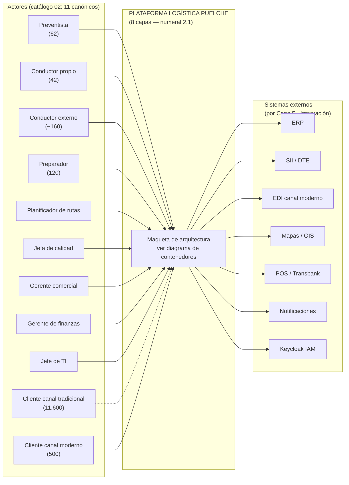
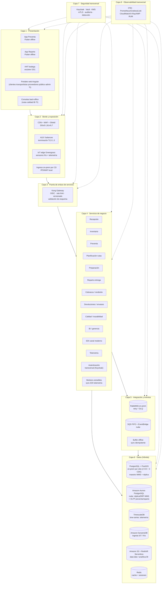
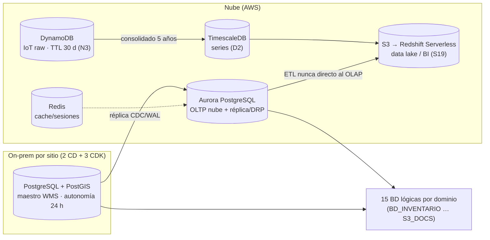
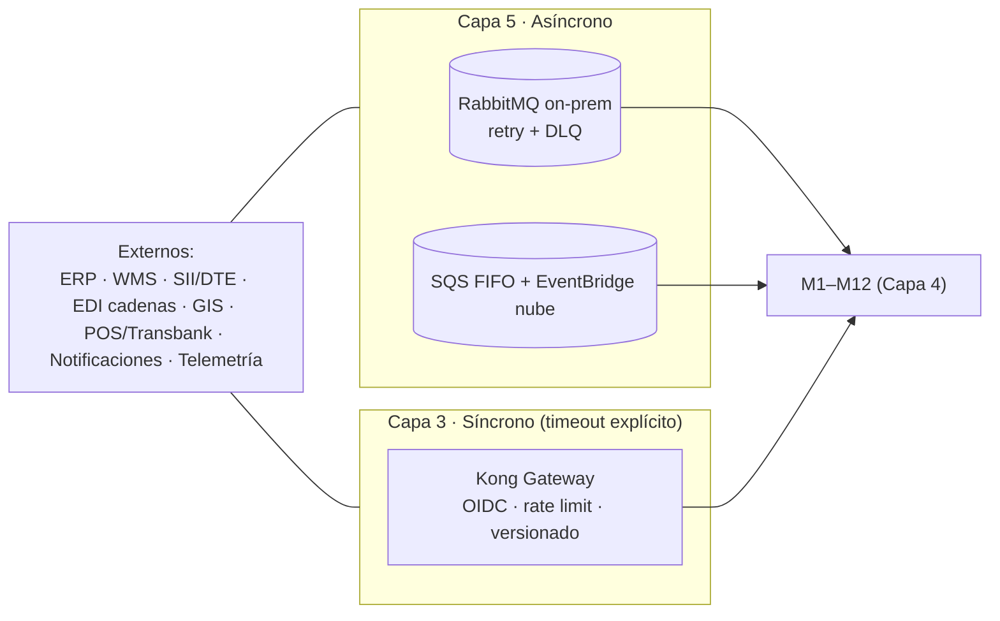
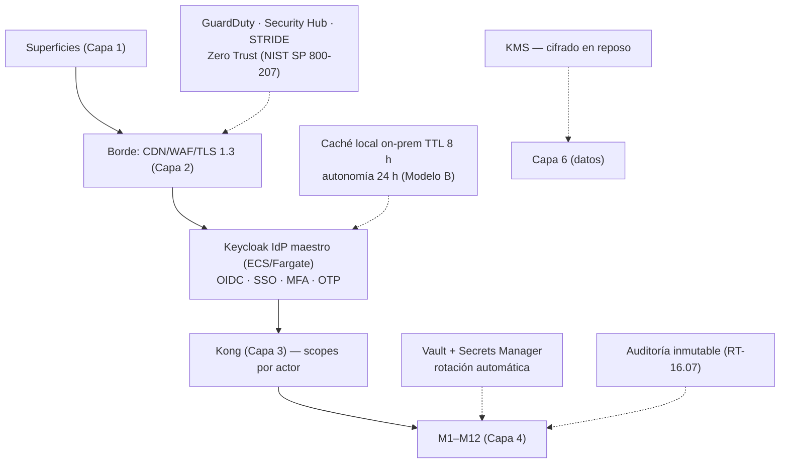

# Arquitectura Lógica v2 — Documento Unificado (Puelche S.A. · Caso 2 Logística)

> **Documento único de la capa lógica (v2).** Unifica en un solo archivo todo el contenido relevante de la arquitectura lógica de los documentos `00` → `08` **más las correcciones de la auditoría T-7/T-21/T-22 (2026-09-04)**: contexto y cifras, marco normativo, referencia metodológica, actores, modelo de **8 capas (RT-02.01)**, módulos M1–M12, datos, seguridad y observabilidad transversales, stack de herramientas, decisiones (D1–D9), notas (N1–N5), supuestos (S01–S30), flujos críticos, diagramas C4, trazabilidad y pendientes.
>
> **Vigencia:** 2026-09-04 (v2). **Supera a `Arquitectura_Logica_v1.md`** (conservado para trazabilidad), a la consolidación `08` (que a su vez superó al `07`). Los documentos `00`–`08` se mantienen como **fuentes de trazabilidad** (cada sección indica su origen).
>
> **Cambios v1→v2 (2026-09-04):** ADR fechados con alternativa evaluada/criterio (§14) · límites de contexto y dependencias inter-módulo (§8.4) · dimensionamiento lógico (§8.5) · TOGAF + ISO/IEC 42010 declarados (§1, §4.3, §19) · NIST SP 800-207 + STRIDE (§11) · vista de procesos formal (§17) · bitácora de reconciliación (Art. 16.4, §9.1) · gobierno de la capa de integración (§9.4) · diagramas de datos/integración/seguridad (§18.3–18.5). Detalle: `_staging/Auditoria_T7_T21_T22.md`.
>
> **Documentos base (origen por sección):** `00` (contexto) · `01` (esqueleto) · `02` (actores) · `03` (plan y decisiones) · `04` (maqueta) · `05` (stack) · `06` (supuestos) · `07_v1` (consolidación 6 capas, superada) · `08` (consolidación 8 capas) · Bases (BA · BTT · Caso 02).

---

## 0. Contexto y marco — el mandante y la operación (origen: `00`)

### 0.1 El mandante

| Antecedente | Detalle |
|---|---|
| **Razón social** | Distribuidora Puelche S.A. (empresa ficticia) |
| **Giro** | Distribución mayorista de productos de consumo masivo (alimentos, bebidas, aseo, cuidado personal) |
| **Fundación** | 1974, Talca — empresa familiar, tercera generación |
| **Ventas anuales** | $148.000 millones |
| **Cobertura** | O'Higgins → La Araucanía |
| **Operación** | Talca (casa matriz + CD principal), Concepción, y **3 plataformas de cross-docking** (Curicó, Chillán, Los Ángeles) → **2 CD + 3 cross-dockings** (N1) |
| **Canales** | Canal tradicional (11.600 almacenes), food service (2.100), cadenas/supermercados (500) |
| **Mandante clave** | Amparo Ossa Bulnes, Gerenta General — condición: *"no cambie al cliente; atiéndalo mejor"* |

### 0.2 Cifras que condicionan todo el diseño (Cap. 15 del caso)

| Indicador | Valor |
|---|---|
| Clientes activos | 14.200 |
| SKU activos | 8.400 (≈1.100 refrigerados/congelados); pasa a ~9.500 según caso |
| Pedidos / mes | 31.000 · 260.000 líneas · 2,4 M unidades |
| Entregas / día hábil | ≈1.400 (peak septiembre ≈2.600, ~2× volumen durante 3 semanas) |
| Kms / mes | ≈420.000 |
| Docs tributarios / mes | ≈34.000 |
| Envases retornables | 68.000 canastillos y 9.400 pallets (pérdida estimada 14 % anual) |
| Conteo cíclico / merma | Diferencia 2,3 % del valor contado · merma por vencimiento 1,7 % |
| OTIF base | 82,4 % de entregas completas y a tiempo |
| Ventana crítica | Despacho 05:30–07:00 con **cero indisponibilidad** (96 camiones) |

### 0.3 Dolencias centrales que la propuesta debe resolver

1. **Trazabilidad de lote** — retiro sanitario tardó 9 días y no se pudo entregar lista (pérdida $31 M; proveedor suspendió a Puelche por 6 meses).
2. **Promesa de entrega** — no se puede comprometer plazos; ventana de entrega de 30 min del canal moderno en 2029 (riesgo de perder el **11 % de la venta**).
3. **Costo de servir** — $4,2 M/mes de diferencia de rendición sin investigar.

### 0.4 La operación tal como es hoy (puntos críticos)

- **Preventa:** 62 preventistas en terreno con app obsoleta (sin stock, sin deuda del cliente, se cae y duplica pedidos).
- **Preparación nocturna:** ~120 personas, picking con hoja impresa; rotación 38 %/año; cámara de congelado a −22 °C sin señal.
- **Despacho:** ventana crítica 05:30–07:00 → 96 camiones; "si el sistema se cae en esa ventana, no hay operación".
- **Reparto:** ~200 conductores (42 propios + ~160 de transportistas externos, 10 empresas); rutas sin señal (Cauquenes, Villa Alegre); guías de papel; efectivo en ruta ($1–1,5 M) con riesgo de seguridad; **sin protocolo ante local cerrado**.
- **Planificador de rutas:** 1 persona, 21 años, planilla de 11 hojas; **se jubila en 2 años** (riesgo de conocimiento clave).
- **Calidad:** sin registro continuo de temperatura, sin sistema consultable de lotes, **sin regla escrita de excursión térmica**.
- **TI:** equipo de 4 personas; sala de 25 m² con UPS de 10 min; sin documentación de interfaces del ERP (implantado 2017; partner ya no trabaja con ellos).

### 0.5 Trabajo de traducción exigido (Cap. 17 del caso)

- Catálogo de **requerimientos funcionales** (ID, descripción, **actor**, precondición, resultado esperado, prioridad, origen) — ya existe como hoja `consolidado de requerimientos F` (RF-01…RF-14, 138 requerimientos).
- Catálogo de **requerimientos no funcionales** (umbral numérico y método de verificación).
- **Registro de supuestos** · **registro de reglas de negocio** · **matriz de trazabilidad** · **registro de vacíos y consultas**.
- **Asuntos propios del caso (Cap. 17.4):** qué se ejecuta en cada CD y qué en nube (y por qué); operación ante corte de enlace y reconciliación; dispositivo de reparto un turno completo sin señal y resolución de conflictos; captura en cámara de congelado (−22 °C); integración con ERP y DTE; qué hacer con el WMS 2013; modelo de trazabilidad de lote; evidencia de entrega + guía electrónica/acuse; conductores externos; canal moderno EDI (2029); separación transaccional vs analítico; sala de servidores actual; absorción del peak de septiembre.

---

## 1. Principios rectores y restricciones del marco (origen: `03` §2, `00` §5, AGENTS)

**Precedencia de fuentes (Art. 5° BA):** `Bases Administrativas` > `Bases Técnicas Transversales` > `Caso 02 Logística`. El caso puede **endurecer** un requisito transversal, nunca rebajarlo.

Principios rectores (no negociables):

1. **Offline / sin señal es requisito de primera clase** — preventa, reparto y bodega operan sin conexión; la sincronización es diferida e **idempotente**.
2. **El cliente del canal tradicional no cambia su forma de operar** — el sistema se adapta a él, no al revés.
3. **Híbrido cloud + on-premise es obligatorio** (Art. 16) — núcleo transaccional por CD + analítica/integración en nube. No se admiten propuestas solo-nube ni solo-on-prem.
4. **Cronograma de 56 meses innegociable** (Art. 17) — Etapa 1 (meses 1–15, producción mes 16), Etapa 2 (meses 13–20, producción mes 21), Operación 36 meses.
5. **Zero Trust y multi-zona** — IAM central (OIDC/MFA), microsegmentación, IaC, sin confianza implícita en la red.
6. **5 innovaciones obligatorias** (Cap. 5 BA) y **5 ambientes + DR** (RT-04.01).
7. **Equipo TI pequeño (4 personas)** — todo componente administrable por el equipo de Puelche o por soporte del adjudicatario en los 56 meses.
8. **Consistente con la misma licitación de "Pancho" pero NO copiado** — misma estructura de capas, contenido 100 % re-mapeado a Logística.
9. **Marco de gobierno arquitectónico: TOGAF declarado, descripción conforme a ISO/IEC/IEEE 42010** (glosario BA) — vistas lógica (§4–§12), de procesos (§17), de datos (§10), de seguridad (§11) y de despliegue (física, pendiente); **ADR fechado y fundado** (§14, RT-02.04).

**Inconsistencias detectadas en las Bases (a resolver en consultas, no unilateralmente):** instalaciones 5 vs 6 (§8 vs Tabla 14.1/RT-21.16); ponderación T-21 suma 98 %; ambientes 4 vs 5 (Art. 24 vs Transversales → prevalecen 5 + DR); códigos RT mal mapeados en la tabla del Caso Cap. 15 (RT-03.24→03.23, RT-03.13→03.12, RT-05.10→16.10, RT-06.01 tipología); instalaciones vs conductores/camiones (42 propios = camiones, ≈84 personas §2.4); T-22 vs entregables Cap. 17.1 (viven dentro del registro de requerimientos); fechas de calendario T-20/T-22; identificador TFEP-01/2026; desconexión 2 h (nominal) vs turno 14 h (contingencia).

---

## 2. Referencia metodológica — esqueleto de "Pancho" y lecciones aplicadas (origen: `01`, `04` §11)

"Pancho" (Caso 4 — Salud, solución HospiNet) es de la **misma licitación** pero otra industria: su arquitectura lógica es **patrón/referencia**, no contenido.

### 2.1 Modelo de capas de la referencia (6 capas)

```
┌─────────────────────────────────────────────────────────┐
│ 1. CAPA CLIENTE        actores / usuarios finales       │
│ 2. CAPA PRESENTACIÓN   portales + app móvil + web        │
│ 3. CAPA DE NEGOCIO     módulos funcionales (dominios)    │
│ 4. CAPA CACHE          entre negocio y datos             │
│ 5. CAPA DE DATOS       híbrida: datacenter local + nube  │
│ 6. CAPA SERVICIOS EXTERNOS  terceros                    │
└─────────────────────────────────────────────────────────┘
```

### 2.2 Lecciones/vacíos de "Pancho" y cómo se resuelven en Puelche

| Lección de la referencia (`01` §4) | Cómo se resuelve aquí |
|---|---|
| Módulo de integraciones vacío ("AÑADIR DESCRIPCIÓN") | Capa 5 (Integración y eventos) de **primera clase** + módulo EDI dedicado (M11) (lección del `01` §1.4 aplicada en `04` §7) |
| Ordenar la arquitectura por **tipos de actor** | La capa cliente se organiza por **11 actores canónicos** (`02` §1), no por cargo individual |
| Sin dimensión offline (salud asume conectividad) | Capa 4/5 con buffers locales, UUID e idempotencia; el offline es ciudadano de primera clase |
| Tecnologías de cliente pesadas para campo | Apps ligeras **offline-first** (Flutter); el cliente tradicional ni siquiera instala app |
| Superposición nube/outpost sin aclarar | Se justifica componente por componente (Cap. 17.4 punto 1): bodega on-prem, preventa/reparto en nube |
| Equipo TI pequeño | Monolito modular Django + stack administrable + soporte del adjudicatario en 56 meses |
| Integraciones para el caso que "Pancho" no tiene | ERP 2017, WMS 2013, **EDI** canal moderno, GPS/telemetría, escaneo GS1, sensores de frío |

---

## 3. Modelo de actores (origen: `02`, `08` §2)

> **Decisión D3:** la arquitectura se construye sobre los **11 actores canónicos** (ordenados por tipo de actor, estilo "Pancho"). Los A1–A16 del `02` §3 quedan **documentados pero NO integrados** (S06/S07): ningún RF queda sin actor con el set canónico; los roles especializados (bodega, excepciones EDI, entidades externas) se gestionan como perfiles de portal o funcionalidad.

### 3.1 Los 11 actores canónicos — rol, dispositivo, condición y funcionalidades

| # | Actor canónico | Rol / ineficiencia que enfrenta | Dispositivo | Condición operativa | Funcionalidades con que interactúa |
|---|---|---|---|---|---|
| 1 | **Preventista** (62) | Toma pedidos y cobra en terreno; app obsoleta sin stock/crédito | Tablet/smartphone app preventa **offline** | Sin señal; stock/crédito/precio sin conexión | Pedidos, stock, crédito, promociones, precios, sincronización diferida, ID de pedido (RF-03) |
| 2 | **Conductor repartidor propio** (42) | Entrega y cobra; sin protocolo ante local cerrado; efectivo en ruta | Smartphone app reparto **offline** + impresora térmica | Entrega/firma/QR/cobranza sin señal | Entregas, POD, QR, firma, cobranza, envases, devoluciones, comprobante (RF-06, RF-08) |
| 3 | **Conductor de transportista externo** (~160) | No es trabajador de Puelche; rota sin aviso; incorporación requiere acuerdo con cada transportista | App "conductor invitado" + **OTP** | Sin afiliación laboral | Entregas, POD, confirmación de identidad (RF-06.08) |
| 4 | **Preparador de pedidos** (120) | Picking con hoja impresa, turno nocturno, rotación 38 %/año | Terminal con escáner GS1 (HHT) | Turno nocturno, cámara −22 °C **sin señal** | Misiones de picking, escaneo GS1, faltantes, secuenciación térmica (RF-05) |
| 5 | **Planificador de rutas** (1) | Conocimiento crítico concentrado; se jubila en 2 años | Estación/pantalla de planificación | Conocimiento crítico a transferir antes de su retiro | Secuenciación de rutas, ventanas, capacidad, cadena de frío (RF-04) |
| 6 | **Jefa de calidad** | Sin registro continuo de temperatura ni regla de excursión térmica | Consola de calidad + sensores | Lectura de sensores de frío y trazabilidad de lote | Trazabilidad, sensores, excursiones térmicas, control sanitario, bloqueo (RF-09) |
| 7 | **Gerente comercial** | No puede comprometer plazos; riesgo 11 % ventas 2029 | Consola/tablero BI | Define promesa de entrega, gestiona canal moderno | OTIF, canal moderno, promesa de entrega (RF-11, RF-12) |
| 8 | **Gerente de finanzas** | Sin costo de servir real; $4,2 M/mes de diferencias de rendición | Consola/tablero BI | Controla costo logístico y rendición de efectivo | Costo de servir, rendición, indicadores, segmentación (RF-07, RF-11) |
| 9 | **Jefe de TI** (equipo de 4) | No puede administrar sistemas adicionales sin soporte | Portal de administración TI | Sin capacidad de administrar sistemas sin soporte | Configuración topológica, usuarios, parámetros, admin del sistema (RF-02.01, transversal) |
| 10 | **Cliente canal tradicional** (11.600) | No tiene internet ni dispositivo; no puede cambiar su forma de operar | **Ninguno obligatorio**: aviso WhatsApp/SMS, confirma con firma/QR del conductor | No cambia su forma de operar | Estado/aviso de entrega, confirmación sin app (RF-06.02) |
| 11 | **Cliente canal moderno** (500) | Exige integración electrónica (EDI) desde enero 2029 | Portal de clientes + **EDI (AS2/API)** | Exigencia electrónica desde 2029 | Pedido EDI, estado, documentos, autoservicio (RF-12) |

### 3.2 Roles no-humanos (sistemas/dispositivos — `02` §4)

| Entrada | Tratamiento |
|---|---|
| `Sistema` (RF-04.04/04.06/04.08, 05.04) | Componente automático → actor `Sistema` + humano responsable/beneficiario |
| `Aplicación de preventa` (RF-03.16) | Componente de presentación; actor real = **Preventista** |
| `Sensor de temperatura` (RF-09.03/09.04) | Dispositivo de captura en **Capa 2 (Borde IoT)**; responsable = **Jefa de calidad** |
| `Sistema de monitoreo` (RF-09.05) | Alerta automática (Capa 8); destinataria = **Jefa de calidad** |
| `Usuario no autenticado` (RF-12.14) | Rol público del portal (catálogo), no actor de negocio |
| Telemetría de camiones (RF-14) | Fuente externa integrada en Capa 5/6 (M12); uso **operativo** |

### 3.3 Actores adicionales A1–A16 (`02` §3) — supuestos declarados, NO integrados

Roles documentados con su justificación (jefe de bodega, recepcionista, operador de bodega, jefe de operaciones, jefe de flota, cajero liquidador, ejecutivo de cobranza, supervisor de crédito, administrador comercial, jefe de abastecimiento, administrador de sistema, operador de excepciones EDI, centro de control, cargador, empresa transportista —entidad externa—, proveedor —entidad externa—). **Decisión 2026-09-01:** no se integran a la maqueta; quedan como referencia para futuras ampliaciones de perfiles (S07). Proveedores y transportistas se tratan como **roles de portal de entidad externa** (S09).

### 3.4 Interacción actor ↔ capas (resumen)

- **Terreno sin señal:** Preventista y conductores usan apps de la **Capa 1** (offline-first) con foto local de datos y captura local cifrada; sincronizan al volver a cobertura **por Capa 2 → Capa 3 (Gateway)** con **UUID idempotente** (RF-03.16/17, RF-06.07/12).
- **Bodega (−22 °C sin señal):** Preparador opera **HHT/escáner GS1** con misión descargada; autonomía local **24 h** (RNF-13.01/RT-03.10) y token offline TTL 8 h (Capa 7).
- **Back-office con conexión:** Planificador, Jefa de calidad, Gerentes y Jefe de TI por consolas/portales con **SSO OIDC (Keycloak)** y MFA; todo tráfico pasa por Borde → Gateway.
- **IoT / flota:** sensores de frío y telemetría entran por **Greengrass (Capa 2)** con buffer de reenvío y persistencia local durante los cortes.
- **Clientes:** canal tradicional no instala nada (aviso WhatsApp/SMS + firma/QR); canal moderno por **portales y EDI (AS2)**.
- **Externos:** conductores de transportistas con **OTP** de un solo uso; proveedores/transportistas por portales de entidad externa.

---

## 4. Modelo de capas — 8 capas canónicas (origen: `08` §1, numeral 2.1 / RT-02.01)

La solución se organiza en las **ocho capas de existencia obligatoria** del numeral 2.1 de las Bases Técnicas Transversales. La tecnología de cada capa se justifica en §13.

```
┌───────────────────────────────────────────────────────────────┐
│ 8 · OBSERVABILIDAD TRANSVERSAL     OTel · Prom/Grafana/Loki    │
│ 7 · SEGURIDAD TRANSVERSAL          Keycloak + Vault + KMS      │
│ 6 · DATOS (híbrida)                PG+PostGIS·Aurora·DynamoDB· │
│     TimescaleDB·S3·Redshift·Redis                              │
│ 5 · INTEGRACIÓN Y EVENTOS          RabbitMQ·SQS·EventBridge    │
│ 4 · SERVICIOS DE NEGOCIO           M1–M12 (stateless)          │
│ 3 · PUERTA DE ENLACE DE SERVICIOS  API Gateway (Kong)          │
│ 2 · BORDE Y EXPOSICIÓN             CDN·WAF·TLS 1.3·IoT edge    │
│ 1 · PRESENTACIÓN                   apps Flutter·portales·HHT   │
└───────────────────────────────────────────────────────────────┘
```

| Capa | Rol en Puelche | Componentes principales | Exigencias del numeral 2.1 |
|---|---|---|---|
| **1. Presentación** | Superficies de los 11 actores | Apps móviles **offline-first** (Flutter) · portales web (Angular) · consolas back-office · HHT con escáner GS1 | Adaptativo, accesible y **sin lógica de negocio**; ninguna interfaz accede directo a la BD |
| **2. Borde y exposición** | Único punto de entrada público, terminación de cifrado y borde IoT | **CloudFront** CDN · **WAF + Shield** · ALB/HAProxy · **TLS 1.3** · ingreso on-prem por CD con IPS/WAF · **IoT Greengrass** | CDN, WAF gestionado, DDoS L3/L4/L7, TLS 1.3 |
| **3. Puerta de enlace de servicios** | Publicación y gobierno de APIs de negocio y de sync offline | **Kong Gateway** (OIDC/Keycloak) nube y on-prem · validación de esquema · rate limiting · cuotas · versionado | Validación de esquema, inspección de carga útil, trazabilidad por transacción, catálogo de servicios |
| **4. Servicios de negocio** | Lógica de los **12 módulos** con límites de contexto explícitos | Monolito modular **Django** (M1–M12) **stateless** + workers extraíbles (EDI, Telemetría, Sync) | Sin estado, despliegue independiente de los críticos, contratos versionados retro-compatibles |
| **5. Integración y eventos** | Comunicación asíncrona, desacoplamiento y orquestación | **RabbitMQ** (on-prem) + **SQS FIFO/EventBridge** (nube) · DLQ · retry · dedupe · sync offline idempotente | Bus con persistencia, cola de mensajes fallidos, reintento y deduplicación |
| **6. Datos** | Persistencia transaccional, analítica, documental, series de tiempo y archivos | **PostgreSQL+PostGIS** on-prem por sitio · **Aurora** nube · **DynamoDB** IoT · **TimescaleDB** · **Redis** · **S3** · **Redshift Serverless** | Separación transaccional/analítica, cifrado en reposo, respaldo y retención declarados |
| **7. Seguridad transversal** | Identidad, autorización, secretos, cifrado, auditoría y detección | **Keycloak** (OIDC/MFA/SSO/OTP) · **Vault** + Secrets Manager · **KMS** · mTLS · auditoría inmutable · GuardDuty/Security Hub | Aplicada a todas las capas, no como perímetro único |
| **8. Observabilidad transversal** | Métricas, registros y trazas distribuidas correlacionadas | **OpenTelemetry** · Prometheus/Grafana/Loki (on-prem) · CloudWatch/X-Ray/AMP (nube) · RUM apps campo | Instrumentación OTel, cobertura nube + on-prem sin puntos ciegos |

### 4.1 Mapeo del modelo anterior (6 capas → 8 capas)

| Capa `07` (anterior) | Destino en el modelo de 8 capas |
|---|---|
| 1. Cliente (actores) | Se separa: **dispositivos/superficies → Capa 1 (Presentación)**; **sensores y telemetría → Capa 2 (Borde, IoT edge)** |
| 2. Presentación | Capa 1 — **sin lógica de negocio**: valida forma y captura local idempotente; stock/crédito/promos son **foto de datos de lectura**, las reglas viven en Capa 4 |
| 3. Negocio (M1–M12) | Capa 4 — **stateless** (RT-02.05): sesión y estado de proceso en almacenes externos |
| 4. Cache/Offline/Mensajería | **Se reparte (N4):** mensajería asíncrona → **Capa 5**; buffers offline de apps → **Capa 1/2**; Redis cache/sesiones → **Capa 6** |
| 5. Datos (híbrida) | Capa 6 |
| 6. Servicios Externos | **Desaparece como capa propia (N5):** externos entran por **Capa 5** (síncronos vía Gateway Capa 3, asíncronos por colas) |

### 4.2 Interfaces entre capas (contratos — exigencia literal de RT-02.01)

| Interfaz | Capas | Contrato / protocolo |
|---|---|---|
| Presentación → Borde | 1 → 2 | HTTPS/TLS 1.3; WebSocket push para avisos |
| Borde → Puerta de enlace | 2 → 3 | HTTPS/TLS 1.3 terminado en WAF/ALB |
| Puerta de enlace → Negocio | 3 → 4 | OpenAPI `/v1`; autenticación OIDC (Keycloak) en el gateway |
| Negocio → Integración | 4 → 5 | Mensajería asíncrona (AMQP 0.9.1 / SQS API), DLQ, retry |
| Negocio → Datos | 4 → 6 | ORM/GeoDjango (PostGIS); escrituras por aplicación, nunca desde la UI |
| Borde IoT → Integración/Datos | 2 → 5/6 | MQTT/TLS → Greengrass → Ingesta (DynamoDB/TimescaleDB) |
| Seguridad → todas | 7 → 1..6 | OIDC/mTLS; secretos en Vault/Secrets Manager; KMS para cifrado en reposo |
| Observabilidad → todas | 8 → 1..6 | OTel spans/traces con `transaction_id`; push métricas/logs |

### 4.3 Cumplimiento RT-02.x (mapa para el T-12)

| Código | Dónde se declara | Estado |
|---|---|---|
| RT-02.01 (8 capas + diagrama) | Este documento (§4 + §4.2) + §18 (C4) | ☑ |
| RT-02.02 (modular, despliegue independiente de críticos) | §8.2 (workers extraíbles EDI/Telemetría/Sync) | ☑ |
| RT-02.03 (vistas ISO/IEC 42010) | Lógica (este doc), procesos (§17), datos (§10), seguridad (§11); física pendiente · marco de gobierno **TOGAF declarado** (§1 #9, §19) | ☑/parcial (solo falta la vista física) |
| RT-02.04 (ADR fechado) | §14 (D1–D9) — registro vivo | ☑ |
| RT-02.05 (negocio sin estado) | §8.2 | ☑ |
| RT-02.06 (idempotencia) | §9.1, §8 (regla de oro UUID) | ☑ |
| RT-02.07 (eventos ≥1 vez + dedupe + orden) | §9.1 | ☑ |
| RT-02.08 (resiliencia) | §9.3 (retry exponencial, cortacircuitos, timeouts obligatorios) | ☑ |
| RT-02.09 (degradación elegante) | §9.3 (operación local si la nube falla; modo reducido informado) | ☑ |
| RT-02.10 (autoescalado apps e integración) | §8.3 (Fargate autoscaling + límites/costo en la oferta) | ☑ |
| RT-02.11 (SPOF declarados) | Física consolidada (pendiente) — no omitir | pendiente |
| RT-02.12 (replicación/parametrización) | §10.3 (multi-sitio RF-02.02) | ☑ |
| RT-02.13 (modelo de dominio) | Matriz de trazabilidad Cap. 17 (entidades ↔ eventos) | en elaboración |
| RT-02.14 (Deseable: anticorrupción/estrangulamiento) | Física §7 de integraciones (ERP 2017 sin interfaces) | ☑/parcial |

---

## 5. Capa 1 · Presentación — superficies y frameworks (origen: `08` §3)

### 5.1 Superficies

| Superficie | Público (actor canónico) | Función clave |
|---|---|---|
| **App Preventa** (móvil offline) | Preventista | Pedidos, stock, crédito, promos, sincronización diferida (RF-03.x) |
| **App Reparto** (móvil offline) | Conductores propios y externos | Entregas, POD, QR, firma, cobranza, envases, devoluciones (RF-06.x, RF-08.x) |
| **Consola/estación de planificación** | Planificador de rutas | Secuenciación y modificación de rutas (RF-04) |
| **Consola de calidad** | Jefa de calidad | Trazabilidad, sensores, excursiones térmicas (RF-09) |
| **Tableros BI / consola de gerencia** | Gerente comercial y de finanzas | OTIF, costo de servir, ocupación de flota (RF-11) |
| **Portal de Administración TI** | Jefe de TI | Configuración topológica, usuarios, parámetros (RF-02.01) |
| **Portal de Clientes** | Canal tradicional y moderno | Estado de cuenta, entregas, documentos tributarios, autoservicio (RF-12.15–12.18) |
| **Portal Público (catálogo)** | Usuario no autenticado | Catálogo consultable sin login (RF-12.14) |
| **Portal de Transportistas** | Empresa transportista / conductores externos | Rutas asignadas, documentación, confirmación (RF-12.19–12.21) |
| **Portal de Proveedores** | Proveedor | OC, recepciones, devoluciones y notas de crédito (RF-12.22–12.24) |

### 5.2 Reglas de la capa

- **Sin lógica de negocio:** las apps de campo mantienen **foto local de datos de lectura** (stock, precios, crédito, rutas) y **captura local de eventos** (pedidos, POD, firmas); las **reglas** (crédito, promociones, FEFO, secuenciación térmica) se evalúan siempre en la Capa 4.
- **Escritura idempotente:** todo evento generado offline lleva **UUID** y se envía por Gateway con deduplicación en el servidor (RT-02.06, RF-03.17).
- **Sin acceso directo a datos:** ninguna interfaz se conecta a la Capa 6; todo consumo es por API vía Capa 3.

### 5.3 Frameworks (justificación en §13)

**Angular + Tailwind** (portales y consolas web, OIDC/Keycloak) · **Flutter** (apps de campo offline-first: preventa/reparto) · **Django admin** (consolas internas para el equipo de 4).

---

## 6. Capa 2 · Borde y exposición (origen: `08` §4)

Único punto de entrada público de la plataforma; en Puelche además es el **borde de terreno y bodega**, donde la conectividad es intermitente.

| Componente | Rol | Exigencia numeral 2.1 |
|---|---|---|
| **CDN (CloudFront)** | Distribución de contenido estático de portales y catálogo público | CDN |
| **WAF gestionado** | Filtrado de tráfico en el borde (OWASP Top 10 + reglas custom por API) | WAF gestionado |
| **Shield / protección DDoS** | Mitigación en capas 3, 4 y 7 | Protección DDoS L3/L4/L7 |
| **ALB / HAProxy** | Balanceo y terminación de **TLS 1.3** hacia el Gateway | Terminación de cifrado TLS 1.3 |
| **Ingreso on-prem por CD** | Único punto de entrada local (IPS/WAF de sitio) para consolas y tráfico de bodega | Borde también del lado on-premise |
| **AWS IoT Greengrass** | Borde IoT en terreno/almacenes: recolecta sensores de frío y telemetría, filtra y **bufferiza** durante cortes, reenvía al volver cobertura (MQTT/TLS) | — |
| **Dispositivos offline (borde delgado)** | Apps de preventa/reparto: cola local de eventos cifrada que se entrega por el Gateway al reconectar | — |

> **Cero indisponibilidad en la ventana 05:30–07:00:** borde y Gateway con redundancia activa en nube y **autonomía local on-prem** para que el despacho no dependa del enlace (RT-03.10: 24 h CD · 14 h terreno).

---

## 7. Capa 3 · Puerta de enlace de servicios (origen: `08` §5)

> **Decisión D8 (2026-09-04):** **Kong Gateway**. Alternativa: AWS API Gateway. Kong es **open source** (sin lock-in), opera igual en nube y on-prem (una instancia por sitio), integración **OIDC nativa con Keycloak** y trazabilidad por transacción.

| Función | Detalle |
|---|---|
| **Publicación de APIs** | Catálogo de servicios de negocio (`/v1`) y de **sincronización offline** (`/sync/v1`, escrituras idempotentes con UUID) |
| **Autenticación / autorización** | OIDC con **Keycloak** (Capa 7); valida `access_token` y scopes por actor antes de llegar a la Capa 4 |
| **Cuotas y límites de tasa** | **Rate limiting** por cliente/actor y endpoint; cuotas por tipo de tráfico (peso: preventa, reparto, EDI) |
| **Versionado** | Contratos versionados `/v1`; **compatibilidad hacia atrás** (RT-02.02) |
| **Inspección de carga útil** | **Validación de esquema** (OpenAPI) y saneamiento de payload (anti-inyección) |
| **Trazabilidad por transacción** | Asigna `transaction_id` a cada llamada; lo propaga a Capa 8 |
| **Observabilidad de APIs** | Métricas de latencia/error/volumen por ruta en Grafana (Capa 8) |

> **Sync offline formalizado:** la sincronización de preventa/reparto y misiones de picking **es tráfico de API de primera clase**: entra por el Gateway, valida esquema y deduplica (RT-02.06). Cierra el diseño offline-first sin romper el modelo de 8 capas.

---

## 8. Capa 4 · Servicios de negocio — los 12 módulos (origen: `08` §6, `04` §4)

### 8.1 Módulos (columna vertebral: todo RF cae en un módulo y todo módulo tiene actor responsable)

| Módulo | Épica / RF | Funciones críticas | Actor canónico responsable |
|---|---|---|---|
| **M1 Recepción** | RF-01 | Validación vs OC, lote/vencimiento, SSCC, cuarentena, GS1, integración ERP (RF-01.01–01.11) | Preparador / Jefe de TI (integración) |
| **M2 Inventario** | RF-02 | Stock multi-sitio (**2 CD + 3 cross-dockings**), slotting, conteo ciego, FEFO, stock disponible (RF-02.01–02.10) | Preparador, Jefa de calidad (lote) |
| **M3 Preventa** | RF-03 | Stock y crédito online/offline, reserva, promociones, precios, ID único offline, dedupe (RF-03.01–03.17) | **Preventista** |
| **M4 Planificación de rutas** | RF-04 | Secuenciación automática, ventanas horarias, cadena de frío, bloqueo por capacidad, costo de entrega (RF-04.01–04.08) | **Planificador de rutas** |
| **M5 Preparación** | RF-05 | Misiones de picking, escaneo GS1, faltantes con motivo, secuenciación térmica, FEFO, carga dirigida (RF-05.01–05.07) | **Preparador de pedidos** |
| **M6 Reparto / Entrega** | RF-06 | POD digital, QR, local cerrado + reagenda, recaudación, envases, comprobante térmico, OTP externo (RF-06.01–06.13) | **Conductores** (propios/externos), Cliente |
| **M7 Cobranza / Rendición** | RF-07 | Rendición digital individual, causales de descuadre, cartera de crédito, POS móvil, interfaz cobranzas→ERP (RF-07.02–07.11) | **Gerente de finanzas**, Conductor (cobra) |
| **M8 Devoluciones / Envases** | RF-08 | Devoluciones en ruta, destino de devueltos, cuenta corriente de envases, mermas al costo de servir (RF-08.01–08.07) | Conductor, Gerente comercial |
| **M9 Calidad / Trazabilidad** | RF-09 | Trazabilidad forward/backward, sensores de frío, excursiones térmicas, control sanitario (RF-09.01–09.10) | **Jefa de calidad** |
| **M10 BI / Gerencia** | RF-11 | OTIF, fill rate, costo de servir, ocupación de flota, tablero real-time, segmentación (RF-11.01–11.08) | **Gerente comercial, Gerente de finanzas** |
| **M11 EDI Canal Moderno** | RF-12 | Pedido EDI (AS2/API), validación, excepciones, ASN, ventana 30 min, acuse digital (RF-12.01–12.13) | **Cliente canal moderno**, Jefe de TI (integración) |
| **M12 Telemetría / Flota** | RF-14 (acotado) | Integración fuente existente (propios), ruta planificada vs real, geocercas, desviaciones, costo de servir (RF-14.01/03/04/06/07/08) | **Gerente comercial / Jefa de calidad** (monitoreo operativo) |
| **⚙ Autenticación (transversal)** | Todos | Login SSO OIDC, MFA, roles por actor (`02`), OTP conductor externo, sesiones de portal (Capa 7) | **Jefe de TI** (administración), todos (usuarios) |

> **M12 / Telemetría — alcance confirmado (D1):** se integra la **telemetría existente** (RT-17.06) para uso **operativo**: ruta planificada vs real, geocercas, ETA, kilometraje y apoyo a cadena de frío. **No** para **control de jornada ni cámaras en cabina** (objeción sindical, L577). **RF-14.02 → supuesto declarado**, **RF-14.05 → exclusión declarada**, **RF-14.09 → eliminado** (§16).

### 8.2 Stateless (RT-02.05) y estilo modular (RT-02.02)

- **Sin estado:** sesiones en **Keycloak/Cookie y Redis**; estado de proceso (pedidos, misiones, órdenes) en BD y colas de la Capa 6/5, **nunca en memoria del proceso**.
- **Monolito modular Django:** todos los módulos en una base de código, separados por apps/contextos. **Equipo TI de 4 personas, 14.200 clientes y ~31.000 pedidos/mes no justifican microservicios** (§2.3 de las Transversales lo desalienta expresamente) — S01.
- **Despliegue independiente de los críticos (RT-02.02):** los componentes críticos se empaquetan y escalan por separado como *workers/procesos desacoplados*: **Sync-offline**, **EDI (AS2)**, **Telemetría** y **colas de integración**. La modularidad permite **extraer** estas apps del monolito si el volumen lo exige.

### 8.3 Escalado horizontal (RT-02.10)

- Nube: **ECS Fargate** con autoscaling por umbrales (CPU/rutas/colas), límites superiores y costo **declarados en la oferta** (FinOps, equipo de 4).
- On-prem: contenedores por sitio con réplicas; los workers escalan con la cola (la ventana 05:30–07:00 se dimensiona contra el **peak de septiembre**, no el promedio).

### 8.4 Límites de contexto y dependencias entre módulos (T-7 Subdoc 4 · Art. 19)

| Módulo | Contexto delimitado (qué le pertenece) | Qué NO le pertenece (frontera) | Consume de | Publica hacia | Acoplamiento |
|---|---|---|---|---|---|
| **M1 Recepción** | Entrada de mercadería, lote/vencimiento, SSCC, cuarentena, GS1 | No asigna stock a venta ni arma pedidos | ERP (colas), M2 (ubicación destino) | M2 (evento recepción), ERP | Bajo (eventos) |
| **M2 Inventario** | Stock multi-sitio (**2 CD + 3 CDK**), slotting, conteo ciego, FEFO, disponibilidad | No decide crédito ni rutas | M1 (recepción), M5 (misiones) | M3/M4/M5 (disponibilidad vía Capa 3) | Bajo (lecturas + eventos) |
| **M3 Preventa** | Pedido, reserva de stock, promociones, precios, crédito al cliente | No emite guías ni arma rutas | M2 (stock), M7 (crédito) | M5 (pedido confirmado), M6 (guía) | Medio (reserva + eventos) |
| **M4 Planificación de rutas** | Secuenciación, ventanas, capacidad, cadena de frío | No ejecuta la entrega ni liquida cobros | M2/M3 (pedidos), GIS externo | M6 (rutas/ventanas), M12 (desvío) | Bajo (eventos) |
| **M5 Preparación** | Misiones de picking, GS1, faltantes, térmica, FEFO | No gestiona flota ni clientes | M3 (pedidos), M2 (ubicaciones) | M6 (unidad preparada), ERP | Bajo (eventos) |
| **M6 Reparto / Entrega** | POD, QR, local cerrado + reagenda, cobranza en ruta, devoluciones, OTP | No liquida ni define crédito | M4 (rutas), M7 (cobranza ruta) | M7 (rendición), M8 (devoluciones), SII (DTE) | Medio (transaccional en ruta) |
| **M7 Cobranza / Rendición** | Rendición, cartera, costo de servir, POS | No planifica rutas | M6 (rendición), POS (pagos) | ERP (colas), M10 (BI) | Bajo (eventos) |
| **M8 Devoluciones / Envases** | Devoluciones en ruta, cuenta corriente de envases, mermas | No arma pedidos | M6 (devoluciones) | M2 (stock), M10 (mermas) | Bajo (eventos) |
| **M9 Calidad / Trazabilidad** | Lotes, sensores, excursiones, retiro sanitario | No ejecuta la venta | Sensores (Capa 2), M2/M5 (lotes) | M5 (bloqueo de despacho), M10 (BI) | Bajo (eventos + bloqueo) |
| **M10 BI / Gerencia** | OTIF, costo de servir, tableros, segmentación | No escribe transacciones | M1–M9 (eventos), Capa 6 (analítica) | Gerencia (tableros BI) | Solo lectura |
| **M11 EDI Canal Moderno** | Pedido EDI, AS2/API, excepciones, ASN, acuse | No gestiona el transporte | Cadenas (EDI/API), M3 (catálogo/precios) | M3 (pedido EDI), M6 (estado), cadenas (ASN) | Medio (con trazabilidad exigida) |
| **M12 Telemetría / Flota** | Ruta planificada vs real, geocercas, ETA, kilómetros | No controla jornada ni cámaras (D1) | GPS/telemetría (Capa 2), M4 (ruta planificada) | M10 (costo de servir), M9 (cadena de frío) | Bajo (solo lectura operativa) |

> **Acoplamiento débil (Art. 19):** las dependencias fuertes se modelan como **eventos asíncronos por Capa 5**; solo las lecturas críticas (disponibilidad de stock, crédito) son **síncronas por Capa 3** con timeout explícito (N5). El **detalle de contratos por módulo (S28)** se completa en la matriz de trazabilidad (Cap. 17.1).

### 8.5 Dimensionamiento lógico (T-7 Subdoc 4 · RT-02.10 — datos Cap. 15 + S25)

| Capa / servicio | Parámetro crítico | Pico esperado | Dimensionamiento lógico |
|---|---|---|---|
| **Preventa (Capa 1 + M3)** | Concurrencia de preventistas y sync | 62 preventistas; 31.000 pedidos/mes → 260.000 líneas, 2,4 M unidades | ~1–45 TPS síncronos; ráfagas de sync offline al recuperar cobertura (buffer local + dedupe) |
| **Reparto (Capa 1 + M6/M7)** | Entregas y cobranza en ventana crítica | ≈1.400 entregas/día (peak sept ≈2.600); ~200 conductores | Sync por turno; POS/DTE picos 05:30–07:00 con **cero indisponibilidad** |
| **Bodega (Capa 1/2 + M1/M2/M5)** | Misiones de picking nocturno | ~120 preparadores, 2 CD; cámara −22 °C sin señal | Misiones descargadas al HHT; autonomía local 24 h (RT-03.10) |
| **Gateway (Capa 3)** | TPS agregado | ~1–45 TPS promedio; ráfagas sync + EDI (2029) | Autoscalado Fargate con límites y costo declarados en la oferta (RT-02.10) |
| **Mensajería (Capa 5)** | Volumen y orden de eventos | ERP, EDI AS2, telemetría; dedupe (RT-02.07) | RabbitMQ por sitio + SQS FIFO nube; DLQ con retención declarada |
| **Datos (Capa 6)** | Tamaño y retención | 5 años traza/temperatura · 6 años POD/DTE · 12 meses geolocalización | Aurora PITR 35 días · S3 Parquet · Redshift Serverless BI (S19) |
| **Observabilidad (Capa 8)** | Métricas/trazas | p95 de respuesta (RT-09.01); ventana crítica monitoreada | OTel con `transaction_id`; retención de trazas declarada |

> **Principio:** el dimensionamiento es contra el **peak** (septiembre, ventana 05:30–07:00), nunca contra el promedio; la concurrencia precisa se cierra con el dimensionamiento físico (S27/S28).

---

## 9. Capa 5 · Integración y eventos (origen: `08` §7)

Capa de **primera clase** (lección de "Pancho"): el caso Puelche se juega en las integraciones (ERP sin interfaces documentadas, EDI 2029, SII, telemetría).

### 9.1 Mensajería asíncrona (RT-02.07)

| Componente | Rol |
|---|---|
| **RabbitMQ** (on-prem por sitio) | Integraciones locales: cobranzas→ERP (RF-07.09), prep→ERP (RF-05.06), EDI, telemetría; colas con retry y DLQ |
| **SQS FIFO + EventBridge** (nube) | Reconciliación y eventos cross-sitio; **orden garantizado por partición**; EventBridge para coreografía inter-módulo |
| **DLQ / retry / dedupe** | Cola de mensajes fallidos, reintento con retroceso (RT-02.08), deduplicación en el consumidor (RT-02.07) |

> **Regla de oro mantenida:** toda escritura offline es **idempotente** (UUID + ventana de deduplicación documentada, RT-02.06); el servidor es la fuente de verdad y resuelve conflictos por **regla de negocio** (no timestamp ciego) — S26. **Toda decisión de reconciliación queda registrada en bitácora (Art. 16.4):** qué transacción, qué conflicto, qué regla se aplicó y por quién — auditable ante el mandante.

### 9.2 Conexiones con sistemas externos (antigua "Capa 6")

| Sistema externo | Protocolo | Vía | Módulos consumidores |
|---|---|---|---|
| ERP existente (2017, sin documentación de interfaces) | REST / API + colas | **Asíncrono por colas**; síncrono solo lecturas por Gateway | M1, M5, M7 (RF-01.09, RF-05.06, RF-07.09) |
| WMS 2013 (decisión del proponente: incorporar/sustituir) | REST / EDI | Colas + API | M1, M2, M5 |
| SII / facturación (DTE) | Web service SII | **Síncrono por Gateway** (Capa 3) | M6, M7, portales (RF-12.17) |
| Canal moderno (cadenas) | **EDI (AS2 / API)** | AS2 por colas; API síncrona selectiva | M11 (RF-12.01–12.13) |
| Mapas / rutas / geocercas | API GIS (direcciones, ETA) | **Síncrono por Gateway** | M4, M12 (RF-04.04, RF-14.08) |
| POS móvil / Transbank | API pagos | **Síncrono por Gateway** | M7 (RF-07.06) |
| Notificaciones (SMS/WhatsApp/push) | API notificaciones | Colas (desacoplado del flujo) | M4, M6, M12 (RF-04.06) |
| IAM (Keycloak) | **OIDC / SAML 2.0** | Todas las superficies (SSO, MFA, OTP) | Capa 7 |

> **N5:** la clasificación síncrono/asíncrono define el contrato y el timeout de cada integración: **lo síncrono pasa por la Capa 3 con timeout explícito obligatorio** (RT-02.08); **lo asíncrono por la Capa 5** con DLQ y retry.

### 9.3 Resiliencia (RT-02.08 / RT-02.09)

- Reintento con **retroceso exponencial y jitter**; **cortacircuitos** sobre ERP/Transbank/SII; **mamparos** por integración (un fallo de ERP no degrada preventa).
- **Timeout explícito en toda llamada remota**.
- **Degradación elegante:** si la nube cae, la operación on-prem continúa en modo reducido (autonomía 24 h CD · 14 h terreno) y las apps informan "modo offline" a la persona usuaria; nunca fallo total.

### 9.4 Gobierno de la capa de integración (T-7 Subdoc 4 · Art. 19)

- **Catálogo de servicios de integración** versionado (OpenAPI/AsyncAPI): cada contrato tiene dueño de módulo, semver, estado y **compatibilidad hacia atrás declarada** (RT-02.02).
- **Política de cambio de contrato:** la evolución es **aditiva** primero; los cambios disruptivos requieren aprobación del **Comité de Arquitectura** y plan de migración con doble versión.
- **Gobernanza de eventos:** esquema publicado (AsyncAPI) con propietario del evento y consumidores registrados; **DLQ monitoreada** por SRE (equipo de 4 con soporte del adjudicatario).
- **Aseguramiento:** pruebas de contrato (consumidor-proveedor) y observabilidad por integración (latencia, error, volumen) en Capa 8 — toda integración nueva entra por este marco.

---

## 10. Capa 6 · Datos (híbrida) — bases de datos consolidadas (origen: `08` §8, `04` §6)

### 10.1 Entornos de datos

| Entorno | Contenido | Tecnología |
|---|---|---|
| **On-premise por sitio (2 CD Talca/Concepción + 3 cross-dockings)** | Transaccional de bodega y operación local (recepción, inventario, preparación) — **maestro WMS** con autonomía 24 h | **PostgreSQL + PostGIS** local por sitio, con réplica (A-02 física) |
| **Nube (OLTP cloud + réplica/DRP del WMS)** | Preventa, reparto, BI + réplica/DRP del WMS on-premise (CDC sobre WAL lógico) | **Amazon Aurora PostgreSQL** (no es segundo WMS: réplica/DRP + OLTP cloud) |
| **Ingesta IoT / telemetría en frío** | Lecturas de sensores y termógrafos (cadena de frío, −22 °C offline) | **Amazon DynamoDB** (raw, **TTL 30 días** — N3) + **AWS IoT Greengrass** en borde |
| **Time-series operacional** | Telemetría camiones, series de temperatura (consolidado) | **TimescaleDB** (extensión de PostgreSQL; adopción según dimensionamiento — D2) |
| **Cache / sesiones** | Stock caliente, precios, sesiones SSO, sync offline | **Redis** (ElastiCache nube + local) |
| **Documentos / adjuntos** | POD firmado, DTE, comprobantes, evidencia QR | **Amazon S3** (object storage/data lake) + caché local |
| **Analítica / BI (consolidada nube)** | OTIF, costo de servir, BI/gerencia, históricos (5 años) | **Amazon Redshift Serverless** (OLAP), alimentado desde **S3 → Glue (ETL) — nunca directo a Aurora** (S19) |

> **Directrices:** multi-sitio (`RF-02.02`): cada CD informa su stock al consolidado; venta con stock en **tiempo real con conexión** y **foto local** sin ella. Trazabilidad de lote forward/backward en todos los entornos (RF-09.01/09.02).

### 10.2 Bases/almacenes lógicos con nombre (estilo "Pancho") — ~15 BD lógicas, no 15 servidores (S18)

| # | BD (nombre propuesto) | Dominio | Guarda | Módulos / RF |
|---|---|---|---|---|
| 1 | **BD_INVENTARIO** | Almacén e inventario | Recepción, ubicaciones, stock por posición, slotting, conteo, lotes | M1, M2 (RF-01, RF-02) |
| 2 | **BD_PREVENTA** | Venta y pedidos | Preventistas, pedidos offline (UUID), stock/crédito, promociones | M3 (RF-03) |
| 3 | **BD_RUTAS** *(PostGIS)* | Planificación y geocercas | Rutas, secuenciación, ventanas, capacidad, geometrías/geocercas | M4, M12 (RF-04, RF-14.08) |
| 4 | **BD_PREPARACION** | Bodega / picking | Misiones de picking, escaneo GS1, faltantes, secuenciación térmica | M5 (RF-05) |
| 5 | **BD_REPARTO** | Despacho y entrega | Guías, POD, QR, firmas, estados, devoluciones en ruta | M6, M8 (RF-06, RF-08) |
| 6 | **BD_COBRANZA_FINANZAS** | Cobranza y cartera | Rendición, cartera de crédito, causales de descuadre, POS, costo de servir | M7, M10 (RF-07, RF-11) |
| 7 | **BD_MAESTROS_CONF** | Maestros y configuración | Catálogo de productos, clientes, bodegas, usuarios, parámetros | transversal (RF-02.01, RF-12.14) |
| 8 | **BD_GOBIERNO_ACCESO** | Seguridad / IAM | Roles, permisos, sesiones, auditoría de acceso, OTP externos | transversal (Keycloak) |
| 9 | **BD_CALIDAD_TRAZABILIDAD** | Calidad y trazabilidad | Lotes, sensor de frío, excursiones, trazabilidad forward-backward, control sanitario | M9 (RF-09) |
| 10 | **BD_TELEMETRIA** *(TimescaleDB)* | Flota / series de tiempo | Posición/velocidad GPS, eventos de ruta, series de temperatura | M12 (RF-14.01/03/04/06/07/08) |
| 11 | **BD_EDI_CANALMODERNO** | Canal moderno EDI | Pedidos EDI (AS2/API), excepciones, ASN, acuses, integración cadenas | M11 (RF-12) |
| 12 | **BD_BI_GERENCIA** *(analítica nube)* | Analítica / reportes | OTIF, costo de servir, ocupación de flota, segmentación, tableros | M10 (RF-11) |
| 13 | **BD_MAILS_NOTIF** | Notificaciones / mensajería | Colas de avisos (SMS/WhatsApp/push), bitácora de envío | M4, M6, M12 (RF-04.06) |
| 14 | **REDIS_SESIONES_CACHE** *(Redis)* | Cache / sesiones | Stock caliente, precios, sesiones SSO, sincronización offline | Capa 4 / Capa 6 apoyo |
| 15 | **S3_DOCS** *(S3)* | Documentos / adjuntos | POD firmado, DTE, comprobantes, evidencia QR | M6, M7, portales |

### 10.3 Retención, respaldo y replicación

- **Retención (RT-05.10 del caso):** registros de temperatura y trazabilidad de lote **5 años** · evidencia de entrega **6 años** · **geolocalización de personas 12 meses** · DTE 6 años.
- **Respaldo declarado:** Aurora **PITR 35 días** · S3 versionado/Intelligent-Tiering · PostgreSQL on-prem con respaldo diario + WAL.
- **Replicación / parametrización multi-sitio (RT-02.12):** nuevo CD se incorpora por **parametrización topológica** (RF-02.02) sin rediseño: una instancia PostgreSQL por sitio espeja la plantilla del cluster.

---

## 11. Capa 7 · Seguridad transversal (origen: `08` §9, `04` §8)

Aplicada a **todas** las capas, no como perímetro único.

| Dominio | Componente | Alcance en Puelche |
|---|---|---|
| **Identidad** | **Keycloak** (OIDC/SAML, SSO, MFA) — IdP maestro en ECS/Fargate; perfiles por actor (11 canónicos) | Autenticación de todas las superficies (Capa 1); **caché local on-prem TTL 8 h** para autonomía 24 h sin señal |
| **Acceso externo** | **OTP de un solo uso** sin cuenta corporativa | Conductor externo (RF-06.08, portal transportistas) |
| **App offline** | Token corto + **pinning/MDM opcional**; datos locales cifrados; borrado remoto | Preventa y reparto en terreno sin señal (RF-03.16/06.12) |
| **Secretos** | **HashiCorp Vault** (on-prem) + **AWS Secrets Manager/SSM** (nube); **rotación automática** | Credenciales ERP, AS2/EDI (certificados), SII, Transbank |
| **Cifrado** | En tránsito **TLS 1.3 / mTLS** · en reposo **KMS** por BD/objeto | Todas las capas |
| **Microsegmentación** | mTLS entre servicios; sin confianza implícita en red interna; WAF en borde | Cliente web ↔ API de negocio ↔ datos |
| **Auditoría** | **Registros inmutables** (RT-16.07), trazabilidad de acciones por actor | Cumplimiento y trazabilidad sanitaria (RF-09) |
| **Detección** | **GuardDuty / Security Hub / CloudTrail** + monitoreo SIEM on-prem; correlación en Capa 8 | Alertamiento de anomalías de acceso |
| **Modelado de amenazas** | **STRIDE** por componente y por integración externa (Art. 21.1: ERP, EDI/AS2, SII, Transbank, GIS/fleet, apps de campo) | Identifica y mitiga amenazas antes de la implementación |
| **Marco de referencia** | **Zero Trust conforme a NIST SP 800-207**: verificación explícita de cada solicitud, privilegio mínimo, presunción de compromiso | Aplica a toda la plataforma; el perímetro no es confiable por defecto |
| **Ley 21.719 (geolocalización)** | Retención **12 meses**, **cifrado a nivel de campo** (RT-11.10), **registro de consultas a datos sensibles** (RT-16.09); la visibilidad de flota **no** se desliza a control de jornada (objeción sindical, L577) | M12 / RF-14 |

> **Modelo de identidad (Modelo B):** autoridad única en nube + **caché local on-prem TTL 8 h** (Keycloak) que sostiene la autonomía 24 h de los CD y los 14 h de terreno en contingencia (RT-03.10).

---

## 12. Capa 8 · Observabilidad transversal (origen: `08` §10)

Capa nueva del modelo de 8 capas: formaliza métricas, registros y trazas con correlación en nube y on-premise.

| Dominio | Componente | Detalle |
|---|---|---|
| **Instrumentación** | **OpenTelemetry** (SDK en Django, apps Flutter, Kong, RabbitMQ/SQS, Greengrass) | Trazas y métricas nativas; spans con `transaction_id` propagado desde la Capa 3 |
| **Métricas** | **Prometheus** (on-prem) + **CloudWatch/AMP** (nube) | SLO/SLI de los ejes de negocio: OTIF, ventana 05:30–07:00 con cero indisponibilidad, tasa de sync offline, p95 de respuesta (RT-09.01) |
| **Registros** | **Loki** (+ CloudWatch Logs) | Logs centralizados de nube y on-prem, **sin puntos ciegos** |
| **Trazas** | **X-Ray** / Jaeger | Trazas distribuidas correlacionadas extremo a extremo (Capa 1 → 2 → 3 → 4 → 5/6) |
| **RUM / apps de campo** | Instrumentación de experiencia real | Detección de fallos de sincronización offline y degradación de apps Flutter |
| **Alertas** | Grafana Alerting → notificaciones | Integra con RF-09.05 (excursión térmica) y el "Sistema de monitoreo" (actor no-humano) |
| **Dashboard operacional** | Grafana / BI operacional | Unifica flota, cadena de frío, sync y OTIF para Jefe de TI y Jefa de calidad |

> **Decisión D9 (2026-09-04):** la observabilidad se construye sobre **OpenTelemetry** (estándar neutral, aplicable a nube + on-prem). Prometheus/Grafana/Loki on-prem + CloudWatch/X-Ray/AMP en nube, correlación por `transaction_id`.

---

## 13. Stack de herramientas consolidado (origen: `08` §11, `04`/`05`; fuente única de decisión)

> Sustituye el detalle disperso de `04`/`05`. Toda herramienta se justifica contra un RT, una decisión (S16–S20 / D8–D9) o una nota (N1–N5).

| Capa / Componente | Herramienta decidida | Alternativa sólida | Justificación principal |
|---|---|---|---|
| **Backend (12 módulos)** | **Django (Python 3.12)** — monolito modular | Spring Boot | **GeoDjango/PostGIS de primer nivel** (caso GIS-fuerte), un solo lenguaje, admin integrado, ecosistema EDI/telemetría/colas, LTS 56 meses (S20) |
| **Frontend web (portales + consolas)** | **Angular** + Tailwind CSS | React/Next.js | Framework corporativo (TypeScript), OIDC directo (Keycloak), portales con 90 % UI común, LTS Google |
| **Apps de campo (preventa/reparto)** | **Flutter** | PWA Angular · React Native | Offline-first real, un código Android/iOS, plugins térmica/GS1/QR/GPS |
| **Borde / CDN / WAF (Capa 2)** | **CloudFront + WAF + Shield** + ALB (nube) · ingreso on-prem con IPS/WAF | Cloudflare · Akamai | CDN, DDoS L3/L4/L7 y TLS 1.3 gestionados; evita fricción de operación al equipo de 4 |
| **API Gateway (Capa 3)** | **Kong Gateway** | AWS API Gateway | **D8**: open source sin lock-in, idéntico on-prem/nube, OIDC nativo con Keycloak, trazabilidad por transacción |
| **BD transaccional** | **PostgreSQL + PostGIS** | MariaDB · MySQL | GIS (rutas/geocercas), JSONB (pedidos offline, EDI), madurez OLTP |
| **BD nube (OLTP + DRP)** | **Amazon Aurora PostgreSQL** | RDS estándar | Compatible PostgreSQL, multi-AZ, failover < 30 s, PITR 35 días |
| **Ingesta IoT / frío** | **Amazon DynamoDB** (+ Greengrass borde) | Cassandra | Escrituras serverless < 10 ms p99, TTL nativo (**raw 30 días**, N3) |
| **Time-series** | **TimescaleDB** (extensión de PostgreSQL) | InfluxDB | Hipertablas + compresión + time_bucket + retención automática; un solo motor (D2) |
| **Cache / sesiones** | **Redis** (Amazon ElastiCache + local) | Memcached | Cache stock/precios/sesiones SSO, colas ligeras |
| **Mensajería asíncrona (Capa 5)** | **RabbitMQ** (on-prem) + **SQS FIFO/EventBridge** (nube) | Kafka (solo si eventos masivos) | Colas con retry/DLQ; SQS gestionado para reconciliación/ERP |
| **Analítica / BI** | **S3 Data Lake + Redshift Serverless** (+ Glue ETL) | MariaDB analítico | OLAP histórico sin degradar OLTP (S19) |
| **Objetos / documentos** | **Amazon S3** (+ Intelligent-Tiering, Object Lock) | — | POD, DTE, evidencia QR, data lake raw (Parquet) |
| **IAM / Seguridad (Capa 7)** | **Keycloak** (OIDC/SAML, SSO, MFA) — IdP maestro + **Vault** (secretos) + **KMS** | Amazon Cognito · Auth0 | Open source sin lock-in, perfiles por actor, OTP externos (D6); secretos con rotación automática |
| **Observabilidad (Capa 8)** | **OpenTelemetry** + Prometheus/Grafana/Loki + CloudWatch/X-Ray/AMP | Datadog · New Relic | **D9**: estándar neutral, cobertura nube + on-prem sin puntos ciegos |
| **Contenedores / orquestación** | Docker · **ECS Fargate** (nube) · K3s/Docker Compose (CD) | EKS · Nomad | Fargate: sin nodos a operar, FinOps por vCPU/RAM — clave para equipo de 4 (N2) |
| **Infraestructura como Código** | **Terraform** (multi-zona) + Ansible | Pulumi · CloudFormation | Define zonas, redes y segmentación Zero Trust por código; multi-proveedor |
| **CI/CD** | GitHub Actions / GitLab CI | Jenkins | Entrega de los 12 módulos con pruebas automáticas |
| **Búsqueda de catálogo** | **OpenSearch** | Elasticsearch | Historial EDI y catálogo de productos |
| **Documentación API** | OpenAPI / Swagger | Postman Collections | Contratos de integración explícitos (Capa 3) |
| **Testing** | pytest (backend) · Playwright (web) | Cypress | Cobertura de los 12 módulos |

**Servicios AWS consumidos (resumen):** CloudFront · WAF+Shield · ALB · API Gateway (alt.) · Aurora · ElastiCache · DynamoDB · S3 · Redshift Serverless · ECS Fargate · Route 53 · Secrets Manager/SSM · KMS · IAM+Organizations · CloudWatch/X-Ray/AMP · Transit Gateway/VPC Peering · SQS · AWS Backup · GuardDuty/Security Hub · CloudTrail · SES/SNS · IoT Core+Greengrass.

> **Nota de coherencia de stack reconciliada (2026-09-04):** lógica y física usan **Django · AWS · Aurora · ECS Fargate · Redis · Keycloak · Angular** — no hay divergencia de stack. **Laravel fue descartado por decisión del equipo (2026-09-04)** (no queda como opción) y **Cognito quedó solo como alternativa**.

---

## 14. Decisiones de diseño — ADR (origen: `08` §14, `03` §8; RT-02.04)

| # | Decisión | Detalle / trazabilidad |
|---|---|---|
| D1 | **Telemetría: uso operativo, no control de jornada** *(2026-09-02)* | Integra fuente existente (L268, L594, RT-17.06). Excluidos: cámaras en cabina y control de jornada (L577). Resguardos Ley 21.719 (RT-05.10 · RT-11.10 · RT-16.09). **RF-14.02→supuesto, 14.05→exclusión, 14.09→eliminado.** *Alternativa evaluada: control de jornada/cámaras (rechazada por objeción sindical L577 y por el alcance operativo RT-17.06).* |
| D2 | **TimescaleDB: adopción condicionada a dimensionamiento** *(2026-09-02)* | Extensión de PostgreSQL (no motor aparte). Se adopta si el Cap. 8 de las Bases arroja muestreo alto (GPS ≥ 1 pt/min o sensores ≤ 15 min); si no, partición manual (S15). *Alternativa evaluada: InfluxDB (rechazada: segundo motor a operar) y particionamiento manual (plan B si el muestreo es bajo).* |
| D3 | **Modelo de actores: 11 canónicos** *(2026-09-01)* | La arquitectura se construye sobre los 11 canónicos (Capa 1); A1–A16 documentados pero NO integrados (S06/S07). *Alternativa evaluada: set ampliado de 27 actores (A1–A16 + canónicos, propuesta 2026-09-03) — rechazado por roles traslapados; todo RF queda cubierto con 11.* |
| D4 | **Nube AWS + PostgreSQL/Redis (2026-09-02)** | Nube **AWS** multi-AZ (sa-east-1, DRP us-east-1); BD **PostgreSQL + PostGIS** y **Redis** (ElastiCache); **Aurora** para OLTP nube/réplica DRP; DynamoDB IoT; S3+Redshift BI (S16/S17). |
| D5 | **Backend Django (2026-09-03, confirmado 2026-09-04)** | **Django (Python 3.12) monolito modular**; Laravel **descartado** (no es alternativa). Cómputo nube en **ECS Fargate** (N2). |
| D6 | **IAM Keycloak (2026-09-04)** | Keycloak como identidad de negocio (**IdP maestro en ECS/Fargate**); Cognito solo alternativa (`05` §7). On-prem: **caché local offline TTL 8 h** (Modelo B de identidad). |
| D7 | **Híbrido obligatorio + multi-zona + IaC + Zero Trust** *(2026-09-02)* | Bases (Art. 16). On-prem por sitio con autonomía 24 h (RT-03.10: 24 h CD · 14 h terreno). *Alternativa evaluada: solo-nube o solo-on-prem (rechazada por inadmisión contractual, Art. 16).* |
| D8 | **API Gateway Kong — Capa 3 (2026-09-04)** | **Nueva por reformulación 8 capas (RT-02.01).** Kong open source en nube y on-prem; OIDC con Keycloak, rate limiting, cuotas, versionado, validación de esquema y **trazabilidad por transacción**. Alternativa: AWS API Gateway. |
| D9 | **Observabilidad OpenTelemetry — Capa 8 (2026-09-04)** | **Nueva por reformulación 8 capas (RT-02.01).** OTel como estándar; Prometheus/Grafana/Loki on-prem + CloudWatch/X-Ray/AMP nube; correlación por `transaction_id`; RUM apps campo. Alternativa: Datadog/New Relic (descartados por lock-in y costo en equipo de 4). |

---

## 15. Notas de consolidación (origen: `08` §15)

| # | Nota | Detalle |
|---|---|---|
| **N1** | **Sitios = 2 CD + 3 cross-dockings** | El caso (L20/L128-130) define **2 centros de distribución (Talca, Concepción) + 3 plataformas de cross-docking (Curicó, Chillán, Los Ángeles)**. Aplicado en capas 4/6/8, diagramas y maqueta. |
| **N2** | **Cómputo nube = ECS Fargate** | Se adopta **Amazon ECS Fargate** (monolito Django + workers + Keycloak), coherente con D6. EKS queda solo como alternativa. |
| **N3** | **DynamoDB = raw TTL 30 días** | DynamoDB es **ingesta raw con TTL 30 días**; el consolidado de 5 años vive en TimescaleDB + S3 raw (RT-05.10). |
| **N4** | **Redistribución de la antigua capa 4 (Cache/Offline/Mensajería)** | **Nueva por reformulación 8 capas.** Mensajería asíncrona → **Capa 5**; Redis cache/sesiones → **Capa 6**; buffers offline de apps → **Capa 1/2** (borde delgado con sync idempotente por Capa 3). |
| **N5** | **Conexiones externas: síncronas vs asíncronas** | **Nueva por reformulación 8 capas.** Síncronas (SII DTE, Transbank, GIS) por **Gateway (Capa 3)** con timeout explícito; asíncronas (ERP, EDI AS2, telemetría, cobranzas, notificaciones) por **colas (Capa 5)** con DLQ y retry. |

---

## 16. Supuestos y exclusiones (origen: `06` — registro completo S01–S30)

Estados: **Decisión confirmada** · **Supuesto declarado** · **Exclusión declarada** · **Eliminado** · **Supuesto de diseño** · **Pendiente / a validar**.

### 16.1 Alcance, estilo y actores (S01–S09)

| ID | Supuesto | Estado | En una línea |
|---|---|---|---|
| S01 | **Monolito modular en Django** en vez de microservicios | Decisión confirmada | Equipo de 4, escala modesta (~1–45 TPS), pliegos no imponen microservicios; vía de extracción contemplada (RT-02.02) |
| S02 | **Operación offline como ciudadano de primera clase** | Supuesto de diseño | Preventa/reparto y cámara −22 °C sin señal; condiciona toda la capa de sync y los datos locales cifrados |
| S03 | **Cliente tradicional (11.600) no usa app ni internet** | Supuesto declarado | WhatsApp/SMS + firma/QR del conductor; no puede cambiar su forma de operar |
| S04 | **Híbrido nube + on-premise obligatorio, multi-zona** | Decisión confirmada | Imposición contractual; cada CD con autonomía local y consolidación en nube |
| S05 | **Maestro WMS con autonomía 24 h por CD**; Aurora es réplica/DRP + OLTP | Supuesto de diseño | Aurora no compite por la autoridad operativa del WMS |
| S06 | **11 actores canónicos** como modelo de la maqueta | Decisión confirmada | Ordenada por tipo de actor; set ampliado descartado |
| S07 | **A1–A16 quedan como supuestos a futuro, NO integrados** | Supuesto declarado | Perfiles de bodega, EDI y terceros se gestionan por funcionalidad/portal |
| S08 | **Conductor externo (~160) como "conductor invitado" con OTP** | Supuesto de diseño | Sin cuenta corporativa ni afiliación laboral; menor privilegio |
| S09 | **Proveedores y transportistas como roles de portal de entidad externa** | Supuesto declarado | Gestionados por la operación/Jefe de TI, no actores internos |

### 16.2 Telemetría y geolocalización (S10–S15) — decisión 2026-09-02

| ID | Supuesto | Estado |
|---|---|---|
| S10 | **RF-14.01/03/04/06/07/08 vigentes (uso operativo)** | Decisión confirmada |
| S11 | **RF-14.02 → Supuesto declarado**: telemetría a los 54 camiones externos fuera del alcance comprometido (requiere acuerdo con cada transportista, L655/L875) | Supuesto declarado |
| S12 | **RF-14.05 → Exclusión declarada**: NO se registra tiempo de conducción/descanso desde GPS (control de jornada objetado, L577) | Exclusión declarada |
| S13 | **RF-14.09 → Eliminado**: consumo de combustible no calculable con la fuente (solo posición/velocidad) y roza dimensión mecánica excluida (L594); kilometraje absorbido por RF-14.06 | Eliminado |
| S14 | **Geolocalización de personas** con menor privilegio: retención 12 meses (RT-05.10), cifrado a nivel de campo (RT-11.10), registro de consultas (RT-16.09), Ley 21.719 | Supuesto de diseño |
| S15 | **Dimensión de muestreo de telemetría** a definir → decide adopción de TimescaleDB | Pendiente / a validar |

### 16.3 Datos y nube (S16–S20)

| ID | Supuesto | Estado |
|---|---|---|
| S16 | **AWS** multi-AZ (sa-east-1, DRP us-east-1) | Decisión confirmada |
| S17 | **Stack de datos**: PostgreSQL+PostGIS · Aurora · Redis/ElastiCache · DynamoDB · S3 · Redshift Serverless · TimescaleDB (según S15) | Decisión confirmada |
| S18 | **15 bases/almacenes lógicos con nombre**, separados lógicamente por dominio (no 15 servidores) | Supuesto de diseño |
| S19 | **Separación OLTP/OLAP estricta**: analítica desde S3→Glue→Redshift, nunca directa a Aurora | Supuesto de diseño |
| S20 | **Backend Django (Python 3.12)** como decisión | Decisión confirmada (2026-09-04: Laravel descartado) |

### 16.4 Integraciones, capacidad y pendientes (S21–S30)

| ID | Supuesto | Estado |
|---|---|---|
| S21 | **ERP actual expone REST/API + colas** pero **sin documentación de interfaces** → levantamiento previo | Supuesto declarado |
| S22 | **Canal moderno EDI** (500 puntos) exigencia **enero 2029** vía **AS2/API**, ventana 30 min | Supuesto declarado |
| S23 | **Terceros disponibles**: POS/Transbank, mapas/GIS, notificaciones, **IAM Keycloak** (decisión 2026-09-04) | Supuesto declarado |
| S24 | **Equipo TI de 4 personas**, administrable por ellos o por soporte del adjudicatario (56 meses) | Decisión confirmada |
| S25 | **Volumetría operativa**: 14.200 clientes, 31.000 pedidos/mes → 260.000 líneas/mes, ~1–45 TPS, 62 preventistas, 42 propios + ~160 externos, ~120 preparadores | Supuesto de diseño |
| S26 | **Maestro de datos por CD con reconciliación en nube**; venta con stock en tiempo real o foto local; idempotencia resuelve conflictos | Supuesto de diseño |
| S27 | **RTO/RPO** pendientes de valores exactos de las Bases | Pendiente / a validar |
| S28 | **Detalle de la API de negocio** (contratos) pendiente para la matriz de trazabilidad | Pendiente / a validar |
| S29 | **Alcance real de la integración con el WMS** (¿se mantiene o se absorbe?) a confirmar con el mandante | Pendiente / a validar |
| S30 | **Plan de gestión del cambio** para telemetría con el sindicato (aceptación del alcance operativo) | Pendiente / a validar |

---

## 17. Vista de procesos (ISO/IEC/IEEE 42010) — flujos críticos de referencia (origen: `08` §13)

> **Vista de procesos (RT-02.03):** flujos end-to-end que cruzan capas y módulos; cada uno nombra su punto de entrada, las capas que atraviesa y su salida/actor. Complementa las vistas lógica (§4–§12), de datos (§10), de seguridad (§11) y de despliegue (física pendiente).

1. **Preventa offline → venta:** preventista toma pedido sin señal (RF-03.02, Capa 1) → app genera UUID (RF-03.16) → **sync por Gateway** (Capa 2→3) → dedupe (RF-03.17) → reserva stock (RF-03.03) → valida crédito (RF-03.08/09, Capa 4).
2. **Reparto → POD → rendición:** conductor entrega, captura firma/QR (RF-06.02/11), cobra POS (RF-07.06) sin señal (RF-06.12) → sincroniza turno (RF-06.07, Capa 3) → gerente de finanzas liquida (RF-07.02) → **colas** ERP (RF-07.09, Capa 5).
3. **Cadena de frío:** sensor registra (RF-09.03/04, Capa 2 IoT) → monitoreo alerta (RF-09.05, Capa 8) → bloqueo del despacho (RF-09.07, Capa 4) → jefa de calidad resuelve (RF-09.06) → evidencia de cumplimiento (RF-09.10).
4. **Canal moderno EDI:** pedido electrónico (RF-12.01, AS2 por Capa 5) → validación/resolución SKU (RF-12.02/03) → ventana 30 min (RF-12.10) → ASN (RF-12.09) → acuse digital (RF-12.13).
5. **Telemetría / flota:** GPS camiones propios (RF-14.01, Capa 2) → monitoreo operativo detecta desviación (RF-14.04) y valida geocercas/ventana (RF-14.08) → kilómetros reales por entrega al costo de servir (RF-14.06) → series en TimescaleDB según dimensionamiento (D2) → **sin control de jornada ni consumo** (RF-14.05/14.09 fuera de alcance) → resguardos Ley 21.719.

---

## 18. Diagramas C4 (origen: `08` §12 — fuentes; exportados a `Diagramas/`)

### 18.1 Diagrama de contexto



### 18.2 Diagrama de contenedores (8 capas)



> Exportados a `Diagramas/`: `08_diagrama_contexto.{svg,png}` · `08_diagrama_contenedores.{svg,png}` (generados con mmdc, Hecho 2026-09-04).

### 18.3 Diagrama de datos (vista lógica — subdoc 5)



### 18.4 Diagrama de integración (vista de integración — Capa 5 / externos)



### 18.5 Diagrama de seguridad (vista de seguridad — Capa 7)



---

## 19. Cumplimiento de la licitación (origen: `05` §9) y trazabilidad

| Exigencia | Cómo la cumple este stack |
|---|---|
| Híbrido cloud + on-premise obligatorio | BD on-prem por CD (maestro WMS) + analítica/objetos en nube AWS (Capa 6) |
| Multi-zona e IaC | Amazon ECS Fargate multi-AZ + Terraform (AWS y on-prem) |
| Zero Trust | Keycloak OIDC/MFA + mTLS + Vault + AWS WAF/IAM/KMS + segmentación por IaC |
| Sin vendor lock-in | App open source (Django, Angular, Flutter, PostgreSQL, Redis, RabbitMQ, **Keycloak**, Kong) portables; AWS aporta servicios gestionados sin amarrar el núcleo |
| Descripción de arquitectura (ISO/IEC/IEEE 42010) y marco de gobierno | **TOGAF** declarado (§1 #9); vistas lógica, de procesos (§17), de datos (§10), de seguridad (§11); **ADR fechado y fundado** (§14 → RT-02.04) |
| Mantenible 56 meses por equipo pequeño | Monolito modular + LTS + documentación OpenAPI + servicios AWS gestionados |
| Operación offline 1ª clase | Flutter offline-first + sync idempotente (UUID + Gateway + dedupe) |
| 5 innovaciones obligatorias | Trazables con arquitectura, EDT y flujo de caja (pendiente de mapear formalmente en matriz) |

**Trazabilidad módulo ↔ actor ↔ RF:** el cuadro de §8.1 es la columna vertebral — todo RF cae en un módulo y todo módulo tiene al menos un actor canónico responsable (`04`/`08`); alimenta la **matriz de trazabilidad del Cap. 17**. Los 12 módulos son trazables a los 138 RF.

---

## 20. Estado, vigencia y pendientes

| Documento | Rol |
|---|---|
| **`Arquitectura_Logica_v2.md` (este)** | **Documento unificado de la capa lógica v2** — referencia de lectura única (00→08 + auditoría T-7/T-21/T-22) |
| `Arquitectura_Logica_v1.md` | Unificado v1 (00→08) — **superado por v2**, conservado para trazabilidad |
| `08_Consolidacion_Arquitectura_Logica_Puelche.md` | Consolidación vigente (8 capas) — fuente de trazabilidad de este documento |
| `07_v1_Consolidacion_Arquitectura_Logica_6capas_Puelche.md` | Consolidación v1 (6 capas) — superada, conservada para trazabilidad |
| `00`–`06` | Contexto, referencia, actores, plan, maqueta, stack, supuestos — fuentes por sección |

**Pendientes de la capa lógica:**

- [x] Modelo de 8 capas (RT-02.01) alineado + diagramas exportados (2026-09-04).
- [x] Alineación N1–N3 en `04`/`05` (2 CD + 3 CDK · ECS Fargate · DynamoDB TTL 30 d) (2026-09-04).
- [x] Coherencia de stack reconciliada (Laravel descartado · Keycloak · ECS Fargate) (2026-09-04).
- [x] **Auditoría contra T-7 / T-21 / T-22 + Bases Administrativas (2026-09-04)** → correcciones aplicadas: ADR fechados con alternativa/criterio (§14) · límites de contexto y dependencias inter-módulo (§8.4) · dimensionamiento lógico (§8.5) · TOGAF + ISO 42010 declarados (§1 #9, §19) · NIST SP 800-207 + STRIDE (§11) · vista de procesos formal (§17) · bitácora de reconciliación (§9.1) · gobierno de la capa de integración (§9.4) · diagramas de datos/integración/seguridad (§18.3–18.5). Detalle: `_staging/Auditoria_T7_T21_T22.md`.
- [ ] RT-02.11 (SPOF declarados) y costos/límites del autoescalado (RT-02.10) → **física** (la física queda fuera de alcance por ahora: el MD físico es muestra de direccionamiento; la física final lo explica).
- [ ] **Alinear la física consolidada con la decisión lógica de Keycloak** (IdP maestro en ECS/Fargate; VM-05 = caché offline 8 h) — hallazgo de la auditoría; la física del `_staging` dice "master on-prem" (Informe 1 vence 07-09).
- [ ] RT-02.13 (modelo de dominio) → matriz de trazabilidad Cap. 17.
- [ ] RTO/RPO con valores exactos de las Bases (S27).
- [ ] Contratos de la API de negocio (S28): esquema por módulo en §8.4; detalle para la matriz formal.
- [ ] Alcance de la integración con el WMS (S29) — consulta al mandante.
- [ ] Plan de gestión del cambio de telemetría con el sindicato (S30).
- [ ] Pasar a PDF (texto) + XLSX (tablas) si se requiere formato derivado.

---

*Documento unificado de la capa lógica **v2** — 2026-09-04 · Basado en `Arquitectura_Logica_v1.md` + correcciones de la auditoría T-7/T-21/T-22 · Veredicto: CORRECTO con observaciones no bloqueantes, corregidas. Ver `_staging/Auditoria_T7_T21_T22.md`.*