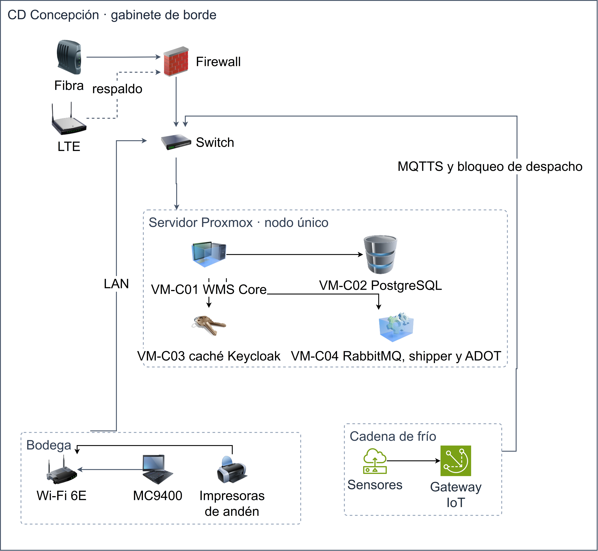

<!-- Fuente: Subdocumento_4_LateX/04_arquitectura_fisica/partes/06_e_sitio_secundario.tex — conversión fiel; editar el .tex y regenerar -->

## 4.3.2 Especificaciones Data Center Secundario

El Data Center Secundario sostiene la continuidad cuando la operación primaria no está disponible y garantiza la recuperación de la plataforma y de los datos con objetivos declarados de tiempo y de pérdida. La modalidad activo-pasiva se declara y justifica primero; luego se materializa en sitios de recuperación, replicación, objetivos RPO/RTO y procedimientos de conmutación y retorno.

En coherencia con el carácter híbrido obligatorio de la solución, hay dos sitios de recuperación: la región AWS us-east-1 para el dominio en nube y el gabinete de borde del centro de distribución de Concepción para el dominio on-premise. En ambos se sostienen los objetivos de continuidad de los servicios críticos: RTO ≤ 4 horas y RPO ≤ 15 minutos, probados al menos dos veces al año con conmutación real y con respaldo 3-2-1-1-0. Sobre esos objetivos se sostiene el compromiso contractual penalizable de ≥ 99,9 % mensual de la transacción de negocio de extremo a extremo. El desglose componente por componente de la réplica y de la política de respaldo se entrega en el Formulario T-11.

### 4.3.2.1 Modalidad del sitio secundario

La modalidad declarada es activo-pasiva en caliente: la región de recuperación mantiene una réplica reducida pero funcional de la plataforma que es escalable a carga completa durante la conmutación y que se promueve sólo ante la indisponibilidad de la región primaria. La elección se justifica frente a las alternativas, como exigen las Bases:

- Frente al activo-activo: duplica la infraestructura y exige reconciliación de doble escritura entre sitios sin beneficio medible para el volumen transaccional del caso, por lo que su costo y su complejidad operacional no se justifican.
- Frente a la recuperación en frío desde respaldos: exige reconstruir la plataforma y restaurar los datos antes de volver a operar, lo que no es compatible con el objetivo de continuidad de los servicios críticos.

El costo de la modalidad se acota porque la región secundaria no es una segunda producción: contiene solo los recursos que exige la recuperación. Estos son la réplica pasiva promovible del núcleo transaccional, la réplica reducida de aplicación que escala durante la conmutación y las copias de respaldo. El propio caso expresa este criterio al exigir declarar la región primaria y la secundaria.

### 4.3.2.2 Región o sitio de recuperación

La solución tiene dos sitios de recuperación, uno por dominio en coherencia con el carácter híbrido obligatorio: la región AWS us-east-1 para el dominio en nube y el gabinete de borde del CD Concepción para el dominio on-premise. La Tabla 4.3-3 compara ambos sitios en distancia y amenazas comunes:

**Tabla 4.3-3.** Sitios de recuperación: distancia y análisis de amenazas comunes
| Sitio de recuperación | Dominio que restituye | Distancia declarada | Análisis de amenazas comunes |
| --- | --- | --- | --- |
| Región AWS us-east-1 | Nube | ≈ 7.700 km de la región primaria sa-east-1 | Continente distinto y sin dependencia de la sismicidad ni de la malla eléctrica chilena y no comparte eventos de fuerza mayor con el sitio principal |
| CD Concepción (gabinete de borde) | On-premise | ≈ 200 km del CD Talca en línea recta, 250 km por carretera | Comparte con Talca la sismicidad de zona costera y el corte de la malla eléctrica nacional; esa exposición se mitiga con la independencia operacional de ambos sitios (operación autónoma 24 horas y alimentación protegida) y porque el dominio en nube no comparte esas amenazas |

La elección de la región us-east-1 como sitio de recuperación en nube y la habilitación de la recuperación ante desastres se declaran de forma incondicional. La transferencia internacional de datos personales que exige la continuidad se trata con los siguientes resguardos de la arquitectura de seguridad:

- Acuerdo de tratamiento con el proveedor de nube y cifrado en reposo y en tránsito extremo a extremo.
- Minimización: la región secundaria no se explota analíticamente ni se usa para consultas de negocio, solo para continuidad.
- Exclusión de los datos de geolocalización de personas de la replicación transfronteriza; permanecen solo en sa-east-1 y la exclusión se registra en el inventario de tratamientos.

En consecuencia, los objetivos de RTO y RPO no quedan supeditados a una aprobación futura.

La región secundaria contiene los recursos necesarios para la recuperación:

- La réplica de Aurora mediante Aurora Global Database y la réplica de DynamoDB mediante Global Tables.
- La copia de los buckets de S3 y las copias de AWS Backup.
- Una réplica reducida de la plataforma de aplicación que escala a carga completa durante una conmutación.

Dos capacidades quedan fuera de esa región por diseño: la analítica, porque la región secundaria no se explota analíticamente, y las consultas sobre datos de geolocalización de personas, que no se replican fuera de sa-east-1 conforme a los resguardos de residencia declarados.

Para la recuperación on-premise, el gabinete de borde del CD Concepción no está en espera: opera de forma autónoma todos los días con la tipología de borde operacional que fija el caso. Ante una contingencia que afecte solo a la bodega de Talca, asume la carga de esa bodega mediante la promoción controlada del motor de almacenes. El gabinete se dimensiona a su tipología mediante cuatro condiciones:

- Alimentación protegida con UPS y respaldo para la autonomía declarada.
- Climatización de precisión acorde al equipamiento del borde.
- Control de acceso.
- Monitoreo remoto integrado al NOC del sitio.

El listado componente por componente (cómputo, almacenamiento, enlace redundante y respaldo de alimentación) se entrega en el Formulario T-11. Los gabinetes de borde de los tres cross-docking no forman parte del sitio de recuperación; se especifican en el Formulario T-11 y su arquitectura se muestra en la Figura [2](02_a_emplazamiento.md#fig:crossdocking), sin repetir aquí la tipología.

La Figura [16](06_e_sitio_secundario.md#fig:cd-concepcion) muestra el gabinete de borde de Concepción y el equipamiento con que opera todos los días.

**Figura 16.** Gabinete de borde del CD Concepción

*Fuente: elaboración propia.*

La fibra es el enlace principal y el LTE lo respalda; ambos llegan a un par de firewalls en alta disponibilidad que termina el túnel hacia la nube. Detrás, dos switches de núcleo en stack conectan el servidor Proxmox de nodo único, que aloja cuatro máquinas virtuales: VM-C01 con el WMS, VM-C02 con PostgreSQL, VM-C03 con la caché de Keycloak y VM-C04 con RabbitMQ, el shipper y el colector ADOT. En la bodega, los terminales MC9400 y las impresoras de andén trabajan por Wi-Fi 6E contra el WMS local; en la cadena de frío, los sensores entregan sus lecturas al gateway IoT, que las publica por MQTTS y bloquea el despacho ante una excursión térmica. La figura muestra que Concepción ejecuta la misma pila de Talca en una sola máquina. Por eso puede asumir la bodega de Talca con la promoción controlada del motor de almacenes, sin instalar software nuevo durante la contingencia. Como sitio de recuperación, Concepción lleva en par los firewalls y los switches de núcleo; el servidor queda como punto único de falla aceptado, cubierto por la operación autónoma de 24 horas ante la pérdida del enlace y, ante su falla, por su reposición y la reconstrucción de la base local desde el estado central, al que Concepción ya entregó sus eventos por las colas (sección [4.2.5](02_c_conexiones.md#sec:conexiones)).

### 4.3.2.3 Replicación

La replicación de datos es continua hacia el sitio de recuperación en nube con medición y alertamiento del retraso de replicación. Cada dominio de datos alcanza el objetivo de punto de recuperación con su propio mecanismo, como resume la Tabla 4.3-4:

**Tabla 4.3-4.** Replicación y RPO por dominio de datos
| Dominio de datos | Mecanismo de replicación | RPO / retraso declarado |
| --- | --- | --- |
| Transaccional en nube (Aurora PostgreSQL) | Aurora Global Database hacia us-east-1 | $<$ 1 s |
| Telemetría (DynamoDB) | Global Tables | Continuo |
| Evidencia, documentos y respaldos (S3, AWS Backup) | Replicación de S3 entre regiones con control de tiempo | ≤ 15 min para el 99,99 % de los objetos |
| WMS on-premise (PostgreSQL de Talca) | AWS DMS por la VPN sobre el registro de escritura anticipada | ≤ 15 min con enlace |
| Mensajes críticos | Patrón outbox en base y cola | ≤ 15 min |
| Mensajes no críticos | Cola con reposición diferida | ≤ 24 h |

Todos los dominios críticos se replican de forma continua. El único dominio cuyo retraso de replicación depende de una condición externa es la réplica del WMS de Talca, ya que viaja por la WAN. Si Talca pierde simultáneamente sus dos caminos de enlace, el registro de escritura de VM-02 retiene los cambios que AWS DMS leerá al reconectar; la base local permanece autoritativa durante el corte y el retraso se mide de forma continua con alertas a los 5 y a los 15 minutos. Durante ese corte la copia remota del WMS queda desactualizada hasta un máximo de 24 horas, por lo que el RPO remoto de 15 minutos de esa réplica rige solo con enlace; el registro que el corte obliga a retener está dimensionado en la arquitectura de despliegue.

### 4.3.2.4 RPO y RTO

Los objetivos de continuidad de los servicios críticos son RTO ≤ 4 horas y RPO ≤ 15 minutos. La Tabla 4.3-5 resume los objetivos que gobiernan este sitio secundario y el compromiso sobre el que se miden.

**Tabla 4.3-5.** Objetivos de continuidad
| Activo | Objetivo | Valor declarado |
| --- | --- | --- |
| Servicios críticos | Tiempo de recuperación (RTO) | ≤ 4 h |
| Servicios críticos | Punto de recuperación (RPO) | ≤ 15 min |
| Transacción de negocio crítica de extremo a extremo | Disponibilidad mensual | ≥ 99,9 % |
| Infraestructura por componente | Disponibilidad mensual | 99,95 % |

Estos objetivos no dependen de aprobaciones ni de otros eventos futuros del CLIENTE. Su alcance tiene una precisión, que corresponde a la réplica remota del WMS durante un corte de enlace: mientras el sitio está aislado su base local es la fuente autoritativa y no pierde información, pero la copia en la nube no puede actualizarse hasta que el enlace vuelve, como se indicó en la replicación. El RPO de la sección anterior se verifica en las pruebas de recuperación que miden el RTO y el RPO efectivamente alcanzados.

### 4.3.2.5 Procedimiento de conmutación

El procedimiento de conmutación está documentado, automatizado en la mayor medida posible y es ejecutable por el personal del CLIENTE tras la transferencia de conocimiento. La conmutación de región separa lo reversible de lo irreversible: el enrutamiento hacia us-east-1 se conmuta de forma automática, pero su retorno automático queda deshabilitado: una vez promovida la base, el tráfico vuelve a la región primaria solo mediante el procedimiento de retorno, después de reconciliar. En cambio, la promoción de la base de datos rompe la replicación y obliga a reconciliar al volver, por lo que exige confirmación y autorización del CLIENTE. La Tabla 4.3-6 muestra la secuencia completa.

**Tabla 4.3-6.** Secuencia de conmutación de región
| Paso | Acción | Ejecución | Tiempo |
| --- | --- | --- | --- |
| 1 | Detección por verificación de salud de la región primaria | Route 53 | $<$ 5 min |
| 2 | Conmutación del enrutamiento hacia us-east-1 | Automática | — |
| 3 | Confirmación y autorización de la promoción | CLIENTE, con aviso por SNS | — |
| 4 | Promoción de Aurora en us-east-1 | Systems Manager Automation | 15–20 min |
| 5 | Escalado de la plataforma de aplicación a carga completa | Systems Manager Automation | $<$ 30 min |
| 6 | Restitución de Keycloak, API pública y privada y Verified Access | Systems Manager Automation | — |
| 7 | Actualización de DNS | Systems Manager Automation | 45–60 min |
| 8 | Reconexión del broker y sincronización del borde | Systems Manager Automation | — |
| 9 | Validación con escrituras de pedidos y sincronización | Operación | — |

Los pasos con tiempo declarado, ejecutados en serie y en el peor caso, suman cerca de 2 horas más el tiempo de la decisión, dentro del RTO de 4 horas. Solo el tercer paso requiere intervención humana; ahí reside la protección contra una conmutación innecesaria. Las transacciones se reabren solo tras la validación del noveno paso, porque el cambio de DNS no restituye por sí solo la identidad ni las API. Como los pasos cuarto a octavo están automatizados, el equipo de tecnologías de información del CLIENTE de cuatro personas puede ejecutar el procedimiento tras la transferencia de conocimiento, con el acompañamiento del servicio de operación del proyecto.

Cuando la contingencia afecta solo a la bodega de Talca, el plan de recuperación local promueve el motor de almacenes del CD Concepción, que opera de forma autónoma todos los días, con un RTO adicional de 1 a 2 horas dentro de la ventana de 4 horas. En esa contingencia local la identidad no requiere conmutación, porque su autoridad reside en la nube y las cachés locales son de solo lectura.

### 4.3.2.6 Procedimiento de retorno

Existe un procedimiento de retorno al sitio principal, documentado y probado, que incluye la reconciliación de los datos generados durante la contingencia. El retorno a la región primaria sigue seis pasos:

1. Resincronización con verificación de alcance.
2. Reconciliación de las transacciones de la contingencia contra la bitácora.
3. Transferencia de los eventos pendientes.
4. Conmutación coordinada del DNS.
5. Validación funcional.
6. Informe con el tiempo real empleado.

El procedimiento de retorno se prueba en cada ensayo de recuperación semestral, de modo que queda declarado y ejercitado.

### 4.3.2.7 Pruebas del plan de recuperación y respaldos

El procedimiento de conmutación y el de retorno se ensayan dos veces al año con conmutación real, incluidas escrituras de pedidos y sincronización en us-east-1; el RTO y el RPO medidos deben cumplirse en el 100 % de los ensayos. La inyección de fallas y la restauración mensual de respaldos se describen en la sección [4.2.4.6](11_j_despliegue.md#sub:6-verificacion-de-la-continuidad), y la política 3-2-1-1-0 con sus retenciones en la sección [4.2.4.5](11_j_despliegue.md#sub:5-respaldos-esquema-3-2-1-1-0-rnf-20-07).
