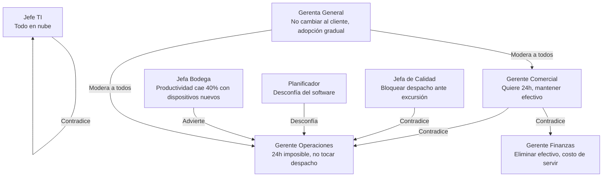

# Mapeo Detallado de Actores — Caso 02 Logística

> [!NOTE]
> Este documento amplía y detalla la tabla de actores de la §2.7 del [Informe.md](file:///c:/Users/henri/OneDrive/Documentos/Universidad%202026S2/FEP/Bases%20PTE/preliminar%20informe/Informe.md), identificando **todos** los actores y stakeholders mencionados en el [Caso 02](file:///c:/Users/henri/OneDrive/Documentos/Universidad%202026S2/FEP/Bases%20PTE/Caso_02_Logistica.md), las [Bases Administrativas](file:///c:/Users/henri/OneDrive/Documentos/Universidad%202026S2/FEP/Bases%20PTE/Bases%20Administrativas.md) y las [Bases Técnicas Transversales](file:///c:/Users/henri/OneDrive/Documentos/Universidad%202026S2/FEP/Bases%20PTE/Bases_Tecnicas_Transversales.md).

---

## 1. Actores Internos — Operacionales (en terreno, bodega y ruta)

Estos son los actores que interactúan directamente con la solución en el día a día operacional. Sus restricciones de contexto (frío, lluvia, sin señal, una sola mano) condicionan el diseño de interfaces y la arquitectura.

### 1.1 Preventista

| Atributo | Detalle |
|---|---|
| **Dotación** | 62 personas (proyección: 70 a 3 años) |
| **Fuente** | Caso 02: Cap. 2.4, §4.3, entrevista Sandra Riffo; RT-17.01 |
| **Régimen** | Jornada en terreno, lunes a sábado, rutas fijas con visita semanal o quincenal |
| **Rol** | Toma de pedidos en el punto de venta, gestión de cobranza delegada, observación de góndola, colocación de promociones |
| **Dolor principal** | Opera «a ciegas»: sin stock disponible, sin crédito del cliente, sin historial. App de 2016 sin soporte. Pedidos que no se envían o se duplican. Queda como «mentirosa» ante el cliente cuando falta stock |
| **Impacto en la solución** | Necesita app móvil con operación desconectada (turno completo sin señal), consulta de stock/crédito/historial, deduplicación determinista, canal para registrar observaciones comerciales |
| **Restricciones de diseño** | Trabaja de pie en la puerta del local, a la intemperie (lluvia, +34°C). Pantalla legible bajo sol directo. Tramos sin señal de hasta 2 horas (RT-13.08). No se le puede capacitar deteniendo la venta (RT-22.04) |
| **Relaciones** | → Cliente canal tradicional (cara visible), → Crédito y Cobranza (pedidos bloqueados sin aviso), → Bodega (quiebre de stock), → Gerente Comercial (su jefe directo) |

### 1.2 Conductor Repartidor Propio

| Atributo | Detalle |
|---|---|
| **Dotación** | 42 conductores + 42 peonetas = 84 personas |
| **Fuente** | Caso 02: Cap. 2.4, §4.6-4.7, entrevista Jonathan Curihual; RT-12.11 |
| **Régimen** | Salida 05:30-07:00. Jornada sujeta al régimen especial de conductores. Rutas de hasta 240 km |
| **Rol** | Transporte, entrega física, descarga, gestión de devoluciones en punto, cobro en efectivo, rendición al día siguiente, lectura manual de temperatura |
| **Dolor principal** | Circula con >$1M en efectivo. Guías se mojan/pierden. Sin protocolo ante local cerrado. Descarga con las dos manos (no puede operar dispositivo simultáneamente). Sin señal en rutas rurales |
| **Impacto en la solución** | Necesita app de reparto con operación desconectada (14h), prueba de entrega digital (firma + foto + geolocalización), registro de cobro en tiempo real, protocolo configurable ante incidencias |
| **Restricciones de diseño** | Dispositivo operable a una mano (RT-13.08). Sin señal hasta el regreso. Sincronización post-turno ≤10 min (RT-03.13). Objeción sindical a cámaras y GPS para control de jornada (Restricción N°10) |
| **Relaciones** | → Peoneta (dupla de trabajo), → Planificador de rutas (recibe la ruta), → Oficina de bodega/Caja (rinde guías y efectivo), → Cliente (entrega y cobra), → Sindicato |

### 1.3 Peoneta

| Atributo | Detalle |
|---|---|
| **Dotación** | 42 personas (1 por camión propio) |
| **Fuente** | Caso 02: Cap. 2.4, §4.6 (mención implícita: "el conductor y el peoneta descargan") |
| **Rol** | Acompaña al conductor en la descarga física, ayuda en la verificación del pedido con el cliente |
| **Dolor principal** | No mencionado explícitamente, pero comparte las condiciones del conductor: intemperie, carga física, sin protocolo ante incidencias |
| **Impacto en la solución** | Potencial usuario secundario del dispositivo de reparto (verificación de entrega cuando el conductor conduce). Debe considerarse en el dimensionamiento de usuarios y dispositivos |
| **Restricciones de diseño** | Mismas que el conductor: uso a una mano, intemperie, sin señal |
| **Relaciones** | → Conductor (dupla operativa), → Cliente (descarga) |

### 1.4 Conductor de Transportista Externo

| Atributo | Detalle |
|---|---|
| **Dotación** | ~160 personas de 10 empresas transportistas (54 camiones). Proyección: ~230 |
| **Fuente** | Caso 02: Cap. 2.4, Restricción N°6, §16.1 decisión N°5, RT-12.11, RT-12.12 |
| **Rol** | Realiza entregas con camiones que no son de Puelche. Mismo rol operativo que conductor propio, sin relación laboral directa |
| **Dolor principal** | No es trabajador de Puelche: rota sin aviso, no tiene correo corporativo, no se le puede obligar a capacitación. Su incorporación requiere acuerdo con cada transportista |
| **Impacto en la solución** | Autenticación sin correo corporativo. Dispositivos potencialmente compartidos. Onboarding simplificado. Mecanismo de identificación ante rotación sin aviso (decisión N°5 del Cap. 16) |
| **Restricciones de diseño** | Sin correo corporativo (RT-12.11). Rotación sin aviso. Capacitación requiere acuerdo con cada transportista (RT-22.04). No se puede controlar su dispositivo personal |
| **Relaciones** | → Empresa transportista (su empleador), → Planificador de rutas (recibe la ruta), → Oficina de bodega (devuelve guías), → Cliente |

### 1.5 Preparador de Pedidos

| Atributo | Detalle |
|---|---|
| **Dotación** | ~120 personas en turno nocturno (parte de las 310 de CD) |
| **Fuente** | Caso 02: Cap. 2.4, §4.5, entrevista Ximena Bravo; Restricción N°11 |
| **Régimen** | Turno nocturno 22:00 a 06:00. Rotación anual del 38% |
| **Rol** | Preparación física de pedidos (picking) con hoja impresa y transpaleta. Trabajan en bodega seca, refrigerado y congelado |
| **Dolor principal** | Alta rotación (gente nueva cada mes que no sabe dónde está nada). Faltantes sin causa registrada. Condiciones extremas en cámara de congelado (-22°C, 30 min por turno, sin señal). Dispositivos electrónicos fallan |
| **Impacto en la solución** | Necesita app de preparación con operación desconectada, captura de faltantes **con causa**, hardware resistente a -22°C. La solución no puede exigir entrenamiento prolongado (Restricción N°11) |
| **Restricciones de diseño** | Uso con guantes térmicos a -22°C (RT-13.08). Sin cobertura dentro de cámara de congelado (RT-03.24). Rotación 38% implica onboarding frecuente y simplificado. Turno nocturno: toda intervención debe considerar este horario |
| **Relaciones** | → Jefa de Bodega (supervisora), → Oficina de Bodega (transcriben faltantes), → Cargador (entrega pedido armado), → Planificador (secuencia de carga) |

### 1.6 Recepcionista de Bodega

| Atributo | Detalle |
|---|---|
| **Dotación** | No especificada (parte del personal de CD: 310 personas) |
| **Fuente** | Caso 02: §4.1, Anexo A (flujo recepción → sistema de gestión) |
| **Rol** | Recibe mercadería de proveedores en andén: cuenta contra guía en papel, verifica fechas de vencimiento por muestreo, anota lote (cuando lo hace), firma guía, ingresa al ERP en segunda digitación |
| **Dolor principal** | Doble digitación (papel → ERP). Registro de lote en campo de texto libre, discrecional, no validado. 41% de recepciones sin lote en el retiro. Filas de hasta 5 horas en temporada alta. Sin cita previa para proveedores |
| **Impacto en la solución** | Necesita app de recepción con captura estructurada de lote (obligatoria, validada, no texto libre), integración directa con ERP sin doble digitación, gestión de citas con proveedores |
| **Restricciones de diseño** | Operación en andén (ambiente de bodega con montacargas). Dispositivo con lectura de código de barras para captura de lote (RT-17.06) |
| **Relaciones** | → Proveedor (recibe su mercadería), → ERP (ingresa recepción), → Jefa de Calidad (trazabilidad de lote), → Jefe de Bodega (asignación de ubicación) |

### 1.7 Operario de Oficina de Bodega

| Atributo | Detalle |
|---|---|
| **Dotación** | No especificada (parte del personal de CD) |
| **Fuente** | Caso 02: §4.5, Anexo A (flujo faltantes → sistema de gestión) |
| **Rol** | Recibe hojas de picking del turno de noche, transcribe faltantes al sistema para ajuste de facturación, procesa ajustes de inventario del conteo cíclico |
| **Dolor principal** | Transcripción manual de faltantes sin causa. Ajustes de inventario al cierre del mes sin investigación. Punto de reingreso de datos propenso a error |
| **Impacto en la solución** | Este rol debería desaparecer parcialmente con la digitalización del picking (captura directa de faltantes con causa en el dispositivo del preparador) |
| **Relaciones** | → Preparador (recibe hojas de picking), → ERP/WMS (ingresa ajustes), → Facturación (ajuste de pedido) |

### 1.8 Cargador

| Atributo | Detalle |
|---|---|
| **Dotación** | No especificada (parte del personal de CD) |
| **Fuente** | Caso 02: §4.5 ("La carga se hace por orden de ruta invertido") |
| **Rol** | Carga los camiones en la madrugada (05:30-07:00) por orden inverso de ruta, para que la primera entrega quede accesible |
| **Dolor principal** | Depende de conocer la secuencia de la ruta del día, que reside en la planilla de Don Hugo. Si no la conoce, carga mal y las entregas se desordenan |
| **Impacto en la solución** | Necesita visibilidad de la secuencia de carga derivada de la planificación de rutas. Potencial punto de verificación de carga (confirmación de que lo cargado coincide con lo planificado) |
| **Relaciones** | → Planificador de rutas (recibe secuencia), → Preparador (recibe pedidos armados), → Conductor (entrega el camión cargado) |

### 1.9 Personal de Conteo Cíclico

| Atributo | Detalle |
|---|---|
| **Dotación** | No especificada (turno nocturno, parte del personal de CD) |
| **Fuente** | Caso 02: §4.2, Cap. 14.1 (3.400 posiciones/mes → 3.900) |
| **Rol** | Ejecuta conteo cíclico nocturno sobre 3.400 posiciones mensuales con planillas impresas |
| **Dolor principal** | Captura en papel + transcripción manual. Diferencia promedio 2,3%. Ajustes sin investigación de causa raíz |
| **Impacto en la solución** | Necesita dispositivo para conteo digital en punto de conteo, eliminando el ciclo papel → transcripción. Registro de causa de discrepancia |
| **Relaciones** | → Oficina de Bodega (transcribe resultados), → WMS/ERP (ajuste de inventario) |

---

## 2. Actores Internos — Gestión y Dirección

Estos actores definen las políticas, toman decisiones y consumen la información que la solución debe producir. No interactúan directamente con las interfaces operacionales, pero sus tensiones y contradicciones condicionan el diseño.

### 2.1 Gerenta General — Amparo Ossa Bulnes

| Atributo | Detalle |
|---|---|
| **Fuente** | Caso 02: Cap. 1, entrevista Cap. 8 |
| **Rol** | Tercera generación de la familia. Convocó la licitación. Define la visión estratégica del proyecto |
| **Posición clave** | «No me cambie al cliente». «Si el proyecto pasa por encima de las personas, ellos lo van a hundir sin decir una palabra» |
| **Impacto en la solución** | Toda funcionalidad dirigida al cliente del canal tradicional debe funcionar sin exigirle internet, dispositivo ni medio de pago electrónico. La estrategia de adopción y gestión del cambio es tan importante como la arquitectura |
| **Tensiones** | Reconoce que Don Hugo es el riesgo más grave aunque el comité lo considere menos urgente |

### 2.2 Gerente de Operaciones y Logística — Nelson Quinteros Aravena

| Atributo | Detalle |
|---|---|
| **Fuente** | Caso 02: Cap. 1, entrevista Cap. 8 |
| **Rol** | Responsable del OTIF, la flota, las bodegas y el despacho diario |
| **Posición clave** | «No me toquen el despacho de la mañana». «Un sistema indisponible en esa ventana equivale a un día sin operación». Dice que entrega en 24h «es imposible» |
| **Impacto en la solución** | La ventana 05:30-07:00 es sagrada: indisponibilidad cero. Necesita saber al final del día cuántas entregas se cumplieron, no al día siguiente |
| **Tensiones** | Contradice al Gerente Comercial (24h imposible). Se opone implícitamente al bloqueo automático de despacho por excursión térmica que pide Calidad |

### 2.3 Gerente Comercial — Rubén Salinas Fuentealba

| Atributo | Detalle |
|---|---|
| **Fuente** | Caso 02: Cap. 1, entrevista Cap. 8 |
| **Rol** | Supervisa a los 62 preventistas. Gestiona la relación con el canal moderno y la promesa de entrega |
| **Posición clave** | Quiere prometer 24h como el competidor. Defiende el cobro en efectivo (38% del canal tradicional). Alerta sobre las condiciones del canal moderno para 2029 |
| **Impacto en la solución** | La solución debe habilitar la promesa de entrega verificable. Debe soportar cobro en efectivo controlado, no eliminarlo |
| **Tensiones** | Contradice a Operaciones (24h posible vs. imposible). Contradice a Finanzas (mantener efectivo vs. eliminarlo) |

### 2.4 Gerente de Administración y Finanzas — Patricio Vergara Undurraga

| Atributo | Detalle |
|---|---|
| **Fuente** | Caso 02: Cap. 1, entrevista Cap. 8 |
| **Rol** | Control financiero, presupuesto, costeo logístico, rendición de efectivo |
| **Posición clave** | «¿Cuánto nos cuesta atender a un almacén de Empedrado que nos compra $45.000 cada dos semanas? No lo sabemos». Quiere costo total mes a mes, no costo de implementación barato con operación cara |
| **Impacto en la solución** | Modelo de costo de servir por cliente y por entrega, construido desde el hecho. Conciliación automática de rendición de efectivo. Indicadores financieros en tiempo real |
| **Tensiones** | Quiere eliminar/reducir el efectivo; Comercial dice que eso costaría 3.000 clientes |

### 2.5 Jefa de Calidad y Aseguramiento — Katherine Ñanco Millán

| Atributo | Detalle |
|---|---|
| **Fuente** | Caso 02: Cap. 1, entrevista Cap. 8 |
| **Rol** | Responsable de trazabilidad sanitaria, cadena de frío, cumplimiento regulatorio |
| **Posición clave** | Vivió los 9 días del retiro. Quiere registro continuo de temperatura y bloqueo automático ante excursión. Pide que se defina la regla de excursión térmica (hoy inexistente) |
| **Impacto en la solución** | Trazabilidad lote-a-lote obligatoria. Sensores IoT de temperatura. Regla de excursión configurable. Bloqueo/alerta de despacho |
| **Tensiones** | Contradice a Operaciones (bloqueo automático vs. no detener el despacho) |

### 2.6 Jefa de Bodega — Ximena Bravo Cortés

| Atributo | Detalle |
|---|---|
| **Fuente** | Caso 02: entrevista Cap. 8, §4.2, §4.5 |
| **Rol** | Supervisora del turno nocturno de preparación. Decide el destino de devoluciones (producto por producto, sin registro estructurado). Conoce las limitaciones reales del picking |
| **Posición clave** | «Si mañana me ponen un aparato en la mano de una persona que entró hace tres días, me van a bajar la productividad un 40% la primera semana». Las ubicaciones están mal asignadas desde 2013 |
| **Impacto en la solución** | Slotting dinámico. Registro de causa de faltante. Registro estructurado de destino de devoluciones. Onboarding simplificado para alta rotación. Capacitación en turno nocturno |
| **Relaciones** | → Preparadores (supervisión), → Oficina de Bodega (faltantes), → Calidad (temperatura en cámara) |

### 2.7 Planificador de Rutas — Hugo Maldonado Sepúlveda

| Atributo | Detalle |
|---|---|
| **Dotación** | 1 persona (con ayudante no nombrado) |
| **Fuente** | Caso 02: §4.4, entrevista Cap. 8, decisión N°16 del Cap. 16 |
| **Antigüedad** | 21 años. Se jubila en 2 años |
| **Rol** | Asignación diaria de ~1.400 entregas a 96 camiones. 3,5 a 4 horas diarias (15:00-18:30). Planilla de 11 hojas que nadie más entiende |
| **Dolor principal** | Todo el conocimiento crítico (puentes, horarios de clientes, preferencias de conductor, caminos en mal estado) reside en él y en su memoria |
| **Posición clave** | «Que el sistema me proponga y yo pueda corregir. No que me imponga». Desconfía del software de rutas. Quiere datos de peso/volumen por producto |
| **Impacto en la solución** | Captura y digitalización de su conocimiento tácito antes de la jubilación. Sistema de ruteo que proponga y permita correcciones registradas. Cada corrección debe «enseñar» al sistema |
| **Relaciones** | → Ayudante (suplente inferior), → Conductores (reciben la ruta), → Cargadores (secuencia de carga), → Gerente de Operaciones |

### 2.8 Ayudante del Planificador

| Atributo | Detalle |
|---|---|
| **Dotación** | 1 persona |
| **Fuente** | Caso 02: §4.4 ("las rutas las arma su ayudante y el cumplimiento cae entre 6 y 9 puntos") |
| **Rol** | Suplente del planificador durante vacaciones. No domina la planilla ni el conocimiento tácito |
| **Impacto en la solución** | Será el usuario principal post-jubilación de Hugo. La solución debe permitirle operar sin perder 6-9 puntos de OTIF |

### 2.9 Jefe de Abastecimiento / Compras

| Atributo | Detalle |
|---|---|
| **Fuente** | Caso 02: §4.1, Anexo A |
| **Rol** | Mantiene la planilla de sugerencia de reposición (venta de 8 semanas + ajuste manual por temporada). Genera órdenes de compra en el ERP. Las promociones no entran en el cálculo |
| **Impacto en la solución** | Necesita sistema de sugerencia de reposición que considere venta real, estacionalidad, promociones y plazo de proveedor. Debe reemplazar la planilla local |
| **Relaciones** | → Comercial (promociones que no siempre avisa), → Proveedores (órdenes de compra), → Recepcionista (coordina recepciones) |

### 2.10 Jefe de Tesorería / Cajero

| Atributo | Detalle |
|---|---|
| **Fuente** | Caso 02: §4.7, Anexo A |
| **Rol** | Recibe rendición de efectivo de conductores a la mañana siguiente. Concilia conteo manual contra listado de entregas. Resuelve diferencias «conversando» |
| **Impacto en la solución** | Conciliación automatizada de rendición en tiempo real (no al día siguiente). Clasificación de discrepancias. Registro de causa de cada diferencia |
| **Relaciones** | → Conductores (rinden efectivo), → Finanzas (reporta diferencias) |

### 2.11 Equipo de Crédito y Cobranza

| Atributo | Detalle |
|---|---|
| **Dotación** | 5 personas |
| **Fuente** | Caso 02: §4.3, §4.7, Anexo A |
| **Rol** | Revisa pedidos bloqueados por crédito (al día siguiente). Gestiona cobranza de facturación a 30 días por teléfono (listado semanal del ERP) |
| **Dolor principal** | Revisión al día siguiente sin notificación al preventista ni al cliente. El cliente se entera del bloqueo cuando reclama |
| **Impacto en la solución** | Validación de crédito en tiempo real (visible para el preventista). Notificación automática ante bloqueo. Gestión de cobranza integrada |
| **Relaciones** | → Preventista (bloqueo sin aviso), → Cliente (reclamo), → ERP (estados de cuenta) |

### 2.12 Jefe de Tecnologías de Información — Eduardo Kaufmann Vial

| Atributo | Detalle |
|---|---|
| **Dotación** | 4 personas (él + 2 soporte + 1 analista) |
| **Fuente** | Caso 02: Cap. 2.4, Restricción N°9, entrevista Cap. 8 |
| **Rol** | Mantiene toda la infraestructura: ERP, red de 5 instalaciones, computadores, teléfonos, «lo que se caiga» |
| **Posición clave** | «Si el sistema necesita un administrador dedicado, díganlo ahora y cotícenlo, porque no lo tengo». Prefiere nube. No tiene documentación de interfaces del ERP. Le preocupa la protección de datos |
| **Impacto en la solución** | Toda función operacional/soporte que requiera especialista debe ofrecerse como servicio externo costeado. Levantamiento de interfaces del ERP es trabajo del adjudicatario |
| **Relaciones** | → Todos los sistemas, → Proveedor de telemetría (sin claridad contractual), → Adjudicatario (transferencia operacional) |

### 2.13 Área Comercial / Supervisores de Preventa

| Atributo | Detalle |
|---|---|
| **Dotación** | Parte de las 184 personas de administración y soporte |
| **Fuente** | Caso 02: §4.1, §4.3 |
| **Rol** | Coordinan promociones, definen rutas de preventa, supervisan a los 62 preventistas. Comunican (o no) las promociones a Compras |
| **Impacto en la solución** | Integración de promociones en la sugerencia de reposición. Visibilidad sobre desempeño de preventistas. Paneles de gestión comercial |

### 2.14 Personal del Centro de Distribución de Concepción

| Atributo | Detalle |
|---|---|
| **Fuente** | Caso 02: Cap. 2.3, §4.2 |
| **Rol** | Opera el CD de 9.000 m² sin WMS (control por planilla), sin congelado, en dos turnos. Depende de Talca para parte del surtido |
| **Impacto en la solución** | Si se decide extender/reemplazar el WMS de Talca, Concepción debe cubrirse. Conectividad sin respaldo (un corte = incomunicado). Nodo on-premise con operación desconectada |

### 2.15 Personal de Plataformas de Cross-Docking

| Atributo | Detalle |
|---|---|
| **Dotación** | Personal reducido en 3 plataformas (Curicó, Chillán, Los Ángeles) |
| **Fuente** | Caso 02: Cap. 2.3, Cap. 3, Cap. 6 |
| **Rol** | Recepción en madrugada del camión de línea desde Talca, desconsolidación y despacho en ventana de 3 horas |
| **Impacto en la solución** | Conectividad solo por red móvil (en Los Ángeles, intermitente en madrugada). Sin almacenamiento. Gabinete de borde (RT-06.01). Operación desconectada necesaria |

---

## 3. Actores Externos — Directos

Actores fuera de la organización que interactúan con la solución o son impactados por ella.

### 3.1 Cliente del Canal Tradicional

| Atributo | Detalle |
|---|---|
| **Dotación** | 11.600 almacenes y minimarkets |
| **Fuente** | Caso 02: Cap. 2.2, Restricción N°5, entrevista Amparo Ossa; RT-12.12 |
| **Perfil** | Personas naturales, sin internet, sin dispositivo propio, pagan en efectivo, espacio reducido para recibir. No van a cambiar |
| **Interacción con la solución** | Reciben al preventista (pedido), al conductor (entrega + cobro). Firman guía. Eventualmente podrían usar portal de autoatención (RT-16.30) o recibir notificaciones por SMS/WhatsApp (RT-16.21) |
| **Restricción crítica** | **La solución no puede exigirles nada** (Restricción N°5). Es la condición más enfatizada en todo el caso |

### 3.2 Cliente del Canal Moderno (Cadenas y Supermercados)

| Atributo | Detalle |
|---|---|
| **Dotación** | 500 puntos de entrega. El principal = 11% de ventas |
| **Fuente** | Caso 02: Cap. 1, §9.9; RT-12.12 |
| **Perfil** | Exigencias formales: pedidos electrónicos (EDI), aviso de despacho, ventana de 30 min, prueba de entrega digital, penalización por incumplimiento |
| **Fecha límite** | Enero 2029: si no se cumple, pérdida del 11% de ventas |
| **Impacto en la solución** | Mensajería electrónica estructurada (formato por cadena). Portal autenticado (RT-16.30). Cumplimiento de ventanas estrechas |

### 3.3 Cliente de Food Service

| Atributo | Detalle |
|---|---|
| **Dotación** | 2.100 restaurantes, casinos y hoteles |
| **Fuente** | Caso 02: Cap. 2.2 |
| **Perfil** | Sensibles a frescura y puntualidad. Rechazó camión completo por sospecha de ruptura de cadena de frío ($21M) |
| **Impacto en la solución** | Evidencia de cadena de frío disponible para el cliente. Ventanas de entrega más exigentes que el canal tradicional |

### 3.4 Proveedores (180 activos)

| Atributo | Detalle |
|---|---|
| **Dotación** | 180 (proyección: 200) |
| **Fuente** | Caso 02: Cap. 2.2, §4.1, Cap. 12; RT-12.12 |
| **Interacción actual** | Confirman órdenes por correo electrónico. Avisos de despacho en formatos heterogéneos. Llegan sin cita previa (salvo 3 grandes) |
| **Impacto en la solución** | Portal autenticado para proveedores (RT-16.30). Recepción con cita previa. Trazabilidad de lote exigida desde la recepción. Integración electrónica con los principales |

### 3.5 Proveedor de Lácteos (el del retiro)

| Atributo | Detalle |
|---|---|
| **Fuente** | Caso 02: Cap. 1 |
| **Perfil** | Representa 6% de las ventas. Suspendió a Puelche por 6 meses. Exige capacidad de trazabilidad certificada como condición para restablecer la relación |
| **Fecha límite** | Septiembre 2026 (vencimiento de suspensión) |
| **Impacto en la solución** | Es el driver original de la licitación. La trazabilidad lote-a-lote debe estar operativa antes de esta fecha |

### 3.6 Empresas Transportistas (10)

| Atributo | Detalle |
|---|---|
| **Dotación** | 10 empresas, 54 camiones (10 con equipo de frío), ~160 conductores |
| **Fuente** | Caso 02: Cap. 2.3, Restricción N°6, RT-22.04 |
| **Perfil** | Puelche no controla ni los vehículos ni a sus conductores. Cada transportista tiene su propia organización |
| **Impacto en la solución** | Negociación técnica para incorporar conductores y vehículos. Portal autenticado para transportistas (RT-16.30). Integración de la telemetría de sus camiones (hoy no cubiertos) |

### 3.7 Proveedor de Telemetría de Flota

| Atributo | Detalle |
|---|---|
| **Fuente** | Caso 02: Cap. 5, Anexo A |
| **Perfil** | Provee posición y velocidad de 42 camiones propios en su propia plataforma. Consulta manual en portal. Los 54 camiones de transportistas no están cubiertos |
| **Impacto en la solución** | Integración con su plataforma (sin claridad contractual sobre acceso a datos). Los camiones de terceros son un vacío |

### 3.8 Proveedor del ERP (partner 2017)

| Atributo | Detalle |
|---|---|
| **Fuente** | Caso 02: Cap. 5, entrevista Eduardo Kaufmann |
| **Perfil** | «Ya no trabaja con nosotros». No hay documentación de interfaces |
| **Impacto en la solución** | Levantamiento de interfaces del ERP es riesgo alto. Debe contemplarse en el cronograma y en el plan de riesgos |

### 3.9 Sindicato de Conductores

| Atributo | Detalle |
|---|---|
| **Fuente** | Caso 02: Restricción N°10, Cap. 16 decisión N°13 |
| **Perfil** | Objetó formalmente la instalación de cámaras en cabina y el control de jornada por GPS |
| **Impacto en la solución** | Cualquier propuesta con cámaras o GPS para control de jornada debe incluir plan explícito de gestión del cambio y negociación sindical. Riesgo de bloqueo del proyecto |

---

## 4. Actores Institucionales y Reguladores

No interactúan con la solución, pero sus exigencias condicionan su diseño.

### 4.1 Autoridad Sanitaria

| Fuente | Caso 02: Cap. 1, §4.9, Cap. 12 |
|---|---|
| **Rol** | Abrió sumario sanitario en marzo 2026. Observó formalmente la ausencia de registro continuo de temperatura |
| **Impacto** | Trazabilidad lote-a-lote, registro continuo de temperatura, capacidad de retiro en horas |

### 4.2 Autoridad Tributaria (SII)

| Fuente | Caso 02: Cap. 12, Restricción N°12 |
|---|---|
| **Rol** | Rige los documentos tributarios electrónicos (guía de despacho, factura, nota de crédito, acuse de recibo) |
| **Impacto** | La solución no emite documentos tributarios (lo hace el ERP). Pero la prueba de entrega debe articularse con la guía electrónica y su acuse de recibo |

### 4.3 Agencia de Protección de Datos Personales

| Fuente | Art. 4.2 BA, Ley 21.719 |
|---|---|
| **Impacto** | Tratamiento de datos de 14.200 clientes (personas naturales), datos de geolocalización de preventistas y conductores |

### 4.4 Agencia Nacional de Ciberseguridad

| Fuente | Art. 4.2 BA, Ley 21.663 |
|---|---|
| **Impacto** | Estándares mínimos de protección, notificación de brechas en 24h, modelo Zero Trust |

---

## 5. Actores del Proyecto (proceso de licitación e implementación)

### 5.1 Comité Ejecutivo del CLIENTE

| Fuente | Caso 02: Cap. 1, Cap. 13 |
|---|---|
| **Composición** | Gerenta General + Gerente de Operaciones + Gerente Comercial + Gerente de Finanzas |
| **Rol** | Aprobó la licitación. Define prioridades. Evalúa propuestas. Toma decisiones escaladas |

### 5.2 Contraparte Técnica del CLIENTE

| Fuente | Bases Administrativas: Art. 15° |
|---|---|
| **Rol** | Coordina la ejecución contractual. Valida entregables. Aprueba marchas blancas y pasos a producción |

### 5.3 Comisión Evaluadora / Comisión de Expertos

| Fuente | Bases Administrativas: Título V |
|---|---|
| **Rol** | Evalúa las propuestas técnicas según los criterios del Cap. 19 del Caso 02. Juzga comprensión del problema, arquitectura, plan de trabajo y coherencia interna |

### 5.4 Equipo del ADJUDICATARIO

| Fuente | Bases Administrativas: Art. 11°, 12°; Caso 02: Cap. 17 |
|---|---|
| **Rol** | Implementa la solución. Transfiere la operación. Provee soporte por 36 meses |
| **Restricción** | Debe contemplar presencia en bodega en turno nocturno, acompañamiento en ruta, y traslado a 6 instalaciones en 4 regiones separadas por 340 km |

### 5.5 Fondo de Inversión Regional (18% de propiedad)

| Fuente | Caso 02: Cap. 2.1 |
|---|---|
| **Rol** | Socio minoritario. No se menciona su participación directa, pero como propietario del 18% tiene voz en decisiones de inversión de esta magnitud |

---

## 6. Resumen Consolidado

| Categoría | Cantidad de actores | Personas involucradas |
|---|---|---|
| **Internos Operacionales** | 15 tipos | ~580 personas propias + ~160 de terceros |
| **Internos de Gestión** | 13 tipos | ~60 personas |
| **Externos Directos** | 9 tipos | 14.200 clientes + 180 proveedores + 10 transportistas |
| **Reguladores** | 4 entidades | — |
| **Actores del Proyecto** | 5 tipos | Variable |
| **TOTAL** | **46 actores identificados** | **~800 usuarios directos + 14.200 puntos de entrega** |

> [!TIP]
> El informe actual (§2.7) lista 11 actores. Este mapeo identifica **46 actores distintos**. Los 35 actores faltantes más relevantes para incorporar al informe son:
> - **Peoneta** (42 personas, opera en dupla con el conductor)
> - **Recepcionista de bodega** (punto crítico de trazabilidad de lote)
> - **Cargador** (depende de la secuencia de ruta)
> - **Operario de oficina de bodega** (transcripción manual, rol que debería desaparecer)
> - **Ayudante del planificador** (futuro usuario principal)
> - **Jefe de abastecimiento** (dueño de la planilla de reposición)
> - **Jefe de tesorería** (rendición de efectivo)
> - **Equipo de crédito y cobranza** (5 personas, bloqueo sin notificación)
> - **Jefa de bodega** (supervisora del turno nocturno, decisora de devoluciones)
> - **Empresas transportistas** (10, como entidad separada de sus conductores)
> - **Proveedor de lácteos** (driver de la licitación, fecha límite sept. 2026)
> - **Sindicato de conductores** (objeción formal a tecnologías)
> - **Cliente food service** (sensibilidad a cadena de frío)
> - **Personal de cross-docking** (condiciones únicas de conectividad)
> - **Personal de CD Concepción** (opera sin WMS)

---

## 7. Matriz de Tensiones entre Actores

Las entrevistas del Cap. 8 revelan contradicciones explícitas entre actores que la solución debe arbitrar:

| Tensión | Actor A | Actor B | Posición A | Posición B |
|---|---|---|---|---|
| **Plazo de entrega** | Gerente Comercial | Gerente Operaciones | 24h como el competidor | Es imposible |
| **Bloqueo por temperatura** | Jefa de Calidad | Gerente Operaciones | Bloqueo automático | No puede caerse el día |
| **Efectivo** | Gerente Comercial | Gerente Finanzas | Mantener (3.000 clientes pagan así) | Eliminar/controlar ($4,2M/mes) |
| **Nube vs. on-premise** | Jefe TI | Él mismo + Operaciones | Prefiere nube (4 personas) | Cortes de fibra = sin operación |
| **Software de rutas** | Gerente Operaciones | Planificador | Lo da por hecho | Desconfía (no conoce los puentes) |
| **Dispositivos en bodega** | — | Jefa Bodega | Digitalización necesaria | -40% productividad primera semana |

> [!IMPORTANT]
> Estas tensiones **no se resolverán antes de la adjudicación** (Cap. 8, nota al cierre). La propuesta debe proponer una arquitectura que permita convivir con ellas y registrar cada decisión con su costo.
